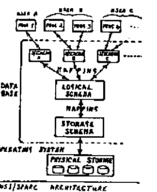

by David Livingstone
{ .byline }

## Introduction

The purpose of this article is to suggest that :

- APL should have major extensions, added in a relatively short time.
- this should be achieved through new international standards for APL.

## Why APL should be significantly extended

We are presently in a period of rapid development of computer languages. There are new languages for new areas (eg PROLOG for Expert Systems), new types of languages (eg Functional Languages, Query Languages, Graphics Languages), as well as new languages to replace old languages (eg ADA to replace COBOL, PASCAL to replace FORTRAN). There are also many packages (eg Word Processors, Spreadsheets, File-handling Packages, Expert System Shells) that are effectively specialised languages yielding high programmer productivity. Some even integrate several erstwhile language areas (eg Framework, Symphony, Mimer).

A major objective of all these is to obtain higher programmer productivity by some means or other. The so-called Fourth Generation Languages (= 4GL) are explicitly aimed at this, and claim to give much higher programmer productivity than other languages. Since high productivity has always been APL’s main strength, it ought to be very successful. (Is APL of too venerable an age for the label “Fourth Generation” to be comfortable?)

However, currently APL is largely ignored by the computing world. It is ignored by academics because it does not conform to their accepted ideas of what constitutes a good language. It is ignored by industry because for most of the part it has been too inefficient a user of hardware; and recently it has not been marketed extensively as a 4GL.

Will APL survive in this environment in the long-term (10-15 years), given the great pace of language development? I believe to do so the best approach is to aim to make APL the “COBOL of the future”, the language that is normally used by most people for most tasks. To achieve this:

- APL must incorporate major extensions, which confer a significant increase in power and value to APL.
- The extensions must be such as to bridge the gap which has cut APL off from both academics and industry, and bring APL into the mainstream of the computing world; otherwise APL will still not be a commonly accepted language. At the same time, it must not lose the essential nature and characteristics of APL.
- The extensions must be added in a relatively short time, to compete in the marketplace.

In the author’s view this means pursuing the following 3 strategies :–

1. The extensions must enhance APL as a high productivity programming tool. Since such a language provides real benefits to the user, industrial users will be receptive to it. The big increase in sales of 4GLs and high productivity packages indicates the desire of the market to use such tools. As APL already provides high productivity in the programming language area, much of the enhancement will have to come from integrating other computer language areas into APL, e.g. database. This approach is already well established with packages such as Framework and Mimer. (Technically packages and languages are similar, the difference being one of emphasis; a package usually has a more specialised application than a language).
2. The extensions should incorporate some of those concepts of computer science that academics think are essential to a modern computer language – eg data types and loop constructs. There is a tendency in the APL community to reject ideas thought valuble elsewhere in computing, because their conventional application does not fit the APL philosophy. Nevertheless some of these concepts can be cast in a form consistent with APL, and to do so would make APL more appealing to academics.
3. Extensions must be based on generalisations of existing APL language principles or on principles which fit harmoniously with APL. The “extended APL” must not be a collection of bits and pieces just glued together. A “collection” leaves the problem of having to learn different styles and syntax for each area, and to design the linkages between the areas for each application. To overcome this, the whole language must be one integrated and unified whole. It would also ensure that “extended APL” had those characteristics that make current APL attractive to its users.

## Extensions to APL

To illustrate the extensions (in addition to Nested Arrays) referred to above, a few suggestions are included here :–

1. Michael Crick (see reference 1) has proposed that APL be generalised into an object-orientated language. This means that insted of having several totally different categories of object – functions, arrays, workspaces, groups, etc – there is only one kind of object in APL. The variety of different things in the language is achieved by having sub-categories of the one kind of object; where necessary, a sub-category can be split into sub-sub-categories, and so on hierarchically down. This means that all objects in APL have a set of properties in common. Each sub-category has some extra properties peculiar to itself.

    The benefit of this is that APL is simplified, becomes easier to learn and use, and gains flexibility through the removal of anomalies: i.e. greater programmer productivity. For example, arrays would be able to hold functions, or collections of functions and data; a workspace is just an array of functions and (nested) arrays; a workspace can be held as an element of an array, and hence manipulated like an array, giving greater power over workspaces while removing their special commands like “)COPY”. (See reference 1 for further details.)

    Since object-orientated languages (e.g. Smalltalk) are of great interest to the academic community, it would make APL more acceptable to academics.

2. APL is basically a logical language. That is to say, when writing an APL expression, the programmer is specifying conceptually what is to be done rather than how the computer should physically execute it. Nevertheless in practice, people learn how APL executes expressions and will adjust their code accordingly. Likewise programmers may store data in files rather than workspaces because of the physical differences in their implementation. It is proposed that the physical and logical aspects are separated out, using a layered structure based on that of the ANSI/SPARC architecture used for databases and illustrated in the figure; see also reference 2.

    

    The ANSI/SPARC architecture is an academically sound and accepted way of designing Database Management Software. It allows one to specify a set of database relations (say) as the “Logical Schema” or design of the database, and separately specify the “Storage Schema” or files in which the relations are to be stored. The Storage Schema may be continually altered to optimise machine performance while the Logical Schema remains constant. Consequently programs using the database are insulated from any file changes. Furthermore the ANSI/SPARC architecture permits different programs to have different views of the Logical Schema, ie different Sub-schemas. This allows one program to change its Sub-schema while insulating other programs using the same database from having to change theirs to match it.

    If this same structure were to be introduced into APL, the analagous benefits would accrue. A large data array could be held physically as a program array (the normal APL method) or a disc file of any type; the normal logical APL code would remain the same regardless of how it is stored or if the storage method were changed. One would just change the mapping of the logical object onto its physical storage. Similarly it would be possible to map one set of logical code onto another set of logical code; this would permit a simple but crude algorithm to be mapped onto a more sophisticated and efficient algorithm; the latter would be what was executed but the former used as a simple overall description of what logically was to be achieved. If no mapping were specified, the APL code would be unchanged from its current form where the interpreter (or compiler) automatically maps between the logical and physical states.

    This facility would be of great practical benefit in prototyping an application. An initial prototype could be quickly developed to show the user and refine the system specification; later an efficient production version could be developed from it by modifying the physical data storage and/or algorithms with the minimum of code changes. This reduces both the work required and risk of introducting new bugs into reworked code.

    This architecture would also provide a framework into which numerous of the current ad-hoc techniques for improving machine efficiency (e.g. Auxiliary Processors (see reference 3), special External Variables (reference 4)) could be put to achieve a coherent approach (see reference 5).

3. The above extensions will create a large part of the infrastructure of a database system. The third extension should be to explicitly add APL primitives, concurrent processing and security facilities in order to incorporate into APL a Relational Database using Relational Algebra. Such a database (with algebra not calculus) has a philosophy and principles which correspond directly to those of APL (see 6), and this extension would fit harmoniously with it. The author already has a research project nearing completion which demonstrates their natural integration – reference 7.

    Already many 4GLs are based on databases rather than programming languages, and there is no doubt that data storage and retrieval are equally as vital to a general-purpose application development system as are data manipulation and calculation. This extension would allow APL to have “a foot in both camps”.

    The extension would yield significant programmer productivity. The development of many general-purpose Query Languages based on databases clearly demonstrates the practical need to integrate the programming and database areas. Relational Databases are well established academically, and there is far more academic agreement on what constitutes a basic set of Relational Algebra functions than there is for the equivalent Relational Calculus.

4. There is much academic and industrial support for the “Programmer’s Workbench” concept, because of its productivity benefits. The Programmer’s Workbench is an integrated set of tools to support the programmer in developing software. There are many views on what should constitute a workbench. The important point here is to specify a framework and philosophy so that a coherent set of tools can be developed which integrate with APL. They should build on the workbench tools that already exist in APL: e.g. the workspace Symbol Table should be extended into a Data Dictionary so that other useful information about variables and functions could be held and easily referenced by the programmer.

    The workbench is part of the environment in which the language operates. Integration of environment and language is already important in APL and should continue to be so – see 8.

    Some workbench facilities can be precisely specified in a language; others can only have an interface to internal system variables and functions defined, leaving the implementer free to develop them in as creative a manner as he thinks fit. The following are a few suggestions for workbench tools:

    - A compiler. It would be useful to define the specific interface and functional arguments for a compiler; e.g. how is source as opposed to object code referenced?
    - Language checking software. Most languages have code checking built into their compilers. Given that most future APL applications will still be debugged using an interpreter, it is better to separate checking and compiling. All sorts of possibilities suggest themselves here, including eventually software to annotate and document functions automatically. Here a language standard should give the implementer freedom to develop ideas.
    - The representation of APL objects (e.g. keywords, symbols) should be separated from APL itself. The aim would be to allow the input and display of APL software using APL symbols, keywords or any other desired representation (while leaving APL syntax unchanged), varying the representation in one session if desired. This would allow the use of non-APL keyboards, give the freedom to exploit future I/O technology, and provide the opportunity to release APL from the “Chinese Pictogram Syndrome” where its vocabulary of primitives expands beyond the limits of representation by a reasonable set of symbols. An input interface could be standardised, with an associated standard describing the current symbols (plus in future other alternative standards to the latter?).

5. The functional equivalents of the loop and IF/CASE control constructs found in other programming languages, plus logical data typing, should be added to APL. They would increase programmer productivity, but more importantly give academic and industrial respectability to APL by providing it with what are seen as basic essentials in a modern programming language.

    Samson (reference 9) and Backus (10) have demonstrated that the control constructs can be implemented in a functional manner in keeping with APL and quite different from conventional notation, while still providing the power of these constructs.

    The APL equivalent of data typing is the concept of domains. This should be extended to allow a programmer to associate with a variable a specific domain-set of values rather than be limited to just the 2 primitive domains, numbers and characters. These domains would be defined by enumeration (all possible values are held in an array) or conditions (these are executed by a function). The array or function would be “assigned” to a variable as its domain. This is like ADA and PASCAL user-defined types, but much more powerful since the full power of APL can be used to create a type/domain. Only an extra “domain-assign” function is essential. Such domains (equivalent to those in Relational Databases) would provide powerful data validation and debugging facilities.

## The role of the Standards bodies in extending APL

The APL standard which hopefully will soon be ratified, is designed to establish the basics of APL. It is deliberately intended not to be controversial, but to specify the “Lowest Common Denominator”, the established practice of existing APL systems. This is a wise approach because it is the first standard to be created despite the language having been in use for twenty years. It is a tribute to Iverson’s design that the basics have remained the same for so long without a standard.

One possibility for further progress is to proceed from this standard in a bottom-up fashion, adding in a piece-meal way those specific facilities (e.g. error trapping) that are coming into common use.

In the author’s view the real need is to look ahead and make a strategic decision as to how APL should develop in the future, a top-down approach, not bottom-up. The above sections have tried to show that several very large scale extensions are required, and in a relatively short time, if APL is not to decline into disuse. Even if the APL community disagrees with this view, or the particular large-scale extensions suggested here, it is still important to make an explicit strategic decision on where APL goes from here. No major extensions are likely to arise in an agreed fashion without it, as the saga of nested arrays demonstrates only too clearly. If APL were to be developed in a limited bottom-up fashion, a de-facto strategic decision would implicitly have been taken to do this, and it would be better if this were made clear to all interested parties.

The only real forum for discussion among the APL community appears to be the ISO Standards organisation and the associated national standards bodies. Therefore after completing the present standard, their next task should be to promote proposals and discussion on this topic *and* make the final strategic decision on APL’s future. Were the APL software vendors to form their own private association to do this, it would be inadequate because it would have no user representation. APL users are not really in a position to form such an association, with or without the software vendors. An extra advantage of the standards bodies taking up this job is that the conclusions they reach will carry considerable weight with all concerned, which is not necessarily true of any alternative organisations.

Having taken a strategic decision, the standards bodies should then take a very proactive approach to developing standards for all the extensions, be they great or small, required to fulfill the decision.

If things are left as they are, APL software vendors will naturally develop their products vigorously to compete and become successful. (They would be foolish to do otherwise). The case of nested arrays shows that these developments are as likely to diverge as to converge on a common standard, even when the extension is supposedly the same thing from all vendors; or they will be IBM-compatible extensions because of IBM’s clout in the
marketplace. The “Lowest Common Denominator” policy will not work with nested arrays because incompatible versions have been developed. A standards body will either have to choose one implementation or create a new one, which presumably would be a compromise of some kind. This is likely to be very difficult, contentious and time-consuming, with many APL people in entrenched positions. If this were to happen with every new extension, progress would be very slow if not impossible.

Thus the standards bodies should pre-empt these problems by moving ahead of the implementors and creating standards which form targets for the implementors to aim at. This would follow on as a natural consequence of the standards bodies deciding on APL’s future development strategy.

There would be nothing new or remarkable about the standards bodies doing this. The ISO Standards organisation has for a number of years been developing the “Open Layer Reference Model”. This is a large and comprehensive set of data network standards, built on a layered architecture of seven layers. It is very forward-looking and a major creative exercise, producing something which is very complex and sophisticated, although manufacturers’ existing protocols have been utilised where appropriate. All these standards have preceded the software to implement them. Manufacturers have taken the standards after they have been published and written software to meet them. All this is fully the equivalent of what is proposed here for APL.

In the case of APL, the ISO Standards organisation and associated national standards bodies should decide on what extensions are to be added to APL and in what sequence, using some order-of-magnitude timescale. The previous section could be considered as an APL “Marketing Man’s” specification of extensions required to compete successfully over the next few years. ISO should produce their equivalent, but far more comprehensively of course. Then for each extension they should produce a standard, detailed in the same way as the current standard, for APL vendors to write software for.

In conclusion, there remain two more points to be mentioned:–

1. Some may doubt that it is possible to add on major extensions without changing the nature of APL radically from what it is now. The author’s conviction that it can be done arises from noticing that both Relational Databases (using Algebra) and the Unix Operating System are the result of applying the same principles and philosophy as APL to other computer language areas – see references 11, 6, 12; data types and control structures can be cast into APL’s functional form; hence there is no logical reason why APL should not be enlarged to incorporate these areas in one uniform and coherent language. The policy must always be to tease apart those principles which are currently bundled together in APL and then generalise each one as far as possible. Sometimes it is necessary to look to other computer languages to gain an insight into what is currently bundled together. (In the process of extension, APL may turn into ACL – A Computer Language – reflecting the fact that it is more general-purpose than a programming language; and the change of name may help it overcome the problems of its present image).
2. Some may point out that standards bodies have very long gestation periods in giving birth to their progeny, and APL is no exception to this. Therefore why expect standards bodies to produce major extensions to APL in a relatively short time? There is much truth in this. The problem is that no other alternative seems possible. If you have a faster method, please promote it.

## References

1. *Should APL be a Declining Language?* by M F C Crick (APL81 Conference Proceedings)
2. *An Introduction to Database Systems* by C J Date (3rd ed), Addison-Wesley, 1981, Chapter 1
3. *Improving APL Performance with Custom Written Auxiliary Processors* by A K Dickey (APL85 Conference Proceedings)
4. *Dyalog APL User Guide*, Page 7.40
5. Reference [1] page 86
6. *Relational Database: A Practical Foundation for Productivity* by E F Codd (Communications of the ACM, February 1982, Vol 25, No 2)
7. *The Integration of Relational Database Algebra into APL* by D Livingstone (APL86 Conference Proceedings)
8. *Towards Monolingual Programming Environments* by J Heering and P Klint (ACM Transactions on Programming Languages and Systems, Vol 7, No 2, April 1985)
9. *A Proposal for Control Structures in APL* by D P Samson (APL84 Conference Proceedings)
10. *Can Programming be Liberated from the Von Neumann Style? A Functional Style and its Algebra of Programs* by J Backus (Communications of the ACM, Vol 21, No 8, August 1978)
11. *The Design of APL* by A D Falkoff and K E Iverson (IBM Journal of Research and Development, July 1973)
12. *UNIX Time-Sharing System: A Retrospective* by D M Ritchie (The Bell System Technical Journal, Vol 57, No 6, July-August 1978)
