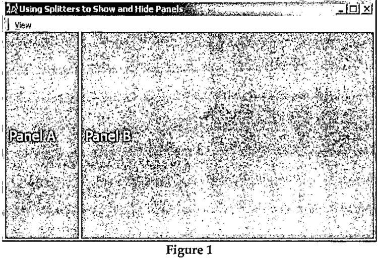
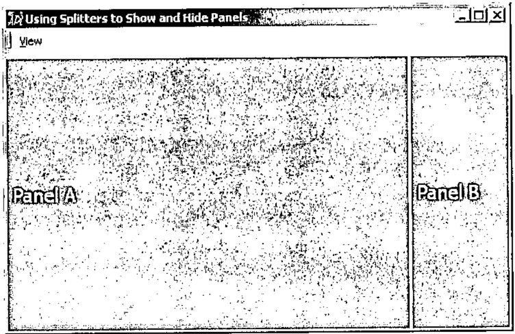

by Paul Mansour
{ .byline }

Splitters are used to create resizable panels on a form. A prime example of the use of splitters is the main form of Microsoft Outlook, which presents a TreeView on the left for categorizing email into folders, a ListView on the right to display the contents of the current folder, and an edit box on the bottom to preview the selected email message. These three objects are managed by splitters, which allow the user to adjust the sizes of the panels.

In addition to allowing users to resize panels to their liking, it is often necessary to allow the user to hide a particular panel, thus leaving more room for its adjacent panel. While it is possible to expunge and re-create the splitter and its associated panel, a better approach is to simply move the splitter under program control to one of its extreme positions, thus completely hiding the appropriate panel.

In most applications, splitters will be *attached*. This means that when a form is resized, one panel will remain the same size, while the other panel will shrink or grow. The panel that changes size we will call the *primary* panel, and the panel the remains fixed will we will call the *secondary* panel. The value of the Align property of the splitter determines which panel is the primary and which is the secondary. For example, a left aligned splitter has its secondary panel on the left, and its primary panel on the right:



**Figure 1**

In this case, Panel A is the secondary panel, and Panel B is the secondary panel. Because the splitter is left aligned, resizing the form results in the width of Panel B growing or shrinking, while Panel A’s width remains fixed.

A right aligned splitter has its secondary panel on the right and its primary panel on the left:



**Figure 2**

In this case, Panel B is the secondary panel, and Panel A is the primary Panel. Similar behavior occurs for top and bottom aligned splitters. If a splitter is not attached, then neither pane is considered primary, and both have equal weight.

When a splitter is at one of its extreme positions, the effect is to completely hide one panel, and to maximize the size of the remaining panel. Thus, to *hide* a panel, we must move the splitter under program control to one or the other of its extreme positions, and to *show* a hidden panel, we must move the splitter back to a position somewhere between its extreme bounds.

Usually secondary panels are hidden, in order to give more room to primary panels. This allows us to add our own Show and Hide methods to the Dyalog Splitter object. Based on the splitter’s *Attach* property, the methods can themselves determine which of the splitter’s two associated objects to show or hide. Hiding a panel is therefore straightforward; just set the position of the splitter under program control.

For a left or top aligned splitter:

```
S.Posn←0 0
```

And for a bottom or right aligned splitter:

```
S.Posn←S.##.Size
```

We may use the same value of Posn for bottom and right aligned (and top and left) because the Posn property of a splitter is partially read only. The interpreter ignores the row (column) position of a vertical (horizontal) splitter.

In addition to moving the splitter to one of its extreme positions, the splitter’s size should be set to 0,0 in order to make it invisible and to effectively disable it from the user.

Restoring a panel is slightly more difficult, because the user may have resized the main form in the interim, and simply setting the position of the splitter to its pre-hidden position may not achieve the desired effect. If the user un-hides a panel on a form that he has resized, the splitter should be positioned such that the layout of the form appears as if the panel had not been hidden during the resize operation. In other words, if a user hides a panel, resizes the form, and then un-hides the panel, the result should be identical to simple resizing the form with both panels visible. While a left or top aligned splitter may, usually, be reset to its pre-hidden position, a right or bottom aligned splitter should be reset such that the right or bottom panel does not change in width or height respectively. However, if the form is made so small the above rules result in the splitter being outside the bounds of the form, and consequently one panel being completely hidden, then the splitter should be set to keep the panels in proportion to their pre-hidden sizes.

This wrinkle in the process of un-hiding a splitter slightly increases the complexity of hiding a panel, because we must capture and store a few items of information about the state of the splitter and the form. Before hiding a panel, we need to note:

1. The current absolute position of the splitter
2. The relative position of the splitter
3. The current size of the form (or the size of the bottom/right object)

The **Hide** function:

```
     ∇Hide←{                          ⍝ Hide Splitter
[1]          ⍺←(⎕NS'').##             ⍝ Splitter
[2]          (~⍵):⍺ Show 1            ⍝ Show
[3]          ps←⍺.##.Size             ⍝ Parent Size
[4]          ⍺._LastPosn←⍺.Posn       ⍝ Last position
[5]          ⍺._LastRelPosn←⍺.Posn÷ps ⍝ Last relative pos
[6]          ⍺._LastSize←ps-⍺.Posn    ⍝ right/bottom object
[7]          ⍺.Posn←ps×'BR'∊↑⍺.Align  ⍝ New Position
[8]          ⍺._Size←⍺.Size           ⍝ Note splitter Size
[9]          ⍺.Size←0 0               ⍝ Make inaccessible
[10]         1:z←0                    ⍝ Shy result
[11]   }
     ∇
```

The Show and Hide functions are designed to be placed inside the splitter object, in an object-oriented fashion, and accessed as methods. For example, to place a reference to Hide in a splitter, we can write:

```
S._Hide←Hide
```

(As a matter of style, underscore is used as a prefix for all programmer-defined properties or methods stuffed into Dyalog GUI objects to avoid any name conflicts.) And now Hide may called as if it were a built in Dyalog method:

```
S._Hide 1
```

Thus the left argument defaults to the current space, which is the splitter object itself (Hide [1]). However, they can be used as stand-alone utility functions by passing in the splitter object as a left argument:

```
S Hide 1
```

Before setting the splitter’s new position (Hide [7]), the current absolute and relative positions of the splitter are stored inside the splitter (Hide [4,5]). In addition the size of the bottom/right object is stored (Hide[6]). With the splitter now aware of its previous state, we can un-hide the panel using the Show method.

The **Show** function:

```
     ∇Show←{                                ⍝ Show Method
[1]          ⍺←(⎕NS'').##                   ⍝ Splitter
[2]          ~⍵:⍺ Hide 1                    ⍝ Hide
[3]          ⍺.Size←⍺._Size                 ⍝ Make accessible
[4]          ⍺.Posn←{                       ⍝ New Position
[5]              'LT'∊⍨↑⍵.Align:⍵._LastPosn ⍝ Align Left, Top
[6]              ⍵.##.Size-⍵._LastSize      ⍝ Bottom, Right
[7]          }⍺                             ⍝
[8]          ps←⍺.##.Size                   ⍝ Size of Parent
[9]          ob←∨/(⍺.Posn<0)∨⍺.Posn>ps      ⍝ Out of bounds
[10]         ob:z←⍺.Posn←⌊⍺._LastRelPosn×ps ⍝ Relative pos
[11]         1:z←⍺.Posn                     ⍝ New Position
[12]   }
     ∇
```

The Show function first restores the size of the splitter, making it accessible to the user (Show [3]). The position of the splitter is set to its last noted position if the splitter is a left or top aligned splitter (Show [5]). If the splitter is a right or bottom aligned splitter, then its position is set such that bottom or right hand panel maintains is last noted size (Show [6])

Finally, if the splitter is now out of bounds (Show [9]), its position is reset such that the two panels retain their last noted proportions (Show [10]).

Show and Hide may be called with an argument of 1 or 0. Show 0 is equivalent to Hide 1, and Hide 0 is equivalent to Show 1. This allows us to dispense with Hide, and simply use Show B, where B is a Boolean (Show/Hide [2]). As Show and Hide are usually called in response to a toggle a menu item, this is quite convenient. A typical callback to a menu item would look like:

```
     ∇ SHOW X;M;S;F
[1]   ⍝ Menu Item
[2]    M←⍎↑X                      ⍝ Menu Item
[3]    F←#.GUI.getform M          ⍝ Parent Form
[4]    M.Checked←~M.Checked       ⍝ Toggle
[5]    S←F.Splitter1              ⍝ Splitter
[6]    S._Show M.Checked          ⍝ Show or Hide
     ∇
```

## Bonus GUI Tip

Splitters are extremely useful objects that automatically manage the Size, Posn and Attach properties of two objects. An undocumented feature of the Splitter is that it is also quite useful as a way to manage these three properties for *only one object*. For example, to make an object that completely fill its parent, and that remains attached to all sides of its parent, simply create a splitter and set is position to the extreme left:

```
'F' ⎕WC 'Form' ('Coord' 'Pixel')
'F.G' ⎕WC 'Grid'
'F.S' ⎕WC 'Splitter'  '' 'F.G'
F.S.Posn←0 0
```
