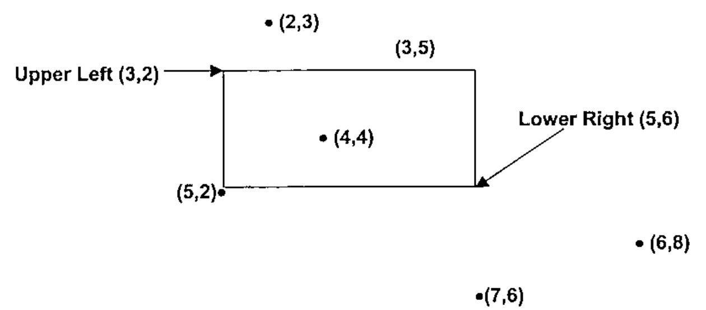

*by Stephen M. Mansour*
{ .byline }

## Abstract

A point partitions a line into three disjoint subsets: the set of points to its left, the point itself and the set of points to its right. Relational functions produce two results 0 and 1, effectively partitioning a line into only two subsets. A technique, known as arithmetic boundary checking, uses arithmetic functions instead of relational and Boolean functions to determine where a point lies in a line or a plane.

## Relational Functions

Relational functions ask the question: is the statement true or false? If the statement `⍺<⍵` is true, we have all the information we need, but if it is false, we don’t know whether `⍺=⍵` or `⍺>⍵`. To get a complete picture, we need to perform a second test. The dynamic function `bp` performs two tests to produce a Boolean pair[^1]:

```apl
      bp←{⊃(⍺<⍵)(⍺>⍵)}  ⍝ Boolean pair (2-vector)
      2 3 4 bp 3        ⍝ ⍺<⍵←→1 0 ⋄ ⍺=⍵←→0 0 ⋄ ⍺>⍵←→0 1
1 0 0
0 0 1
```

While this preserves information, there are two problems. First, it seems somewhat redundant to do two similar comparisons, and second, we would like a scalar result because it will allow us to work more easily with arrays of data.

## Signum Difference

The signum function (`×`) naturally partitions a line into three disjoint subsets, by producing three results (-1, 0, 1). We can apply signum to the difference between a value and the boundary point to produce the *signum difference*, which asks a more specific question, i.e. what is the *relationship* between `⍺` and `⍵`?

```apl
      xd←{×⍺-⍵}         ⍝ Signum difference
      2 3 4 xd 3        ⍝ ⍺<⍵←→¯1 ⋄ ⍺=⍵←→0 ⋄ ⍺>⍵←→1
¯1 0 1
```

Notice that `bp` produces the two-bit binary representation of the ones complement of the result of `xd`. Alternatively, we could produce the same result as that of `xd` by subtracting the left bit from the right bit of the ones complement in the function `bd` listed below[^2]:

```apl
      bd←{(⍺>⍵)-(⍺<⍵)}  ⍝ Boolean difference
      2 3 4 bd 3        ⍝ ⍺<⍵←→¯1 ⋄ ⍺=⍵←→0 ⋄ ⍺>⍵←→1
¯1 0 1
```

However, a performance test in Dyalog Version 10 shows that `xd` runs significantly faster than `bd`:

```apl
      U←1E¯4×500000-?100⍴1E6
      V←1E¯4×500000-?100⍴1E6
      cmpx 'U xd V' 'U bd V'
  U xd V 2.2E¯5   0%
  U bd V 3.4E¯5 +52%
```

## Intervals

An interval is indicated by two distinct points on the real line. The interval includes the interior and may include one or both of the end-points. An interval is open if it excludes the end-points; closed if it includes both of them, and half-open if it includes only one of them. A half-open interval can be open on the left or on the right. The four types of intervals can be described by combining relational functions into the operator `rg`:

```apl
      rg←{(⍺[0]⍺⍺ ⍵)∧⍺[1]⍵⍵ ⍵}                  ⍝ Range Operator
      1 3 <rg> ⍳5  ⍝ Open Interval:              o-----------o
0 0 1 0 0
      1 3 ≤rg≥ ⍳5  ⍝ Closed Interval:            ●-----------●
0 1 1 1 0
      1 3 <rg≥ ⍳5  ⍝ Half-Open Left:             o-----------●
0 0 1 1 0
      1 3 ≤rg> ⍳5  ⍝ Half-Open Right:            ●-----------o
0 1 1 0 0
```

This operator is still limited in that it does not differentiate between an interior point and a boundary (limit) point.

## Partitions

A pair of distinct points on the real line can define two types of partitions: an interval partition and a range partition.

An *interval partition* divides the real line into three disjoint subsets: the interior (between the end-points), the boundary (the two end-points themselves), and the outside (everything else).

```text
    Outside       Bound   Interior      Bound     Outside
<----------------|---------------------|----------------->
      1          0          ¯1          0          1
```

The product of the signum differences between a specified point and each of the boundary points will indicate whether the point falls in the interior, the boundary, or outside. If the point is outside the interval, the differences are both positive, or both negative so their signum product is +1. If the point is on the boundary, one of the differences is zero, thus the product is zero. And if the point is in the interior, the differences have opposite signs, so the signum product is -1.

```apl
      xp←{×/×⍵∘.-⍺}     ⍝ Signum product
      1 3 xp ⍳5         ⍝ produces interval partition
1 0 ¯1 0 1
```

A *range partition* divides the real line into five disjoint regions: below, lower bound (L.B.), interior, upper bound (U.B.) and above:

```text
    Below         L.B.     Interior     U.B.    Above
<----------------|---------------------|----------------->
      ¯2         ¯1           0        +1       +2
```

| | `A←P xd LB` | `B←P xd UB` | `xp:A×B` | `xs: A+B` |
|---|:-:|:-:|:-:|:-:|
| Below | -1 | -1 | 1 | -2 |
| Lower bound | 0 | -1 | 0 | -1 |
| Interior | 1 | -1 | -1 | 0 |
| Upper bound | 1 | 0 | 0 | 1 |
| Above | 1 | 1 | 1 | 2 |

**Table 1: Signum Product and Signum Sum**
{ .caption }

The sum of the signum differences will produce five distinct values ranging from -2 to +2 and corresponding to each of the 5 regions in a range partition.

```apl
      xs←{+/×⍵∘.-⍺}     ⍝ Signum sum
      1 3 xs ⍳5         ⍝ produces range partition
¯2 ¯1 0 1 2
```

## Two-Dimensional Region Checking

A blog entry (http://www.dapl.blogspot.com/2002_10_01_daplarchive.htm) expresses the frustration of using standard Boolean logic in two dimensions:

---

Friday, October 04, 2002

ONE AFTERNOON LAST WEEK while programming I wrote the following:

```apl
A←(R>0⊃UL)∧R<0⊃BR
A←A∧(C>1⊃UL)∧C<1⊃BR
```

It was so bad I had to break it into two lines.

Isn’t it interesting that it is immediately apparent that this code is less than optimal, just from the look of it, even if you have no knowledge of the application? As it turns out, I was adding a drag and drop feature between two ListView objects, and I needed to determine whether or not a point was in an area. In other words, given a point (R,C), and the upper left (UL) and lower right (BR) coordinates of the target, was the mouse over the target ListView?

Knowing I could not live with this in my workspace, and knowing my own limitations as a programmer, I asked Brother Steve to come to the rescue. He immediately produced the following gem:

```apl
A←(R C){0∧.>×/⊃⍺-↓⍉⊃⍵}UL BR
```

which works in N-space too! And a little tweak tells you whether you are “in” the area, “on” the border, or outside in a particular direction.

POSTED BY PAUL MANSOUR | 12:37 AM

---

The proposed solution in the blog exploited signum difference with respect to a rectangular region. We now formally extend the concept of arithmetic boundary checking to two dimensions. You may want to know whether a point is in the interior of a rectangle, on the boundary or outside the rectangle.


**Figure 1: Regions in the plane defined by a rectangle**
{ .caption }

In the following example, we have six points in various positions relative to a rectangular region in the plane. The coordinates of the upper left and lower right corners of the rectangle are (3,2) and (5,6) respectively. The signum products of each coordinate must be calculated separately.



**Figure 2: Points in various positions relative to a rectangle in the plane.**
{ .caption }

If we take the signum product of the first coordinate with respect to the row coordinates and the signum product of the second coordinate with respect to the column coordinates, we obtain a ordered pair indicating the position in each direction.

Table 2 on the next page shows this for the points in Figure 2 above.

In order to be in the interior, both coordinates of the point must be in the interior of their respective intervals in each direction. If either coordinate is outside the range, then the point is outside. If both coordinates are on their respective boundaries or one is on the boundary and the other is an interior point, then the point is on the boundary. Otherwise, the point is outside. In general, the region is the larger of the row and column signum products.

| Point | Description | Row *xp* | Column *xp* | Region (`⌈`) |
|:-:|:-:|:-:|:-:|:-:|
| (6,8) | Outside | 1 | 1 | 1 |
| (5,2) | Corner | 0 | 0 | 0 |
| (4,4) | Interior | -1 | -1 | -1 |
| (7,6) | Below | 1 | 0 | 1 |
| (3,5) | Edge | -1 | 0 | 0 |
| (2,3) | Above | 1 | -1 | 1 |

**Table 2: Various points in the plane with respect to a defined rectangular region.**
{ .caption }

```apl
xm←{⌈/⊃×⌿×⍺,.-⍉⍵}        ⍝ Max Signum
      b←⊃(3 2)(5 6)      ⍝ Upper Left and Lower Right Corners
      b xm⊃(6 8)(5 2)(4 4)(7 6)(3 5)(2 3) ⍝ Various Points
1 0 ¯1 1 0 1
```

The left argument of the dynamic function `xm` is a 2 x 2 matrix containing the coordinates of the upper-left and lower-right corners of a rectangular region. The right argument is a 2-element vector or 2-column matrix containing the coordinates of various points in the plane.

## Differentiating Border Regions

Sometimes it is necessary to divide the borders of a dialog box into specific regions. For example when the cursor is over an edge, it will resize the window in one direction. If it is over a corner, it will resize the window in two directions. The particular edge or corner selected also determines the position of the resized window.

A rectangular region naturally subdivides the *x-y* plane into 25 regions, 5 in the *x* direction by 5 in the *y* direction[^3]. The following regions are shown in Figure 3: 1 interior region, four corners, four edges, and 16 outside regions.[^4]

| | | | | |
|:-:|:-:|:-:|:-:|:-:|
| Outside (8) | Outside (8) | Outside (8) | Outside (8) | Outside (8) |
| Outside (8) | Upper Left Corner (-4) | Upper Edge (-3) | Upper Right Corner (-2) | Outside (8) |
| Outside (8) | Left Edge (-1) | Interior (0) | Right Edge (1) | Outside (8) |
| Outside (8) | Lower Left Corner (2) | Bottom Edge (3) | Lower Right Corner (4) | Outside (8) |
| Outside (8) | Outside (8) | Outside (8) | Outside (8) | Outside (8) |

**Figure 3: 25 Regions defined by a rectangle**
{ .caption }

The signum sum applied to each coordinate generates an ordered pair. If we wish to identify all 25 regions uniquely, we can use base value with a root of 5 to generate the integers -12 to +12 with 0 representing the interior. More likely, we only wish to identify the 9 relevant regions, disregarding the 14 outside regions. We can use base value with a root of 3. This will produce the values -4 to +4 with 0 representing the interior. We will assign the value 8 to the outside regions. We can identify a point in the outside region if the ordered pair of its signum sums contains the value 2 or -2. The function `xr` generates the appropriate value.

```apl
      xr←{d←⍉⊃+/×⍵,.-⍉⍺ ⋄ ((2∨.=|d)/d)←2 ⋄ 3⊥d}
      b xr ⊃(2 3)(3 5)(4 4)(5 2)(6 8)(7 6)
8 ¯3 0 2 8 8
```

## Theoretical Considerations and Conclusion

Arithmetic boundary checking is based upon the topological properties of the real line and the Euclidean 2-space *R*<sup>2</sup>[1]. The boundaries of an interval or a rectangle correspond to limit points in topology. An open interval corresponds to the interior set, whereas a closed interval corresponds to the union of the boundary set and the interior set. A *k*-cell is defined as an closed interval on the real line where *k*=1 or a closed rectangle in the plane, where *k*=2. [2]

While Boolean functions are useful if binary results are adequate, they do not work as well when more information is required. Location on the real line or in the plane can be determined arithmetically without the use of Booleans. The ternary nature of signum is exploited to handle boundary conditions.

## References

[1] Jerrold Marsden, *“Elementary Classical Analysis”* W.H.Freeman & Co. 1974, Chapter 2, Topology of *R*<sup>n</sup>, pp 32-44.

[2] Walter Rudin, *“Principles of Mathematical Analysis, Third Edition”*, McGraw-Hill 1976, pp. 31-32.

[^1]: Note: all APL expressions assume `⎕IO←0` and `⎕ML←3`

[^2]: The function *bd* can be expressed succinctly in J as a fork: `bd=: >-<`

[^3]: This is based on the fact that there are 5 disjoint subsets in a range partition on the real line.

[^4]: It is unimportant to distinguish these from each other
