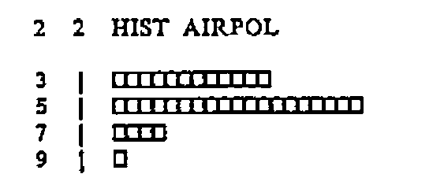
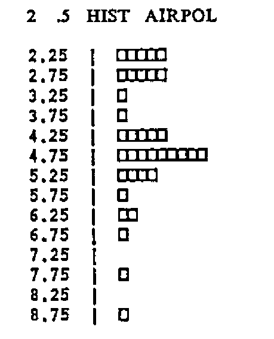
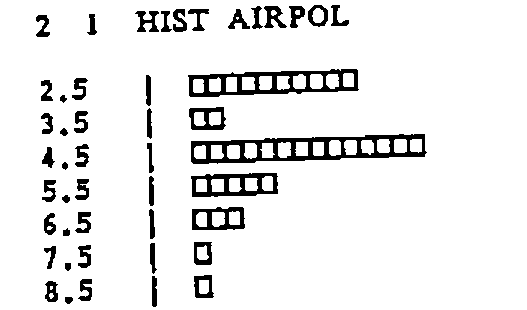
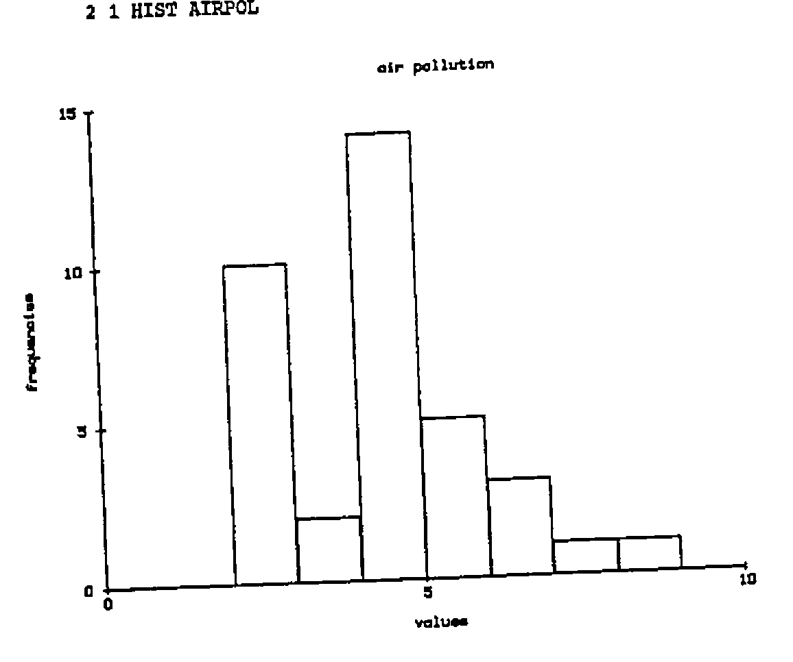
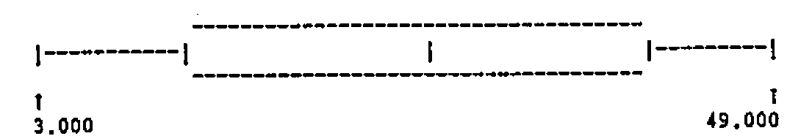
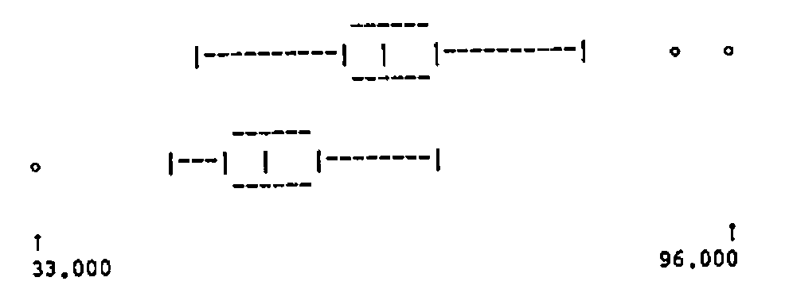
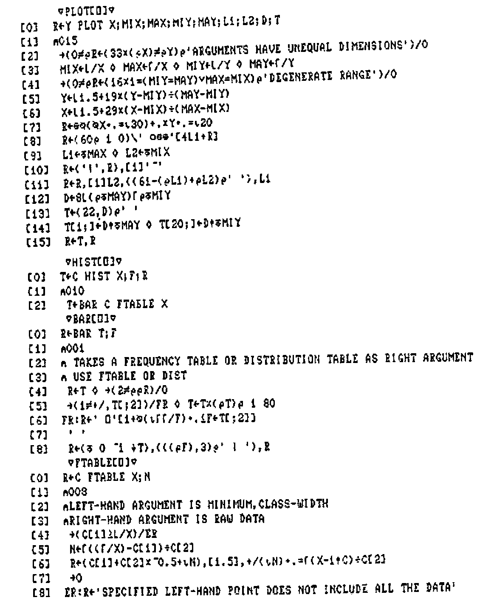
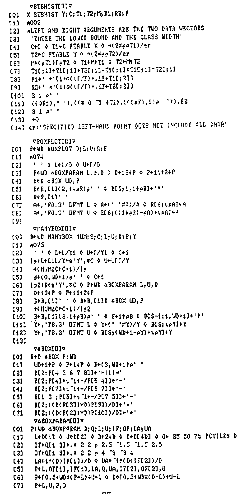

by A.D. Mayer and A.M. Sykes
{ .byline }

## 1. Introduction

The teaching of statistics may be approached in a variety of ways, from purely theoretical to strictly applications-oriented. In schools and colleges, the application of statistical techniques to “real” data has always posed a problem. Courses using only calculators give valuable experience in the manipulation of data, but each application tends to be very time-consuming. On the other hand, the use of computers frequently leads to a course which teaches more computing than statistics. Ideally, computers should be used to provide an environment in which statistics can be taught effectively, without demanding any computing expertise.

Specifically, it is desirable that data should be made available to students, to be investigated, displayed and manipulated. Arithmetic calculations must be carried out in an interactive environment, where results can be obtained rapidly. Repetition of commands should be avoided: the ability to define “macros” is essential, especially for complex but frequently used calculations. At least a rudimentary facility for graphs, histograms etc. is needed, so that data can be displayed in a variety of ways, as rapidly as possible. Also required is the generation of random numbers from various distributions for the purpose of simulation.

As in all teaching environments, the facility for students to explore data and methods for themselves, without unnecessary guidance, is highly desirable. Some guidance is, however, essential, and it is helpful if the nature and timing of guidance can be determined by regular assessment of progress. Traditionally, assessment means a degree of individual attention which may be impractical on a regular basis for large classes. Partial automation of this aspect of teaching would be an attractive proposition.

The Department of Management Science and Statistics at Swansea University typically has a class of over 120 first-year students. In recent years, we have tried to develop a sound environment for supporting theoretical and practical studies in elementary probability and statistics. In the following sections we discuss some of the problems outlined above together with our solutions.

## 2. A Statistical Conversational Environment

Experienced APL programmers rightly consider the concise mathematical APL notation to be one of the most attractive features of the language. It is also the one factor which deters many people from learning APL.

To help users get to grips with the APL environment in their early days, a set of simple functions has been developed to provide “English” commands. Some students transfer very rapidly from these commands to symbolic notation; some take longer; a few never make the transfer. We have to remember at all times that teaching statistics comes first, not training students to be APL programmers.

As an example of our approach, APL commands such as

```apl
ROW3 ← MATRIX[3;]
COL5 ← MATRIX[;5]
```

are made “conversational” by using two functions ROW and COLUMN:

```apl
ROW3 ← MATRIX ROW 3
COL5 ← MATRIX COLUMN 5
```

The gain may appear small, and possibly outweighed by the extra typing involved, but most of the first-year students, for whom computing is a new experience, are far happier with a machine that speaks (and understands) their language.

The following examples typify this approach.

| <u>MEANING</u> | <u>APL</u> | <u>FUNCTION</u> |
| --- | --- | --- |
| No.of ways of choosing R items from N | `R!N` | `N CHOOSE R` |
| e<sup>x</sup> | `*X` | `EXP X` |
| log<sub>e</sub>x or ln x | `⍟X` | `LN X` |
| Maximum of the components of x | `⌈/X` | `MAX X` |
| Minimum of the components of x | `⌊/X` | `MIN X` |
| Sum of the components of x | `+/X` | `SUM X` |
| Logical x OR y | `X ∨ Y` | `X OR Y` |
| Logical x AND y | `X ∧ Y` | `X AND Y` |
| Selection | `(X=3)/X` | `(X=3) SELECT X` |
| Order the x’s (increasing) | `X[⍋X]` | `ORDERUP X` |
| Order the x’s (decreasing) | `X[⍒X]` | `ORDERDOWN X` |

## 3. Arithmetic Progressions

The monadic use of Iota occurs very often in APL programming and not surprisingly in Statistics. We have found the function TO which extends the essential idea of Iota to cope with starting points other than 1 (or 0) even more useful. For example 2 TO 5 yields the vector 2 3 4 5, being equivalent to

```apl
(I-⎕IO)+⍳1+J-I      ⍝ where I=2 and J=5.
```

A further extension using function STEP allows non-consecutive sequences of integers to be constructed. For example

```apl
MEAN X[2 TO N STEP 2]
```

calculates the sample mean of all the even values X[2], X[4],…,X[N].

Functions TO and STEP are listed in the appendix.

## 4. Descriptive Statistics

Most Statistics courses begin with elementary descriptive statistics of single samples, such as mean, standard deviation, etc. Whilst it is tempting to show students how easy it is to calculate such quantities without writing programs, we prefer to provide them with the tools, and allow them time to use them intelligently to gain statistical experience.

As well as MEAN (mean) and SDEV (standard deviation), PCTILES allows them to calculate percentiles and hence to construct alternatives to mean and standard deviation, and the function STATS gives a useful summary. With such functions available students can be presented with data where they must choose carefully whether to use mean or median, standard deviation or semi-interquartile range.

For example,

```apl
      MEAN AIRPOL
4.4138

      SDEV AIRPOL
1.554
      25 50 75 PCTILES AIRPOL
3 4.65 5.25

      STATS AIRPOL

      MINIMUM             =   2.1
      LOWER QUARTILE      =   3
      MEDIAN              =   4.65
      UPPER QUARTILE      =   5.25
      MAXIMUM             =   8.6
      MEAN                =   4.41
      STANDARD DEVIATION  =   1.55
      SEMI I-Q RANGE      =   1.125
```

(N.B. the SEMI IQ RANGE is equal to `.5×-/25 75 PCTILES X`.)

## 5. Expected Values

The mathematical notation for the expected value of a discrete random variable X taking values x<sub>1</sub>, x<sub>2</sub>, …, x<sub>n</sub> with probabilities p<sub>1</sub>, p<sub>2</sub>,…,p<sub>n</sub> is given by

E(X) = Σ<sub>i=1</sub><sup>n</sup> p<sub>i</sub>x<sub>i</sub>

The omission of any explicit reference to the p<sub>i</sub>’s in the left-hand side is a source of confusion to students and shows that mathematical notation is not always as precise as mathematicians think it is. At the APL terminal our students improve the notation by typing statements such as

```apl
M ← P E(X)
```

to assign the expected value (or mean) to M. (The brackets are of course unnecessary if a space is left but we adopt this approach to reinforce the mathematical notation!)

The function E is simple:

```apl
    ∇R←P E X
[1] R←(,P)+.×,X
    ∇
```

but its scope is far reaching – for example

```apl
P E(X-M)*2
```

calculates the theoretical variance. (For a more detailed explanation of this function see [1].)

## 6. Displaying Data

Visual representation of data, such as graphs and histograms, are invaluable, particularly for students working with real data for the first time. Initially, we supply such facilities using ordinary (non-graphics) terminals. Later on in the year they are introduced to a graphics workspace that includes the same functions with identical syntax, but which results in a picture drawn on a Hewlett Packard graph plotter. The basic functions supplied are PLOT, HIST, BTBHIST, BOXPLOT, MANYBOX.

For example, the program HIST produces a histogram of the data, but the user must choose the class-width. So an intelligent user of HIST on AIRPOL might try



and decide that class width 2 is too large.



shows that .5 is too small.



looks about right!

No facility for calculating “reasonable” values of the parameters for the data is supplied. The omission is intentional, as the trial-and-error approach, together with a close examination of the data, is very instructive and must be encouraged. Too much “automation” leads to total dependence on the computer, and very little insight into the structure of data.

The HP Plotter version gives:



The function BTBHIST exploits the approach adopted by HIST to produce Back-to-Back histograms to allow contrast of two data vectors. For example, in their second practical, students would contrast the distribution of male weights and female weights in a database of 100 student records as follows.

```apl
      WEIGHT ← STUDENT COLUMN 4
      SEX ← STUDENT COLUMN 2
      MWEIGHT ← (SEX = 1) SELECT WEIGHT
      FWEIGHT ← (SEX = 2) SELECT WEIGHT

      MWEIGHT BTBHIST FWEIGHT

Enter the LOWER BOUND and CLASS WIDTH
⎕:
      30 5

                    32.5 *
                    37.5
                    42.5
                 *  47.5 **********
              ****  52.5 ***************
            ******  57.5 **********
       ***********  62.5 *****
    **************  67.5 *****
      ************  72.5
               ***  77.5
                 *  82.5
                    87.5
                 *  92.5
                 *  97.5
```

With the relatively recent emergence of Tukey’s (see [5]) BOX and WHISKER, and SCHEMATIC PLOTS, BOXPLOT attempts to summarise the main features of a histogram, having a central box to represent the three quartiles, with whiskers out to the first ‘fence’ and two classes of outliers represented by the ‘jot’ and ‘star’ symbols respectively.

For example

```apl
60 BOXPLOT ?50⍴50
```



yields a box of width 60 characters representing the salient features of the random set of data.

Such BOX or SCHEMATIC PLOTS can be applied to more than one set of data, by allocating each data vector to Y1, Y2 and so on. For example

```apl
Y1 ← MWEIGHT
Y2 ← FWEIGHT

50 MANYBOX 2
```



## 7. Exploring the Environment

During the course, functions are introduced a few at a time, as required to solve problems derived from lectures. When the workspace is loaded, a description of the latest functions appears. Thus the student is guided to those functions most suitable for the current topic. However, all functions are included in the workspace from the beginning of the course, so that students are encouraged to explore and learn for themselves.

To aid this, a HELP facility is provided. Typing HELP ‘function-name’ yields a brief description in the format

```text
FUNCTION NAME

Description

Right argument
Left argument (if required)

Example

Notes (e.g. reference to other functions, or APL notation in the
case of functions described in paragraph 2.)
```

For example:

```text
        HELP 'BIN'

BIN

CALCULATES THE BINOMIAL DISTRIBUTION PROBABILITIES

RIGHT ARGUMENT:- NUMBER OF TRIALS AND THE PROBABILITY(IES)
LEFT ARGUMENT:- OPTIONAL, THE TERMS REQUIRED

EXAMPLES       P←BIN 2 .5
               P
.25 .5 .25

               BIN 2 .5 .6
.25 .5  .25
.16 .48 .36
               (5 TO 7) BIN 10 .5
.246 .205 .117

N.B. A BAR CHART OF THE PROBABILITY DISTRIBUTION CAN BE PRODUCED USING
BAR AND DIST, E.G.
      P←BIN 10 .5
      V←0 TO 10
      BAR P DIST V
```

The HELP facility works by accessing numbers inserted as a comment on the first line of every function, indicating which component of the help file is to be displayed. The HELP function as implemented in APLPLUS is listed in the appendix.

## 8. Assessment of Students

Periodically throughout the course, students are asked to perform tasks and submit their answers for computer marking. Their marks contribute about 20% to their total mark at the end of the year, ensuring that they take their computer practical sessions seriously!

The basic steps in their continuous assessment is as follows:–

```text
)COPY 0:ASSESS          (copy in the current assess workspace)
TASK                    (creates question and gives instructions)
  .
  .                     (APL session)
  .
ANSWER ←                (allocate answer to variable)

SUBMIT                  (erases all APL objects except ANSWER and
                         saves in workspace called ANSWERS)
```

The function TASK itself involves functions that perform the following tasks:

1. set the random link according to the user number
2. generate the question
3. issue message.
{ type="i" }

Functions (ii) and (iii) are up-dated for each assignment, otherwise the ASSESS workspace remains the same each week.

The supervision of computer assignments needs a workspace to monitor the work submitted and to assign marks. The functions necessary for this are

1. `GETANSWER USERNAME`

    This copies the student’s answer into the workspace.

    (This is so arranged that if it fails to locate an answer, it returns a default vector).

2. `Q←GETQUESTION USERNAME` (a version of TASK)
3. `TA←TRUEANSWER Q` (calculate correct answer)
4. `M←TA MARK A` (marks by comparing answer A with true answer TA)

All four functions form the core of a drive function which loops through a list of usernames, with each result M of function 4 being inserted into a vector of MARKS.

Here is an example of a sample session, where a student is presented with a data set of between 15 and 20 data items generated (possibly) from a Normal distribution with a hypothesised mean of 20, which they have to test in an appropriate way. Note that all students get different data, and they cannot assume that Jo Bloggs’ answer is appropriate for them too!

```text
      TASK

THE FOLLOWING DATA IS A RANDOM SAMPLE FROM A POPULATION WITH
ASSUMED POPULATION MEAN=20. TEST THIS HYPOTHESIS USING A SUITABLE
TEST. (IF YOU ARE SATISFIED THAT THE DATA HAS A NORMAL DISTRIBUTION
THEN USE A T TEST, OTHERWISE USE THE WILCOXON RANK SUM TEST AS
DESCRIBED IN LECTURES.)
YOUR ANSWER SHOULD BE A THREE ELEMENT VECTOR
FIRST ELEMENT =1 IF YOU HAVE ASSUMED A NORMAL DISTRIBUTION, OTHERWISE
0. SECOND ELEMENT=TEST STATISTIC, THIRD ELEMENT=(TWO-SIDED)
SIGNIFICANCE LEVEL

ASSIGN THESE THREE VALUES TO A VARIABLE CALLED ANSWER AND TYPE SUBMIT

THE DATA IS AVAILABLE UNDER THE NAME DATA
27.55 22.45 18.45 25.36 13.47 28.35 20.89 18.42 6.48 22.69 19.24 24.18
      27.70 19.82 37.33 17.50 42.03

      )COPY 0:STATS
SAVED 11-JAN-1987 15:43:33 119 BLKS

      DATA
27.55 22.45 18.45 25.36 13.47 28.35 20.89 18.42 6.48 22.69 19.24 24.18
      27.70 19.82 37.33 17.50 42.03

      STATS DATA
MINIMUM            = 6.48
LOWER QUARTILE     = 18.44
MEDIAN             = 22.45
UPPER QUARTILE     = 27.58
MAXIMUM            = 42.03
MEAN               = 23.05
STANDARD DEVIATION = 8.33
SEMI I-Q RANGE     = 4.57

      5 10 HIST DATA

10 | ⎕⎕
20 | ⎕⎕⎕⎕⎕⎕⎕⎕⎕
30 | ⎕⎕⎕⎕
40 | ⎕⎕

      5 5 HIST DATA
 7.5 | ⎕
12.5 | ⎕
17.5 | ⎕⎕⎕⎕⎕
22.5 | ⎕⎕⎕⎕
27.5 | ⎕⎕⎕⎕
32.5 |
37.5 | ⎕
42.5 | ⎕

      ⍝DOESN'T LOOK VERY NORMAL
      X←DATA-20
      SUM X=0
0
      R←RANK |X
      S←SUM (X>0)/R
      S
108

      M←.5×SUM R
      V←.25×SUM R×R
      TESTSTAT←S-M
      TESTSTAT←TESTSTAT÷V*.5
      TESTSTAT
1.49
      2×NORMTAIL TESTSTAT
0.14
      ANSWER←0,TESTSTAT,2×NORMTAIL TESTSTAT
      ANSWER
0 1.49 0.14
      SUBMIT
```

As with all the topics discussed in this paper, there is plenty of scope for extension, and our next aim is to extend the ideas embodied in computer assessment to construct a body of questions when students could use to self-assess; each type of question can be repeated as many times as required, and students have access to written solutions, plus an assessment of their marks, either for a particular question, or for all the questions selected. It is hoped that this will be in operation later on this year.

## 9. Databases

One advantage of our approach is that realistic examples of data can be tackled just as easily as textbook-size examples. A number of databases have been collected and are available to the student for practical use. Each database also contains information showing how the database is constructed.

Each year students fill in a questionnaire (at the computer of course) and this is assembled to form a further database which they subsequently analyse.

## 10. Summary

The statistics workspace used by part one students allows them to concentrate their energies on doing and understanding statistics. In so doing however, they inevitably pick up some of the flavour of APL and those that are at all interested are able to experiment to their hearts content. Those that find it difficult are at least encouraged initially because of the lack of APL characters (only the use of ‘←’ is necessary together with +,-,¯,×,÷ and * for the elementary arithmetic operators), and by the presence of the HELP instructions which guide them in using the facilities.

In the second year, an option in Statistical computing allows the keen ones to study the language in its entirity and includes projects in statistical computing which require them to find solutions to statistical computing problems. Others who continue with their statistical studies have sufficient command of APL to be able to use more advanced statistical software such as APLGLIM (see [2], [3] and [4])

## 11. Appendix A

### 6. Functions in the STATS workspace

There are 6 types of functions

1. Functions performing ordinary data manipulative tasks;
2. Elementary statistical calculations;
3. Character graphics facilities;
4. Statistical table functions
5. More advanced statistical calculations
6. Specific teaching aids
{ type="a" }

and these groups are listed below.

Group a
: AND CHOOSE CODE COLUMN COUNT CUMSUM DROP EXP LN MAX MIN OR ORDERDOWN ORDERUP ROW SELECT SHAPE SUM SUMCOL TAKE TO STEP

Group b
: FTABLE GMEAN GSDEV MEAN MEANS PCTILES SDEV STATS STEMLEAF TWTABLE RANK UNIQUE

Group c
: BAR BOXPLOT BTBHIST HIST MANYBOX PLOT QQPLOT

Group d
: BIN CHISQUARE FTAIL NORMQUANTILE NORMTAIL TTAIL

Group e
: ANOVA CONTINGENCY NPTWOSAM TWOSAMT WILCOXON

Group f
: e.g. CONFTRIAL DICE DIST E NRSAMPLE RSAMPLE SAMPLE TIMES

## 12. Appendix B

Some listings of functions in 0:STATS as mentioned in the text.





```apl
     ∇HELP[⎕]∇
[0]  HELP N;I;K;⎕ELX
[1]  ⍝009
[2]   ⎕ELX←'→er'
[3]   'HELPSTAT' ⎕FTIE 1
[4]   N←⍎(⎕CR N)[2; 2 3 4]
[5]   ' ' ⋄ ⎕FREAD 1,N ⋄ ' ' ⋄ ⎕FUNTIE 1 ⋄ →0
[6]  er:'HAVE YOU USED HELP WITH A VALID FUNCTION NAME?'
[7]   ⎕FUNTIE 1

     ∇TO[⎕]∇
[0]  R←I TO J
[1]  ⍝028
[2]   J←J,1
[3]   R←(I-⎕IO)+J[1+⎕IO]×⍳⌈(1+J[⎕IO]-I)÷J[1+⎕IO]
     ∇STEP[⎕]∇
[0]  R←Y STEP Z
[1]  ⍝029
[2]   R←Y,Z
```

## References

1. HAWKES A.G. & SYKES A.M. Teaching Statistics through APL. Tutorial Volume APL ’86.
2. SYKES A.M. & ANSELL J.I. Applied Linear Interactive Modelling. Proceedings of APL ’85.
3. SYKES A.M. Generalized Linear Models in APL. Proceedings of APL ’86.
4. SYKES A.M. Second Generation Domino for Statisticians. Proceedings of APL ’87.
5. TUKEY J.W. Exploratory Data Analysis. Addison-Wesley (1977).
