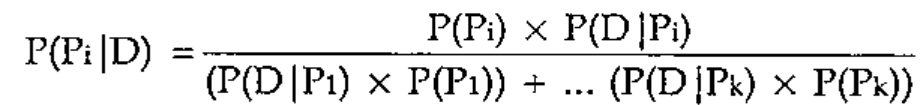
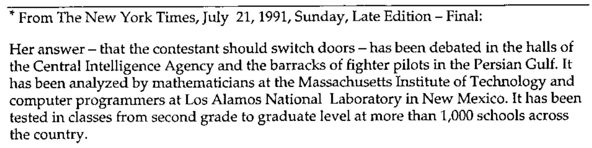
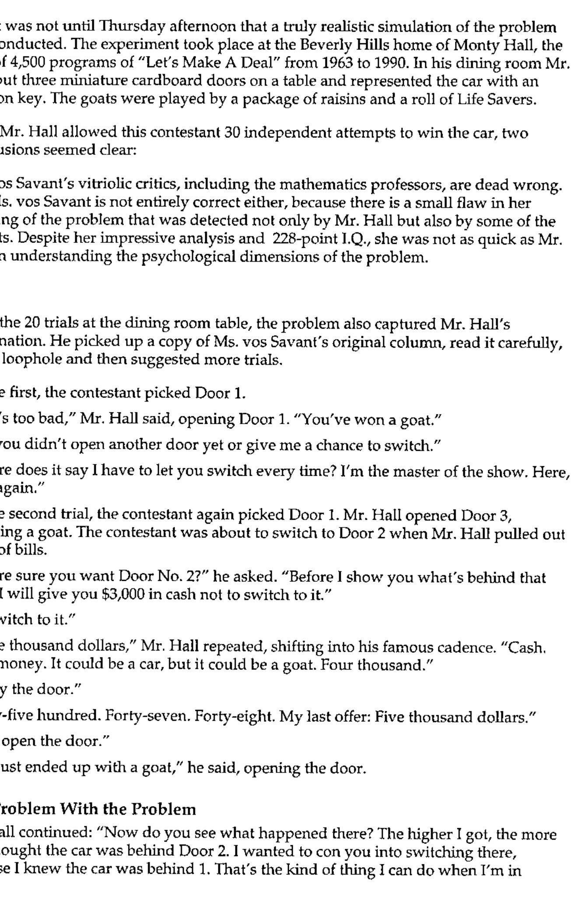
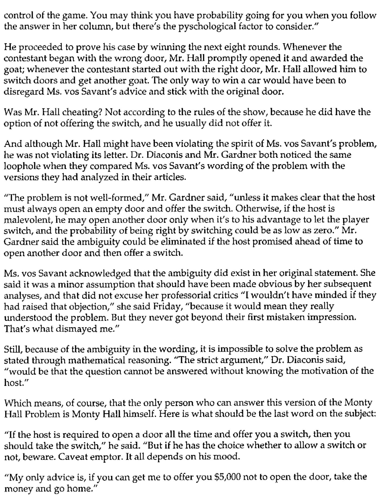

*by Devon McCormick*
{ .byline }

## The “Monty Hall” Problem Solved both by Simulation and by Bayesian Analysis

In a Parade magazine column by Marilyn Vos Savant<sup>1</sup>, renowned by the Guinness<sup>2</sup> book of world records as the person with the highest IQ, was posed the following problem:

> Suppose you’re on the television program “Let’s Make A Deal” and are asked to choose one of three doors for a prize. The prize behind two of the doors is a goat; the third door conceals a car. You choose one of the doors. However, instead of letting you know what you’ve won, Monty Hall opens one of the doors you didn’t choose to reveal a goat. He then asks if you’d like to switch to the other, unopened door or remain with your initial selection.
>
> The questions are: does it make any difference whether or not you switch? If it does make a difference, should you switch or not?

Ms. Vos Savant answered that it *does* make a difference and you should always switch; this assumes the host always opens a door to reveal a goat and always gives you the choice of switching. This column produced more mail than any she had ever written, much of it from mathematics professors, many of whom disagreed with her answer.

I know that when I read about this problem and its solution in a mathematical journal years ago, I didn’t understand the solution given there and it seemed incorrect. However, it was but a matter of a few minutes (well, maybe 45) to write a simulation of the problem in APL. Here it is:

```apl
[0]   CARS←N GOATDOOR C;⎕IO;DOORS;PICK;GOAT;NG
[1]   ⍝ Let's make a deal! We can choose 1 of 3 doors: 1 hides a car,
[2]   ⍝ 2 hide goats.  We pick one but Monty gives us a chance to re-choose
[3]   ⍝ after he opens one of the remaining 2 doors to reveal a goat.
[4]   ⍝ How many cars do we get by
[5]   ⍝ C: 0←→keeping 1st choice, 1←→changing to other door?
[6]   ⍝ N: number of trials.
[7]    ⎕IO←1 ⋄ CARS←0
[8]
[9]   L_MAKEADEAL:DOORS←(?3)⌽0 0 1          ⍝ Randomize choices: 1=car
[10]   PICK←(?3)⌽0 0 1                      ⍝ We pick a door: 1 is choice
[11]   NG←0+.=GOAT←DOORS∨PICK               ⍝ Number of unpicked goat doors
[12]   GOAT[((~GOAT)/1 2 3)[?NG]]←NG≠1      ⍝ Show a goat at random (=0)
[13]   DOORS←GOAT/DOORS ⋄ PICK←GOAT/PICK    ⍝ Eliminate the shown door
[14]   PICK←C≠PICK                          ⍝ Change pick or don't
[15]   CARS←CARS+PICK/DOORS                 ⍝ Add car if we got it
[16]   →(×N←N-1)⍴L_MAKEADEAL
```

After running this for half a million iterations – which took all night on my “powerful” 20 MHz 286 PC – I had an answer that matched the one given in the mathematical journal to 3 or 4 places.

My simulation was short enough and sufficiently simple that I was reasonably confident of its correctness. It was, however, a brute-force solution. Years later, I started learning about Bayesian methods in statistics and discovered a simple analytical technique for solving the same problem.

To see why Ms. Vos Savant was correct, at least for a common interpretation of the problem\*, consider the version of Bayes’s Law which considers not just the probability of a single event but of the exhaustive series of events:



Or, in APL:

```apl
[0]   R←BayesPP PROBS
[1]   ⍝ Calc Bayesian posterior probability given PROBS: 2 row mat:
[2]   ⍝ [0;] P(P1), P(P2)....; [1;] P(P1|D), P(P2|D)...; i.e. [0;] isolated
[3]   ⍝ event probability, [1;] conditional probability given data D.
[4]    R←R÷+/R←×⌿PROBS
```

Our initial probabilities P(P<sub>i</sub>), for each of the three doors concealing a car, are 1/3. This assumes a “flat” prior, that is, in the absence of any other knowledge, we assign each door an equal probability at the outset. That is, our initial probabilities are as follows:

| | | |
|---|---|---|
| **P(C)** | **= 1÷3** | **probability of choosing the car** |
| P(G) | = 2÷3 | probability of choosing one of the 2 goats |

Once Monty has opened one of the doors, we now have new data “D” to incorporate into our estimation. The probablities are now

| | | |
|---|---|---|
| P(C\|D) | = 1÷2 | probability of choosing the car |
| P(G\|D) | = 1÷2 | probability of choosing the goat |

because there are only 2 doors. Thus, our *posterior* probability of having chosen the car (arbitrarily calling our door #1) is

> P(P<sub>1</sub>|D) = (1/3 × 1/2) ÷ ((1/2 × 1/3) + (1/2 × 2/3)) = 1/3

That is, our posterior probabilities for choosing a door hiding a car and a goat, respectively, are:

```apl
      BayesPP 2 2⍴(1 2÷3),1 1÷2
0.33333333 0.66666667
```

Thus, we should always switch.

The following table illustrates why this is so.

| | After Monty Opens Door Revealing Goat | |
|:-:|:-:|:-:|
| **Initial Choice** | **Switch** | **Don’t Switch** |
| Car | Goat | **Car** |
| Goat 1 | **Car** | Goat |
| Goat 2 | **Car** | Goat |

This enumerates all the possible combinations. As you can see, switching will more often give us a car than a goat.

---







---

<sup>1</sup> Parade Magazine: September 9, 1990, February 17, 1991, and July 7, 1991.

<sup>2</sup> The Guinness Brewing Company has an important place in the history of statistics, having employed William Sealy Gosset to apply statistical methods of random sampling to their brewing process in order to brew a consistently good beer. Mr. Gosset discovered that staple of modern analysis, the (Student’s) t-test.
