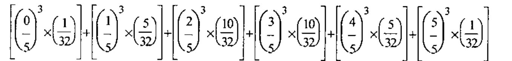
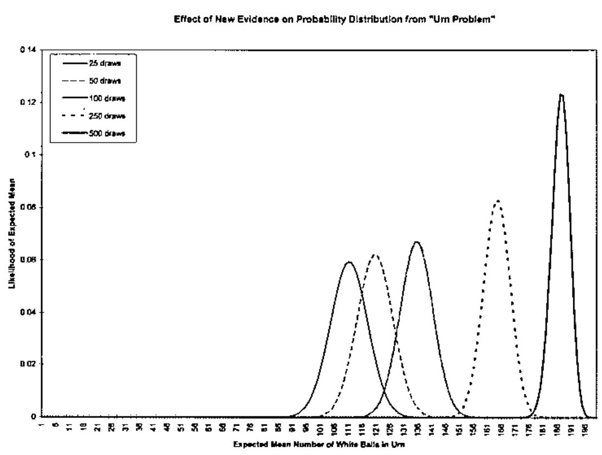
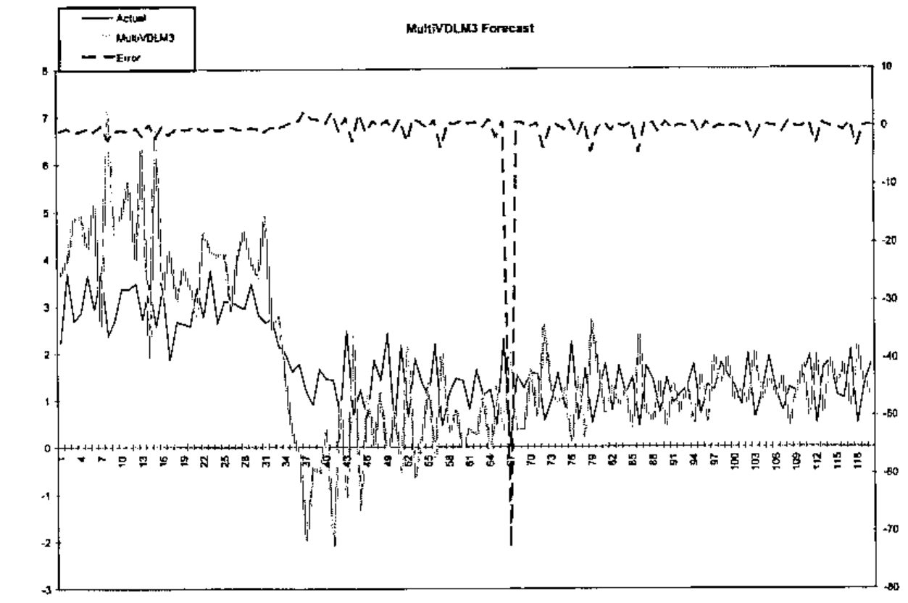

*by Devon McCormick*
{ .byline }

*An earlier version of this article was presented as a paper at the tenth “APL as a Tool of Thought” conference held in conjunction with APL98.*

Bayesian statistics is a brand-new idea that’s only about 235 years old. The paper that was to immortalize the last name of the Reverend Thomas Bayes, a Nonconformist minister born in 1702, was published in 1763. Unfortunately for any fame he may have hoped to gain from what proved to be his most influential work, Bayes died some 3 years before.

From such inauspicious origins, his contribution to statistics continued inauspiciously. His ideas flourished briefly in the latter part of the 18th century, being taken up by the great mathematician Laplace, before languishing in relative obscurity until this century. Even though revived in the early part of the century, first by Ramsey, then by de Finetti, his ideas only became widespread in recent years.

So, what is this great idea that has come to us through centuries? At first glance, it may appear to be rather trivial. So trivial, in fact, we may briefly derive it here without further exposition.

Bayes examined the problem of contingent probability. We may start, simply enough, by noting that the probability of an event P, denoted here as Prob(P), contingent on circumstances (or Data) D, is the product of Prob(P) and Prob(D | P). This latter formulation may be read “the probability of D given P”. So, since

> Prob(PD) = Prob(P) × Prob(D | P)

and, the reverse being true and equivalent, that is

> Prob(DP) = Prob(D) × Prob(P | D)

Taking these two as equal to each other leads us to the common formulation of Bayes’s Theorem:

> Prob(P | D) = (Prob(D | P) × Prob(P)) / Prob(D)

There might not seem to be much here, so why should this simple theorem have provoked so much contention and fallen into such conspicuous disfavour? The key here is the interpretation of the prior Data: it includes any information we see fit to include: this makes it “subjective”, hence often thought to be not fit for proper scientific and mathematical treatment. That is, the powerful effect of Bayes’s Theorem is to allow us to incorporate non-traditional, perhaps inexact, data into our probability formulations.

This denigration of subjectivity, in a historical context of pride in exact, “hard” science, continues to plague Bayesian techniques even up until recent times. In fact, one reference (in Kuhn’s “Readings in Game Theory”) to Bayesian techniques appears to justify calling it “Bayesian” only because of the general use of subjective probability estimations. One much-cited early work about Bayesian techniques is called “Studies in Subjective Probability” (Kyburg, 1964): at the time it was published, this was the defining feature of Bayesian statistics.

However, as we shall see, this perceived subjectivity of the technique is misconstrued as a weakness, when it is rather a strength because it acknowledges and deals with the outside information underlying all statistical inference. This combining of “hard” and “soft” data is helpful in the context of the Dynamic Linear Models we will explore later on.

Another strength of Bayesian inference has to do with its approach to probability, an approach often called the “inverse probability” problem because it is “backwards” in relation to traditional probability. This problem is stated thusly:

> Given the number of times an event with unknown likelihood has occurred or failed to occur, what is the chance that the probability of it happening in a single trial lies somewhere between 2 degrees of probability?

For example, one of the Bayesians’ favourite examples of this is the urn problem: given an urn containing 2 colours of balls, say black and white, and series of tests whereby we draw a ball, note its colour and return it to the urn, what is the likelihood of various combinations of the 2 colours? For instance, given an urn with 5 balls and the evidence that 3 draws with replacement yield only white balls, what is the probability that all 5 are white?

This is the inverse of a typical problem in probability that would be more along the lines of: given an urn with 3 white and 2 black balls, what are the odds of drawing 3 white balls, 1 at a time with replacement? Before we delve further into the Bayesian example, notice how more commonly applicable to typical finance problems is this former sort of formulation than is the latter. A classical probability problem would be something like: given the mean returns and volatility of some assets, how are they likely to perform? However, the inverse problem would be something like: given the performance of these assets, what are their likely returns and volatilities? We can see from this that the inverse problem better matches what we often have to work with in terms of real data.

Before we look more at the urn problem, we need to extend Bayes’s Theorem to multiple events. Given a series of k events P<sub>i</sub> with associated likelihoods Prob(P<sub>i</sub>) and prior observed data D, the contingent probability of a particular event P<sub>i</sub> given observations D is stated thusly:

> Prob(P<sub>i</sub> | D) = (Prob(P<sub>i</sub>) × Prob(D | P<sub>i</sub>)) / ((Prob(D | P<sub>1</sub>) × Prob(P<sub>1</sub>)) + … (Prob(D | P<sub>k</sub>) × Prob(P<sub>k</sub>)))

In APL, this is shown by the function `BayesPP`.

```apl
    ∇ R←BayesPP PROBS
[1]   ⍝ Calc Bayesian posterior probability given PROBS: 2 row mat:
[2]   ⍝ [0;]P(P1), P(P2)...; [1;]P(P1|D), P(P2|D)...; i.e. [0;] isolated
[3]   ⍝ event probability, [1;] conditional probability given data D.
[4]    R←R÷+/R←×⌿PROBS
    ∇
```

In practice, this works as follows. Suppose we have an urn with 5 black and white balls in unknown proportion. We draw 3, one at a time with replacement; all are white. What is the probability that all 5 are white? Invoking the APL function

```apl
UrnProbAllWhite 5 3
```

gives us the numerical answer of 0.15625. How do we work this out using the above theorem? We must solve for the probability of all the balls being white given the evidence of 3 white draws (Prob(P<sub>i</sub> | D)). The text of this function and a discussion follows.

```apl
    ∇ P←UrnProbAllWhite NNW;⎕IO
[1]   ⍝ Bayesian urn problem: given NNW[0] (ostensibly black and white) balls
[2]   ⍝ and experimental evidence that NNW[1] white ones picked, with
[3]   ⍝ replacement each time, what is probability that all are white?
[4]    ⎕IO←0
[5]    P←((⍳NNW[0]+1)÷NNW[0])*NNW[1]          ⍝ 0 to N possible balls of color
[6]   ⍝ picked → chance of picking NW white ones for each proportion possible.
[7]    P←+/P×(BinomialCoeff NNW[0])÷2*NNW[0] ⍝ 2* because 2 possible colors;
[8]   ⍝ would have to use other than binomial expansion if more than 2.
[9]   ⍝ P is now all probabilities of all combinations.  Applying Bayes's
[10]  ⍝ theorem: (Prob(all selections white given all balls in urn are white ×
[11]  ⍝ Prob(all balls in urn are white)) ÷ Sum of Prob(all combos)
[12]   P←(((÷/2⍴NNW[0])*3)×÷2*NNW[0])÷P
    ∇
```

The subfunction `BinomialCoeff` is defined thusly:

```apl
    ∇ R←BinomialCoeff N;⎕IO
[1]   ⍝ Give coefficients of Nth binomial expansion.
[2]    ⎕IO←0 ⋄ R←((⍳N)!N),1
    ∇
```

Working 1st on the divisor of the preceding equation, calculated in line 5 of the APL function, we calculate the probability of the datum D (3 white samples) for each of the possible P<sub>i</sub>s. These latter range from no white balls (all black) to 5 white balls, or the fractions 0/5, 1/5, 2/5, 3/5, 4/5, and 5/5. These are all the Prob(P<sub>i</sub>)s.

Line 7 of the APL function figures the likelihood of 3 white draws given each of the possible combinations of white and black balls. The denominator of each of these is `2*5` or 32 because this is the number of possible combinations of 2 things taken 5 at a time. The numerator is the possible arrangements of each combination, e.g. 1, 5, 10, 10, 5, and 1 corresponding to: 1 way to have all 5 black, 5 ways to have 1 white and 4 black, 10 ways to have 2 white and 3 black, 10 ways to have 3 white and 2 black, 5 ways to have 4 white and 1 black, and 1 way to have all white. Combining all the Prob(Pi)s with the Prob(D | P<sub>i</sub>)s, multiplying them together and summing the results gives us (in maths):



or (in APL, origin 0):

```apl
(((⍳6)÷5)*3)+.×1 5 10 10 5 1÷32
```

which equals 0.2. The difference between these 2 expressions prompts me to question the reader: which of these 2 expressions looks simpler? Which do you think took about 5 minutes to enter and which took about 5 seconds?

The last line of the APL function calculates the numerator in Bayes’s Theorem above, which is the probability of 3 white draws given all 5 balls being white, and divides it by the denominator to give our answer. A more general version of this is the APL function `UrnProblem` that returns all probabilities instead of just the “all-white” one. An even more interesting function would allow a third input of the number of black balls in a sample instead of just restricting the possible data to observations of all-white draws. This is left as an exercise for the reader. The text of `UrnProblem` follows.

```apl
    ∇ P←UrnProblem NNW;⎕IO;NB;NWhite;Pk;Num;Denom
[1]   ⍝ Bayesian urn problem: given NB (ostensibly black and white) balls
[2]   ⍝ and experimental evidence that NWhite white ones picked, with
[3]   ⍝ replacement each time, what are probabilities that 0 to NB are white?
[4]    ⎕IO←0 ⋄ NB NWhite←NNW
[5]    Pk←((⍳NB+1)÷NB)*NWhite                    ⍝ 0 to N possible balls of color
[6]   ⍝ picked → chance of picking NW white ones for each proportion possible.
[7]    Denom←+/Num←Pk×(BinomialCoeff NB)÷2*NB ⍝ 2* because 2 possible colors;
[8]   ⍝ binomial expansion assumes prior normal distribution for 2 colors.
[9]   ⍝ Apply Bayes's theorem:
[10]   P←Num÷Denom
    ∇
```

One point in the above exposition that deserves further mention is our gloss on the use of binomial coefficients (line 7 in `UrnProblem`). This introduces a primary facet of Bayesian inference: the use of a prior distribution. By using the binomial coefficients to weight the black and white combinations, we are in fact assuming a prior distribution that approximates the normal distribution (for discrete values). The effect of this prior distribution may be seen in the values generated by

```apl
      UrnProblem 6 1
0 0.03125 0.15625 0.3125 0.3125 0.15625 0.03125
```

versus the result of

```apl
      UrnProblem 6 6
0 0.0000275999 0.00441599 0.0670678 0.282623 0.431249 0.214617
```

Notice how, in the first case (for 1 draw from an urn containing 6 balls), the peak values are the 2 in the centre whereas, in the second case, the peak has moved to the second-to-last value. To better see this, look at the “Evidence Effect” graph: this shows the results of `UrnProblem` run for an urn containing 200 balls and 25, 50, 100, 250 and 500 draws of white balls.

Notice how the distribution shifts in the manner hinted at by our small example above. What does this mean?



In the first case, our observation of 25 white draws for 200 balls, combined with our prior (assumed) normal distribution leads us to put the most likely combinations near the centre. This shows the strong influence of the prior distribution with little additional evidence. The subsequent cases, each with more white draws, move the peak toward the all-white end of likely distributions. Of course, evidence like this might lead us to question our choice of prior distribution. In any case, we can see how this Bayesian technique allows us to combine our estimate of a distribution with subsequent evidence about that distribution.

While on the subject of prior distributions, it’s worth noting that the traditional statistics, from which the “subjectivity” of Bayesian statistics has been attacked, is in fact explainable in Bayesian terms as one with a “flat” prior. That is, if we decide to study the frequency of occurrence of heads and tails when flipping a “fair” coin, we can either assume, as traditionalists do, that we have no information about the likely outcomes (that is, all probabilities are equal, hence the prior distribution is a straight line), or we might acknowledge that this assumption is just one of many possible prior distributions. Under a strict empiricist assumption, after, say 5, trials of flipping a coin where only heads came up, we might say that the likelihood of heads is 100%.

However, the more interesting and practical implication of the Bayesian method is that it inverts traditional questions. Whereas a traditionalist might assume a fair coin and tell you that the likelihood of 5 flips all being heads is 1 in 32, a Bayesian would ask, “If a coin turns up heads for all of 5 flips, what is the likelihood that it is a fair coin?” That is, we are able to question the prior assumption itself. The problem of “A Lady Tasting Tea”, from the book of the same name, provides a delightful illustration of the importance of prior information even that which is too general to quantify.

This illustration is due to the statistician L. J. Savage. Consider the following three cases. Say you have a musician friend who claims he can distinguish a musical score by Mozart from that of another composer. You test this claim and your friend passes the test 10 times out of 10. Say you have another friend, a lady who, when she tastes a cup of tea with milk, claims she can tell whether the tea was added first or the milk was added first. You test her and she passes 10 times out of 10. Now, you have a third, drunken, friend who claims to be able to predict the flip of a fair coin: you test him and he also passes 10 out of 10 times. Why would we consider these three claims to have different likelihoods when each of them has equal evidential support?

It must be that we consider data other than that uncovered by our testing: we use our prior knowledge of the world.

This influence of the prior distribution suggests a further modification to the `UrnProblem` code: we could supply a prior distribution function as one of its arguments. This change, along with the one suggested earlier that allows for more generality in observations, would give us a version of the function that starts to appear to have more practical application than the small samples of Bayesian inference we’ve seen so far. However, we will leave this pursuit to interested readers. Instead, we will now look at the other important technique that, combined with Bayesian inference, can give us a robust financial forecasting system: Dynamic Linear Models.

## Dynamic Linear Models

The following pair of equations characterizes a dynamic linear model:

| Type | Equation | Distribution Mean, Variance |
|---|---|---|
| Observation | Y<sub>t</sub> = F<sub>t</sub>′ θ<sub>t</sub> + v<sub>t</sub> | v<sub>t</sub> ~ N[0,V<sub>t</sub>] |
| System | θ<sub>t</sub> = Gθ<sub>t-1</sub> + w<sub>t</sub> | w<sub>t</sub> ~ N[0,W<sub>t</sub>] |

The notation in the column labelled “Distribution Mean, Variance” gives the distribution of the error term for each equation; the expression N[m,v] specifies a normal distribution with mean “m” and variance “v”.

The variables in these equations have the following meanings:

| Variable | Description |
|---|---|
| Y<sub>t</sub> | vector of dependent variables (e.g. asset returns) |
| F<sub>t</sub>′ | (transposed) matrix of explanatory factors |
| θ<sub>t</sub> | regression factors |
| v<sub>t</sub> | observation errors |
| G | state evolution matrix |
| θ<sub>t-1</sub> | previous time’s θ |
| w<sub>t</sub> | system errors |

The ultimate aim of a Dynamic Linear Model (DLM) is to estimate the Y values in terms of a likely mean and variance. We may think of the equation that purports to explain these Y values as a linear equation with variable coefficients applied to time-varying explanatory factors. For instance, a model of bond prices might state the observation equation using factors known to influence bond prices, such as government interest rates and the spreads of corporate rates.

The system equation may be thought of as a system of relations between the observed factors. However, the dynamism of the model derives from assuming that these relations vary.

## Bayesian Forecasting with Dynamic Models

The preceding system of equations is updated by successively examining predictive factors with their corresponding returns, predicting the mean and variance of expected returns based on the next set of factors, and modifying these predictions according to the actual returns. We can see how this is analogous to our earlier, simpler problem of estimating the unknown composition of balls in an urn based on the evidence of samples from the urn. In the case of the urn, we saw how the probability distribution moved from the initial assumption of normally distributed with an equal mix of black and white to a higher likelihood of all white balls based on the evidence of repeated samples of white balls. Similarly, our forecasting model starts with assumptions about means and variances of returns then modifies these assumptions based on successive samples of correlations between econometric factors and asset returns.

The West and Harrison book (*Bayesian Forecasting and Dynamic Linear Models*, Springer-Verlag, 1997) provides a series of increasingly complex sets of data to model in chapter 3. Three of these examples are implemented in APL in the functions `Theorem3p1`, `Theorem3p1_1`, and `Theorem3p1_2`. The associated data sets are contained in the variables `TBL3P1`, `TBL3P2`, and `TBL3P3`, respectively. These may be of interest for use with the book. However, we will look more at a multivariate version of the model that more closely parallels, though it is somewhat simplified, the one in use at my company for asset allocation.

The model on which we will concentrate is the one embodied in the function `MultiVDLM3`. Before we look at this, though, a word about the data used in this example. To avoid problems with proprietary or purchased data, we’ll be using generated datasets. These are outputs from the `GENFACRETS` function. Hence, a brief look at this function is in order.

```apl
    ∇ FR←GENFACRETS NUM;⎕IO;MAX;FACS;RETS
[1]   ⍝ Generate a set of factors and returns associated with them.
[2]    ⎕IO←0 ⋄ FR←(0 4⍴0)(0⍴0) ⋄ MAX←1E9
[3]   ⍝ FACS←-\1 2 1 2○1 2 3 4÷5 6 7 8
[4]    FACS←(5+?4⍴100)|1+?4⍴1E9
[5]    RETS←-/FACS
[6]
[7]   L_NEXT:FACS←1 2 1 2○0.5 1 1.5 2×FACS+2 3 4 5
[8]    FACS←FACS+0.01×+/¯5+?((⍴FACS),20)⍴11 ⍝ Handful of little normal noise
[9]    RETS←-/FACS
[10]   RETS←RETS+0.01×+/¯5+?((⍴RETS),20)⍴11 ⍝ Handful of little normal noise
[11]   →(NUM>1⍴⍴⊃FR←FR,[0]¨FACS RETS)⍴L_NEXT
    ∇
```

Notice how the factors are generated using a “hidden” function and the returns are based on these factors. A typical use of this function might look like this:

```apl
Factors Responses←GENFACRETS 120
```

to assign the 2 vectors `Factors` and `Responses`, each with 120 elements as specified by the function’s right argument.

The accompanying illustrations of forecasts compared to “actual” data use these generated data as inputs to the multivariate dynamic linear model. Looking now at the primary instance of this model, the APL function `MultiVDLM3`, there are a few important points to note. A full explanation of this model is beyond the scope of this paper; however, one of the books by West and Harrison or Pole, West, and Harrison, should provide sufficient detail (see the bibliography). Bearing this in mind, let us examine the few points on which we will concentrate to illuminate the robustness of this type of model. The text of the function follows.

```apl
    ∇ DMO←MultiVDLM3 FGVWYMCD;⎕IO;Wt;Vt;MC;SZ;CT;mp;Cp;F;Y;G;Ft;Yt;Rt;ft;Qt;At;at;et;mt;Ct;DELTA;nt;np;St;Sp;TIT
[1]   ⍝ Multivariate Dynamic Linear Model, adapted from West and Harrison.
[2]   ⍝ FGVWYMCD: [0] Factors; [1] G (evolution matrix); [2] V (observation
[3]   ⍝ variance); [3] W (system variance); [4] responses (Y values to
[4]   ⍝ predict); [5] MC: prior mean and variance; [6] (optional) delta
[5]   ⍝ (discount factor).  E.G. for 3 factors predicting 1 return:
[6]   ⍝  MultiVDLM3 (10 3⍴⍳30) (3 3⍴4↑1) (30 1⍴2×⍳30) (1 1⍴1) (3 3⍴0.01)
[7]   ⍝     (15 9) (0.6)
[8]   ⍝ OR DMO←MultiVDLM3 F ((2⍴¯1↑⍴F)⍴(1+¯1↑⍴F)↑1) (,COVM R) (COVM F)
[9]   ⍝     (((⍴R),1)⍴R) ((⍙AVG R) (⍙STDDEV R)) (1)
[10]  ⍝ ⊃DMO[1;]: [;0] Forecast mean and [;1] variance, [;2] posterior system
[11]  ⍝ (theta) mean and [;4] variance, [;5] adaptive coefficient, [;6] error,
[12]  ⍝ [;7] Scaling factor.
[13]
[14]   CT←⎕IO←0 ⋄ TIT←'ft' 'Qt' 'mt' 'Ct' 'At' 'et' 'St'
[15]   F G Vt Wt Y MC DELTA←7↑FGVWYMCD,1 ⋄ SZ←1⍴⍴F ⋄ DELTA←÷DELTA*0.5
[16]   DMO←(⍴TIT)⍴⊂0 1⍴0 ⋄ np←Sp←1
[17]   mp Cp←(⊂⍴Wt)⍴¨MC ⍝ Prior mean and variance: coerce shapes if scalar
[18]   at←mp
[19]
[20]  L_DO1:Ft←⍉F[,CT;] ⋄ Yt←Y[,CT;]      ⍝ 1 row mats for conformability
[21]   at←G+.×mp
[22]   Wt←(DELTA×G+.×Cp+.×⍉G×DELTA)-G+.×Cp+.×⍉G ⍝ Discounting
[23]   Rt←(G+.×Cp+.×⍉G)+Wt                     ⍝ Prior at time t: theta variance
[24]   ft←(⍉Ft)+.×at                            ⍝ 1-step forecast ←means
[25]   Qt←Sp+(⍉Ft)+.×Rt+.×Ft                    ⍝   and ←variance for forecast Y
[26]   et←Yt-ft                                 ⍝ 1-step error forecast
[27]   nt←np+1                                  ⍝ Start on posteriors
[28]   At←Rt+.×Ft+.×⌹Qt                         ⍝ Adaptive coefficients,
[29]   mt←at+At+.×et                            ⍝ Posterior thetas' means
[30]   Ct←Rt-(⍉At)+.×At+.×Qt                    ⍝  and (scale-free) variances
[31]   St←''⍴Sp+(((⍉et)+.×(⌹Qt)+.×et)-1)×Sp÷nt  ⍝ Scaling factor (p. 110 (d))
[32]   Ct←(St÷Sp)×Ct
[33]   DMO←DMO,[0]¨⊃¨ft Qt mt Ct(⍉At)et St
[34]   Cp mp Sp np←Ct mt St nt                  ⍝ Current to previous for next loop
[35]   →(SZ>CT←CT+1)⍴L_DO1 ⋄ DMO←TIT,[¯0.5]DMO
    ∇
```

First, let’s dispose of variables set to rather trivial values for this example: `G` and `DELTA`. We set `G` to be the identity matrix: this corresponds to a random system evolution. We set `DELTA` to be 1; this might have a value slightly less than one to more greatly discount the effects of data, which is further in the past. In addition to these 2 settings, made uninteresting for simplicity, we also take a simple default on the prior mean and variance setting (`FGVWYMCD[5]` in the function) by using the actual mean and variance of the return series. Disposing of all these leaves us to consider only the factors and returns, which we discussed above, and the 2 variances `W` and `V`, for the system and observation series.

How to deal with these 2 inputs remains a subject of some research. We’ll look mainly at `V`, the observation variance, to illustrate the robustness of DLMs and how well the Bayesian framework allows us to incorporate new prior information.

Many of the models (in West and Harrison, 1997) assume that this observation variance is known. In fact, it is tempting to use the same shortcut we used for the prior mean and variance values by essentially “looking into the future” and basing the value on our present data. However, this detracts from the ability of the model to adapt to new information by reinforcing the values of past data. However, notice that this is essentially what we did in our example just to get some crude numbers to look at. The important thing to notice is that the system of equations given above specifies `V` as varying according to time t but our APL implementation treats it as a known constant.

This limitation of our sample implementation detracts from its forecasting power. A better model would attempt to forecast the variance series as it does the return series and progressively correct these forecasts with the receipt of new data. Indeed, the flexibility of this sort of model allows us to do even better than this by incorporating anticipated future data. Since we do not have such an implementation in our simple example, let’s see how and why we might do this. First, however, let’s look at an example of the function’s forecast on some data “made up” by the `GENFACRETS` function as shown on page 73.

These results are shown graphically in the following chart.



Notice how the earlier attempts at forecasting, on the left, diverge widely because the model hasn’t “learned” much about the relation between the factors and their associated responses. However, it does track the change in level starting at about points 31 to 43, even though it initially overshoots. Suppose that this change in level were in response to events we could anticipate to some extent: we know that the fundamentals affecting our responses are about to change but we can’t quantify them exactly.

Say, for example, that one of the assets whose return and variance we are forecasting is the Hong Kong dollar. Since the value of the Hong Kong dollar has been fixed to that of the U.S. dollar for many years, our model will build a misleading picture of this currency’s behaviour based on historical data. This is a very pertinent issue at the time I write this, since that colony has recently reverted to Chinese rule, Asian markets in general have become more volatile of late, and there are indications that the end of this fixed rate regime is close at hand. According to an article in Barron’s (the column “The Striking Price”, November 17, 1997), the American stock exchange “plans to revise its Hong Kong Option Index so that its value is calculated using a floating rate of exchange for the Hong Kong dollar rather than the fixed value that’s now used.”

These factors make it very likely that a Hong Kong dollar model will change behaviour drastically in the near future. In addition, this sort of deliberate change will usually be announced in advance, thus aiding the modeller using Bayesian DLMs. A more complete model than the one presented here would use a true time-varying variance and would implement it in such a way as to incorporate an external multiplier. Though one might hazard a guess as to the direction of the Hong Kong dollar when it begins to float, one is not obligated to.

Though a fuller system than the one outlined here might also accommodate external inputs to the calculations of means as well as variances, this would require a view on the market that we might not be prepared to risk. However, it does not require much of a leap of faith to predict that the volatility of the Hong Kong currency will increase relative to the U.S. dollar some time soon.

A Bayesian DLM naturally and easily incorporates such new information, even when it is rather vague and subjective as such advance information often is. We are required to assign some value to our variance multiplier, but, in doing so, we can use whatever other information we see fit (and in this example there is a strong argument for a certain lower limit.) This ability to seamlessly incorporate judgment based on new developments makes these kinds of models very attractive, especially since it minimizes or eliminates re-programming and allows vague information to be introduced in a well-controlled manner.

---

*This document is for informational purposes only. Opinions expressed are our present opinions only, and are subject to change. In preparing this presentation, we have obtained information from sources we believe to be reliable, but do not offer any guarantees as to its accuracy or completeness.*
