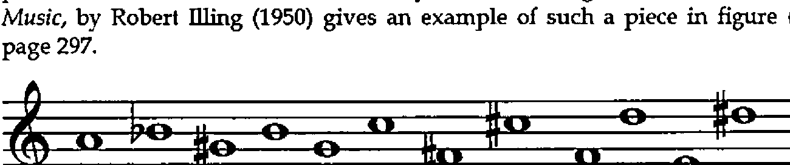
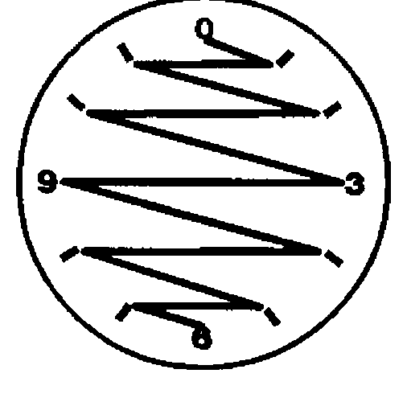

*by Eugene McDonnell*
{ .byline }

This paper discusses a combinatorial problem arising in the field of music, and shows the importance of the `A.` primitive discussed in my last column.

The problem was told to me many years ago by Ken Iverson, who had heard it from Adin Falkoff, who in turn had heard it from Stephen Bauer-Mengelberg, a conductor / programmer who was a colleague of Ken and Adin’s at IBM’s Systems Research Institute at UN Plaza in New York City in the early 1960s. [Picturesque but irrelevant detail: Adin tells of asking Bauer Mengelberg how one of the pieces he conducted at a concert the night before had gone. The answer was "The first movement went only so-so, but with the second movement I floated off the podium."]

The problem deals with the twelve-tone music associated with the composer Arnold Schoenberg. I am not a musician, so I shall only briefly describe it musically, and then convert it into a problem in combinatorial mathematics.

The problem is to describe all the ways in which the twelve semitones of the octave can be written so that each is used exactly once, and so that each interval possible within the octave occurs exactly once. The Penguin book *A Dictionary of Music*, by Robert Illing (1950) gives an example of such a piece in figure (f) on page 297.



The notes begin with A natural, and then alternately rise and fall, in the sequence B flat, G sharp, B natural, G natural, C natural, F sharp, C sharp, F natural, D natural, E natural, and D sharp. I find it convenient to number these notes according to their signed distances from A natural, which I number as 0. The twelve notes are then seen as

```text
0 1 _1 2 _2 3 _3 4 _4 5 _5 6
```

And it simplifies things if we take these mod 12, giving

```text
0 1 11 2 10 3 9 4 8 5 7 6          [A]
```

I have found it helpful visually to write these numbers as the hours on a clock face (using 0 in place of 12), and to connect the hours by lines in the order given, that is, draw a line connecting 0 to 1, 1 to 11, 11 to 2, and so on, ending with a line drawn from 7 to 6.



This clock figure makes more apparent various symmetries that reduce the number of permutations that need to be considered.

If we take the first difference of [A], we get the following:

```text
1 10 _9 8 _7 6 _5 4 _3 2 _1
```

and if we take this mod 12, we get

```text
1 10 3 8 5 6 7 4 9 2 11          [B]
```

and it is easy to see that the list [A] is a 0-origin permutation having a first difference, mod 12 [B] which is a 1-origin permutation. Thus we have transformed the musical problem, having to do with twelve-tone rows, into the combinatorial problem of determining all the permutations of `i. 12` having a first difference which is a permutation of `>: i. 11`. That is, we want to know how many such permutations there are, and what they are. To make it easier to discuss "a permutation having a first difference mod permutation length also a permutation", I’ll call such an object a *‘dil’* (from *Distinct Interval List*).

There are 479,001,600 permutations of `i. 12`, so it is a large problem to sift through these permutations looking for dils. For example, to load the table of all permutations of order 12 would take `4*12*!12`, or 22,992,076,800 bytes. I believe that this would be impossible to load in real memory on the largest contemporary machine. This paper explores ways to cut it down to a more manageable size.

I heard the problem in the early 1960s when Iverson notation was available only on the printed page, and worked at it by hand for several months without making much progress. Recently I decided to tackle it once more, beginning by studying the permutations of smaller order. I found that dils occur only among even length permutations. The order two permutations are easy: both are dils: 0 1 and 1 0, having an interval of 1. These can be done mentally, but it quickly becomes necessary to develop programming tools to aid in the exploration:

```text
   pt=.i.@! A. i.      NB. permutation table
   mfd=.# | }. - }:    NB. modular first difference
   mn=. -: ~.          NB. distinct items?
   dil=.mn@mfd"1       NB. a dil?
   dils=. dil # ]      NB. all dils
   pt 3
0 1 2
0 2 1
1 0 2
1 2 0
2 0 1
2 1 0
   mfd 0 1 5 2 4 3
1 4 3 2 5
   mn mfd 0 1 5 2 4 3
1
   dil 0 1 5 2 4 3
1
```

Studying the dils of order 4 give us some insight into the problem:

```text
   dils pt 4     NB. dils of length 4
0 1 3 2
0 3 1 2
1 0 2 3
1 2 0 3
2 1 3 0
2 3 1 0
3 0 2 1
3 2 0 1
```

Some symmetries are present that will let us cut the problem down in size. Only permutations beginning with 0 need be considered, since the others can be obtained by clock face rotations:

```text
   ro=. #@] | +     NB. rotate y by x
   1 ro 0 1 3 2
1 2 0 3
   2 ro 0 1 3 2
2 3 1 0
```

and similarly for the others. I call the dils beginning with zeros ‘basic dils’, since all the others can be obtained from them by rotation, or, in musical terms, by transposing. By looking for dils only among permutations beginning with 0, our order !12 problem has been reduced reduced to an order !11 problem, or 39,916,800. Here are the basic dils of orders 4, 6, and 8:

```text
   a4=.dils(i.!3)A. i.4
   a6=.dils(i.!5)A. i.6
   a8=.dils(i.!7)A. i.8
   a4         a6             a8
0 1 3 2    0 1 5 2 4 3    0 1 3 6 2 7 5 4
0 3 1 2    0 2 1 4 5 3    0 1 6 5 3 7 2 4
           0 4 5 2 1 3    0 1 7 2 6 3 5 4
           0 5 1 4 2 3    0 1 7 3 6 5 2 4
                          0 2 1 5 3 6 7 4
                          0 2 3 6 5 1 7 4
                          0 2 5 1 7 6 3 4
                          0 2 7 6 1 5 3 4
                          0 3 1 2 6 5 7 4
                          0 3 2 7 1 5 6 4
                          0 3 5 1 2 7 6 4
                          0 3 5 6 2 1 7 4
                          0 5 3 2 6 7 1 4
                          0 5 3 7 6 1 2 4
                          0 5 6 1 7 3 2 4
                          0 5 7 6 2 3 1 4
                          0 6 1 2 7 3 5 4
                          0 6 3 7 1 2 5 4
                          0 6 5 2 3 7 1 4
                          0 6 7 3 5 2 1 4
                          0 7 1 5 2 3 6 4
                          0 7 1 6 2 5 3 4
                          0 7 2 3 5 1 6 4
                          0 7 5 2 6 1 3 4
```

Further efficiencies are possible. Notice that all of these dils not only begin with the constant 0, but end with a constant that is half of the order: 2, 3, and 4 for orders 4, 6, and 8, respectively. This means that in searching for dils we only have to look at those permutations beginning with 0 and ending with a constant, with some permutation between them.

The desired inner permutation is given by:

```text
   si=. i. -. 0: , -:    NB. integers thro n-1, less 0 and -:n
   si 2

   si 4
1 3
   si 6
1 2 4 5
   si 8
1 2 3 5 6 7
   si 10
1 2 3 4 6 7 8 9
   si 12
1 2 3 4 5 7 8 9 10 11
```

By having to consider only inner permutations of order n-2, we have now reduced our problem to one of order !10, or 3,628,800. Furthermore, looking carefully again at the tables a4, a6, and a8 above, we see that only the first half of the basic dils need to be tested, since the rest can be found by clock face reflections in the y-axis. That is, any one of the rows in the lower half of any of these tables is obtainable from one of the rows in the upper half. The verb `ry` reflects a dil about the y-axis:

```text
   ry=. # | # - ]
   ry 0 1 3 2
0 3 1 2
```

This means that to find the dils of order 12, we have to test only `-:!10`, or 1,814,400 permutations. This is a reduction from !12 by a factor of 264.

Since we can always retrieve a dil if we know its atomic number and its length, we don’t need to exhibit the complete row. It suffices to obtain only its atomic number. For example, the dils of order 4 can be obtained using only 8 integers, rather than the 32 required by the display of the four atoms of each permutation form of the dil. We can define a verb `dan` to give us the dils in atomic number form:

```text
   dan=. (dil # A.)     NB. dil atomic number
   dan pt 4             NB. atomic numbers of dils of order 4
1 4 6 8 15 17 19 22
```

There are two additional clock face reflective symmetries in these dils. In addition to the y-axis symmetry mentioned above, there are reflections possible in the x-axis, and in both the x and y axes. For example, the dil:

```text
   r=. 0 1 3 2 7 10 8 4 11 5 9 6
```

can be reflected in the x-axis by:

```text
   rx=. [: |. # | -:@# - ]
   rx r
0 9 1 7 2 10 8 11 4 3 5 6
```

and in the x-y axes by:

```text
   rxy=.[: |. # | -:@# + ]
   rxy r
0 3 11 5 10 2 4 1 8 9 7 6
```

I haven’t found a way to use these further symmetries to reduce the work necessary to solve the dil problem. The program I use to find the primitive dils of order n is:

```text
   pdon=. 3 : 0
NB. argument is 4-item list, e.g. pdon 12 5040 0 1814400
 'nibm'=.y.
NB. n is length of permutation
NB. i is size of batch (depends on memory size and n)
NB. b is base index (usually 0 initially)
NB. m is maximum item number (usually -:!n-2)
NB. z is result, list of indices of primitive dils of order n
 z=.''
 s=.si n              NB. for example, si 8 is 1 2 3 5 6 7
 h=.-:n               NB. for n=8, h is 4
 while. b<m do.
   t=.0,.((b+i.i)A. s),.h  NB. provide another batch
   z=.z,dan t         NB. append primitive dil atomic #s to z
   b=.b+x             NB. step base by batch size
 end.
z
)
```

The line assigning t shows the utility of being able to specify the right argument to the `A.` primitive. On my computer, it took about 10 minutes to compute the dils of order 10. I don’t know how long it took to do those of order 12. I started it going just before I went to bed, and it was ready in the morning.

For the record, the number of dils of orders 2 through 12 are:

```text
order   primitive dils   basic dils   all dils
  2           1               1           2
  4           1               2           8
  6           2               4          24
  8          12              24         192
 10         144             288        2880
 12        1928            3856       46272
```

Here are a few nicely symmetrical dils of order 12:

```text
   pty12s=.646517 3154657 4275293 5762095 7289175 9306655
   pty12s=. pty12s, 11633649 12187013 13754599 14826363
16823821

   pty12s A. i.12
0 1  3 10  2  5 11 8  4  9  7 6
0 1 10  8  3 11  5 9  2  4  7 6
0 2  3 10  1  5 11 7  4  9  8 6
0 2  7 10 11  3  9 5  4  1  8 6
0 3  1  2 10  5 11 4  8  7  9 6
0 3  7  8 10  5 11 4  2  1  9 6
0 4  3  1  8  5 11 2  7  9 10 6
0 4  5  8  3  1  7 9  2 11 10 6
0 4  9 11  2  1  7 8  5  3 10 6
0 5  1 10  8  9  3 2  4  7 11 6
0 5  8  4  3  1  7 9 10  2 11 6
```

If you’re a musician you might try playing these. They also make interesting clock face patterns. If you have a current version of J on your computer you can see them drawn using the graphics facilities available. The functions `sogwin` and `sline` are available if you have profile.js in the command line as advised in installing the system. Additional information about using the J graphics facilities are described in the book *‘Fractals Visualization and J’* by Clifford Reiter, available from Iverson Software, Inc.

Here is the beginning of a sample session of visualizing dils on a clock face to help you get started:

```text
   ]r12=: 12 %: _1          NB. 12th root of negative 1.
0.965926j0.258819
   all=. r12^2*i.12         NB. first 12 powers of this root
   ]coords=. +.all          NB. real & imaginary parts
           1            0
    0.866025          0.5
         0.5     0.866025
 6.12574e_17            1
        _0.5     0.866025
   _0.866025          0.5
          _1  1.22515e_16
   _0.866025         _0.5
        _0.5    _0.866025
_1.83772e_16           _1
         0.5    _0.866025
    0.866025         _0.5

   scaled=. 500*1+coords    NB. scale to screen coordinates
    1000     500
 933.013     750
     750 933.013
     500    1000
     250 933.013
 66.9873     750
       0     500
 66.9873     250
     250 66.9873
     500       0
     750 66.9873
 933.013     250
```

With these defined you can create a graphics window with:

```text
   sogwin 'scaled'
   0 sline scaled
```

And display the lines for a given permutation on the clock face with

```text
   perm=. 12 | 3+ry 0 1 11 2 10 3 9 4 8 5 7 6
   p=. perm{scaled
   0 sline p
```

The definitions of some of the graphics verbs needed are given below:

```text
   sogwin =. 3 : 0
3 3 500 500 sogwin y.  :
x=.<.x.%2.5
z=.'pc ',y.,';xywh ',(": x),';cc g isigraph;pas ',":2{.x
wd z,';pcenter;pscale;pcloseok;pshow sw_showna;'
)

 sline =. 3 : 0"1 2
0 0 0 sline y.
:
wd 'grgb ',(":x.),'; gpen 1 ps_solid;'
wd 'gmove ',(":{.y.),';'
wd z=:,'gline ',"1 (":}.y.),"1 ';'
wd 'gshow;'
)

   spoly =. 3 : 0"1 2
wd 'gpolygon ',(,' ',.":y.),';gshow;'
:
sfill x.
spoly y.
)
```
