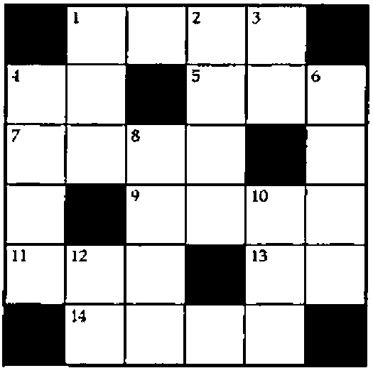

*by Eugene McDonnell*
{ .byline }

## Making Shift

To refresh your memory about J’s shift verb, here is what the online *J Dictionary* says:

> The phrase `x |.!.f y` produces a shift: the items normally brought around by the cyclic rotation are replaced by f unless f is empty (`0=#f`), in which case they are replaced by the normal fill defined under `{.` (take):
>
> ```text
>    t=: 'abcdefg'
>    2 _2 |.!.'#'"0 1 t
> cdefg##
> ##abcde
> ```
>
> The right shift is the dyadic case of `|.!.f` with the left argument `_1`. For example:
>
> ```text
>    |.!.'#' t
> #abcdef
> ```

This article uses the shift verb in numbering the squares of crossword puzzles and in Conway’s Game of Life. The use of the shift verb is similar in both: it applies to tables along both the columns and the rows. It also applies to the neighbours of an atom: those reachable by a one-square rook move in the case of the crossword puzzle, and those reachable by a one-square queen move in the case of Life.

All of the shifts are of amount one. A shift of one is *ahead* if the last item is shifted out, and a fill item is introduced at the beginning; that is, the direction of shift is toward the larger index. A ‘shift one ahead’ verb is thus:

```text
   soa =: |.!.''
```

Notice that the fill item is empty (`''`), so that `soa` can be used with nouns of any type, with the default fill for that type being used. In our cases we shall be working with numeric data, so the fill item will be the number zero.

```text
   L =: 2 3 4 5 6
   soa L       NB. shift the last item out
0 2 3 4 5
   T =. 1 2 3 +/ L
   T
3 4 5 6 7
4 5 6 7 8
5 6 7 8 9
   soa T       NB. shift the last item out
0 0 0 0 0
3 4 5 6 7
4 5 6 7 8

   soa"1 T     NB. shift the last item of each item (row) out
0 3 4 5 6
0 4 5 6 7
0 5 6 7 8
```

Similarly, a shift of one is *back* if the first item is shifted out, and a fill item is introduced at the end; that is, the direction of shift is toward the smaller index. A ‘shift one back’ verb is thus:

```text
   sob =: 1&soa
   sob L       NB. shift the first item out
3 4 5 6 0
   sob T       NB. shift the first item out
4 5 6 7 8
5 6 7 8 9
0 0 0 0 0
   sob"1 T     NB. shift the first item of each item (row) out
4 5 6 7 0
5 6 7 8 0
6 7 8 9 0
```

## A Crossword Problem

A crossword puzzle (the kind I am familiar with, that appear in the newspapers in the United States) consists of two tables of numbered clues, labelled ‘Across’ and ‘Down’, together with a usually square diagram containing regularly spaced rows and columns which divide it into smaller squares, some black, but most white, in a usually symmetrical pattern. Some of the white squares contain numbers, and these indicate the beginning of an infix of squares going across or down, where the letters of a word are to be written, and these are keyed to the clues. The numbers are in ravel, or row-normal order, beginning with 1.

Here is a small crossword puzzle diagram, with its clues:



| Across | Down |
|---|---|
| 1. Competent | 1. Common abbreviation |
| 4. Direction | 2. Helen’s mother |
| 5. Australian bird | 3. Printer’s measure |
| 7. Ran away | 4. Phantasmic celestials |
| 9. Damn euphemism | 6. Tempt |
| 11. Bath, for instance | 8. Cheese |
| 13. That is | 10. Small thing |
| 14. Leave out | 12. Italian river |

The pattern of a crossword puzzle can be represented by a matrix in which a white square is represented by a one, and a black square by a zero. For example:

```text
   M
0 1 1 1 1 0
1 1 0 1 1 1
1 1 1 1 0 1
1 0 1 1 1 1
1 1 1 0 1 1
0 1 1 1 1 0
```

A professional composer of such puzzles undoubtedly knows from experience which squares are to contain a clue number. An inexperienced computer has to be taught. We’ll show how to teach a computer to number the squares, with the help of J’s shift instruction.

In Exercise 1.3.2-23 of his book *Fundamental Algorithms*, Donald Knuth gives the rule as follows:

> A square is numbered if it is a white square and either (a) the square below it is white and there is no white square immediately above, or (b) there is no white square immediately to its left and the square to its right is white.

Notice how Knuth carefully yet a bit awkwardly avoids saying ‘black square above’ and ‘black square to the left’, and instead says ‘no white square’. I think this is because of the white squares in the top row and leftmost column. What is above or to the left of them? Shades of Jim Brown’s empty array jokes! How can you tell whether what is above a white square in the top row is not a white square?

The problem is solved by shifting all of the one-square rook move squares to coincide with that square. For the border squares, this ensures that zeros, signifying ‘black’ squares, are shifted to coincidence. This is done in two steps, producing two matrices of the same size as the puzzle diagram matrix.

The verbs to solve the crossword numbering problem are:

```text
   f =: soa < sob
   X =: ] *. f +. f"1
```

The use of `f"1` produces a one for each atom in the matrix in which the square to its left is less than the square to its right. This is true only if the square to the left is black (`0`) and the square to the right is white (`1`). This identifies the potential squares where an across word can begin.

The following use of the verb `f` produces a one for each atom in the matrix in which the square above it is less than the square below it. This is true only if the square above is black and the square below is white. This identifies the potential squares where a down word can begin.

The verb `X` *ors* these two results, producing a matrix showing all squares satisfying either of these tests (the same square can be `1` in both tests). This combined square is *and*ed with the original square, yielding a result which has a `1` only where there is also a `1` in the original, thus definitely identifying squares to be numbered as the beginning of either an across or a down word.

These steps are summarized as follows:

```text
       M      ;    (f M)    ;  (f"1 M)    ;(]*.f+.f"1)M
┌───────────┬───────────┬───────────┬───────────┐
│0 1 1 1 1 0│1 1 0 1 1 1│1 1 0 0 0 0│0 1 0 1 1 0│
│1 1 0 1 1 1│1 0 0 0 0 1│1 0 0 1 0 0│1 0 0 1 0 1│
│1 1 1 1 0 1│0 0 1 0 0 0│1 0 0 0 0 0│1 0 1 0 0 0│
│1 0 1 1 1 1│0 0 0 0 1 0│0 0 1 0 0 0│0 0 1 0 1 0│
│1 1 1 0 1 1│0 1 0 0 0 0│1 0 0 0 1 0│1 1 0 0 1 0│
│0 1 1 1 1 0│0 0 0 0 0 0│1 1 0 0 0 0│0 1 0 0 0 0│
└───────────┴───────────┴───────────┴───────────┘
```

The verb `X` encapsulates these steps. We obtain the final result by applying `X` to `M`:

```text
   c =: X M
   c
0 1 0 1 1 0
1 0 0 1 0 1
1 0 1 0 0 0
0 0 1 0 1 0
1 1 0 0 1 0
0 1 0 0 0 0
```

Knuth’s exercise asks for a display of the puzzle using black and white squares made of plusses, minuses, and stiles. To complete the exercise we give with no further ado …

```text
   clb=: [: +/ [: *./\ ' '"_ = ] NB. count leading blanks

   CWD=: monad define
NB. y. is boolean matrix giving a crossword puzzle pattern
NB. where 0 represents a black square and 1 a white square;
NB. yields crude numbered crossword puzzle diagram.
   bw =. <'    +','    +',:'+++++' NB. scalar white square
   bb =. <'+++++','+++++',:'+++++' NB. scalar black square
   g =. [: , [: ,. / [: > ]        NB. ravel stitch insert open
   a =. , X y.                     NB. mark across and down
squares
   b =. (clb |.])"1 ":,.>:i.+/a    NB. format & left adjust
numbers
   c =. <"2 b(<0;0 1)}"1 2>bw      NB. insert numbers in blanks
   d =. cws0(bw;((,y.)#a);<c)      NB. insert blank white
squares
   e =. cws0(bb;(,y.);<d)          NB. insert black squares
   f =. g"1 ($y.)$e                NB. stitch open of reshape
   '+',.'+',(3 5*$y.)$,f           NB. reshape and border )
```

When this is applied to `M` we get:

```text
   CWD M
+++++++++++++++++++++++++++++++
++++++1   +    +2   +3   ++++++
++++++    +    +    +    ++++++
+++++++++++++++++++++++++++++++
+4   +    ++++++5   +    +6   +
+    +    ++++++    +    +    +
+++++++++++++++++++++++++++++++
+7   +    +8   +    ++++++    +
+    +    +    +    ++++++    +
+++++++++++++++++++++++++++++++
+    ++++++9   +    +10  +    +
+    ++++++    +    +    +    +
+++++++++++++++++++++++++++++++
+11  +12  +    ++++++13  +    +
+    +    +    ++++++    +    +
+++++++++++++++++++++++++++++++
++++++14  +    +    +    ++++++
++++++    +    +    +    ++++++
+++++++++++++++++++++++++++++++
```

## Conway’s Game of Life

In Knuth’s *The Metafont Book*, Addison Wesley, 1986, Exercise 13.24, p. 121, and Answer 13.24, p. 245 are as follows:

> Exercise 13.24: In John Conway’s "Game of Life" pixels are said to be either *alive* or *dead*. Each pixel is in contact with eight neighbors. The live pixels in the (n+1)st generation are those who were dead and had exactly three neighbors in the nth generation, or those who were alive and had exactly two or three live neighbors in the nth generation. Write a short METAFONT program that displays successive generations on your screen.
>
> Answer 13.24: (We assume that `currentpicture` initially has some configuration in which all pixel values are zero or one; one means "alive.")
>
> ```text
> picture v; def c = currentpicture enddef;
> forever: v := c; showit;
>  addto c also c shifted left + c shifted right;
>  addto c also c shifted up + c shifted down;
>  add to c also c - v; cull c keeping (5 , 7); endfor.
> ```

(It is wise not to waste too much computer time watching this program.)

It is not apparent, but Knuth’s approach assumes a flat universe, where, as is customary, if things are pushed beyond the edges, they fall off the surface. Many APL approaches, using the rotate verb, assume a toroidal universe, where the display is assumed to connect both horizontally and vertically, and if things are pushed beyond the edges, they wrap around, staying on the surface, and appearing on the opposite edge.

Assuming that you don’t speak METAFONT, I’ll explain the logic behind this program. It encodes the values of the pixel and its eight neighbours to indicate a pixel which is to be alive or dead in the next generation. The encoding gives a weight of one to the pixel and a weight of two to each of its neighbours. If we compute the sum of the pixel plus twice the sum of its neighbours, we can arrive at any of the eighteen values from zero through seventeen: zero for a dead pixel or one for a live pixel, plus 0, 2, 4, 6, 8, 10, 12, 14, or 16 for twice the sum of its neighbours, depending on whether the number of alive neighbours is 0, 1, 2, 3, 4, 5, 6, 7, or 8. Then "dead and exactly three live neighbours" is (0+(2\*3)), or 6, and "alive and exactly two or three live neighbours" is (1+(2\*2)), or 5, and (1+(2\*3)) or 7, so we get the next generation by replacing each sum equal to 5, 6, or 7 by one, and all others by zero.

Knuth forms a new picture as the sum of the picture and the picture shifted one column left and the picture shifted one column right.

He adds this new picture to the new picture shifted down one and the new picture shifted up one, next doubles the value of each pixel, then subtracts the original pixel, giving us the value we desire. It only remains to see whether this is one of the life-giving values. That’s what the cull verb does: it culls the chaff from the result, leaving only those having the value 5 or 6 or 7.

J verbs to do what Knuth’s MetaFont program does are:

```text
   g =: ] + soa + sob
   h =: ] -~ [: +: [: g g"1
   L =: h e. 5 6 7"_
```

The verb `g` will be used in somewhat the same way as the verb `f` in the crossword puzzle problem. It is used first (`g"1`) to form the sum of each column with the columns on either side, then applies `g` to this, forming the sum of each row with the rows on either side, doubles (`+:`) this, then subtracts (`] -~`) the original picture. The verb `h` encapsulates this. The verb `L` uses `h` to go through these steps, then determines which atoms of the result are equal to either 5 or 6 or 7.

Given a picture:

```text
   picture =: 0 0 0 0 0,0 1 1 1 0,0 0 1 0 0,0 1 1 0 0,:0 0 0 0 0
```

Its original value and the next 5 steps of Life are:

```text
   q =: L^:(i.6) picture
   <"2 q
┌─────────┬─────────┬─────────┬─────────┬─────────┬─────────┐
│0 0 0 0 0│0 0 1 0 0│0 1 1 1 0│0 1 0 1 0│0 0 1 0 0│0 0 0 1 0│
│0 1 1 1 0│0 1 1 1 0│0 1 1 1 0│0 1 0 0 1│0 0 0 1 1│0 0 0 1 0│
│0 0 1 0 0│0 0 0 0 0│0 0 0 1 0│0 0 0 1 0│0 0 0 0 0│0 0 0 0 0│
│0 1 1 0 0│0 1 1 0 0│0 0 0 0 0│0 0 0 0 0│0 0 0 0 0│0 0 0 0 0│
│0 0 0 0 0│0 0 0 0 0│0 0 0 0 0│0 0 0 0 0│0 0 0 0 0│0 0 0 0 0│
└─────────┴─────────┴─────────┴─────────┴─────────┴─────────┘
```
