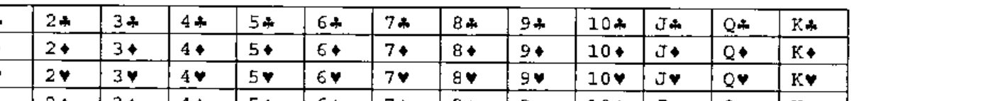

*by Gene McDonnell & Richard Smith*
{ .byline }

## Introduction

The crowd sits and waits, eagerly anticipating the showman’s grand entrance. Eventually he arrives, bringing his glamorous assistant and a pack of cards with him. He selects a volunteer from the audience and asks them to pick five cards out of the pack and give them to the assistant, without of course seeing them himself. The assistant then shows him four of the cards, and, after a suitable dramatic pause, the showman identifies the fifth. The crowd applauds, and the magician and his assistant leave after a few repeats to show it wasn’t a fluke.

Those of you who were at last month’s Finnish conference will already have seen this spectacle, know that the showman in question is actually Adrian, and moreover will know the twist, which is that the assistant is not a 5′6″ blonde but a 4″ by 2″ grey box which comes with a screen and a stylus.

I’m sure that some of you asked him afterwards how he did it, and I suspect that instead of the usual "Magic!" he said "Wait for the next Vector"; this article shows you how the trick works and how the digital Esmerelda is written. (Of course, the assistant is far more important than the magician.)

## The Trick

Anyone who reads *New Scientist* can skim-read this section, as the trick follows the same principle as that described in one of its recent articles. However, it is obviously vital to understand the trick before trying to understand the implementation.

The interesting nature of this trick stems from the fact that using a simple analysis, it would seem to be impossible. 4 cards can only encode 4!, or 24, combinations, while there are 48 options for the fifth card. We can narrow it down by using one of the cards to pin down the suit of the fifth (there must be at least 2 cards which share a suit in the five), but then we only have 3 cards, giving 3! or 6 combinations, to account for 12 possibilities.

The secret, of course, lies in the ordering of the cards. Because the assistant gets to choose which of the five cards is hidden, she can choose such that the hidden card is within 6 of the visible card in that suit. For example, if two of the cards were the 10 and 2 of spades, hiding the 10 would not work (10 - 2 = 8, which is more than 6), but hiding the 3 gives a difference of 5 (J-Q-K-A-2). There is always a way to arrange two cards in a suit so this is true.

Now we can use the 6 combinations of the other three cards, combined with a suit card, to find the missing card. We take the relative sizes of the cards, and use their order to generate a number: 1 for small-medium-large, 2 for small-large-medium all the way up to 6 for large-medium-small. Then add this number to the number on the exposed card of the suit to find the missing card.

There is one small complication – what if we have, say, two 3’s? We define the suits to have an order, so that the 3 of spades is ‘higher’ than hearts, diamonds or clubs.

## The Implementations

Both of us have produced an implementation of Esme; Gene’s is written in J and Richard’s is in Dyalog APL. (Richard’s is the one you may have seen in Finland, running under Pocket APL.) Both are very simple and easy to follow.

### Gene’s Version

```j
suits =: '♣♦♥♠'
values=: 'A23456789TJQK'
```



Here is a sketch showing the results of the steps in performing the magical trick.

The argument is list of 5 distinct integers from `i.52`.

```j
   y. =: 45 24 49 20 40

   vsi y.
+--+--+--+--+--+
|7S|QD|JS|8D|2S|
+--+--+--+--+--+
```

Sort the integers and append them below a 2 x 5 table of suits and values.

```j
   sv =. ((] , ~ [: |: 4 13 " _ #: ]) @ /: ~) y.
   sv
 1  1  3  3  3
 7 11  1  6 10
20 24 40 45 49
```

Get a list of sublists, each sublist giving the indices of cards having the same suit.

```j
   ta =. ({. < /.  0 1 2 3 4 " _) sv
   ta
+---+-----+
|0 1|2 3 4|
+---+-----+
```

Select the sublists having more than one card.

```j
   tb =. (] # ~ 1: < [: # & > ]) ta
   tb
+---+-----+
|0 1|2 3 4|
+---+-----+
```

Select one of these sublists at random.

```j
   tc =. (> @ ({ ~ ? @ #)) tb
   tc
2 3 4
```

Select two of its indices at random, preserving order.

```j
   td =. (] { ~ /: ~ @ (2 & ?) @ #) tc
   td
2 4
```

Move the two columns with the selected indices to the front.

```j
   pc =. td(([:([ , ] -. ~ 0 1 2 3 4 " _)[) { " 1 [: }. ])sv
   pc
 1 10  7 11  6
40 49 20 24 45
```

Find the commuted difference of the first two columns of the value row. This is positive, in the range 1-12. Take top row only of result, and append difference.

```j
   cd =. ((([: - - / 2: {. {.) , ~ {:) @ }. )pc
   cd
40 49 20 24 45 9
```

If the tail is less than 7, delete the second item, otherwise the first.

```j
   dc =. (([: < [: < [: < {: < 7:) { ]) cd
   dc
49 20 24 45 9
```

If the tail is less than 7, leave it unaltered; otherwise replace it by 13 - tail.

```j
   ce =. (([ ` (13 & | @: -) @. (7 & <:)) {: dc)4 } dc
   ce
49 20 24 45 4
```

Determine which special permutation to apply, using the tail value as determinant; drop the tail; apply the permutation.

```j
   rs =: (((5 3 & p. - -. @ (2 & |)) {: ce) A. i. 4) { }: ce
   rs
24 45 49 20

  vsi rs
+--+--+--+--+
|QD|7S|JS|8D|
+--+--+--+--+
```

The magician sees that the third card is a spade, and that the other cards are in the order 1 2 0, which is the fourth permutation of order 3. The fourth card beyond JS is 2S. QEF.

### Richard’s Version

This implementation is very much in the same mould, with `⎕IO` set to 0 so as to match the J. Here is the code for the core algorithm, together with the (totally minimal) user-interface to make it workable in the field on Pocket APL:

```apl
     ∇ Go;inp;deck
[1]   ⍝ Run ESME simulator
[2]    'Tell me the 5 cards ...'
[3]    'Suits are CDHS and cards'
[4]    'range from A,2 to 9,TJQKA'
[5]    'e.g. 5s 8d 3c 4h as'
[6]    ' '
[7]   Next:⍞←'>'
[8]    inp←1↓,⍞ ⋄ →(⍴inp)↓Done
[9]    deck←∪Cards2Nums inp
[10]   →(5≠⍴deck)↑Badboy
[11]   →(∧/deck<52)↓Badboy
[12]   'Say these 4 ...' ⋄ ' '
[13]   Nums2Cards Esme deck
[14]   ' ' ⋄ '(in this order!)' ⋄ ' '
[15]   →Next
[16]  Badboy:'Try to fool me eh!'
[17]   'We need 5 distinct cards here ...' ⋄ ' '
[18]   →Next
[19]  Done:'Easy, for a PocketAPL'
     ∇

     ∇ nv←Cards2Nums str;lkp;vtv
[1]   ⍝ Look up names and return card index
[2]    lkp←,⍉names∘.,suits
[3]    vtv←1↓¨(+\1,str∊', /;')⊂',',toupper str
[4]    nv←lkp⍳vtv
     ∇

     ∇ r←Esme cards;sv;ta;tb;tc;td;pc;cd;diff;dc;⎕IO;⎕ML
[1]   ⍝ Do the sorting. See MagicCD.doc
[2]    ⎕IO←0
[3]    ⎕ML←3 ⍝ for partition enclose
[4]    sv←{3 5⍴{(⌊⍵÷13),(13|⍵),⍵}⍵[⍋⍵]}cards
[5]    ta←(1+sv[0;])⊂⍳5
[6]    tb←({1∊1<⍴⍵}¨ta)/ta
[7]    tc←0⊃tb[?⍴tb]
[8]    td←tc[{⍵[⍋⍵]}2?⍴tc]
[9]    pc←sv[1 2;td,((⍳5)~td)]
[10]   cd←pc[1 0;] ⋄ diff←,--/1 2↑pc
[11]   dc←((6≥diff),(6<diff),1 1 1)/cd
[12]   :If 6<diff ⋄ diff←13-diff ⋄ :End
[13]   dc←dc[0;0,1+⍋dc[1;1 2 3]] ⍝ Reorder numerically
[14]   r←dc[(diff-1)⊃∆perms]
     ∇

     ∇ vtv←Nums2Cards nv;lkp
[1]   ⍝ Report names
[2]    lkp←(,⍉names∘.,suits),⊂'??'
[3]    vtv←tolower⍕lkp[nv]
     ∇

names suits
 A23456789TJQK  CDHS
∆perms
 1 2 0 3  1 3 0 2  2 1 0 3  2 3 0 1  3 1 0 2  3 2 0 1
      Go
Tell me the 5 cards ...
Suits are CDHS and cards
range from A,2 to 9,TJQKA
e.g. 5s 8d 3c 4h as

>5c 9d ad th 2c
Say these 4 ...

 9d  ad  2c  th

(in this order!)

>
Easy, for a PocketAPL
```

There is still a small amount of brain-work left for the magician – in this case the thought process would be "It’s a club. *Nine,Ace,Ten* is *Medium,Small,Large* (Ace is low) which is 3 on our scale of 1-6 (SML->LMS) so 2+3 is the Five of Clubs." As for the ‘inverse’ function, it could be an exercise for the reader, but it would take longer to enter the data than it takes to do the logic in your head. Anyway, people would suspect a WiFi network!
