*by Donald B. McIntyre*
{ .byline }

## Introduction

After teaching APL to colleagues and students for many years [1,2,3], in retirement I am discovering the age-levels at which various mathematical concepts can be usefully introduced to children with the aid of the executable notation J. Teachers at Edradour School, Pitlochry, are helping me look at the possible use of J [4-8] to help children learn arithmetic. Although lacking Zdenek Jizba’s experience in the elementary classroom [9], I hope the examples given here will encourage teachers to investigate J with their pupils. The underlying notation and syntax of the language are explained for the teacher, who must decide how much to disclose to particular pupils.

Algebra passed through three stages: *rhetorical*, *syncopated*, and *symbolic*. At first words were used, without other symbols. The words were then abbreviated, and eventually the abbreviations became so contracted that the origin of the symbols was forgotten. New symbols were devised for operations hitherto unknown or not formalised [10-12]. J provides a large number of symbols, but the teacher (or user) can name these, thus reverting to the rhetorical (or perhaps syncopated) stage. This may at times be a convenience for any user; in particular a teacher may find that children are at first more comfortable with words than symbols.

As we grow we seem destined to recapitulate the intellectual history of our race. Pupils should nevertheless be encouraged to use symbols as early as possible. Dantzig put it well: "Greek thought was essentially non-algebraic, because it was so concrete. The abstract operations of algebra, which deal with objects that have purposely been stripped of their physical content, could not occur to minds which were so intensely interested in the objects themselves. *The symbol is not a mere formality*; it is the very essence of algebra. Without the symbol the object is a human perception and reflects all the phases under which the human senses grasp it; replaced by a symbol the object becomes a complete abstraction, a mere *operand* subject to certain indicated operations. … The symbol has a meaning which transcends the object symbolised; that is why *it is not a mere formality*. It is the power of transformation that *lifts algebra above the level of a convenient shorthand.*" [11, p.80, 87. Italics in original].

## The J dialect

Mathematics is a language [11-14]. Indeed Hogben, in a book of great popularity and influence, included a chapter on the grammar of mathematical language [13], distinguishing the *verbs* (functions) and *nouns* (data) of mathematical sentences. Hui and Iverson et al have gone further, recognising and implementing *adverbs* (monadic operators) and *conjunctions* (dyadic operators) [15]; Bernecky and Hui have shown the power of *gerunds* (function arrays) for parallel processing [16]; and Iverson and McDonnell added *phrasal forms* and *pronouns* [17]. J uses *pro-verbs*, and similar names assigned to adverbs and conjunctions [4].

J is a powerful dialect of APL available as shareware implemented for a large number of computers [18]. Its roots are in Iverson notation [19] and in APL’s method of Direct Definition of functions [20, 21, 12]. The spelling adopted uses `ASCII` characters, either alone or immediately followed by a period (`.`) or colon (`:`). Thus `+` is *plus*, `+.` is *or*, and `+:` is *double*; `%` is *divide*, `%.` is *matrix divide*, and `%:` is *square root*. As in all dialects of APL, both monadic and dyadic meanings are recognised. Assignment is written `=.` and read "is".

When an expression is executed the result is produced and can be assigned to a variable. If no assignment is made the result is displayed. In the examples below expressions for execution are shown after three spaces at the beginning of the line and the results are shown on the next line and beginning in the first column of the line. If the expression is a verb or a pro-verb (the name of a verb), then the definition of the verb is shown in boxes (see examples later in the article).

## Names

Nouns, verbs, adverbs, conjunctions, and gerunds can all be assigned names. If the name *plus* is easier to remember than the symbol `+`, simply assign and use the name. Names used instead of nouns are pronouns; pro-verbs stand for verbs in a similar way; and other parts of speech can be named also. Here I define some names for use in the rest of this article. The rows of the table are the defining expressions in J and can be entered like this on a computer running J. In J the comment symbol is `NB.` and anything after that on a line is ignored. Definitions given here are informal; see the *Dictionary* for details [4].

Pro-verbs (or verbs, for short):

```text
add=. +                NB. synonyms can be helpful. See plus
behead=. }.            NB. drop first item
copy=. #               NB. x # y is x copies of y
divided_by=. %         NB. 12%3  is  4
double=. +:            NB. +: 5  is  10
floor=. <.             NB. <. x drop any fractional part of x
format=. ":            NB. width and precision of output
halve=. -:             NB. -: 10  is  5
head=. {.              NB. take the first item
increm=. >:            NB. increm is short for increment. Add 1
laminate=. ,:          NB. join two lists to make a table
larger_of=. >.         NB. x >. y choose the larger value
left=. [               NB. return the left argument. Was }:
lesser_of=. <.         NB. x <. y choose the smaller value
less_or_equal=. <:     NB. 1 2 3<: 2  is  1 1 0
magnitude=. |          NB. |y is absolute value of y
match=. -:             NB. arguments identical
minus=. -              NB. 4-6  is  2
not=. -.               NB. converts 0 to 1 and 1 to 0
off=. 0!:55            NB. return to DOS with "off 0".
one_minus=. -.         NB. 1 - y. extends the boolean not
plus=. +               NB. synonyms can be helpful. See add
power=. ^              NB. 3 ^ 2  is  9
reciprocal=. %         NB. reciprocal of 2 is 0.5
residue=. |            NB. x|y remainder on dividing x into y
reverse=. |.           NB. change a list abcde into edcba
right=. ]              NB. return the right argument. Was {:
script=. 0!:2@<:(<@[ 0!:2 <@])
                       NB. read/write script files.
                       NB. 'output.fil' script 'input.fil' or
                       NB. 'output.fil' script '' or
                       NB. script 'input.fil'
show=. ]               NB. return the right argument
shape=. $              NB. length of a list or number of rows
                       NB. and columns of a table
signum=. *             NB. * _5 0 7  is  1 0 1
tally=. #              NB. number of items
times=. *              NB. 3*4  is  12
times_pi=. o.          NB. Multiply by pi. o.1  is  pi
transpose=. |:         NB. turn a table (or flat) on its side
tree=. 5!:4 @ <        NB. display structure of a defined verb;
                       NB. tree 'mean'
wholes=. i.            NB. list integers, starting with 0.
                       NB.    i. 10
```

Pro-adverbs (or adverbs, for short):

```text
cross=. ~              NB. switch arguments
fix=. f.               NB. fix a verb: "compile" it into J
                       NB. symbols
insert=. /             NB. insert verb between items
scan=. \               NB. apply to successively longer subsets
```

Pro-conjunctions (or conjunctions, for short):

```text
atop=. after=. @       NB. create a verb by bonding two verbs
rank=. "               NB. explained in context
with=. &               NB. bond a noun to a verb
```

This use of *with* for bonding a noun to a verb is sometimes called *Currying*, after the mathematician Haskell B. Curry [15]. Note that (`plus insert`) is a derived verb, just as *run quickly* is a new verb created from an old one modified by an adverb. Also (`plus insert scan`) is yet another verb, derived from the first by two adverbs, as in *run very quickly*. Conjunctions bond nouns or verbs together to form new verbs as in *divide by 4*, or *run and hide*. Thus:

```text
quarter=. % with 4
```

and

```text
>: @ i.
```

is a new verb that generates wholes (integers) starting with 1.

## Plus, Times, Power

To add up a list of numbers, insert the verb plus between each item:

```text
   1 plus 1 plus 1 plus 1 plus 1
5
```

The operation is written concisely by defining the new verb `total`, and using `copy` to repeat an item:

```text
   total=. plus insert
   total 5 copy 1
5
```

Obtain partial totals by using `scan`:

```text
   total scan 10 copy 1
1 2 3 4 5 6 7 8 9 10
```

The sum of six twos is:

```text
   2 plus 2 plus 2 plus 2 plus 2 plus 2
12
   total 6 copy 2
12
```

Multiplication was, of course, invented to do this conveniently:

```text
   6 times 2
12
```

Similarly:

```text
   2 times 2 times 2 times 2 times 2 times 2
64
   times insert 6 copy 2
64
```

Exponentiation (raising a number to a power) was invented to make this easier:

```text
   2 power 6
64
```

The order of the arguments makes a difference (6 copies of 2 is not the same as 2 copies of 6); i.e. power is not commutative:

```text
   times insert 2 copy 6
36
   6 power 2
36
```

The adverb `cross` interchanges the arguments:

```text
   2 copy cross 6
2 2 2 2 2 2
   2 power~ 6
36
```

## Sum of a list

```text
   show i=. increm wholes 10
1 2 3 4 5 6 7 8 9 10
   total increm wholes 10
55
```

This total can be obtained (as young Gauss knew) by halving the product of the last number and the last number plus 1 [9]:

```text
   i plus reverse i
11 11 11 11 11 11 11 11 11 11
   halve 10 times 11
55
   total increm wholes 100
5050
```

Noting that:

```text
   1 2 3 + 100 99 98
101 101 101
   halve 100 times increm 100
5050
```

And

```text
   total increm wholes 1000
500500
   halve 1000 times increm 1000
500500
```

## Hooks [4, 17]

The expressions `i plus reverse i` and `y times increm y` are examples of a commonly encountered construction. Two verbs (call them `g` and `h`) are applied to the data (call it `y`) in a special way; namely, the result of applying `h` to `y` becomes the right argument of `g`, and `y` appears again as the left argument of `g`. The syntax of J enables this to be written concisely as:

> `(g h) y` instead of `y g (h y)`

This construction is called a *hook*. Note that `g`, with arguments both to the left and right, is dyadic, whereas `h`, with an argument on the right only, is monadic. The resulting hook is in this case monadic (the argument appears only once). Thus, instead of writing:

```text
   i plus reverse i
11 11 11 11 11 11 11 11 11 11
```

write:

```text
   (plus reverse) i
11 11 11 11 11 11 11 11 11 11
```

Similarly:

```text
   halve 100 times increm 100
5050
   halve (times increm) 100
5050
```

The sum of the positive whole numbers from 1 to n is given by the defined verb `spwn`:

```text
   spwn=. halve after (times increm)
   spwn 1000
500500
```

Parentheses are needed to get the correct hook, because a conjunction (`after`) seizes the item immediately to its right as its right argument.

Dyadic hooks are also common. They occur when `x` is modified by some function of `y`. The syntax is:

> `x (g h) y` instead of `x g (h y)`

Here is an example. How many steps are there if starting at `_2` we go to `5`? [22] Not counting the `_2` we start at, there are `7` steps:

```text
   # _1 0 1 2 3 4 5
7
```

This number is the magnitude of the difference between `_2` and `5`:

```text
   (magnitude atop (minus insert)) _2 5
7
```

Or using J symbols:

```text
   n=. | @ (-/)
   n _2 5
7
```

If we proceed in steps other than unit steps, we must divide by the step size. The required verb is a hook combining the two verbs `into` and `n`. Name it `h`:

```text
   into=. %~
   nsteps=. into n
```

Then for half steps, we have:

```text
   0.5 nsteps _2 5
14
```

Display `nsteps` to see that it consists of two adjacent verbs; i.e. a hook.

```text
   nsteps
```

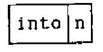

Fix `nsteps`, so that subsequent changes to its components (`into` and `n`), will not affect it.

```text
   nsteps=. nsteps fix
   nsteps
```

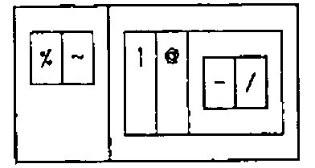

```text
(( %~ )(| @ ( -/ )))
```

This is a display of the definition of `nsteps`. It shows how the expression will be parsed. There are two outer boxes, and hence this is a hook. Contiguous boxes show that the symbols in them are to be grouped together. We can immediately translate the display into the fully parenthesised form written immediately below it. There is no harm in using the fully parenthesised form, but experimentation will show whether parentheses can be omitted with impunity. In this case the parentheses round `-/` are needed to prevent the conjunction `atop` (`@`) from taking the `-` instead of (`-/`) as its right argument. Adverbs are monadic, taking the item to the left as the argument. Thus cross (`~`) modifies the verb `divided_by` (`%`) to its left and no parentheses are needed to ensure this. So `nsteps` can be written with a single set of parentheses. No spaces are needed but I have used them to draw attention to the two groups of symbols that make the hook. As we shall see, three groups make a fork.

```text
   nsteps=. %~ |@(-/)
   0.5 nsteps _2 5
14
```

Two hooks are used in the scaling (or normalising) of a list of numbers to make the range from 0 to 1. Such scaling is often needed when preparing graphical display.

Let list be the name of the list of numbers nine, three, four, negative 2, …, seven:

```text
   list=. 9 3 4 _2 12 1 _4 15 7
```

The smallest value will be 0 if we subtract the smallest value. This should be quickly recognised as a monadic hook:

```text
   list - <./list
13 7 8 2 16 5 0 19 11
   (- <./) list
13 7 8 2 16 5 0 19 11
   q=. minus lesser_of insert
   q=. - <./
   q list
13 7 8 2 16 5 0 19 11
```

Similarly:

The largest number will be 1 if we divide list by the largest value. This is another monadic hook.

```text
   p=. % >./
```

`scale` is the composite verb in which `p` is applied to the result of `q`; i.e. `p` is `atop` `q`

```text
   scale=. p@q
   0.3 format scale list
0.684 0.368 0.421 0.105 0.842 0.263 0.000 1.000 0.579
```

## Forks [4, 17]

A fork is a succession, or train, of three verbs. The meaning assigned is this:

```text
  (f g h) y   is   (f y) g (h y)     Monadic
x (f g h) y   is   (x f ) g (x h y)  Dyadic
```

The mean is an example of a monadic *fork*. Compute it by dividing the `total` [of the list] by the `tally` [the number of items in the list]:

```text
   y=. 1 2 3 4
   (total y) divided_by (tally y)
2.5
```

Display `mean` in various ways:

```text
   mean=. total divided_by tally
   mean
```

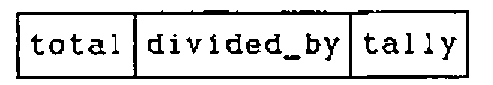

The string of three boxes shows that `mean` is a fork. The same information is given by another kind of display, called a parse tree.

```text
   tree 'mean'
```

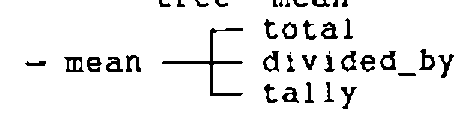

*Fix* the verb, "compiling" it into primitive J symbols.

```text
   mean=. mean fix
   mean
```

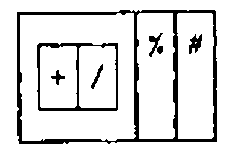

```text
   tree 'mean'
```

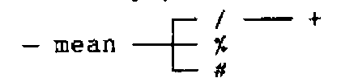

```text
   mean 1 2 3 4
2.5
```

`mean` is a monadic fork because it takes only a right argument. The syntax is:

> `(f g h) y` is the same as `(f y) g (h y)`

The *arithmetic progression vector* (`apv`) given below is an example of a dyadic fork. This is its syntax:

> `x (f g h) y` is the same as `(x f y) g (x h y)`

An example of a fork including a hook as one prong is the verb `clean`, which sets to zero small values resulting from round-off errors. For data take:

```text
   show y=. 1 10 100 1000 10000 into 1.2345
1.2345 0.12345 0.012345 0.0012345 0.00012345
```

Let the right argument `y` be the data to be cleaned, and let tolerance be the left argument `x`; then the result is `y` times the truth or falsity (1 or 0) of the proposition that the tolerance is less-than-or-equal to the magnitude of `y`:

```text
y * (x proposition y)
```

The proposition is a dyadic hook:

```text
   0.01 (less_or_equal magnitude) y
1 1 1 0 0
   0.01 <: (| y)
1 1 1 0 0
```

`times` is, of course, the central term of the fork:

The verb `clean` is therefore:

```text
   clean=. right times (less_or_equal magnitude)
   clean
```

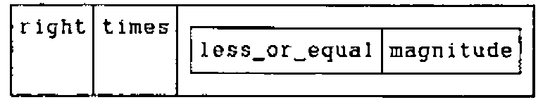

```text
   tree 'clean'
```

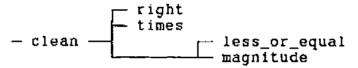

```text
   x=. 0.01
   y=. 1 10 100 1000 10000 into 1.2345
   x clean y
1.2345 0.12345 0.012345 0 0
   x clean -y
_1.2345 _0.12345 _0.012345 0 0
```

If we left off the parentheses then `less_or_equal` would be the central term of a fork, which along with `right` would make a hook.

```text
   f=. right times less_or_equal magnitude
```

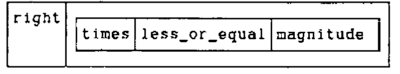

```text
   f=. f fix
   f
```

![Boxed display: ] | a box holding * <: |](art10005810/f2.png)

This would be quite wrong! Consider why this is so. A dyadic hook like this can be expanded:

> `x (g h) y` expands to `x g (h y)`

In our case:

```text
   g=. ]
   h=. *<:|
   x (g h) y
1 0 0 0 0
   x g (h y)
1 0 0 0 0
```

Because `g` is the dyadic verb `right` it returns its right argument; so `x` can make no contribution to the result, which must depend solely on the monadic function `h` applied to `y`.

```text
   h y
1 0 0 0 0
```

Defining the following pro-verbs:

```text
   p=. *
   q=. <:
   r=. |
```

Expand the fork `h`:

```text
   (p q r) y
1 0 0 0 0
   (p y) q (r y)
1 0 0 0 0
```

But

```text
   r y
1.2345 0.12345 0.012345 0.0012345 0.00012345
```

And

```text
   p y
1 1 1 1 1
   (* y) <: (|y)
1 0 0 0 0
```

The monadic `times` (`*`) is called the `signum`. The result is `1`, `0` or `_1` depending upon whether the argument is positive, zero or negative. Hence with this definition of `f`

```text
f=. right times less_or_equal magnitude
```

the left argument is ignored and the result is 1 if the `signum` of `y` is less than or equal to the absolute value of `y`. This is true unless `y` is a positive number lying between 0 and 1. This might be a useful function in another situation, but it is not what we want for `clean`!

Iverson’s utility verbs `by` and `over` provide a convenient way to illustrate the result. See the Appendix for an explanation.

```text
   x=. 9 0.5 0 _0.5 _9
   y=. _9 _1.5 _1 _0.5 0 1 e_3 0.3 0.4 0.999 1 2 10 100
   over=. ({.,.@;}.)@":@,
   by=. ' '&;@,.@[,.]
   x by y over x f"0 1 y
┌────┬─────────────────────────────────────────────────┐
│    │_9 _1.5 _1 _0.5 0 0.001 0.3 0.4 0.999 1 2 10 100│
├────┼─────────────────────────────────────────────────┤
│   9│ 1    1  1    1 1     0   0   0     0 1 1  1   1│
│ 0.5│ 1    1  1    1 1     0   0   0     0 1 1  1   1│
│   0│ 1    1  1    1 1     0   0   0     0 1 1  1   1│
│_0.5│ 1    1  1    1 1     0   0   0     0 1 1  1   1│
│  _9│ 1    1  1    1 1     0   0   0     0 1 1  1   1│
└────┴─────────────────────────────────────────────────┘
```

The `rank` conjunction (`"`) here instructs `f` to use rank-0 cells (atoms, units or scalars) from the left argument with rank-1 cells (lists, longs or vectors) of the right argument.

We can return to the definition of `clean` with added understanding. It is helpful to use spaces in order to draw attention to the three verbs of the fork, but spaces are not required:

```text
   clean=. ] * (<:|)
   clean
```

![Boxed display: ] | * | a box holding <: |](art10005810/clean2.png)

## The Number Line

Negative numbers once seemed *absurd* or *fictitious* [23, p.252], but a number line makes it easy for a child to grasp a concept that once taxed the greatest mathematicians. In a few years of instruction we are each led through the stages that took our ancestors generations to achieve. Experiments should help:

```text
   show i=. wholes 10
0 1 2 3 4 5 6 7 8 9
   10 plus i
10 11 12 13 14 15 16 17 18 19
```

Number lines are produced by the following fork:

```text
   nl=. wholes minus floor atop halve
   nl
```

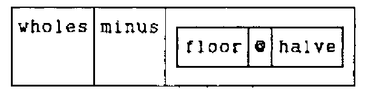

Or, more concisely in J symbols:

```text
   nl=. i. - <.@-:
```

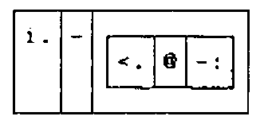

```text
   nl 11
_5 _4 _3 _2 _1 0 1 2 3 4 5
```

Various number lines can be produced simultaneously by using the *rank* conjunction (`"`) to specify that rank-0 cells (atoms, units or scalars) on the left are to be combined with rank-1 cells (lists, longs, or vectors) on the right:

```text
   1 10 100 1000 times"0 1 nl 11
   _5    _4    _3    _2    _1 0    1    2    3    4    5
  _50   _40   _30   _20   _10 0   10   20   30   40   50
 _500  _400  _300  _200  _100 0  100  200  300  400  500
_5000 _4000 _3000 _2000 _1000 0 1000 2000 3000 4000 5000
```

The argument for `nl` should be odd. To ensure that an even argument is made odd, define `odd` as a monadic hook:

```text
   odd=. plus one_minus@(2&residue)
   odd
```

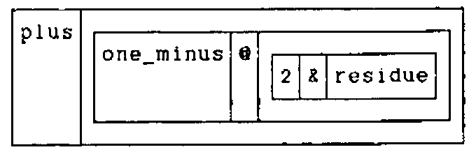

```text
   odd=. + -.@(2&|)
   odd
```

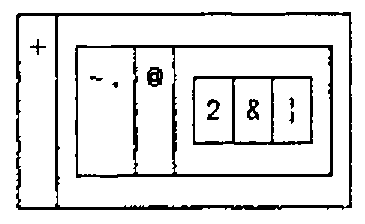

```text
   odd 2 4 6 8 laminate 1 3 5 7
3 5 7 9
1 3 5 7
```

This works by dividing the argument by 2 and subtracting the remainder (residue) from 1. The result is then added to the argument. Because the remainder on division by 2 is either 0 or 1 (depending on whether the number is even or odd) subtracting it from 1 changes a 0 to a 1 and a 1 to a zero. A list (vector) of 0s and 1s is called *logical* (taking 1 as true and 0 as false) or *boolean* (after George Boole, who taught us how much can be done with an algebra restricted to these two numbers). In logic the verb `not` converts true to false and false to true. Boolean algebra is, however, part of algebra, and its 0 and 1 can be combined with ordinary numbers by algebraic operations. Because there is no difference between the verbs `one_minus` and `not` (other than their domain), J uses the same symbol (`-.`) for both.

Define the verb `nline`, which applies `nl` after using `odd`:

```text
   nline=. nl @ odd
   nline"0 right 12 13
_6 _5 _4 _3 _2 _1 0 1 2 3 4 5 6
_6 _5 _4 _3 _2 _1 0 1 2 3 4 5 6
```

Using the verb `nsteps` (defined above to determine the number of steps) produce the required number of wholes (integers):

```text
   g=. i.@>.@>:@nsteps
   0.5 g _2 5
0 1 2 3 4 5 6 7 8 9 10 11 12 13 14
   0.5 g _2 5.2
0 1 2 3 4 5 6 7 8 9 10 11 12 13 14 15
```

The *arithmetic progression vector* is a fork containing a fork that in turn contains a hook. The outside fork is: the first item of the right argument (`{.@]`) plus the fork `[*g`, which in turn is the left argument `times` the dyadic application of `g`.

```text
   apv=. {.@] + [*g
   apv
```

![Boxed display: a box holding {. @ ] | + | a box holding [ * g](art10005810/apv.png)

```text
   0.5 apv _2 5
_2 _1.5 _1 _0.5 0 0.5 1 1.5 2 2.5 3 3.5 4 4.5 5
```

Using J primitives (or fixing `apv` with `fix`):

```text
   apv=. {.@] + [ * i.@>.@>:@(%~ |@-/)
```

## Place value

In learning arithmetic one of the first tasks is to understand place notation; i.e. the values assigned to digits at each successive place in a number. With this in mind we explore as follows:

```text
   times insert scan 10 10 10 10 10 10
10 100 1000 10000 100000 1000000
```

Because successive multiplications are produced by `power`:

```text
   10 power 1 2 3 4 5 6
10 100 1000 10000 100000 1000000
```

Looking at this result a pupil might wonder what the result of `10 power 0` would be:

```text
   10 power 0 1 2 3 4 5 6
1 10 100 1000 10000 100000 1000000
```

which leads in turn to the exploration of negative values:

```text
   10 power _4 _3 _2 _1 0 1 2 3 4 5 6
0.0001 0.001 0.01 0.1 1 10 100 1000 10000 100000 1000000
```

The reciprocals are place values:

```text
   reciprocal 10 power _4 _3 _2 _1 0 1 2 3 4 5 6
10000 1000 100 10 1 0.1 0.01 0.001 0.0001 1e_5 1e_6
```

The value assigned to a place is given by the verb `place`:

```text
   place=.10 with power
   place 3
1000
```

Because we write numbers so that the larger place values are to the left (ancient Egyptians usually did the opposite), the values of successive places are:

```text
   reverse place wholes 7
1000000 100000 10000 1000 100 10 1
```

Continuing the series to the right:

```text
   |. 10^ 1 apv _4 4
10000 1000 100 10 1 0.1 0.01 0.001 0.0001
```

## Rounding

Having grasped place notation, pupils are ready for rounding. This must be done mentally, but at an appropriate stage the formal process should be introduced.
Because J is an executable mathematical notation, its use has the advantage that computing skills are taught at the same time.

```text
   100 *<.0.5+438%100     NB. Round 438 to the nearest 100
400
   10 *<.0.5+26%10        NB. Round 26 to the nearest 10
30
   0.1 *<.0.5+12.345%0.1 NB. Round 12.345 to nearest 0.1
12.3
   0.2 *<.0.5+12.345%0.2 NB. Round 12.345 to nearest 0.2
12.4
```

Rounding will, in general, be to an integer multiple of a given number. This is defined formally as:

```text
round=. '' : 'x. * <. 0.5+ y.%x.'
```

where `x.` and `y.` are place-holders for the left and right arguments respectively. The empty string preceding the conjunction (`:`) means that we are defining the dyadic case only. Because the arguments are referred to explicitly, this is an example of *explicit* definition, as opposed to the *tacit* definitions used exclusively above. It can be translated to tacit form by the adverb `:11` [24]:

```text
'x. * <. 0.5+ y.%x.' : 11
```

![Boxed display: [ | * | a box holding <. | @ | a box holding (0.5 & +) @ (] % [)](art10005810/round1.png)

This is a fork with `*` as the central verb. Because the fork `]%[` can be written `%~` we have:

```text
   round=. [ * <.@(0.5&+@(%~))
   round
```

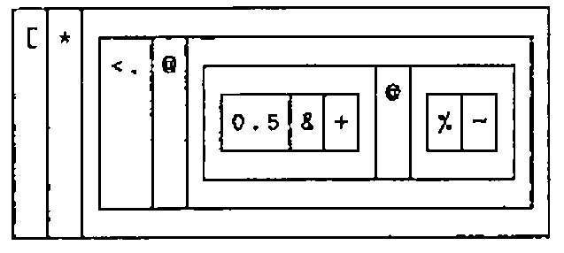

```text
   10 100 1000 round 146464
146460 146500 146000
   y=. 2 4 6 8
   show x=. y round 146463
146464 146464 146466 146464
```

Verify that these results are indeed (integer) multiples of y

```text
   x%y
73232 36616 24411 18308
   y=.3 7 11 15 25 33 125
   show x=. y round 146464
146463 146461 146465 146460 146475 146454 146500
   x%y
48821 20923 13315 9764 5859 4438 1172
```

Rounding 438 to the nearest 100

```text
   (10^2) * <.0.5+438%10^2
400
```

Round to given number of decimal places

```text
   rdp=. '' : '(10^x.) %~ <. 0.5 + y. * 10^x.'
   0 1 2 3 4 5 rdp o.1
3 3.1 3.14 3.142 3.1416 3.14159
```

Rewriting in tacit form:

```text
   rdp=. 10&^@[ %~ <.@(0.5&+@(] * 10&^@[))
```

This contains two forks, but the last one (`] * 10&^@[`) can be written as a hook (`(* 10&^)~`), though this necessitates additional parentheses.

```text
   rdp=. 10&^@[ %~ <.@(0.5&+@((* 10&^)~))
   0 1 2 3 4 5 rdp o.1
3 3.1 3.14 3.142 3.1416 3.14159
   rdp
```

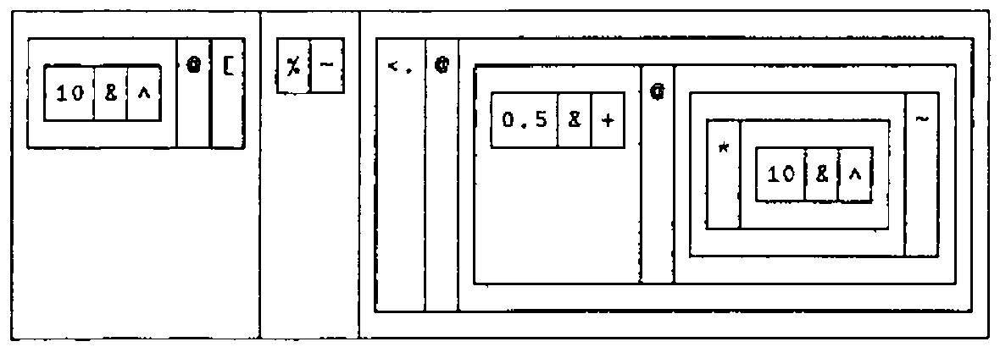

Rounding to a given number of decimal places is, of course, only a special case of `round`:

```text
   (10^-i.6) round o.1
3 3.1 3.14 3.142 3.1416 3.14159
```

The hook is obvious in the following:

```text
   h=. (]*<.@(0.5&+@%)) 10&^
   rnd=. h~
   0 _1 _2 _3 _4 _5 rnd o.1
3 3.1 3.14 3.142 3.1416 3.14159
   x=. i.6
   y=. 146464 14646 1464 146
   table=. (10^x) round"0 1 y
```

Notice that we simultaneously round many numbers to several different places and produce a table of rounded values. (Iverson’s utility verbs `by` and `over` are explained in the appendix).

```text
   y by x over transpose table
┌──────┬─────────────────────────────────────────┐
│      │     0      1      2      3      4      5│
├──────┼─────────────────────────────────────────┤
│146464│146464 146460 146500 146000 150000 100000│
│ 14646│ 14646  14650  14600  15000  10000      0│
│  1464│  1464   1460   1500   1000      0      0│
│   146│   146    150    100      0      0      0│
└──────┴─────────────────────────────────────────┘
   table match x rnd "0 1 y
1
```

Letting `f` be the fork and `h` the hook:

```text
   f=. ] * <.@(0.5&+@%)
   h=. (f 10&^)~
   table -: x h"0 1 y
1
```

## Examples of rounding exercises from a school workbook [25, p.14, 15, 22]

```text
   n,: 10 round n=.12 26 165 14 38 43 56 65 97 145 235
12 26 165 14 38 43 56 65  97 145 235
10 30 170 10 40 40 60 70 100 150 240
   n,: 100 round n=.170 438 650 160 250 463 729 607 896 717 91
332 548
170 438 650 160 250 463 729 607 896 717  91 332 548
200 400 700 200 300 500 700 600 900 700 100 300 500
   10 100 1000 round 8478
8480 8500 8000
```

Round the numbers `n` to the place values given by `p`:

```text
   n=. 8217 4096 7358 6105 8654 5583 7950 6008
   p=. 10 100 1000
   table=.|: p round"0 1 n
   n by p over table
┌────┬──────────────┐
│    │  10  100 1000│
├────┼──────────────┤
│8217│8220 8200 8000│
│4096│4100 4100 4000│
│7358│7360 7400 7000│
│6105│6110 6100 6000│
│8654│8650 8700 9000│
│5583│5580 5600 6000│
│7950│7950 8000 8000│
│6008│6010 6000 6000│
└────┴──────────────┘
```

## Concluding Remarks

This paper illustrates some aspects of the J dialect of APL using examples related to the teaching of elementary arithmetic. It demonstrates that hooks and forks are ubiquitous, and shows how to use them in reading and writing J. Examples are given of displays that show how expressions are parsed. These are invaluable aids in understanding the language.

Definitions are given in *tacit* form. They are *functional* as advocated by Backus [26].

Because J is evolving, it is essential to note which version is used. Examples are included of changes that were made between versions. The files `status.doc` and `xenos.doc`, provided with the system, document changes from earlier versions. All examples included in this paper have been executed with Version 3.5x4.

As from Version 3.5x1, 1991 8 26, the three remaining "system commands" have been replaced by verbs created by the external conjunction (`!:`).

| | |
|---|---|
| `)script` | replaced by `0!:2` |
| `)sscript` | replaced by `0!:3` |
| `)off` | replaced by `0!:55` |

It is convenient to include the following verbs in the file `profile.js`, which is loaded automatically at the start of a session.

```text
script=. 0!:2@< : (<@[ 0!:2 <@])
off=. 0!:55
```

`script` is an ambi-valent verb that permits specification of output and input script files; e.g. `'output.fil' script 'input.fil'` Because `off` is a verb, it must have an argument. To terminate a session and return to DOS, enter `off 0`.

Remembering Klein’s *Elementary Mathematics from an Advanced Standpoint* [27], in this paper I have treated topics in elementary arithmetic from a relatively advanced viewpoint. I hope teachers will find stimulation for themselves and be able to select examples suitable for pupils at various levels. Even very young children can use some of the examples, if only to check their answers. The exercise could provide an excellent introduction to both computing and mathematics. The literature of J is still limited. This paper may be useful as an introduction for anyone wishing to try J.

## Acknowledgements

Kenneth Iverson, Roger Hui, and Eugene McDonnell (Iverson Software Inc.) have provided generous support on numerous occasions. Mrs. Rosemary Roache and Julian Romanes (Edradour School) gave insight into the teaching of elementary mathematics. Anthony Camacho and Graham Woyka encouraged me to write about learning J.

Donald B. McIntyre<br>
Luachmhor, Church Road, Kinfauns, Perth PH2 7LD<br>
Scotland - U.K. Telephone: 0738-86-726

## Appendix: Displaying a table with over and by

```text
over=. ({.,.@;}.)@":@,
by=. ' '&;@,.@[,.]
```

Notice that `over` contains the fork `{. ,.@; }.` and `by` is built upon the fork `' '&;@,.@[ ,. ]`

While reference [8] was in press, the symbols for ***Ravel Items*** and *Raze* were interchanged (Version 3.2, June 1991). Because the monadic form *Ravel Items* changed from "`;`" in J3 to the form "`,.`" (as in J3.5x4, 1991 10 22), the versions of `over` and `by` given in [8] must now be written as follows:

```text
over=. ,. @ ({. ; }.) @ ": @ ,
by=. (,~"_1 ' '&; @ ,.)~
```

In these versions, `over` contains the fork `{. ; }.` and `by` is built on the hook `(,~"_1) (' '&;@,.)`

J’s displays are invaluable aids in learning to read and write verbs like these. Compare two versions of `by` each in two types of display:

```text
   by=. ' '&;@,.@[,.]
   by
```

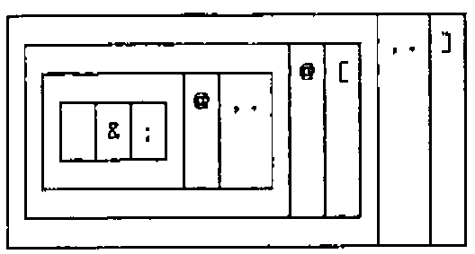

```text
   tree 'by'
```

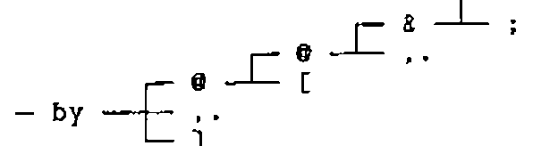

```text
   by=. (,~"_1 ' '&; @ ,.)~
   by
```

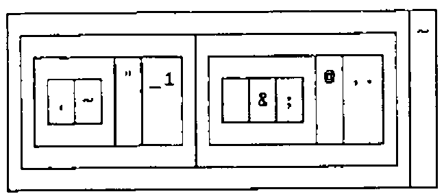

```text
   tree 'by'
```

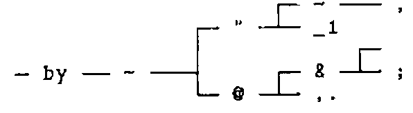

## References

[1] Donald B. McIntyre, *Introduction to the Study of Data Matrices*, In: Models of Geologic Processes: an Introduction to Mathematical Geology. Short Course Lecture Notes, Philadelphia, November 1969. Edited by Peter Fenner. American Geological Institute, Washington D.C. (1969) p.A1-A44, B1-B17, C1-C4.

[2] Donald B. McIntyre, *The Architectural Elegance of Crystals made clear by APL*, In: Conference Proceedings, APL Users Meeting, Toronto, September 1978. Sponsored by I.P. Sharp Associates, Toronto (1978) p.233-250.

[3] Donald B. McIntyre, *APL in a Liberal Arts College*, In: Conference Proceedings, APL Users Meeting, Toronto, October 1980. Sponsored by I.P. Sharp Associates, Toronto (1980), p.544-574.

[4] Kenneth E. Iverson, *ISI Dictionary of J*, Version 3.3 with Tutorials, Iverson Software inc., Toronto (1991) 32pp.

[5] Kenneth E. Iverson, *Programming in J*, Iverson Software inc., Toronto (1991) 71pp.

[6] Kenneth E. Iverson, *Tangible Math*, Iverson Software inc., Toronto (1991) 33pp.

[7] Kenneth E. Iverson, *A Personal View of APL*, IBM Systems Journal, Vol. 30, Number 4 (1991) In Press.

[8] Donald B. McIntyre, *Mastering J*, APL91 Conference Proceedings, Stanford, California, August 1991. APL Quote Quad Vol. 21 Number 4 (August 1991), p.264-273.

[9] Zdenek V. Jizba, *Science Education in California*, Vector vol.8 number 2 (1991) p.22-24.

[10] Florian Cajori, *A History of Mathematical Notations*, The Open Court Publishing Company, La Salle, Illinois. Volume 1 (1951) 451pp. First published 1928; Volume 2 (1952) 367pp. First published 1929.

[11] Tobias Dantzig, *Number: the Language of Science*, London, George Allen and Unwin, Ltd. 2nd edition (1942) 320pp. First Published 1936, 4th edition 1962.

[12] Donald B. McIntyre, *Language as an Intellectual Tool: From hierogylphics to APL*, IBM Systems Journal, Vol. 30, Number 4 (1991) In Press.

[13] Lancelot Hogben, *Mathematics for the Million*, London, George Allen and Unwin, Ltd (1936) 678pp.

[14] Kenneth E. Iverson, *Notation as a Tool of Thought*, 1979 Turing Award Paper, Communications of the A.C.M., Vol.23, Number 8 (August, 1980) p.444-465

[15] Roger K.W. Hui, Kenneth E. Iverson, E.E. McDonnell, and Arthur T. Whitney, *APL\?*, APL90 Conference Proceedings, Copenhagen, Denmark, August 1990. APL Quote Quad Vol. 20, Number 4 (July 1990) p.192-200.

[16] Robert Bernecky and Roger K.W. Hui, *Gerunds and Representations*, APL91 Conference Proceedings, Stanford, California, August 1991. APL Quote Quad Vol. 21, Number 4 (August 1991) p.39-46.

[17] Kenneth E. Iverson, and E.E. McDonnell, *Phrasal Forms*, APL89 Conference Proceedings, New York City, August 1989. QuoteQuad, Volume 19, Number 4, (1989) p.197- 199.

[18] J is available from Iverson Software Inc., 33 Major Street, Toronto, Ontario, Canada M5S 2K9. Phone (416) 925-6096; Fax (416) 488-7559.

[19] Kenneth E. Iverson, *A Programming Language*, John Wiley and Sons, Inc., New York (1962) 286pp.

[20] Kenneth E. Iverson, *Elementary Analysis*, APL Press, Swarthmore, Pennsylvania (1976) 219pp.

[21] Donald B. McIntyre, *Experience with Direct Definition One-liners in Writing APL Applications*, Conference Proceedings, APL Users Meeting, Toronto, September 1978. Sponsored by I.P. Sharp Associates, Toronto (1978) p.281-297.

[22] William K. Clifford, *The Common Sense of the Exact Sciences*, Edited with a preface by Karl Pearson. Newly edited and with an introduction by James R. Newman. Preface by Bertrand Russell. With bibliography of W.K. Clifford. Alfred A. Knopf, New York (1946), Sigma Books, Ltd., London (1947) 249pp.. Reprinted by Dover Publications, Inc., New York (1955). Chapter 1, Number, Section 11, Steps.

[23] Morris Kline, *Mathematical Thought from Ancient to Modern Times*, Oxford University Press, New York (1972) 1238pp.

[24] Roger K.W. Hui, Kenneth E. Iverson, Eugene E. McDonnell, *Tacit Definition*, APL91 Conference Proceedings, Stanford, California, August 1991. APL Quote Quad Vol. 21 Number 4 (August 1991), p.264-273.

[25] Roy Hollands, *Ginn Mathematics Level 4*, Teachers’ Resource Book, Ginn and Company Ltd, Aylesbury, Bucks. (1983), Third impression 1985, 160pp. Intended for 8 to 9 year old children.

[26] John Backus, *Can programming be liberated from the Von Neumann style?* A functional style and its algebra of programs. 1977 Turing Award Lecture. Communications of the ACM, Vol. 21, number 8 (1978) p.613-641.

[27] Felix Klein, *Elementary Mathematics from an Advanced Standpoint*, Third Edition first published 1924-1925. English translation published by Dover Publications Inc., New York. 2 Volumes, (1939) 274pp. and 214pp.
