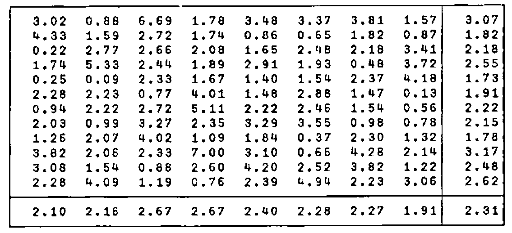

*by Donald B. McIntyre*
{ .byline }

## Introduction

J is a powerful dialect of APL created by Kenneth Iverson and Roger Hui [1]. At the APL91 Conference at Stanford, California, I gave an account of my experience with the language [2]. Some of the difficulties I met when first trying to use J were due to features that have been modified or dropped from the language; for example, the manner in which one function inherited the rank of another. Although there was ample theoretical justification for the original way rank was inherited (and I gave an example of this in [2]), my experience helped to persuade the designers to change the rules. Because J is developing fast, it is essential to specify the version used. The files `Status.Doc` and `Xenos.Doc`, provided with the system, document changes from earlier versions and should be examined closely. The examples given here were executed with Version 4.1x2

The special issue of the *IBM Systems Journal*, commemorating 25 years of implemented APL, contains several examples of the same function, or *verb*, written in conventional APL, Direct Definition, and J [3]. These may be helpful to those already familiar with APL. In an earlier paper in *Vector* I have provided an introduction to J with examples from elementary arithmetic [4]. The standard references written by Iverson are, of course, essential reading [5-9]. References to some of the more technical papers will be found in reference [4].

Dictionaries like *The Oxford English Dictionary* and Lewis and Short’s *Latin Dictionary* not only define words but include phrases illustrating their use by standard authors. It would be impractical to attempt to learn a language from such sources alone. It is necessary to read literature written in the language at an appropriate level, and preferably dealing with a topic already understood by the reader. This paper is intended as a further contribution to the literature for beginning users of J.

I always find that, like my students, I benefit most from examples in a context to which I can relate. In the context of two practical examples, I give here examples of features of J, including hooks and forks, rank, cut, raze, ravel items, format, do (execute), copy (compress), box, open, under (dual), amend, and the reading and writing of ASCII files. I hope that others will find these helpful as they learn J.

In every definition only *necessary* parentheses are used. It is helpful to experiment by starting with fully parenthesised expressions and gradually reducing the number of parentheses included. The successive definitions should be checked to see whether they give the same result as before, and when they do not they should be displayed in boxed and tree form to see how they have been interpreted by the J system [4].

## The First Problem Stated

A friend, who was starting to investigate J, had monthly total rainfall measurements for a period of eight years. He had used a word processor to put the values into an ASCII file and he wondered how he could use J to compute various statistics. Missing observations were indicated by a letter. This is how typical data appear in a file named `data.in`:

```text
3.02    0.88    6.69    1.78    3.48    3.37    3.81    1.57
4.33    1.59    2.72    1.74    0.86    0.65    X       0.87
0.22    2.77    2.66    2.08    1.65    2.48    X       3.41
1.74    5.33    2.44    1.89    2.91    1.93    0.48    3.72
0.25    0.09    2.33    1.67    1.40    1.54    2.37    4.18
2.28    2.23    0.77    4.01    1.48    2.88    1.47    0.13
0.94    X       2.72    5.11    X       2.46    1.54    0.56
2.03    0.99    3.27    2.35    3.29    3.55    0.98    0.78
1.26    2.07    4.02    1.09    1.84    0.37    2.30    1.32
3.82    2.06    2.33    7.00    3.10    0.66    4.28    2.14
3.08    1.54    0.88    2.60    4.20    2.52    3.82    1.22
2.28    4.09    1.19    0.76    2.39    4.94    2.23    3.06
```

## Input from ASCII to J

J has been criticised for having too few system functions, but this is a misunderstanding. APL’s system functions are not really part of the language; in J they are implemented with the "foreign" conjunction (`!:`). As the name suggests, conjunctions are dyadic; they *join together* two arguments producing verbs (functions) or adverbs (monadic operators). Thus `1!:1` is *file read*, and the argument of the resulting verb is the boxed specification of the file. Similarly `1!:2` is *file write*, a dyadic verb, whose left argument is the character string to be written, and right argument the boxed file specification. It is convenient to name these as follows:

```text
read=. 1!:1 @ <       NB. x=. read 'input.fil'
write=. [ 1!:2 <@]    NB. 'string' write 'output.fil'
```

In my experience it is rather easy, even for a beginner, to think in terms of a fork, and the verb *write* is defined here as a fork. When I began to work with J I thought that both forks and hooks were abstruse concepts unlikely to be useful to someone at my level. Very quickly, however, I found forks everywhere. For a long time I thought that hooks were much rarer. The reason is that every hook can be written as a fork, and it easier for the novice to use the fork form; as indeed I have done here.

When a fork consists of the composition of a dyadic verb, a monadic verb, and either a *left* (`[`) or a *right* (`]`) verb, then we can use the hook form. In the dyadic case (as in the verb *write*):

```text
x (g h) y   is the same as   x g (h y)
```

which implies that `g` is dyadic and `h` is monadic. Thus:

```text
write=. 1!:2 <          NB. Write to a file. Hook
```

I shall draw attention to similar examples as they occur.

Execution of the following sentence causes the data to be read as a character string named `y`.

```text
y=. read 'data.in'
```

`y` is the name of a character string containing line-feed, new-line, and end-of-file codes which are as follows (where `a.` is the Atomic Vector, or list of the 256 ASCII codes, and `{` is the verb *from* used by J instead of `a[13]` for indexing):

```text
nl=. 13 { a. [ lf=. 10 { a. [ eof=. 26 { a.
```

## Replacement of the Character X to Characters _1

The indexes of the character `X` in the string are given by:

```text
   ]i=. u # i. # u=. y = 'X'
130 202 450 474
```

Note that where `#` is preceded by `i.` it is the monadic *tally*; where it is preceded by `u` it is the dyadic *copy* (equivalent to *compress* or *replicate* in older APL).

Because rainfall is never negative, we can replace the letter `X` with the pair of characters `_1` as a step in converting the character string into numbers amenable to arithmetic. The indexes of all positions to be changed are found by using the *table* adverb (`/`) to produce the outer product.

```text
   ,i +/0 1
130 131 202 203 450 451 474 475
```

The information to be entered at these positions is:

```text
   (+:#i)$'_1'
_1_1_1_1
```

Substitution is then made by *amend*. For further examples see [2, p.270], but note that *amend* was changed in Version 4 [10].

```text
z=. ((+:#i)$'_1') (,i +/0 1)}y
```

Defining verbs to accomplish this, we can proceed as follows:

```text
   h=. 'X'&=@] # i.@#        NB. Fork
   h y
130 202 450 474

   g=. ,@(+/&0 1)@h
   g y
130 131 202 203 450 451 474 475

   f=. $&'_1' @ (+:@#@h)
   f y
_1_1_1_1
```

Then:

```text
z=. (f y) (g y)} y
```

The explicit form is straightforward:

```text
   amend=. '(f y.) (g y.)} y.' : ''
   z-: amend y
1
```

It was simple to amend a matrix with earlier versions of J using desk calculator mode [2, p.270]. The syntax was `x i} m`, where `i` gave boxed indexes. But a definition in tacit form cannot be written easily. Four hours after discussing this case with Ken Iverson and Roger Hui, they telephoned back to say that they had extended J (Version 4) to permit definition of the following fork:

```text
  amend=. f g@]} ]
   z-: amend y
1
```

This is dramatic testimony to the superior design of the language, the flexibility of the implementation, and the response and skill of both designer and implementer!

## Conversion from Character String to Numeric Table

`z` is a string of numbers, represented in character form and containing printer-control characters. Reshape it into a 12 by 8 table after converting from character representation to numeric, and after printer-control characters have been removed:

```text
d=. 12 8 $ ". z #~ -. z e. lf,nl,eof
```

We can, however, make this table without explicitly specifying its shape. Take a simple example to illustrate the procedure:

```text
s=. '1 2 3',lf,'4 5 6',lf,'7 8 9',lf
cut=. <;._2
```

The conjunction *cut* will box items delimited by the last item (`2`) — in this case `lf` — and exclude (`_2`) the delimiters from the intervals:

```text
   cut s
┌─────┬─────┬─────┐
│1 2 3│4 5 6│7 8 9│
└─────┴─────┴─────┘
```

*Raze* the result:

```text
   ; cut s
1 2 34 5 67 8 9
```

*Ravel Items*:

```text
   ,. cut s
┌─────┐
│1 2 3│
├─────┤
│4 5 6│
├─────┤
│7 8 9│
└─────┘
```

*Open*:

```text
   > cut s
1 2 3
4 5 6
7 8 9
```

*Do*, or execute (`".`) *under* (`&.`) *open* (`>`); i.e., open each box, convert to numeric, and then close each box again:

```text
   $ ".&.> cut s
3
```

Open the result of this operation and show that we have produced the required numeric table:

```text
   execute=. > @ (".&.> @ <;._2)
   1 + execute s
2 3  4
5 6  7
8 9 10
```

To apply *execute* to our data, begin by eliminating the new-line and end-of-file characters while leaving the line-feeds as delimiters:

```text
   d -: data=. execute z#~ -. z e. nl,eof
1

   data
3.02 0.88 6.69 1.78 3.48 3.37 3.81 1.57
4.33 1.59 2.72 1.74 0.86 0.65   _1 0.87
0.22 2.77 2.66 2.08 1.65 2.48   _1 3.41
1.74 5.33 2.44 1.89 2.91 1.93 0.48 3.72
0.25 0.09 2.33 1.67  1.4 1.54 2.37 4.18
2.28 2.23 0.77 4.01 1.48 2.88 1.47 0.13
0.94   _1 2.72 5.11   _1 2.46 1.54 0.56
2.03 0.99 3.27 2.35 3.29 3.55 0.98 0.78
1.26 2.07 4.02 1.09 1.84 0.37  2.3 1.32
3.82 2.06 2.33    7  3.1 0.66 4.28 2.14
3.08 1.54 0.88  2.6  4.2 2.52 3.82 1.22
2.28 4.09 1.19 0.76 2.39 4.94 2.23 3.06
```

## Replace Negative Values by Row Means

Substituting the most reasonable values for missing data is a matter that requires knowledge of the subject matter. In this case the columns are years (8) and the rows, or items, are months (12). We can replace missing values by the means for the row (month) over all years for which we have data.

We need the indexes of missing values (represented by `_1`). First write a directly executable expression and then define a verb to give the same result:

```text
   (,u)#i.#,u=. 0>data
14 22 49 52
   h=. 0&>@,
   g=. (] # i.@#)@h      NB. A fork that can be written as a hook
```

Because `g` consists of a dyadic verb (`#`), a monadic verb (`i.`), and the verb *right* (`]`), it can be written as a hook.

```text
g=. (# i.@#)@ h      NB. Hook
```

Fix `g` as `ir` (Indexes in Ravel) so that the names `g` and `h` can be reused.

```text
   ir=. g f.
   ir data    NB. Index in Ravel of matrix
14 22 49 52
```

The row indexes are:

```text
   <.8%~ir data
1 2 6 6
   (<.@(%&8)) ir data
1 2 6 6
```

The column indexes are:

```text
   8|ir data
6 6 1 4
```

To find the indexes we made explicit use of the number of columns (8), but this number is given by:

```text
   {:$ data
8
```

Define verbs `row` and `column` depending solely on the data:

```text
   row=. <. @ (ir % {:@$)        NB. Fork
   row data
1 2 6 6

   column=. {:@$ | ir            NB. Fork
   column data
6 6 1 4
   f=. row ,. column             NB. Fork
   f data
1 6
2 6
6 1
6 4
```

Note that `row`, `column`, and `f` are forks. Now box the items (rows):

```text
   ix=. <"1 @(row ,. column)
   ]i=. ix data
┌───┬───┬───┬───┐
│1 6│2 6│6 1│6 4│
└───┴───┴───┴───┘
   ]z=. i{data
_1 _1 _1 _1
   z-: ({~ ix) data      NB. Hook
1
   z-: (ir data){,data
1
   z-: (ir { ,) data     NB. Fork
1
```

Compute the means of the rows with negative values.

```text
   mean=. +/%#                                NB. Fork
   ]m=. mean"1 (row data){data
1.47 1.78375 1.41625 1.41625
```

Note that `(row data){ data` is a candidate for a monadic hook:

```text
   m-: mean"1 ({~ row) data
1
```

But these means were computed over the eight values in the rows, and these include the `_1`, which is only a flag indicating a missing observation. We need a special mean that will be based only on positive or zero values:

```text
   mean n=. 1 _9 2 3 _1 4 0 5
0.625
   (>:&0 # ]) n           NB. Fork
1 2 3 4 0 5
```

Every hook can be written as a fork, and the fork is often easier to grasp than the hook that could replace it. Remember that in the hook `(g h)`, `h` is always monadic and `g` is dyadic [4]. Arrange the two verbs in the order, from left to right, *Dyadic, Monadic*. If the dyadic function is not commutative, it may be necessary, as in this case, to use the *cross* adverb (`~`).

```text
   h=. >:&0              NB. Monadic
   h n
1 0 1 1 0 1 1 1
   g=. #~                NB. Dyadic
   n g (h n)
1 2 3 4 0 5
   (g h) n               NB. Hook
1 2 3 4 0 5
   (#~ >:&0) n           NB. Hook
1 2 3 4 0 5
```

Mean over positive and zero values:

```text
   pzmean=. mean @ (#~ >:&0)      NB. Hook
   pzmean n
2.5

   ]m=. pzmean"1 ({~ row) data
1.82286 2.18143 2.22167 2.22167
```

Amend the data by inserting these values. Note that the indexes (`i`) are with respect to the ravel of the matrix (`data`).

```text
   ]x=. m i}data
3.02    0.88 6.69 1.78    3.48 3.37    3.81 1.57
4.33    1.59 2.72 1.74    0.86 0.65 1.82286 0.87
0.22    2.77 2.66 2.08    1.65 2.48 2.18143 3.41
1.74    5.33 2.44 1.89    2.91 1.93    0.48 3.72
0.25    0.09 2.33 1.67     1.4 1.54    2.37 4.18
2.28    2.23 0.77 4.01    1.48 2.88    1.47 0.13
0.94 2.22167 2.72 5.11 2.22167 2.46    1.54 0.56
2.03    0.99 3.27 2.35    3.29 3.55    0.98 0.78
1.26    2.07 4.02 1.09    1.84 0.37     2.3 1.32
3.82    2.06 2.33    7     3.1 0.66    4.28 2.14
3.08    1.54 0.88  2.6     4.2 2.52    3.82 1.22
2.28    4.09 1.19 0.76    2.39 4.94    2.23 3.06
   amend=. ir@]}
   x-: m amend data
1
```

## Catenate Month and Year Means

The verb `ymean` is a hook that catenates yearly means to the foot of the columns:

```text
ymean=. ,"2 1 mean
ymean x
```

Catenate the means of rows (months), the means of columns (years), and the grand mean (at bottom right corner):

```text
   ]s=. 6.2":((,"2 1 mean) x),"1 0 (mean"1 x),mean ,x
3.02  0.88  6.69  1.78  3.48  3.37  3.81  1.57  3.07
4.33  1.59  2.72  1.74  0.86  0.65  1.82  0.87  1.82
0.22  2.77  2.66  2.08  1.65  2.48  2.18  3.41  2.18
1.74  5.33  2.44  1.89  2.91  1.93  0.48  3.72  2.55
0.25  0.09  2.33  1.67  1.40  1.54  2.37  4.18  1.73
2.28  2.23  0.77  4.01  1.48  2.88  1.47  0.13  1.91
0.94  2.22  2.72  5.11  2.22  2.46  1.54  0.56  2.22
2.03  0.99  3.27  2.35  3.29  3.55  0.98  0.78  2.15
1.26  2.07  4.02  1.09  1.84  0.37  2.30  1.32  1.78
3.82  2.06  2.33  7.00  3.10  0.66  4.28  2.14  3.17
3.08  1.54  0.88  2.60  4.20  2.52  3.82  1.22  2.48
2.28  4.09  1.19  0.76  2.39  4.94  2.23  3.06  2.62
2.10  2.16  2.67  2.67  2.40  2.28  2.27  1.91  2.31
```

This illustrates the verb *format* (`":`), the conjunction *rank* (`"`) applied to *catenation* (`,`), and the *hook* (`,"2 1 mean`)

We now have a character array. Catenate to it the new-line and line-feed codes, and ravel to produce an ASCII string that can be sent to DOS:

```text
(,s,"1 nl,lf) write 'data.out'
```

The file `Data.Out` is the required ASCII file.

## Using *Box* (<) for further Formatting

```text
f=. <@(6.2&":)
g=. f&:(,:@ mean"1) ,: f@ mean @ ,      NB. Fork
h=. f , f@ mean                         NB. Fork
table =. h ,"0 1 g                      NB. Fork

]t=. table x
```



`t` is a table with 2 rows and 2 columns:

```text
   $t
2 2
```

## The Second Problem Stated

Early versions of J were supplied with tutorial files that could be displayed while in J. In Version 4 of the Dictionary the tutorials are provided in an appendix [5]. In the files of one preliminary version each new-line code stood alone instead of being followed by a line-feed. Consequently, when these files were read lines of text were superposed. If the last line was the longest in the file, then that line was the only one displayed.

To create such a file for yourself, first use your word processor to prepare a text file (let us call it `junk`) with half a dozen short lines *without* wordwrap; i.e. press the **Enter** key at the end of each line. Next use a hex-editor, such as provided by PCTOOLS or NORTON, to see the sequence 0D 0A marking new-line and line-feed commands. Now change all occurrences of 0A to 20 in order to replace line-feeds by blanks. The problem then is how to use J to reverse the process by *inserting* a line-feed after every occurrence of new-line. Try reading this file from J by

```text
]x=. read 'junk'
```

Observe that each line is overlaid on the previous lines. Count the number of new-lines and line-feeds, verifying that the line-feeds have been eliminated:

```text
+/ x =/ 13 10 {a.
```

The verb `h` *cuts* the string using the new-line codes as terminating delimiters. We can compose it from 3 verbs as a fork; a monadic verb, a dyadic verb, and the verb *right* (`]`). Or we can compose it from 2 verbs as a hook.

```text
h=. =&nl <;.2 ]        NB. Fork
h=. <;.2~ =&nl         NB. Hook
```

As in all hooks, the right-hand verb is monadic and the left-hand verb is dyadic. A hook combines one noun with the result of a verb that has been applied to a noun, either the same noun as the first (in the monadic case) or a different one (in the dyadic case). Use a hook whenever this situation occurs.

The boolean string produced by *equals* (`=`) points to the positions of new-line codes. This is the left argument for *cut* (`<;.2`). The 2 indicates that the delimiters mark the *ends* of the intervals and are to be included in the result [5, p.10-11].

```text
each=. &.>
g=. ,&lf each
edit=. ; @ (g @ h)
input=. edit @ read
```

The definition should be *fixed* so that *input* will not be changed if the names `g` and `h` are reused.

```text
input=. input f.
```

The adverb *each* opens the boxes produced by `h`, applies the verb (which is here *catenate lf to the tail*), and then closes the boxes again. After reading the file, *input* edits it by putting in the required line-feed codes. The file can now be displayed without superposed lines:

```text
]x=. input 'junk'
```

To create a new file with the corrections:

```text
x 1!:2 <'junk.out'
```

The character string `x` is written to the new file (which must be designated by a *boxed* string). This file can now be read correctly (remember that our `read` verb boxes the name before using it):

```text
read 'junk.out'
```

Leave J and use your hex-editor to see that line-feeds (0A) have been inserted between the new-line (0D) and space (20) codes.

We have modified a single file, but I had several files to edit. Let `infiles` and `outfiles` be the lists of boxed names of files for input and output:

```text
infiles=. 'tut10.in';'tut11.in';'tut12.in';'tut13.in'
outfiles=. 'tut10.out';'tut11.out';'tut12.out';'tut13.out'
```

With the power of J we can create all the new files in one step. Switching arguments to avoid parentheses, my first successful solution was this:

```text
 output=. >@[ 1!:2 ]          NB. Fork
outfiles output~"0 input each infiles
```

The logic is as follows. The file names are already boxed. Use *each* to apply `input` (`edit` after `read`) and give the boxed strings ready for the output files. Let the boxed names of the output files be the right argument, and let the left argument be the boxed strings that are to go into these files. Then the *rank* conjunction (`"0`) can make `output` handle each file in turn. The syntax would be like this:

For one file:

```text
'string'  1!:2  (boxed file name)
```

Note the asymmetry: the right argument must be boxed, but the left argument must *not* be boxed.

For several files one might try:

```text
(boxed edited strings) 1!:2"0 (boxed output file names)
```

The rank conjunction takes 1 box on the left along with one box on the right. However after the box on the left has been taken it must be opened before output begins. If we open the left argument too soon then we defeat the purpose of the rank conjunction! Consequently *open* (`>`) must be part of `output`. The other part is, of course, `1!:2`

A fork is then obvious: open the left argument and don’t open the right argument of `1!:2`

```text
output=. >@[ 1!:2 ]          NB. Fork
```

Because this fork (like many others I have written!) consists of a monadic verb (*open*), a dyadic verb (`1!:2`), and the verb *right*, it can be recast as a hook. Because there are two distinct arguments, the hook is dyadic:

```text
x (g h) y      is the same as      x g (h y)
```

`h` is the monadic function, therefore we must switch arguments; it is the boxed string that is to be opened — not the boxed file name. The right argument must be the result produced by *input each infiles* — which is boxed; the rank conjunction sees to it that only one box is taken at a time, and the phrase denoted (`h y`) opens that box. Along with the rank conjunction, this provides the right argument for (`1!:2`), and the left argument is a single boxed file-name.

In using the hook (instead of the fork) we have no choice about which argument is to be on the left and which on the right. Because this conflicts with the positions of the arguments required for (`1!:2`), we **must** *cross* them (`~`). The result is therefore:

```text
(boxed output file names) (g~ h) (boxed edited strings)
```

That is, we need the following hook:

```text
output=. 1!:2~ >                NB. Hook
outfiles output"0 input each infiles
```

After this line is executed, all files named in `outfiles` can be read correctly.

## Acknowledgements

Kenneth Iverson and Roger Hui (Iverson Software Inc.) created the system a small facet of which I have described here. They have given unfailing assistance, coaching me by long-distance telephone and patiently answering my more naive questions. In response to my reported experience, in a few cases they modified the language. They are, of course, in no way responsible for infelicities in my use and exposition of their language. I claim only that the expressions given here work in the current version of the system (J4.1x2, 13 Jan 1992).

By asking for a solution to the first problem, Dr. Richard Fulford directed me into the realm of external communication. Graham Woyka and Anthony Camacho were always encouraging when the going was rough.

Luachmhor, Church Road<br>
Kinfauns, Perth PH2 7LD<br>
Scotland - U.K.<br>
Telephone: 0738-86-726

## References

[1] J is available from Iverson Software Inc., 33 Major Street, Toronto, Ontario, Canada M5S 2K9. Phone (416) 925-6096; Fax (416) 488-7559. UK agent I-APL Ltd (see Product Guide)

[2] Donald B. McIntyre, *Mastering J*, APL91 Conference Proceedings, Stanford, California, August 1991. APL Quote Quad Vol. 21 Number 4 (August 1991), p.264-273.

[3] Donald B. McIntyre«MDNM», *Language as an Intellectual Tool: From hieroglyphics to APL*, IBM Systems Journal, Vol. 30, Number 4 (1991) p.554-581.

[4] Donald B. McIntyre, *Hooks and Forks and the Teaching of Elementary Arithmetic*, Vector, Vol. 8 Number 3 (January 1992) 101-123.

[5] Kenneth E. Iverson, *The ISI Dictionary of J*, Version 4 with Tutorials, Iverson Software Inc., Toronto (1991) 29pp.

[6] Kenneth E. Iverson, *Programming in J*, Iverson Software Inc., Toronto (1991) 72pp.

[7] Kenneth E. Iverson, *Tangible Math*, Iverson Software Inc., Toronto (1991) 33pp.

[8] Kenneth E. Iverson, *Arithmetic*, Iverson Software Inc., Toronto (1991) 119pp.

[9] Kenneth E. Iverson, *An Introduction to J*, Iverson Software, (1992) 46pp.

[10] Donald B. McIntyre, *Using J’s Boxed Arrays*, Vector, Vol. 9 (1992) In Press
