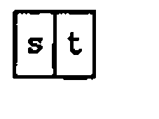
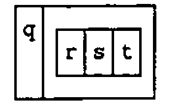
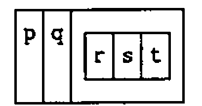
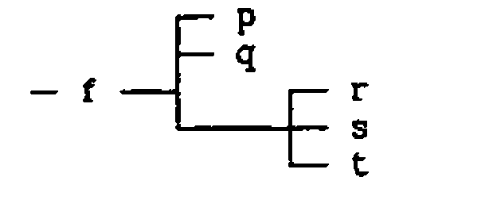
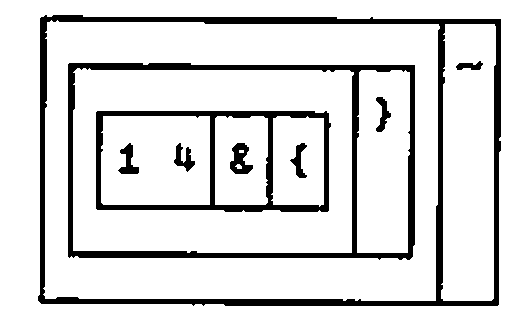

*by Donald B. McIntyre*
{ .byline }

## Introduction

APL, which has been an implemented computer language for more than 25 years, grew out of the concise mathematical notation devised by Kenneth Iverson. J is his powerful new dialect [1]. He has defined it in a Dictionary that is an essential reference [2]. Iverson has extended the language in very interesting ways. He has also rationalised features which, benefiting from so many years of hindsight, he recognised as anomalies in other versions of APL.

Users accustomed to older APL can therefore expect to be puzzled by some changes of behaviour. For example, the sum over a table (`+/table`) formerly gave **row** totals (summing over the **last axis**), but the same expression in J gives the **column** totals (summing over the first axis). The reason is that the table is considered an array of **items**, an item being a row. The number of items is given by the first number in the shape; a 4 by 12 table (matrix) is looked on as a collection of 4 lists (vectors), each of length 12. Consequently the mean (the sum divided by the tally) is the sum down the columns (across the items) divided by the number of rows.

Another anomaly was the use of square brackets and the semicolon in indexing. Do expressions such as `V[I]` or `M[I;J]` qualify as verbs (**functions**), and if not then what are they? In J selections like these are pure functions: e.g. `i { v` (read this "i from v"). In higher rank objects, which need pairs (or triplets, etc.) of indices to identify one atom in the array, the syntax is the same, but the indices of the pair (or triplet, etc.) are `boxed` together. How that is done will be seen in the following examples.

Thinking that my experience of using J might help others, I have given accounts of various features with which I had difficulty when I began [4-7]. This is a further example. One of my first attempts in using J was to use boxes to create a small database. When I consulted Ken Iverson, Eugene McDonnell happened to be visiting Toronto, and he responded to my questions in a letter so helpful that, with his permission, I included it in my paper for APL91 at Stanford [4].

## Basic Techniques Relating to Boxes:

APL’s index generator (`iota`) has been extended:

```text
   ]a=. i.2 3
0 1 2
3 4 5
```

After being `boxed`, this array of 2 rows, each of length 3, can be treated as an atom (scalar):

```text
   $a
2 3
   ]b=. <i.2 3
┌─────┐
│0 1 2│
│3 4 5│
└─────┘
   $b

```

This illustrates the use of the verb `box` (`<`). Ignoring special cases, we can say that the dyadic verb `link` (`;`) boxes its arguments:

```text
   ]c=. 'mary';'jones';a; 1 3 5
┌────┬─────┬─────┬─────┐
│mary│jones│0 1 2│1 3 5│
│    │     │3 4 5│     │
└────┴─────┴─────┴─────┘
```

We now have a list of 4 items, from which we can take a selection or a permutation:

```text
   $c
4
   3 1 2 0{c
┌─────┬─────┬─────┬────┐
│1 3 5│jones│0 1 2│mary│
│     │     │3 4 5│    │
└─────┴─────┴─────┴────┘
```

The individual words in a character string can be boxed by the monadic verb `word formation` (`;:`)

```text
   ;:s=. 'here we go gathering nuts in may'
┌────┬──┬──┬─────────┬────┬──┬───┐
│here│we│go│gathering│nuts│in│may│
└────┴──┴──┴─────────┴────┴──┴───┘
```

The length of each word is determined by the `tally under open`; that is, each box is opened, the tally is taken, and the box is closed again. `under` (`&.`) is a conjunction combining here the verbs `tally` (`#`) and `open` (`>`).

```text
   #&.> ;: s
┌─┬─┬─┬─┬─┬─┬─┐
│4│2│2│9│4│2│3│
└─┴─┴─┴─┴─┴─┴─┘
```

The `mean` is a fork [4-7]. We find the average word-length by applying the verb `mean` after opening the boxes of word lengths.

```text
   mean=. +/%#
   mean > #&.> ;: s
3.71429
```

Or, defining the verb `mwl` we get the mean word-length of any string. This is a tacit definition, a pure functional form, in which there is no explicit reference to arguments.

```text
   mwl=. mean @ (>@(#&.> @ ;:))
   mwl s
3.71429
```

When we open a list (vector) of boxes we get a table (matrix):

```text
   s=. 'here we go gathering nuts in may'
   $> ;:s
7 9
   > ;:s
here
we
go
gathering
nuts
in
may
```

The table is alphabetised by the dyadic `sort` (`/:`). This is a remarkably concise statement!

```text
   /:~ > ;: s
gathering
go
here
in
may
nuts
we
```

Should we want to box numbers, we must distinguish between boxing the list as a whole and boxing the individual items in it. The `rank` conjunction (`"`) instructs the `box` verb to enclose rank-0 elements:

```text
   v=. 2 3.4 5.67
   <"0 v
┌─┬───┬────┐
│2│3.4│5.67│
└─┴───┴────┘
```

The items of the list (individual numbers) are made into vectors (from rank-0 to rank-1) by `ravel item` (`,.`)

```text
   $,. v
3 1
   ,. v
   2
 3.4
5.67
```

A rank-3 array can be boxed with any rank from 0 to 3:

```text
   ]m=. i.2 3 4
 0  1  2  3
 4  5  6  7
 8  9 10 11
12 13 14 15
16 17 18 19
20 21 22 23
   <"2 m
┌─────────┬───────────┐
│0 1  2  3│12 13 14 15│
│4 5  6  7│16 17 18 19│
│8 9 10 11│20 21 22 23│
└─────────┴───────────┘
   <"1 m
┌───────────┬───────────┬───────────┐
│0 1 2 3    │4 5 6 7    │8 9 10 11  │
├───────────┼───────────┼───────────┤
│12 13 14 15│16 17 18 19│20 21 22 23│
└───────────┴───────────┴───────────┘
```

## Construct a Simple Database:

Use "link" (`;`) to create an array of boxed elements:

```text
d=.,:'E.E.';'McDonnell';'Palo Alto';27;10000; 8 3 12 25 10
d=.d,'Ken';'Iverson';'Toronto';55;15000; 4 19 32 1 15 10
d=.d,'Donald';'McIntyre';'U.K.';61;12000;''
d=.d,'Roger';'Hui';'Toronto';49;20000; 32 4
d=.d,'Anthony';'Camacho';'U.K.';45;35000; 19 23 45 4 17 13 5
   d
┌───────┬─────────┬─────────┬──┬─────┬──────────────────┐
│E.E.   │McDonnell│Palo Alto│27│10000│8 3 12 25 10      │
├───────┼─────────┼─────────┼──┼─────┼──────────────────┤
│Ken    │Iverson  │Toronto  │55│15000│4 19 32 1 15 10   │
├───────┼─────────┼─────────┼──┼─────┼──────────────────┤
│Donald │McIntyre │U.K.     │61│12000│                  │
├───────┼─────────┼─────────┼──┼─────┼──────────────────┤
│Roger  │Hui      │Toronto  │49│20000│32 4              │
├───────┼─────────┼─────────┼──┼─────┼──────────────────┤
│Anthony│Camacho  │U.K.     │45│35000│19 23 45 4 17 13 5│
└───────┴─────────┴─────────┴──┴─────┴──────────────────┘
```

The columns can be taken as **First Name**, **Family Name**, **Location**, **Age**, and **Salary**. The final column illustrates a ragged array (with one empty element). The content of the database is entirely fictitious.

To manipulate the database we need to have a convenient way of extracting columns:

```text
      col=. >@{"1
   locality=. 2&col
   locality d
Palo Alto
Toronto
U.K.
Toronto
U.K.
```

Or we can use pronouns:

```text
name=. 1 [ age=. 3 [ salary=. 4
```

Because `x /: y` is the same as `(/:y) { x` "x is sorted into an order specified by y" [2]:

```text
sort=. ] /: col          NB. Fork
```

It is important to remember that `right` (`]`) and `left` (`[`) are verbs and not merely placeholders; they take arguments and produce results.

```text
   name sort d
┌───────┬─────────┬─────────┬──┬─────┬──────────────────┐
│Anthony│Camacho  │U.K.     │45│35000│19 23 45 4 17 13 5│
├───────┼─────────┼─────────┼──┼─────┼──────────────────┤
│Roger  │Hui      │Toronto  │49│20000│32 4              │
├───────┼─────────┼─────────┼──┼─────┼──────────────────┤
│Ken    │Iverson  │Toronto  │55│15000│4 19 32 1 15 10   │
├───────┼─────────┼─────────┼──┼─────┼──────────────────┤
│E.E.   │McDonnell│Palo Alto│27│10000│8 3 12 25 10      │
├───────┼─────────┼─────────┼──┼─────┼──────────────────┤
│Donald │McIntyre │U.K.     │61│12000│                  │
└───────┴─────────┴─────────┴──┴─────┴──────────────────┘
   salary sort d
┌───────┬─────────┬─────────┬──┬─────┬──────────────────┐
│E.E.   │McDonnell│Palo Alto│27│10000│8 3 12 25 10      │
├───────┼─────────┼─────────┼──┼─────┼──────────────────┤
│Donald │McIntyre │U.K.     │61│12000│                  │
├───────┼─────────┼─────────┼──┼─────┼──────────────────┤
│Ken    │Iverson  │Toronto  │55│15000│4 19 32 1 15 10   │
├───────┼─────────┼─────────┼──┼─────┼──────────────────┤
│Roger  │Hui      │Toronto  │49│20000│32 4              │
├───────┼─────────┼─────────┼──┼─────┼──────────────────┤
│Anthony│Camacho  │U.K.     │45│35000│19 23 45 4 17 13 5│
└───────┴─────────┴─────────┴──┴─────┴──────────────────┘
```

To sort on the basis of the ragged column (5), we might use the mean:

```text
      mean=. +/%#
   mean age col d
47.4
   mean salary col d
18400
```

Defining the adverb `each` (using `under`):

```text
   each=. &.>
   meanr=. mean each @ (5&{"1)     NB.  Means in ragged column
5
   meanr d
┌────┬────┬─┬──┬──┐
│11.6│13.5│0│18│18│
└────┴────┴─┴──┴──┘
```

Sorting on the basis of the means in the ragged column, and appending the means:

```text
   sortr=. ] /: > @ meanr
   sortr d,"1 0 meanr d
┌───────┬─────────┬─────────┬──┬─────┬──────────────────┬────┐
│Donald │McIntyre │U.K.     │61│12000│                  │0   │
├───────┼─────────┼─────────┼──┼─────┼──────────────────┼────┤
│E.E.   │McDonnell│Palo Alto│27│10000│8 3 12 25 10      │11.6│
├───────┼─────────┼─────────┼──┼─────┼──────────────────┼────┤
│Ken    │Iverson  │Toronto  │55│15000│4 19 32 1 15 10   │13.5│
├───────┼─────────┼─────────┼──┼─────┼──────────────────┼────┤
│Roger  │Hui      │Toronto  │49│20000│32 4              │18  │
├───────┼─────────┼─────────┼──┼─────┼──────────────────┼────┤
│Anthony│Camacho  │U.K.     │45│35000│19 23 45 4 17 13 5│18  │
└───────┴─────────┴─────────┴──┴─────┴──────────────────┴────┘
```

The catenation (`,"1 0`) is performed so that rank-1 cells (rows) on the left are catenated to rank-0 cells (atoms) on the right. It is worth experimenting to see that J is capable of catenating the list of means to each row of the table, but the result is not reproduced here.

To display the subset of employees at a given locality, apply the adverb `each` to the verb `match` (`-:`). Because the data are boxed, the search-key must be boxed too. `Copy` (the dyadic `#`) does the same as `compress` or `replicate` in older APL. The adverb `cross` (`~`) interchanges the arguments, thus cutting down on parentheses:

```text
   d #~ >(<'Toronto') -: each 2{"1  d
┌─────┬───────┬───────┬──┬─────┬───────────────┐
│Ken  │Iverson│Toronto│55│15000│4 19 32 1 15 10│
├─────┼───────┼───────┼──┼─────┼───────────────┤
│Roger│Hui    │Toronto│49│20000│32 4           │
└─────┴───────┴───────┴──┴─────┴───────────────┘
```

We can define a verb that makes such selections easier:

```text
   place=. ] #~ > @ (< @ [ -: each 2&{"1 @ ])
   'U.K.' place d
┌───────┬────────┬────┬──┬─────┬──────────────────┐
│Donald │McIntyre│U.K.│61│12000│                  │
├───────┼────────┼────┼──┼─────┼──────────────────┤
│Anthony│Camacho │U.K.│45│35000│19 23 45 4 17 13 5│
└───────┴────────┴────┴──┴─────┴──────────────────┘
```

## Replacement and Insertion:

This is done using the adverb `amend`, formerly "merge" (`}`). Three pieces of information are required: the array to be changed; the indices identifying the affected cells; and the new data to be inserted. Both the indices and the new data must be boxed.

Thus to place an array into the cell at row-2 column-5:

```text
   x=. 9 8 7 6,:5 4 3 2
   (<x) (<2 5)} d
┌───────┬─────────┬─────────┬──┬─────┬──────────────────┐
│E.E.   │McDonnell│Palo Alto│27│10000│8 3 12 25 10      │
├───────┼─────────┼─────────┼──┼─────┼──────────────────┤
│Ken    │Iverson  │Toronto  │55│15000│4 19 32 1 15 10   │
├───────┼─────────┼─────────┼──┼─────┼──────────────────┤
│Donald │McIntyre │U.K.     │61│12000│9 8 7 6           │
│       │         │         │  │     │5 4 3 2           │
├───────┼─────────┼─────────┼──┼─────┼──────────────────┤
│Roger  │Hui      │Toronto  │49│20000│32 4              │
├───────┼─────────┼─────────┼──┼─────┼──────────────────┤
│Anthony│Camacho  │U.K.     │45│35000│19 23 45 4 17 13 5│
└───────┴─────────┴─────────┴──┴─────┴──────────────────┘
```

Scattered indexing presents no problem:

```text
   (x;'London') (2 5;4 2)} d
┌───────┬─────────┬─────────┬──┬─────┬──────────────────┐
│E.E.   │McDonnell│Palo Alto│27│10000│8 3 12 25 10      │
├───────┼─────────┼─────────┼──┼─────┼──────────────────┤
│Ken    │Iverson  │Toronto  │55│15000│4 19 32 1 15 10   │
├───────┼─────────┼─────────┼──┼─────┼──────────────────┤
│Donald │McIntyre │U.K.     │61│12000│9 8 7 6           │
│       │         │         │  │     │5 4 3 2           │
├───────┼─────────┼─────────┼──┼─────┼──────────────────┤
│Roger  │Hui      │Toronto  │49│20000│32 4              │
├───────┼─────────┼─────────┼──┼─────┼──────────────────┤
│Anthony│Camacho  │London   │45│35000│19 23 45 4 17 13 5│
└───────┴─────────┴─────────┴──┴─────┴──────────────────┘
```

## Expansion in General, and a Digression on Reading J:

To insert new items (new rows) the array must be expanded. In older APL dialects the back-slash (`\`) was used along with a boolean string (`U`), as in `U\[0]D` to expand along the first axis. J uses the back-slash for other operations, but Iverson has defined a verb that performs the operation of expansion [4]:

```text
      exp=. /:@\:@[{#@[{.]
      1 0 1 exp 7 8
7 0 8
```

To someone who does not know the notation, this expression is, by definition, incomprehensible; i.e. it cannot be read with understanding. This is, of course, no reason for concluding that it is difficult to read.

The first step towards understanding any sentence is to parse it. In J any character immediately followed by a period (`.`) or a colon (`:`) is to be treated as a 2-character symbol. Make this clear by inserting spaces and we see a sequence of 11 symbols:

```text
exp=. /: @ \: @ [ { # @ [ {. ]
```

The square brackets (`[`) and (`]`) are not symbols of punctuation (as round parentheses are), but verbs. They return their **left** and **right** arguments respectively. Now identify **conjunctions** (dyadic operators) — in this case only `atop` (`@`) — and insert parentheses to show that a conjunction combines the item (verb or noun) on either side of it to compose a new verb. Put the right parentheses in first:

```text
exp=. /: @\:) @ [) { # @[) {. ]
```

Because conjunctions have long left-scope and short right-scope, put in the left parentheses while working from left to right:

```text
exp=. ((/:@\:)@[) { (#@[) {. ]
```

Confirm that this gives the same result as before:

```text
      1 0 1 exp 7 8
7 0 8
```

Because the parentheses present enclose (composed) verbs, we can view the definition as a sequence of 5 verbs, symbolically:

```text
exp=. p q r s t
```

Such a sequence of verbs would have no meaning in ordinary APL. Iverson calls it a **train**: "an isolated sequence of parts of speech that does not resolve to a shorter sequence through the normal application of verbs" [2, p.5]. He assigns meanings to trains of two verbs (`hooks`) and three verbs (`forks`), and by repeated resolution to any train of verbs [2, 8, 9]. Thus

```text
      (s t)                NB. Hook
```



```text
      (r s t)              NB. Fork
```


```text
      (q r s t)            NB. Hook containing a Fork
```



```text
      (p q r s t)          NB. Fork containing a Fork
```



Thus, if we define the following:

```text
p=. /:@\:@[
q=. {
r=. #@[
s=. {.
t=. ]
```

then:

```text
      1 0 1 (p q r s t) 7 8
7 0 8
```

The J system provides two important tools for investigating parsing. The directly displayed form shows clearly the fork within the fork.

```text
   exp
```

![The boxed display of exp: a box holding /: @ \: boxed with @ and [, then {, then a box holding # @ [ boxed with {. and ]](art10005830/exp.png)

The conjunction (`5!:4`) displays a tree representation. If the verb `tree` is defined in the profile, it is always conveniently available:

```text
   tree=. 5!:4 @ <
      f=. p q r s t
      tree 'f'
```



```text
   tree 'exp'
```

![The tree of exp: @ (of @ over /: and \:, and [), {, and a branch holding @ (of # and [), {. and ]](art10005830/treeexp.png)

In reading the tree, remember that `atop` (`@`) is a conjunction that makes verbs; hooks and forks are trains only of verbs.

Returning to the original form without parentheses:

```text
exp=. /: @ \: @ [ { # @ [ {. ]
```

In Iverson’s words: "Notice how this tacit definition reads in English. The inverse of the downgrade of the left argument permutes the (over)take of the right argument by the number of items of the left argument" [4, p.270].

Had an adverb (a monadic operator) been present, we would insert parentheses to show that it modified the verb to its left. This is shown by the verb `meanr`, defined above to compute the means of the ragged items in column 5:

```text
meanr=. mean each @ (5&{"1)
```

Note first that parentheses are required to prevent the `atop` (`@`) from grabbing the 5 to its right. Next, the conjunction `with` (`&`) takes the 5 along with the verb `from` (`{`) to compose a new verb. The `rank conjunction` (`"`) takes this composed verb (including the 5 that is part of it) and combines it with the noun (1) to its right. The result (`5&{"1`) is a verb that returns the fifth column of the array to which it applies.

`each` is a defined adverb, and, like any other adverb, it modifies the verb to its left (`mean`) forming a new verb (`mean each`). It is this verb that is the left argument of the `atop`.

Had we defined `meanr`:

```text
meanr=. +/%# each @ (5&{"1)
```

then `each` would have modified `tally` (`#`) alone, and the definition would have been parsed as a fork, which would have been quite wrong:

```text
(+/) % (# each @ (5&{"1))
```

## Adding New Items to the Database:

First expand the array:

```text
   ] e=. 1 0 1 1 0 1 1 exp d
┌───────┬─────────┬─────────┬──┬─────┬──────────────────┐
│E.E.   │McDonnell│Palo Alto│27│10000│8 3 12 25 10      │
├───────┼─────────┼─────────┼──┼─────┼──────────────────┤
│       │         │         │  │     │                  │
├───────┼─────────┼─────────┼──┼─────┼──────────────────┤
│Ken    │Iverson  │Toronto  │55│15000│4 19 32 1 15 10   │
├───────┼─────────┼─────────┼──┼─────┼──────────────────┤
│Donald │McIntyre │U.K.     │61│12000│                  │
├───────┼─────────┼─────────┼──┼─────┼──────────────────┤
│       │         │         │  │     │                  │
├───────┼─────────┼─────────┼──┼─────┼──────────────────┤
│Roger  │Hui      │Toronto  │49│20000│32 4              │
├───────┼─────────┼─────────┼──┼─────┼──────────────────┤
│Anthony│Camacho  │U.K.     │45│35000│19 23 45 4 17 13 5│
└───────┴─────────┴─────────┴──┴─────┴──────────────────┘
```

Then amend by inserting the new items one at time:

```text
   e=. e 1&{ }~  'Bob';'Bernecky';'Toronto';35;22000; 4 5
   ]e=. e 4&{ }~  'Graham';'Woyka';'U.K.';62;35000; 14 31 5 7
┌───────┬─────────┬─────────┬──┬─────┬──────────────────┐
│E.E.   │McDonnell│Palo Alto│27│10000│8 3 12 25 10      │
├───────┼─────────┼─────────┼──┼─────┼──────────────────┤
│Bob    │Bernecky │Toronto  │35│22000│4 5               │
├───────┼─────────┼─────────┼──┼─────┼──────────────────┤
│Ken    │Iverson  │Toronto  │55│15000│4 19 32 1 15 10   │
├───────┼─────────┼─────────┼──┼─────┼──────────────────┤
│Donald │McIntyre │U.K.     │61│12000│                  │
├───────┼─────────┼─────────┼──┼─────┼──────────────────┤
│Graham │Woyka    │U.K.     │62│35000│14 31 5 7         │
├───────┼─────────┼─────────┼──┼─────┼──────────────────┤
│Roger  │Hui      │Toronto  │49│20000│32 4              │
├───────┼─────────┼─────────┼──┼─────┼──────────────────┤
│Anthony│Camacho  │U.K.     │45│35000│19 23 45 4 17 13 5│
└───────┴─────────┴─────────┴──┴─────┴──────────────────┘
```

Or define another array, from which to amend the original by merging several items in one step:

```text
   x=. ('Graham';'Woyka';'U.K.';1;2;3),:'Vin';'Grannell';'Los Angeles';4;5;6 7 8
      e=. 1 0 1 1 0 1 1 exp d
   x 1 4&{ } e
┌───────┬─────────┬───────────┬──┬─────┬──────────────────┐
│E.E.   │McDonnell│Palo Alto  │27│10000│8 3 12 25 10      │
├───────┼─────────┼───────────┼──┼─────┼──────────────────┤
│Graham │Woyka    │U.K.       │1 │2    │3                 │
├───────┼─────────┼───────────┼──┼─────┼──────────────────┤
│Ken    │Iverson  │Toronto    │55│15000│4 19 32 1 15 10   │
├───────┼─────────┼───────────┼──┼─────┼──────────────────┤
│Donald │McIntyre │U.K.       │61│12000│                  │
├───────┼─────────┼───────────┼──┼─────┼──────────────────┤
│Vin    │Grannell │Los Angeles│4 │5    │6 7 8             │
├───────┼─────────┼───────────┼──┼─────┼──────────────────┤
│Roger  │Hui      │Toronto    │49│20000│32 4              │
├───────┼─────────┼───────────┼──┼─────┼──────────────────┤
│Anthony│Camacho  │U.K.       │45│35000│19 23 45 4 17 13 5│
└───────┴─────────┴───────────┴──┴─────┴──────────────────┘
```

Or, finally, amend the database by merging a selection or permutation from another database with equivalent fields:

```text
   ]z=. e 1 4&{ }~ 1 0{ x
┌───────┬─────────┬───────────┬──┬─────┬──────────────────┐
│E.E.   │McDonnell│Palo Alto  │27│10000│8 3 12 25 10      │
├───────┼─────────┼───────────┼──┼─────┼──────────────────┤
│Vin    │Grannell │Los Angeles│4 │5    │6 7 8             │
├───────┼─────────┼───────────┼──┼─────┼──────────────────┤
│Ken    │Iverson  │Toronto    │55│15000│4 19 32 1 15 10   │
├───────┼─────────┼───────────┼──┼─────┼──────────────────┤
│Donald │McIntyre │U.K.       │61│12000│                  │
├───────┼─────────┼───────────┼──┼─────┼──────────────────┤
│Graham │Woyka    │U.K.       │1 │2    │3                 │
├───────┼─────────┼───────────┼──┼─────┼──────────────────┤
│Roger  │Hui      │Toronto    │49│20000│32 4              │
├───────┼─────────┼───────────┼──┼─────┼──────────────────┤
│Anthony│Camacho  │U.K.       │45│35000│19 23 45 4 17 13 5│
└───────┴─────────┴───────────┴──┴─────┴──────────────────┘
```

Note that both `amend` (`}`) and `cross` (`~`) are adverbs. (`1 4&{`) is a composite verb (noun composed with verb), from which a new verb is created by the application of the two adverbs:

```text
   v=. 1 4&{ }~
   v
```



```text
   z -: e v 1 0{x
1
```

## Acknowledgements:

Kenneth Iverson and Roger Hui provided the language and the system. I am particularly indebted to Kenneth Iverson and Eugene McDonnell for sharing their trenchant insight at crucial points in my experience with J.

## References

[1] J is available from Iverson Software Inc., 33 Major Street, Toronto, Ontario, Canada M5S 2K9. Phone (416) 925-6096; Fax (416) 488-7559. Also from I-APL Ltd in the UK (see Product Guide).

[2] Kenneth E. Iverson, *ISI Dictionary of J*, Version 3.3 with Tutorials, Iverson Software Inc., Toronto (1991) 32pp.

[3] Kenneth E. Iverson, *Arithmetic*, Iverson Software Inc., Toronto (1991) 119pp.

[4] Donald B. McIntyre, *Mastering J*, APL91 Conference Proceedings, Stanford, California, August 1991. APL Quote Quad Vol. 21 Number 4 (August 1991), pp.264-273. This paper includes valuable statements by K.E. Iverson and E.E. McDonnell, for which I am very grateful.

[5] Donald B. McIntyre, *Hooks and Forks and the Teaching of Elementary Arithmetic*, Vector, Vol.8 No.3 pp.101-123 (1992)

[6] Donald B. McIntyre, *Using J with External Data: two examples*, Vector, Vol.8 No.4 pp.97-110 (1992)

[7] Donald B. McIntyre, *Language as an Intellectual Tool: From hieroglyphics to APL*, IBM Systems Journal, Vol. 30, Number 4 (1991).

[8] Kenneth E. Iverson, and E.E. McDonnell, *Phrasal Forms*, APL89 Conference Proceedings, New York City, August 1989. QuoteQuad, Volume 19, Number 4, (1989) pp.197-199.

[9] Roger K.W. Hui, Kenneth E. Iverson, Eugene E. McDonnell, *Tacit Definition*, APL91 Conference Proceedings, Stanford,California, August 1991. APL Quote Quad Vol. 21 Number 4 (August 1991), pp.264-273.
