*by George MacLeod*
{ .byline }

As I proceed with the developments of my business graphics system which is now called *Entropy Business Graphics* (the Trade Mark process is in motion) I realise the serious limitations on drawing lines using the Windows graphics tools. There are essentially two problems:

## 1 — Limitation on Line Styles

A Windows polyline is drawn with a "pen" and a pen has one of six different styles. These are solid, dash, dot, dot-dash, dot-dot-dash and null (or invisible). A pen also has a width in pixels. Unfortunately if the width of the pen is greater than one pixel then only the solid line style is available. This is an annoying limitation on the screen but colour can be used to give line variety.

Printing is really the problem. Most people use monochrome printers and so colour is not available for printed output. A line that is only one pixel wide at 300 dpi is very fine and when dotted can be lost during any photocopying of the output. Different thicknesses of solid lines can be drawn to differentiate lines but this is rarely satisfactory.

I therefore set out to create APL functions that would calculate and draw the filled circles and polygons necessary to produce the five visible styles at any width. This requires some rudimentary trigonometry and a little coding effort. Very soon I came to the question of what do you do at the end of a line segment? Sometimes the segment will finish with part of a dash. Windows is quite clever in that it starts the next segment (if there is one) with the rest of the dash giving the effect of the dash being bent at the data point. This is effective with a one pixel wide line but would be an added complication with a wider line.

## 2 — Line Caps

The problem of segment joins exists even with solid lines. When you draw a number of Windows polylines of different thicknesses you find that their ends suddenly become crudely rounded for lines greater than five pixels wide. This is because all Windows polylines have *Line Caps*. For lines whose width is five pixels or less the line caps are square and above five pixels they are round or semi-circular. The purpose of line caps can be seen in the following three squares.

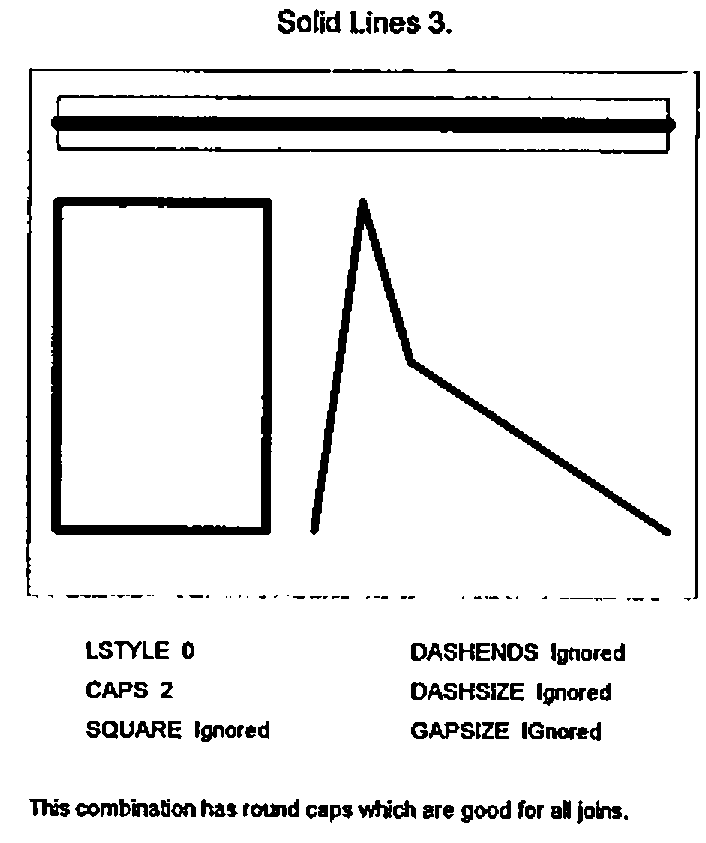

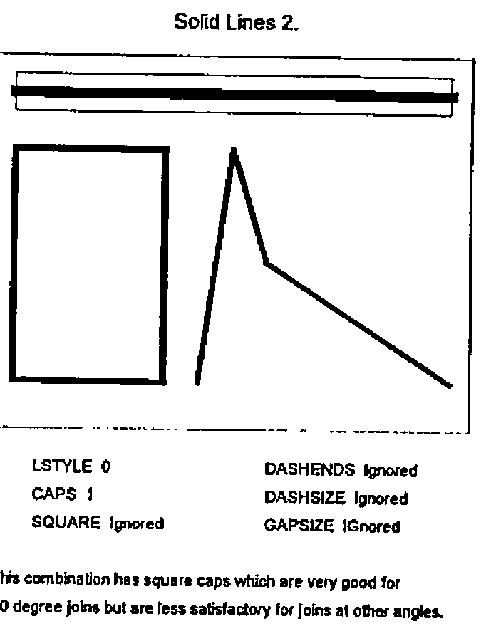

Each square is drawn with lines of the same length and width. The first square is drawn with lines with no line caps, resulting in the notches at each corner. The second square has round line caps. The line is drawn to the specified length but a semi-circular cap has been added to each end of the line producing a square with rounded corners. This kind of cap produces a good join regardless of the angle between adjacent segments. The third square has square line caps. Each line is extended by half the width of the line at each end and the result is a very good square. This technique is less effective if the join between line segments is other than at right angles.

The type of cap required and whether one is required at all depends on the object being drawn, and the Windows approach is very limited. Joining solid lines requires control of line caps but joining broken lines has other possibilities.

## Changing the Gap Size.

If a dashed line is used to join two points it seemed to me initially desirable that the line should start and end with a complete dash. This can be engineered by slightly adjusting the size of the gaps between dashes.

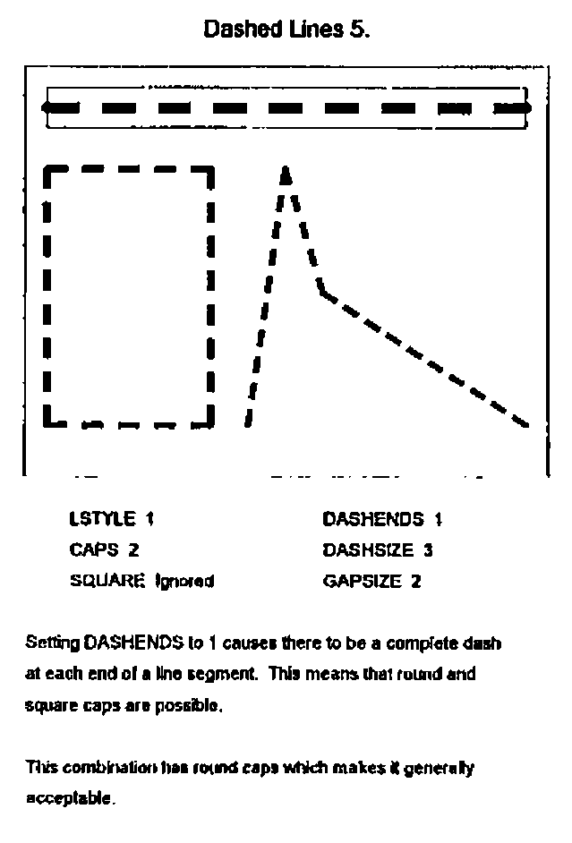

If the segment is to have square line caps then the line is drawn half a width longer at each end. This may mean an additional dash and possibly a shrinking of the gap size, or alternatively the gap size can be expanded to extend the line. The better alternative each time is the one that requires the least tampering with the gap size.

## A Realisation

Dashes are easy to comprehend but what about dotted lines? A dot can be a circle or a square. If the line is not very wide it does not matter too much which, but if the line is wider then circular dots look better. Windows graphics tools include an ellipse but no circle. Happily Dyadic have provided a circle amongst their graphical objects. (A circle differs from an ellipse in that its shape is preserved when the object containing it is re-sized.)

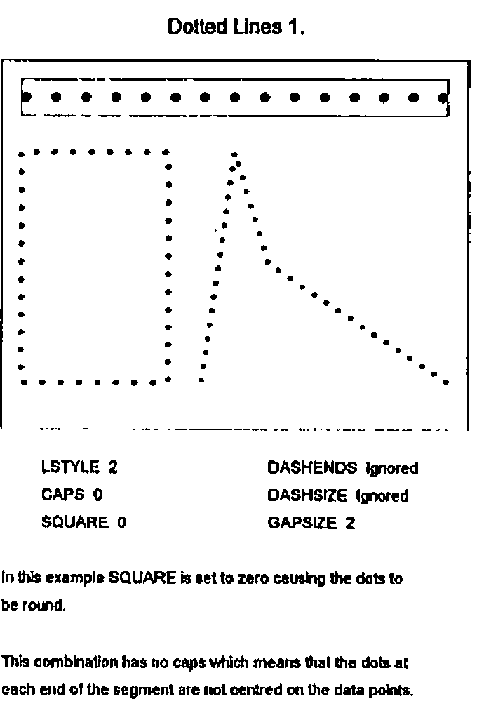

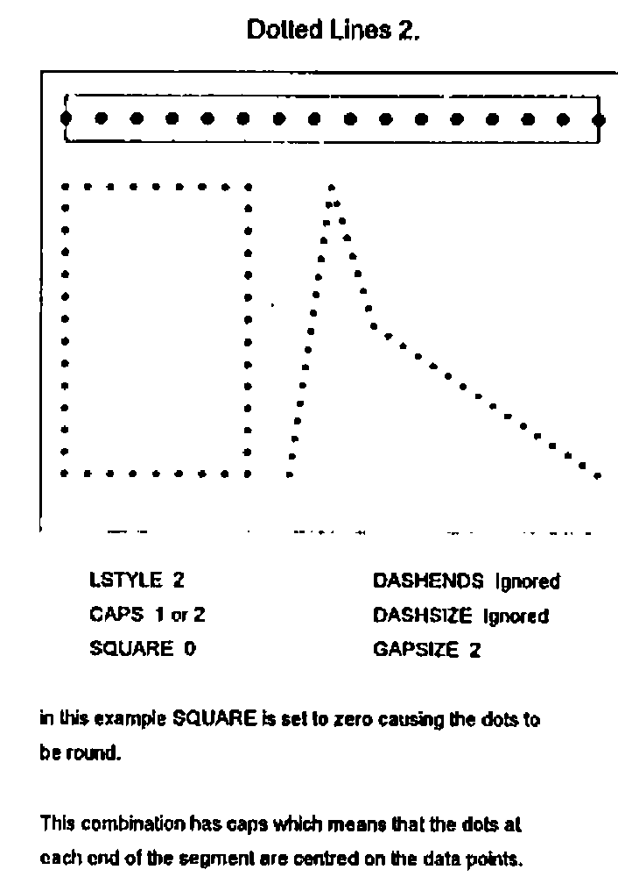

There is a small problem with the circle and that is the centre is always on a pixel. This can sometimes have the effect of making a line consisting of dashes and round dots look as if the dashes and dots are not lined up properly. This only happens when the line is only a few pixels wide, in which case a square dot is more satisfactory.

The idea of a line of round dots having square caps is rather daunting until we realise that the definition of square caps is the extension of each line segment by half a width at each end and it does not matter what the line comprises. If we adjust the gap size of a dotted line to ensure that it has a complete dot at each end, and we extend the line by half a width at each end, then the dot at the end of a segment will be in exactly the same place as the first dot in the next segment. This is good if the dots are round but not if they are square (the squares will usually have a different orientation).

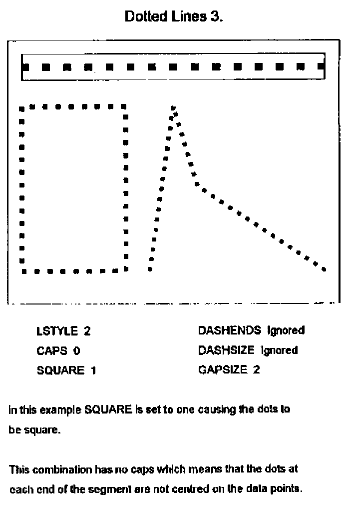

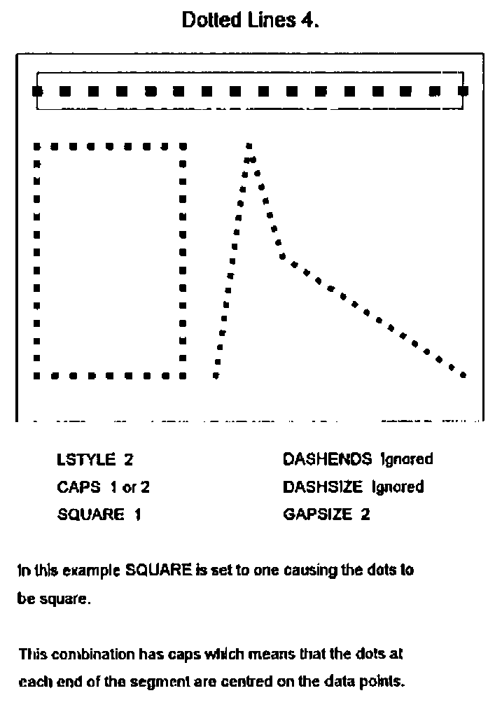

This problem is solved if we omit the first dot in the subsequent segment. This shows up another difficulty. If the polyline we are drawing is closed, i.e. it is a polygon, then the first segment can be thought of as subsequent to the last segment and it too needs to have its first dot omitted.

## Dot-Dash and Dot-Dot-Dash Lines

These are interestingly different. We want a line to start and end with a complete element, either a dot or a dash, and perhaps to be extended to form square caps. In this circumstance where elements at the join may not be the same a different technique is required. We would also like the pattern of dots and dashes to continue unchanged into the next segment. We cannot therefore omit the first element of a subsequent segment but must instead indent the first element. I have tried different sizes of indent and the one that works the best seems to be an indent equal to a gap plus half a width.

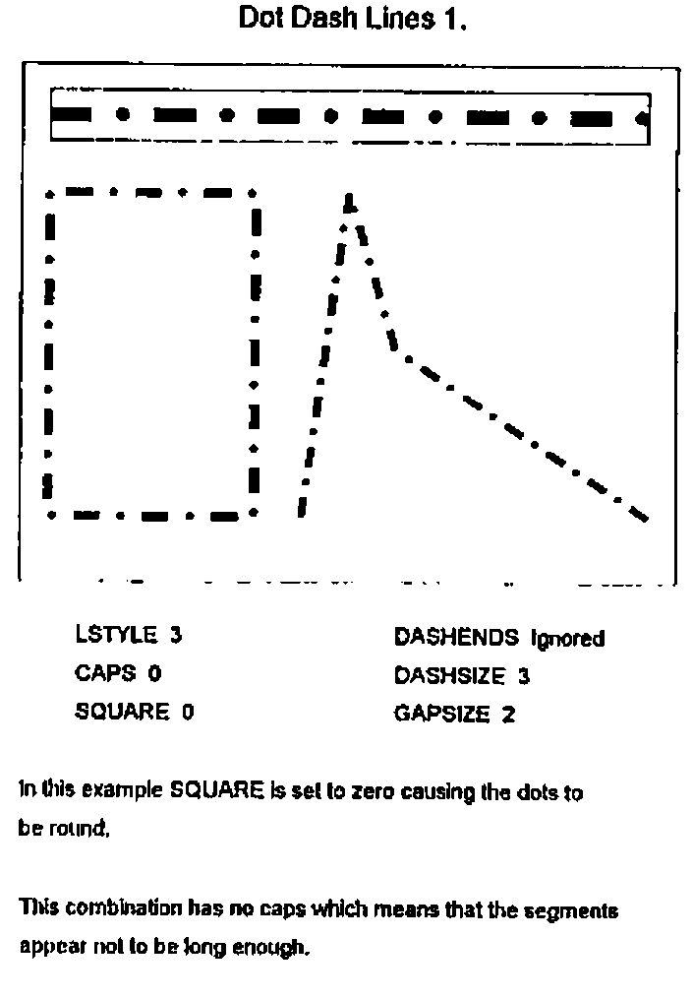

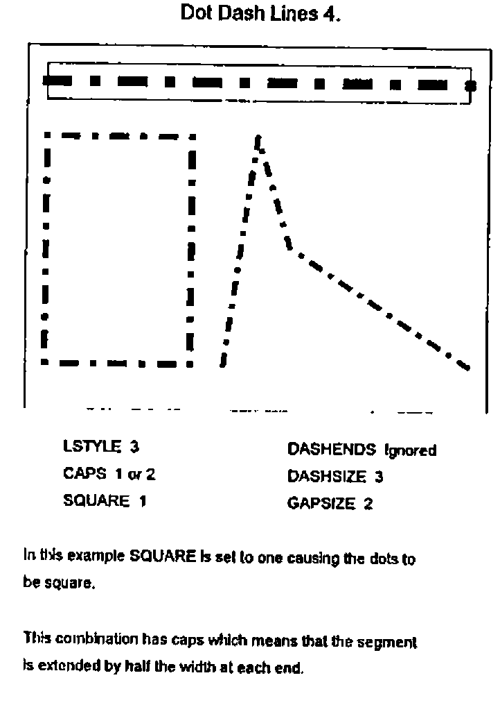

## Dashes at the End

I have described this topic in the sequence in which I developed the code omitting the cul-de-sacs that I visited on the way, including for instance drawing part-dots at segment ends which looked very nasty. There was however one facility which I had before I solved the problem of joining broken lines, and that was the facility to force dashes at each end of a dashed line and apply traditional square or round caps as if it were a solid line. This is good for drawing rectangles, for instance axis lines, so I made provision for this facility.

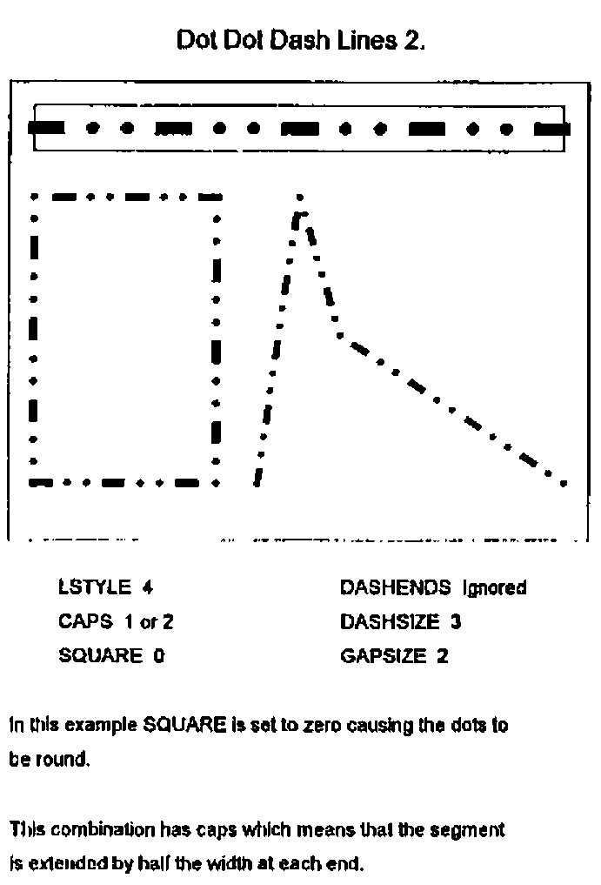

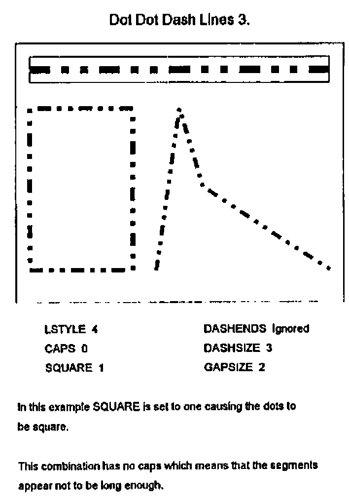

## The Implementation

Having got all the lines working I then thought it would be interesting to make it look like a new graphical object in Dyalog APL/W. So I invented a compound graphical object consisting of up to four real objects and which has the properties of a *POLY* object plus five more. These are *CAPS* to control line capping behaviour, *GAPSIZE* to specify the size of the gaps between elements (prior to any adjustment), *DASHSIZE*, to specify the length of any dashes, *SQUARE* to control whether dots are round or square and *DASHENDS* which can be used to force a dashed line to have dashes at each end. *GAPSIZE* and *DASHSIZE* are specified as integer multiples of the line width property.

This object I called an *Enhanced Polyline* with a *TYPE* of *EPOLY*.

The four objects of which it can consist are as follows:

1. An invisible polyline which is used to contain any filling (solid colour, hatching or bitmaps) specified by the *FSTYLE* property. This object uses its *DATA* property to keep all of the specified properties of the *EPOLY* object together with any specified user data.
2. An optional solid line drawn without caps in the specified background colour of the *EPOLY* line. If none is specified then this line is not drawn.
3. An optional *POLY* object consisting of, sometimes many, rectangular polygons. These are solid lines, or the dashes and square dots which comprise the *EPOLY* line. If none of these is required the line is not drawn.
4. An optional *CIRCLE* object consisting of, sometimes many, filled circles. These are round dots and round caps. If these are not required the line is not drawn.

## Performance

Performance can be a problem. Obviously a great deal more work is involved in computing all the rectangles and circles compared with just drawing a specified line. There is also a surprising amount of work involved in parsing the Dyalog-type syntax and this can be eighty percent of the effort in drawing a single segment line. It is less significant with disjoint lines with a number of segments.

The implementation consists of three user functions *QUAD_WC*, *QUAD_WG* and *QUAD_WS* which behave like their system counterparts plus *QUAD_EX* which can be used to expunge the constituents of an *EPOLY* object.

I am now working on a simpler and more limited syntax which speeds up the process. The situation is that the performance is OK on the screen using my 486 machine. I developed the *EPOLY* object for the purpose of producing high quality printed output and in this circumstance the time taken to send the bitmap output to the printer far outweighs the processing time and so performance is not a problem.

## Resolution

The relatively coarse resolution of the screen can have some odd effects. Because of rounding problems segments of a line at different angles can have different thicknesses when drawn on the screen. This does not happen on a laser printer as the resolution is so much greater.

## Dragging

As the *EPOLY* object consists of a number of real objects it cannot be dragged around the screen. The *LOCATOR* object can be used to provide similar facilities.

## Using the Clipboard

We can use the Clipboard to transfer pictures using the *EPOLY* and other graphical objects into Windows-based word processors but the interface is not as good as it might be. The graphs have to be drawn on a *BITMAP* object (perhaps a very large one) and then placed on the Clipboard. It can then be pasted in by the word processor and will appear on the screen. The difficulty is that when the page is printed the word processor (or perhaps the printer driver) makes the bitmap have the appropriate resolution by replicating pixels. This results in a loss of quality in the printed output.

This problem could be resolved if APL/W were to have a *METAFILE* object and the *CLIPBOARD* were to have a *METAFILE* property. This would enable the word processor to produce the picture at the appropriate resolution without pixel replication. It would also remove the necessity of having sufficient workspace to hold large bitmaps.

## Conclusion

This development was a good example of APL being used to build something where the design developed throughout the time the code was being written. When I started this task I had not realised the nature of the problems that would arise and how some of my ideas would look scruffy when seen on the screen or when printed.

Since writing this paper I have talked to Adrian Smith whose mind has also been dwelling on these matters. One of his concerns was dealing with very short dashed-line segments where, for example, the segment is shorter than a dash, or perhaps shorter than a dash plus a gap. The simple solution for the former situation is to either make the segment blank (which is what I do) or to make it a solid line. The trouble with leaving it blank is that if there is a series of short segments, then nothing appears on the page! Adrian’s view, which I think is probably best, is to use part-dashes, so that the same dash may be split between two or more segments (which is what PostScript does). I will probably adopt this thinking, having worked out how it works with lines including both dots and dashes.
