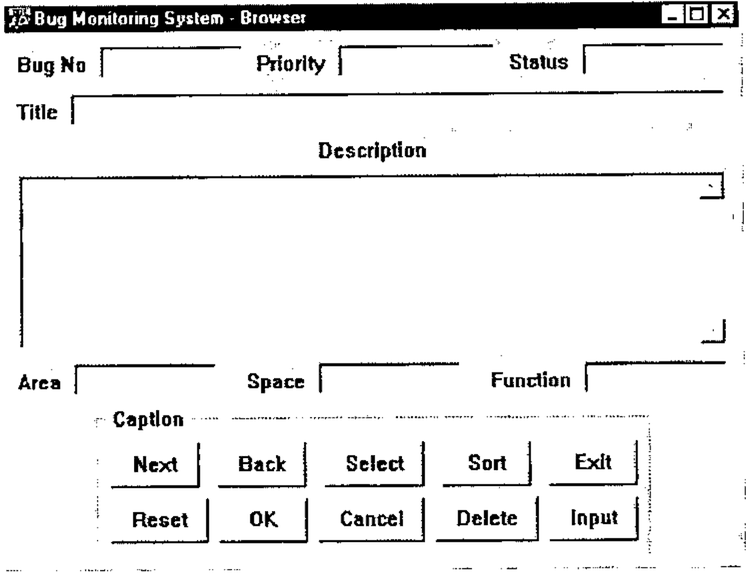

by George MacLeod (george.macleod@simcorp.com)
{ .byline }

## Introduction

For the benefit of non-British members of the BAA I probably need to explain the title of this paper. Every year the City of London (the financial part of London) elects a new Lord Mayor. His inauguration is celebrated by a procession of golden coaches and floats, many of them pulled by horses. At the back of the procession is the man who clears up after the horses.

I earn my keep as an APL contract programmer, which means that I spend most of my time porting systems that have been around for years or maintaining legacy systems on IBM mainframes. Many of these systems are ten or more years old and have been worked on by a host of people of varying abilities in different styles and different standards, or sometimes, no standards at all.

The advent of APL interpreters that can run in the Windows environment has encouraged the use of APL to build GUI systems. Programming GUI objects using the system functions provided by the interpreter can be a boring job which has to be done with some precision if the result is going to look good. This has caused some programmers to build their own tool kits so as to increase the speed with which GUI programs can be written. These tools are often very effective in speeding up the program writing though they tend to produce rather regimented GUI layouts. The real downside is that these tools become part of the application program. It can mean that layouts are controlled by a number of global variables which if changed can have strange effects all over the system. The other type of tool tends to consist of many small functions which the developer laces together and which are an integral part of the application. The programmer who comes along later has to understand the functions (which generally are not documented) in addition to understanding the application itself.

I have written most of my GUI code using the system functions (`⎕WC`, `⎕WS` etc.) provided in Dyalog/APL. This has been fine but I have always envied the speed with which the developer with a GUI tool kit has been able to create GUI code. If you care about the look of your Windows screen you can spend a lot of time fiddling about with the position and size of objects so that they look good.

## GUIBuilder

So I decided to build a meta-language that would do the following:

- generate APL code that would produce a populated Window.
- not use any global or local variables in the generated code.
- not use any sub-functions in the generated code.
- compute the Position property of every object.
- compute the Size property of most objects
- generate composite objects to provide a Caption property where one is not usually available.
- allow the height of List, Edit and some other objects to be specified in Rows.
- assist in centring and aligning objects relative to other objects.
- allow the programmer to tweak the layout so that the programmer has final control.

This system I call GUIBuilder. GUIBuilder consists of a number of functions that produce GUI objects, functions involved with locating them on a form and a set of functions to change the spatial relationships between objects (like centring, aligning, spreading etc.). Creating a GUI form by this process generates a function which will produce the form with all its objects and containing only APL system functions to generate them.

## Example of GUIBuilder

This is all best illustrated by example.

Let us imagine that we wish to build the following form.



```
[0]   MakeVector
[1]   ⍝ This is an example for Vector
[2]    StartBuilder'Example for Vector'
```

This is the start of a function called MakeVector. The function name is chosen by the user.

The first function invoked is `StartBuilder` which initiates GUIBuilder and whose argument will be used as an initial comment in the created function.

```
[3]    'Bug'Form'C Bug Monitoring System'
```

This creates a Form whose name is Bug and which has a caption of Bug Monitoring System. The C in the parameter indicates that what follows is a Caption ( an F would have indicated a Font Name and T a Tip – there are others which are described below).

The size of the Form is not specified as this will be calculated.

When an object is created it becomes the currently Selected Object and the next object will be located relative to it.

```
[4]    'Bug.L1'Edit TopLeft'C Bug No'(0 100)'R 1'
```

This line creates a composite object called `'Bug.L1'` consisting of an Edit object called `'Bug.L1Edit'` and a Label object called `'Bug.L1Label'`. As the Selected object is the parent of the object being created it will be the container of the object being created. Therefore the new object will be inside the form in the top left hand corner. The contents of the parentheses indicate the size of the edit field. The height is specified as 0 because it will be specified later. The width of the Edit object will be 100 pixels.

Normally an Edit object does not have a Rows property but GUIBuilder allows the number of rows to be specified and calculates the height in pixels taking into account the font being used. `'R 1'` indicates that there is one Row.

The Label object will be placed to the left of the Edit object. This is the default.

```
[5]    'Bug.L2'Edit Right'C Priority' 'R 1'(0 110)
[6]    'Bug.L3'Edit Right'C Status' 'R 1'(0 100)
```

Specifying `'Bug.L1'` caused it to become the Selected object and therefore `'Bug.L3'` is specified as being to the *Right* of it. `'Bug.L3'` is to the *Right* of `'Bug.L2'`.

```
[7]    Select'Bug.L1'
```

The next object we wish to place below `'Bug.L1'` so we make `'Bug.L1'` the Selected object.

```
[8]    'Bug.E1'Edit Below'R 1' 'C Title'
```

This is another single row edit field. This time the size is not specified at all. The Row property specifies the height and we will calculate the width later.

```
[9]    'Bug.E2'Edit Below'R 7' 'L Above Centre' ...
       ... 'C Description' 'S Multi'
```

The line defines a multi-line edit field. Again there is no size specification, the height is 7 rows and the width we will calculate later. The L phrase defines the placement of the Label with regard to the Edit object. It specifies that the Label will be centred above the Edit object. The S phrase specifies a Style property and indicates that the Edit object will have a Style property of Multi.

```
[10]   'Bug.E2Edit'Props('VScroll' 1)( 'ReadOnly' 1)
```

This line contains the `Props` function which makes it possible to specify additional properties. These properties are added to the `⎕WC` statement in the Vector function which makes it possible to use properties that may only be specified when the object is created.

```
[11]   'Bug.L4'Edit Below'C Area'(0 100)'R 1'
[12]   'Bug.L5'Edit Right'C Space'(0 100)'R 1'
[13]   'Bug.L6'Edit Right'C Function'(0 100)'R 1'
```

These three objects are similar to ‘Bug.L1’ through ‘Bug.L3’

```
[14]   Select'Bug.L4'
[15]   'Bug.G'Group Below'C Caption'
```

Change the Selected object and below it place a Group object of no specified size

```
[16]   'Bug.G.B1'Button TopLeft'C Next' 'E 30 Exit'
[17]   'Bug.G.B2'Button Right'C Back' 'E 30 Back'
[18]   'Bug.G.B3'Button Right'C Select' 'E 30 Select'
[19]   'Bug.G.B4'Button Right'C Sort' 'E 30 Sort'
[20]   'Bug.G.B5'Button Right'C Exit' 'E 30 1'
```

This places five push buttons across the form. No size is specified as push buttons have a default height and a default minimum width. The width of the Button Caption property is calculated and the width of the button is increased if necessary. The E phrase allows the specification of Events.

```
[21]   Select'Bug.G.B1'
[22]   'Bug.G.B6'Button Below'C Reset' 'E 30 Reset'
[23]   'Bug.G.B7'Button Right'C OK' 'E 30 OK'
[24]   'Bug.G.B8'Button Right'C Cancel' 'E 30 1'
[25]   'Bug.G.B9'Button Right'C Delete' 'E 30 Delete'
[26]   'Bug.G.B10'Button Right'C Input' 'E 30 Input'
```

This defines five more buttons beneath the first five.

```
[27]   'Bug.L1' 'Bug.L3'SpreadObject_H'Bug.E1'
[28]   'Bug.L1' 'Bug.L3'SpreadObject_H'Bug.E2'
```

Now we come to a function that changes things. SpreadObject_H (H for horizontal) changes the width of `'Bug.E1'` *and* `Bug.E2` so that they stretch from the left edge of `'Bug.L1'` to the right edge of `'Bug.L3'`. This makes the two wide edit fields line up with the three edit fields above them.

```
[29]   'Bug.L1' 'Bug.L3'SpreadGaps_H'Bug.L4' 'Bug.L5' 'Bug.L6'
```

SpreadGaps_H increases (or decreases) the gaps between objects so that the edit objects at the bottom of the form line up with the other edit objects.

```
[30]   FitContainer'Bug.G'
```

Now we can calculate the size of the group so that it fits nicely around the buttons.

```
[31]   FitContainer'Bug'
```

and now we fit the form to the objects it contains. If you trace the MakeVector function this is the first time that you see what you have created, because up to now the size of the form has been 0 104. (it was specified as 0 0 but the minimum width of the user area of a form is 104 pixels.

```
[32]   CentreHorizontal'Bug.G'
```

This centres the Group containing the buttons.

```
[33]   'Bug.G.B6' 'Bug.G.B10'SpreadGaps_H...
       ...'Bug.G.B1' 'Bug.G.B2' 'Bug.G.B3' 'Bug.G.B4' 'Bug.G.B5'
```

This spreads out the top row of buttons to match the bottom row.

```
[34]   'Bug'PlaceForm TopMiddle
```

This places the Form at the top middle of the screen (taking into account the Screen Metrics so that the Title bar does not disappear off the top of the screen).

```
[35]   '⍝ Extra'Function'Vector'
```

Finally we execute Function which creates the function Vector which we will use in our application to create the GUI. The left argument is optional and specifies a line of code to place at the end of Vector. In this example we will call a function called Extra, or we would if it were not preceded by a lamp. This is what I choose to do as usually the Function Extra (or whatever it is called) has not been written on the first runs of MakeVector.

Finally the function Vector is run so that the final object you will see has been created by the created function.

And this is what Vector looks like.

```
Vector
⍝ Example for Vector
⍝ Created by GUIBuilder from MakeVectorTest
 'DefaultFont'⎕WC'Font' 'System' 16 0 0 0 700 0
 'Bug'⎕WC'Form' 'Bug Monitoring System - Browser'(20 149)(364 502)
    ('Font' 'DefaultFont')('Tip' 'Bug.Tip')
 'Bug.L1Label'⎕WC'Label' 'Bug No'(13 8)(16 48)
 'Bug.L1Edit'⎕WC'Edit'('Posn' 8 64)('Size' 24 100)
 'Bug.L2Label'⎕WC'Label' 'Priority'(13 172)(16 47)
 'Bug.L2Edit'⎕WC'Edit'('Posn' 8 227)('Size' 24 110)
 'Bug.L3Label'⎕WC'Label' 'Status'(13 345)(16 41)
 'Bug.L3Edit'⎕WC'Edit'('Posn' 8 394)('Size' 24 100)
 'Bug.E1Label'⎕WC'Label' 'Title'(45 8)(16 28)
 'Bug.E1Edit'⎕WC'Edit'('Posn' 40 44)('Size' 24 450)
 'Bug.E2Label'⎕WC'Label' 'Description'(72 214)(16 74)
 'Bug.E2Edit'⎕WC'Edit'('Posn' 96 8)('Size' 120 486)('Style' 'Multi')
    ('VScroll' ¯1)('ReadOnly' 1)
 'Bug.L4Label'⎕WC'Label' 'Area'(229 8)(16 29)
 'Bug.L4Edit'⎕WC'Edit'('Posn' 224 45)('Size' 24 100)
 'Bug.L5Label'⎕WC'Label' 'Space'(229 164)(16 40)
 'Bug.L5Edit'⎕WC'Edit'('Posn' 224 212)('Size' 24 100)
 'Bug.L6Label'⎕WC'Label' 'Function'(229 331)(16 55)
 'Bug.L6Edit'⎕WC'Edit'('Posn' 224 394)('Size' 24 100)
 'Bug.G'⎕WC'Group' 'Caption'(256 63)(100 376)
 'Bug.G.B1'⎕WC'Button' 'Next'(24 8)(30 60)('Event' 30 'Exit')
 'Bug.G.B2'⎕WC'Button' 'Back'(24 81)(30 60)('Event' 30 'Back')
 'Bug.G.B3'⎕WC'Button' 'Select'(24 154)(30 68)('Event' 30 'Select')
 'Bug.G.B4'⎕WC'Button' 'Sort'(24 235)(30 60)('Event' 30 'Sort')
 'Bug.G.B5'⎕WC'Button' 'Exit'(24 308)(30 60)('Event' 30 1)
 'Bug.G.B6'⎕WC'Button' 'Reset'(62 8)(30 66)
 'Bug.G.B7'⎕WC'Button' 'OK'(62 82)(30 60)('Event' 30 1)
 'Bug.G.B8'⎕WC'Button' 'Cancel'(62 150)(30 72)('Event' 30 1)('FCol' 128 128 128)
 'Bug.G.B9'⎕WC'Button' 'Delete'(62 230)(30 70)('Event' 30 'Delete')
 'Bug.G.B10'⎕WC'Button' 'Input'(62 308)(30 60)('Event' 30 'Input')
⍝ Extra
```

This GUI code has been produced without having to specify any position properties and very few size properties. There is no detritus and the code is very easy to understand.

If the original developer has to make changes then this can best be done by modifying the meta-code and re-running it.

There are a number of functions not described in this paper but they mostly do similar things to those described.

One exception is `Ratchet`, which moves an object in a specified direction.

```
'Bug.G'Ratchet Down 10
```

This code would move the Group object down by 10 pixels. It is important that such a line of code is placed in the correct place in the function. Clearly it has to go after the line creating the group and putting it immediately after is a good idea. It must be before the line that fits the Form to its contents or the Form will be too small. The function Ratchet is provided so that the programmer has the final say in the location of any object.

## Final Thoughts

I started using GUIBuilder before it was finished and thoroughly tested. Every time I made a window GUIBuilder fell over or showed that it needed additional functionality. Finally I built a window that went smoothly and writing the meta-code was extremely rapid. I am very pleased that I built the system and will use it in all future work.

GUIBuilder is not yet complete as not all objects are handled. I would like to handle PropertySheets and PropertyPages. These are interesting as the size of all PropertyPages is controlled by their parent PropertySheet. Unfortunately specifying the Size property is unreliable at this time.

Finally, best of all, I will not be providing material for the man who follows the horses!

If anybody is interested in trying GUIBuilder then contact me on:

george.macleod@simcorp.com
