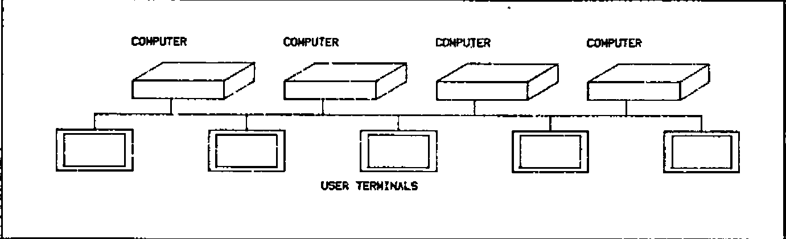
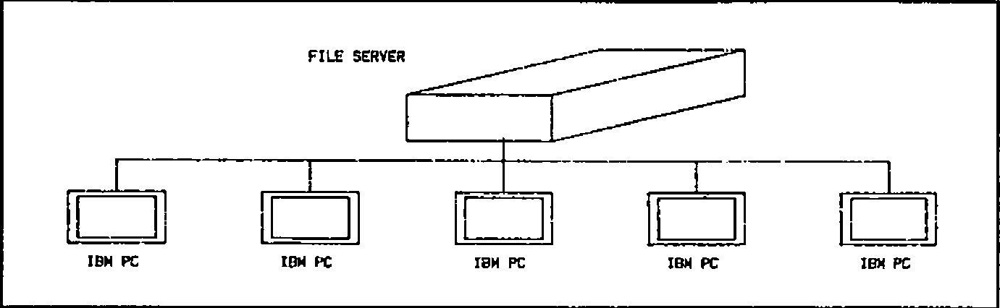

by Richard Nabavi
{ .byline }

## What is Networking?

Of all the buzzwords in the computing industry, ‘Networking’ is the one which is the most misused, and yet the most indicative of underlying user needs for computing in the late ’80s. Just as in the early seventies, ‘Interactive’ and ‘Real Time’ were regarded as the adjectives to look for in assessing computer systems, today manufacturers all claim that their systems have a networking capability.

In reality, networking can mean different things. Looking through the computer magazines, there seem to be three main ways in which the word is used (or misused). These can be described as Point-to Point, File Serving, and True Networking.

## Point-to Point Networks

Many vendors of ‘networking’ products are in fact talking about something very simple. This is illustrated in Figure 1, and a typical example of such a system is Clearway, a product of Real Time Systems Ltd. Essentially, what this consists of is a coaxial cable (or, more generally, any means of transmitting messages, such as a fibre optic link) into which a number of devices can be linked. Typically, the devices which will be hooked on to the cable will be terminals, printers and computers. The idea is that, instead of wiring terminals and other peripherals to computers via ordinary ‘RS232’ cables, the network is used instead to provide a multitude of point-to-point links between the various devices. In other words, this sort of ‘network’ is really doing nothing except making neater the connections between devices, which otherwise would be connected via a mess of independent cables.

The advantages of a system such as Clearway are obvious. As new devices are added, you do not need to rewire your building. A single terminal can switch between different computers under software control, instead of having to replug RS232 cables every time you wish to log on to a different computer. This is a lot more efficient than conventional wiring, plugboard and switches, but these sorts of systems should not be confused with networking of computers, since they do not allow the sharing of data between different CPU’s connected to the network, They represent a very useful simplification of the problems of lots of data cables around a building, but they do not involve any radically new approaches to data processing or the way in which computers are used.

## File Serving Networks

Many of the claims which computer vendors make for networking capability refer to something which again should not be confused with true networking. This is what I call the File Server type of system. The philosophy behind this is again fairly simple, and can be very useful. The ‘network’ is built around a single central computer, usually with a hard disk and perhaps a printer and other peripherals connected to it, into which are connected (in a ‘star’ configuration) external satellite computers (see Figure 2). These satellite computers will usually be small microcomputers, with no disc facility at all (or perhaps with a small amount of floppy disc storage). The idea is that hard disc storage is relatively expensive, and that users in many applications will wish to share common data. Note that, in this type of system, the computers in the network fall into two distinct classes — File Servers (of which there will usually be only one), and Satellite Units.

A number of points should be apparent. The first is that only the File Servers need to have an advanced, multi-tasking operating system. This is because the Satellite Units are supporting only one terminal, and, when a request is made, for example, to read a record from a file, the Satellite Unit which made the request will wait until the record is returned as data by the File Server. The second point is that the expansion capability of the network is limited by the response time of the central File Server. Essentially, we have only one computer serving all the disc read/writes for everyone on the network, which is not much better than having only one multi-user computer in the first place. Thirdly, although there may be peripherals such as printers or graph plotters attached to some of the Satellite Units, these will not be accessible to other Satellite Units. In other words, we are re-creating the concept of a central computer — comprising disc files and peripherals — which is accessed by remote users, who may or may not have some local printing facilities. For many of us, it was to get away from the restrictions of centralized computing that we first turned towards microcomputers, and the re-creation of a central computer is like bringing back the bath water with the baby.

## True Networking

By now it should be becoming clear what I mean by a true networking computer system. The characteristics are:

- The ability to connect together a number of computers, each logically equivalent as far as the network is concerned;
- Each of the computers on the network to be single or multi-user as is most convenient;
- Each of the computers to have the possibility of disc storage, although the amount and type of storage will vary between the different machines;
- Each of the computers in the network to have the possibility of being connected to a number of peripherals;
- Any user on any machine on the network to be able to access (transparently to the applications software) any file on any disc on any machine in the network (subject of course to normal security checks);.
- Any user on any machine on the network to be able to access any peripheral on any machine on the network;
- Full multi-user controls including file and record locking to apply across the whole network.

Further features which in practice we have found desirable are:

- The ability for any user to initiate a task on a remote machine, either attached to his terminal or to run as a background task. A good example where this is useful is to start a print spool job on a remote machine;
- The ability to connect simultaneously to several networks;

Figure 3 shows a typical small configuration, which is in fact MicroAPL’s in-house network system.

*Fig.1 — Point to Point Networking*



*Fig.2 — File Server Networking*



*Fig.3 — MICROAPL In-House Network*


## Operating System Support of Networking

Most discussions of networking concentrate on the characteristics of the physical connection between devices on the network. Unfortunately, most computers in use today are based on operating systems which were conceived before networking was developed. This means that networking has to be added on as an ‘extra’, and is not built-in to the design of the systems software. The consequence of this is that limitations have to be imposed on what you can do with the network. For example, some major manufacturers have announced Ethernet connections between their computers, but when you come to examine the capabilities in detail, you find that the only way in which data can be accessed on a remote machine is by copying the whole file from the remote machine to your home machine.

In order to illustrate the way in which networking can be built in to the system software of a modern computer, let us look at MIRAGE, one of the few operating systems which was designed right from the beginning to cater for network operation. MIRAGE is a multi-user, multi-tasking operating system which was written by a UK company, Swifte Computer Systems Ltd, for Motorola 68000 computers. It has been in use since 1981 on MicroAPL’s range of 68000-based micros, and it implements networking in a very simple way.

To understand the way in which MIRAGE handle network file accesses, let us first consider how the operating system refers to a file on a single machine. Files are organized in ‘directories’ on logical discs on the system. For example, suppose a user wanted to type out the contents of a text file called ‘SYSTEM.HELP’ which was sitting in the ‘DOC’ directory on logical disc 3 of his machine. Using the MIRAGE utility ‘TYPE’, he would enter at the keyboard:

```
TYPE DSC3:SYSTEM.HELP[DOC]
```

‘DSC3:’ refers to the name of the logical disc on which the file resides, the directory in which it resides is entered between square brackets, and the file name is divided into a main file name (‘SYSTEM’) and a file extension (‘HELP’). As a convenience, it is not always necessary to enter all of this information, since each user has a default disc and directory into which he is ‘logged’, and which he can change at any time. For example, by entering:

```
LOG DSC3:DOC
```

he can change his default directory to be DOC on DSC3:. If he then enters:

```
TYPE SYSTEM.HELP
```

the operating system will by default look for the file in the correct place.

The extension of this to a networked system is simple. As well as specifying the directory and disc on which a file is to be found, you specify a machine on the network. This is done by adding to the front of the file name a ‘Node’ name (‘Node’ means machine on the network). This is distinguished from the logical disc name by being terminated by two colons rather than one. The home machine is always ‘SYSO::’. Thus, in the example above, the user could if he wished have used the full file name:

```
TYPE SYSO::DSC3:SYSTEM.HELP[DOC]
```

This means: Type out the file SYSTEM.HELP, which is to be found in directory DOC on disc 3 on my home machine. To access a file on a remote machine, you simply change the Node name to that of another machine on the network. For example, a user on a remote machine who wanted to type out the same file might enter:

```
TYPE EXT4::DSC3:SYSTEM.HELP[DOC]
```

where EXT4:: is the name (as viewed from his computer) of the machine on which the file resides. Naturally, it might become rather tedious to have all the above information for every file reference, so you can log into a remote directory. For example:

```
LOG EXT4::DSC3:DOC
```

would cause the default node, disc and directory to be the ones we were interested in.

Another couple of examples should give an idea of the possibilities. To copy a whole file from a remote machine to your own:

```
COPY SYS0::DSC0:MYHELP.DOC[HELP] = EXT4::DSC3:SYSTEM.HELP[DOC]
```

This copies the file SYSTEM.HELP from the DOC directory of disc 3 on remote machine EXT4:: to the HELP directory of disc 0 of the user’s home machine, renaming the file to MYHELP.DOC in the process.

To copy a file from one remote machine to another remote machine:

```
COPY EXT6::DSC0:MYHELP.DOC[HELP] = EXT4::DSC3:SYSTEM.HELP[DOC]
```

This is the same as the previous example, except that the file is being copied from remote machine EXT4:: to remote machine EXT6::.

## High Level Language Support of Networking

Clearly, all the above facilities are of limited use if they cannot also be used by high-level languages such as BASIC, Pascal, APL, and so on. Equally, in a true networking environment, applications software such as word-processing software and spreadsheets should be able to access files anywhere on the network. This again shows how important it is for networking capabilities to lie right at the heart of the system software, so that high-level support for these facilities should ‘fall-out’ automatically without special arrangements. We can see how this works by considering how APL.68000 under MIRAGE can access files across the network.

Let us first consider how APL finds files on a single machine. The user might, for example, enter:

```
)LIB
```

which would print out his default library of APL workspaces. He can also access up to 9 other libraries, by (for example) asking for:

```
)LIB 5
```

What in fact happens here is that the APL interpreter maintains, for each user, a table (technically an APL system function Quad-MOUNT) of his current ten libraries. By default, these are logical discs 0 to 9 on his home machine, with his default MIRAGE directory. Thus, the default table looks like this:

```
SYSO::DSC0:JIM
SYSO::DSC1:JIM
SYSO::DSC2:JIM
.....
.....etc.
```

At any time, the user (or the applications program) can modify any or all of the rows of this table. For example, the first three rows of the table might be changed to:

```
SYSO::DSC0:JIM
SYSO::DSC4:MARY
SYSO::DSC5:LUKE
```

This would mean that library 0 would be directory JIM on disc 0, library 1 would be directory MARY on disc 4, and library 2 would be directory LUKE on disc 5.

The extension to a networked configuration is obvious and very simple. You simply specify the node for each logical library. For example:

```
EXT3::DSC0:APL
EXT6::DSC3:SUE
EXT9::DSC2:DAVE
```

In this example, libraries 0, 1 and 2 are all on different remote machines.

For those familiar with APL.68000, note that as well as workspace loading, saving, and copying, the Quad-MOUNT table also specifies the location for component file accesses using APL.68000’s file system. Up to ten different nodes/discs/directories may be specified using Quad-MOUNT. If this is not enough, you can change Quad-MOUNT dynamically under program control to give access to an unlimited number of file locations. In addition, print spool files may be directed to a remote machine, as may arbitrary input/output, so that, for example, a graphics package may produce graphs on a flat-bed plotter which happens to be connected to a different computer.

The important thing to appreciate here is that an application program, written in APL, need not be modified to run off a file on a remote machine. Suppose that, for example, we have written a management information system which was originally designed to run on a single machine, with files on DSC0: and DSC1: of that machine. Later on, we link the machine into a network, and we want users on any machine to be able to access the same files, without changing our applications software. All that is necessary is for the above table (the ‘Quad-MOUNT’ table) to be initialized to set up the first two rows for access to the machine on which the files exist, and then the user will be able to run the application without any changes. The initialization can of course be automated so that the user is unaware that it is happening, if desired.

Access to the network via other languages is similar; essentially, we merely change the node part of the file name to go to a remote machine. To run the word-processing software off a remote disc, you simply LOG into the remote directory before running it. With the single exception of one piece of software which maintains memory-resident disc buffers, all programs written under MIRAGE can run unchanged across a network.

## File and Record Locking on a network

Probably the most embarassing question you can ask a supplier who claims to support networking is whether file and record locking operate across the network. The importance of this question will be obvious to anyone who has experience in writing multi-user applications software, since by definition networked systems are multi-user. A quick example should show what we mean.

Suppose we have a stock control system, and the files can be updated both by the Goods Inwards department and by the Goods Outwards department — which seems reasonable. Consider the case where a consignment of 100 Size 10 Wonderflanges arrives, and at about the same time an order for 18 of the same item is being despatched. The stock level before all this happens is 134.

The Goods Inwards people go to their computer terminal and call up the stock record for the Size 10 Wonderflanges, and at the same time the Goods Outwards people also do the same. Goods Inwards type faster, and so they enter the arrival of 100 items, to make a stock level of 234, and the record is written back to the file. Meanwhile, Goods Outwards see that there were 134 items in stock, and they enter their Goods Out details to reduce the stock to 116, and this record is written back to the stock file, overwriting the record which Goods Inwards have just written. The final result is that the stock level will be erroneously recorded as 116 instead of 216.

This is an absolutely standard problem in multi-user systems, and careful consideration will show that there is no way to avoid the difficulty unless the operating system maintains some form of file or record locking feature. What happens then is that, before updating the file, the record is ‘locked’ and no other user can access it until the update sequence is complete. Depending on the sophistication of the operating system, this lock might be on the whole file, or on specified records, and it might be a lock against all accesses, or only against writing. Whatever arrangement is used, a commercial multi-user system must have some form of file locking if multiple on-line file updating is to be possible.

Exactly the same considerations apply to networked systems. If true networked processing is to be possible, any user must be able to lock any file on any disc on any machine on the network (again, subject to security considerations). MicroAPL’s systems can in fact provide file and record locking across the network, as well as providing two levels of lock (read only or read/write). Again, the fact that the lock is occurring over the network is transparent to the applications software.

## Case Study No. 1: Imperial Group

So far we have considered the facilities offered by MicroAPL’s networking software in theory. How does it work in practice?

One example of a network used by a MicroAPL client is a group of large MicroAPL Spectrum supermicros installed at the London headquarters of Imperial Group. These systems serve over thirty users, with a large number of different printers, graph plotters and other peripherals attached to the machines on the network. The multi-user machines are used for two main (related) applications:

- Consolidation of the management accounts of the various companies in Imperial Group to provide an overall set of Group accounts.;
- On-line display of thousands of graphs detailing performance of the different parts of the Group against budget, previous year’s performance, etc. This is done on Tektronix colour screens installed in the boardroom and in the offices of the senior executives of the Group. Hard copy of graphs is produced on Hewlett Packard flatbed plotters.

This installation is an example of the use of networking to create a large effective logical computer out of a number of smaller machines. Initially, two separate machines were purchased (one for each of the above applications) and data transfer between the machines was via magnetic tape cartridge. The initial two machines were gradually expanded with extra memory and extra I/O ports, and then linked together using an Ethernet link to facilitate exchange of data between machines. Subsequently, further processing power was added by linking in another machine with a larger disc capacity. At the time of writing, the installation has been built up to an overall system of 48 RS-232 I/O ports, approximately 8 Megabytes of RAM, and 144 Megabytes of disc capacity, with two tape drives for back-up and data exchange.

A number of benefits accrue from this approach. Extra capacity in terms of CPU power, RAM, disc capacity, I/O ports and peripherals can be added as and when it is needed, with no need to change software as the installation grows. The use of several independent computers on a network gives the advantage of some degree of fault tolerance whilst permitting the sharing of common data and peripherals. Data can be backed up on to a remote machine, reducing the need for expensive tape units and simplifying backup and recovery procedures. New releases of software can be tested on one of the machines on the network, with access to the real data, whilst maintaining the previous version on other machines on the network. System maintenance — both in hardware and in software terms — is easier than it would be on a single minicomputer of comparable overall performance.

## Case Study No. 2 — BASF

The Imperial Group system is an example of a tightly-coupled set of machines; the only practical alternative to their network of supermicros would be a minicomputer or small mainframe. A different type of installation — built out of similar building blocks — is to be found at the large BASF complex at Ludwigshafen in Germany.

BASF have purchased a number of MicroAPL Spectrum machines of different configurations. These include machines with 5″ and 8″ floppy discs, 5″ Winchesters, 36 Mb 8″ Winchesters and 72 Mb 8″ Winchesters. The systems are used for a variety of applications and are scattered about the very large site. Some are used in multi-user mode, others are single-user dedicated systems. Devices connected to the systems vary between ordinary terminals and printers to laboratory instruments. The systems are used for scientific and engineering work, as well as straight commercial work.

In this case, an Ethernet cable of 1.5 kilometres has been used to link together the various machines. The purpose here is to allow simple exchange of information (even though some of the systems are of different configurations so that they cannot, for example, swap floppy discs to exchange data), and to avoid the isolation of having separate computers in various locations. Whereas in Imperial Group the effect of installing networking has ben to create effectively one large logical computer, here the different computers are exchanging data less frequently and are not necessarily running related software. The installation of the network has meant improved communications, easier exchange of programs in a development environment, and access across the network to any peripheral, disc or tape on any machine.

The BASF network is thus an example of a network of powerful micros which could run independently, but which form a much more flexible set of systems when linked together. The alternative would have been to stick with a collection of non-networked microcomputers, with all the disadvantages of isolation which that solution can cause. The problems of non-linked machines would have been particularly bad in view of the size of the Ludwigshafen site; whereas in many cases it may be acceptable to walk from one machine to another with a floppy disc if you want to exchange data, when the other machine is a mile away you do not want to do this too often.

## The real challenge — true multi-vendor networking

The systems we have been talking about so far are very flexible, but are limited in one very crucial respect. This is that the computers connected to the network have to be running the same operating system. Thus, you cannot simply take an assortment of different computers from a variety of manufacturers and link them together.

True multi-vendor networking does not exist at this moment. Whilst a number of specialist suppliers have worked on bridging this gap, the solutions offered for multi-vendor networking have to be very restricted. This is not surprising, since the facilities offered by different operating systems — let alone how those facilities are implemented — vary enormously. Therefore the ideal of being able to access files on any machine on the netwok, irrespective of the make and model of the machine, is very far off.

Worse than this, even if you could load a program from a remote machine into a computer of a different type, this would still only be of limited usefulness. Try to run a program written for the 8088 chip in an IBM PC on the 68000 processor in an Apple Lisa and you will not get very far. Even pure data files will be of different formats for different machines, with the possible exception of text files which are fairly standard. Even Unix does not provide machine independent program and data files, because of the multiplicity of different Unix versions and the fact that many programs are compiled into the native code of the machine they run on. The establishment of accepted vendor-independent standards for connection of systems is still at a fairly early stage, although some progress has been made.

Having said this, at MicroAPL we have looked into the question of providing at least some machine-independent networking facilities, by effectively emulating the MIRAGE operating system network interface on different machines. This would at least provide access to data on various remote machines, although the applications program might have some conversion to make use of the data. This work is only at a very preliminary stage, but we have at least established the technical feasibility of the approach, and we hope to work with a couple of our existing customers over the next eighteen months to set up a working system providing access to various mini- and micro-computers.

## Conclusion

Networking of small computers is still at an early stage of development, but customers today can already reap very real benefits from the work that has already been done. The main obstacles to development are the lack of general standards for data exchange at the file level, and the fact that most operating systems in use on small computers were not conceived with networking in mind. The term ‘networking’ is used in many different senses, and vendors’ claims should be examined carefully to establish exactly what facilities are offered, and what software support they require.
