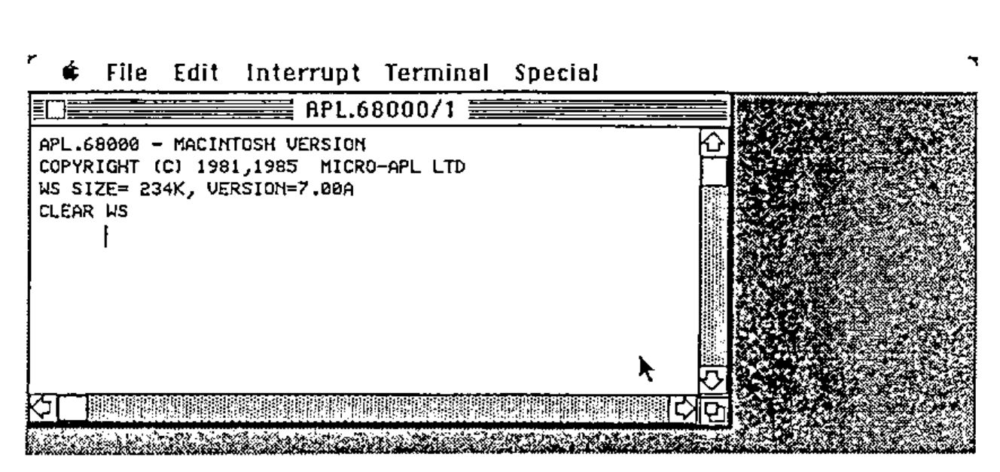
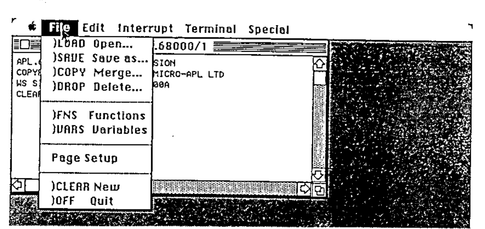
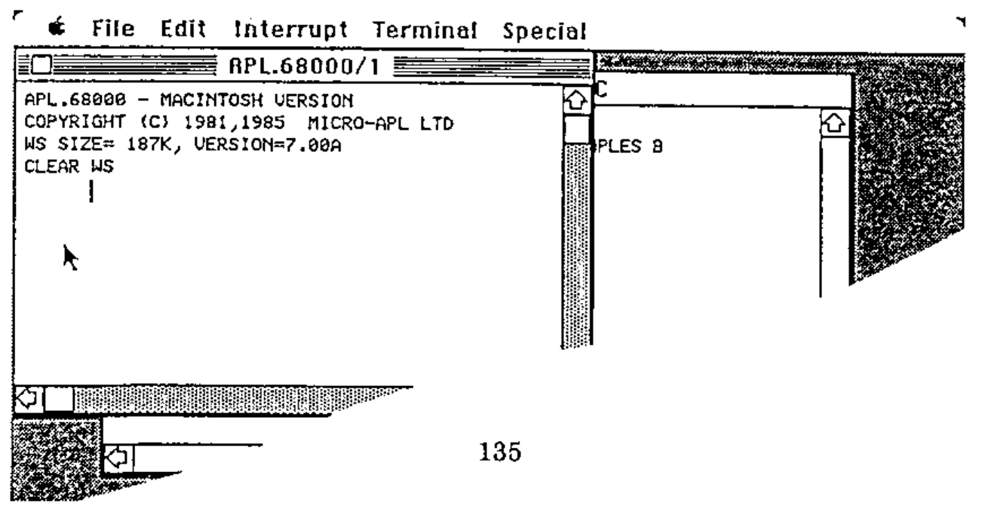
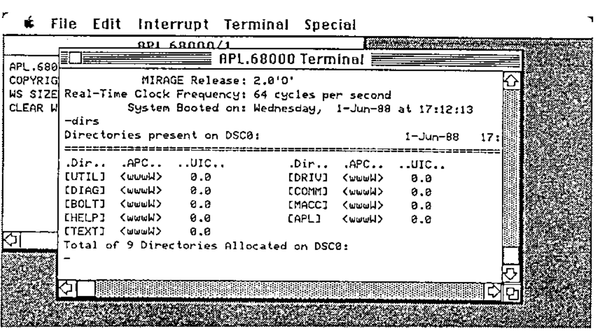
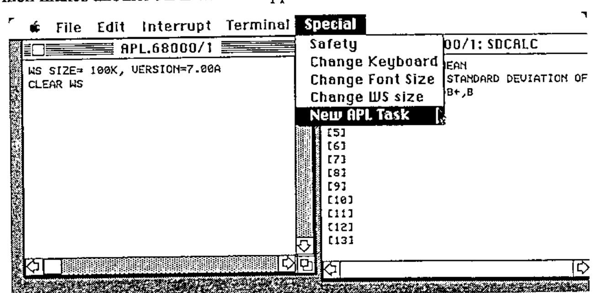
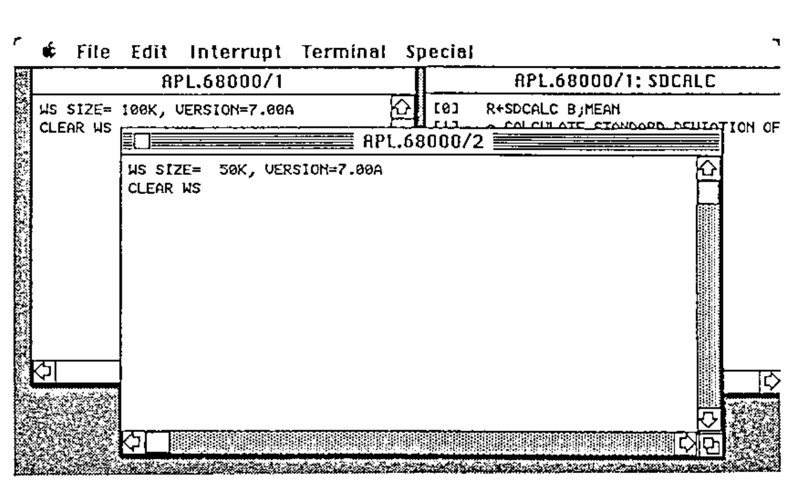

by Richard Nabavi, MicroAPL Ltd
{ .byline }

As computers have evolved since APL was first implemented in the sixties, APL interpreter writers have developed the human interface to APL in line with the hardware and systems software available to them. Whilst modern APLs still include features which were originally designed for the old IBM 2741 printing terminals, users are now more likely to rely on sophisticated full-screen editors and session managers than to employ exclusively the old del editor and line-by-line editing of the early systems.

However, it is still true today that programming in APL is done mainly using tools which are based on VDUs or PC screens which typically have about 25 lines and 80 or 132 columns, with a ‘modal’ interaction where the system presents a single-tasking interface to the user. In these systems, you are perhaps either editing a function, or in desk-calculator mode, or are running a program, and you have to finish one thing before switching mode to do something else. But more up-to-date computers such as the Apple Macintosh have the capability to offer much more sophisticated and flexible user interfaces, and APL has to adapt if it is to take advantage of the increased capabilities which are today on offer.

For the past couple of years, MicroAPL has been working on versions of APL which do employ the conventions and exploit the power of the latest generation of powerful micro-computers. Our first product based on this was APL.68000 for the Apple Macintosh, and this was followed by implementations for the Atari ST and the Commodore Amiga. Not surprisingly, when you have do something three times, you learn quite a lot along the way, and we felt that our Amiga implementation of APL was considerably better than our initial Macintosh version. We have therefore gone back and re-written a considerable part of the user interface of the Macintosh version of APL.68000, and this article is designed to share some of the insights which we believe we have gained in this iterative development process.

Unlike a conventional computer terminal, a Macintosh task displays results to the user within a window, such as this one:

The row of names at the top (the “Menu bar”) is used, in conjunction with a mouse, to control the environment. More of that later. The window itself consists of a central area where text and graphics are displayed, a title (here “APL.68000/1”) and a number of controls. These include the “Close box” in the top left of the window, the Scroll bars along the bottom and right-hand edges of the window, and the Size box which is at the bottom right-hand corner.

A Macintosh window can be regarded conceptually as a view of part of a larger logical area of text and graphics. By dragging the Size box with the mouse, you can increase or decrease the window size, thus revealing more or less of the data underneath. Using the Scroll bars, you can move the window over the data. Thus, APL.68000’s initial output (as shown in the above example) appears in a Macintosh window, where the user can scroll backwards and forwards, as well as horizontally, to view the results which APL has displayed.

As well as controlling the window itself, the user can use the mouse to open up Menu options in the Menu bar:

Here we show the File Menu, which allows familiar system commands such as )SAVE and )LOAD to be perfomed with much less typing effort than APLers are used to. If you select the )LOAD menu item, a special dialog box (a particular kind of window) will appear, prompting you with a display of available workspaces. Although people who are unused to using a mouse take a little while to get used to it, most people find that (at least for this kind of selection), it is very fast and convenient indeed – a couple of clicks is all that is needed to load a workspace or carry out other, more unusual, commands.

Of course, the windowing environment is not really very interesting until you start having several windows on the screen. Opening a function (or variable) for editing is an obvious example:

![An editing window, APL.68000/1: SDCALC, over the session window, holding [0] R←SDCALC B;MEAN, [1] ⍝ CALCULATE STANDARD DEVIATION OF SAMPLES B, [2] MEAN←(+/B)÷⍴B←,B, [3] R←](art10006110/screen-3.png)

Here, we have used the Edit menu to open a new function called SDCALC. Notice that a new window has opened for the editing process, but the APL.68000/1 window is still there in the background. In fact, if we click the mouse on the APL.68000/1 window, it will come to the front, and we could if we liked enter any APL command:

The function SDCALC is still sitting in its window, and in fact it is very easy to use this approach to try out APL expressions in desk-calculator mode, and use the excellent Macintosh “Cut and Paste” facility to paste them into the APL function editor without re-typing. And of course you don’t need to restrict yourself to editing only one function at a time, for example if you wish to move some code from one function to another:

![Three windows: the session, SDCALC, and a new editing window APL.68000/1: MEAN holding [0] R←MEAN B, [1] ⍝ CALCULATE MEAN OF NUMBERS B, [2] R←(+/B)÷⍴B←,B](art10006110/screen-5.png)

Multiple windows are also very handy if you are communicating with a remote mainframe or super-micro computer. Using the Terminal menu, you can literally open a window on the wider world outside your Macintosh:

Naturally, you can work on your own local APL session in the APL.68000 window whilst simultaneously keeping an eye on what the mainframe is doing, perhaps keeping the Terminal window very small whilst you wait for that SQL query to complete…

## Technical digression: Getting several quarts out of one pint pot

The above description and screen shots show that the use of multiple windows allows you to appear to be doing several things simultaneously. In fact, though, the Macintosh was, until recently, a single-tasking machine. Apple have partially addressed the issue of multi-tasking with a product called MultiFinder, but the facilities provided by this are rather limited. And yet, it has always seemed to us that a single-tasking system could not really exploit the true potential of a windowing environment, and our experience of the Amiga (which is a true multi-tasking machine) confirmed how useful this is for APL. So how is it that on a single-tasking machine you can simultaneously edit several functions, execute APL expressions, and run a terminal emulation task in another window?

The answer is that, to understand the Macintosh and its competitors, you have to invert the standard view of how an application (such as an APL interpreter) runs on the machine.

In a conventional machine, such as an IBM-AT running PC-DOS, an APL interpreter would execute an expression, and then call a sub-routine to get the next line of input. That sub-routine would call the operating system to get characters from the keyboard. When the line of input was complete, the subroutine would exit and control would return to the interpreter.

In a typical Macintosh application, the main control is the “Event Loop”. The application loops round asking the operating system what “events” have occurred. Examples of events are:

- A key has been pressed
- The mouse has been clicked in a menu bar
- A disk has been inserted
- A window, belonging to the application, needs updating because the user has enlarged it, or another window has disappeared from in front of it.

Most events are associated with a window. For example, a key has been pressed, but which window is selected (ie front-most and the one which the user thinks he is working in)? According to which window it is, the key might mean a character to be sent to the remote mainframe, or a character to be inserted in a function in the full-screen editor, or a character to be assembled into an APL expression to be submitted to the APL interpreter for evaluation. In this way of looking at things, the APL interpreter is a subroutine which is called when a line of user input needs to be executed, and this is just one of the kinds of event which need to be handled.

This in fact is the logical structure used by APL.68000 on the Macintosh. Of course, it is not really that simple, and in fact event handling accounts for about a quarter of the total code size. In particular, calling the APL interpreter as a subroutine is fine, except that the user may have requested a matrix invert of a 100 by 100 array, and that takes rather a long time. Fortunately, APL periodically checks for attention (break) while is is executing, and this attention check call can be used to run through the event loop while APL is in control. Hence, the apparently “simultaneous” operation in several different windows is the result of responding many times per second to events which occur in different contexts.

## If we can multi-task, why not multi-task?

As con-men since time began have always known, if a trick works on one sucker, it will work on another sucker. And so, since we can use the event loop to achieve effective multi-tasking between APL, the editing windows, and the terminal emulator, why not use the same method to achieve multi-tasking in the sense of running several APL tasks simultaneously? By doing this, the full potential of the windowing environment is reached, in a way which transcends the limited multi-tasking support of MultiFinder. So, the Special menu now includes an item which makes another APL window appear:

The new APL task can run simultaneously with other APL tasks, and the user directs input at the task he wishes by selecting the appropriate window with the mouse:

So, with Version 7 of APL.68000, the Macintosh interface is integrated with APL to the extent that (if you have enough memory), you can have up to four APL tasks, each in its own window, and each task can have associated with it one or more editing windows (up to four in all), and in addition there might be a terminal emulation window, a dynamic map of the keyboard layout (which is user-definable), and, if that is not enough, up to ten user-defined windows defined by the APL application. The different APL tasks can share variables with each other, and can also work in background mode without a window at all (unless an error occurs, in which case a window appears to show the user the error).

Now, incidentally, you can see why the initial APL window is titled “APL.68000/1”, and also why editing windows have the APL.68000 task number as well as the object name in the title. Otherwise, it does get very confusing!

## And the rest of the interface…

I have concentrated above on APL’s use of windows on the Macintosh, but there is a lot more which I do not have space to elaborate on. This includes changing font sizes, user-defined dialog and alert boxes, the Quickdraw interface, cutting and pasting with other (non-APL) applications, and implementation of the sound synthesizer (it was a fine moment when Bach’s *Crab Canon*, downloaded from an Amiga, was first heard on the Macintosh – see *Vector* Vol 1 No. 4. P60). Above all, perhaps, there is the complex and interesting problem of how you allow APL applications to take advantage of all these features, whilst APL.68000 itself is in control of the machine. But that forms the subject of another paper – which will be presented at APL-Ication in September.
