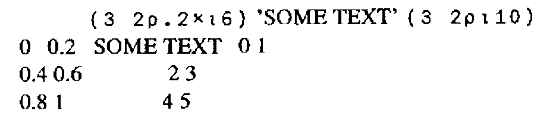

*by Richard Nabavi*
{ .byline }

The mechanical typewriter has had a significant impact on computing. The QWERTY keyboard, which is the most frequently-used input device for computers of all kinds, is a throwback to the ergonomics of early touch-typing. More significant, however, has been the impact of the typewriter on font design.

By its nature, the typewriter is a fixed-font device. Every character takes up the same width on the page, and every line height is multiple of a fixed base. For the first three or four decades of the history of digital computers, the same restrictions applied to almost all output devices connected to those computers; early printers were in fact modified electric typewriters, and the same restrictions were carried over not only to line printers, but even to video displays.

Nowadays, of course, we have more sophisticated output devices which do not suffer from these restrictions. Although daisy-wheel printers in the Seventies had some proportional font capabilities, it is only recently that it has become economical to print a full range of fonts on a page. Modern desktop laser printers can handle a wide variety of fonts and effects, and these include proper proportional fonts in a wide variety of sizes and types.

At this moment, it remains the case that most computer screens still display fixed-size characters. This is true of most PC-based systems, as well as most terminals connected to mainframes and minis. But this is rapidly changing - the success of the Macintosh, and the increasing acceptance of graphically-based interfaces both on PCs (e.g. Windows and Presentation Manager) and on multi-user systems under Unix, has begun to make a significant impact on the market. With this impact comes the realisation that things have to be done differently in a non-fixed-font world.

The ubiquity of the typewriter for most of the twentieth century, and the years of fixed-font output from computers, have obscured the fact that fixed-size fonts are very unnatural. Until the typewriter came along, virtually all written material would use variable fonts, be they hand-written or printed. Newspapers, books, magazines are always printed using proportional fonts, except for a few amateur or semi-amateur publications where the typewriter is used to save production costs.

## How Word Processing has Coped

The move to use proportional fonts, and fonts of variable size, has of course first impacted word-processing software. In fact, the impact has been slower than might have been expected; it is often amusing to see how secretaries react to powerful word-processing systems which can output to laser printers. All too often, the first thing they do is select Courier 10, and never use more readable fonts. At college, secretaries are still taught to count spaces and lines to lay out pages. It is symptomatic that the Hewlett Packard LaserJet - for some years the leading desktop laser printer - was originally sold only with fixed-size Courier fonts, despite the intrinsic capabilities of the technology.

All the same, the change has now occurred. Take, for example, WordPerfect, one of the most widely used PC word processing packages. Until Version 4.2, the software was still based on lines and columns, but so many facilities had been put into the software to vary font sizes and to handle proportional fonts, that it became clear that the approach would have to be changed. Specifying margins in columns, for example, is a nonsense even with a single size of proportional font, but it becomes quite absurd when there are four different font sizes on a page. As a result, WordPerfect Version 5 radically changed the approach used; margins were expressed in inches or centimetres, as were tab settings and all of the other dimensions used in the software. Other word-processing software packages have had to alter in similar ways - nothing else makes any sense.

But not just word-processing is affected. Modern spreadsheet packages now include powerful font-handling capabilities. There is an increasing demand for database software which can directly produce high-quality reports which take advantage of laser-printer features. Increasingly, if a software product outputs text, it needs to handle fonts. The legacy of the typewriter is receding - at last.

## And what about APL?

APL, it is often said, is a notation first, and a programming language second. One of its strengths is that it is therefore not restricted by the limitations of particular hardware architectures. It does not, for example, suffer from the Pascal ‘strings are limited to 255 characters’ syndrome.

Whether APL is regarded as a notation or as a programming language, one thing is clear - its design should not be influenced by the mechanical limitations of the typewriter carriage mechanism. Yet that is precisely what has happened! The original implementations of APL were expecting to output to a 2741 golfball device (i.e. a modified electric typewriter). We have become so used to fixed-size APL fonts that we have failed to notice how deeply the assumption that all characters have the same width has permeated the design of the language. There are four areas which are affected:

- Default output rules
- Monadic format
- Dyadic format, and other formatting features such as `⎕FMT` and format-by-example
- Data structures

## Default Output Rules

Here is a typical example of how APL2 formats an array.

```apl
      (3 2⍴.2×⍳6) 'SOME TEXT' (3 2⍴⍳10)

 0    0.2    SOME TEXT   0 1
 0.4  0.6                2 3
 0.8  1                  4 5
```

User input, of course, is indented six spaces. The nested array includes a leading space, and columns are lined up according to well-defined rules.

Let us re-display the same text in a typical "real-world" font, Times Roman (the font most commonly available on most laser printers):



Even with this simple example, it is clear that we cannot just apply APL2’s default display rules and expect a comprehensible result. And yet, there does not seem any intrinsic reason why APL should need fixed-width fonts.

Let us look a little more closely at what the APL2 display rules are intended to achieve. Clearly, the aim is to give some order to the placement of sub-arrays on the page, so that columns line up. This is achieved by inserting the correct number of spaces into the text between the elements on each line. On a non-fixed-width font, this results in the effect shown above, which will be familiar to anyone who has used a word-processing package to edit text which includes tables of data which use spaces to achieve the lining up. The solution, in the word-processing case, is to use tabs (expressed in centimetres or inches) to line up columns. (The problem is simplified for those fonts which have a fixed width for the digits 0 to 9.)

Suppose, then, that an APL2-like interpreter was designed as follows. Instead of counting the characters in each part of an array, and padding out the sub-arrays with spaces, it would measure the space taken up by each part of an array (in centimetres or some other absolute unit), and use this to work out the spacings needed as an absolute distance. On the Macintosh, for example, this would involve calling the stringwidth system call, which returns the width in graphics units of a given string in the current font.

A multiple of a fixed distance (I call it the offset distance) would need to be added between arrays to correspond to APL2’s addition of extra spaces between sub-arrays according to the rank of adjacent items and other factors. Such an APL interpreter would be upwards-compatible with the existing APL2 rules. For, if the current font were a fixed-width APL font, the distances calculated would all be multiples of the fixed width, and provided the offset distance was equal to the fixed character width, the output would look identical to current APL2 output.

At least, the above is partially true. But consider printing width (`⎕PW`). Just as Word Perfect needed to move away from expressing margins as multiples of a fixed-character width, so `⎕PW` in its current form only has a meaning as long as there is a single fixed width font to be considered. In the new world of non-typewriter-like interfaces, display widths should to be expressed in centimetres or inches.

## Monadic Format

So far, the above discussion has not touched on the APL language definition in any significant way. Changing the default output rules to handle non-fixed fonts is a cosmetic change (albeit an important one). But what about monadic format?

The IBM APL2 *Programming Reference Manual* says that monadic format ‘creates a simple character array whose appearance is the same as the display of [the right argument] (if `⎕PW` is set sufficiently wide).’ It does this by following the same output rules as default display, creating a two-dimensional character array and inserting spaces as required. But this will no longer work if we make the change described above; a simple character array cannot express the lining up of columns of the source (nested) array, once we abandon fixed-width fonts.

What is needed is a monadic format which retains the structure of the original data, converting each numeric element to an enclosed text string of the format of the element. This is equivalent to format-each (`⍕¨`) for arrays of depth 2. Such a formatter would have the pleasing property that the shape of an array would not be altered by the format. It is interesting to note that such a formatter could usefully be the inverse (on arrays containing only numbers) of a modified execute primitive which worked on arrays of any shape or depth.

## Dyadic Format, ⎕FMT etc.

An even more radical re-think is necessary for the built-in formatting routines which allow a detailed specification of how text should be formatted. These include dyadic format, APL.68000’s α formatter, `⎕FMT`, and APL2’s format-by-example. Diverse as these formatters are, they all return a simple character matrix (or vector) where spaces are used to line up the columns. As we have seen, this just won’t do for the Nineties.

Since we already have so many different formatters, it is tempting to address the problem of designing something more sophisticated by ignoring the whole lot and starting again. As well as all the options which the existing formatters give, we need to be able to specify, for each ‘chunk’ of text:

- Font family (Times, Helvetica etc.)
- Font size (10 point, 12 point etc.)
- Font style (plain, bold, italic etc.)
- Justification
- Spacing
- Text orientation (e.g. left-to-right, vertical or following a curve)
- Position on the page (in cms or inches)
- Action to take if the text won’t fit (e.g. use a smaller font)

Such a formatter needs to handle changes of font within a justified paragraph.

There are tricky problems of portability and generality here, but there is another even trickier problem - what data type would such a formatter return? Or would it simply output the text, thereby losing the advantage of being able to use APL to manipulate and store the formatted result?

## Data Structures

We can now see that a simple statement of some of the formatting needs for outputting text leads inexorably to consideration of APL’s data structures. Because, if our formatter is to return a formatted array which we can manipulate using APL, then maybe we don’t need a formatter at all - maybe we need a way of associating format information with the existing text and numeric data types. You could consider this as a kind of ‘object-oriented’ formatting - each array would carry with it information which would ensure that its default-display appearance was in the correct set of fonts, styles and so on. Obviously, a set of defaults would apply if the appearance had not been defined, and these defaults might well be designed to be upwards-compatible with APL2’s display rules.

Such an approach would certainly be hierarchical in that a sub-array would inherit its format information from its parent. For example, if the text:

> The cat *sat* on the mat

were represented as a length 6 vector of vectors, then the font for the whole array would be defined once, with only the third element having the attribute ‘italic’. Thus if it were later required to display this array in a different font, this could be done by changing the font for the whole array, but the ‘italic’ attribute of the third word would be preserved, and would automatically select the italic version of the new font.

In a future article, I shall outline my suggestions for implementing this approach to formatting, but perhaps readers of Vector might like to offer their suggestions?
