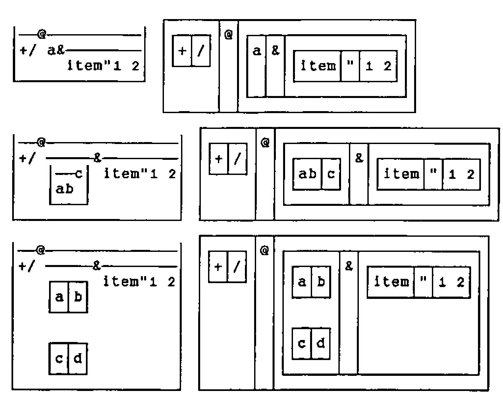
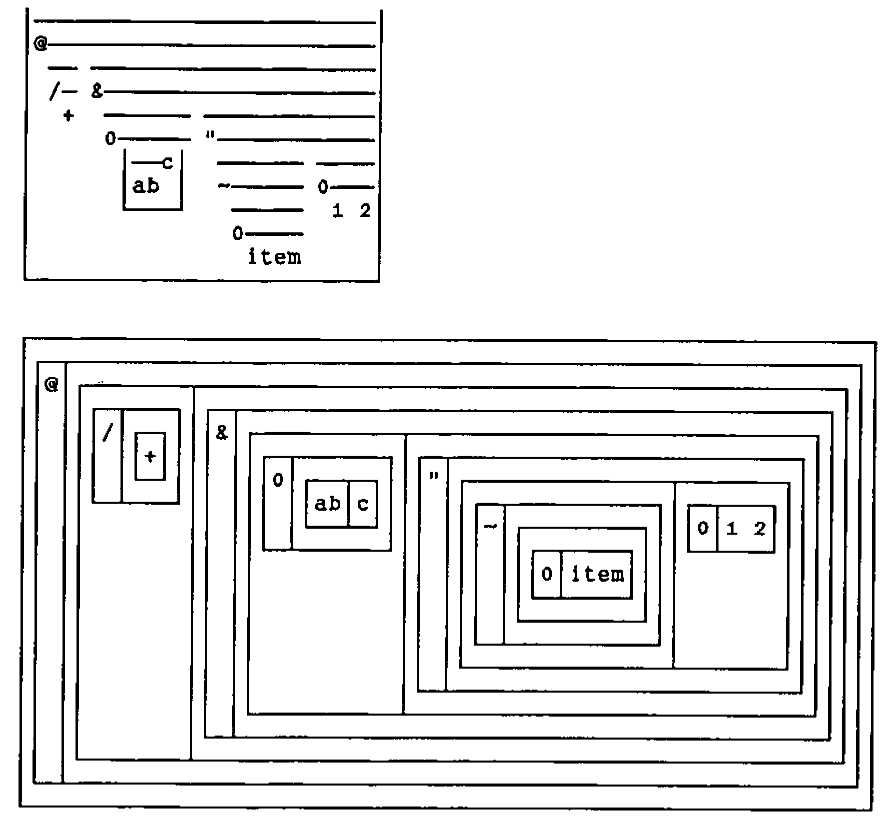
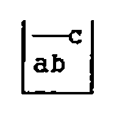

*by Richard Oates*
{ .byline }

## Abstract

Verbs appear in a figure which is conceived for nouns. It can describe any rank but the representation of a verb is a list. Verbs absorb more thought than nouns and the population is bigger. Can the spacious noun figure be deflated for the verb?

## An Initial Simplification

Omit the inner bottoms and sides, and also the tops that do not unify (span) some part of the sentence. Swap the outer bottom, sides, and top for a cup to conceal the inner structure.

## Removal of Excess Ink

Retain and make blank the side of a box which appears between two spans, or adjacent to a Minus primitive, or between two names.

![Spanned and boxed displays of a verb built from a&[, b@], minus, */ and the names cd and ef](art10006200/fig2.png)

Substitute a span and a cup for the anomalous three-box configuration of an explicit verb.

![Spanned and boxed displays of the explicit verb <@(: …) whose lines are foot=. -@#@[ {. i.@#@,@] / on=. -&2@foot / tag=. [ on} ":@<@] / x. tag y.](art10006200/fig3.png)

Spanned display representation may be more ambiguous than unspanned display representation. If display representation is spanned and atomic representation is not, the latter could serve to clarify the former. This would not inconvenience the user since the atomic representations in a failing gerund, for example, are debugged with display representation.

---

*Typesetter’s note*: Word for DOS has long had an annoying habit (probably a carry-over from FX-80 days) of substituting ordinary dashes for the horizontal line-drawing character at print-time. This is not (as far as I can see) part of any of the printer drivers, it is embedded deep in the code! Richard had awful trouble getting this to print nicely … I am not sure what the best way out is. My fix is to replace all long horizontals with the em-dash character ‘—’ and make sure the appropriate character in my PostScript font is set to draw something identical to a continuous line. Maybe Word 6.0 will fix it, but very likely it won’t, in which case I can’t offer any sensible suggestions for those of you with Laserjets. Sorry, Adrian.
{ .note }

Spans are neutral on noun lists.

Verbs are the issue. Verbs need optimum display. A tool can easily throw a tight row of spanned display representations on the screen.

![Three compact spanned displays side by side: tag ([ on} ":@<@]), on (-&2@foot) and foot (-@#@[ {. i.@#@,@])](art10006200/fig6.png)
