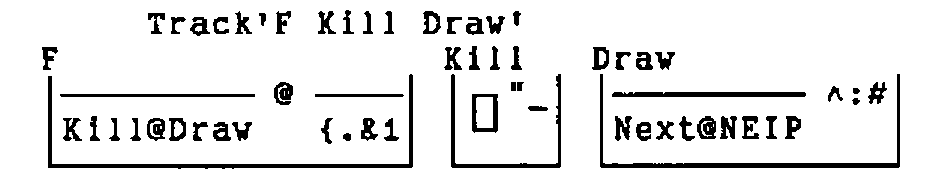
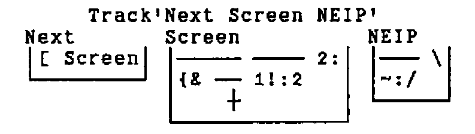
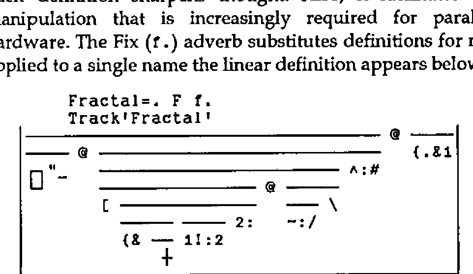

*by Richard Oates*
{ .byline }

At Christmas I sent a copy of J to a professor at Cornell College in Iowa where I went to school. I also sent this verb. It prints one line at a time like Norman Thomson’s program in Vector Vol.11 No.3 page 17.

Primitives like `+` and programs like `F` are verbs. `F` makes a square fractal.

```text
   F 16
┼┼┼┼┼┼┼┼┼┼┼┼┼┼┼┼
┼ ┼ ┼ ┼ ┼ ┼ ┼ ┼
┼┼  ┼┼  ┼┼  ┼┼
┼   ┼   ┼   ┼
┼┼┼┼    ┼┼┼┼
┼ ┼     ┼ ┼
┼┼      ┼┼
┼       ┼
┼┼┼┼┼┼┼┼
┼ ┼ ┼ ┼
┼┼  ┼┼
┼   ┼
┼┼┼┼
┼ ┼
┼┼
┼
```

Consider the sentence "She walks fast.". The adverb "fast" changes the meaning of "walk". English doesn’t need a "walkfast" verb. Consider the composition (`+/`). The Insert adverb (`/`) sticks the Plus verb (`+`) between each item of the argument. J doesn’t need a `SUM` built-in function.

```text
   +/ 1 2 3   NB. +/ changes 1 2 3 to 1+2+3
6
```

J programs can be composed of nothing but verbs. You don’t have to refer to application data. Iverson calls this "tacit definition". `F` is a tacit program. The execution sequence is mapped by `Track`. In a track map each composed subverb is pegged with a horizontal line.

```text
   F=. Kill@Draw@({.&1)
   Kill=. (1.0 0)"_
   Draw=. Next@NEIP^:#
   Next=. [ Screen
   Screen=. {&' ┼' (1!:2) 2:
   NEIP=. ~:/\
```





A verb applies to a noun on each side (like `+`) or to a noun on the right (like `F`). An adverb applies to an argument on the left (like Insert). The argument may be verb or noun. A conjunction applies to an argument on each side. The result of an adverb or conjunction is a verb. The result of a verb is a noun. Verbs, adverbs, conjunctions and nouns can all be specified with the copula (`=.`).

Atop (`@`) and Bond (`&`) are conjunctions. In `F`, Atop runs the (`Kill@Draw`) verb after or "atop" the (`{.&1`) verb. The latter is composed of Take (`{.`), Bond, and 1. Names of primitives are constructed from one or two characters. If two, the second is period (`.`) or colon. This is what (`{.&1`) does.

```text
   4 {. 1 5 0 3 2 3    NB. No composition, two arguments for {.
1 5 0 3
   4 {. 1              NB. J supplies zeroes if necessary
1 0 0 0
   {.&1 (4)            NB. Composed verb ({.&1) applied to 4
1 0 0 0
```

The argument of `F` is the argument of (`{.&1`). If the argument is 4 the result of (`{.&1`) is (`1 0 0 0`) and (`1 0 0 0`) is the argument of (`Kill@Draw`). In `Draw` the Power (`^:`) conjunction runs (`Next@NEIP`) `#` (Tally) times. The argument of `#` is (`1 0 0 0`) as is the initial argument of (`Next@NEIP`).

```text
   # 1 0 0 0
4
```

`NEIP` (`~:/\`) makes the fractal. Not Equal (`~:`) is a verb. Insert (`/`) and Prefix (`\`) are adverbs. `NEIP` applies Not Equal Insert (`~:/`) to each prefix. Prefix structures its argument as a bunch of prefixes: the first item, the first two, the first three, etc.

```text
   <\ 1 0 0 0          NB. Box (<) each prefix (\)
┌─┬───┬─────┬───────┐
│1│1 0│1 0 0│1 0 0 0│
└─┴───┴─────┴───────┘
```

This is what J does when Not Equal Insert is applied to the last prefix (`1 0 0 0`) in place of Box.

| | |
|---|---|
| insert verb | `1 ~: 0 ~: 0 ~: 0` |
| group verbs right | `1 ~: (0 ~: (0 ~: 0))` |
| `0~:0` is false | `1 ~: (0 ~:    0   )` |
| `0~:0` is false | `1 ~:       0` |
| `1~:0` is true | `1` |

The result is also 1 when Not Equal Insert is applied to any other prefix. The result of `NEIP` on (`1 0 0 0`) is (`1 1 1 1`). In `Next`, `Screen` displays `'┼┼┼┼'` for (`1 1 1 1`), but Left (`[`) returns (`1 1 1 1`) when applied to (`1 1 1 1`) and `'┼┼┼┼'`.

```text
   NEIP 1 0 0 0
1 1 1 1
   Next@NEIP 1 0 0 0
┼┼┼┼
1 1 1 1

   NEIP NEIP 1 0 0 0
1 0 1 0
   Next@NEIP Next@NEIP 1 0 0 0
┼┼┼┼
┼ ┼
1 0 1 0
   Next@NEIP ^: # 1 0 0 0
┼┼┼┼
┼ ┼
┼┼
┼
1 0 0 0
   F 4
┼┼┼┼
┼ ┼
┼┼
┼
```

A scalar verb like Minus (`-`) is applied to each item of a list. An underbar (`_`) touching a number is a negative sign, not a verb. Scalar technique is extended to all verbs with the Rank (`"`) conjunction. Rank applies a non-scalar verb to each part of its argument.

```text
   1 - 6 1.2 4
_5 _0.2 _3
   - 6 1.2 4
_6 _1.2 _4
   F"0 (2 0 4)
┼┼
┼
┼┼┼┼
┼ ┼
┼┼
┼
```

Tacit definition sharpens thought. Also, it facilitates the kind of pre-chip manipulation that is increasingly required for parallel and non-parallel hardware. The Fix (`f.`) adverb substitutes definitions for names. When `Track` is applied to a single name the linear definition appears below the map.

```text
   Fractal=. F f.
   Track'Fractal'
```



```text
(1.0 0)"_@(([ ({&' ┼' (1!:2) 2:))@(~:/\)^:#)@({.&1)
```

The right argument of many conjunctions is executed before the left. In `Fractal`, (`[ ——`) is `Next` and (`—— —— 2:`) is `Screen`. Two isolated verbs are a "hook" and three are a "fork". A fork applies the first and last verbs to its argument, and then applies the middle verb to their results. A hook applies the last verb to its argument, and then applies the first verb to its argument and to the result of the last verb.

## Vocabulary

| Verbs | | Adverbs | |
|---|---|---|---|
| `+` | Plus | `/` | Insert |
| `{.` | Take | `\` | Prefix |
| `i.` | Index of | `f.` | Fix |
| `#` | Tally | **Conjunctions** | |
| `[` | Left | `@` | Atop |
| `{` | From | `&` | Bond |
| `~:` | Not Equal | `"` | Rank |
| `2:` | Two | `"` | Constant |
| `-` | Minus | `^:` | Power |
| `<` | Box | `!:` | Foreign |
| `F` | Map fractal | **Nouns** | |
| `Kill` | Display nothing | `1` | One |
| `Draw` | Main | `0 0` | Zero zero |
| `Next` | Skip '┼' and blank | `_` | Infinity |
| `Screen` | Display as '┼' and blank | `2` | Two |
| `NEIP` | Not Equal Insert Prefix | | |
| `Fractal` | Map fractal | | |
| `Track` | Simplify boxed representation | | |

Two English words like *A* and *Ad* usually have nothing in common. Two J words like `{` and `{.` frequently do. From selects any. Take selects from the top or bottom. Rank is (`verb"noun`). Constant is (`noun"noun`). Foreign links the operating system. Write is `1!:2`. Boxed representation is `5!:2`. Underbar (`_`) is infinity only when isolated.
