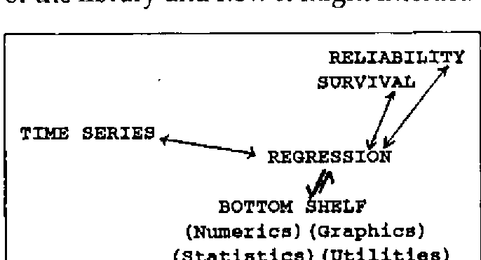
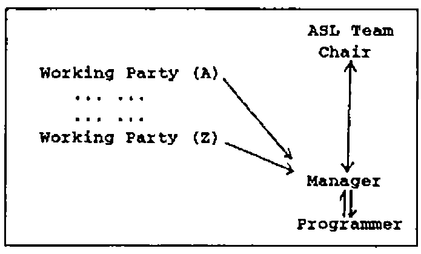

*by the ASL Team: Tony O’Hagan, Jake Ansell, Alan Sykes, David Eastwood, John Searle*
{ .byline }

## Abstract

APL has been recognised as a powerful computational aid by a number of statisticians for some time. Unfortunately they have generally had to produce their own APL code for even the standard statistical computations. This has inhibited the growth of APL within statistics. The APL Statistics Library, ASL, intends to overcome this problem by bringing together the knowledge and material already developed within the APL/Statistics Community.

The paper describes the ASL project, sponsored by the British APL Association, at its inception outlining the need and market for ASL. The paper also details the unified framework of the library and the underlying philosophy of system design and structure.

## Introduction

Over the last few years APL has gained substantial ground in statistics. An increasing number of university and polytechnic statistics departments are using APL as the medium for teaching and/or research in statistics. The list includes Birmingham, Swansea, Warwick, UCL and many others.

Whilst this progress is commendable it is realised that the battle to convert others from the standard packages to APL is likely to be more difficult. It is possible to suggest to the unconverted texts such as Anscombe [1981] or Grenander [1982], or pass them other papers/information which demonstrate the power of APL. This route, though, is not effective in marketing APL against standard statistical packages. What the user requires is the ability to compete with the packages on a level par from the start.

The gap between receiving an interpreter and being able to do useful statistical analysis has to be bridged to convince the non-APL statistical user. The APL Statistics Library, ASL, hopes to bridge that gap and hence gain the user for APL. The project is being carried out under the aegis of the APL Statistics User Group and with financial and personnel support from the British APL Association.

The goals of the project are two fold: to produce a library of statistical functions and promote the use of APL. Through the production of the library it is hoped to convince other statisticians at the research level of the power of APL, and hopefully this will overspill into teaching. The possible audience for APL through this route is large given the numbers of school and undergraduate students taking statistics courses. (Most institutions of higher education have at least one introductory course in statistics delivered to Science and Social Science Faculties.)

The paper describes the ASL project at its inception. The launch of the project took place at the ASL Workshop at Gregynog, Wales, September 1989. Most of the material presented in the paper was either finalised or arose in discussion at the workshop. Given that the ASL is still in its infancy most of the description will concentrate on the future of the project. However it is hoped that by the time of the APL 90 conference it will be possible to provide at least an interim report on the successes of the project.

## Need for ASL

Currently, having obtained an APL interpreter the statistician, whether she or he wishes to use APL for lecturing or research, has to spend time amassing her or his own library of routines. Many of the routines will be either borrowed from others, copied from the literature or written by the individual. Bringing together this material takes both time and effort but also brings with it no guarantee of good or well designed code. The continual reinvention of the wheel seems a pointless exercise.

The alternative is to purchase an APL Statistics package with the code possibly closed to inspection. Again the buyer will not necessarily know how well the software has been put together and it is likely that the underlying procedures will not be described. Another reason why this approach is unsatisfactory is that it runs contrary to the concept of using APL as opposed to other languages. Most individuals turn to APL to gain flexibility to attempt non-standard procedures.

ASL will become the alternative. The APL Statistics Library is designed to retain the flexibility of APL with the provision of a wealth of tested code. Many other attempts to produce either idioms or libraries of code have failed to take a systematic approach to the development or certification of the code. (It would be invidious to name such software.) ASL is attempting to achieve both through careful consideration of appropriate design specification and through thorough testing of produced code.

It is hoped therefore to produce software satisfying at minimum the basic requirements/needs of a statistician with well tested, even approved, software. The software has to be designed so that it is easy to build more sophisticated routines and still remain flexible. It is hoped that ASL will set the standard for APL statistical computing.

Beyond the need of an individual statistician there is a need to ease the development of statistical computing. APL is one of the few languages where it is possible to enjoy the act of programming and achieve adequate code rapidly. The language does not generally impede statistical desires as many other packages or languages do. We are not claiming it is perfect, though; there will always be new squiggles to add or greater flexibility that can be created. The language is still developing.

The outcome of using APL is the relatively rapid transformation of statistical concepts into executable statements. This aids the development of statistical computing. It is not surprising that the APL Users Group gave birth to the Royal Statistical Society’s Computational Section.

Beyond producing new algorithms the need for APL in statistical practice is almost obvious. Data analysis is necessarily exploratory. It is not a simple matter of applying a single standard analysis to the data, but trying different kinds of analysis, looking at the data in different ways, and drawing together a range of conclusions. The APL environment uniquely supports this activity.

The need is obvious. The market is large. All that is really needed is the organisation to bring it together. This has been created in the ASL project with the support of both the British APL Association and APL Statistics Users Group.

## The Basic Framework

The APL Statistics Library represents a store of information about statistics written in APL. However, to be usable this information must be stored in some accessible manner. Currently the ASL Team has decided to retain the analogue with libraries by describing the structures as shelves which contain volumes. A volume will consist of a coherent set of functions which could be released by itself, see later for examples. A shelf may consist of one or more volumes.

The bottom shelf of the library will consist of the routines of general use. These will be general utilities which will be needed throughout the libraries, some basic statistical, numerical and graphical functions. The volumes thus would be ‘utilities’, ‘numerics’, ‘statistics’ and ‘graphics’. There may be a need for other volumes on this bottom shelf. The main concepts arising out of the Workshop
about the bottom shelf are given in Appendix A. These arose following a paper given by Norman Thomson (IBM) on the Bottom Shelf. As indicated in the appendix it is already felt that the graphics volume will be split into two parts, WAGS (Warwick APL Graphics System), see O’Hagan [1990], the basic tools for graphics, and basic graphics for statistics.

On top of this bottom shelf would then be more specific shelves such as Regression and Time Series. The structure will allow the higher shelves to call on the lower shelves and they in turn may be used by other shelves. Given the development of a ‘good’ general framework it is hoped that the library will naturally grow to contain even thousands of functions. There will be no bar to any area of statistics being added to the library. Figure 1 indicates the structure of the library and how it might interact.

*Figure 1 - An Overview of the library structure.*
{ .caption }

The connections are current illustrations of what may occur.

## Implementing ASL

Having described the overview of the structure there is a need to describe in more detail the implementation of the system. Since the desire is to produce a coherent set of functions there is a need to produce a fairly rigorous control mechanism. For in addition to the problem arising from the size of the code to be developed, those contributing to the project are working for a number of institutions and organisations, and it is possible that they will be working with a range of interpreters. There are three major parts to the implementation which can be grossly described as ‘who’, ‘what’ and ‘how’.

The prime effort for the project is going to come from academic statisticians working in universities and polytechnics, with the assistance of individuals in the private and public sectors. Most of this effort is voluntarily given and represents a heavy investment by the individuals involved. To ensure that this effort is not wasted there is a need for some central body to organise the library.

At present this body consists of the ASL Team, established at ASL Workshop, see Appendix B. The ASL Team is composed of a chair (Tony O’Hagan), deputy chair (Alan Sykes), manager (Jake Ansell), British APL Association representatives (John Searle and David Eastwood) and there may in the future be other co-opted members. It has the role of attempting to organise the UK APL Statistics Community to assist with the project. Currently the community is supportive of the concept.

Since the Team cannot substitute itself for the community and there is a need for fairly rapid development/decisions, it has been accepted that working parties will play a significant role in the production of concepts, ideas and code. Figure 2 illustrates the relationships within the project.

*Figure 2 - The Project Personnel*
{ .caption }

The ASL Team role is to establish policy concerning the library. It has overall responsibility for the project, ensuring that the manager implements the policy. The team will be convened when necessary by the chair. The day to day management of the project is in the hands of the manager. The manager has the responsibility for production of the software, though it is not perceived that the manager will either write, produce specifications or designs for the code. A programmer paid for by British APL Association will write the code under the direction of the manager. The working parties will generally have responsibility for design and specification. The manager thus acts as a communication channel between the working parties, the programmer and the chair, and hence the Team.

The real success of the project therefore rests with the working parties. For it is their efforts which will define the success of the project. If the project rested solely on the Team it would take far too long to be practically useful. Fortunately most of the code for ASL already exists in some form, and will therefore only needs to be organised according to the development standards.

The contents of the library have already been partially considered. Ultimately the desire is to build a statistical library covering the wide spectrum of statistics, and which can be continually updated. However, this is into the more distant future. At the present time with the current resources of the project, and given the so far unestablished track record of the project, the initial goals have to be more limited.

It is therefore envisaged that an ‘initial’ bottom shelf will be built and fully tested within the first 6 months. More detailed comments arising out of the Gregynog Workshop about the ‘bottom shelf’ are given in Appendix A. The next stage will be the development of the regression shelf; Appendix C indicates the expected content of this shelf. These objectives are regarded as realistic within the year. More importantly the development of these will have set standards which will apply across the library. With the initial headaches resolved it is expected that other shelves will be added more rapidly.

Testing and quality will play a central role in the whole project. Hence it is expected that the mechanisms for testing will also be implemented at this early stage. A prerequisite to building any of the above will be the availability of a structure. A framework for the library has already been outlined. The structure of the library will be first priority. It is expected that ASL will follow a structure similar to one of the larger APL implementations such as the British Airways Program Filing System (PFS).

The library will contain functions not in workspaces but in component form in a file system. This will enable rapid implementation of functions as they are brought into the workspace. A linking structure will also have to be developed. Specification of such a structure will be established by the working party on standards.

The Standards group is expected to play a major role in the early stages of the project. Senior APL developers have agreed to be involved with this work. Not only will they be recommending the structure but they will attempt the near impossible task of describing ‘good’ coding conventions in APL. Some of these have already developed from contributions from Adrian Smith (Rowntrees) and Maurice Jordan (British Airways) at the ASL Workshop. An outline for the working party on standards to work from was also produced at the ASL workshop and is presented in Appendix D.

With an established structure and a set of standards it is hoped that many problems will disappear. The subsequent working parties should be able to develop specifications within the project standards. How successful this is will be quickly established since the bottom shelf and graphics working parties will be working almost in parallel with the standards group.

## The Product

Having given details of need, the framework and the implementation, this last section describes the product and some of the important related issues. Firstly it is hoped that we can never speak of the final product, for we expect that it will continue to develop almost organically on its well laid out framework. The product itself will consist of a library of statistical functions, which incorporates some basic facilities for display including graphics. It will not be a package, and there will be no attempt to develop sophisticated front ends. Commercial concerns may consider the benefit of producing such under licence to the ASL project.

The library will appear in a number of forms. It is hoped it will be stored primarily in a published form, either as one manual plus other texts or a set of volumes relating to developed shelves. Hopefully these texts will set the standard for statistical computation in APL. It is also desired that it should be maintained in machine-readable form on disks by the British APL Association and possibly by the University of Warwick on their IBM mainframe. The
software will be freely available with only a nominal charge to cover administration and materials.

Beyond the core texts it is hoped that for both non-APL research workers and teachers there will be tutorial texts. These texts should be written to explain how ASL might be used for common statistical analyses. If these books are well fashioned and written, the power and elegance of analyses should tempt the reader to learn APL. These should attract the desired wider audience for ASL.

Since there is a desire to be independent of commercial interests the choice of interpreter has been difficult. It was finally resolved that whilst ISO APL was the only generally agreed standard, there was at least the need in statistics to take advantage of nested arrays. Therefore it was accepted ASL should be written in the intersection of as many second generation APL interpreters as possible. The standards group would attempt to describe this object in the short term before a more general standard was available. The argument which was most substantial in favour of this move was that there was a need to look forward into the future market of the product. It was however felt that where ISO APL could be sensibly used this should be retained as the coding medium. It is also the intention where possible to provide support for as large a range as possible of interpreters.

## APL 90

The first test of the success of this project will be the paper presented at the conference. If the paper is still speculation then we have failed. It is hoped that by the conference we will be delivering some part of the project in a tangible form. Look forward to our being proved correct!

## References

Anscombe, FJ, [1981], *‘Computing in statistical science through APL’*, Springer, New York.

Grenander, [1982], *‘Mathematical experiments on the computer’*, Academic Press, New York.

O’Hagan, A, [1990], *‘WAGS’*, to appear.

Thomson, N, [1989], *‘The Bottom Shelf’*, paper presented at ASL Workshop, Gregynog, Newton, Wales.

## Appendix A: The Bottom Shelf/Graphics

1. The bottom shelf would contain initially a set of Statistics and Graphics function with sufficient associated functions to ensure the shelf/library is usable.
2. The Statistics functions would be sufficient to cover the material in an introductory course to statistics at UK ‘A’ level and first year undergraduate standard. This will include functions described in Norman Thomson’s ‘The Bottom Shelf’ and enhanced by Exploratory Data Analysis functions.
3. Other statistical functions which appear in more than one of the higher shelves will also be added to the bottom shelf subsequently.
4. The graphics functions will be split into two parts: WAGS (Warwick APL Graphics System) basic graphical routines, O’Hagan [1990]; and routines to produce standard statistical graphics for material in 2 above.
5. There will be a need for Numerical Analytic functions as well as Data Manipulation and general Utilities. Some of have already appeared in Thomson’s ‘The Bottom Shelf’.
6. By necessity alternative versions of some of the functions will be required. It will be the responsibility of those managing the project to resolve any problems arising in following the good practice evolved by the standards group.

## Appendix B: Management Workshop

1. ASL should be independent of commercial interests, and the ASL functions should be made freely available with only a nominal charge to cover administration and materials.
2. Sponsorship of the initial development would be on the basis of neutrality. Only for the development of specialist packaged products would sponsorship be sought. For example sponsorship might be sought for APL2 developments of ASL.
3. The ASL is expected to be a most useful resource for statisticians already familiar with APL. ‘Packaging’ ASL with a user friendly interface would not be useful to such an audience, it may even be an impediment to realising the power and flexibility of APL. Reaching a wider audience, unfamiliar with APL, will require a tutorial text explaining how to use ASL for common statistical analyses. If the book is well written then the power and elegance of the analyses should tempt the reader to learn APL.
4. Beyond the audience of research workers and teachers there will be a need to produce more user-friendly front ends and eye-catching graphics. The production of such is not perceived as part of the ASL project. It is felt that commercial exploitation of the ASL code would be left to companies under licences from the British APL Association. Monies accruing from this activity would be used to continue the development of ASL.
5. To ensure neutrality it was recommended that ISO APL should be adopted as the standard language for the project.
6. Specification of code would be through working parties of 2 or 3 people with a single author of the specification.
7. There would be no geographic barrier to involvement in the project.

## Appendix C: Regression Shelf

1. The first priority is a simple functioning system. This system may include Generalised Linear Models, but will not be over sophisticated.
2. This system should have graphic diagnostics (see graphics shelf), diagnostic statistics and basic regression statistics as far as ANOVA. Presentation of results would be limited.
3. In constructing the system some thought should be given to non-standard approaches, (Non-parametric, Ridge, Robust Regression), and to non-standard diagnostic techniques. It is doubtful though these would be included in the first release.

   A survey of APL statisticians would be carried out to find their priorities and for donation of appropriate code.
4. The need for Stepwise Regression was discussed and it was accepted that it had a high priority though no best method arose in discussion. Again a survey of views was thought to be helpful on the issue.
5. Some guidance on the workspaces from the standards group would be useful including comments on full-screen editors. Some discussion on housekeeping suggested global variables needed controlling.
6. The audience was initially accepted to be the knowledgeable user with front ends later on for those with lower level of expertise, probably within a higher shelf.

## Appendix D: Good APL Code/Practice

1. 2nd Generation APL was chosen since it reflects the future market.
2. Data Formats: There was a need to specify in-house standards. Given that the main target of the bottom shelf would be users of APL in industry and academia, clearly laid down documentation would suffice. Simple arrays should be used where possible. There should be an attempt to anticipate the data formats which would be appropriate for macros when a number of functions are glued together to provide ASL idiom.
3. Controlling the mess: The effects of ‘mess’ are controlled by discipline, which arises from management and design. Global or semi-global variables should be tolerated only if they do statistical jobs and should be documented in the workspace. Nested arrays will remove the need for some global variables.
4. Error Trapping: For bottom shelf functions, errors should result only from misuse (using parameters beyond those specified). Hence the library should cut back stack by one and signal the appropriate error message.
5. Naming convention: Functions should be named to imply their source, `AS_` or `AS∆`.
6. Index origin: Always assumed to be 1 though there is no reason why a function should not have it otherwise if `⎕IO` is local.
7. Direct definition: This should not be used.
8. APL variants: Quad or system functions should be avoided where possible. It should also be noted that there are different second generation interpretations of APL primitives.
9. Bolt-on-statistics: Where fast functions/utilities exists outside APL they can be used but APL equivalent should also be provided.
10. Data inputs/exports: There should be facilities to read rectangular databases from ASCII and LOTUS123 files into APL.
11. Documentation: Should be good and robust. A technical manager should be responsible for the initial draft. A professional technical writer might subsequently be employed. All functions need a standard documentation which covers: arguments, source algorithm, last edited date, obscure lines and user documentation to indicate the range of valid arguments. HELP facilities are regarded as part of the documentation and give examples to be used as part of the test-harness.
12. Distribution of the software: ASL will need a variety of high level library management and information tools to ensure that the software can be transferred in a user-friendly mode.
