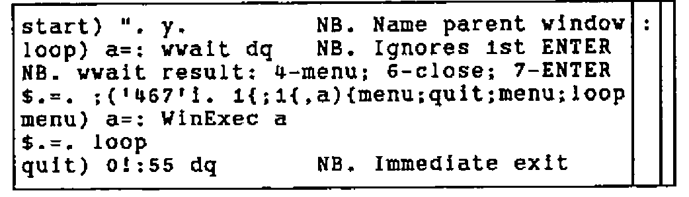
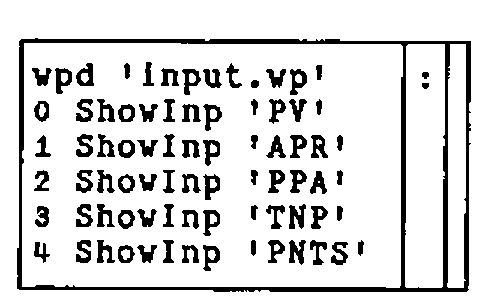
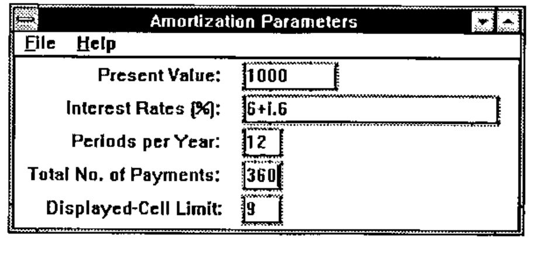
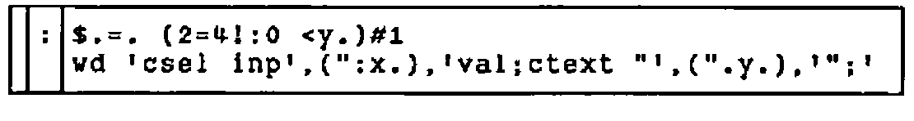
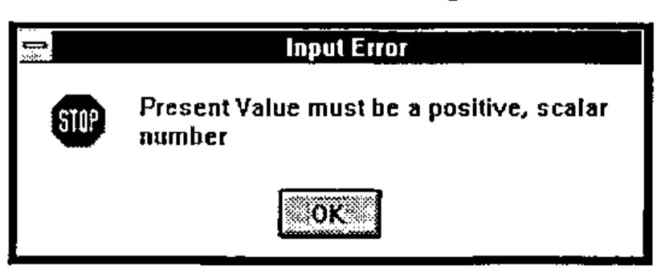
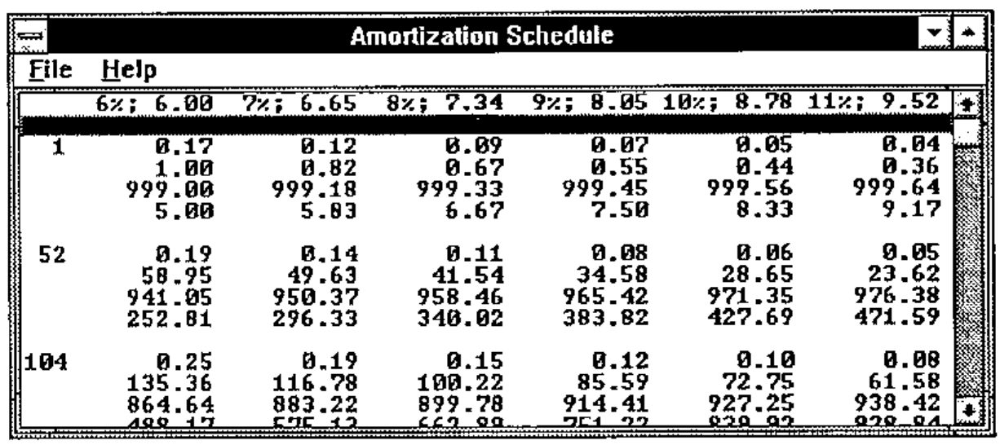

*by Thomas M. Olsen*
{ .byline }

## Abstract

A simple application for Windows is described, assuming some previous exposure to J. The message loop verbs are explained and may serve as a departure point for further development. Execution speed is compared for tacit and explicit definition of the numerically-intensive part of the program.

## Program Description

AMORTIZE was written to gain experience with the Windows version of J and to provide a useful but simple demonstration of utility: people often borrow money or consider an annuity. The program produces an amortization schedule for a specified present value and total number of fixed payments. Multiple values of compound interest are allowed. In Windows fashion, it has an *About Box*, appropriate *Message Boxes*, and *User Help*.

The program is implemented as script files, for easy inspection and editing by the reader, and can be downloaded from CompuServe (GO CODEPORT, Library 3 (C Language), filename AMORTIZE.ZIP; PKUNZIP d-option). At the expense of brevity and with administration overhead, but consistent with object orientation, defined vocabulary could instead be encapsulated by saving locally (`[x] 2!:2 y`) and copying in when needed. Where practical, J sentences appear both tacitly and explicitly.

## Message Loop

The script in Fig. 1 is run silently (`0!:3 y`) from J to start the application. If the interpreter would accept a command at invocation, this could be attached to a custom icon, via the Windows Properties feature. A double click on the icon would then suffice to start the program.

To understand the verbs `WinExec` and `WinRet` in Fig. 1, consider a typical n by 2 array returned by the `wait` command. See Fig. 2. Row zero indicates ENTER was pushed; row one the parent window, row two the menu item or child window. If the Windows program, or subprogram, has no wait command, the result is:

```text
┌─────┬────────┐
│*type│2 nowait│
└─────┴────────┘
```

Here and in Fig. 2, a `*` indicates a system result. When given the n by 2 array, the verb `WinExec` extracts the name of the menu item or child window and executes, with null argument dq (double quote), a verb by that name. Any remaining 1-cells (rows) of the n by 2 array from wait are ignored until later. See Fig. 3.

```text
NB. c:\j\amortize\amortize.js
NB. Amortization Schedule. TMO   7 June 1993
NB. J PC386 Vers 6.1.0 was used for Windows 3.1 application
NB. Interpreter: ISI/33 Major Street/Toronto, ONT  M5S 2K9/Canada
NB. Initialize to application vocabulary:
     dir=. 'amortize\'
0!:3 <dir,'initial.js'                       NB. See Appendix A
NB. Execute "child name" from Wait:
 WinExec=. ".@(,&dq@(;@({.@(2 1&}.@])))))   NB. ".dq,;{. 2 1 }. y.
NB. Respond to menu select, ENTER, and ALT F4.
NB. '$.=. 0' is not equivalent to '$.=. start'
NB. A message box doesn't need a wait loop.
       m=. 'start) ". y.                  NB. Name parent window'
       m=. m;'loop) a=: wwait dq          NB. Ignores 1st ENTER'
       m=. m,<'NB. wwait result: 4-menu; 6-close; 7-ENTER'
       m=. m,<'$.=. ;(''467''i. 1{;1{,a){menu;quit;menu;loop'
       m=. m,'menu) a=: WinExec a';'$.=. loop'
       m=. m,<'quit) 0!:55 dq                 NB. Immediate exit'
  WinRet=. m : ''
WinRet 'wpd ''main.wp'' '                    NB. Open parent window
```

Fig. 1. Main script including message loop verbs.
{ .caption }

| | |
|---|---|
| `*type` | `7 enter` |
| `*parent` | `amortization parameters` |
| `*id` | `inp3val` |
| `inp0val` | `1000` |
| `inp1val` | `6+i.6` |
| `inp2val` | `12` |
| `inp3val` | `360` |
| `inp4val` | `9` |

Fig. 2. Typical array returned by wait command.
{ .caption }

![The boxed display of WinExec: ". @ applied to a nest of boxes holding , & dq, then ; @, then {. @, then 2 1 & }. with @ ]](art10006290/fig3.png)

Fig. 3. The J-verb *WinExec*.
{ .caption }

`WinRet` (from Fig. 1) is the message loop:



## Parent and Child Windows

When AMORTIZE is launched via the last line in Fig. 1, `WinRet 'wpd ''main.wp'' '`, the `start)` sentence executes a Windows program:

```text
rem c:\j\amortize\main.wp;
pc Amortize;
menupop "&File";
     menu main_file0 "&Enter Input"; menu main_file1 "&Quit";
     menupopz;
menupop "&Help";
     menu main_help0 "&About Amortize";
     menupopz;
pmove 6 15 300 200;
pshow;
```

where two menu commands map three menu items to corresponding J verbs in Appendix B; J locative names here and in Appendix B correspond to the three parent windows in AMORTIZE: **main**, **input**, and **output**. Here, **main** has the alias "Amortize". There is no wait command in `main.wp` and control returns to the J-interpreter; `WinRet` rests at the `loop)` sentence `wwait` command.

Assume the user now selects "Enter Input" from the popup menu, so the WinRet `menu)` sentence executes `main_file0`:



where the first sentence opens the `input` window, defined in Appendix C under the alias "Amortization Parameters", with its own popup menu items. Corresponding J-verbs for `input.vp` are defined in Appendices A and B. This parent window, `input`, uses two child windows for each input noun, one for a static descriptive label and the other for an edit box:



Fig. 4. Input window with data.
{ .caption }

The first four default values in Fig. 4 would only appear if the user had entered them during the current session. J sentences can be used here for compact specification of input. Remaining sentences shown above for `main_file0` display these default nouns via the verb `ShowInp`. Appendix D defines it:



where the suite `$.` is null unless the noun exists. The second sentence focuses on the corresponding child edit window and writes the formatted value. Finally, since `main_file0` has no wait command, control again returns to the `loop)` sentence of `WinRet`.

## Input Validation and Error Messages

Pushing ENTER in the window shown in Fig. 4 returns the 8 by 2 array shown in Fig. 2. The cursor could have been in any of the five child windows, `inp0val` thru `inp4val`, but the corresponding J-verbs are all synonymous with `InpEval`. See Appendix B and the definition of `InpEval` in Appendix D. `WinRet` passes the 8 by 2 array to `WinExec`, which executes `InpEval`:


where the supporting verbs are again defined in Appendix D. In brief, the five sentences which conditionally redefine the suite `$.` each extract an input value and test it. The second sentence in `ExecChk` guarantees a result by returning the left argument of `".` on syntax errors:


`FieldMsg` opens an appropriate error message box:


where the two child commands select the offending field and move the cursor to it, respectively. The various message definitions are shown in Appendix E.

The user must respond to the message box:



## Output Display

If the amortization parameters pass all tests, `InpEval` proceeds to calculate and display a schedule:

```text
ok) WinRet ' ''calsched.js'' Output ''SCHED'' '
```

where the verb `Output` defined in Appendix D is:

![The boxed display of Output: NB. Left refs script to make text named in right / 0!:3 {.a=. (<dir),&.> x.;'output.wp' / wp {:a / wd ('ctext "'&,@(}.@,@(cr&,"1@(,&'";')@(".@])))) y.](art10006290/output.png)

With the `dir` defined in Fig. 1, sentence one produces two file names,

| | |
|---|---|
| `amortize\calsched.js` | `amortize\output.wp` |

and silently executes the file named by the first atom, defining a pronoun, `SCHED`. See Appendix F. Sentence two produces the output parent window, with alias "Amortization Schedule":

```text
rem c:\j\amortize\output.wp;
pc "Amortization Schedule";
menupop "&File";
          menu output_file0 "&Save";
          menu wclose "&Exit";
          menupopz;
menupop "&Help";
          menu output_help0 "&Items";
          menupopz;
xywh 0 0 267 96; cc results listbox ws_thickframe ws_hscroll
ws_vscroll; pas 0 0; pcenter; pshow;
csel results; cfoem; cfocus;
```

Here, the window style `ws_hscroll` is included but does not produce the horizontal scroll bar when needed. Sentence three of `Output` formats the result, `SCHED`, and writes it to the child window, "results":



Characteristically, the user is not limited to a single output window, but can focus on the input window (Fig. 4), change the data, and push ENTER again. Thus, multiple schedules can be compared side-by-side. However, no special code is included to detect such operation and, if <u>E</u>xit is commanded from any of the windows, including the input window, the last output window opened is the first window closed.

The amortization schedule algorithms in Appendix F are straightforward and can be illuminated by executing them individually. Students are encouraged to display the defined verbs.

## Tacit vs. Explicit Execution

The tacitly defined algorithms for SCHED were interchanged with their explicit analogues, which appear as comments in Appendix F, yielding an alternate script: `xplsched.js`, shown in Appendix G. Recall that tacit definitions in J are pre-parsed. Using the sample input of Fig. 4, average times for SCHED only, on an IBM PS/2 77 (80486DX2, 66 MHz) are:

```text
   tacit definition: 286 ms   (calsched.js)
explicit definition: 275 ms   (xplsched.js)
```

The sentence `10 (6!:2) '0!:3 <dir,''____sched.js'' '` was used to execute the two cases. The conclusion that it doesn’t really matter here is qualified by the style of programming in Appendices F and G; only four of the 22 algorithms use the defined verbs `payment`, `subset`, and `twofix`. Thus, the sentence defining Interest Factor is, e.g.:

```text
   tacit definition (App. F): IF=. I (>:@[ ^/ -@]) K
explicit definition (App. G): IF=. (>:I)^/-K
```

Moreover, the advantage of pre-parsing is masked in the example, because of the array dimensions: nine rows by six columns; parsing occurs only once for each algorithm. A slight reduction of execution time would result from reworking the tacit-definition algorithms to avoid, in Appendix F, deeply-nested right compositions and unneeded use of `@]`.

## Implementation Notes

The Codewright (Premia Software, Inc.) text editor was convenient in developing the program. J includes Windows Visual Edit (foreign conjunction `11!:1`), useful but limited to adjusting size and location of existing child windows. The multi-line message box text shown in Appendix H had to be centred left-and-right by trial and error. Hopefully, ISI or an enterprising user will eventually add a GUI development environment with toolbar icons for Windows widgets, to put J on a par with Dyalog APL/W, Visual Basic, and Visual C++.

## Documentation Notes

The editable manuscript file, not printout, for this paper was composed with Windows Write, using the Arial TrueType font. On an IBM PC, the boxed items used here for illustration were cut-and-pasted from the J window and mapped directly to the MS Line Draw font using WRITE Character. Microsoft scrupulously removed all other ASCII characters from MS Line Draw and these appear as dots. But they can be highlighted and mapped immediately into True Type Courier New font. On a given boxed item, Character must be applied to each contiguous string of common-font characters.

Inclusion of illustrations requires only the Windows Clipboard. For best contrast, select the Monochrome colour scheme for the Desktop.

## Acknowledgments

This paper resulted from the October 1992 J-Workshop given at Karsten Mfg. by Donald B. McIntyre, who through his boundless energy provided continuing inspiration and advice. Louis Solheim and Hadi Polynin enabled the project and the staff of Information Systems encouraged it. The J interpreter is a product of Iverson Software Inc.

## Appendix A — Initialization

```text
NB. c:\j\amortize\initial.js
NB. Initialize to application vocabulary:
     cr=: {. crlf=. 13 10{a.
    eof=: 26{a.
     dq=: 2#q=. ''''
   read=: 1!:1
     wd=: 11!:0
     vp=: wd@(-.&eof)@read
    wpd=: vp@(<@(dir&,@]))
  wwait=: wd@('wait; '&[)
 wclose=: wd@('pclose;' &[)
 wreset=: wd@('reset; ' &[)
NB. Define child name returned by wait command:
0!:3 <dir,'children.js'
NB. Define verbs referenced in child name from wait command.
0!:3 <dir,'chdverbs.js'
```

## Appendix B — Verbs Mapped from Menu Items

```text
NB. c:\j\amortize\children.js
NB. Child name returned by wait command points to verb:
          m=. <'wpd ''input.wp'' '
          m=. m,'0 ShowInp ''PV'' ';'1 ShowInp ''APR'' '
          m=. m,'2 ShowInp ''PPA'' ';'3 ShowInp ''TNP'' '
             m=. m,<'4 ShowInp ''PNTS'' '
  main_file0=: m : ''
  main_file1=: ('wclose dq';'0!:55 dq') : ''
  main_help0=: wpd'about.vp'&,@]
 input_help0=: wpd'parmdefs.vp'&,@]
 input_help1=: wpd'parmnavi.vp'&,@]
     inp0val=: InpEval : ''
     inp1val=: InpEval : ''
     inp2val=: InpEval : ''
     inp3val=: InpEval : ''
     inp4val=: InpEval : ''
          m=. 'fn=. <dir,''amortize.txt'' '
output_file0=: (m;'FILE_TXT 1!:2 fn') : ''   NB. Replaces old file
output_help0=: wpd'outitems.vp'&,@]
```

## Appendix C — Input-Window Definition

```text
rem c:\j\amortize\input.vp;
pc "Amortization Parameters";
menupop "&File"; menu wclose "&Exit";
                 menupopz;
menupop "&Help"; menu input_help0 "&Definitions";
                 menu input_help1 "&Navigation";
                 menupopz;
pmove 60 1 198 90;
pshow;
rem Vertical size of 10 units allows space for _ underscore:;
xywh 0 0 194 70;cc inp_background static ws_border;cn " ";
xywh 6 3 77 10;cc inp0 static ss_right;cn "Present Value:  ";
xywh 87 1 38 13;cc inp0val edit es_autohscroll ws_thickframe;cfocus;
xywh 6 16 77 10;cc inp1 static ss_right;cn "Interest Rates (%):  ";
xywh 87 14 100 13;cc inp1val edit es_autohscroll ws_thickframe;
xywh 6 29 77 10;cc inp2 static ss_right;cn "Periods per Year:  ";
xywh 87 27 17 13;cc inp2val edit ws_thickframe;
xywh 4 42 77 10;cc inp3 static ss_right;cn "Total No. of Payments:  ";
xywh 87 40 17 13;cc inp3val edit ws_thickframe;
xywh 7 55 77 10;cc inp4 static ss_right;cn "Displayed-Cell Limit:  ";
xywh 87 53 17 13;cc inp4val edit ws_thickframe;
```

## Appendix D — Verbs for Input/Output Windows

```text
NB. c:\j\amortize\chdverbs.js
NB. Define verbs referenced in child name from wait command.
NB. Display input noun if it exists:
    PNTS=: '9'                      NB. default fills output page
       m=. '$.=. (2=4!:0 <y.)#1'
       m=. m;'wd ''csel inp'',(":x.),''val;ctext "'',(".y.),''";'' '
 ShowInp=: '' : m
NB. Report error condition:
       m=. 'wd ''csel inp'',y.,''val; cfocus; beep 3;'' '
       m=. m;'wpd ''inpmsg'',y.,''.wp'' '
FieldMsg=: m : ''
NB. Boolean zero if positive scalar:
  Scalar=: 1&=@#@,
 PlusChk=: Scalar *: (*./@(0&<))   NB. Monadic fork
NB.                                NB. (1=#,y.)*:*./0<y.
NB. Boolean zero if atoms bounded by left arg:
  LimChk=: (+./@,)@(>"1(,"0-)) NB. Verb @ dyadic hook w/monadic hook
NB.                                NB. +./, x. >"1 y.,"0 -y.
NB. Boolean zero if positive, scalar integer:
  PosInt=: *./@((=>.)*.(0&<))      NB. Monadic hook in monadic fork
  IntChk=: Scalar *: PosInt        NB. (1=#,y.)*:*./(y.=>.y.)*.0<y.
NB. Validate content of an input field:
 ExecChk=: '' : ('n=: x.';'''r=. 1'' ". ''r=. '',y.')
NB. Validate all input fields:
       m=. 'NB. ExecChk left arg sets n for err msg';'start) b=. 2 1}.a'
       m=. m,<'$.=. (4*0 ExecChk ''PlusChk '',PV=: ,>1{b)}.$.'
       m=. m,<'$.=. (3*1 ExecChk ''0 _100 LimChk '',APR=: ,>2{b)}.$.'
       m=. m,<'$.=. (2*2 ExecChk ''IntChk '',PPA=: ,>3{b)}.$.'
       m=. m,<'$.=. ;(3 ExecChk ''IntChk '',TNP=: ,>4{b)}.$.'
       m=. m,<'$.=. ;(4 ExecChk ''3>'',PNTS=: ,>5{b){ok;error'
       m=. m,'error) a=. WinRet ''FieldMsg '',q,(":n),q';'$.=. start'
       m=. m,<'ok) WinRet '' ''''calsched.js'''' Output ''''SCHED'''' ''
'
 InpEval=: m : ''
NB. Open parent window for output and format the text:
       m=. <'NB. Left refs script to make text named in right'
       m=. m,'0!:3 {.a=. (<dir),&.> x.;''output.wp'' ';'wp {:a'
       m=. m,<'wd (''ctext "''&,@(}.@,@(cr&,"1@(,&''";'')@(".@])))) y.'
  Output=: '' : m
```

## Appendix E — Error Message Programs

```text
rem c:\j\amortize\inpmsg0.vp;
mb "Input Error" "Present Value must be a positive, scalar number"
mb_iconstop;
rem c:\j\amortize\inpmsg1.vp;
mb "Input Error" "Rates must lie between zero and 100"
mb_iconstop;
rem c:\j\amortize\inpmsg2.vp;
mb "Input Error" "Periods per Year must be a positive, scalar integer"
mb_iconstop;
rem c:\j\amortize\inpmsg3.vp;
mb "Input Error" "No. of Payments must be a positive, scalar integer"
mb_iconstop;
rem c:\j\amortize\inpmsg4.vp;
mb "Input Error" "Displayed-Cell Limit must exceed two"
mb_iconstop;
```

## Appendix F — Mostly Tacit Algorithms for Amortization Schedule

```text
NB. c:\j\amortize\calsched.js
NB. Numerical values:
A=. ". &.> PV;APR;PPA;TNP;PNTS
NB. Interest each period:
I=. 0.01&*,@(%&>/@(1 2&{@]))A          NB. 0.01*,%&>/1 2{y.
NB. Fixed payment from present value, interest per period, and periods:
payment=.  ({.@]) *&> [ % -.@(>:@[ ^ -&>@(3&{@]))
PMT=. I payment A                       NB. ({.y.)*&>x.%-.(>:x.)^-&>3{y.
NB. First, last, and sufficient intermediate periods for display:
subset=. /:~@~.@(<:@[ , 1&,@([ <. ([ >.@% ]) * (>:@(i.@]))))
NB.                                     NB.
/:~@~.(<:x.),1,x.<.(x.>.@%y.)*>:i.y.
NB. Right arg limits number of amortization points:
K=. (>@(3&{) A) subset _2&+>(4&{A)   NB. (>3{A) subset _2+>4{A
NB. Interest factor:
IF=. I (>:@[ ^/ -@]) K                 NB. (>:I)^/-K
NB. Balance after K payments:
BAL=. |:IF%~({.A)+&>PMT*I%~<:IF
NB. Payment between amortization points K:
twofix=. 2&(+\)@]
PAY=. A (-/"2@twofix@(>&{.@[,])) BAL  NB. -/"2 twofix(>&{.A),BAL
NB. Cumulative payment against principal:
PAID=. +/"2@(+\@]) PAY                 NB. +/"2 +\PAY
NB. Cumulative interest on principal:
INT=. PAID-~K*/PMT
NB. Fraction of payment to principal:
FPTP=. PAY%PMT ([ */~ 1&,@(-@(-/"1@twofix@]))) K
NB.                             NB. PAY%PMT*/~1,--/"1 twofix K
NB. Width of formatted result columns:
B=. FPTP,. PAID,. BAL,:"1 INT
v1=. 6.2&+@(>.@(10&^.@(>./@(;@])))) B NB. 6.2+>.10^.>./;B
NB. Width of formatted payment number:
C=. 4&({."2)@(":@(,."_1@(,.@]))) K    NB. 4{."2 ":,."_1,. K
v2=. 2&{@($@]) C                       NB. 2{$y.
NB. Interest rate formatted for column headings:
D=. '%; '&(,"1~)@(":&,.@(>&(1&{)@]))A NB. '%; ',"1~":,.>1{A
NB. Payment formatted for column headings:
E=. 0.2&(":"0)@] PMT                   NB. 0.2":"0 PMT
NB. Width of column headings:
v3=. 1{$ F=. ' ',"1 D ,"1 E
v1=. v1+0>.v3-<.v1

NB. Payment number and payment cells:
G=. C,"1 v1":B
NB. Table header, right-justified:
H=. (-2{$G){.&,(-v3>.<.v1){."1 F
NB. Table for list box:
SCHED=: H ([,' '&,@(,/@(5&{."_1@]))))G NB. H,' ',,/5&{."_1 G
NB. Text ready for file save:
T=. 'Schedule for Amortizing ',PV,' under Compound Interest',crlf
T=. T,'At payment on left: fptp, cum paid, balance, interest',4&$crlf
FILE_TXT=: T,2&}.@,crlf,"1 SCHED      NB. T,2}.,crlf,"1 SCHED
```

## Appendix G — Explicit Algorithms for Amortization Schedule

```text
NB. c:\j\amortize\xplsched.js
NB. Numerical values:
A=. ". &.> PV;APR;PPA;TNP;PNTS
NB. Interest each period:
I=. 0.01*,%&>/1 2{A                   NB. 0.01&*,@(%&>/@(1 2&{@]))
NB. Fixed payment from present value, interest per period, and periods:
payment=. '' : '({.y.)*&>x.%-.(>:x.)^-&>3{y.'
PMT=. I payment A                      NB. ({.@])*&>[%-.@(>:@[^-&>@(3&{@]))
NB. First, last, and sufficient intermediate periods for display:
subset=. '' : '/:~~.(<:x.),1,x.<.(x.>.@%y.)*>:i.y.'
NB. /:~@~.@(<:@[,1&,@([<.([>.@% ])*(>:@(i.@]))))
NB. Right arg limits number of amortization points:
K=. (>3{A) subset _2+>4{A              NB. (>@(3&{) A) subset _2&+>(4&{A)
NB. Interest factor:
IF=. (>:I)^/-K                         NB. I (>:@[ ^/ -@]) K
NB. Balance after K payments:
BAL=. |:IF%~({.A)+&>PMT*I%~<:IF
NB. Payment between amortization points K:
twofix=. '2(+\)y.' : ''                NB. 2&(+\)@]
PAY=. -/"2 twofix(>&{.A),BAL          NB. A (-/"2@twofix@(>&{.@[,])) BAL
NB. Cumulative payment against principal:
PAID=. +/"2 +\PAY                      NB. +/"2@(+\@]) PAY

NB. Cumulative interest on principal:
INT=. PAID-~K*/PMT
NB. Fraction of payment to principal:
FPTP=. PAY%PMT*/~1,--/"1 twofix K   NB. PAY%PMT([*/~1&,@(-@(-
/"1@twofix@])))K
NB. Width of formatted result columns:
B=. FPTP,. PAID,. BAL,:"1 INT
v1=. 6.2+>.10^.>./;B                   NB. 6.2&+@(>.@(10&^.@(>./@(;@]))))B
NB. Width of formatted payment number:
C=. 4{."2 ":,."_1,. K                  NB. 4&({."2)@(":@(,."_1@(,.@]))) K
v2=. 2{$C                              NB. 2&{@($@]) C
NB. Interest rate formatted for column headings:
D=. '%; ',"1~":,.>1{A                  NB. '%;
'&(,"1~)@(":&,.@(>&(1&{)@]))A
NB. Payment formatted for column headings:
E=. 0.2":"0 PMT                        NB. (0.2&(":"0)@]) PMT
NB. Width of column headings:
v3=. 1{$ F=. ' ',"1 D ,"1 E
v1=. v1+0>.v3-<.v1

NB. Payment number and payment cells:
G=. C,"1 v1":B
NB. Table header, right-justified:
H=. (-2{$G){.&,(-v3>.<.v1){."1 F
NB. Table for list box:
SCHED=: H,' ',,/5&{."_1 G             NB. H ([,' '&,@(,/@(5&{."_1@])))) G
NB. Text ready for file save:
T=. 'Schedule for Amortizing ',PV,' under Compound Interest',crlf
T=. T,'At payment on left: fptp, cum paid, balance, interest',4&$crlf
FILE_TXT=: T,2}.,crlf,"1 SCHED NB. T,2&}.@,crlf,"1 SCHED
```

## Appendix H — Help Text

```text
rem c:\j\amortize\about.vp;
mb "About Amortize" "  A schedule is displayed from your input.
Not copyrighted; not liable for your results.
                  Thomas M. Olsen
        71303.3615@compuserve.com
                 Karsten Mfg. Corp.
                     12 July 1993"
mb_iconinformation;

rem c:\j\amortize\parmdefs.vp;
mb "Parameter Definitions" "          Present Value: amount of
loan/annuity
          Interest Rates: annual percentage rate
                                  of compound interest;
                                  multiple values allowed;
                                  e.g., 6+i.7
       Periods per Year: payments per annum
   Total No. Payments: payments to retire
                                  loan/annuity
Displayed-Cell Limit: default of 9 fills one page
                                  of saved output; includes
                                  first, last, and penultimate"
mb_iconinformation;
rem c:\j\amortize\parmnavi.vp;
mb "Navigation" "Push ENTER to display amortization schedule"
mb_iconinformation;
rem c:\j\amortize\outitems.vp;
mb "Items" "     Heading: compound interest,
                     fixed payment
Left margin: payment number
   Cell items: fraction to principal,
                     cumulative paid,
                     balance,
                     cumulative interest"
mb_iconinformation;
```
