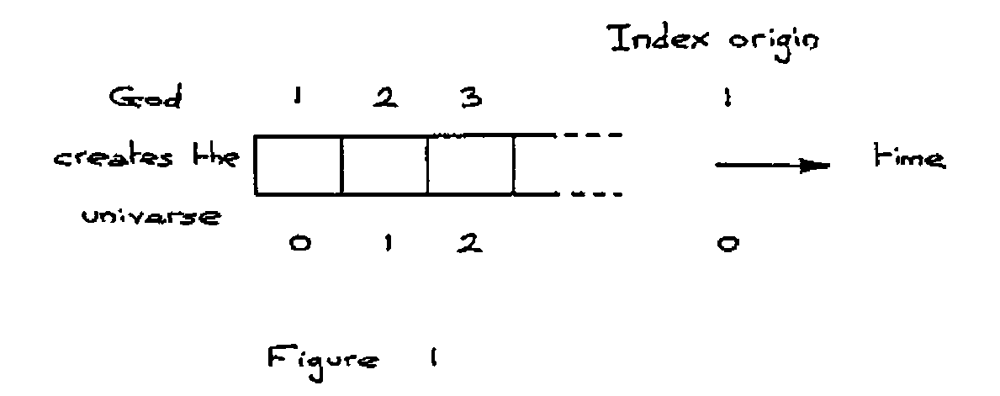
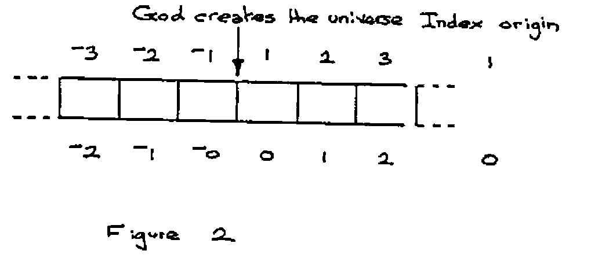
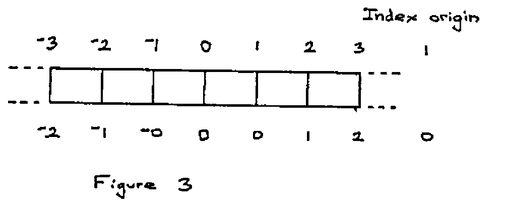

by Graham Parkhouse
{ .byline }

The question of origins in APL may be put simply as follows: “How should we index ‘A’ from the alphabet ‘ABC . . Z’? To get ‘A’, should we ask for ‘ABC’[0] or ‘ABC’[1]?” In APL we can choose which way we must ask for it by means of the index origin, quad-IO, a “system variable” which may take the value 0 or 1.

```apl
      ⎕IO←1
      ALPH←'ABCDEFGHIJKLMONPQRSTUVWXYZ'
      ALPH[1 2 3]
ABC
      ⎕IO←0
      ALPH[1 2 3]
BCD
      ALPH[0 1 2]
ABC
```

APL has an inverse indexing function, iota, index of, which works like this:

```apl
      ⎕IO
0
      ALPH⍳'ABC'
0 1 2
      ⎕IO←1
      ALPH⍳'ABC'
1 2 3
```

Iota has another meaning when it has no left hand argument; it returns the first n integers, n being specified in the right hand argument.

```apl
      ⎕IO
1
      ⍳5
1 2 3 4 5
      ⎕IO←0
      ⍳5
0 1 2 3 4
```

From this example we might say it is convenient to consider quad-IO as holding the value of the “first integer”. Is the first integer 1 or 0?

So we come to the point of forming an opinion of whether we prefer the index origin to be 1 or 0. At the November 1987 meeting of the British APL Association it was revealed by a show of hands that there was a preference in the audience for 1, though most present were prepared to use either 1 or 0 depending upon the circumstances. My experience is that computer scientists are zealous origin noughters.

The choice would probably not be given if one of the options resulted in obvious benefits; if that were so the choice would have been made for us. Iverson appears to be convinced that origin 0 is the right choice, and he makes it mandatory in Dictionary APL. There is no doubt that having a choice has many disadvantages simply because so many mistakes are made by incorrectly mixing code written for different index origins. But whether you choose 1 or 0 you will be able to do just the same computations. Some expressions turn out slightly more elegantly with one rather than the other, but such elegance is no more significant than the omission of an odd “-1” or so otherwise needed in an expression. A reason why origin nought might rightly be slightly favoured on the grounds of elegance is that “true” and “false” have been (arbitrarily) chosen as 1 and 0. Had they been chosen as 1 and 2 the situation would have been reversed.

Suppose when God created the universe he had made time discrete, and for all we know he may have done it like that. We tend to think of time as being continuous, just as we think of material that way, though we know material is generally discrete, what with the knots in the timber, the fibres in the fibreglass, and of course the molecules and the atoms in everything. If time were discrete, then life would be a three-dimensional cine film, and we would live a little jerkily from one moment to the next. Each moment would be a three-dimensional frame. Figure 1 shows two alternative ways we could number these frames.



This figure is drawn as if God created time with the universe. Suppose he didn’t. Suppose he had already created time, then we have frames before creation as well as after, and it would be natural to number the frames before creation in exactly the same way as those we have already numbered and to distinguish them from each other by a mark as shown in fihure 2.



When did God create the universe? A difficult question to answer, because he did it in between moments, so we need a numbering scheme for the divisions between moments. What numbering scheme should we choose? To preserve our symmetry we need a special name for the creation of the universe, which I shall call O (for Origin), but then the names we used for the moments can be used for the divisions as well. This is shown in figure 3.



I think I shall use index origin as 1, and argue that zero is very special, rather like infinity. Historically, zero like infinity is a late arrival on the mathematical stage. The Christian calendar is based on the origin one option of figure 2. There is no year zero. Your ancestors born in year 1 BCD had their first birthdays in 1 AD, though of course they didn’t know this at the time since the Christian calendar was not instituted until the fourth century. I could support 1 as being the first integer because integral means whole and an integer implies a whole number. But there is nothing whole about nothing, so although zero is commonly counted as an integer, it is of dubious pedigree.

It may be that you think I am prejudiced against zero. Let me assure you I am very fond of it, and only wish it its proper place. It doesn’t want to be first, not even zeroth!

Let us turn to some very simple functions that are index origin independent and see how important nothing is:

```apl
      ∇R←NUMBER OF THINGS
[1]    R ← NUMBER ⍴ THINGS ∇

      4 OF 1
1 1 1 1

      3 OF 'X'
XXX

      0 OF 'X'

```

With 0 as the left hand argument, nothing is printed, not even a space or a new line. R in function OF was assigned emptiness, another beautiful concept that Iverson included in APL. The reason I have called OF a counting function is that it shows us what our numbers mean, and introduce us to what might be called the unitary system, even more basic than the binary system, in which we can count I II III IIII IIIII . . . . Notice that the natural zero of this system is emptiness, just nothing, 0 OF ‘I’. In the unitary system we can count with just one symbol.

There is an inverse function to OF which I shall call WHAT_NUMBER_OF, which looks like this:

```apl
      ∇R ← WHAT_NUMBER_OF THINGS
[1]    R ← ⍴ THINGS ∇

      WHAT_NUMBER_OF 1 1 1 1 1
5

      WHAT_NUMBER_OF 'XXX'
3

      WHAT_NUMBER_OF ''
0
```

See that I have represented nothing by two consecutive quotes, which is reasonable enough. Another way of defining emptiness in APL is by using the function iota with zero argument, iota-0. Even though iota is generally index origin dependent, iota-0 always results in emptiness. Emptiness is very useful in APL for avoiding giving special treatment to what in other languages would be special cases.

Finally, I make a plea to everyone not to number beginning at 0. There are one or two exceptions: revision 0 is acceptable if it refers to the unrevised edition, i.e. revision 0 is not a revision. Similarly chapter 0 could possibly be a name for the contents. When counting the steps in a staircase, Richard Smith, the 4 year old son of the editor of this Vector, rightly stamps his foot on the ground with the shout of nought before counting 1, 2, 3, . . as his feet meet each of the steps. The count of nought denoted “this is not a step”; it was special, it denoted “I’m beginning to count now”.
