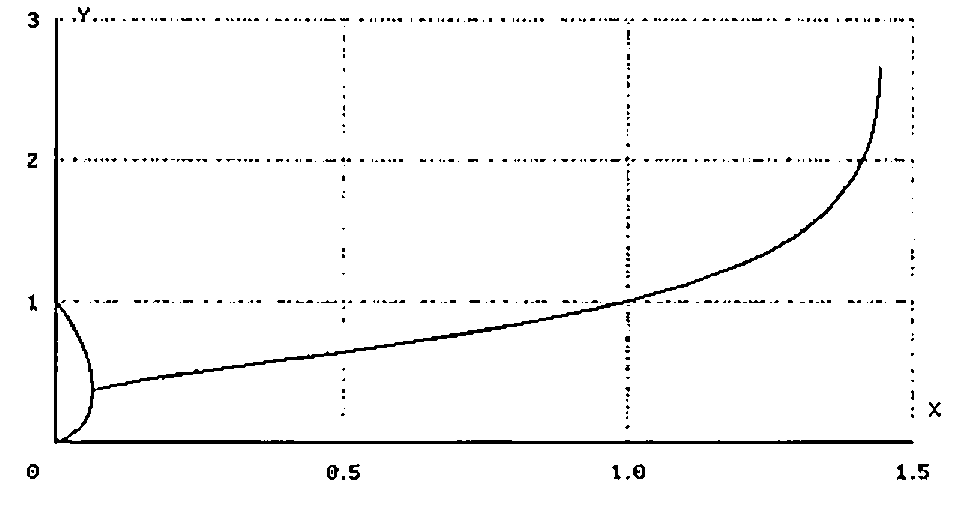
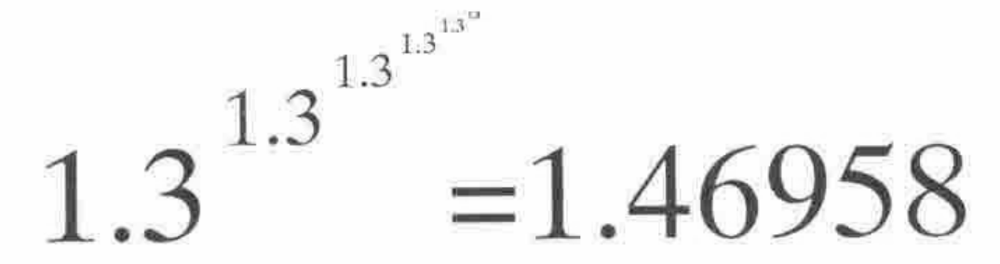

*by Graham Parkhouse*
{ .byline }

How many large numbers there are that my computer cannot represent.

```apl
      */2 2 2 2 2
DOMAIN ERROR
      */2 2 2 2 2
      ^
```

The number I could not calculate is the next in this sequence:

```apl
      *\2 2 2 2
2 4 16 65536
```

Its number of digits is:

```apl
      ⌈65536×10⍟2
19729
```

What is the number of digits in `*/6⍴2` ?

```apl
      '1E',⍕⌊19729×10⍟2
1E5939
```

The number of digits seems to escalate as quickly as the numbers themselves. Working with 10 rather than 2 gives us a clue to behaviour:

```apl
      *\10 10
10 1E10
```

An extension to the commonly used exponent notation would give the result of `*\4⍴10` as `10 1E10 1E1E10 1E1E1E10`. The number of noughts in these 4 numbers is `1 10 1E10 1E1E10`.

The numbers we encounter in the world are small by power reduction standards: even the number of atoms in the universe is currently estimated as `1E80` or `*/10 80` or `*/47.7 47.7` or `*/3⍴3.74` or `*/4⍴2.28`. Where does this progression lead?

```apl
      ⎕PP←2
      */3⍴3.74
3.5E79
      */4⍴2.28
9.4E78
      */10⍴1.543
2.9E90
      */50⍴1.44873
4.5E91
      */100⍴1.4456983
4.6E80
```

There is a hint of convergence in this sequence: as if there is some number *X* beginning 1.44… for which `*/VL⍴X` would give `1E80` for all values of *VL* that were very large. What happens if I take a slightly smaller number than 1.44… and see what effect *VL* has.

```apl
      ⎕PP←5
      *\10⍴1.3
1.3 1.4065 1.4463 1.4615 1.4673 1.4696 1.4704 1.4708 1.4709 1.471
      */100⍴1.3
1.471
```

Power reduction on a large number of 1.3s appears to converge.

```apl
      ⎕PP←12
      */100⍴1.3
1.47098896009
      */1000⍴1.3
1.47098896009
```

I estimate that a power reduction on an infinite string of one number will converge provided the number is less than 1.4446678. If the number is less than 0.06599 there is another surprising result:

```apl
      ⎕PP←4
      *\10⍴0.01
0.01 0.955 0.0123 0.9449 0.01289 0.9424 0.01304 0.9417 0.01308 0.9415
```

There is convergence to two different values, a smaller value for odd-lengthed strings.

I can state what I have demonstrated like this: provided *X* is within the range 0.06599 and 1.44467 and *VL* is large enough, `*/VL⍴X` defines a number, *Y*, say. Plotting *Y* versus *X* produces the curve below. It includes the bifurcated piece where *X* varies between 0 and 0.06599.



Power reduction also converges on long repetitions of groups of numbers, such as `0.1 2 0.1 3`. It is an algorithm for separating sequences of numbers into 3 categories: non-convergent, convergent to just one number, and convergent to two numbers.

PS. These results are new to me. In APL they were easily explored and explained. Had I been thinking in conventional mathematical notation I would have been writing expressions like:



instead of `1.46958=*/6⍴1.3`. Another confirmation of the power of APL as a tool of thought!
