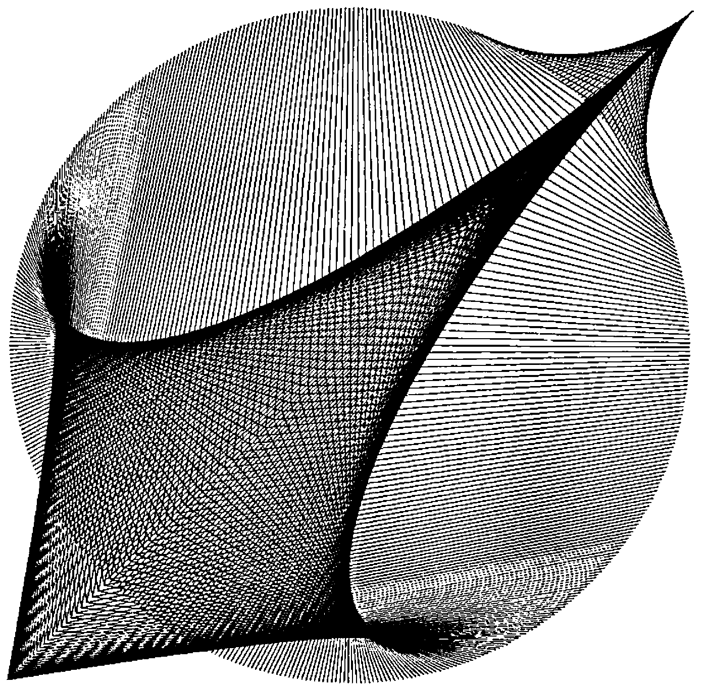

*From: Duncan Pearson, May 1992*
{ .byline }

Screen savers, programs that do funny things to your screen after prolonged inactivity, are all the rage with Windows users. One of the most popular programs, After Dark, has a module which draws a number of lines on your screen to form a very pleasing pattern.

It can be reproduced by the inevitable APL one-liner which I offer below:

```apl
PLOT 1○○(.5,[⎕IO+.1]2×(⍳LINES)÷LINES)+.×1-⎕IO-?⍉2 2 2⍴4,COMPLEXITY
```

`LINES` is the number of lines required, `COMPLEXITY` is a positive integer (try `4`, more than about `6` makes a bit of a mess) and `PLOT` is a function that takes an *n*×2×2 matrix and draws a line between `ARG[i;1;]` and `ARG[i;2;]` for all `i` (APL\*PLUS’s `⎕GLINE` is such a function).


