*reviewed by Duncan Pearson*
{ .byline }

## Introduction

This is a version of Dyalog APL that runs under Microsoft Windows 3 in Enhanced Mode and provides a programming interface to the facilities that Windows provides for the user-interface. The language is the same as in the DOS product; it is a true 32-bit application, although using a different C compiler. It is currently only available for machines with an 80387 maths co-processor or an 80486 DX main processor, though Dyadic say that they will release a version for the 80386 by the time that this is published. The review will not cover aspects of the product which are common to both this and the DOS product, reviewed in Vol.7 No.1. Nor will it cover such perennial topics as benchmarks, which are rather meaningless under Windows anyway. The section on the programming interface is more of a worked example as this seems to be the best way to get a flavour of the thing.

## Installation

Installing the system is easy provided that you are happy with the standard directory that they specify. All that is necessary is to type install at the A:> prompt, change the disks when asked, and then in Windows create a program item for the DYALOG interpreter program. If however a different directory, or more likely a different drive, is used then the user needs to change some entries in the WIN.INI file.

The keyboard mapping and general I/O tables remain as indecipherable as ever and editing them is as prone to frustration. It seems to be an iterative process whereby all possible key conflicts appear as short messages when trying to load APL explaining why it will not be possible this time. This would not be such a problem if the standard mapping provided with the product was usable. However while Dyadic insist on using the standard movement keys for their own purposes, and use screen colours that hurt the eyes, it will be necessary for we simple souls to brave the intricacies of the .DIN and .DOT files.

## General Information

You start APL by clicking on the Dyalog icon a window appears with the normal few words in the top left hand corner and a menu bar along the top. Hanging off this are most of the standard things that are available as session commands in most APL interpreters, such as )LOAD, )SAVE, )COPY:

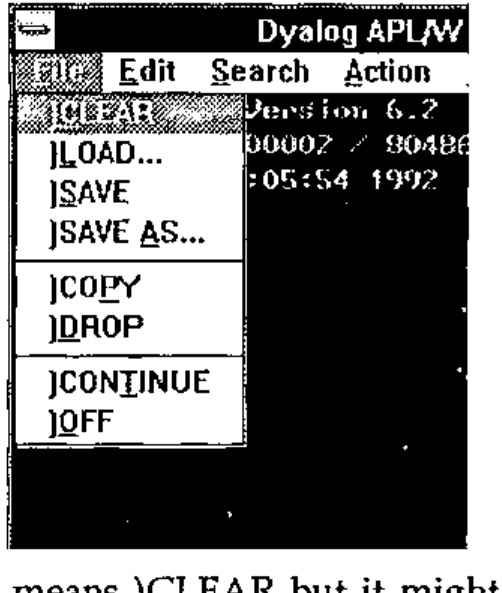

Dyadic have adopted the approach of trying to ease their users into the Windows paradigm. The file menu from the session has all the standard Windows file functions but gives them all the traditional APL system command names. Moreover if a function is selected from the file menu the corresponding system command response appears in the session. This seems unnecessary. The functions on the menu do standard Windows things so they should have standard Windows names. It won’t take an experienced APLer any time to realise that ‘New’ means )CLEAR but it might take a non-APLer with Windows experience rather longer to find out that )CLEAR means ‘New’. There are number of other functions that in previous versions of Dyalog APL have been available via control keys:

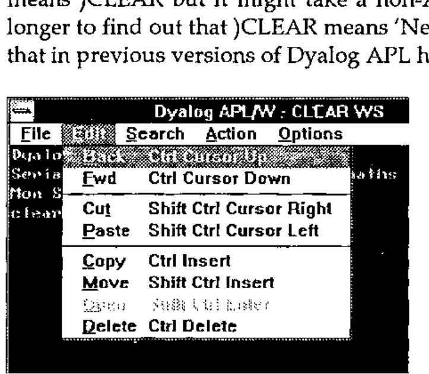

These are mainly to do with the editing, search and replace facilities of the session and of the function editor. It is here that the value of the labelling approach in the keyboard assignment table comes into its own. Whatever keys you have assigned to a particular session function will appear in the menu entry of that function as a keyboard short-cut.

Given the availability of the menu system and the dialog box facility of Windows one would have thought this a fine opportunity to get rid of such system functions as )FNS, )VARS and )ED. The last thing with which I want to clutter up my session is a long list of all the functions in my workspace. It would be much better to choose a function to edit from a list in the same way that I might choose a workspace to load. They have done the one, why could they not have done the other?

The editor and trace facility are the same as those in the DOS product but the trace facility becomes all the more useful when debugging a Windows user interface as will become apparent in the example later. Likewise the ability to watch a variable, i.e. have a continuously updated window in which the contents of a variable are displayed, is very useful. In addition a small control window can appear whenever a function is being traced with buttons for all the trace functions such as executing the current line and stepping backward and forward through the function.

One thing that is lacking is support for the standard Windows clipboard. It would be useful to me while writing this review to be able to pull the mouse over a fragment of text in a session or edit window and copy it to the clipboard, ready to paste it into the word processor of my choice. It is a pity also that Dyadic have not followed the example of STSC and MicroAPL in putting the APL manuals onto the help system. In fact there is no on-line help in the APL session at all. Still, with a price tag of £995, the only copy-protection that they seem to have is the necessity of having the manuals to use the system. The two manuals themselves are small, neat and well organised but suffer from poor presentation of the material, when compared with the manuals from many other suppliers of Windows products. The typeface is difficult to read and there is insufficient use of space within the page for clarity. However the chapters in the User Manual on the new Windows interface and on the use of dynamic data exchange are clear and well illustrated.

## Programming for Windows

The presentation of data and options to the user is done through a number of objects managed by the Windows system. The most basic of these is just a normal window. Within that window can be a number of other objects through which the user can communicate with the APL system. These can be, among others, push buttons, radio buttons, scroll bars and edit fields. For backward compatibility with Dyalog APL for DOS they have included a special SM object which displays the contents of `⎕SM`. In order for the user to communicate with the system he presses a mouse button while the mouse pointer is over one of the objects of the system or presses a key while one of the objects has the input focus (cursor in or on it). This generates an event, which is really a message that Windows sends to the system to inform it of what has happened. It is then up to the system to react to this message appropriately.

The means of managing the user-interface is sufficiently different from normal practice that the best way to illustrate it will be through a small example. There is a good one in the User Manual which is a temperature converter but perhaps a more appropriate example might be a number base converter, as this is something which every young hacker needs and to which APL is rather well suited.

First we shall create the base window for the application:

```apl
'CONV'⎕WC'FORM'('CAPTION' 'Number Base Converter')
```

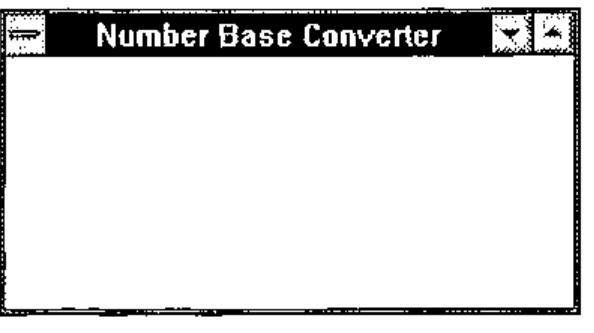

This puts a window on the screen with all the standard attributes like a border, some sizing icons at the top right, a system menu icon in the top left and title bar along the top with the title we gave. ‘FORM’ is the basic window type and anything we don’t specify, like size and position, will be given a default. ‘CONV’ is the name of the window and is an object in the APL workspace of class 9. This means that if we `)ERASE CONV` then the window will disappear.

What we need in this window are a field for entering numbers and a button for each of the number bases that we are willing to convert to and from.

```apl
'CONV.NUMBER'⎕WC'EDIT'('POSN' 10 10)('SIZE' 20 80)
```

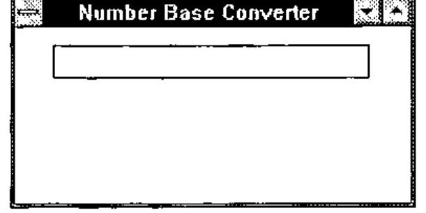

The name ‘CONV.NUMBER’ marks the NUMBER field as the child of the CONV object. NUMBER does not exist in the workspace and can only be seen by the GUI system functions. An EDIT object is by default a single line field and the size and position are expressed as a percentage of the size of the parent object, in this case the base window.

Next we create a button called BIN for the binary number base:

```apl
'CONV.BIN'⎕WC'BUTTON'('STYLE' 'RADIO')
```

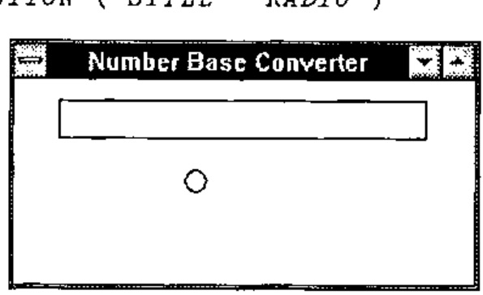

The STYLE property here makes the button behave like the old waveband selector buttons on what was then called the wireless. This means that if you have more than one of them you can only have one on at a time. Many objects have STYLE and it determines which of a number of variants of the basic type the object is.

Having created it we wish to give it a label and place it in the middle left of the screen so:

```apl
'CONV.BIN'⎕WS('POSN' 50 20)('CAPTION' 'BIN')
```

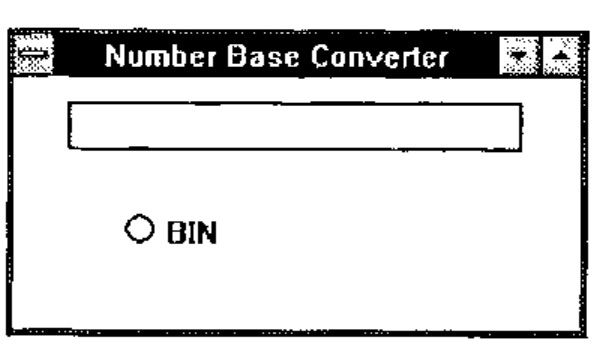

The system function `⎕WS` is used to change a property of an object once it has been created.

We now create three other buttons for octal, decimal and hexadecimal.

```apl
'CONV.OCT'⎕WC'BUTTON'('STYLE' 'RADIO')('POSN' 50 65)('CAPTION' 'OCT')
'CONV.DEC'⎕WC'BUTTON'('STYLE' 'RADIO')('POSN' 70 20)('CAPTION' 'DEC')
'CONV.HEX'⎕WC'BUTTON'('STYLE' 'RADIO')('POSN' 70 65)('CAPTION' 'HEX')
```

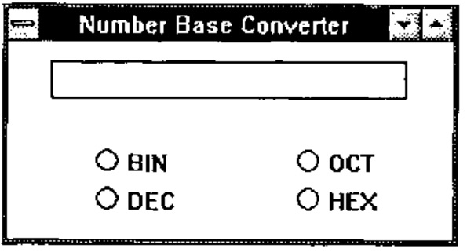

Now we have, sitting on the screen, our number base converter, but it doesn’t do anything. If you type something in the number field it will just sit there. The radio buttons will behave as radio buttons because Windows handles that aspect of their behaviour. However they are not communicating with APL. For this, two things need to happen. APL needs to ‘listen’ to the messages that Windows sends it about our converter window, messages such as ‘Someone has just pressed the BIN button.’, and we need to tell APL in which of those messages we are interested. The first of these is simple; `⎕DQ 'CONV'` will instruct APL to listen to messages about the window CONV. However this gets us nowhere unless we tell APL in which of these messages we are interested. We want to know when the user ‘selects’ one of the buttons. For APL to know this we must set the EVENT property of each button to react to a ‘select’ event. For the binary button we do it thus:

```apl
'CONV.BIN'⎕WS'EVENT' 30 'BASE_CONV' 2
```

30 is the number given by APL to any of the ways in which the user can press the button, `BASE_CONV` is a function that will be called whenever it happens and 2 (the destination number base) is passed as a left argument to `BASE_CONV` when it is called. The right argument to the function is information about what object and event have caused it to be executed, and is made up by the interpreter from the Windows message that it received. This means that you can use the same function for different objects and events but tailor it internally according to how it was called.

We also need to attach a call-back function to the NUMBER field so that you can only enter valid digits for the current base. For this we attach the function to event 22 which is a key press.

```apl
'CONV.NUMBER'⎕WS'EVENT' 22 'KEY_CHECK' 10
```

If a call-back function returns a 0 result it can in some cases stop the action which caused the event from happening. So our key checking function only needs to test the character against the allowable set and return the result of that test. Movement keys are specified as vectors and normal characters as scalars so we can allow movement keys by checking the rank. We get the information about which key it is from the right argument to the function, and the base against which to check we give as the left argument.

```apl
    ∇ R←BASE KEY_CHECK ARG;KEY
[1] ⍝ Prevent key press event if the key is not a digit in base BASE
[2] ⍝ it also allows any action keys (returned as vectors rather than scalars)
[3]
[4] ⍝ extract the key from the argument
[5]  KEY←⊃2↓ARG
[6]
[7] ⍝ Return 1 if it is valid, otherwise 0. 0 will inhibit the event.
[8]  R←(1-⍴⍴KEY)∨(⊂KEY)∊BASE↑'0123456789ABCDEF'
    ∇
```

Having put the base in the EVENT property of the NUMBER field as an argument to the call-back function we can use that to tell the `BASE_CONV` call-back function the base from which it is converting. It can query the events marked for the field and extract from the 22 event the relevant left argument.

```apl
    ∇ DEST BASE_CONV ARG;⎕IO;NUM;EVENTS;SOURCE
[1]  ⍝ Convert the number in CONV.NUMBER to the base DEST
[2]
[3]  ⍝ Index origin 0 is much better for number base conversion
[4]   ⎕IO←0
[5]
[6]  ⍝ Make sure the button is ON (a select event can turn a button off)
[7]   (⊃ARG)⎕WS'STATE' 1
[8]
[9]  ⍝ Get the events logged against CONV.NUMBER
[10]  EVENTS←'CONV.NUMBER'⎕WG'EVENT'
[11]
[12] ⍝ Find the key event and extract the number base (left arg to KEY_CHECK)
[13]  SOURCE←((1⍳⍨22∊∘⊃¨EVENTS)2)⊃EVENTS
[14]
[15] ⍝ Change the left argument to KEY_CHECK to the new base
[16]  'CONV.NUMBER'⎕WS'EVENT' 22 'KEY_CHECK'DEST
[17]
[18] ⍝ Decode (or encode, I can never remember which) the number in the field
[19]  NUM←SOURCE⊥'0123456789ABCDEF'⍳'CONV.NUMBER'⎕WG'TEXT'
[20]
[21] ⍝ Convert to the new base and place the new number back in the field
[22]  'CONV.NUMBER'⎕WS'TEXT'('0123456789ABCDEF'[⌊((⌈DEST⍟1+NUM)⍴DEST)⊤NUM])
    ∇
```

Finally having set the initial base as 10 we need to turn on the DEC button

```apl
'CONV.DEC'⎕WS'STATE' 1
```

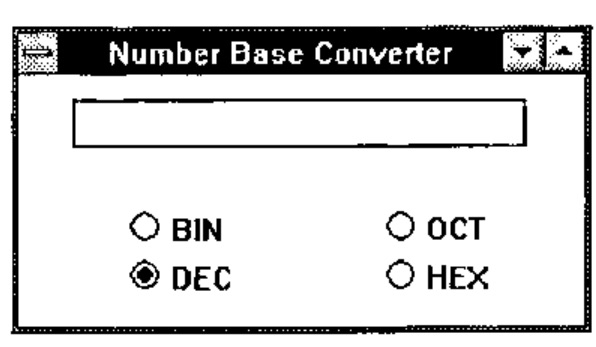

A final

```apl
⎕DQ 'CONV'
```

sets APL listening to events from `CONV` which will prime our call-back functions to react to the ‘select’ and ‘key press’ events. We enter a number in the field and press a few buttons to see what happens to it.

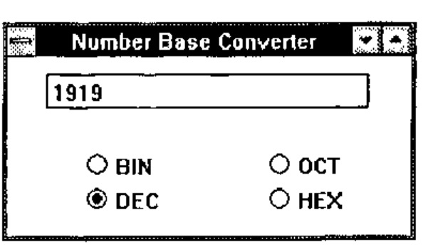

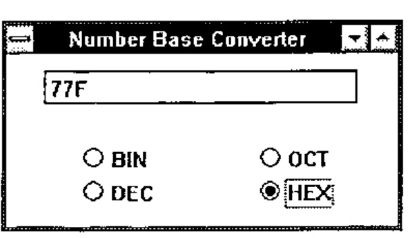

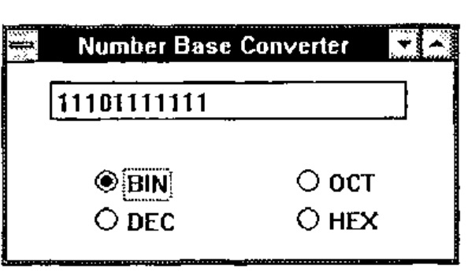

Now if something, as usual, goes wrong and the system does not work as planned, we can use the Dyalog tracer to step through the functions. When we execute `⎕DQ 'CONV'` we instead press the trace key (Ctrl Enter) and control passes to Windows as before. However whenever a call-back function is executed it is instead traced. A trace window pops up with the function definition, some buttons with BACK, FWD etc. appear and we can step through the function as we please, watching any interesting variables change in their own windows if we so wish.

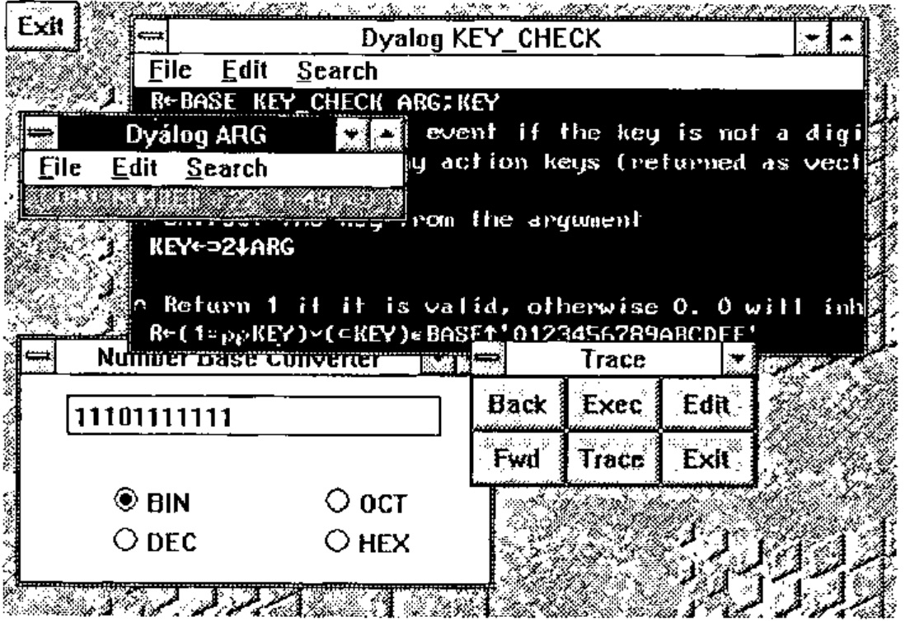

## General Observations

I find the Windows interface easier to program than any other I have yet used. This is in stark contrast to either of the other methods of programming for Windows that I have seen, namely C and APL\*Plus II v4, having said which programming in +IIv4 is effectively interactive C. Here, however, we have something completely different.

In the same way that APL is a language that removes the programmer from the intricacies of the machine and gives him a tool ideally suited to solving numerical problems, so Dyalog APL removes us from the intricacies of the interface but gives us a powerful and simple tool with which to manage it. There are drawbacks to this approach. C and +IIv4 give you access to the full range of windows functions. If you can do it in Windows you can do it in either of these. However in the area of text-based systems I think that Dyalog APL provides everything that I might possibly want to use. Unfortunately it is not possible to comment on the graphics facilities as the current version does not have graphics which we are assured will be in a later release. It is in my mind essential for a serious GUI programming tool to provide graphics and the nature of their implementation seems to be the only question hanging over an otherwise excellent product.

A better comparison would be between Dyalog APL/W and Visual BASIC. VB is the only other programming language that I have heard makes Windows programming easy. It would be interesting to see a VB listing for the example above. Confirmed APL bigots would perhaps be surprised by how similar they might be.

There is no doubt that an application written in Dyalog APL/W will be slower than the corresponding application written in C. This could be a problem if your users are running Windows on slow 386 machines as the sluggishness of response might seriously affect their acceptance of your systems. On a 486 machine however the response is crisp. A system written in C might be crisper but it is doubtful that your users would notice the difference unless you were doing something pretty complicated with the interface. With the price of fast new machines plummeting, speed will not be a problem unless you have a large installed user-base and a tight budget.

## Future Portability

In designing the interface with Windows Dyadic abstracted what was common to the leading GUIs in DOS and UNIX and provided an interface to only those facilities. They state in the manual that it is their intention to implement the same interface to Motif from Dyalog APL/X. This is good news for those of us who live in an uncertain world with the threat (or should that be promise) of UNIX looming a couple of years ahead. If what Dyadic say is true a system written in Dyalog APL/W, provided it does not use any of the auxiliary processors, should port directly to Dyalog APL/X. This would be quite an advantage for anyone who found himself in that unfortunate position, especially when compared with the trouble of taking all the Windows C calls in his +IIv4 system and replacing them with the appropriate X calls when he ports to +II for UNIX. I’m not saying that it couldn’t be done but I’d rather not be the one to do it. Come to that, I wouldn’t want to write the +IIv4 system in the first place.

## Postscript

We have found a couple of esoteric bugs in the system which do not affect the running of the code, and the DDE interface does not work with the Oracle DDE server that we run, but otherwise it seems a reliable product. There seems to be a little problem which occasionally causes the Windows session to flash in bright colours when you start APL but this goes away when you shut it down and does not seem to repeat often. Dyadic will produce a maintenance release soon which will fix many of the initial teething problems and also provide a runtime packager. Runtime copies will be free.
