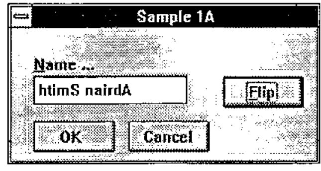
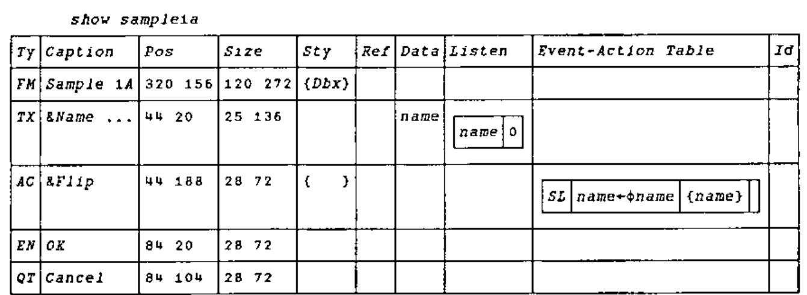
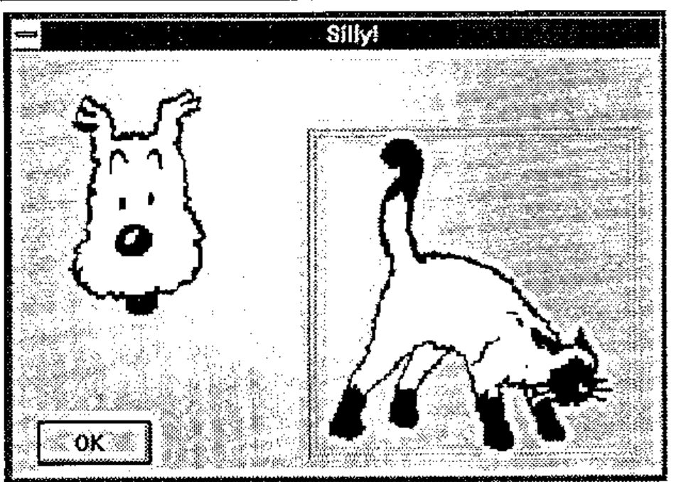
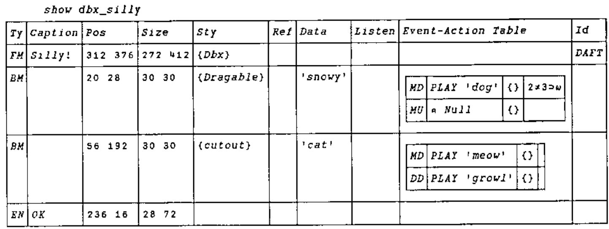

*by Duncan Pearson*
{ .byline }

## Background

Causeway is the amalgamation of the ideas from two embryonic GUI management systems developed by Adrian Smith and myself through most of last year. Adrian was working on the logical successor in the Windows environment to his FSM/WIN utility set (see Vector 10.1 page 67) and I was building a new GUI development environment under Dyalog APL for the OR Systems team at Nestlé. In November last year we sat down together and planned an amalgamation of the two systems as material for the BAA GUI Workshop and subsequently for use within Nestlé. The new system was based on the structure of Adrian’s system DBX, but incorporated ideas from my system such as a table of events and behaviours, local variables on forms and automatic update of all controls linked to any variable.

## The Aims of this Article

In the course of this article I will discuss how the elements of the dialogue box definition determine each object’s appearance and behaviour; how the system is managed internally to enable the effect of localisation at form level; and finally how the contents of the object prototype table enable the hard-core techie to create new controls or modify those that come free with the workspace.

There are in effect three levels of user of the Causeway system.

- The **application user** is the ultimate beneficiary of the Causeway system. He is the one who is using the application developed under Causeway to do a job of work. He might be a production planner, an accountant or perhaps a managing director.
- The **application developer** puts together a number of forms with controls on them, some of the controls being simple, such as edit fields, and some being quite complex, such as that for PostScript graphics display. He links the controls to variables and defines the application specific behaviour of the controls, putting actions on events. He produces the applications used by the user. He need know nothing about the way in which the underlying APL interpreter handles the graphical user interface.
- The **control prototype (or "class" for short) developer** is concerned with enriching the variety of controls available for the application developer to use. He defines the inherent (or default) behaviour of the controls, the way they appear, the type of data they display and the way in which they display it. He may build a new control class from scratch (as we have done in many cases) or he may change aspects of an existing control. He has a detailed knowledge of the underlying interpreter’s GUI facilities.

Underneath all of these users you have me and Adrian (and hopefully Marc Griffiths for APL.68000) writing the Causeway code to enable all of this to happen and making sure that it happens in the same way regardless of the APL interpreter that the user is running.

## Compatibility

One of the major aims of the Causeway system is that if you as an application developer follow certain guidelines you should be able to develop forms that work unchanged on whatever interpreter you use, provided of course that we or someone else has implemented Causeway in that environment. We have a full version in Dyalog, a working but not yet fully featured version for +III (evlevel 2) and a stated intention from Marc Griffiths to implement it under APL.68000 for the Apple Mac.

While all the writers of different interpreters are fighting to present their approach and their set of quad functions as the sensible way to write GUI systems, not only do they give you too much feature and not enough organisation, but also they give you incompatibility. **It is possible to take a Causeway form definition in Dyalog, convert it to a text vector, pass it through the clipboard to +III, reconstitute it on the other side, and it will run.** The form definitions will constitute much of an application written under Causeway and it is possible for an application developer to write a very good system without ever touching a GUI quad function, nor even knowing under what interpreter he is running.

In order that form definitions be portable a number of things need to be considered. Firstly all control types used in the form definition must behave in the same way. They must occupy the same screen real estate and most importantly they must expect and return data in exactly the same way. It does not matter as much if a radio button group has a 3D appearance in one system but not in another, provided that both accept a vector of options and return the index of the selected button.

Secondly the events mentioned in the behaviour tables for the controls on the form must be the same on both systems. This is why we prefer the use of our two-character event codes. We ensure that they will be available on both systems, or at least we document which are compatible. Under +III you can use any event name that you like and so have access to such +III specific events as KeyDown, but you should be aware that if you use them *your form definition is not portable*. Not only must the events appear on both systems but their arguments must be the same. It is no good having the MouseDown event in both systems if on one system the position is reported in pixels and on the other in character units. We jump through hoops to ensure that, for what we term "compatible events", the value you see on execution of an action is the same no matter what implementation of Causeway you are using.

## Modules

An important part of Causeway, but one mainly unconnected with the GUI, is the idea of *modules*. A module is a way of containing functions and data associated with a particular task. There are two main reasons, to remove the necessity of prefixing each function in the set with some distinguishing letters to separate it from the other sets in the workspace, and to allow effectively static local data. In the Dyalog APL implementation of Causeway the designer, *Dbx*, is a module.

*A module is nothing more than a form (typically iconised) being used as a container for function and variable definitions.*

The idea is that you can call a function in the module and while it is running it will have access to all the other functions and variables of the module. In the same way that the environment is prepared before executing an action on a normal form, so the function to execute a command in a module, `Gui_do`, creates an environment in which to run the command that you specify. The data property of the form contains a list of function names, a corresponding list of definitions, a list of variable names and a list of values for those variables. `Gui_do` simply shadows the two name lists, defines the functions and variables, runs the function specified in the first element of the right argument on the remainder of the right argument, saves the new values of all local variables and then exits.

If you want to run the same functions on two different sets of local variables then you just create two instances of the module, each contained in its own form and each with its own set of local data. I can have two instances of my Oracle module, each connected to a different database and each acting independently.

## What is Causeway?

The main ideas behind the current system have been described in Adrian Smith’s introduction to Causeway in Vector 10.4, pages 64 – 76.

Briefly they are:

> An object on the screen should be the visual representation of a variable. For example a text vector would normally be associated with an edit field and a numeric scalar would be associated with a special edit field that only allowed numeric input and which furthermore would put a numeric scalar back in the variable when the user changed it. The developer should not have explicitly to change the screen representation, nor should he have to read it back into a variable when it is changed. Instead changes to the data on the screen should automatically update the variable, and changes to the variable should automatically update the screen representation.
>
> The variable to which a control is linked should have the option of being entirely contained within the form. It should be able to be a "local" variable and a change in it should not affect the global environment.
>
> For any event that could happen to a control the developer could define a line of APL to execute, an "action" of the control. A typical event for a push button is "being pressed". Most buttons have just one action on the press event (called in Causeway SL, for select). On any control that is linked to a data variable it is also possible to put an action that is run before the variable is updated to validate the new value.
>
> If a variable should change during the execution of an action for a control on a form, then all controls linked to that variable, whether on that or on other forms, should be updated. In order for this to happen the application developer must tell the Causeway system in some way, what variables could change as a result of any action.
>
> Any action on a control of a form should execute in the context of that form. Any variable defined as local to the form should have its locally defined value on execution of the expression. When the expression has been executed the new value should be saved back "in" the form.
>
> If, during execution of an action on a form A, a new form B is created, then any variables local to A should be global to actions executed on B, in the same way that a function *GOO* called from a function *FOO* has access to the variables local to *FOO*. In effect we would have a form stack in the same way that we have a function stack. The way in which it differs from a function stack is that instead of having a linear structure it would have a tree structure. A form might have more than one child form open at one time.

If the APL interpreter does not provide a control that the application developer needs in his application, such as a spin box, but its appearance and behaviour could be duplicated by a composition of various basic controls (a spin box is just an edit field and two buttons) then it should be possible for an experienced developer to encapsulate the code and state variables necessary to build and manage that control, in such a way that the normal application developer need not know that it is not a basic control, and that the code and state variables should not be visible, either from the workspace, or from actions executed on the object.

## The Form Definition Matrix



As you will have seen from a couple of the diagrams in the previous article (Vector 10.4, page 70), a form is defined by a ten-column matrix with the top row giving the characteristics of the form itself and each subsequent row defining a control on the form.



For a control the first element defines its type, is it a button, an edit field, a spin box or what? The next four elements define its appearance (caption, position, size, style); the last five define its behaviour: with what variable(s) it is associated, what lines of APL will run as a result of which events on it, and by what name it is known to the application developer.

## Type (Element 1)

This is a two-element text vector such as FM for form or TX for text field. It corresponds to the first element in a row of the class table. From this the system knows what functions to use to create the control, to read data from the control and to put data back into it, to "refresh" it. The definitions of these functions are held in the class table and they are only defined as needed and expunged once they have done their job.

## Appearance (Elements 2 - 5)

**Caption (2)**<br>
This is text vector which will normally appear above the top left corner of the control, but on the face of a button and in the title bar of a form. The management of the caption (the initial positioning and any subsequent movement) is handled by the system. Having a caption on each control means that the number of labels is greatly reduced. In other systems it is necessary to define a label for each edit field and then to have to re-align them whenever the field is moved in the design process.

In the caption of the form (as in the header of a function) the name is optionally followed by a list of **local variables** separated by semicolons. On creation of the form these variables are given the value 0 by default.

**Position (3)**<br>
This is a two-element integer vector giving the position of the control in pixels relative to the form’s client area (the bit in the middle). For a form it is the position relative to the screen. The first element is the vertical position and the second is the horizontal position.

If the first element is positive it is the distance from the top of the control to the top of the form. If it is negative then the absolute value gives the distance from the bottom of the control to the bottom of the form. The horizontal position is defined similarly with positive from the left and negative from the right. This gives the ability to anchor the control to any corner of the screen.

**Size (4)**<br>
This is again a two-element vector giving in order the height and width of the control in pixels. If an element is negative then the absolute value gives the number of pixels by which the size in that dimension is less then the size of the form. If a control has negative height and width and the user makes the form larger, then the control will grow to match and retain the same borders.

**Style (5)**<br>
This is a vector of style names, each of which modifies the appearance of the control in some way. Each name identifies a low level specification which will be used in the creation of the control to modify it. The style might specify the colour of the control or the relative position of the caption, amongst other things. The techie might wish to modify or add to the style table to produce his own effects. It can be used to implement a "house style", as shown here:

![Disp ∆styletab[1 9 10 20;] ⍝ Style tag, Gui-code, Allowed objects: Dbx ((Border|2)|(Accelerator|112|0)) (FM|RU); Password ((Password|*)) (TX|NM); Dragable ((DRAGABLE|1)) (LB|IC|BM|TC); Arial14b ((font|arial|20|0|0|0|800)|(fcol|0|0|128))](art10006450/styletab.jpg)

## Behaviour (Elements 6 - 10)

**Reference (6)**<br>
This an APL expression. How the result of the expression is used by the control varies from control to control as will be explained later. It generally specifies aspects of the control that may be changed by the application code during the lifetime of the control, but that cannot be changed explicitly by the user. For example the reference expression for a multiple selection list should give the elements of the list. The reference expression for a group of radio buttons would give the labels of the buttons. When a control is created and when it is subsequently refreshed (see below) the expression is executed and the result passed to a special function defined in the control prototype which updates the visual representation of the control.

**Data (7)**<br>
This is another APL expression. It too is executed whenever the control is refreshed and the data passed to the "refresh" function in the same way as the result of the reference expression. The data expression for a list would give a vector of the indices of the selected elements of the list. For a group of radio buttons the data expression would give the index of the selected button.

In the case of the radio button group a change in the selected button should not affect the labels on the buttons. So if only the data has changed there should be no need to execute the reference expression and pass its value to the refresh function. On the other hand if the reference information has changed then it is essential that the data should be updated as, in the case of a list or radio group, the number of elements or buttons might have reduced and the old selection might give an index error. As you will see there is a mechanism to enable only the data to be refreshed.

The data expression has a special restriction as it is used for another purpose. If the user changes the data in the control the data expression is used to specify where it should be put. As such it must be possible to use the expression as the left hand side of an assignment. It must therefore be one of three things. It can simply be a variable name. It can be an indexed variable, in which case the expression must end with a "]". Finally it can be a selective specification. To explain better the restriction I will show what happens when the user changes the data in a control.

- A "read" function is defined which queries the control and returns the new data into a temporary variable.
- If the data expression is a selective specification then it is surrounded by parentheses.
- The data expression and the name of the temporary variable are then joined by an assignment arrow and the resulting expression is executed.

If the data is not a variable name, an indexing of a variable or a selective specification then this last execution stage will fail. Originally in my system I only allowed variable names, which made the job of tracking what things needed to be updated much easier, but the advantages of being able to use indexing outweigh the extra hassle it causes.

**Interests (8)**<br>
As mentioned in the preceding paragraphs, if a control is to be updated automatically then the system needs to know upon what variables it depends for its information. Then if it is told that one or more of these has changed it can arrange for the reference and data expressions to be executed and the results passed to the "refresh" function which will update the control. The eighth element of the definition is what tells the system what variables are used in the two expressions.

It is a two-column matrix with the first column a list of variable names and the second column boolean. For each variable the boolean tells the system whether it is used in the reference expression or not. If it is not (denoted by 0) then when the variable changes only the data expression is run and the refresh function may have much less work to do. This can save considerable time. If a number of the variables in which the control has an interest change, then the reference expression will be run if *any* of them is marked with a 1.

It is important to note that this matrix is the *only way* in which the system can know of the interest of a control in a variable. We considered analysing the expressions to find all referenced variables but it is quite possible for one of the expressions, especially the reference, to contain function calls. Moreover the combination of this element and the next are useful as a record of the dependencies within the system. The traditional function calling diagrams with which we used to document APL systems are inappropriate to this new way of working but by putting all the interdependencies within well defined structures, i.e. form definitions, we force a form of system documentation.

**Actions (9)**<br>
The ninth element of the definition is where the functionality of the control is defined. **It is a four-column matrix.** For an event specified in the first column there will be an APL expression to execute in the second column. That expression may change the values of some variables and in order that any controls linked with those variables can be updated the third column contains a vector of the names of all variables that might have changed. All controls that have the names of any of these variables in the eighth element, the interests table, will be updated. As with the interests table, an entry in the third element of an action row is the *only* means by which the system can know if a particular variable has changed. If this section or the interests table are not completed correctly the automatic updating of controls from changed data, which is one of the main advantages of the system, cannot take place. If in a system things are not being updated as planned then these are the first places to look.



Within the APL expression the developer may use the characters alpha and omega which will be replaced with the *control name* and the *event argument* respectively.

On creation each control or form is given an arbitrary name by the Causeway system which will identify it to the underlying interpreter.

There are two ways of getting this name: through the use of alpha in an action on the control and through the control id described in the next section. The event argument is a means by which the system gives more information about the event that has happened, more often than not quantifying it. For example if the event is a resize of a form then the argument will contain the new size. If the event is a "mouse down" then the argument will contain among other things which button has been pressed.



The dog barks on left-mouse, but the right-mouse gives standard (Dyalog) behaviour, and allows the user to drop the dog on the cat, causing a growl.

The final column contains an optional condition that will be executed before the main expression and, if it returns singleton 0, will inhibit the execution of the main expression. For any event there may be as many rows in the behaviour table as are required; the system will execute all that have an empty condition expression or whose condition expressions return 1. If for example you wish to put different actions on the left and right mouse buttons then you should put two rows in the behaviour table, each with ‘MD’ in the first column. For the right button action the fourth element would be an expression querying the appropriate element of the argument, represented by omega, and returning 1 if it were "right". For the left button action the condition would return 1 on a left button press. The condition-action pairs are executed in turn from the top down; any changes to the environment caused by an expression will be in place during the execution of all subsequent expressions.

The use of two-letter codes to denote events may seem an added complication when the events now have names both in Dyalog APL v7 and in APL\*PLUS III, but it is because these names are not always the same that we use our own names. Not only are the names sometimes different but what one interpreter might report as one event another might report as two, an example being "configure" in Dyalog and "Move" and "Resize" in APL\*PLUS III. If you use the Causeway code you are guaranteed the closest compatible event and furthermore the arguments will be the same on both systems. It will be possible to use interpreter-specific names in place of the two-letter codes but at the cost of portability of form definitions.

Another reason that we use our own codes is that the Causeway system generates its own events. An example is the validate event "VL" which is generated just before the updating of a variable. The argument of the VL (reported in omega) is the new value for the variable. If you change this value then what you assign to omega is what gets placed in your variable (or rather the result of your data expression). Another is the create event, "CR". This is generated immediately after the creation of a control and before it is refreshed for the first time. It is particularly useful on a form, to set up any local variables that will be linked to controls on the form.

**Id (10)**<br>
The final element gives a means by which the application developer can refer to a control or form. The function `Gui_id` will, for a given form and id, return the internal names of all controls bearing that id. As discussed these internal names can be used by certain Causeway functions or can be used by the more technically inclined application developers to perform low-level interpreter-specific operations on the control. As the same form definition may be used to define many instances of a form so an id might identify the same control on many different forms only one of which was intended. This is why it is necessary to specify the form as well as the id. The internal name of a form will be returned on creation of the form. If the form is omitted when calling `Gui_id` then it is taken to be the current form, the form on which the current action is being executed. This concept of current form will become more important when considering localisation. It is worth pointing out that the current form need not be the form with the focus, although that will often be the case. There is a mechanism by which the application can cause arbitrary events to be registered against controls on other forms. During execution of any action the current form is the form on which the event that caused the action was registered.

## Localisation

As mentioned in the introduction, each form can have its own set of local variables which are listed in the caption to the form and which reside in the form itself. These are especially useful if the same form definition is to be used to define many independent instances of a form. Suppose you had a large document represented in the workspace as a vector of text vectors, each subvector representing a chapter, and you wished to edit many different chapters at the same time, each in a separate window. You could define a form with a notepad control for which the data expression was the document indexed by some integer variable representing the chapter. If that variable were only able to exist in the workspace then all the windows would look at the same chapter. If that index variable were to be local to the form, then each window would have its own version of it and could look at its own chapter. The underlying document would be the same and if two windows had identical index numbers then they would look at the same chapter and a change in one would be reflected in the other.

Associated with each active form there is a set of data specific to it. In both Dyalog APL and APL\*PLUS III (and I presume by implication in APL.68000) this is held in the "data" property of the form.<sup>1</sup> Part of the data associated with a form is a table of name/value pairs representing the local variables.

The way that Causeway handles local variables is closely linked with the concept of a current form, already described as the form from which the action currently being executed was taken. Simply, before executing an action Causeway prepares an environment for it by localising the names in the local variable table of the current form (either by using `⎕SHADOW` in Dyalog APL or by creating a temporary function with an appropriately generated header line in APL\*PLUS III) and then assigning the values in the table to the names. After execution of the expression the new values of the named variables are saved back in the table before they are lost as we come out of the localisation. In this way the variables are not only local but also *persistent* across execution of different actions on the same form. If we follow the analogy between the form and the function it is as though the variables were local statics, something we do not yet have in APL.

If in the execution of an action a new form is created then it becomes the child of the current form. In its data property is an entry containing the name of its parent, the current form when it was created. In the same way that the local variables of a function are global to any called function, so the local variables of a form are global to any child forms. Thus, when the environment is prepared, the names and values of the locals are collected from a number of different forms, the value from the child form always taking precedence over the value from a parent (or its parent).

The process is as follows:

1. The system creates a large list of name/value pairs, going from each form to its parent adding the form’s local variable table to the bottom of the list and stopping when it reaches a form with no parent.
2. It then finds the first occurrence of each name (which will be the most local) and uses the corresponding value in its definition, noting where in the master table it was found.
3. After the execution the new values are replaced where they were found in the table.
4. Finally each part of the table is returned to the form from whence it came.

Thus we simulate the way a function stack has localisation of variables at different levels and the way that a higher level definition shadows the definition at a lower level in the stack.

<sup>1</sup> If we needed to implement Causeway in an interpreter that did not have data properties in its forms then we would just have a large table in the workspace keyed by form name.
{ .note }

## Registration and Notification

When a variable is changed by an action all controls linked to that variable are refreshed so that what they display is based on the new value. In order that the system knows what controls to refresh, that information must be saved in a table somewhere, keyed by variable name. When a variable is changed then the table is searched for all references to the variable name and all the corresponding controls updated. Initially it was this easy. There were no local variables and so all changes would be to global variables and there need only be one table.

The fact that the variable linked to a control might be localised somewhere down the form stack adds a level of complication. What needs to happen is that if a variable local to a form is changed, then all controls *that are in that form or its children*, and that are linked to that variable, should get updated. The way that this is managed is that each form has, in addition to the set of local variables, a table showing the controls in the form and its children (and their children) that are interested in those variables. We call this the registration table. If a variable in a form is marked as changing as a result of an action, then the registration table for the form is searched for controls interested in the variable. Each one is then refreshed regardless of the form in which it is found.

The registration table is created when the form is created and whenever a new control is created with an interest in a variable on the form, another row is added to the table. For any control there could be many variables in which it was interested, which might be localised in different forms. On creation of the control the list of variables in which the control is interested (column one of element eight of the control definition) is compared with the local variable table on the form in which it is created. If there are any matches then the appropriate rows are added to the registration table of the form. The matched variables are removed from the table of interests and the process is repeated with the form’s parent. This continues until we run out of forms or the interests table is depleted. If we have reached the base form and there are still names left in the interests table, then they must refer to global variables and so entries are made in the registration table of the root or system object, the parent of all first level forms.

A similar process happens when an action changes some variables. We have a list of the variables that might have been changed (from the third column of the behaviour table) but we don’t know in which forms they are held. We work down through the form stack finding where they have been localised and search the corresponding registration tables for controls with an interest in the change. Any that we find we refresh.

## Control Prototypes

Ultimately the set of controls provided with Causeway will prove insufficient and there will be a need to create new ones. Within Causeway all the types of controls, from the form down to the humble edit field, are defined by a few function definitions and a behaviour table, all of which are generally held in a table in the workspace. These functions are used by the system whenever it needs to do anything to a control that it does not know how to do. In a number of places we talk of *creating*, *refreshing* and *reading* controls. For different controls these things are done in different ways. The Causeway system itself does not know how to read data from an edit field, it doesn’t know which property to query. However, because for each control there is a function in the prototype designed to read data from that particular type of control, the Causeway system does not need to know. We have separated the things fundamental to Causeway, such as the running of actions, the building and re-saving of environments and the registration and notification, from the things specific to particular controls. When a control is created the Causeway system fetches and defines a "create" function from this table and passes it the control definition together with the internal name to use when creating it. If the "create" function succeeds in creating the control then the generic Causeway code will add event handlers from the class table to enable it to work and then link it into the system, making entries in the registration table of its form and of its form’s parents. When subsequently we need to refresh the control we fetch and define the "refresh" function which we pass the name of the control and the data with which to refresh it.

As the implementation of the same control is generally different under different interpreters, so the structure of the prototype table may differ also. However the principles are the same. I will explain the purpose of the common parts of the prototype but for detailed information about the construction of new prototypes you will need to refer to the documentation in the version for your own interpreter.

The most fundamental function, which must always be provided is the "create" function. This, as mentioned above, is generally given the definition and the intended name of the control as arguments. It will create whatever basic interpreter-defined control or controls are necessary to implement the intended behaviour of the control. Here is a Dyalog APL example:

```apl
r←nm cr def;cap;ps;sz;acc;kc
⍝ Create AC (action button) object as <nm>
⍝ Splits out 'Hint' from caption, and activates
⍝ 'Accelerator' from 'Label=Ctrl+A' if given
 r←⍬ ⋄ cap ps sz←def[2 3 4]
 nm ⎕WC'BUTTON' ''ps sz,Gui_style 5⊃def
⍝ Remove hint, leaving visible part
 cap←nm Gui_hint cap
⍝ Anything after '=' should be activated ...
 nm Gui_accel(cap⍳'=')↓cap
 nm ⎕WS'Caption'cap
```

If the control has a separate caption it will create it<sup>2</sup> and if the control is composed of more than one basic control then it will attach the necessary event handlers (functions to be called on particular events) to all the component controls. It needs to do this because the generic Causeway code only knows the name that it passes to the "create" function, which will in general be used for the main component control. An example would be the spin box. The main control might be the edit field and its event handlers would be applied by the system, however there would also be two buttons which would be created by the "create" function with names chosen by it (generally derived from the main control name) and with event handlers applied also by the create function.

<sup>2</sup> In Dyalog and +III there is a function Gui_caption that will do this in a consistent fashion using a label. The reason that this is not used on all controls is that the caption might already, as in the case of the form or the push button, be incorporated within the control anyway
{ .note }

If the control is to display data that can be varied by the application, given by the results of the reference and data expressions, it will need a function to apply the data to the control. This may be simple, as in the case of an edit field where the data is assigned to the "text" property of the control, or it may be complex, as with the numeric matrix object that I developed for Nestlé in which, as the shape of the linked matrix could have changed, the refresh function recalculated the cell size to fit the cells optimally within the area for the whole control, and moved the focus to the nearest cell in the new matrix corresponding to the focus position in the old. As mentioned in the section on the form definition matrix, the refresh function can be passed simply the result of the data expression or passed the results of both data and reference expressions. If for any control there is no refresh function then the reference and data expressions and the interests table are effectively ignored.

```apl
r←nm rf arg;ref;val;flg
⍝ Refresh LB (label).
⍝ This just uses DATA at the moment
 r←⍬ ⋄ flg val ref←arg ⋄ →(0∊⍴,val)↑0
 val←,⍕val
⍝ Check what was already there (saves flicker)
 →(val≡nm ⎕WG'CAPTION')↑0
 nm ⎕WS'CAPTION'val
```

For controls in which the user can change the data there must also be a read function to take the changed data out of the control for assignment into the data expression. As with the refresh, if there is no read function then no assignment will take place, regardless of the contents of the data expression.

```apl
val←msg rd dum
⍝ Read from NP (notepad) object
 val←(⊃msg)⎕WG'TEXT'
```

The thing that triggers the read, that activates Causeway to define and run the read function, is defined in another behaviour table, this time in the class table. Each row of this table links an event with either with a function to run or with an instruction for the system to execute the "read" process. These call-back functions are also held in the prototype table and are defined on demand by the Causeway system. This whole process will be simplified considerably in Dyalog v7 with the use of namespaces. There the control specific functions will be defined in the namespace of the control by the create process and the interpreter will execute them directly on generation of the event.

Currently in both the Dyalog 6.3 and the +III versions we have two other mandatory control specific functions.

In order to implement the re-sizing and re-positioning behaviour described above it is necessary to have a function to move the control, any of its component parts, and its caption if that is defined separately. We call this the *resize* function. We anticipate that in the Dyalog v7 version of Causeway this function will be unnecessary as Dyadic have provided an ‘attach’ property which implements the behaviour at the interpreter level. Here is a typical resize function from the current version of Causeway for Dyalog:

```apl
r←nm rs def;ps;sz;flg;adj;⎕TRAP
⍝ Reconfigure (notepad). Designer sets flg←0
⍝ Caption and [cutout] must follow.
 ps sz flg←def ⋄ r←⍬
 adj←ps-nm ⎕WG'posn'
⍝ Refuse to go below 1-char high ...
 sz←24 72⌈sz
 nm ⎕WS('posn'ps)('size'sz)
 nm Gui_cutout flg ps sz
 →(adj∧.=0)↑0 ⋄ ⎕TRAP←6 'C' '→0'
⍝ Bump caption to the right place ...
 nm←nm,'caption' ⋄ nm ⎕WS'posn'(adj+nm ⎕WG'posn')
```

Also we prefer in our form designers to use simpler versions of the controls than in the real system. This is mainly to reduce visual clutter. To implement this we require that for each class there be a "design" function which creates a dead control of the same size, position and general appearance as the intended control. In many cases this "design" function will be identical to the "create" function.

In Dyalog APL we have an operator called `Gui_apply` that takes as its function argument the `⎕OR` (the definition) of a function and applies it to the arguments of the derived function. This avoids all manner of name clashes as during execution the function has the name assigned to it in the header of the operator.

Under +III, which does not have `⎕OR` or defined operators, I have implemented `Gui_apply` as a function that takes, instead of an *OR*, a *VR*, replaces the given name with one of my own choosing (that incidentally appears in the header line of `Gui_apply`), defines the function with `⎕DEF` and then runs it. Thus I have the same effect with a little more work.

## Causeway for DOS?

We have noticed that systems written in Causeway seem to be quicker to write and, more importantly, more robust than the equivalent systems written under DOS. This is in stark contrast to the experience of our colleagues writing in C, Powerbuilder and other Windows development tools. It could be that the encapsulation of system code and the management of the control and screen update logic is at just the right level. Whatever it is, we are aware that most of what we have done could have been done just as easily under DOS. None of it relies on any revolutionary features of the GUI that could not be simulated easily in a DOS APL. While neither of us have the time at the moment to spend on a project like this, if there is interest in a DOS version we might be persuaded. Alternatively if anyone out there enjoys a challenge then either of us will be only to glad to provide advice and to go into the code and principles in more detail.

## The Future

There are two things that we would like for Causeway in the future, less code and more platforms.

The first objective of less code is one that is not really in our hands. We have noticed that, by coincidence, some of the things that we worked quite hard to implement in Dyalog 6.3 have been made considerably easier in version 7. The implementation of Causeway for v7 will have a lot less code as a result. Furthermore with support for VBX controls it will be possible to implement complex controls in C once they have been prototyped in APL, refined, and properly specified. It is a satisfying trend and I would like more. Top of the list of things that would make my life easier is a "Variable Changed" event. Instead of all the mess with registration tables and searching through form stacks I would like to put a call-back on a control that said "refresh me if this variable changes" and for the system to handle it. It will know when it is changing any particular variable so it should be able to tell me.

Finally we would like to see Causeway implemented in all the major APL interpreters that support a GUI. Primarily this means in APL2 under OS/2, in APL.68000 on the Mac and for all four of the main APLs under UNIX. One way in which this aim might be furthered would be for the BAA or SIGAPL to sponsor a project to this end. The version for Dyalog APL/W has been put in the public domain through the extremely far-sighted and public spirited approach of Nestlé UK on whose time much of it was developed. They wish to see the use of APL grow in the world, thus ensuring the survival of the interpreter developers and protecting the considerable investment that they have in APL systems. Adrian and I have also done a great deal of work in our own time on this project. We can probably manage the development and support of one version each but no more.

We need help.
