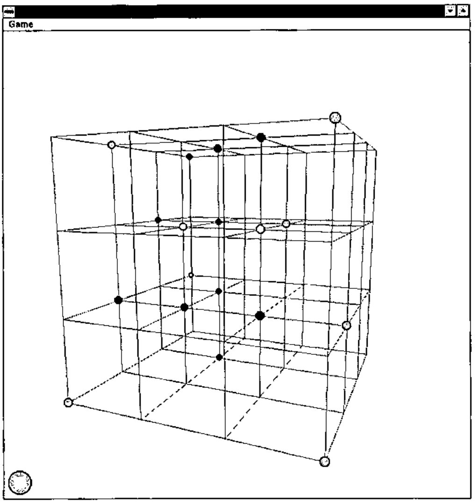
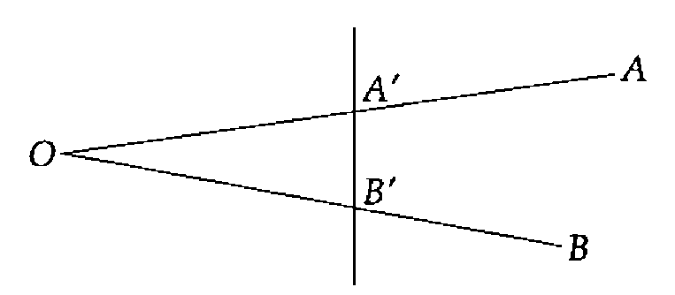
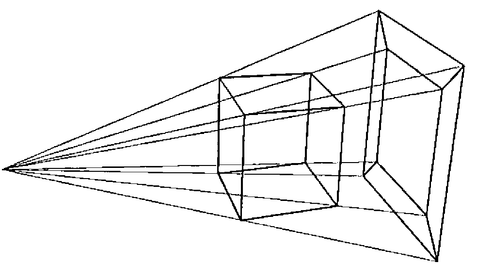
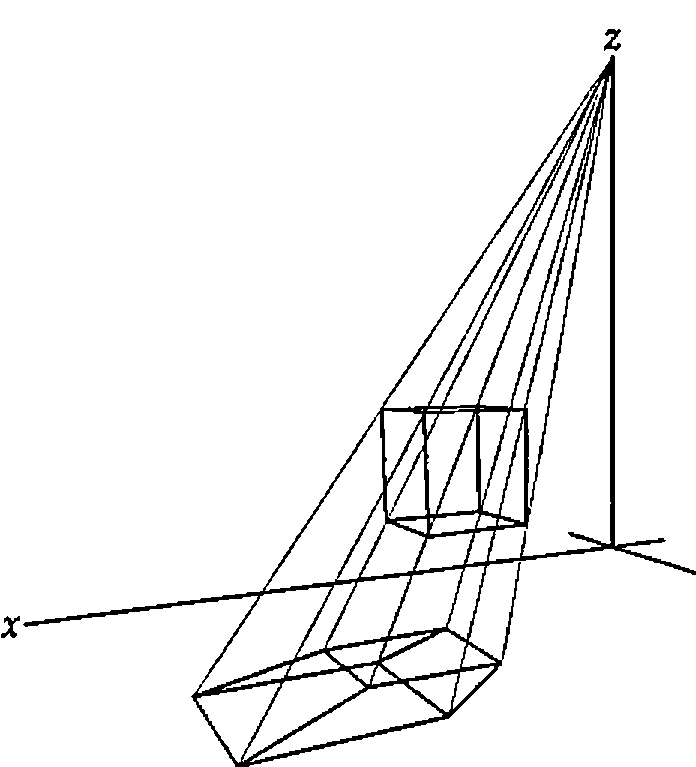
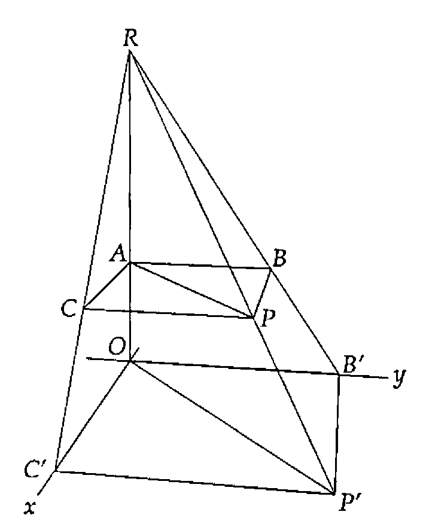
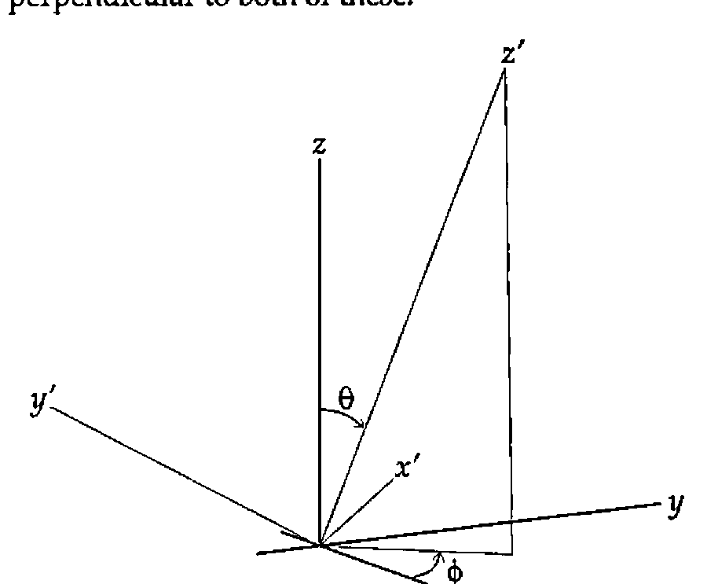

*by Duncan Pearson*
{ .byline }

This year’s ***Vector Christmas Gift*** (albeit one month late) is a working version of the game of three-dimensional noughts and crosses. The game allows two players to play against each other on one computer. The ***Vector Christmas Competition*** (also late, and described in detail later) is to devise an algorithm to enable the computer to play.



In the game a cubic wire frame with *n*×*n*×*n* points is projected onto a window and using the keyboard the player can move the position from which it is seen up, down, left, right, in or out. The player selects a node on the cube with the mouse and a piece of his colour is placed on it. The turn then passes to the other player. The game is won when, by placing his counter, a player completes a straight line of *n* counters of his colour. A good game can be played with *n* equal to four. The game is not a trivial win for the first player but it is nonetheless possible for a better player to get a win, and some interesting tactics can be used.

I wrote the game primarily to understand how to project 3-d shapes onto a surface and most of the code, together with most of this article, is concerned with that. I will briefly explain the purpose of the game and then go into how I approach the problem of projection, finishing with the code and how that implements it. The code is written in Dyalog APL/W with `⎕IO` zero and `⎕ML` three (the highest APL2 compatibility available).

## Projection

The problem is to make a two-dimensional picture appear to the observer as if it were a three-dimensional object. This means that the light rays coming from the picture into the eye of the observer[^1] must follow the same paths as they would coming from the 3-d object.



In the diagram, the light from A (part of the object) to O (the observer) is following the same path as the light from A′ to O, so as far as the observer is concerned A and A′ are the same point. Similarly BO and B′O follow the same path and so B and B′ are the same from the observer’s point of view (literally).

If we had a 3-d shape which we wished to draw, a cube say with eight vertices, we could place a piece of card beyond the cube, make a line between the eye and each vertex, and extend them until they hit the card.

The eight marks on the card would be a projection of the cube onto the card and, if viewed from the position of the eye, would look like a cube:



To do the work on a computer we must calculate where the lines would pierce the card. The points of our 3-d object are represented by *(x, y, z)* co-ordinates as is the position of the observer. The card is a plane (which in co-ordinate geometry is represented by a linear equation in *x*, *y* and *z*) and we must find where the lines between the object points and the observer point intersect the plane.

The algebra involved is normally quite convoluted but there is one case where it is much simpler. If the observer is sitting on the Z axis (*x*=*y*=0) and the card is the XY plane (*z*=0) then we have the situation shown below:





Taking one point of the object P (at *(x, y, z)*) and looking at its projection P′ (at *(x′, y′, 0)*) in the XY plane, with the observer at the point R *(0, 0, r)* we can draw two similar triangles RAP and ROP′. As the triangles are similar the ratio of the distances RP′ to RP is the same as the ratio of RO to RA. That ratio is *r/(r-z)*.

Taking the similar triangles RBP and RB′P′ we have the ratio B′P′ to BP the same as RP′ to RP; but the length of BP is *x* so the length of B′P′, the X component of P′, is *xr/(r-z)*. Clearly the same holds true for C′P′, the Y component, and so we have the position of P′ as *(xr/(r-z), yr/(r-z), 0)*.

The procedure of projecting a wire frame object is to project the co-ordinates of the vertices onto the plane then to join on the plane the projections of any pairs of points that are joined in the object.

This is shown in the functions *Draw* and *DrawPoints* below.

```apl
 Draw
⍝ Project points from the current position then redraw the lines and circles
 projected←theta phi Transform points
⍝ Find the order in which to draw the points, those at the back first
 order←⍋projected[;2]
⍝ Calculate the size for the circles
 size←0.05×R÷R-projected[;2]
⍝ Project onto the XY plane
 projected←projected[;0 1]×2/,[0.1]R÷R-projected[;2]
⍝ Draw the wire frame
 'form.lines'⎕WS'points'(⊂[1 2]⌽projected[lines;])
⍝ Draw the taken points
 DrawPoints
─────────────────────────────────────────────────────────────

 DrawPoints;lv
⍝ Draw the taken points
 lv←×colour[order]
 'form.points'⎕WS('points'((1.2-↑⌽⍴wins)ref ⌽lv⌿projected[order;]))
                 ('fillcol'((player,lv/colour[order])⌷¨⊂0 255 0))
                 ('radius'(0.15,lv/size[order]))
```

This function has the added complication of needing to adjust the radii of the circles representing the counters. For relatively small circles it is a good approximation that the size of the circle increases in the same ratio as the X and Y co-ordinates of its centre[^2].

So, we can now draw any object as though we were looking down on it from above the origin. To draw it seen from another position we need to make a modification before we do the projection. The co-ordinates of the points of the object are given relative to a particular fixed set of axes. There is no reason why, for the purpose of the projection, we shouldn’t choose our own axes and change the object co-ordinates so that they are relative to the new axes.

If we choose a new Z axis from the observer to the origin, and a new X axis perpendicular to it and in the old XY plane, then the direction of the new Y axis is defined as perpendicular to both of these:



In the game (remember the game) we move the observer not by specifying his co-ordinates relative to the base axes, but by giving (or rather by changing) his latitude and longitude and his distance from the origin. This gives, in the game, an impression of moving smoothly in a circle round the object, or of moving into or out from the object. So the observer is defined by two angles and a distance *r*, relative to the original axes. The first angle, which I have called *theta* (θ) throughout, is the angle between the fixed Z axis and OR, the line between the origin and the observer. The second angle *phi* (φ) is the anticlockwise angle between the fixed X axis and the projection of OR in the fixed XY plane.

These quantities (*r*, θ, φ) are known as the spherical polar co-ordinates of the observer.

## Transforming the Co-ordinates

In order to get the X co-ordinate of a point relative to the new X axis we need to take the scalar product (using `+.×`) of its co-ordinates (relative to the old set of axes) with the co-ordinates of a point one unit along the new X axis. This point is at *(-sin*φ*, cos*φ*, 0)* so the X co-ordinate of P *(x, y, z)* relative to the new X axis is *y*cosφ − *x*sinφ. Similarly to get the new Y co-ordinate we take the scalar product with a point one unit along the new Y axis, &c.

If we had a matrix M with each **row** the co-ordinates of a unit vector along the respective axis then `M+.×P` would be the full co-ordinates of P relative to the new axes. If we had a matrix N with each **column** a point in an object, then `M+.×N` would be the new set of co-ordinates — the object relative to the new axes. So all we need is the matrix M.

Calling the points one unit along the X, Y and Z axes U<sub>x</sub>, U<sub>y</sub> and U<sub>z</sub> respectively, we have.

```text
Ux  = (     -sinφ,       cosφ,     0  )
Uy  = ( -cosθ cosφ,  -cosθ sinφ,  sinθ )
Uz  = (  sinθ cosφ,   sinθ sinφ,  cosθ )
```

which gives us our matrix.

This gives us the following function which takes a left argument of theta and phi and a right argument of a matrix of points and returns the points relative to the axes defined by theta and phi.

```apl
 r←angles Transform points;theta;phi;sinT;sinP;cosT;cosP;rotmat
⍝ Return the matrix <points> in the co-ordinate system defined by <angles>
⍝ Each row of <points> represents the x, y, and z co-ordinates of a point
⍝ The new axes are defined as follows :-
⍝  X - in the old XY plane at <phi> anticlockwise from the old Y axis
⍝  Y - normal to the new ZX plane
⍝  Z - at <theta> to old Z with its projection in old XY at <theta> to old X
 theta phi←angles
⍝ Construct the rotation matrix
 sT sP cT cP←,1 2∘.○theta phi÷180
 rotmat←3 3⍴(-sP)cP 0(-cT×cP)(-cT×sP)sT(sT×cP)(sT×sP)cT

⍝ This is equivalent to ⍉rotmat+.×⍉points
 r←points+.×⍉rotmat
```

So the process of projecting the wire-frame object onto a plane perpendicular to the line from the observer to the origin can be summarised:

- collect the unique set of points of the wire frame
- generate a new set of axes with the observer on the new Z axis
- find the co-ordinates of the points relative to the new axes
- project the points onto the new XY plane
- join the projections of any points that are joined in the old object

## The Mechanics of the Game

The code is in three parts. The function *Make* sets up the form, menu, lines and points and puts event handlers on the form for *KeyPress* and *MouseDown*. It also sets up the co-ordinates of the points, the pairs of points joined by lines and the sets of points that signify a win if occupied by the same colour.

```apl
 Make n;inds
⍝ Set up 3-d Os and Xs game for n×n×n
⍝ Create form with lines and circles and initialise global variables

⍝ Set up globals for point co-ordinates, line indices and win-line indices
 points←(⍉(3⍴n)⊤⍳n*3)-(n-1)÷2
 inds←n n n⍴⍳n*3
 wins←((⍳3)⌽¨⊂⍳3)⍉¨⊂inds
 wins←↑⍪/((⊂3⍴0)⍉¨(1↑wins),⌽¨wins),((⊂0 1 1)⍉¨wins,⌽¨wins),,[0 1]¨wins
 lines←,[0 1](1⌽n↑1 1)/↑⍪/((⍳3)⌽¨⊂⍳3)⍉¨⊂inds

⍝ Set up the state of the game
 colour←(n*3)⍴0
 player←1

⍝ Set up the viewing position
 R theta phi←(3×n)90 180
⍝ Make the form and its component parts
 'form'⎕WC'form'('sizeable' 0)('visible' 0)('3d' 'none')
          ('coord' 'pixel')('size'(2⍴¯60+⌊/↑'.'⎕WG'devcaps'))
 'form'⎕WS('xrange'(1-n)(n-1))('yrange'(n-1)(1-n))
 'form'⎕WS'event'('KeyPress' 'Spin')('MouseDown' 'Place')
 'form.lines'⎕WC'poly'(2 2⍴0 0 1 1)('coord' 'user')('fcol'(⊂192 192 192))
 'form.points'⎕WC'circle'(0 0)('fstyle' 0)('coord' 'user')('radius' 0.05)
 'form.menu'⎕WC'menubar'
 'form.menu.game'⎕WC'menu' 'Game'
 'form.menu.game.new'⎕WC'menuitem' 'New'
                        ('event' 'Select' '⍎colour[]←0 ⋄ Draw')

⍝ Draw the current state of the game from the current position
 Draw

⍝ Show the form and pass focus to it
 'form'⎕WS'visible' 1
 ⎕NQ'form' 40
```

The handlers for *KeyPress* and *MouseDown* contain the other two parts of the code. The *KeyPress* handler adjusts the position of the observer and draws on the form the projection of the game relative to that position. The cursor keys increase or decrease *theta* and *phi* while the + and - keys decrease and increase *R* respectively (+ was considered more intuitive for "nearer").

```apl
 Spin msg;key;shift
⍝ On a KeyPress increment or decrement <R>, <theta> or <phi>
 key shift←¯2↑msg
⍝ <theta> is changed on cursor up and cursor down
⍝ <phi> is changed on cursor left and cursor right
⍝ If Ctrl is pressed the change is 15 degrees
 theta phi←theta phi+(1+14×2=shift)×+/2 2⍴¯1 1 ¯1 1×38 40 37 39=key
⍝ R is decremented by + and incremented by -
 R←3⌈R+0.2×+/¯1 1×375 378=shift+2×key
⍝ Redraw from the new position
 Draw
```

The *MouseDown* handler handles the playing of the game. It compares the mouse position (adjusted for the x and y range of the form) with the projected positions of the free points and determines which one it is near. The criterion of nearness is that when a counter is placed on the point its projection should encompass the mouse position. It then places a counter of the player’s colour in *colour* at the corresponding position for that point, changes the player and checks for a win.

```apl
 Place msg;pos;range;hit
⍝ Place the current player's counter in the place indicated by the mouse
⍝ If the game is already won leave early
 →0/⍨∨/∧/(3-player)=colour[wins]
⍝ Get the mouse position in XY order and adjust to the form's co-ordinate system
 pos←⌽2↑2↓msg
 range←⊃'form'⎕WG'xrange' 'yrange'
 pos←range[;0]+(-/⌽range)×pos÷⌽'form'⎕WG'size'
⍝ Find the projected points that are near enough to have been hit ...
 hit←((+/2*⍨projected-(⍴projected)⍴pos)<size*2)/⍳↑⍴projected
 →0/⍨0∊⍴hit
⍝ ... and take the first, if it is free
 hit←↑hit
 →0/⍨×colour[hit]
⍝ Set it to this player and change player
 colour[hit]←player
 player-⍨←3
⍝ Draw the taken points
 DrawPoints
⍝ Detect a win and notify
 →0↓⍨∨/∧/(3-player)=colour[wins]
Win:Win_msg((2-player)⊃'Red' 'Blue'),' has won'
```

## Detecting a Win

If any line of *n* points in the cube is all the same colour then the player of that colour has won. The colour of the points is held as a vector of 0s, 1s or 2s with 0 representing an empty point. If reshaped into a cube the vector will map onto the points it represents. To detect a win we need to construct a matrix of *n* columns the rows of which represent all winning lines. Using this to index out of the colour vector we can check to see whether any potentially winning row is all the same colour.

First we make an array of the same shape as the game cube but with as elements the numbers from 0 to *n*<sup>3</sup>-1. The last axis represents our first set of winning lines. If we transpose the array with 1 2 0 and 2 0 1 and take the last axis each time we get the other trivial winning lines. These are the wins parallel to the X, Y and Z axes. We then have two planes of diagonal wins for each transposition. These are given by the 0 1 1 transpose of each array and of its reflection in the last axis. Finally we have the lines connecting the vertices of the cube through its centre. These are given by the 0 0 0 transpose of the array and all its major reflections.

With the 4×4×4 cube this process gives us 76 winning lines of 4 indices. The matrix is set up in the initialisation code and the checking is done each time a counter is placed.

## A Word about *R*

The variable *R* represents the notional distance of the observer from the screen, and is in the units of the wire frame’s co-ordinate system. In order to get a realistic rendering the best thing to do is to measure the distance from your eye to the screen and divide it by the distance on your screen between two adjacent points in the wire frame. While this gives a realistic 3-d representation, for the game a smaller value of *R* is often better, as it "opens out" the frame allowing more differentiation between front and back points.

This whole treatment also assumes that the line between the observer and the centre of the wire frame is normal to the screen. If it isn’t then the eye will detect some distortion. However it is quite surprising how much the human brain will compensate for when it knows that what it is seeing is meant to be cubic.

## The Competition

The competition is to write a function that will play the computer’s move in the game described above, so that a player can play against the computer. The prize will be free registration for one person at APL96 in Lancaster at the end of July.

The entries to the competition will be played against each other in a league and the top two will play a final game. If at any stage one player has taken more than five minutes longer in total than its opponent (on a P90), it will automatically lose the game. These are the only criteria by which entries will be judged.

Each entry should be a dyadic result-returning function (and perhaps some subfunctions) which will be used in the following way.

### Arguments and Result

Left
: a numeric scalar 1 or 2, indicating for which player the move should be made

Right
: a numeric vector of length `n*3`, with elements 0, 1 or 2. If reshaped into a cube each element will correspond to a position on the board, 0 indicating that it is free and 1 or 2 indicating that it is occupied by a piece of the corresponding player.

Result
: the origin-0 index of the position in the right argument in which to place the player’s piece

The function will be run with a 4×4×4 board under Dyalog APL/W with `⎕IO` zero and `⎕ML` three. Both of these system variables can be localised. The migration level is relevant only to second generation features and determines the level of compatibility with APL2, 0 for least and 3 for most.

**All entries should be received by the editor on or before 1st March 1996.**

[^1]: Observers are assumed, for simplicity, to have had one eye removed or to be descendants of the legendary Cyclops. For a discussion of the effect of two eyes on the calculations see E.A. Clough, *Stereograms in J*, Vector 11.4 pp 110–116

[^2]: This is only inaccurate with very large balls, where it is the solid angle subtended by the ball that is what must be represented, or with balls at the periphery of the observer’s vision that need to be represented on the flat plane as ellipses. Neither of these conditions is true of the game.
