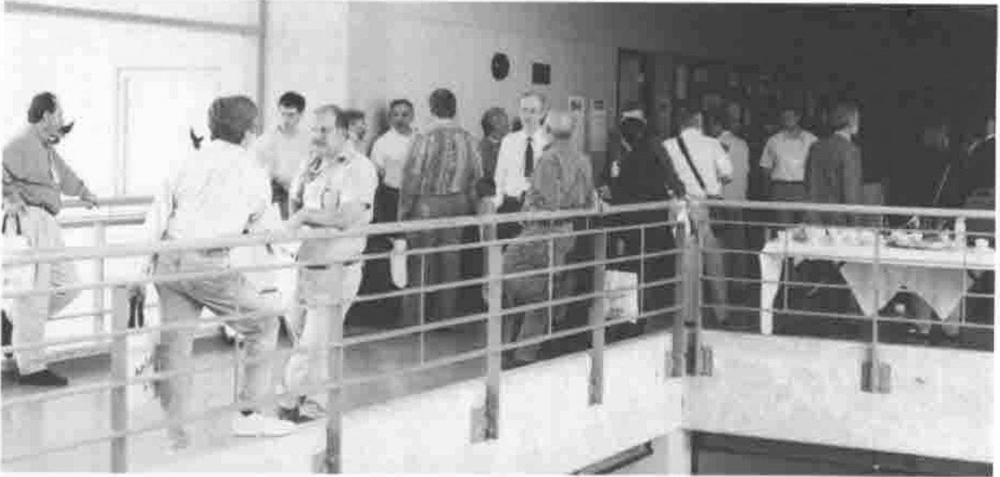
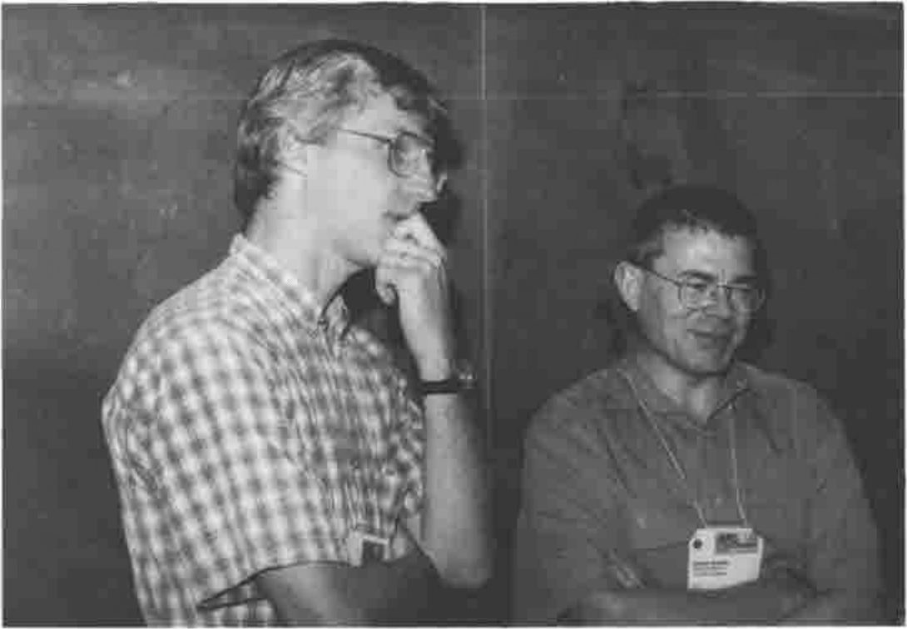
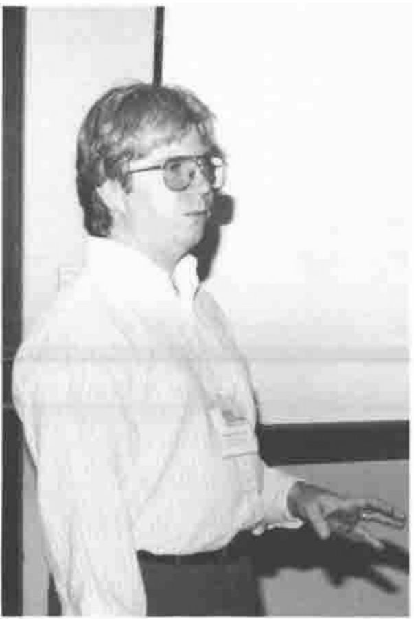
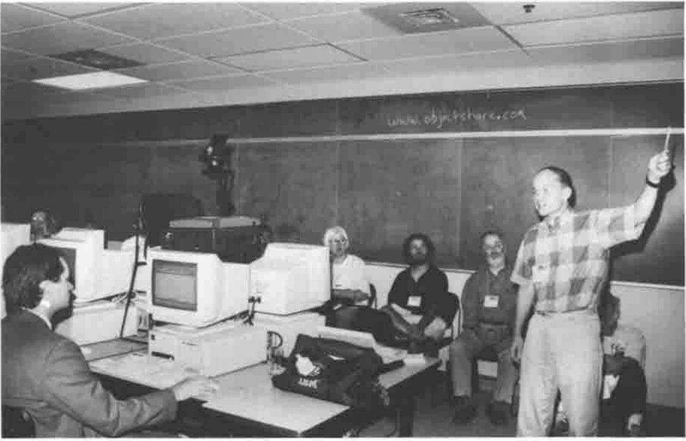
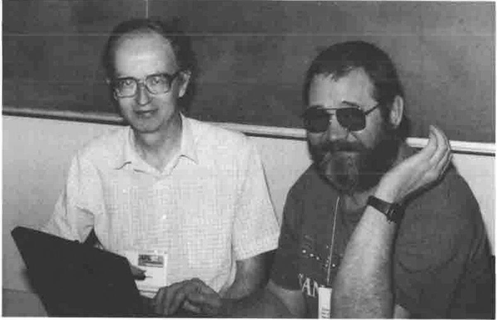
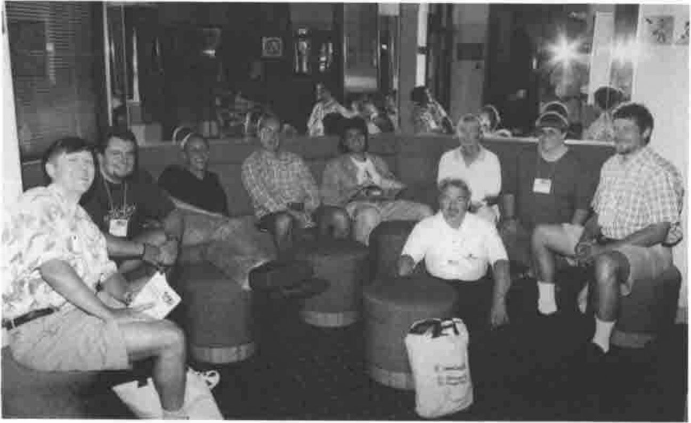

*by Adrian Smith*
{ .byline }

## Conference Roundup

*See above!* This was the best APL conference I have been to, when rated on the yardsticks of value for money, facilities and organisation. It was packed with useful stuff, scheduled tightly over 3 days and run by the Toronto team with a careful eye on the budget and cash flow. They not only charged Vector $25 (the going rate) for the photos available ‘over the counter’ on the final afternoon, but offered to mail us the extras taken that day "for a few dollars more". I am sure they made money, and I hope secured the future of their APL interest group for many years to come — very well done!



The First-floor Landing at Ryerson during Coffee Break
{ .caption }

I also enjoyed Ian Sharp’s opening talk, and I find myself increasingly on the side of the Luddites when it comes to the APL2 extensions to his original one-bladed penknife that was VS APL. I think that if we had added rank, control structures and strings to the original definition back in 1976 we might still be up with Pascal and C++ as mass-market languages. I particularly appreciated the exchange between Ian and Jim Brown who pointed out that IBM had extended the penknife concept to something more general purpose, that would cut paper, twine, etc. etc. Ian added (almost *sotto voce*) "… and Sequoia trees" which pretty well sums it up for me.

## Chris Burke on OpenGL Programming

Chris gave a very thorough introduction to the OpenGL concepts, and worked carefully through many of the sample scripts which are shipped with the J product. However he was careful to point out that the OpenGL calls are available to any Windows product, so there is no reason why you should not do all this stuff in APL+Win or Dyalog APL. All they have provided in J is a ‘foreign conjunction’ to streamline the interface.



Cliff Reiter with Chris Burke
{ .caption }

### Background to OpenGL

"Silicon Graphics" is a company which started as a purveyor of high-end special effects to the movie and advertising industry. They gradually accreted a library of functions for creating near-realistic images of geometric objects; initially these required enormously expensive and powerful Unix workstations to be effective, but the Intel platforms are catching up fast and so Silicon Graphics licensed the libraries to Microsoft for shipping with Win95 and NT. They are well demonstrated by several of the 32-bit screen-savers such as ‘Pipes’.

J provides a very direct interface (Chris recommended that you buy the *OpenGL Programmer’s Guide*, Addison Wesley, 0-201-46138-2) which is at the same level as that offered to C programmers but much easier to experiment with, as you can try things out and see the results on the fly. Naturally, J also hides boring things like data-type conversions so you can be that little bit less fussy about the exact function arguments.

### Why Bother?

Chris gave three reasons:

(a) to have a lot of fun

(b) to render 3D graphics well. OK, you can do nice tiled mesh surfaces in J already, but these look blotchy without the artificial mesh, and they render poorly on monochrome devices (like printers). Higher resolution just adds processing and yields a finer degree of blotch! You also can never solve tricky problems like hiding the axes correctly when rendering a complex surface. Probably you just give up and box the entire graphic.

(c) Many fewer steps are required for smooth surfaces. OpenGL has splines built in, and the system defaults work well for you under most circumstances.

### Interfaces at several levels

Chris started by showing the workings of OpenGL at the lowest level using functions like:

> `glColor` — at least in J you just need one of these for all sensible arguments
>
> `gluSphere` — things beginning `glu` are OpenGL utilities which bundle many commands into a single call
>
> `glare` — a J interface addition to create a "render context"

So you can open the supplied script and experiment with simple line drawings such as:

```text
glreset
vd Formdef  NB. a normal J window
glare
vd 'show;ontop'
glClearColor 0 0 1  NB. Red Green Blue (0-1)
glClear GL_COLOR_BUFFER_BIT
glSwapBuffers   NB Now it goes blue!
```

*Question – what affects which buffer?* Not absolutely clear, but updates seem to merge with the ‘back’ buffer, for example if we swop buffers again the window stays blue! Experimentation is probably the best course — as a last resort read the book!

```text
NB. red triangle
....
glBegin GL_POLYGON
  glVertex 1 0 0
  glVertex 0 1 0
  glVertex _1 0 0
glEnd
```

As you can see, this involves learning a lot of new vocabulary and a script stacked with the kind of capitalised constants beloved of C programmers. However once you have made your simple shape you can get OpenGL to manipulate it.

Rotations can be nicely handled in J, particularly given the concept of function rank. You start with `glLoadIdentity` to set the current transformation to the unit matrix then use a ‘rotation’ function (rank-1) to make for easy XYZ rotations. Similarly you should define `glVertex` etc. as rank-1 so that they can take a matrix of point co-ordinates and iterate automatically over the rows.

### Working with OpenGL Utilities

*DisplayLists* are a key component of OpenGL — effectively they store a preset sequence of canned commands which are partially compiled and execute much more efficiently than the same commands run over and over again. Probably you would use such a list for initialisation, then only change the elements that matter at each run. Chris demonstrated with a list to draw a dodecahedron, render the faces in random colours, light it from different viewpoints and so on.

Moving things around is where you can really scramble your brain! Chris started with the dodecahedron at the origin and showed how to move the viewpoint around a notional sphere at various distances from the object (of course you can also see it from the inside if you go in close enough). However you can translate and rotate the object too, and it sensibly spins about its local axes. As Chris amply demonstrated, if you try moving the viewpoint around at the same time as spinning and translating the object, you get some spectacular effects and completely lose any perception of which way is up!

### Summary

Obviously, most of what OpenGL does is visual, and notes like this fail to do it justice. I suppose the thing which has been bugging me since Toronto is "OK, but what would I use it for?". I don’t make heavy use of spinning polyhedra, and if I need a photo-realistic image I can use a 35mm camera and a £600 scanner. I do need quality business and statistical graphics, but mostly I can represent the data better with a collection of simple 2D charts. The time taken to calculate and render anything other than the simplest scenes rules this technology out for any kind of interactive animation — such as allowing the user to spin your tower chart around — so we are left with the maths community who want to visualise the complex shapes that emerge from their equations. Is this really such a big advance from a good wireframe or open mesh surface? It would be great to have an opportunity to play with this stuff, but to hark back to Chris’s initial set of bullet points, the only honest answer to why bother would be *"(a) to have a lot of fun"*. I would love to be proved wrong.

## A Flavour of APL97

*photographs by Richard Proctor*

### Workshops


Eric Lescasse on Object-oriented Programming
{ .caption }



Chris Lee on User-defined Classes in APL+Win
{ .caption }

### More Workshops …


Chris Lincoln & Son
{ .caption }


Richard Brown, Roger Hui with Jim Lucas in the background
{ .caption }



Timo Laurmaa with his Web server
{ .caption }

### Relaxing …


Jim Brown plays Guitar
{ .caption }


Alan Graham also …
{ .caption }


COSY in the Snug at McVeighs
{ .caption }

### Time to do some Real Work …



Adrian Smith and Sasha Skomorokov working on AP205
{ .caption }



The Adaytum Team Reflecting
{ .caption }
