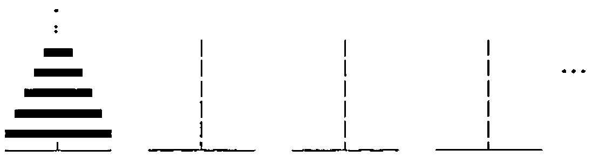

*by Howard A. Peelle*
{ .byline }

J programs are defined for computing the minimum number of moves to solve the Towers of Hanoi puzzle for any number of discs and any number of pegs — including a new closed form solution.

## Introduction

The Tower of Hanoi puzzle is traditionally presented with 3 pegs and a small number of discs of different sizes, all stacked on one peg in increasing order. The puzzle involves moving one disc at a time from one peg to another while never placing a larger disc on top of a smaller disc. The goal is to move all discs to another peg.

Generalized to N discs, the Towers of Hanoi (sic) is often used to illustrate recursion in teaching computer science (as in [0]) and has been studied extensively for over a hundred years [1]. A simplified algorithm and J programs for generating optimal moves were defined recently [2]. It is well known that the minimum number of moves is (2^N)-1. Extending this solution to 4 pegs or more, however, has been regarded as a difficult challenge [3].

## General Towers of Hanoi

Here the puzzle is generalized to P pegs, as well as N discs; and J programs are developed to compute the minimum number of moves required for this "General Towers of Hanoi".



A fundamental recursive algorithm (based on a presumed optimal algorithm for 4 pegs cited in [4],[5]) is to move a certain number of discs off the top of the start peg onto another peg temporarily, then move the remaining ‘bottom’ discs off the start peg onto the goal peg, and then move the ‘top’ discs onto the goal peg. The question is: how many top discs? Surely the minimum number of moves is the minimum of the sum of three lists of moves for all possible numbers of DISCS from 1 to N-1 — that is, moves for the top DISCS using all P pegs plus moves for the bottom N-DISCS using P-1 pegs plus moves for the top DISCS using P pegs (again). An initial J program for this is:

```text
Else =: `                          NB. Else is Tie
When =: @.                         NB. When is Agenda
DONE =: +:@(P < 2:) >. (N < 2:)    NB. DONE is (Double Atop (P<Two))
                                   NB.   Larger (N<Two)
MOVES =: Min@(TOPS + BOTTOMS + TOPS) Else N Else _: When DONE
                                   NB. MOVES is (((Min Atop (TOPS +
                                   NB.   (BOTTOMS + TOPS))) Else N) Else
                                   NB.   Infinity) When DONE
 Min =: <./                        NB. Min is Smaller Insert
 Each =: "0                        NB. Each is (input verb) Rank Zero
 TOPS =: P MOVES Each DISCS        NB. TOPS is P (MOVES Each) DISCS
 BOTTOMS =: (P-1:) MOVES Each N-DISCS NB. BOTTOMS is (P - One) (MOVES Each)
                                   NB.   (N-DISCS)
  P =: [                           NB. P is Left input
  N =: ]                           NB. N is Right input
  DISCS =: i.@N -. 0:              NB. DISCS is (Integers Atop N) Less 0
```

Examples:

```text
   3 MOVES 10                      NB. MOVES for 3 pegs and 10 discs
1023

   4 MOVES 10                      NB. 4 pegs, 10 discs
49

   5 MOVES 10                      NB. 5 pegs, 10 discs
31
```

The `MOVES` program handles any P with any integral N, although only integral P>0 and N>:0 are meaningful. Note that the default value for P=2 with N e. 0 1 is N, and with N>1 is infinity (`_`) to indicate that the puzzle is not solvable.

In general, this is terribly inefficient due to the exhaustive recursions. We could build in knowledge of the 3-peg solution to bypass several levels of recursion throughout by avoiding the degenerate P<3 cases and economize the coding:

```text
MOVEs =: Min@(+:@TOPs + BOTTOMs) Else Solution When Done

NB. MOVEs is ((Min Atop ((Double Atop TOPs) + BOTTOMs)) Else Solution)
NB.   When Done

TOPs =: P MOVEs Each DISCS
BOTTOMs =: (P-1:) MOVEs Each N-DISCS
Solution =: (2: ^ N) - 1:          NB. Solution is (Two Power N) - One
Done =: (P=3:) +. (N < 2:)         NB. Done is (P = Three) Or (N < Two)
```

Examples:

```text
   Table =: Each/                  NB. Table is ((input verb) Each) Table

   3 4 5 6 MOVEs Table i.11 NB. MOVEs Table for 3,4,5,6 pegs and 0 to 10 discs
0 1 3 7 15 31 63 127 255 511 1023
0 1 3 5  9 13 17  25  33  41   49
0 1 3 5  7 11 15  19  23  27   31
0 1 3 5  7  9 13  17  21  25   29
```

But this is still impractical. So, we propose a direct way to find the optimal number of discs D to move off the top (for P>3): round off the sum of the first N items of a list of copies of ratios of adjacent items in the P-3 diagonal of Pascal’s Triangle, where the numbers of copies are respective items in that diagonal (see subprogram `D`).

```text
MOVes =: (+:@TOP + BOT) Else Solution When Done
  TOP =: P MOVes D
  BOT =: (P-1:) MOVes N-D
   D =: [: <. [: +/ N {. COPIES@PASCAL

NB. D is Cap Floor (Cap Sum (N Take (COPIES Atop PASCAL)))

COPIES =: # Ratios                 NB. COPIES is input Copy Ratios
 Ratios =: %~ 0: , }:              NB. Ratios is input (Divide Commute)
                                   NB.   (Zero Append Curtail)
PASCAL =: (P-3:) Diagonal i.@N     NB. PASCAL is (P - Three)
                                   NB.   Diagonal (Integers Atop N)
 Diagonal =: [ ! +                 NB. Diagonal is Left input
                                   NB.   Out-of Plus
```

Note that in program `D` a rounding function or ceiling (`>.`) could be used instead of floor (`<.`) and that `MOVes` returns a domain error, appropriately, for degenerate P<3 with N>1.

This program is much better, but it demands more and more memory as N increases because of many unnecessary copies of the `PASCAL` diagonal. We can calculate how much is enough of the diagonal to truncate:

```text
 D =: [: <. [: +/ N {. COPIES@(P PASCAL >:@Enuf)
NB. ... COPIES Atop (P PASCAL (Increment Atop Enuf))

  Enuf =: N +/ . > (P-2:) Diagonal i.@N
NB. Enuf is N (Sum Dot >) ((P-Two) Diagonal (Integers Atop N))
```

Tracing an example — `4 MOVes 11` — illustrates how this program works:

```text
NB. Computing 4 Enuf 11

   ,diagonal =: (4-2) Diagonal i.11  NB. 11 items of 2nd diagonal
1 3 6 10 15 21 28 36 45 55 66

   ,enuf =: 11 +/ . > diagonal       NB. Sum of 11 > items in diagonal
4

   >:enuf                            NB. Length of diagonal needed
5                                    NB. Computing 4 PASCAL 5
   ,pascal =: (4-3) Diagonal i.5     NB. Truncated 1st diagonal
1 2 3 4 5                            NB. Computing COPIES 1 2 3 4 5
   Ratios pascal                     NB. Ratios of adjacent items
0 0.5 0.66667 0.75 0.8

   ,copies =: pascal # Ratios pascal NB. Copies of Ratios
0 0.5 0.5 0.66667 0.66667 0.66667 0.75 0.75 0.75 0.75 0.8 0.8 0.8 0.8 0.8

                                     NB. Computing 4 D 11
  ,first =: 11 {. copies             NB. First 11 items
0 0.5 0.5 0.66667 0.66667 0.66667 0.75 0.75 0.75 0.75 0.8
  ,d =: <. +/ first                  NB. Floor of sum
                                     NB. Computing 4 BOT 11
  ,bot =: (4-1) MOVes (11-6)         NB. MOVes for 3 pegs, 5 discs
31                                   NB. (computed similarly by recursion)

                                     NB. Computing 4 TOP 11

  ,top =: 4 MOVes 6                  NB. MOVes for 4 pegs, 6 discs
17                                   NB. (computed similarly by recursion)

                                     NB. Computing 4 MOVes 11
  (+:17) + 31                        NB. (Double top moves) + bottom moves
65

  4 MOVes 11
65
```

Nevertheless, `MOVes` is still inefficient for large N due to the (double) recursion. So, we seek a direct solution.

## Closed Form Solution

A new direct algorithm for solving General Towers of Hanoi is: sum the first N powers of 2 copied by the P-3 diagonal of Pascal’s Triangle. Here is an initial program for this:

```text
MOves =: [: +/ N {. POWERS         NB. MOves is Cap Sum (N Take POWERS)
 POWERS =: 2: ^ PASCAL # i.@N      NB. POWERS is Two Power
                                   NB.   (PASCAL Copy (Integers Atop N))
  PASCAL =: (P-3:) Diagonal i.@N
   Diagonal =: [ ! +
   P =: [
   N =: ]
```

Note that here the degenerate result for P=2 with any N>0 is 1, which can be interpreted to mean that only one move is possible.

This program can be greatly improved by the following modifications, designed strictly for P>2 pegs and N>:0 discs.

```text
Moves =: 2: +/ . ^ N {. P Copies i.@>:@Enuf
                                   NB. Moves is Two (Sum Dot Power)
                                   NB.   (N Take (P Copies ((Integers Atop
                                   NB.   Increment) Atop Enuf)))
 Copies =: Pascal # ]              NB. Copies is Pascal Copy Right input
  Pascal =: (P-3:) Diagonal ]      NB. Pascal is (P - Three)
                                   NB.   Diagonal Right input
```

For instance, with inputs P=4 and N=1000 on a Pentium PC running J4.01, speed is increased by a factor of more than 700, and space is reduced by a factor of about 200.

As an alternative, consider the following program which generalizes the formula for 4 pegs from [4]: sum the product of enough of the `Pascal` diagonal times enough powers of 2, minus an extra amount to compensate for how much N is exceeded by the sum of the diagonal (the corresponding item in the next Pascal diagonal):

```text
SM =: Sum - Extra                  NB. SM is Sum - Extra
 Sum =: P (Pascal +/ . * Power) i.@>:@Enuf
 NB. Sum is P (Pascal (Sum Dot Times) Power)
 NB.     ((Integers Atop Increment) Atop Enuf)
  Pascal =: (P-3:) Diagonal ]
  Power =: 2: ^ ]          NB. Power is Two Power Right input
 Extra =: (N -~ (P+1:) Pascal Enuf) * Power@Enuf
 NB. Extra is (N (- Commute) ((P + One) Pascal Enuf))
 NB.     Times (Power Atop Enuf)
```

This can be improved by extending the Pascal diagonal instead and by avoiding redundant computations — making it about 3 times faster, using about half the space:

```text
M =: (+/ . * Powers)@(N Extend P Pascal i.@Enuf)
NB. M is (input (Sum Dot Times) Powers) Atop
NB.     (N Extend P Pascal (Integers Atop Enuf))

 Powers =: 2: ^ i.@#
 NB. Powers is is Two Power (Integers Atop Tally)

 Extend =: ] , (- +/)
 NB. Extend is Right input Append (left input Minus Sum)

Pascal =: (P-3:) Diagonal ]
 Diagonal =: [ ! +
Enuf =: N +/ . > (P-2:) Diagonal i.@N
```

Tracing an example — `4 M 11` — illustrates how this program works:

```text
   ,enuf =: 4 Enuf 11
4
   ,pascal =: 4 Pascal i.4
1 2 3 4

   ,extend =: 11 Extend 1 2 3 4
1 2 3 4 1

   ,powers =: Powers extend
1 2 4 8 16

   extend +/ . * powers
65

   4 M 11
65
```

This program computes efficiently the minimum number of moves to solve the General Towers of Hanoi puzzle for virtually any number of pegs (P>2) and any number discs (N>:0).

## Further Exploration

If we focus on P=4 pegs, results are easy to obtain when N is a triangular number, as reviewed in [4]. Generalizing this for any P>2, here is a simple program to compute the number of moves needed when N is a number in the P-2 diagonal of Pascal’s Triangle:

```text
Hanoi =: (2: * Row , 0:) + (1: , Row)
NB. Hanoi is (Two Times Row Append Zero) + (One Append Row)

 Row =: ]                          NB. Row is Same input
```

For example:

```text
   Repeat =: ^: (i.`1:)
   NB. Repeat is (input verb) Power (Integers Tie One)

   Hanoi Repeat 10
   1    0    0    0    0    0   0   0  0 0
   3    1    0    0    0    0   0   0  0 0
   7    5    1    0    0    0   0   0  0 0
  15   17    7    1    0    0   0   0  0 0
  31   49   31    9    1    0   0   0  0 0
  63  129  111   49   11    1   0   0  0 0
 127  321  351  209   71   13   1   0  0 0
 255  769 1023  769  351   97  15   1  0 0
 511 1793 2815 2561 1471  545 127  17  1 0
1023 4097 7423 7937 5503 2561 799 161 19 1
```

The items in this table are minimal moves for the General Towers of Hanoi puzzle in row (P-3)+(P Enuf N) and column P-3 (origin 0). For instance, the number of moves for P=4 and N=10 is 49 in row 4 and column 1 (since 4 Enuf 10 is 3).

In this blend of exponential `(2:^N)` and linear `(2:*N)` functions, some interesting patterns emerge. For instance:

```text
   +/"1 Hanoi Repeat 10                    NB. Sum of each row
1 4 13 40 121 364 1093 3280 9841 29524     NB. Compare with +/\3^i.10
```

Also recall that Pascal’s Triangle can be produced similarly:

```text
   PascaL =: (Row , 0:) + (0: , Row)
   NB. PascaL is (Row Append Zero) + (Zero Append Row)

   PascaL Repeat 10
1 0  0  0   0   0  0  0 0 0
1 1  0  0   0   0  0  0 0 0
1 2  1  0   0   0  0  0 0 0
1 3  3  1   0   0  0  0 0 0
1 4  6  4   1   0  0  0 0 0
1 5 10 10   5   1  0  0 0 0
1 6 15 20  15   6  1  0 0 0
1 7 21 35  35  21  7  1 0 0
1 8 28 56  70  56 28  8 1 0
1 9 36 84 126 126 84 36 9 1
```

And there are well-known patterns therein. For instance, the sums of rows (binomial coefficients) are powers of 2:

```text
   +/"1 PascaL Repeat 10                   NB. Sum of each row
1 2 4 8 16 32 64 128 256 512               NB. Compare with 2^i.10
```

Notice how these tables are related. The items in the Hanoi table are minimal moves for items in row (P-2)+(P Enuf N) and column P-2 of the PascaL table. In other words, overlay the two tables and find the result of any PascaL item one row up and one column to the left in Hanoi (as also noted in [5]). For example, for P=4 and N=10 (row 5, column 2 in PascaL table), the result is 49 (row 4 column 1 in Hanoi table). Let’s generalize these programs to handle any pair of coefficients for the addends and any pair of single values to extend each row:

```text
Triangle =: (n * Row , a) + (m * b , Row)
NB. Triangle is (n Times Row Append a) + (m Times b append Row)

   n =: {.@{.@[                    NB. n is (Head Atop Head) Atop Left input
   m =: {:@{.@[                    NB. m is (Tail Atop Head) Atop Left input
   a =: {.@{:@[                    NB. a is (Head Atop Tail) Atop Left input
   b =: {:@{:@[                    NB. b is (Tail Atop Tail) Atop Left input
```

For example, `(2 1,:0 1)&Triangle Repeat 10` produces the same result as `Hanoi Repeat 10` above and `(1 1,:0 0)&Triangle` is equivalent to `PascaL`.

Readers are encouraged to experiment with this program to discover other interesting triangles, including `(2 1,:0 0)&Triangle` — the "Peelle Triangle" [6].

## Acknowledgements

My appreciation for colleague Dr. Alan Lipp’s collaboration on related mathematical analysis continues to grow. Additional thanks for their valuable feedback on previous drafts of this article are due to voluntary reviewers Professors Murray Eisenberg (University of Massachusetts), Keith Smillie (University of Alberta), and Paul Stockmeyer (College of William and Mary).

University of Massachusetts<br>
Amherst, MA 01003 USA

## References

0. Graham, Knuth, and Patashnick (1989) Concrete Mathematics: *A Foundation for Computer Science*, Reading, MA: Addison-Wesley
1. Stockmeyer, Paul K. "The Tower of Hanoi: A Historical Survey and Bibliography" (1998) 200+ references downloadable from www.cs.wm.edu/~pkstoc/h_papers.html
2. Peelle, Howard A. "Towers of Hanoi Simplified in J", Vector, Vol. 12, No. 3 (January 1996) pp. 27-32
3. Poole, David G. "The Towers and Triangles of Professor Claus (or, Pascal Knows Hanoi)", Mathematics Magazine 67 (1994), p. 339
4. Stockmeyer, Paul K. "Variations on the Four-Post Tower of Hanoi Puzzle", Congressus Numeratium 102 (1994) pp. 3-12
5. Lipp, Alan "Computing Solutions to P-Peg Towers of Hanoi" (to appear)
6. Lipp, Alan "The Peelle Triangle" Mathematics Teacher 80 (1987) pp. 56-60
