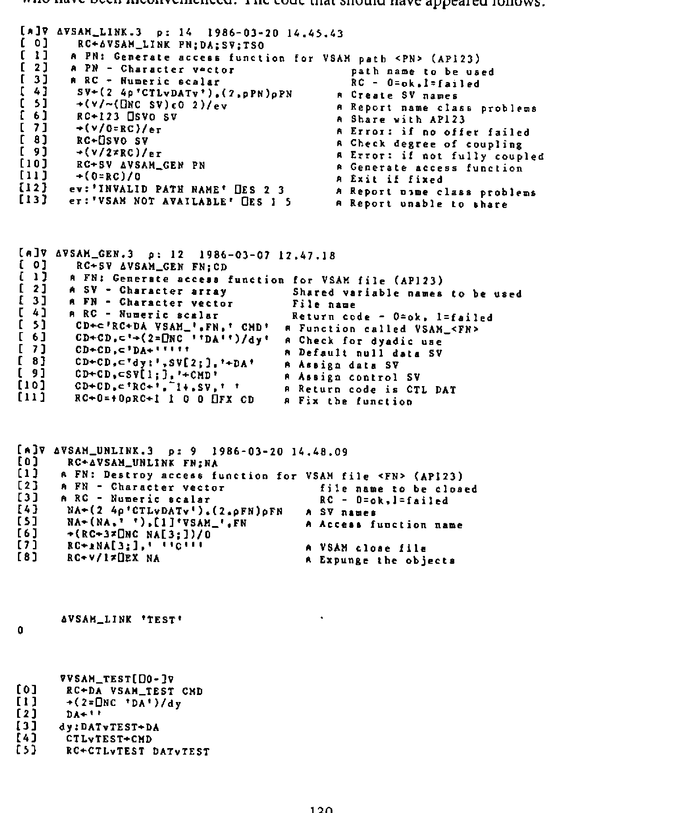
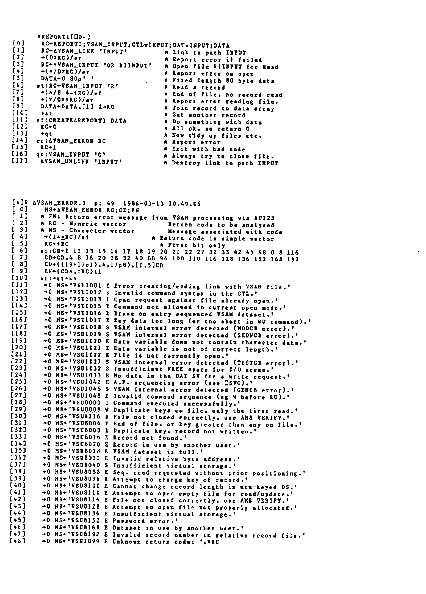

by David Piper
{ .byline }

## 1. Introduction

The requirements for the successful use of files from within APL can be summarised as being:

> Efficient input/output processing  
> A robust, consistent and easy to use interface.

The auxiliary processors associated with the QSAM and BDAM access methods (AP111 and AP210 respectively) are more difficult to use, and generally considered to be less robust than other auxiliary processors associated with file handling in APL (e.g. the VSAM AP, AP123).

Increased difficulty of use arises from the protocols associated with the APs. These are not command driven, but rather depend on the order of assignment/use of the shared variables. The initial values of the shared variables are also crucial, since the file to be accessed is opened at the point of sharing the variables, and closed at retraction, rather than by explicit command after sharing. Also note the data shared variable (prefix REC not DAT) must be shared first.

The APs are considered less robust, since the order of assignment/use of the shared variables is crucial, forming the command interface. Misuse of the variables, in the sense of an incorrect order of assignment/use, can cause the auxiliary processors to abend. If this occurs, the APs may be unavailable for the rest of the TSO session. The QSAM AP is especially prone to this type of failure if only a single (data variable) is shared. In this case, even simple errors, such as attempting to continue processing after end of file, may give rise to an abend in the AP.

## 2. Designing a new interface

The criteria behind the design of an interface to cover the use of the APs are threefold:

> Efficiency of file I/O.  
> Robustness of the interface.  
> Ease of use for the application developer.

Since the cover functions are intended for use within an application, ease of use in terms of flexibility of command specification etc. is given the lowest priority. Efficiency is given the highest priority so the command interface has as little impact as possible on application performance.

In order to minimise the efficiency impact, each command is made as simple as possible to interpret. Once interpreted, the minimum possible code is used to execute each command. The range of commands is extended to include ‘block’ operations to further minimise overheads. During the execution of blocked commands, the command is interpreted once, then executed in a loop, with no more code than would have to be used if shared variables were used directly by the application code.

Further efficiency is gained by avoiding the use of execute for all operations (except the initial opening of a file). The technique used is to fix an access function, with a given name, in which the references to the shared variables are explicitly coded. For a fuller discussion of this technique, see my article in VECTOR 3.2. Robustness is achieved by containing all file operations within the cover functions. This ensures that all uses of the shared variables are executed in the correct order. It also allows a certain amount of error checking to be performed, such as preventing attempts to write data to a file open in read only mode. Error checking at this point also prevents attempts to process files after an end of file condition is received. Thus the major sources of errors within the auxiliary processors are avoided.

Ease of use is improved by removing the need for initialisation of variables before being shared. The open command performs the correct initialisation and performs all checking necessary to ensure the share was successful. From the applications point of view, the complexity of opening the file is reduced to the simple use of a single command. The same can be said of the close command. The cover function takes care of shared variable retraction and checking of return codes.

Ease of use is further enhanced by the use of the same command structure (as far as possible) across both APs. The command structure has been implemented to resemble as closely as possible that implemented for the VSAM auxiliary processor (AP 123). The similarity of the command structures across all three access methods allows file processing to be used far more easily than when making use of a variety of function driven interfaces.

## 3. Creating/Deleting Access Paths

Before any files can be accessed, the path function has to be created (or LINKED). For QSAM files:

```apl
RC←∆QSAM_LINK 'name'   ⍝ <name> is used to customise the
                       ⍝ names of the access path function
                       ⍝ and the shared variables)
```

Commands can then be issued using the path function:

```apl
RC←QSAM_name 'command'        ⍝ Opening, Closing or reading

RC←data QSAM_name 'command'   ⍝ Writing data
```

When file processing is complete, the path function can be erased. The process of UNLINKING issues a close command in case any files have been left open. Paths are deleted using the UNLINK function:

```apl
RC←∆QSAM_unlink 'name'
```

The path function is expunged along with the shared variables.

## 4. Opening and Closing Files

As already discussed, opening and closing files is one of the most complex operations under APs 111 and 210. First the variables have to be initialised:

```apl
CTLQSAM←'filename (ctl'
RECQSAM←'filename (mode conv'
```

After this, the variables can be shared – record variable first:

```apl
SS←111 ⎕SVO 2 7⍴'RECQSAMCTLQSAM'
```

Return codes from the open operation must be checked:

```apl
RC←CTLQSAM
```

Using the command interface, the above steps are reduced to a single line of code (assuming the path has already been linked):

```apl
RC←QSAM_path 'Om filename conv'
```

Acceptable values for \<Om\> – the access mode – are R(ead), W(rite) or U(pdate). BDAM files can additionally be opened for F(ormat) processing. The return code given by the open operation is fully descriptive of any error that may have occurred. The code can be passed to the relevant error message function to obtain a textual description of the error.

When opened for FORMAT processing, the next command given for the file must be the format command:

```apl
RC←data BDAM_path 'F' nnn        ⍝ <nnn> is the number of records
```

The file is then left open in update mode.

The BDAM file interface ensures that the open/format commands are processed in the correct order without intermediate attempts to read and write to the file.

Closing the file is simply a matter of using the close command. This command retracts the shared variables (thereby closing the file), but leaves the path function intact. This allows further file processing to take place, either in a different access mode, or to another file.

## 5. Reading/Writing Data

The only significant differences in syntax between the two file access methods are in the commands associated with reading and writing data. The syntax is bound to be different since BDAM offers direct access to records while QSAM offers only sequential access. BDAM also offers sequential access, the syntax for sequentially processing single records is identical for both access methods.

For efficiency of file access, ‘pseudo-blocked’ access commands are also provided. These read or write a series of records using only one call to the path function. A loop of code within the access function performs the multiple calls to the auxiliary processor. The command is parsed only once, the code loop simply assigning/using the shared variables as required. As soon as a non-zero return code is encountered processing ceases. If a write is being performed, any unwritten records are returned in the data item of the return vector.

To read a single record, the following syntax is used:

```apl
(RC DA)←QSAM_path 'R'                    ⍝ QSAM

(RC DA)←BDAM_path 'R'                    ⍝ BDAM sequential
(RC DA)←BDAM_path 'R' record_number      ⍝ BDAM direct
```

The data is returned as a nested vector, each item of the vector is a record from the file. Since only a single record is read, the vector has only one item.

To perform a ‘blocked’ read:

```apl
(RC DA)←QSAM_path 'R' number_of_records  ⍝ QSAM

(RC DA)←BDAM_path 'R' n1 n2 n3 ....      ⍝ BDAM direct
```

The blocked access terminates as soon as a non-zero return code is encountered. The length of the vector of records (DA) is the same as the number of records read. The return code indicates why the read was abandoned.

To write a single record, the following syntax is used:

```apl
(RC DA)←data QSAM_path 'W'               ⍝ QSAM

(RC DA)←data BDAM_path 'W'               ⍝ BDAM sequential
(RC DA)←data BDAM_path 'W' n1            ⍝ BDAM direct
```

A data vector is always returned, normally this will be an empty nested vector. If a non-zero return code is generated by the write command, the unwritten record is returned.

To perform a ‘blocked’ write:

```apl
(RC DA)←records QSAM_path 'W'            ⍝ QSAM

(RC DA)←records BDAM_path 'W' n1 n2 n3...   ⍝ BDAM direct
```

When performing a ‘blocked’ write using BDAM, records are written until:

> Records are exhausted in the data vector.  
> Record numbers are exhausted in the command vector.  
> A non-zero return code is received.

Any over-written records are returned in the data component of the explicit result. The left argument is a nested vector, each item representing a record to be written. If only a single record is to be written, consisting of a simple vector, this need not be enclosed.

The convention of using a nested vector to contain data records is adopted to enable the use of the VAR conversion option. This option allows APL2 variables of any type, rank or level of nesting to be written to file without conversion. To write a series of such arrays, each is enclosed to form an item of a nested vector which is presented as the left argument.

## 6. Conclusions

The primary aim of any system of functions covering the use of file access auxiliary processors should be to maintain the highest level of efficiency possible. This is true simply because of the number of times the auxiliary processor is likely to be used, especially if file processing is involved.

The concept of a command driven interface also enables the following advantages to be realised:

> Reduction in the number of functions in the workspace.  
> Implementation of a similar syntax across access methods.

Generating a function containing the shared variable names explicitly allows multiple files to be accessed without the need to continually retract/re-offer shared variables, and removes the need to use execute.

*(Editor: David supplied more APL2 code than we have room for here. A listing of the functions produced by the BDAM and QSAM ‘LINK’ functions follows.)*


## Using ⎕FX to facilitate the use of Auxiliary Processors

An article with the above title, written by David Piper, appeared in the last VECTOR (volume 3, number 2). Unfortunately the accompanying APL2 programs which David supplied were accidentally omitted from the article. We apologise to David and any readers who have been inconvenienced. The code that should have appeared follows:




