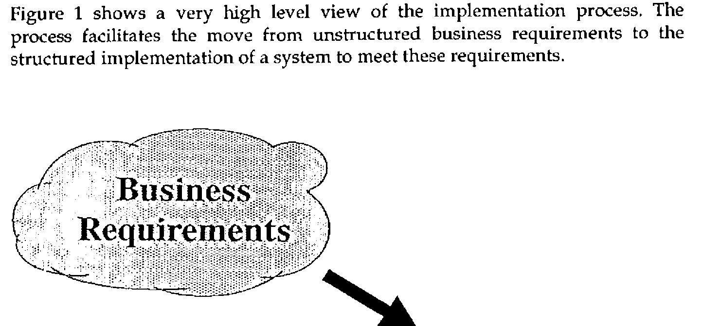
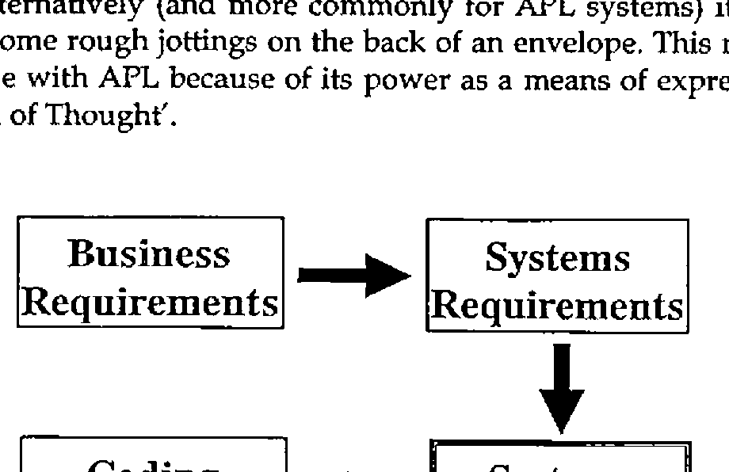
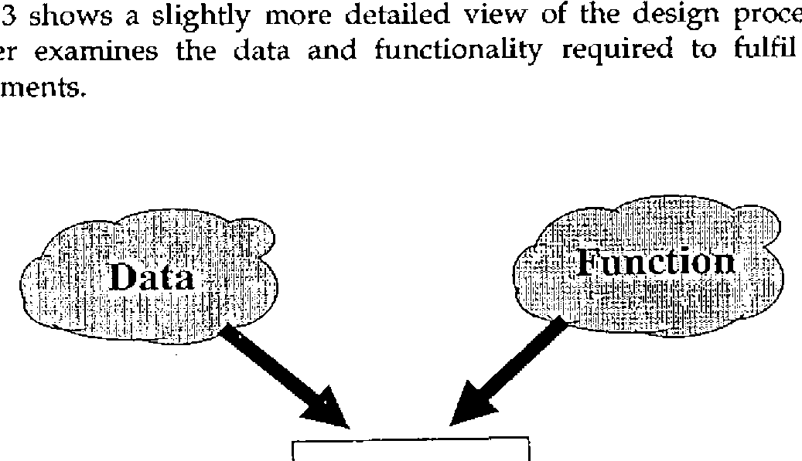
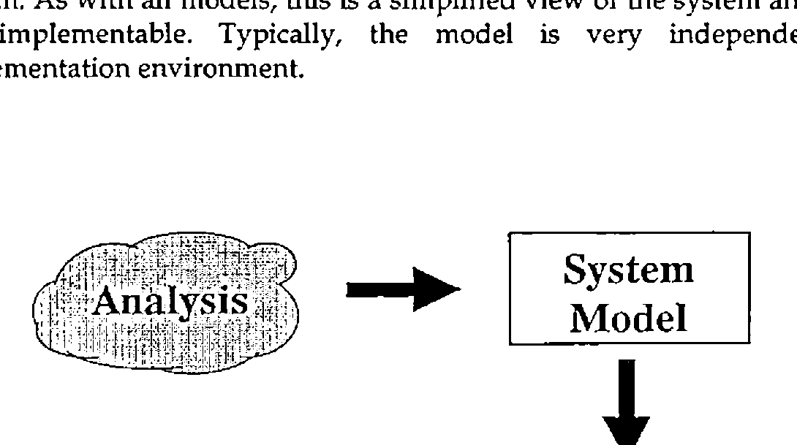
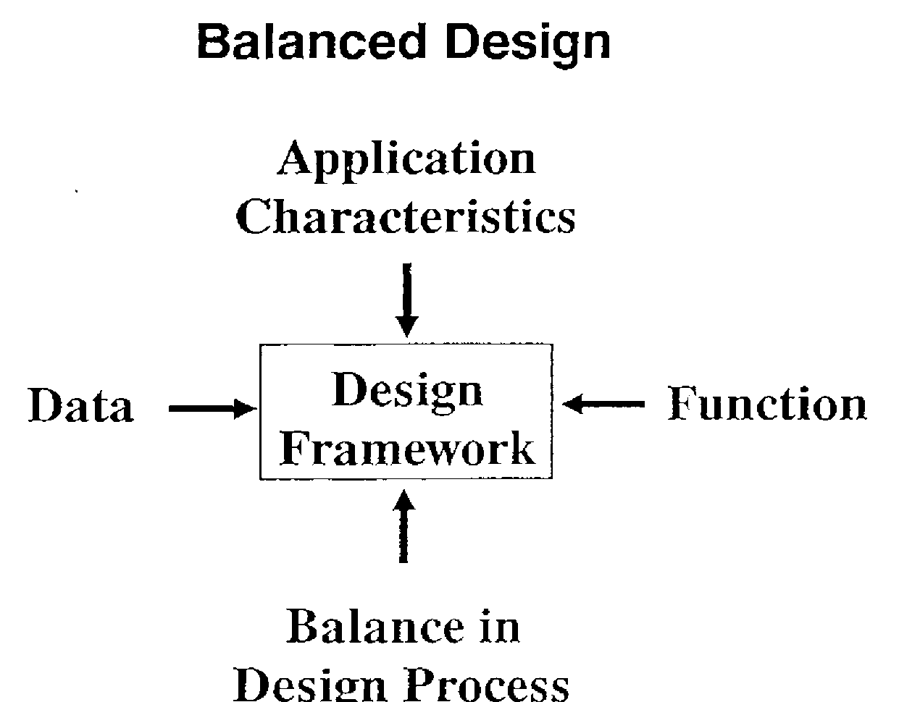

*by Dave Piper*
{ .byline }

## Abstract

This article is based on a presentation made at a meeting of the British APL Association in 1989.

APL is often credited with being the worlds first ‘write once, read never’ computer language. This idea is disputed by professional users of APL who cite many well structured commercial systems as evidence to back up their position. Many experienced APL developers attribute APL’s reputation to its early history. In the early 70s, APL was used by the business community as an end-user language. In the late 70s it was extensively used by IBM in this way; the ADI and ADRS products grew out of this environment.

Both packages addressed widespread business needs, but they were developed without attention to design or quality. They were excellent examples of bad APL, but for many APL users represented the only models available on which design and coding practices could be based. As a result, bad APL programming practices became widespread, and APL’s reputation continued to suffer.

Whatever the truth behind the two sides of the argument, the value of systems design is now widely accepted, even in the APL community. The debate has moved from "should we design?" towards "how do we design?". A more cogent form of the question is "how do we design effectively?".

## Design Economics

Many design methodologies have been created by various large consultancies across the world. These are structured to reflect the monolithic nature of systems implementation using ‘standard’ commercial languages and processing techniques. Systems implemented using APL feature a variety of unusual aspects which render these methodologies less productive:

- susceptibility to change requiring an unusual degree of flexibility and responsiveness in the design and implementation
- a wide range of system ‘size’ requiring a design methodology that can be tailored to fit many different development needs
- parallel processing of data changing the way much of the code is structured

In addition, whatever the view of APL in the world at large, professional APL users seem to be able to deliver function points at a greater rate than users of other languages and techniques. The effects of this higher delivery rate on the design process are important:

- APL projects consume less programmer hours
- less effort can be put into the design process before the marginal cost of design exceeds the marginal benefit in programming

For all these reasons, ‘traditional’ design methodologies may not be suitable for the design of APL systems.

## The Implementation Process

Figure 1 shows a very high level view of the implementation process. The process facilitates the move from unstructured business requirements to the structured implementation of a system to meet these requirements.

*Figure 1: a very high level view of the implementation process.*
{ .caption }

Typically business requirements can be viewed as an amorphous cloud of ideas; they are:

- unstructured
- contradictory
- undocumented
- and even unknown

In contrast, a system should be characterised by the following:

- structured flows and processing of data
- coherent
- compatible (with other systems)
- documented (please!)
- known

We can take a closer look at the implementation process. A typical structure for the process is shown in figure 2. Design is only a single phase within this process - but a very important phase. The input to the design phase is a statement of systems requirements. This may the form of a relatively formal, structured expression of the business requirements following some initial business analysis work. Alternatively (and more commonly for APL systems) it simply takes the form of some rough jottings on the back of an envelope. This more limited form is possible with APL because of its power as a means of expressing ideas - APL as a ‘Tool of Thought’.

*Figure 2: the Structure of the Implementation Process*
{ .caption }

The output of the design process is a structured design document. The design will vary in scope and complexity to match the size, complexity and implementation requirements of the system. This flexibility in the design process is a key requirement if it is to be a success in more than a limited number of situations.

A second key requirement for the design process is that the results should be communicable. The design documentation forms a bridge between the users with their business requirements and the computer professionals performing the implementation. For the users, the design should be able to answer questions such as "are we getting what we need?". For the systems professional, the design acts as a map to follow during the implementation work. It must, then, be expressed in a standard form to aid comprehension on both sides.

## The Design Process

Figure 3 shows a slightly more detailed view of the design process itself. The designer examines the data and functionality required to fulfil the systems requirements.

*Figure 3: a slightly more detailed view of the design process*
{ .caption }

As mentioned previously, these may be presented in a wide variety of forms. The output produced by the designer is a structured design for both the data and functional aspects of the system. As a minimum, the design must provide details of:

- data requirements, structures and relationships
- functional requirements

The design may also provide (depending on the complexity, size and criticality of the system):

- details of the user interface
- security and integrity requirements
- quality requirements

and so on….

Figure 4 shows a somewhat different view of the design process, by breaking it into two smaller processes. The first sub-process is one of analysis the main aim of which is to increase the understanding of the system’s requirements and aims. This understanding is achieved through the construction of a model of the system. As with all models, this is a simplified view of the system and as such is not implementable. Typically, the model is very independent of the implementation environment.

*Figure 4: the design process, as two smaller processes*
{ .caption }

The second sub-process is one of synthesis from the model. The model is modified and expanded in order to increase the level of detail and to take into account the implementation environment. The resulting detailed design is (more-or-less) implementable.

## A Design Framework

Both these views of the design process can be combined into a single design framework. The process is broken into the two sub-processes - analysis and synthesis. Each sub-process is made up of two phases, the first concerned with data the second with function. This framework is illustrated in figure 5.

**Design Framework**

| | Data | Function |
|---|---|---|
| Analysis | | |
| Synthesis | | |

*Figure 5: a Design Framework*
{ .caption }

Within the framework, specific analysis techniques have to be placed in each box. There is no fixed recipe by which the design can be compiled; this degree of flexibility allows in-house or standard techniques to be adopted for any or all of the phases. It also allows the effort allocated to each phase of design to reflect the characteristics of the system.

Phases can be omitted from the framework if equivalent activities have been carried out in advance and sufficient information is available to complete subsequent stages. The effort put into each phase can be adjusted to match the information available, the application and the constraints imposed by the business.

### Data Analysis

The prime input to the first phase of the design process is the statement of systems requirements. Other information will be determined by interviewing users etc. Traditional information gathering techniques are the order of the day. More formal techniques such as data normalisation can be used to derive the final data model (figure 6).

**Design Techniques**

| | Data | Function |
|---|---|---|
| Analysis | Data Analysis → Data Model | |
| Synthesis | | |

*Figure 6: Design Techniques*
{ .caption }

The key aim of data analysis is the production of an abstract data model to aid the understanding both of the systems designer and of the users. If an entity-relationship model is used the data model will consist primarily of:

- Entity/Attribute definitions
- Entity/Relationship diagrams

Together these form a ‘data dictionary’ which can be used through out the implementation of the system.

The entity relationship model provides the benefits of a simple view of the data. If the modelling is performed accurately, the view will also be correct. Since the model is a simple one, presented in diagrammatic and textual form it fulfils the requirement of being communicable both to users and to other technical staff.

The data model should not be considered directly for implementation. This is true even if a relational database system is being used to store the data. IBM has published an extensive manual (ref GG24-3004) which provides guidelines and heuristics for moving from a data model to an implementable relational database in DB2 (or SQL/DS).

### Function Analysis

Once the data model is complete, the systems requirements, interview notes and data model can be used to derive the functional model of the system. This step is performed after data modelling since the characteristics of the data model can have a profound effect on the function model (figure 7).

**Design Techniques**

| | Data | Function |
|---|---|---|
| Analysis | Data Model (→ Function Model) | Data Flow & Functional Analysis → Function Model |
| Synthesis | | |

*Figure 7: The Data Model can affect the Function Model*
{ .caption }

The data model is used to identify the commonly used access paths and the most commonly used relationships. Diagraming techniques such as data flow diagrams can be used to illustrate the order of processing and the data used by

each function. Function analysis can show overviews of the dialogues, the data relationships to be used by each part of the system as well as the entry point into the data structures.

As with the data model, the functional model provides a high level view of the system. Note, however, that Diagraming techniques such as data flow diagrams are susceptible to continued refinement. It can be very easy to carry the process too far. This may have a damaging effect on the later design and implementation phases.

Function analysis completes the model of the system. The end of the analysis process presents an ideal opportunity for a review of the application and the design process so far. The users should be able to confirm that the model accurately reflects the requirements for the application.

It is also at the end of the analysis phase that accurate project costs can be estimated from the system model. The model provides a sufficiently detailed view of the system to allow accurate estimates to be made. These may be made by a process of task analysis or by generating function point counts from the model. Function points can be combined with a knowledge of delivery rates to estimate final costs. It may be desirable for comparative reasons to estimate the system using both methods.

### Data Design

Data design is the first stage of design synthesis from the system model. The aim of data design is to produce a series of implementable data structures from the system model. The design of data structures depends critically upon the implementation environment. For example the design for an APL component file may be completely different for that produced to store data in a VSAM cluster.

Data design also involves the design of significant data structures that will exist whilst the application is executing. Just as the design of file structures depends crucially on the type of file store, so the design of transient data structures depends crucially on the language being used. Even in the APL world, the presence or absence of features such as nested arrays may require significant alterations to a given design. This is one reason why simple migrations from non-nested implementations of APL to nested array implementations rarely give significant benefits in terms of either performance or maintenance effort.

The dependence of data design on the implementation environment requires the designer to have a considerable level of experience and knowledge of the environment in question. The final data design must take into account both the data model and the function model in order to be fully effective. The function model is important since it indicates the most important relationships and entry points to the data structures (figure 8).

**Design Techniques**

| | Data | Function |
|---|---|---|
| Analysis | Data Model ↓ | Function Model (↙ to Data Design) |
| Synthesis | Data Design ↑ Know-How | |

*Figure 8: The Final Data Design*
{ .caption }

Data design is in many ways the most crucial phase for the success of the system; it can have a very significant effect on the flexibility and efficiency of the resulting application. Errors made at this stage may propagate into poor functional design and implementation later in the project. Of course, errors at this stage may be caused by poor analysis or specification work earlier in the project.

### Function Design

The last stage of the design process is functional design. This process takes the functional model and refines it into a full, detailed design. The process is based on the functional model but is guided in its direction by the data design (and to a lesser extent the data model).

The function model is used to provide the high level entry points. The design is enriched and guided by a process of functional decomposition. The decomposition is guided by more detailed functional requirements and by the data model (figure 9).

**Design Techniques**

| | Data | Function |
|---|---|---|
| Analysis | Data Model (↘ to Function Design) | Function Model ↓ |
| Synthesis | Data Design (→ Function Design) | Functional Decomposition ↓ Function Design |

*Figure 9: Functional Decomposition*
{ .caption }

One of the most important aspects of the functional design is the ability to measure its quality. The quality of individual functions can be measured by their coherence (or strength). The quality of the links between functions can be measured by the coupling.

Other, ad-hoc, measures can be applied to the design, these include aspects such as decision splits, the use of ‘tramp data’ structures etc. Qualitative judgements about design morphology, function position, content and style can also be made.

With the completion of the functional design, the systems design phase is at an end. This presents another useful project review point. Estimates can be reviewed and refined in the light of the detailed design.

### Balanced Design

The adoption of design framework such as the one described above allows a balanced approach to be taken toward the design of each application. The balance is determined by taking account of:

- data complexity
- data volumes
- function complexity
- functional scope
- quality requirements

For example, the design process for data complex systems should emphasise the data modelling and design aspects, whereas function complex systems (often in the OR environment) should emphasise function modelling and design. The overall effort involved in design is determined by the system size and overall complexity (figure 10).

*Figure 10: Balancing the Design Effort*
{ .caption }

## Conclusions

This paper has described a formal approach to the design of APL business systems. With practice, these techniques become second nature and much of the formality can be dropped. There is an investment to be made in learning the techniques, but the pay back is large, comes quickly and carries on indefinitely.

The use of a design framework has a number of important advantages for the design of APL applications:

- separation of the data and function components of design
- separation of the analysis and synthesis phases
- sensitivity to characteristics of the application

These advantages allow resources to be allocated to the various phases of a project in an optimal manner. A design framework also allows resources to be allocated during the design phase in a manner that is close (or at least closer) to the ideal.
