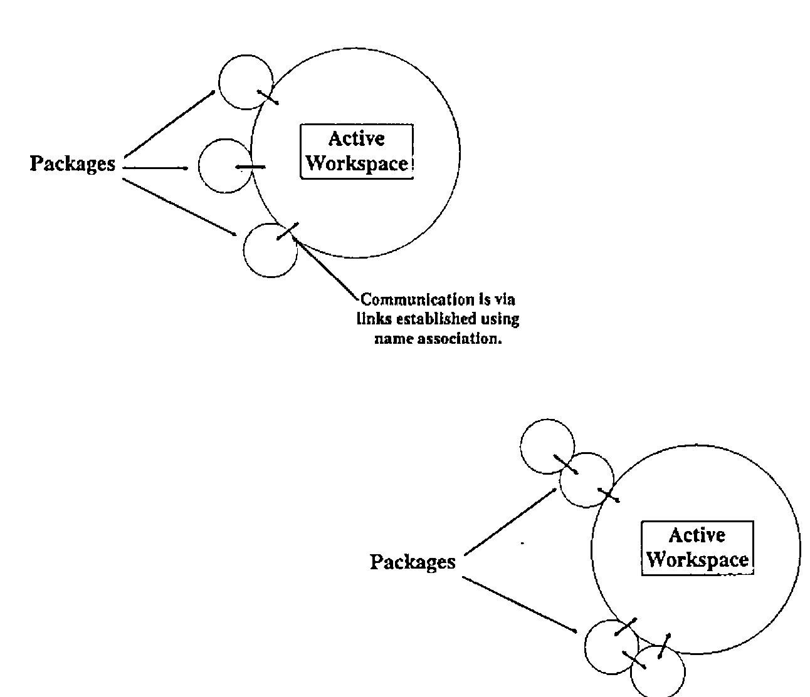
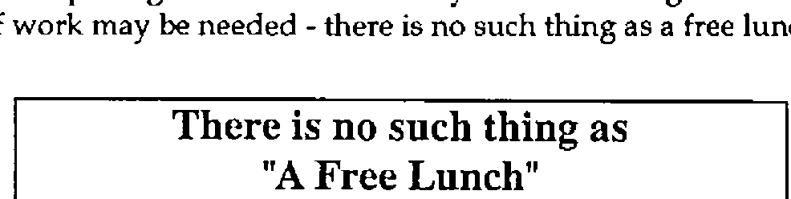
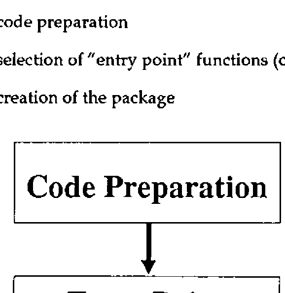
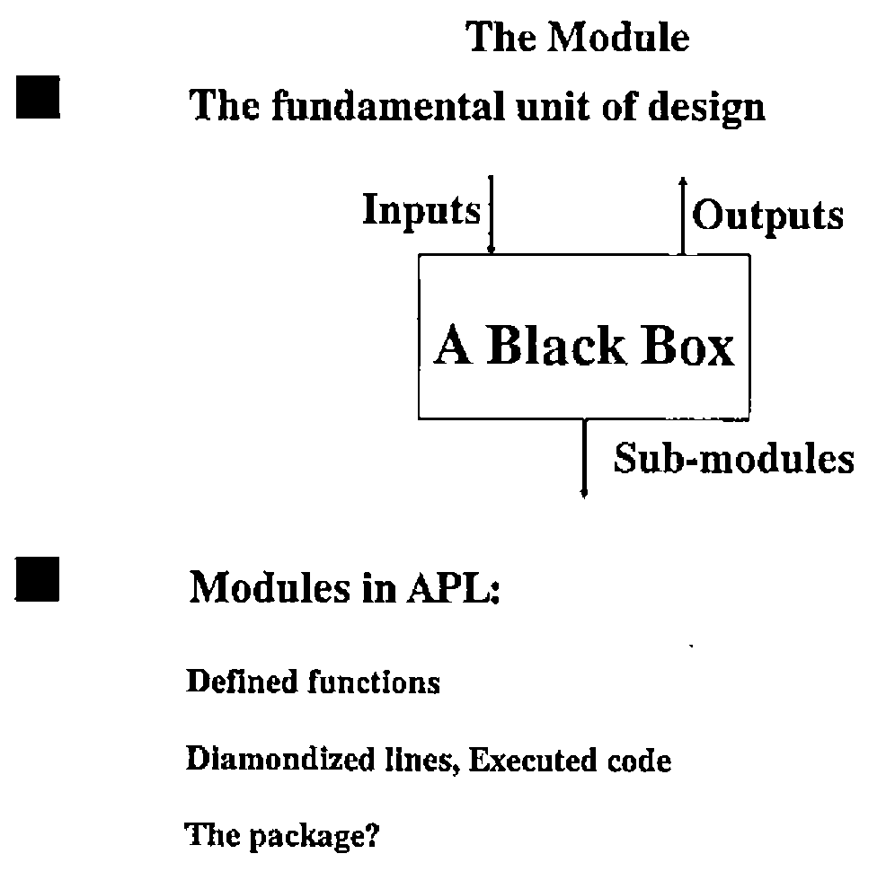

*by Dave Piper (Cocking & Drury)*
{ .byline }

## Abstract

This paper concentrates on the implications that the use of packaged workspaces have for the design of APL2 applications. It begins by describing what packaged workspaces are, how they are produced and how they can be used. The paper then considers what a packaged workspace is in terms of application structure, and the impact on the design of APL2 applications.

## Acknowledgement

I would like to acknowledge the opportunity presented by the Life Division of Eagle Star in facilitating the research for this paper; also for subsequent permission to publish the results to the APL community at large in the form of this paper and a presentation at the June 90 meeting of the BAA.

## Introduction

Packaged workspaces are a new feature of APL2, introduced in APL2 Version 1, Release 3. The concept of the packaged workspace allows us to invoke APL2 functions (or APL2 objects in general) without having them reside in the active workspace. Of course, the objects have to live somewhere - they live inside the package. Packages can be used in a variety of "configurations", some of which are illustrated on the following page.

The links to a packaged workspace can be tightly controlled by establishing a limited number of access points - all other objects in the package are inaccessible to the active workspace. This adds a degree of security and integrity to the application code. Objects within the package are accessed using the name association (`⎕NA`) facility of APL2.

There are a number of advantages in the use of packaged workspaces:

- APL2 code can be shared easily amongst many users.
- Code can be loaded in shared memory, saving virtual storage.
- Utilities can be distributed without the usual difficulties.
- Utilities can be updated without the need for `)COPY`.
- Applications can be made more modular.
- Code is relatively secure.
- Access to a package is faster than use of `)COPY` or `)LOAD`.

All these features make the use of packaged workspaces quite an attractive proposition. IBM have done a good job of making the packaging process as simple as possible; in order to encourage the use of packages, access to packaged code is as transparent as possible.

Of course, as with all powerful new facilities, in order to make really effective use of packages and to obtain many of the resulting benefits a significant amount of work may be needed - there is no such thing as a free lunch.

## The Packaging Process

The process of creating a package occurs in three stages:

- code preparation
- selection of "entry point" functions (objects)
- creation of the package

Each of these steps is described in more detail below. Once the package has been created, it remains for the programmer to arrange access to the package before it can be used.

## Code Preparation

It is necessary to undertake a series of code checks before commencing the packaging process. Typically these are the same as the actions needed to ensure code is "productionised" before it is distributed as an application:

- removal of all stops and traces
- de-commenting to save space
- localisation of all possible variables
- locking of functions

These actions will ensure that the execution of code is never halted (for example by an error) within the packaged portion of the application.

## Selection of "Entry Points"

The number of linkage points between the packaged workspace and the active workspace can be strictly limited. This allows the designer to ensure that the facilities provided by the package are accessed and used only through the correct channels. In order to make use of this capability, he has to decide in advance which objects in the package will form the entry points.

The entry points are included in the specification of the package during the packaging process. Only these objects are available to the user of the packaged workspace - all other objects in the package are invisible to the active workspace and cannot be accessed.

## Package Creation

Once these matters have been dealt with, the actual packaging process can proceed. This happens in two stages:

- production of an object module
- link editing of the object module to create a load module

## Object Module Creation

IBM supply an associated function (`PACKAGE`) to assist with the first stage - this associated function is actually a packaged workspace in its own right. The object module is created quite simply; the contents of the workspace are re-written into the object module practically unchanged - a few header records are inserted and record headers are also added. The essential (binary) contents of the workspace are left unchanged.

The Package function is ambivalent. For its right argument, the name of the workspace dataset is specified. Under MVS/TSO, the package facility will not process workspaces stored in VSAM libraries. The need to specify the name of the dataset rather than the workspace identity seems rather strange since (in the TSO environment at least) it is possible to deduce the dataset name from the workspace identity.

The left argument, if supplied, gives the names of the "entry point" objects for the packaged workspace. If this argument is elided, all objects in the package are accessible from the active workspace. As long as some care is taken implementing the package, it is best to name specific entry points rather than allowing all objects to be accessible.

## Link Editing

Once the object module has been created, it can be link edited using the standard link editor to create a load module. Be careful at this stage - the MVS link editor will not accept input files with a blocking factor greater than 40; this is not documented in the APL2 documentation, only in the documentation for the link editor. The package facility does not detect this error - so you may end up having to re-create your package from scratch. An IBM internal publication [IBM89] gives lots of useful hints about optimising the load module; especially in the VM/CMS environment.

## Characteristics of Packaged Applications

It seems apposite at this point to ask the question:

> "What should we package?"

We can start to answer this question if we look at the characteristics of the packaged environment.

Packages live in the freespace allocated to the APL2 session, but are not limited to the amount of freespace memory requested at invocation. If necessary, a package can use the active workspace for its work. However, it is probably a good idea to ensure that things we package are conservative in their use of memory.

Secondly, links between the active workspace and the package have to be set up (using `⎕NA`) in order to be able to use the packaged objects. To simplify this initialisation we should try and minimise the number of "entry points" in the package. This has the beneficial side effect of improving the security and integrity of our packaged code.

Thirdly, objects which are not defined as "entry points" to the package are hidden from the active workspace. This allows variables which would normally be global to the application as a whole to be hidden from view. The active workspace cannot update these objects except through the defined entry points.

Fourthly, packages make it very easy to distribute code to many people, and to ensure they are making use of any updates to the code which may be provided. This makes the packaged workspace an ideal delivery vehicle for utility functions and groups of utility functions which may need to be accessed many times and in many different circumstances.

## What Should We Package?

Given the above characteristics of the package environment, we should be able to identify the best parts of an application for packaging. In order to match the above characteristics, we should look for:

- self contained units of code
- a relatively small number of objects involved
- conservative use of workspace
- a small number of "top level" functions

Utility groups normally display these characteristics and form ideal candidates for packaging. Consider the command driven QSAM file interface described in [PIP87]; this forms an ideal candidate for distribution as a package. About the only complexity in this facility is that some functions are fixed dynamically - this will only happen once for a given application. In all other ways it meets the above requirements.

## Design Implications

In order to be able to make some statements about the design implications of packages, we first have to decide what a package is in terms of application design. The important unit of code in application design is the module. If we make the assumption that a package is a new form of module, then we also ought to check how good a module it is. To make the use of packages in our applications worthwhile, they must not force us to sacrifice quality.

Let us take a step back a moment and talk about module quality. Two major measures of module quality have been established - these are discussed in detail in many publications (for example [PAG88], [CAD90]); so I shall only describe them briefly here.

## Module Coupling

Module coupling looks at the quality of a module in terms of how it links to other modules. A range of coupling types has been identified, from DATA coupling (best case) to CONTENT coupling (or an even better name PATHOLOGICAL coupling) - worst case. In summary, the types of coupling are as follows:

| | |
|---:|---|
| DATA | all data passed as simple items in parameters |
| STAMP | all data passed in parameters, but use of local data structures |
| CONTROL | use of flags to control execution |
| COMMON | use of global variables |
| CONTENT | one module modifying the code in another |

DATA, STAMP and CONTROL coupling are more or less acceptable, although design problems may still result. COMMON and CONTENT coupling are much less acceptable, although many of the worst effects of common coupling can be ameliorated by careful design and documentation. CONTENT coupling should be avoided at all times.

## Module Cohesion

Module cohesion looks at the quality of a module in terms of how its various components link together. As with coupling, a range of cohesion types has been identified, ranging from FUNCTIONAL cohesion (best case) to COINCIDENTAL cohesion (worst case).

Cohesion can also be thought about in terms of colours - although we are dealing with a monochrome display adapter since it’s all shades of grey! Functionally cohesive modules can be likened to black boxes, coincidentally cohesive modules are white (or transparent) boxes. The other grades take intermediate shades of grey. The types of cohesion are:

| | |
|---:|---|
| FUNCTIONAL | One complete task |
| SEQUENTIAL | Most of a task, data transformed by each stage |
| COMMUNICATIONAL | Most of a task, data reused by each stage |
| PROCEDURAL | Most of a task, not related by data but order dependent |
| TEMPORAL | Many tasks determined by time |
| LOGICAL | One task selected from a "subject" related list |
| COINCIDENTAL | Many tasks bundled together for the sake of it |

The top three types of cohesion are widely acceptable with an application. In practice you will nearly always find modules with procedural and temporal cohesion too. These are less acceptable and should be eliminated where possible. Logically and coincidentally cohesive modules should be considered unacceptable.

In addition to the levels of cohesion mentioned above, there is another level which is only implementable in some languages. INFORMATIONAL cohesion describes a module with multiple entry points - that is to say a module which can be called by referencing addresses inside the module itself.

This is different from LOGICAL cohesion since there is no flag involved in the selection of the operation chosen - all the selection is achieved by name. Each entry point can be considered to be a module in its own right, the only reason for using such a module is the benefits bestowed by the bundling together of the various operations. Usually INFORMATIONAL cohesion is classed as lying between FUNCTIONAL and SEQUENTIAL cohesion.

## Modules Within APL

The main form of module within APL is the defined function. If correctly designed, defined functions should be of functional cohesion and should only use data coupling. Other types of module do exist in APL:

- diamonded lines of code
- use of the execute primitive function

Both these forms usually show much less cohesion and much more coupling than the defined function. For example, a diamondized line of code can only be common coupled to other lines of code since there is no way of implementing local variables within a single line. Similarly, executed statements will frequently be content coupled with other lines of code - if part of the executed statement is decided by the value of local variable for example.

We are left to decide if a package is a suitable candidate for a module, and if so how good can it be in terms of module quality?

## The Quality of Packages

To paraphrase the immortal bard: The quality of packages is not strained…. in implementation terms, there are two main ways to view a packaged workspace:

- as a series of modules bundled together
- as a single module with many entry points

The interpretation we employ will depend on how the package itself is defined. Consider a package which presents a series of low level utility functions to the user; these are unrelated to each other except by virtue of being in common use. In this case the package should be considered to be a series of modules simply bundled together for convenience.

Alternatively, the package may present a series of utilities all associated with the same aim (e.g. QSAM file processing under TSO). In this case the package is best considered to be a single module with several entry point functions. The important conclusion is that the quality of the package as a module depends on how well we design the package itself.

## Package Coupling

The coupling between packages and the outside world can be as strong or as weak as we wish to make it. By failing to name entry points to the package, we make every object potentially available for modification - this will typically lead to a COMMON coupled package (or even worse, content coupling). If we make use of the facilities provided to name specific entry points to the package, we can ensure a lower level of coupling.

In the best case we can, by avoiding all references to variables during the packaging process, ensure that the module is at worst CONTROL coupled. This will avoid all the problems normally introduced by the use of COMMON coupling.

## Package Cohesion

As with coupling, we can embody any level of cohesion we like into a package. For a loose assemblage of functions, the level of cohesion is likely to be either COINCIDENTAL or LOGICAL. In a well designed package, with several entry point functions, we should be able to ensure INFORMATIONAL cohesion - the separate packaged functions fulfilling the role of entry points in more traditional languages.

In the extreme, where our package only provides a single entry point function, FUNCTIONAL cohesion can be achieved. It may be desirable to package a single function if it makes use of significant numbers of global variables as "state memory" between invocations. Several sub-functions will probably have to packaged also, these do not have to be entry point functions.

## Packages and Informational Clusters

One problem that frequently has to be solved in an APL application is that of implementing an "informational cluster". This is simply the situation where a set of functions requires a "memory" between invocations. Each of the functions in the cluster address this common memory in some way, whilst those outside have no access to it.

A good example of an informational cluster is a printing utility which requires state memory to maintain a print buffer, information about page layout and so on.

This information is established by one utility function, but used by later invocations of the main print utility. The state memory may be purged by a terminating module.

In APL there is no simple way to implement an informational cluster. The only form of state memory available is a global variable but these can be accessed by all the functions in a workspace. Global variables are liable to "unauthorised" change or reference by functions outside the cluster.

Packaged workspaces provide an ideal facility for overcoming this problem. The functions and global variables are simply placed in a package, each of the "top level" functions are named as entry points. Once packaged, the global variable cannot be accessed by objects outside the package - it is protected from side effects derived from the rest of the objects in the active workspace.

## Conclusions

The concept of the package enriches the range of facilities which we can use when designing APL applications. As with all aspects of application implementation, we should consider carefully how the package is going to be used before attempting any implementation. To identify a suitable target area for the packaging process we should look for:

- self contained units of code
- relatively small numbers of objects required
- small number of "entry point" functions
- conservative use of workspace

All these factors tend to be indicative of "informational clusters" within our application. We can partition the application into a series of independent units of code each with their own private state memory and workspace resources. Our application will gain from the independence of these various units - changes to one will not cause side effects in others and so on.

Packages are not a universal panacea for all the badly designed APL applications in existence. A badly designed package can do just as much damage to the implementation of an APL application as any other badly designed module. If we apply the same design techniques and quality measures to packages as we do to the rest of our APL code, we will be able to take advantage of packages without encountering any potential costs. **A package is simply another resource for the APL2 programmer, to be used with care and consideration at all times.**

## References

[CAD90] Functional Design Seminar, Cocking & Drury Ltd, 1990

[IBM89] *APL2 Release 3 Evaluation and Vector Performance*. IBM ZZ81-0197-00

[PAG88] Page-Jones. *The Practical Guide to Structured Systems Design*. Prentice Hall 0-13-690777-6

[PIP87] Piper D.B. *Command Driven Interface for BDAM and QSAM* `3 3 118⊃Vector`
