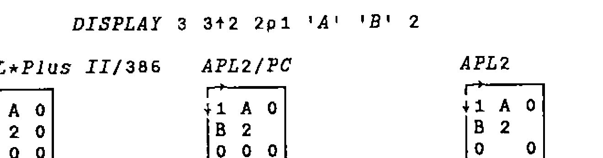

*reviewed by Dave Piper*
{ .byline }

## Introduction

Version 1 of APL\*Plus II/386 was the subject of two reviews in Vector 5.4 [Cyriax 5.4, Askoolum 5.4]. Version 3 was reviewed in Vector 8.1 [Pearson 8.1], version 4 in 9.1 [Crossley 9.1]. All being well, this review will appear in 9.4; we should be due for version 6 sometime around Vector 10.3 — next Christmas! Rumours of version 5.1, due around March/April, already abound.

The evolution (no pun intended) of the product over these releases stands some examination. Listed below are edited highlights of the new features in the most recent versions:

| | |
|---|---|
| Version 3 | Session manager and interpreter unified<br>`⎕NA` enhancements<br>"tools" as part of the product<br>mouse support<br>user command processor |
| Version 3.5 | Windows 3.0 tolerance |
| Version 4.0 | Windows interface<br>Paradox interface<br>character based "sub-windows"<br>evolution towards APL2<br>bound documentation |
| Version 4.1 | OS/2 tolerance (dongle!) |
| Version 5.0 | Windows 3.1 windowed character set support<br>further evolution<br>enhanced windows interface<br>APLGUI<br>interactive debugger<br>automated installation<br>GRAFLIB |

A slight disclaimer — this review is based on my experience of version 5.0 so far. Having only had the product for a few weeks, a fully comprehensive examination has not been possible. In particular, I have had no opportunity to examine GRAFLIB or the related user commands.

## The Language

Not a lot has changed here. If you are coding at evolution level 2, then a few steps toward the APL2 IBMard [Piper 9.1] have been taken. Specifically, enclose and disclose now permit axis specification. One useful side effect of this is that (at long last [sorry Jerry]), we have length tolerance when disclosing a nested object into a higher rank array. One of the bug-bears of *MIX* (and its successor `⎕MIX`) is that all items being mixed must have the same length.

Interestingly, `⎕MIX` still retains its original behaviour — it appears that disclose and mix have now parted company within the interpreter. In version 4.0, `⎕MIX` and *DISCLOSE* were aliases of each other, providing the same functionality.

APL\*Plus II/386 does not follow either APL2 or APL2/PC when generating fill items for mixed arrays. The following example illustrates the 3 different rules:

```apl
      DISPLAY 3 3↑2 2⍴1 'A' 'B' 2
```



APL\*Plus II/386 always uses the first item of the array to generate fill items; APL2/PC uses the first item of a row if it already exists, otherwise the first item of the array; APL2 uses the first item of a row if it already exists, or the first item of the column. [C&D 1].

One unfortunate syntactic exception is still present at evolution level 2; pure numeric strands can be indexed without parentheses:

```apl
      1 2 3[2]
2
```

Any other type of strand must be parenthesized before indexing can occur.

Both language bugs that I have found in previous versions still exist. In evolution level 1, indexing into strands can go wrong:

```apl
      ⎕IO←1
      c←3
      1 2 c ≡ 1 2 3                ⍝ They match
1
      1 2 3[1]                     ⍝ Index first item
1
      1 2 c[1]                     ⍝ Likewise ?
1 2
      1 2 c[2]                     ⍝ Second item !
3
      1 2 c[3]                     ⍝ Third item !*?
INDEX ERROR
      1 2 c[3]
       ∧    ∧
```

This cannot happen at evolution level 2 since non-numeric strands must be parenthesized before being indexed.

The second problem involves the strand assignment of non-simple scalars:

```apl
      (a b c)←3⍴⊂''                ⍝ Each gets an empty
      ≡¨a b c                      ⍝ Check the depth of each
1 1 1
      ⍴¨⍴¨a b c                    ⍝ Check the rank of each
1 1 1
      (a b c)←⊂''                  ⍝ Scalar extension we hope!
      ≡¨a b c                      ⍝ Check the depth of each
2 2 2
      ⍴¨⍴¨a b c                    ⍝ Check the rank of each
0 0 0
```

When we rely on scalar extension, each name assigned gets the scalar rather than the content of the scalar.

## Windows 3.1 Support

Version 5.0 offers full support for operation as a DOS application under Windows 3.1. The support provided by Windows for DOS applications was considerably enhanced in release 3.1, so this is a very desirable move forward. When running in a window (rather than full screen mode), the mouse performs the same functions as if the program were hosted in DOS or running in full screen mode under Windows. This contrasts with the rather useless "mark/edit" mode adopted in Windows 3.0. To make use of the new mouse functionality, mouse driver 8.2a or later is required.

Version 5.0 introduces support for the APL character set when running in a window under Windows 3.1. Character set support for Windows 3.0 was already available in version 4.0, these fonts were not compatible with Windows 3.1. Windows 3.0 character set support is still available. Note, as a result of the way Windows supports fonts in DOS applications, all DOS applications will use the APL font if it is installed. This may result in some strange effects in the displays generated by other DOS applications. Most of the characters are quite well mapped, so really glaring changes should be kept to a minimum.

The 3.1 character set is available in several font sizes, ranging from a very thin but still usable 8×8 pixels to a large and well formed 16×8 pixels. Other, still larger, sizes are available but the full DOS display is not visible and must be scrolled using the scroll bars generated automatically by Windows.

The 8×8 font is quite difficult to read for long periods of time, but is good for working in a window which is less than half of the full display size. Using this font makes it possible to have other windows such as file manager opened to a significant extent and visible at the same time as the APL session.

## Printing

Direct printing using Windows facilities and a Windows printer font is still not supported in version 5. With the advent of a competent Windows interface (see below), the provision of a real Windows printer font would have been a great advantage. Fortunately, thanks to the sterling work of Adrian Smith and Ian Clark, TrueType APL fonts are now available. This article was produced using Word for Windows, using Adrian’s font for the APL bits.

Support for DOS-based printing has been enhanced somewhat. Rather than down-loading the printer character set using the *PRINTERS* workspace (and associated component file), specific .COM files are available for a range of supported printers. Each of these downloads the character set and initialises the "port 10" printing facility. These programs can be re-executed at any time to reinitialise the printer if it has been reset by another program or user on a network.

## Installation

A significant new feature of version 5 is the provision of an installation program. This is a DOS program which allows the user to selectively install parts or all of the system. Different directories can be nominated for the various "parts" of the APL system. The structure of the directories is fixed — that is the files which constitute a "part" of the system cannot be varied (though subsets such as specific device drivers can be nominated). For those of us who have been users for some time and wish to retain our existing directory structures it’s back to the manual method.

Given that a file containing a list of all files in the system is provided it is a shame that this is not used to drive the installation process. Customisation of the file would allow any directory structure to be created. Better still, if the install program had been available from version 1…

## Enhanced Windows Interface

The updated Windows interface has overcome many of the problems discussed by Ray Cannon [Cannon 9.3]. In particular, a considerable amount of work has been put in to improve the speed of the interface. This release implements the agent using a virtual device driver (VAPLD.386) rather than relying on the Windows "timer" facility. The rate of call processing has gone up by at least a factor of 10; it is now possible to write programs with a Windows front end that respond as quickly as those written in compiled code. Only if filters are set up to process very frequent messages (mouse move or key depression) is any sluggishness really noticeable.

Various other enhancements have been made such as the use of a compiled .INI file containing all the Windows function, constant and message definitions (well nearly all!). Essentially, though, this remains an interface for real programmers; you must be prepared to get very intimate with the insides of Windows. Having climbed this not inconsiderable mole-hill myself in the last 10 weeks or so, I can attest to it being a frustrating and occasionally painful process. Of course, if you already know Windows, this interface could present you with many benefits in terms of flexibility and performance over the higher level interfaces provided by Dyalog APL and the APLGUI facility.

## APLGUI

APLGUI is new in Version 5. It provides a higher level, "object-oriented" interface for Windows programming. The interface uses one high level function to process all the methods and messages associated with a window object. Of course, APL\*Plus II has not suddenly turned into any object oriented system; all the mechanics of message passing and processing are implemented using real APL at a lower level.

The number of global variables and functions needed to support this framework is *astonishing* — when using the GUI demo workspace, the total number of objects is *in excess of 1,000*! Managing such a large number of functions and variables is no mean feat of itself — certainly solving obscure problems lying on the border between the supplied code and your own functions would be great fun. Perhaps of greater concern is the quality of the code used to implement the system. It seems to me, having studied significant volumes of code written by Manugistics, that they simply do not know how to write easily understood, maintainable code. Sorry chaps!

The basic object in the GUI system is the form — this corresponds to a dialog box in Windows parlance, and the "methods" (i.e. functions) required to make it work. A form contains controls of the normal types found in Windows — buttons, list boxes, edit fields etc. Rather confusingly, the standard control names are sometimes dropped in favour of GUI’s own names, so that radio buttons become "options", static text becomes "label" and so on.

Messages (i.e. events [nearly]) can be sent to or received from either the main form or the child controls within it. Methods can be defined to process any of the supported messages. *Supported* is the key word here — if the message you wish to process is not supported then you have to find some other way around the problem, or start using low level Windows calls.

Having looked briefly at the GUI system, it is certain that low level Windows calls would have to be used, at some stage, to achieve all the effects required in any significant application. Certainly insufficient messages are supported for the more complex controls such as edit boxes. For example, there is no (GUI) way for a function to tell an edit field to cut the currently selected text.

Just to compound the effect of these difficulties, the interface is not overly robust. During early experimentation many hangs were generated. Even when we had gained expertise it was very easy to generate "ghost" windows which could not easily be disposed of. If your application collapses with an APL error, `)RESET` is not sufficient, the object oriented interface must also be reinitialised; this could make error handling in applications extremely complex and difficult to manage.

Objects, properties (attributes of the objects), messages and methods are linked together using a naming convention. A form (or a child control) has a caption property. We can reference or set the caption using the following statements:

```apl
caption←Win 'FmMine:caption'                 ⍝ Reference
Win 'fmMine:caption' 'New Caption'           ⍝ Set
```

Similarly, for a child control:

```apl
chld_cap←Win 'fmMine.bnOK:caption'           ⍝ Reference
Win 'fmMine.bnOK:caption' '~OK'              ⍝ Set
```

Methods follow a similar naming convention. For example, the SHOW method for a form would be:

```apl
fmMine_Show
```

The CLICKED method for a push button would be:

```apl
fmMine_bnOK_Clicked
```

The defined functions which implement methods do not take arguments, nor do they return explicit results. Instead, arguments are passed in the global variable `wArg` and the result set in the global `wZ`. This insistence on the use of global variables seems unfortunate from a code quality point of view; perhaps it would have been better to insist that all methods were implemented using monadic, result-returning functions.

APLGUI provides an interface at a level similar to that provided by Dyalog APL [Pearson 9.2], but currently rather less usable. The large number of objects in the workspace and the resulting object management difficulties (and problems with responsiveness) need to be solved before APLGUI can be regarded as a viable alternative to the low-level interface. Perhaps it is best to regard the current version of APLGUI as "beta-test", hopefully with better to follow.

## Interactive Debugger

Another new feature in Version 5. The debugger is integrated into the interpreter and can be toggled on and off from the session manager menus. Halt points and watch points are both supported; both remain set even when the debugger is inactive, but only take effect when it is used.

Halt and Watch points offer several advantages to the traditional APL trace/stop facility:

- can be disabled without being removed
- conditional operation
- halts apply to statements not function lines
- watch points can ignore execution context

When a halt or watch takes effect, the character based sub-windows introduced in Version 4 are used to display status information such as the:

- execution stack
- current halt/watch point

In addition, it is possible to display the values of the arguments at the current position. Options are offered on the status line permitting step-wise execution, execute to next statement, next line and so on.

How useful is it? Here I have to make a confession — I have only used it a couple of times in anger. In general, the standard trace and stop facilities provide me with sufficient control for solving any problems, especially since they are so easy to set within the ring editor. The only problems I suffer with trace and stop are the volume of output sometimes generated by trace and the number of unwanted stops that may occur in a looping or recursive function. The debugger provides exactly the right tools to avoid these problems. When I can get away with trace and stop I do, because they are so easy to set up and remove.

One annoying result of the introduction of the debugger is that the stop toggle has been moved on the keyboard. I think a quick dive into my config file to remap the keyboard is required.

## Bench Marks

The bench marks would have been copied from Adrian’s review of APL\*Plus/PC Version 9 in Vector 6.4 [Smith 6.4]. Benchmarks have always been of questionable value, since the most valuable benchmark is often the perception of speed. Running under Windows makes performance measurement even more meaningless — some of the tests listed gave execution times varying by as much as 50% between the slowest and fastest times.

How does it feel? The answer must be just as fast as ever. One thing is for certain, the new primitives (especially *ENLIST* and *DISCLOSE*) offer significant performance benefits. Comparing our "make vector-of-character-vectors into matrix" with the primitive *DISCLOSE* indicates a potential ten-fold benefit — even after the defined function was carefully optimised!

## Conclusions

So is it all worth it? The broad answer must be yes; we now have a usable Windows interface that can create real Windows applications, and an integrated debugger that provides many powerful facilities which are useful at least some of the time. There is a higher level interface to Windows with which we can experiment, even if it does not yet provide a real application development tool. It is possible to use the interpreter in a window, and see the APL characters, a further improvement in productivity for Windows users.

The remaining new features represent increments in usability rather than a productivity revolution. The debugger certainly does not provide a productivity revolution, not because of any lack of functionality but simply because debugging well written APL is usually quite easy. I suspect it will turn out to be of most use to those who are relatively inexperienced and tend to create poor quality code (perhaps Manugistics created it to support their own efforts?).

To sum up — it feels more like a minor release than a brand new version.

## References

| | |
|---|---|
| [Askoolum 5.4] | APL\*Plus II for 80386 PCs. Vector 5.4, April 1989; pp 61-66 |
| [Cannon 9.3] | APL\*Plus II/386 Interface to Windows. Vector 9.3, January 1993; pp 44-54 |
| [C&D 1] | APL2 Nested Arrays Course. Cocking & Drury Ltd 1990, 1991 |
| [Crossley 9.1] | APL\*Plus II/386 Release 4. Vector 9.1, July 1992; pp 53-60 |
| [Cyriax 5.4] | APL\*Plus II — STSC’s Second Generation APL System for 80386 Machines. Vector 5.4, April 1989; pp 55-60 |
| [Pearson 8.1] | APL\*Plus II Release 3. Vector 8.1, July 1991; pp 73-76 |
| [Pearson 9.2] | Dyalog APL/W. Vector 9.2, October 1992; pp 55-64 |
| [Piper 9.1] | General Correspondence. Vector 9.1, July 1992; pp 9-12 |
| [Smith 6.4] | APL\*Plus/PC Release 9. Vector 6.4, April 1990; pp 54-57 |
