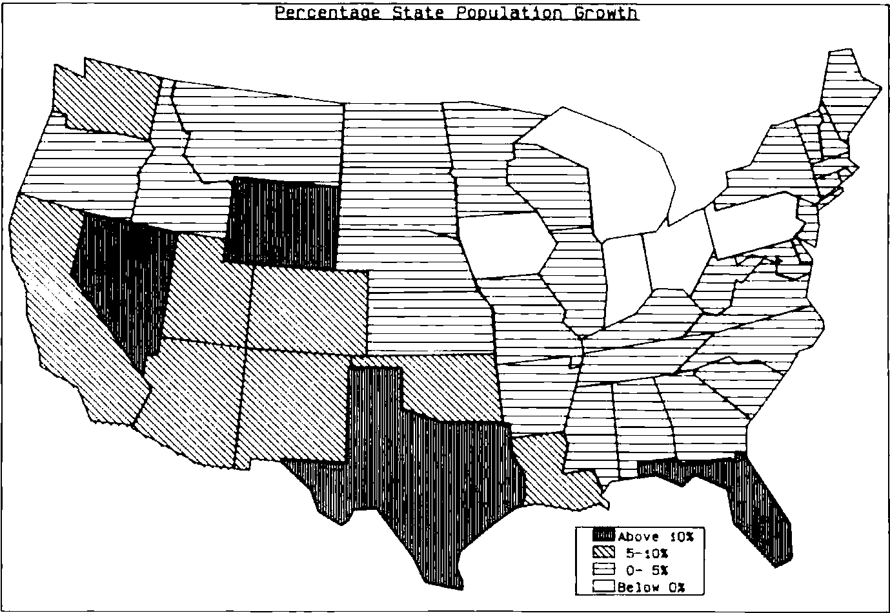

by David Preedy
{ .byline }

“A picture is worth a thousand words”, we are repeatedly told by computer graphics salesmen. Yet, despite the increasing availability of graphics hardware and software, there is little evidence of the use of graphics at a senior level in corporate planning and decision-making. The typical board member is presented with a thick report of detailed accounting schedules for the latest period, but rarely is a graph included.

Several reasons are typically put forward for this:

> “graphics is too expensive”
>
> “graphs of all our accounting items would take up too much space”
>
> “graphs are misleading”
>
> “numerate people don’t benefit from graphics”.

Such excuses might be acceptable if the current alternative could be seen to be working effectively. But the traditional accounting statements — profit & loss, balance sheet, and the like — were developed long before the advent of computers and the resulting impact on management methods. Valuable as they are for some purposes, these traditional statements inevitably filter out much of the information needed to run a business in the modern competitive environment, and they provide formal documents rather than actionable information.

By ignoring graphics our decision-makers are failing to equip themselves with a powerful tool, and yet the computing profession seems unable to dispel the misconceptions that abound. Some blame for this failure can be attributed to the Media for whom layout considerations, visual impact and sensationalism are often more important than good graphic design (and who have performed a similar disservice to the cause of Statistics).

Management can also point with some justification to the inability of D.P. departments in the past to produce well-designed output of numeric data. Even the basic courtesy of providing easily legible text by using upper- and lower-case letters is a recent, and by no means universal, introduction (and a major failing of the APL character set). I have yet to see any computer output that incorporates the principles outlined by, for example, Ehrenberg (1). Against this background it is hardly surprising that the D.P. department is rarely consulted in the design of Board reports, be they in numeric or graphic form.

But the greatest harm to the cause of computer graphics is frequently inflicted by the graphics themselves. They are too often badly-designed, inappropriate or geared to showing off the technical capabilities of the equipment and the programmer’s skill, rather than the messages contained in the data.

## Verbal and non-verbal thinking

A prerequisite to the design of effective graphics is to understand the broad information needs of the audience and to identify which of these needs can best be met by a graphical approach. The key to this identification is to distinguish between two modes of thinking — ‘verbal’ and ‘non-verbal’ — which are well explained by Hewlett-Packard (2).

‘Verbal’ thinking is carried out by the left-hand hemisphere of the brain and includes the use of symbolism, logic and step-by-step reasoning; the right-hand hemisphere handles the ‘non-verbal’ activities of mental pictures, intuition and pattern-recognition. The most effective use of graphics of any sort is in these ‘right-hemisphere’ situations.

Contrary to one’s expectations, the majority of Board-level decisions are of this ‘non-verbal’ nature. For despite the claims of some Operational Research workers that models can solve problems, in practice the output of a model is just one of a range of inputs to the decision-makers. Even if the logic of the model is undisputed, there is likely to be debate about the assumptions. Almost by definition, a ‘left-hemisphere’ decision that can be made by a logical process is going to be delegated by senior management. It follows that graphics ought to be a particularly suitable way to present information at Board level.

## Management uses of information.

The degree of suitability and the appropriate criteria for good design will depend on how the information is to be used. This can be suitably classified into four categories — reference, analysis, browsing and presentation.

Reference, in isolation, is a left-hemisphere activity for which graphics tend to be unsuitable. If the Managing Director wants to know today’s share price, it is much easier for him to read the number than to derive the figure from a graph. So a user-friendly data retrieval system is likely to offer the best reference facility. However, such data on its own is of strictly limited value. Knowing today’s share price tells a manager what he will have to pay for shares, but doesn’t help him decide whether to buy them.

Analysis involves trying to uncover relationships in the data, for example when planning future activities, and is inherently an exercise in pattern-recognition. In many cases models can be used to help find and quantify relationships, but even then a graphical display is normally the best way to explain the results. Often the most revealing analytic charts do not use time as one of the axes. So, for instance, a plot of share price against dividend yield may allow the manager to compare share purchase at different prices with some alternative investments.

Browsing differs from analysis in that it tends to be a fairly unstructured search, normally to monitor performance, the aim being to check for under- (or over-) performance and to diagnose problem areas. For example, the manager might want to look at the historic trend of share price and compare it with market movements. Exception-reporting can play a key role by providing some structure to the browsing, but has to be backed up with an easy way to access more detailed information. Typically, a time-plot will highlight the sort of significant variations that are being sought.

Presentation is a significantly different type of activity, because the conclusions have already been drawn from the data, so the objective is to communicate them rather than discover them. In these circumstance, the value of a graph depends on the nature of those conclusions. A detailed step-by-step argument may well be best supported by non-graphic material, maybe using graphs to explain the background to the problem. In presentation it is essential that each display tells a message, and the required message should be the starting-point of the graphics design.

## The traditional Board report.

Given this range of information needs, it is easy to see the shortcomings of the conventional Board report. It concentrates on the latest period at the expense of trend data and fails to discriminate between data of different importance; for example, the key profit lines are treated identically to the accounting adjustments. Moreoever it presents the data in a numeric form that is inappropriate for most of the Board’s requirements; it is a reference document rather than a true ‘management report’ and reflects the need of auditors and accountants rather than senior management. A better alternative would combine graphical and numeric displays, include trends and provide an easy way to search through the (typically) large volumes of data. For any large company this implies using a computer-based information system, offering well-designed graphs.

At this point it is worth mentioning the approach advocated by Irwin Jarret (3), who has proposed standard graphical displays of the main financial statements — Balance Sheet, Profit & Loss and Source & Application of Funds. However, by accepting these existing reports as the starting-point, this approach does not differentiate the ways in which the information might be used. The result is merely to convert what are in practice reference documents from their traditional numeric form into graphs that are, as discussed earlier, inherently unsuitable for reference purposes.

## Graphics Design.

Graphics design is a complex area in its own right, and an article like this can only highlight some salient points. (A more complete exposition is given by Edward Tufte (4). This excellent book is well worth obtaining if only for the superb examples of some early graphics that it presents.) Tufte pinpoints the importance of eliminating what he calls ‘non-data ink’, — the frills that distract attention from the message of the graph. Some of these are obvious — the scrolls and fancy decorations that adorn many graphs in the Press. These tend to be difficult to generate on computer systems and so are less of a problem in computer graphics. But there are other manifestations of ‘non-data ink’ that some graphics software seems designed to encourage.

Grid-lines, for instance, ( a relic from the days of graph-paper) serve only to refer to the values of the points on the graph. Such reference is managed much better by providing a table of numbers that shows the actual values. Numbering the points on the graph itself is even worse because it confuses the left and right hemisphere activities of the brain. Similarly the gratuitous use of colour and/or shading patterns tends to distract from the message of the graph.

Tufte extends this elimination of ‘non-data ink’ a stage further and questions, for instance, the need for axes, whose prime function seems to be a washing-line on which to hang tick-marks. I cannot fault his argument, but must confess to not having implemented this idea and so have no experience of how it works in practice.

Of course, few graphics originators will be experts in graphic design, and so some guidelines are needed to direct them, at least until an Expert System is written to do the job. These guidelines should prevent the worst excesses of bad design, but their effect can be beneficial in a more subtle way. Presented with consistently-designed graphics, managers rapidly become adept at comprehending them, even when the formats themselves are fairly complicated. People turn out to be surprisingly skillful at learning how to ‘read’ the graphs.

Moreover most of the browsing and analytical graphs can be selected from a ‘chart-book’ of a few standard formats, e.g.

- current year by period
- current year cumulative
- moving annual total/average
- long-term trend
- scatter-plot
- map

each of which can be carefully designed to incorporate best current practice. The same format can then be used to display many different accounting items, such as sales, profit, return on capital.

However this ‘chart-book’ approach does not address the individual needs of presentation graphics. The rest of this article concentrates on some guidelines that are theoretically sound and have been found to work in practice. Other good references are the publications by Hewlett-Packard and ISSCO (2) and (5). Such guidelines should provide a good foundation for designing ‘chart-book’ formats and one-off presentations.

(a) Provide output in a variety of media. VDU output is essential if you want to cater for browsing or analysis for any but the smallest organisations without becoming ‘snowed under’ with paper.
Paper hardcopy is the easiest way for managers to take the system away from the office. 35-mm slides or foils for overhead projection are needed for presentations away from base, although video projection now offers a real alternative for in-house presentations..

(b) Where there is a choice, use landscape rather than portrait format. At the purely practical level, this will enable you to get a much closer match between output on different devices, and also allows more space per line of text. There are also good theoretical grounds for this choice; portrait format tends to exaggerate effects (normally shown on the Y-axis). Fortunately VDU manufacturers have been faced with the same problem and so make screens with landscape format. Occasionally you may need to insert graphs in documents designed as A4 portrait; normally you can use a reduced-size graph in landscape format.

(c) Decide on a size for hardcopy and stick to it. If, for example, your overhead projector handles only 8x10, then don’t produce A4 output at all.

(d) Establish a colour-coding convention, like the example given in Figure 1. This can pose considerable problems depending on the kit you use — try matching plotter pen colours on a white background with VDU colours on a black background. Moreover the convention that you establish should depend on the major comparison being made in the graph, and you should beware of colours like red which not only has connotations of financial loss, but also tends to dominate other colours.

(e) Make careful choices of shading patterns; use shading intensity and line-types to complement any colour convention so that black-and-white photocopies do not lose the meaning of the graph (even though they reduce its impact). Where the patterns represent ranges of a variable, use different intensities of the same tone, ordered so that the intensity increases as the range values increase. (See Figure 2 for an example.) Avoid dazzling patterns.

(f) Use upper and lower case text and stick to one style of characters. Beware of software-generated characters on VDUs, as the interaction between the character definitions and the pixels on the VDU can produce distortions, such as asymmetric ‘O’s.

(g) Avoid numbering data-points on graphs (see earlier). If your message relies on having accurate numbers, then you should question whether it ought to be presented graphically anyway. Prepare a separate reference table outside the graphics area, such as below the X-axis or on a separate display.

*Figure 1. Illustrative example of a colour-coding convention.*

| Colour | Data-mode | Variance | Division | Competitors |
|---|---|---|---|---|
| Red | | Adverse | | Us |
| Green | Budget | | Divn. A | Comp. 1 |
| Blue | Plan | Favourable | Divn. B | Comp. 2 |
| Orange | Estimate | | Divn. C | Comp. 3 |
| Magenta | Actual | | Divn. D | |
| Grey | Last Year | | | |

(The last four columns are headed together “Major dimension of comparison”.)

(h) Avoid pie charts. A single pie chart gives insufficient information to draw any meaningful conclusions. Knowing that 40% of product sales were in the U.K., 35% in Europe and 25% in America merely prompts other questions. What about last year? What about profits? What about our competitors? Multiple pie charts should be replaced with a stacked bar plot of the same data which will be easier to understand. It also overcomes the visual conflict of mixing a polar coordinate system (within each pie) and a rectangular coordinate systems (the spatial arrangement of the pies). Multiple pies with different radii (or areas) aggravate the problems by raising issues of interpretation. Anyway, sooner or later you will find that you need to plot a negative pie angle.

(i) Conventionally time goes along the X-axis, and people are used to this, but for other bar charts use horizontal bars to allow easy vertical comparison. This compares with similar advice from Ehrenberg (1) when displaying tables of numbers.

(j) For time series, use line plots to display ‘stock’ items (physical stocks, balance-sheet items), averages over time, and ratios. To a first approximation they vary continuously, so it is meaningful to visualize them as moving from one level to another. Flow items (sales volumes, profit & loss entries) on the other hand, represent discrete quantities for each period and so may be represented by bars on a bar-chart.

*Figure 2. Use of shading intensity to show ranges.*

(k) Above all, for presentation graphs stick to one message per chart and state explicitly what that message is. In some cases you can even write the message on the chart itself. It is a false economy to reduce the number of charts by cramming several messages together, because the audience have to separate the messages as well as understand them individually. Remember too that one side-effect of a complicated graph (or a convoluted argument) can be to reduce the presenter’s credibility in the eyes of his audience.

I have deliberately avoided describing these rules as ‘standards’, because they should not be applied indiscriminately. Standards can sensibly be applied to ‘left-hemisphere’, logical activities, but are less appropriate for the intuitive, ‘right-hemisphere’ areas where graphics are most valuable. Occasions do arise when the best way to convey the required message may entail some breach of these guidelines. However your chosen guidelines should be built into your graphics software at least as default settings, which the user has to take positive action to override.

Moreover few, if any, software packages are designed with considerations like these in mind. Instead they draw pie-charts to show off the high resolution of the VDU, and offer flamboyant character-styles and lurid shading-patterns, whose use will impair the effectiveness of the graphs. Perhaps the most important role of APL in selling graphics to the senior management of major corporations is as an interface to disable the use of such facilities.

## References.

| | | | |
|---|---|---|---|
| [1] | A.S.C.Ehrenberg | Rudiments of Numeracy | J.R. Statist.Soc.A. Vol 140.p277-297 |
| [2] | B.S. Matkowski | Steps to Effective Business Graphics | Hewlett-Packard |
| [3] | I.M. Jarett | Computer Graphics: a Reporting Revolution | Jnl. of Accountancy May 1981 |
| [4] | Edward R. Tufte | The Visual Display of Quantitative Information | Graphics Press |
| [5] | ISSCO | Choosing the right chart | |
