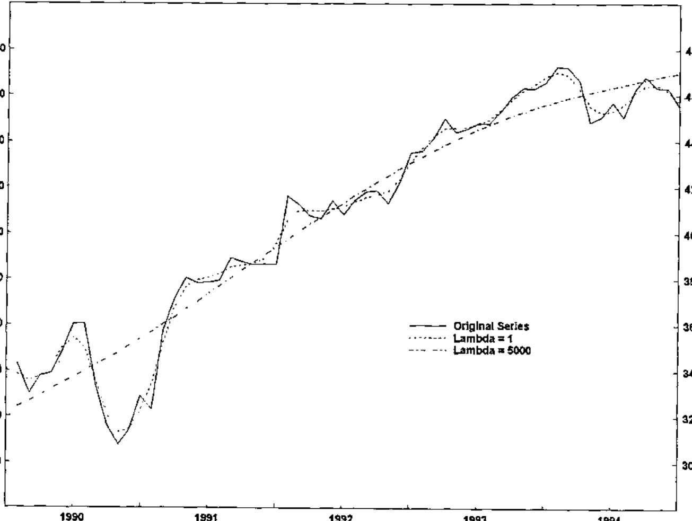

*by Richard J. Procter and Richard L.W. Brown*
{ .byline }

## Introduction

In November 1998, Iverson Software Inc. announced J Release 4.02 and presented a demonstration of the product to the Toronto APL Special Interest Group. J4.02 contains new features including memory-mapped files and the focus of this discussion, the J/LAPACK interface. Iverson Software notes that the latest release of J, for Windows 9x/NT, Mac and WinCE, is available at their website at <www.jsoftware.com>. Recently, another J “addon” product was made available: the FFTW library - a collection of fast C routines for computing the Discrete Fourier Transform in one or more dimensions.

The J/LAPACK interface provides a specialized and sophisticated addition to the software toolkit of the array languages programmer. The following is from the release notes at the Iverson Software website:

> “The complete LAPACK library is now available with the J LAPACK AddOn. LAPACK (Linear Algebra Package) is a set of routines for solving systems of simultaneous linear equations, least-squares solutions of linear systems of equations, eigenvalue problems, and singular value problems. The associated matrix factorizations (LU, Cholesky, QR, SVD, Schur, generalized Schur) are also provided, as are related computations such as reordering of the Schur factorizations and estimating condition numbers.”

In a recent analysis of financial and economic time series information, the J/LAPACK interface was used to greatly enhance the speed of computations for a PC/WindowsNT system written in Dyalog APL. The purpose of the exercise was to optimize the smoothing parameter for a business cycle analysis function known as the Hodrick-Prescott filter. In this case, using the J/LAPACK interface represents a dramatic example of incorporating a specialized and optimized code library to solve a major computational problem in an existing system.

## The Hodrick-Prescott Filter

The HP filter is similar to other methods for determining trends in time series data such as moving averages, in that it generates, from the given series, a calculated trend series which may be compared with the original data to determine potential buy (or sell) decision signals. In theory, if the original data series rises above (or falls below) the calculated trend, a buy (or sell) signal is indicated. One input parameter to the HP filter, lambda, determines the degree of smoothing of the original data that is incorporated into the trend. Chart 1 (below) indicates the concept of HP filter and original series crossing points, and the effect of lambda on the HP filter outcome.



## Optimum Return: the Right Lambda

Viewed graphically, as the lambda value is increased, variation in the HP filter result is reduced and the outcome less closely resembles the original time series. Typically, this means fewer crossing points between the original and calculated series occur. By applying the generated buy/sell signals at these crossing points to existing historical data, we can determine a net return value, based on the percent increase or decrease between transactions. To calculate the optimum return, we recalculate the HP filter curves over a large range of lambda values (perhaps 100 or more values) and compare the returns.

To complete the analysis, optimum lambda is calculated for an initial portion of the timeframe of the chosen series, say the first 5 years of a 15-year daily frequency time series. When optimum lambda is calculated for this portion and applied to the series, we calculate a final buy or sell signal for that segment, based on the relative positions of the original series and the HP filter at the last data value. At this point, we “roll forward” by one or more values in the time series, and repeat the process. This roll forward of the “calculation window” continues until the end of the series. From these successive buy/sell signals, we can calculate an overall return, used to determine whether applying the HP filter analysis at optimum lambda will be of use for predicting future directions.

At the client site, this optimization process was part of a larger economic analysis system written in Dyalog APL running in a PC environment under Windows NT. The HP filter function in APL was initially coded by converting an existing COBOL routine, complete with scalar looping algorithm, into APL. Although useful for calculating the HP filter for one time series, this strategy was found to take anywhere from 30 minutes to several hours of computation, even on the fastest PC, when applied to the full set of calculations for the optimization of lambda as described above.

## The HP Filter Function - Array Solution

Let *y* = [*y*<sub>*t*</sub>]<sub>*t*=1</sub><sup>*N*</sup> be a series of numbers representing financial data. It is desired to filter out the noise and compute a trend series *x* = [*x*<sub>*t*</sub>]<sub>*t*=1</sub><sup>*N*</sup> that smooths the given series. The Hodrick-Prescott filter [1,2] is defined to be the solution to the minimization problem:

> min over [*x*<sub>*t*</sub>]<sub>*t*=1</sub><sup>*N*</sup> of [ Σ<sub>*t*=1</sub><sup>*N*</sup> (*y*<sub>*t*</sub> − *x*<sub>*t*</sub>)<sup>2</sup> + λ Σ<sub>*t*=2</sub><sup>*N*−1</sup> (Δ<sup>2</sup>*x*<sub>*t*</sub>)<sup>2</sup> ]

where Δ<sup>2</sup>*x*<sub>*t*</sub> = (*x*<sub>*t*+1</sub> − *x*<sub>*t*</sub>) − (*x*<sub>*t*</sub> − *x*<sub>*t*−1</sub>) is the second difference (the discrete version of the second derivative). The parameter λ>0 is the smoothing parameter. If λ is small then the trend series *x* is very close to the given series *y* because the first summation above is dominant. If λ is very large then the second summation is dominant and the trend series is very smooth (i.e. has a very small second difference). To solve the minimization problem, set the partial derivatives with respect to each *x*<sub>*t*</sub> (for *t* = 1 … *N*) equal to zero.

This gives *N* equations in *N* unknowns *x*<sub>1</sub> to *x*<sub>*N*</sub>. In matrix form, the equations are: *y* = (*I* + λ*K*)*x* where *I* is the identity matrix and *K* is the matrix:

```text
⎡  1  -2   1   0  ...                      0 ⎤
⎢ -2   5  -4   1   0  ...                  0 ⎥
⎢  1  -4   6  -4   1   0  ...              0 ⎥
⎢  0   1  -4   6  -4   1   0  ...          0 ⎥
⎢  0   0   1  -4   6  -4   1   0  ...      0 ⎥
⎢ ...                                    ... ⎥
⎢ ...                                    ... ⎥
⎢ ...                                    ... ⎥
⎢  0  ...      0   1  -4   6  -4   1       0 ⎥
⎢  0  ...          0   1  -4   6  -4       1 ⎥
⎢  0  ...              0   1  -4   5      -2 ⎥
⎣  0  ...                  0   1  -2       1 ⎦
```

We solve for the trend *x* as follows: *x* = (*I* + λ*K*)<sup>−1</sup>*y*.

In APL, we could use a looping iterative algorithm to solve the system but this approach, as mentioned above, proved to be too slow. We could use quad-divide to solve the linear system. However, quad-divide is a general purpose linear solver and our linear system has special properties that can be exploited: the coefficient matrix is symmetric and banded with just two bands above and below the diagonal. LAPACK has specialized routines for solving this type of problem. Appendix A shows how the appropriate LAPACK routine is called from J. It also gives some benchmark comparisons of several solutions which were investigated using J, including J’s `%.` (*i.e.* J’s version of quad-divide), the LAPACK general solver (i.e. LAPACK’s quad-divide), and the LAPACK symmetric banded solver.

## Benchmarks

As an example of benchmark comparisons for the entire HP filter analysis, comparing APL itself without using J, vs. using the J/LAPACK interface, the following results are indicative.

For an analysis of weekly bond price information, from 1990 to the end of 1998, a 5-year calculation window was used, for 194 different lambda values (ranging from 10 to 40000) in each iteration. An iteration means that the calculation window is rolled forward, in this case, by a 3-week interval, starting with 1990 to 1995, week 1, and ending at the last week of 1998.

Using APL only, and the looping HP filter algorithm which the system was originally coded in, this analysis took about 83 minutes to complete, running on a Pentium-II PC at 200 Mhz. The same analysis, using the J/LAPACK interface, and the `solve3` verb (symmetric banded solver defined above), took only 2 minutes, an impressive 40-fold increase in speed.

This sort of speedup was generally observed for all cases tested so far. In conclusion, since the analysis could now be done with a realistic turnaround time, economists were able to complete their investigations on whether the HP filter is a suitable tool for predicting future trends, by applying the calculations over various timeframes and datasets. Chart 2 shows a typical analytical result, indicating buy/sell periods (shading) and other useful information.


## References

1. Hodrick, R. and Prescott, E., *Post-War U.S. Business Cycles: An Empirical Investigation,* Carnegie-Mellon working paper, 1980.
2. Reeves, J.J., Blyth, C.A., Triggs, C.M., and Small, J.P., *The Hodrick-Prescott Filter, a Generalisation, and a New Procedure for Extracting an Empirical Cycle from a Series,* Working Paper No. 160, August 1996, Department of Economics, the University of Auckland, New Zealand. (Available on the web at http://stat.auckland.ac.nz/reports/report96/oths9602.html)

## Appendix A - J Script for LAPACK Interface

At the time of writing, the J-interface for LAPACK’s symmetric positive definite band solve routine was not included in the routines supplied with the J/LAPACK addon product. Hence, we added that interface as an extra file named ‘DPBSV.ijs’ in the folder ‘j402\system\packages\lapack’. This interface file, given below, was easy to develop using the documentation supplied in the J/LAPACK addon and especially by studying the other interface routines that are supplied.

**START OF FILE: DPBSV.ijs**

```j
coclass 'jlapack'
NB. =========================================================
NB.*dpbsv v solves the real system A * X = B
NB. where A is an N by N symmetric positive definite banded matrix.
NB.
NB. form: dpbsv mata;matb
NB.
NB. returns: X
NB.
NB. The matrix A is assumed to be banded with KD super and sub
NB. diagonal bands.  For example, if N=6 and KD=2 then
NB.
NB.       a11  a12  a13   0    0    0
NB.       a12  a22  a23  a24   0    0
NB. A =   a13  a23  a33  a34  a35   0
NB.        0   a24  a34  a44  a45  a46
NB.        0    0   a35  a45  a55  a56
NB.        0    0    0   a46  a56  a66
NB.
NB. But A is stored and given to dpbsv in the sparse form
NB.
NB.        *    *   a13  a24  a35  a46    (* = anything)
NB. A =    *   a12  a23  a34  a45  a56
NB.       a11  a22  a33  a44  a55  a66
dpbsv=: 3 : 0
'ma mb'=: y.
if. (iscomplex ma) +. iscomplex mb do.
  need 'zpbsv'
  zpbsv y.
  return.
end.
if. 2 ~: #$mb do. mb =.((#mb),1)$,mb end.
n=. 1{$ma
if. n ~: #mb do.
  'dpbsv' error 'matrices should have same number of rows'
  return.
end.
uplo=.'U'
nrhs=. {:$mb
ldab=. #ma
kd=. ldab-1
ldb=. n
ab=. dzero + |:ma
b=. dzero + |:mb
info=. izero
arg=. 'uplo;n;kd;nrhs;ab;ldab;b;ldb;info'
(cutarg arg)=. 'dpbsv' call ".arg
if. info~:0 do.
  'dpbsv' error 'info result: ',":info return.
end.
if. nrhs=1 do. b else. |: (nrhs,n)$ b end.
)
```

**END OF FILE: DPBSV.ijs**

To benchmark the routine, we must define some sample data in J. The J-benchmark times in this Appendix were done under Windows 95 on a Pentium 75 computer with 16 megabytes of memory.

**START OF FILE: hpfilter.ijs**

```j
n =: 200                    NB. Number of entries in time series
y =: ?n#30                  NB. Random time series
K =: (n,n){.(n,n+1)$6 _4 1,((n-3)#0),1 _4  NB. Start making K
J1 =: ,{,&<~ 0 1            NB. Indices for modifying K
J2 =: ,{,&<~ (n-1),(n-2)    NB. Indices for modifying K
K =: 1 _2 _2 5 1 _2 _2 5 (J1,J2)} K        NB. Modify K
SK =: 1,(0 _2,((n-3)#_4),_2),:(1 5,((n-4)#6),5 1) NB. Band version of K
NB. SK = band version of K. It has three rows as follows:
NB.        [ 1   1   1   1   1 . . .  1   1   1   1  ]
NB.   SK = [ 0  _2  _4  _4  -4 . . . _4  _4  _4  _2  ]
NB.        [ 1   5   6   6   6 . . .  6   6   5   1  ]
lambda =: 1600
A =: (=i.n) + lambda*K         NB. A is (I + lambda*K)
SA =: (0,0,:n#1) + lambda*SK   NB. Band version of A
time =: 10&(6!:2)              NB. Average time in seconds for 10 runs
require 'system\packages\lapack\lapack.ijs'
require 'system\packages\lapack\dgesv.ijs'
require 'system\packages\lapack\dpbsv.ijs'
solve1 =: %.-                        NB. J's 'dyadic domino'
solve2 =: ,@dgesv_jlapack_@;..   NB. LAPACK's generic solve
solve3 =: dpbsv_jlapack_@;       NB. LAPACK's symmetric band solve
```

**END OF FILE: hpfilter.ijs**

```j
NB. Benchmarks:
   time 'A solve1 y'
10
   time 'A solve2 y'
0.4
   time 'SA solve 3 y'
0.016
```

## Appendix B - APL Functions Used in the HP Filter Analysis

The Total Return Optimization (TRO) system is written in Dyalog APL and runs under Windows NT on PC hardware. The J/LAPACK interface is implemented to provide the rapid calculation of the HP filter on a moving window along a time series data vector for a wide range of smoothing parameter (lambda) values.

From APL, we first initialize the J calculation engine by starting the J “EXE Server”, with the `jstart` function, which also loads the script `'hpfilter.ijs'`. This script creates several J verbs which are used in subsequent calculations. The `jopen` and `jcmd` functions, plus several other standard J-interface APL functions were supplied by Chris Burke of Strand Software Inc. in Toronto.

```apl
     ∇ jstart path;j
[1]    ⍝ rjp: start JEXEServer, run hpfilter.ijs script
[2]    ⍝ path = path to J scripts, with trailing \
[3]
[4]     j←jopen 0                      ⍝ start J
[5]
[6]     j←J.Do'load ''',path,'hpfilter.ijs'''
[7]     'J Verbs:'
[8]     jcmd'nl 3'
     ∇
```

The `jsolve3` APL function passes a pre-calculated vector of lambda values (smoothing parameter, e.g. 10 to 40010 in increments of 200) and the current time series data segment to the J/LAPACK interface, to calculate a set of HP filter series in array fashion. `jsolve3` creates a 3-dimensional array of banded symmetric matrices SA containing the necessary permutations of each lambda value for this approach. The `solve3` J verb is then applied to each sub-array of SA using the `each` verb and the time series segment JDATA.

```apl
     ∇ r←lam jsolve3 series;n;j
[1]    ⍝ rjp: HPfilter via J/LAPACK dpbsv.isj and solve3 verb
[2]    ⍝ hpfilter scripts by Richard L.W. Brown, York University
[3]    ⍝ J/array version: form arrays in J, execute LAPACK in one pass
[4]    ⍝ lam = vector of lambda values
[5]    ⍝ series = timeseries vector
[6]
[7]     series←,series
[8]     n←⍴,series
[9]
[10]    j←J.Set'JDATA'series
[11]    j←J.Set'LAM'lam
[12]    j←J.Do'n=. ',⍕n
[13]    j←J.Do'SK =: 1,(0 _2,((n-3)#_4),_2),:1 5,((n-4)#6),5 1'
[14]    j←J.Do'SA =: (<0,0,:n#1)+each LAM*each <SK'
[15]    r←jcmd'SA solve3 each <JDATA'
[16]    r←↑r
     ∇
```

> Richard J. Procter, Software Consultant, Toronto, Canada<br>
> Richard L.W. Brown, York University, Toronto, Canada
