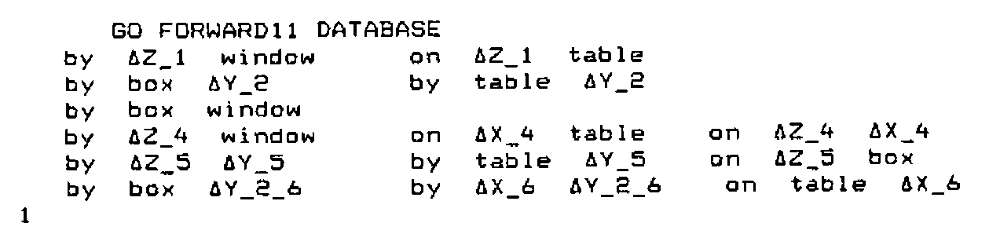
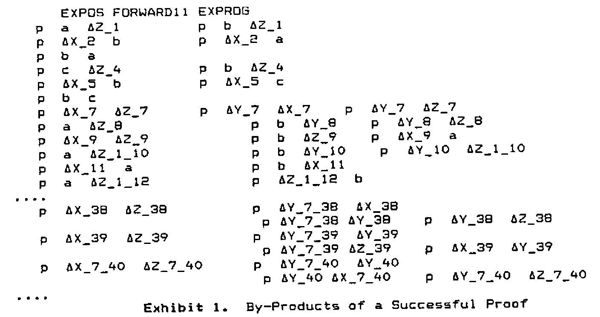
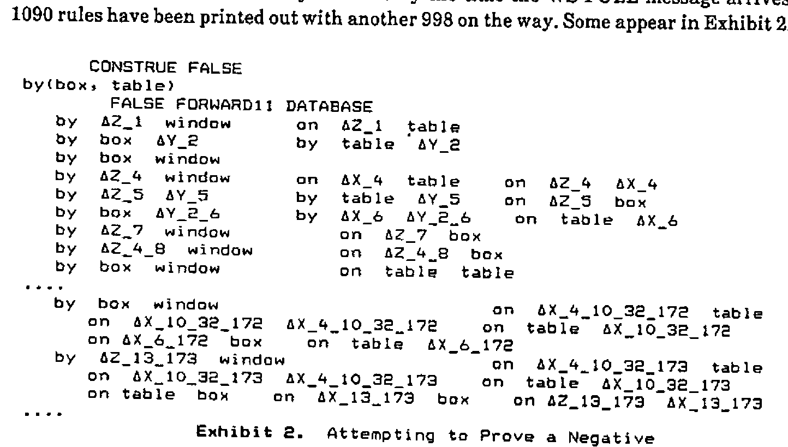
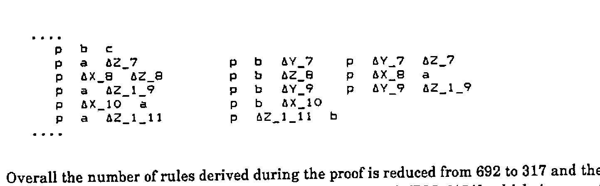
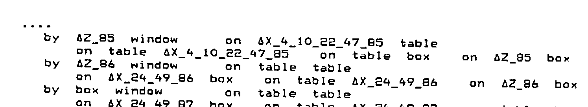
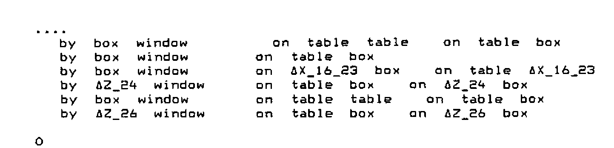
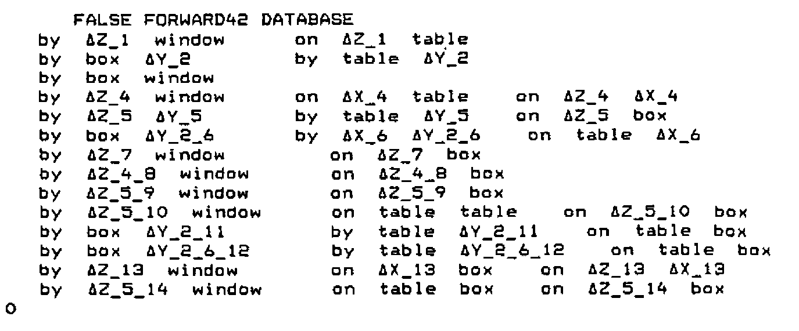
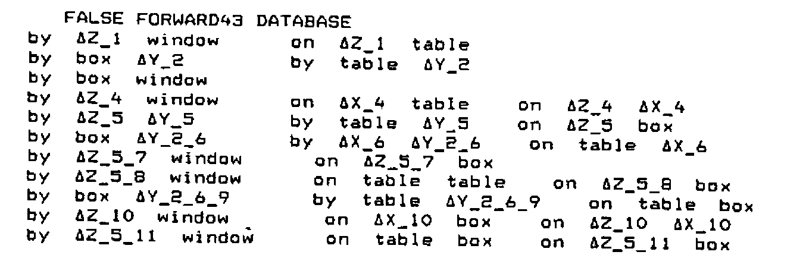
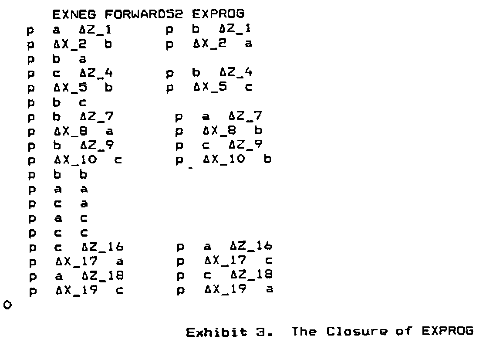

by Allan G. Prys Williams<br>Department of Management Science and Statistics<br>University of Wales, Swansea
{ .byline }

## Abstract

Forward chaining is the method of logical inference most ‘natural’ in APL. Naive implementations on real machines can easily prove impractical: they fail to terminate or they outgrow the workspace. Code is provided to restrict this growth and provide controlled behaviour in various circumstances. It turns out that there are two basic situations and the methods that work for one will not work for the other. Rules are given for both.

## Logical Structures in APL:<br>Data Structures

Standard APL logic structures are explained in [1], and [2] gives the associated functions as they appear in Dyalog. The data structures used are nested character vectors of considerable depth. In IBM’s terminology the highest level is the <u>database</u>, which is a vector of <u>clauses</u> each of which is supposed to be true.

A typical database is EXPROG whose contents in logical notation are

```text
      CONSTRUE EXPROG
p(a, b)
p(c, b)
(∩X)(∩Z)(p(X, Z) ← (∪Y)(p(X, Y) ∧ p(Y, Z)))
(∩X)(∩Y)(p(X, Y) ← p(Y, X))
```

while the actual APL structure of the middle two clauses is given below. Note that the factual statement has a null right hand side, and that the variables are flagged by their initial deltas, as well as their capital letters. The general rule in the display (rule 3) can be interpreted as ‘for all X and Z, X is near Z if there exists a Y such that X is near Y and Y is near Z’. Rule 4, which is not expanded, can be read as ‘for all X and Y, X is near Y if Y is near X’.

![DISPLAY↑EXPROG[2 3]: the fact p c b with an empty right-hand side, and the rule p ∆X ∆Z with right-hand side p ∆X ∆Y and p ∆Y ∆Z, as nested boxes](art10007040/display-exprog.png)

A clause is a two element vector of <u>lists</u> of <u>predicates</u>. A predicate is a statement which is essentially indivisible, such as p(a,b), the general form being:

```text
relation term1 term2 ....
```

where terms may be variable or fixed. Predicates are the building blocks of logic statements. The left hand side of a clause has usually one element, which is taken to be true if all the right hand side elements are true (unconditionally if there are no such elements). If there is more than one left hand predicate, then the clause means that at least one of them follows from the right hand side. There can be any number of right hand predicates, or none. All will have to be true to justify the left hand side.

Terms can be complex structures, as they may each be of the form

```text
function term11 term12....
```

so that logical functions tend to be highly recursive.

## Combining Statements

In the basic system, predicates are compared by the recursive UNIFYA function which reports to UNIFY. UNIFY says whether two predicates are the same after appropriate substitutions and, if so, also returns the substitutions. This function is used by the RESOLVANT function to compare clauses in the database.

```apl
     ∇ Z←AR RESOLVANT BR;T
[1]    ⍝UNIFY AR with BR, Z is 0 or the implied resolution. A & B are global
[2]     Z←0 ⋄ →(⊃T←AR UNIFY BR)↓0
       ⍝Assume failure: return with 0 if no UNIFY
[3]     Z←(((1⊃A)~⊂AR),1⊃B)((2⊃A),(2⊃B)~⊂BR)
[4]     Z←(EVAL DEPTH1 Z)(2⊃T)
```

This function is used inside functions such as:

```apl
     ∇ Z←A RESOLVE1 B                      ⍝ find all rules generated from A, B
[1]     Z←,(1⊃A)∘.RESOLVANT(2⊃B)          ⍝ vector of results
[2]     B A←A B                            ⍝ reverse order and ...
[3]     Z←Z,,(1⊃A)∘.RESOLVANT(2⊃B)        ⍝ ... repeat and catenate.
[4]     Z←Z~0                              ⍝ eliminate where there wasn't a result.
```

which are designed to see if a new clause can be found from the combination of two old ones. Here RTEST2 is a two element database from [1]

```text
      CONSTRUE A B←RTEST2
(∩X)(p(a) ∨ p(X) ∨ q)
r ← p(a)
```

and use of the function indicates that two new rules can be found by referring the p(a) in the second clause to either the p(a) or the p(X) [remember X is a variable] in the first clause:

```apl
      +C←A RESOLVE1 B
 p  ∆X    q  r                 p  a    q  r          ∆X←(,'a')
```

the result being one complex and one simple rule (together with the necessary substitution):

```text
      CONSTRUE⊃¨C
(∩X)(p(X) ∨ q ∨ r)
p(a) ∨ q ∨ r
```

## Forward Chaining

In many ways, the natural approach to inference in APL is a breadth-first one. It uses the ‘jot-dot’ technique. A function generates all immediate consequences of comparing all the rules in the database with each other, then compares the database with all the generated consequences, and so on until either the object of the search is found or no new rules appear.

This technique is very robust. Apparently simple rules, such as EXPROG[4], are able to throw sophisticated depth-first searching algorithms into confusion. Textbooks on Prolog (e.g. [3] Section 7.2) spend a lot of energy preaching the avoidance of such commutative or ‘left recursive’ rules. While a breadth-first search may still find an infinite path, it will not lock onto it to the exclusion of simpler ones.

It is called forward chaining because it works forward from the database rather than backwards from the object to be proved.

```apl
     ∇ PZ←GOAL FORWARD11 DB;NEW;NEW2;I;M ⍝ VCOUNT external
[1]     PZ←1 ⋄ VCOUNT←0                   ⍝ assume goal will be found.
[2]     NEW←DB                             ⍝ DB against itself first time
[3]    L1:→(⊃(⊂GOAL)(UNIFY UNTIL 1)NEW)/0 ⍝ done if goal is found
[4]     NEW2←NEW∘.RESOLVE1 DB              ⍝ resolve everything
[5]     DB←∪DB,NEW                         ⍝ add last set of results to DB
[6]     NEW←∪⊃¨⊃,/,NEW2                    ⍝ bring out new inferences
[7]     NEW←(~OBVIOUS¨NEW)/NEW             ⍝ attempt to eliminate tautologies
[8]     ⎕←↑NEW←VRENAME¨NEW                 ⍝ rename variables
[9]     →(0=⍴NEW)/FAIL ⋄ →L1               ⍝ fail if nothing new, else redo
[10]   FAIL:PZ←0
```

Line 3 checks whether the goal matches, or is an instance of, one of the rules that are generated. The ‘jot-dot’ in line 4 is the mark of a breadth-first approach. The intrinsic problem of this approach is that a lot of redundant rules are generated on the way. Line 7 is an early attempt to cut things down by rejecting anything that is of the form ‘X implies X’. This is done by the function:

```apl
     ∇ Z←OBVIOUS X ⍝ Checks to see if a predicate occurs both sides of X
[1]     →(2≠⍴X)/Z←0                ⍝ Precaution: is X a clause?
[2]     →(1=∨/(⊂'')≡¨X)/Z←0        ⍝ Precaution: is X a fact (pos or neg)
[3]     Z←∨/,⊃((∘.≡)/X)            ⍝ Matches each of X[1] to each of X[2]
```

For an example, we take the simple target GO and the database DATABASE:

```text
      CONSTRUE GO
by(box, window)
      CONSTRUE DATABASE
by(table, window)
on(box, table)
(∩Z)(∩Y)(by(Z, Y) ← (∪X)(by(X, Y) ∧ on(Z, X)))
```

What happens is displayed by line 8 of FORWARD11 which outputs the new, derived rules.



First two intermediate rules are generated, and then a batch of four, the first of which is the intended result. The limitations of this intuitively appealing approach become apparent as soon as we try to prove something using the database EXPROG defined above.

```text
      CONSTRUE EXPOS
p(a, c)
```

The function FORWARD11 generates 692 intermediate rules in the course of producing a proof at two removes.



*Exhibit 1. By-Products of a Successful Proof*
{ .caption }

The result is even worse if we try to prove something that is in fact false using the DATABASE rules. In theory, it should inspect all possible deductions and return a zero when the goal doesn’t match any of them. By the time the WS FULL message arrives, 1090 rules have been printed out with another 998 on the way. Some appear in Exhibit 2.



*Exhibit 2. Attempting to Prove a Negative*
{ .caption }

It is the purpose of the rest of this paper to give the idiom that will reduce these problems, and to discuss the extent to which they are in fact insoluble.

## Limiting Resolution: Suitable Filters

Looking at the seventh derived rule in the proof of EXPOS we find that the two predicates on the right hand side are identical. This sort of inefficiency is common as the number of cycles increases, so one way of improving the system is to ban over-inflated results. The simple idiom for this is in line 5 of

```apl
     ∇ Z←A RESOLVE2 B                      ⍝ find all rules generated from A, B
[1]     Z←,(1⊃A)∘.RESOLVANT(2⊃B)          ⍝ vector of results
[2]     B A←A B                            ⍝ reverse order and ...
[3]     Z←Z,,(1⊃A)∘.RESOLVANT(2⊃B)        ⍝ ... repeat and catenate.
[4]     Z←Z~0                              ⍝ eliminate where there wasn't a result.
[5]     Z←((⊃¨Z)≡∪¨¨⊃¨Z)/Z                ⍝ reject results if redundant predicates
```

and when we rerun using a new function FORWARD21 which is FORWARD11 with RESOLVE2 replacing RESOLVE1 we get:



Overall the number of rules derived during the proof is reduced from 692 to 317 and the time from 1081 to 515 cpu seconds [on an unimproved IBM 6151] which is a vast improvement.

However, there are still a lot of results that seem far more complicated than the original rules. These are, as are all the results that we are disallowing, logically valid. But are they useful, as well as true? The need for some sort of further improvement is shown by the fact that an attempt to prove the negative result for FALSE against the 3-element DATABASE again fails to converge within the available space and time.

One way to detect redundancy is to say that there should be an improvement in specialisation from the original general rules to the derived rules. This would be a strong heuristic principle, expressed by the exact rule that the number of variables should be reduced at each stage. We can do this by invoking existing utility functions, which were explained in [2] and are given in the appendix:

```apl
     ∇ Z←A RESOLVE3 B                      ⍝ find all rules generated from A, B
[1]     Z←,(1⊃A)∘.RESOLVANT(2⊃B)          ⍝ vector of results
[2]     B A←A B                            ⍝ reverse order and ...
[3]     Z←Z,,(1⊃A)∘.RESOLVANT(2⊃B)        ⍝ ... repeat and catenate.
[4]     Z←Z~0                              ⍝ eliminate where there wasn't a result.
[5]     Z←((⊃¨Z)≡∪¨¨⊃¨Z)/Z                ⍝ reject results if redundant predicates
[6]     Z←((⊃¨⍴¨DELDREDGE¨⊃¨Z)<1⌈⌈/⊃¨⍴¨DELDREDGE¨A B)/Z ⍝ results must
[7]    ⍝ reduce the number of free variables compared with originals
```

When this is plugged into FORWARD to get FORWARD31 it is at last possible to terminate the negative search of the DATABASE rules. After generating 141 rules in 27449.8 cpu seconds the algorithm decides that no more can be found. However, this approach still gives rise to some ungainly rules:



The improvement in the positive search from EXPROG is less marked, giving a change to 217 from 317 in the number of derived rules and a reduction to 859 in the number of cpu seconds. This is worth having, but could be sacrificed if we were worried about disallowing some derived rules that might be useful as well as valid.

It will be seen from the derived rules just displayed that many of them are still very cumbersome. The presence of nonsensical predicates such as ‘on(table, table)’ is logically perfectly proper. It appears in a rule that says ‘<u>if</u> the table is on the table [and other conditions] <u>then</u> Z86 is by the window’. A human logician would say that this was true but pointless. It is impossible for a machine to have a general concept of pointlessness, the nearest approach being heuristic principles that certain lines should not be pursued. We have begun to try this in RESOLVE3, and a stronger approach would be to say that any derived rule should be no more complicated than the longest of its parents.

We already have this principle in terms of the number of variables, so we add a filter based on the number of predicates on either side of the derived rule:

```apl
     ∇ Z←A RESOLVE4 B                      ⍝ find all rules generated from A, B
[1]     Z←,(1⊃A)∘.RESOLVANT(2⊃B)          ⍝ vector of results
[2]     B A←A B                            ⍝ reverse order and ...
[3]     Z←Z,,(1⊃A)∘.RESOLVANT(2⊃B)        ⍝ ... repeat and catenate.
[4]     Z←Z~0                              ⍝ eliminate where there wasn't a result.
[5]     Z←((⊃¨Z)≡∪¨¨⊃¨Z)/Z                ⍝ reject results if redundant predicates
[6]     Z←(⊃¨∧/¨(⍴¨¨⊃¨Z)≤⌈/⍴¨¨A B)/Z ⍝ do not allow increased length
[7]     Z←((⊃¨⍴¨DELDREDGE¨⊃¨Z)<1⌈⌈/⊃¨⍴¨DELDREDGE¨A B)/Z ⍝ results must
[8]    ⍝ reduce the number of free variables compared with originals
```

The positive search now takes rather longer and there is no saving in the number of derived rules. However, the negative search terminates with only 27 rules in 735 seconds, as compared with 141 in 27450 seconds.



## Opportunity Costs

Increasing the selectivity of the resolution process brings practical disadvantages. There are some contexts in which the database only contains rules, and the factual element is picked up from the goal. The function of the forward chaining is to generate rules of gradually increasing complexity until they match the goal. An example is the 2-element MEMDB database, shown together with three possible goals.

```text
      CONSTRUE MEMDB, M1 M2 M3
(∩X)(∩XS)member(X, X(XS))
(∩X)(∩YS)((∩Y)member(X, Y(YS)) ← member(X, YS))
member(1, [1,4,5,1])
member(1, [4,5,1])
member(1, [2,4,5,1])
```

Here a list is represented, using a structure discussed in detail in [4], as a head-tail pair. The first rule says that X is a member of a list if it is the element that is the head of the list. The second rule says that X is a member of a list if it is a member of the tail of that list. The first goal is an instance of the first rule.

```apl
      M1 FORWARD41 MEMDB
1
```

But the second goal cannot be matched as no new rules are generated under the restrictions we have just been imposing:

```apl
      M2 FORWARD41 MEMDB
0
      M2 FORWARD31 MEMDB
0
```

Only when we go back two stages is the function allowed to generate complex sub-rules:

```text
      M2 FORWARD21 MEMDB
member   ∆X_1   ∆Y_1    ∆X_1   ∆XS_1
member   ∆X_2   ∆Y_2    ∆Y_1_2   ∆X_2   ∆XS_1_2
1
```

M2 is an instance of the new rule generated on the second cycle. M3 needs three cycles:

```text
      M3 FORWARD21 MEMDB
member   ∆X_1   ∆Y_1    ∆X_1   ∆XS_1
member   ∆X_2   ∆Y_2    ∆Y_1_2   ∆X_2   ∆XS_1_2
member   ∆X_3   ∆Y_3    ∆Y_2_3   ∆Y_1_2_3   ∆X_3   ∆XS_1_2_3
1
```

Clearly, it is impossible to prove a negative using this approach. The database will go on hopefully generating longer and longer lists until the workspace limits are reached.

## Editing Out Redundant Rules

One of the first things generated by DATABASE is the fact ‘by(box, window)’, but many later derived rules are of the form ‘by(box, window) <u>if</u> … ’. These are redundant since something that is true unconditionally is always true conditionally. This suggests that, if we detect absolute rules, any clauses that give conditional forms of them can be discarded. Line 8 in the revised function below finds clauses with null right hand sides in the old rules, and line 9 throws away any new rules that have these as their left hand side.

```apl
     ∇ PZ←GOAL FORWARD12 DB;NEW;NEW2;I;M ⍝ VCOUNT external
[1]     PZ←1 ⋄ VCOUNT←0                   ⍝ assume goal will be found.
[2]     NEW←DB                             ⍝ DB against itself first time
[3]    L1:→(⊃(⊂GOAL)(UNIFY UNTIL 1)NEW)/0 ⍝ done if goal is found
[4]     NEW2←NEW∘.RESOLVE1 DB              ⍝ resolve everything
[5]     DB←∪DB,NEW                         ⍝ add last set of results to DB
[6]     NEW←∪⊃¨⊃,/,NEW2                    ⍝ bring out new inferences
[7]     NEW←(~OBVIOUS¨NEW)/NEW             ⍝ attempt to eliminate tautologies
[8]     M←((⊂'')≡¨2⊃¨DB)/DB                ⍝ find facts in old results
[9]     ⍎(0≠⍴NEW)/'NEW←(∧⌿(⊃¨M)∘.≢⊃¨NEW)/NEW' ⍝ delete rules proving facts
[10]    ⎕←↑NEW←VRENAME¨NEW                 ⍝ rename variables
[11]    →(0=⍴NEW)/FAIL ⋄ →L1               ⍝ fail if nothing new, else redo
[12]   FAIL:PZ←0
```

Analogous functions FORWARD22, FORWARD32 and FORWARD42 use the more restrictive RESOLVE functions.

The negative search is much shorter in terms of both rules and time, and the difference is even more marked if RESOLVE3 is used rather than RESOLVE4.



The saving is consistent for the positive search also, but the process is still ungainly. FORWARD42 generates some 175 intermediate rules in proving EXPOS.

Looking at the derived rules from FALSE FORWARD42 DATABASE above, it should be apparent that several say the same thing. There is a block of three reading ‘by(Z,window) <u>if</u> on(Z,box)’ and two reading ‘by(box,Y) <u>if</u> on(table,Y) and on(table,box)’. The uniqueness function does not recognise these because of the suffixes on the variables. The next potential improvement is to check for this:

```apl
     ∇ PZ←GOAL FORWARD13 DB;NEW;NEW2;I;M ⍝ VCOUNT external
[1]     PZ←1 ⋄ VCOUNT←0                   ⍝ assume goal will be found.
[2]     NEW←DB                             ⍝ DB against itself first time
[3]    L1:→(⊃(⊂GOAL)(UNIFY UNTIL 1)NEW)/0 ⍝ done if goal is found
[4]     NEW2←NEW∘.RESOLVE1 DB              ⍝ resolve everything
[5]     DB←∪DB,NEW                         ⍝ add last set of results to DB
[6]     NEW←∪⊃¨⊃,/,NEW2                    ⍝ bring out new inferences
[7]     NEW←(~OBVIOUS¨NEW)/NEW             ⍝ attempt to eliminate tautologies
[8]     M←((⊂'')≡¨2⊃¨DB)/DB                ⍝ find facts in old results
[9]     ⍎(0≠⍴NEW)/'NEW←(∧⌿(⊃¨M)∘.≢⊃¨NEW)/NEW' ⍝ delete rules proving facts
[10]    →(0=⍴NEW)/FAIL                     ⍝ fail if nothing new, else begin ...
[11]    I←1 ⋄ M←0⍴0                        ⍝ loop to eliminate effective duplicates
[12]   loop:M,←1=(⊂I⊃NEW)(FRAUD UNTIL 0)I↓NEW,DB ⍝ generate mask M for...
[13]    →((⍴NEW)≥I←I+1)/loop               ⍝ genuinely new results.
[14]    ⎕←↑NEW←VRENAME¨M/NEW               ⍝ rename variables
[15]    →(0=⍴NEW)/FAIL ⋄ →L1               ⍝ fail if nothing new, else redo
[16]   FAIL:PZ←0
```

Lines 11 to 13 generate a mask to filter out rules that are effectively identical to those already generated. The function FRAUD was introduced in [2]

```apl
     ∇ Z←X FRAUD Y;T ⍝Determines if X is the same as Y modulo labelling
[1]     Z←0 ⋄ →(X≡Y)/0 ⍝ 0 means fraud. Exit if identical
[2]     T←⎕EX'∆'⎕NL 2 ⋄ T←X UNIFYA Y ⋄ ⍎(T=0)/'Z←1 ⋄ →0'
[3]    ⍝ If X and Y do not unify, no fraud. Else look for substitutions
[4]     T←↓'∆'⎕NL 2 ⋄ ⍎(0=⍴T)/'Z←1 ⋄ →0' ⍝ Precaution against null case
[5]     T←⍎¨T ⋄ →(∧/'∆'≡¨⊃¨T)/0 ⍝ If all substitutions are simple variables
[6]     Z←1 ⍝ then fraud, else pass it as having some content.
```

We have now reached a minimal set of derived rules for DATABASE



and a similar improvement is found for EXPROG. The pattern in the number of derived rules can be set out as a table:

Number of Derived Rules for EXPOS FORWARD.. EXPROG

| | RESOLVE4 | RESOLVE3 | RESOLVE2 | RESOLVE1 |
| --- | ---: | ---: | ---: | ---: |
| FORWARD3 | 91 | 91 | 118 | 118 |
| FORWARD2 | 175 | 175 | 275 | 646 |
| FORWARD1 | 217 | 217 | 317 | 692 |

and for those versions for which the negative search converges:

Number of Derived Rules for FALSE FORWARD.. DATABASE

| | RESOLVE4 | RESOLVE3 |
| --- | ---: | ---: |
| FORWARD3 | 11 | 17 |
| FORWARD2 | 14 | 26 |
| FORWARD1 | 27 | 141 |

The relationship between choice of functions and time shows that the final improvement carries a considerable cost:

CPU Seconds for EXPOS FORWARD.. EXPROG

| | RESOLVE4 | RESOLVE3 | RESOLVE2 | RESOLVE1 |
| --- | ---: | ---: | ---: | ---: |
| FORWARD3 | 11387 | 11222 | 23641 | 23590 |
| FORWARD2 | 839 | 828 | 497 | 1066 |
| FORWARD1 | 869 | 859 | 515 | 1081 |

though the effect is far less marked, or even absent, in the negative case:

CPU Seconds for FALSE FORWARD.. DATABASE

| | RESOLVE4 | RESOLVE3 |
| --- | ---: | ---: |
| FORWARD3 | 305 | 755 |
| FORWARD2 | 262 | 935 |
| FORWARD1 | 735 | 27450 |

This discrepancy is based in the fundamental difference between the two types of inference. The positive case requires the system to have a minimum time per cycle. Since halting is certain, redundancy is only worth eliminating if it is slowing things down. The negative case will not halt until it reaches a closed set of inferences, and thus the extra checking may well pay off in terms of time as well as elegance.

This type of checking for duplication could be strengthened to include cases where the lists contain the same predicates in a different order. These are logically equivalent, although the order of the predicates can make a big difference in many practical systems of inference (e.g. Prolog). However, this would require the unification of every permutation of one with every permutation of the other, with a frightening effect on overheads. Already, the FRAUD check often takes far longer than the original resolutions.

None of these precautions is sufficient to provide a closure for EXPROG. The set of possible deduced rules of no greater complexity than the originals is vast. For instance, in a single cycle FORWARD33 has to reduce NEW from 1271 items in line 9 to 277 in line 14. This prevents the size from exploding in the next cycle, but involves more than eight hundred thousand comparisons and takes an incredible length of time.

The extra overheads in terms of time seem to correspond to the use of the functions DELDREDGE and FRAUD. Thus FORWARD22 is fast and uses, apart from the resolution function, only raw APL. Since it also permits use of expanding systems such as MEMDB, it can be recommended for use in any situation where positive inference is expected, though it would be necessary in practice to trap the WS FULL error.

## Forcible Closure

It appears that, to get a system strong enough to terminate a negative search of a general set of rules, it is necessary to be downright brutal. It is also advisable to use raw APL as far as possible. We thus posit a form of resolution so strong that the extra checking in the third variant of FORWARD should be largely unnecessary:

```apl
     ∇ Z←A RESOLVE5 B                      ⍝ find all rules generated from A, B
[1]     Z←,(1⊃A)∘.RESOLVANT(2⊃B)          ⍝ vector of results
[2]     B A←A B                            ⍝ reverse order and ...
[3]     Z←Z,,(1⊃A)∘.RESOLVANT(2⊃B)        ⍝ ... repeat and catenate.
[4]     Z←Z~0                              ⍝ eliminate where there wasn't a result.
[5]     Z←((⊃¨Z)≡∪¨¨⊃¨Z)/Z                ⍝ reject results if redundant predicates
[6]     Z←(⊃¨∧/¨(⍴¨¨⊃¨Z)<¨(⊂2 1)⌈⌈/⍴¨¨A B)/Z
       ⍝ do not allow increased length
[7]     Z←((+/¨'∆'=¨∊¨⊃¨Z)<1⌈⌈/+/¨'∆'=¨∊¨A B)/Z ⍝ must reduce variables
```

This requires that the resolvants should be both simpler and positively shorter than the fuller of the original rules. It is powerfully reductive:

```text
      FALSE FORWARD52 DATABASE
by   ∆Z_1   window       on   ∆Z_1   table
by   box    ∆Y_2         by   table  ∆Y_2
by   box    window
by   ∆Z_4   window       on   ∆Z_4   box
0
```

and even EXPROG can only give rise to 19 rules.



*Exhibit 3. The Closure of EXPROG*
{ .caption }

EXPOS is proved after 15 cycles, and the times are 104.4 cpu secs for EXPOS and 232.7 secs for EXNEG, using FORWARD52 in both cases. FORWARD53 takes about twice as long, but has no effect on the outcome. FORWARD51 is not recommended. It takes longer than FORWARD52 and EXNEG does not converge.

## Conclusions

It is clear that there is no single best approach to forward chaining. The two quite different situations are:

1. one where it is virtually certain that a rule will eventually be generated to match the goal. This is best matched by the limited restrictions in RESOLVE2 and FORWARD22. In practice it would be necessary to trap the WS FULL error.
2. the more plausible one where a negative result is highly possible. This requires a set of rules that stops growing reasonably quickly, and there is no general principle to do this that will also allow complex rules to be generated. In this case we recommend RESOLVE5 used within FORWARD52.
{ type="a" }

At the theoretical level the precautionary technique in the FORWARD3 group of functions is extremely effective, but the cost in cpu time is unacceptable for most applications.

## References

1. Brown et al., ‘Algorithms for Artificial Intelligence in APL2’ in APL86 Tutorials, ed Camacho, London 1986, pp 87 - 150.
2. Prys Williams, A. G., ‘Extending IBM’s Logic Algorithms in Dyalog’ in Vector Vol 4.1 (July 1987) pp104-122
3. Sterling, L. and Shapiro, E, The Art of Prolog, M.I.T., 1986
4. Guerreiro, R., ‘APL2 and LISP: A Comparison’ in APL86 Tutorials (London 1986) pp151-174

## Appendix: Other Functions That Have Been Cited.

The function DELDREDGE returns the set of variables cited within a logical statement:

```apl
     ∇ R←DELDREDGE A       ⍝ Look for variables in A
[1]     R←''               ⍝ Initialise list for variables
[2]     DREDGE1 A          ⍝ Search A. Variables are passed to R
[3]     R←∪R~⊂''           ⍝ Delete duplicates and header
```

using the subsidiary function

```apl
     ∇ DREDGE1 A                              ⍝ Pass variables back to R in DREDGE
[1]     →((1≥|≡A)∧('∆'≡⊃A)∧3=⎕NC⍕A)/0        ⍝ Stop on meeting logic function
[2]     ⍎(1≥|≡A)/'R,←⊂(''∆''=⊃A)/A ⋄ →0'    ⍝ If A simple & variable, keep it
[3]     DREDGE1¨A                             ⍝ If complex, look one stage lower
```

The operator UNTIL is essentially that given in [1] changed to compare THIS with the first element in the result:

```apl
     ∇ Z←(L)(F UNTIL THIS)R;I   ⍝EACH THAT QUITS ON TRUE/FALSE
[1]     →(2≠⎕NC'L')/MONADIC
[2]     →(0≠⍴⍴L)/L1                    ⍝branch L not scalar
[3]     L←(⍴R)⍴L                       ⍝extend scalar left
[4]    L1:→(0≠⍴⍴R)/L2                  ⍝branch R not scalar
[5]     R←(⍴L)⍴R                       ⍝extend scalar right
[6]    L2:Z←I←0                        ⍝initialize result and counter
[7]    LP:→(I≥⍴R)/0                    ⍝exit when counter exceeds length
[8]     →(THIS≡⊃Z←(⊃I↓L)F(⊃I↓R))/0     ⍝exit when result THIS
[9]     I←I+1 ⋄ →LP                    ⍝continue
[10]   MONADIC:Z←I←0                   ⍝initialize result and counter
[11]   LP1:→(I≥⍴R)/0                   ⍝exit when counter exceeds length
[12]    →(THIS≡⊃Z←F(⊃I↓R))/0           ⍝exit when result THIS
[13]    I←I+1 ⋄ →LP1                   ⍝continue
```
