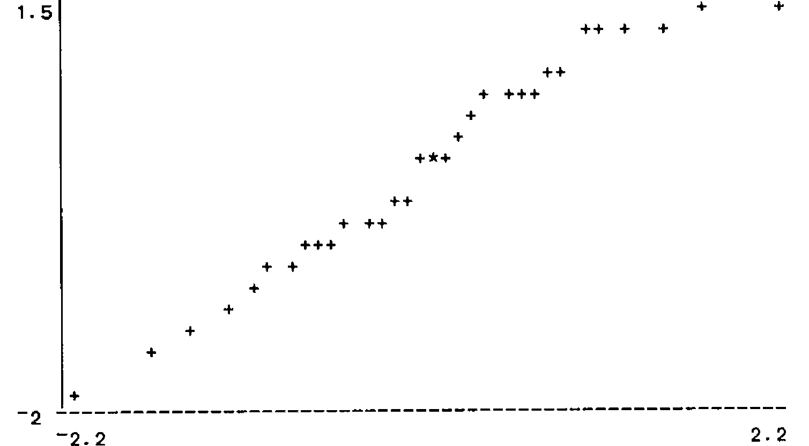
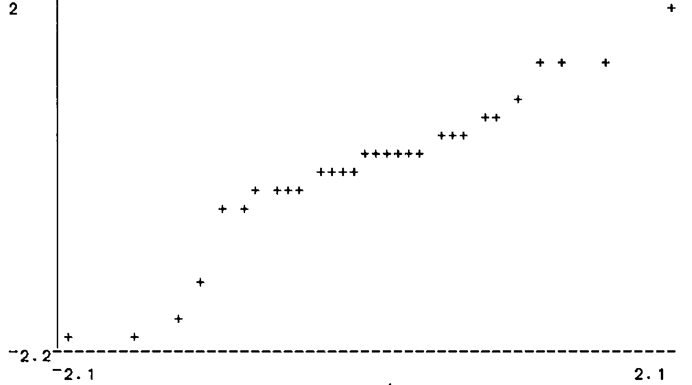

## Abstract

An expert system is described which runs the functions in an existing APL workspace as though it were a diligent first-year statistics student. The rules that it operates under are contained as logical data and can be reviewed and modified by an expert without any need to alter APL functions. The special functions used provide a model for a wide class of systems that can run existing APL software.

## 1. The Object

Inexperienced users of Statistics are often faced with a bewildering array of options when asked to analyse their set of data. In an APL environment, this typically means that they have a variable containing numerical data and need to choose the appropriate functions from an existing workspace to test it and display it. This calls for an expert system that will act as the equivalent of an experienced user looking over their shoulder and tell them what to do. Generically, expert systems:

1. Use sets of explicit *rules*.
2. Ask questions and remember the answers.
3. Give the user suggestions as to what they should *do* and perhaps do it for them.
4. Have massive overheads from complex logical systems.

In an APL environment, the expert system will itself run in APL, but it can be distinguished from ‘ordinary’ APL functions which:

1. Have their rules hidden.
2. Return a unique answer for unique data.
3. Require users to know which function they want.
4. Represent perhaps years of investment.

The expert system is a statement about the large amount of expertise already embodied in the APL functions.

The present expert system contains knowledge about the rules of Statistics and (perhaps) about the data, organised so that a standard function can carry out an appropriate analysis, asking the user questions if it has to. Except for the few special functions, all the analyses can be repeated or varied by the user from the keyboard if he or she wants to find out more. In other words, the expert system function uses the existing workspace as though it were a diligent first-year Statistics student.

The fact that the rules are held as data in a logical form, rather than inside APL functions, means that they can be varied easily by someone with a minimal knowledge of APL. This removes the need to be simultaneously expert in both APL and Statistics.

Standard APL logic structures are explained in [1] and [2] and the provision of an ability to implement existing APL functions is explained in [3] The reader can either refer to them or take the logical functions as read. The ‘inference engine’ itself is a function called PROLOGT which acts on vectors of Prolog-like rules and allows the user to respond by asking for another solution or for an explanation of its reasons.

### 1.1 The Existing Workspace

We start with a substantial array of standard APL functions for displaying and analysing data.

*Display Functions*

HIST
:   Displays a histogram of (pooled) data across the screen, each cell being marked by its mid-point.

BTBHIST
:   A similar function that compares two sets of data, back-to-back.

UNIQFREQ
:   Gives a frequency distribution for (pooled) data.

PLOT
:   Scatterplot comparing two variables.

QQPLOT
:   Diagnostic aid in judging Normality. A straight line would indicate an exactly Normal distribution. Real samples from Normal populations are allowed to wobble a bit.

BREAKDOWN
:   Display summary statistics for mult-group data.

*Test Functions* Unless otherwise stated, all these functions return a 2-sided tail probability.

IOD
:   Gives the tail probability from an Index of Dispersion test. A highish value is expected from a Poisson distribution.

CHISI
:   The probability from a standard Chi-squared test for independence in a contingency table.

TTEST
:   Matched-pairs t-test.

WTEST
:   Matched-pairs Wilcoxon test.

TWOT
:   2-sample t-test for location.

TWOW
:   2-sample Wilcoxon test for location.

PEARSON
:   Tests Pearson correlation using t-approximation.

SPEARMAN
:   Tests Spearman correlation using t-approximation.

KRUSKALL
:   Tests difference between groups using Kruskall-Wallace method.

ANOVA
:   One-way Analysis of Variance.

FTEST
:   Test for difference of scatter between two samples

### 1.2 The Special Functions

The cover function takes as right argument the *name* of the data variable, and has the significance level as an optional left argument. If this is not specified, it reports exact probabilities. This is usually taken to be better practice, but it can have have strange side-effects if carried out with logical thoroughness.

```apl
      ∇ {R}←{LA}LOOKAT RA;⎕TRAP
       ⍝ Run expert system on data in RA at sig LA
[1]     ⎕TRAP←11 'E' '''Right argument must be the name of an object'' ⋄ →0'
[2]     →((0=⍴⍴⍎RA)∨2;≡⍎RA)/badshape
       ⍝ Expects fairly simple data objects
[3]     ⍎(0=⎕NC'LA')/'LA←''∆Level'''
       ⍝ Monadic case: report probabilities
[4]     LA←,⍕LA
       ⍝ Convert LA to character string: RA must be a NAM
[5]     R←(''(,⊂'suggest'RA'∆Test'LA))PROLOGT STATDB
       ⍝ Runs logic program
[6]     ⍎(R=0)/'''No suitable test found by set of rules in STATDB''' ⋄ →0
[7]    badshape:RA,' has too complicated a structure for this function'
```

Exhibit 1 shows the rules of the expert system, reduced to a logical format; the APL object being in fact a nested character vector of great complexity. Each rule, except the first, gives conditions that must be true before a particular test is tried, and runs the test if they are all passed. The first rule tells the system to look for a test, and, if it finds one, looks for an appropriate display. Most of these are adapted from a student project by David Austin who was developing a similar system, but one in which much of the structure was held inside a function, rather than being free-standing logical rules.

```
      ASCIFY STATDB
suggest(Name, Test, Level) <-
  sig_test(Name, Test, Level) , SHOW(Name, Test)
sig_test(Name, IOD, Level) <-
  VERIFY(Name, discrete) , VERIFY(Name, same_var) ,
  UNLESS(RUNTEST(Name, IOD, Level))
sig_test(Name, TTEST, Level) <-
  VERIFY(Name, same_var) , VERIFY(Name, 2-sample) ,
  VERIFY(Name, matched) , VERIFY(Name, normal) ,
  RUNTEST(Name, TTEST, Level)
sig_test(Name, WTEST, Level) <-
  VERIFY(Name, same_var) , VERIFY(Name, 2-sample) ,
  VERIFY(Name, matched) , RUNTEST(Name, WTEST, Level)
sig_test(Name, FTEST, Level) <-
  VERIFY(Name, same_var) , VERIFY(Name, 2-sample) ,
  VERIFY(Name, normal) , RUNTEST(Name, FTEST, Level)
sig_test(Name, TWOT, Level) <-
  VERIFY(Name, same_var) ,
  VERIFY(Name, 2-sample) , VERIFY(Name, normal) ,
  UNLESS(RUNTEST(Name, FTEST, Level)) ,
  RUNTEST(Name, TWOT, Level)
sig_test(Name, TWOW, Level) <-
  VERIFY(Name, same_var) , VERIFY(Name, 2-sample) ,
  RUNTEST(Name, TWOW, Level)
sig_test(Name, PEARSON, Level) <-
  VERIFY(Name, 2-sample) , VERIFY(Name, matched) ,
  VERIFY(Name, normal) , RUNTEST(Name, PEARSON, Level)
sig_test(Name, SPEARMAN, Level) <-
  VERIFY(Name, 2-sample) , VERIFY(Name, matched) ,
  RUNTEST(Name, SPEARMAN, Level)
sig_test(Name, ANOVA, Level) <-
  VERIFY(Name, same_var) , VERIFY(Name, many-sample) ,
  VERIFY(Name, normal) , RUNTEST(Name, ANOVA, Level)
sig_test(Name, KRUSKALL, Level) <-
  VERIFY(Name, same_var) , VERIFY(Name, many-sample) ,
  RUNTEST(Name, KRUSKALL, Level)
sig_test(Name, CHISI, Level) <-
  VERIFY(Name, discrete) , VERIFY(Name, matched) ,
  VERIFY(Name, counts) , RUNTEST(Name, CHISI, Level)
sig_test(Name, pooled, Level) <- VERIFY(Name, same_var)
```

*Exhibit 1. The Rules For The Expert System*
{ .caption }

The first special utility function is

```apl
      ∇ R←RUNTEST PASS;N;F;L;⎕TRAP;⎕PP
       ⍝ Runs test F on data in N at level L
[1]     ⎕TRAP←((3 4 5 11)'C' '→R←0') ⋄ ⎕PP←2
       ⍝Index,rank,length,domain error
[2]     N F L←PASS ⋄ →(∨/'∆'≡¨⊃¨N F)/R←0
       ⍝ Fail if data or test not defined
[3]     R←⍎F,' ',N
       ⍝ F must be a monadic function on numerical data
[4]     ⍎('∆'≡⊃L)/'⍎L,''←,⍕2 SIGFIG R'' ⋄ R←1 ⋄ →0'
       ⍝ giving a probability
[5]     R←R≤⍎L
       ⍝ N.B. N and F are names of APL objects, L is character
```

This returns a 1 if the test is significant [i.e. returns a probability less than the significance level] and always succeeds if a probability is returned without a level being already specified. In such a case the exact probability becomes the value of ‘Level’. The display is handled by

```apl
      ∇ R←SHOW PASS;N;F;X;⎕TRAP;⎕PP
       ⍝Goal that shows data N according to F
[1]     ⎕TRAP←((3 4 5 11)'C' 'R←1 ⋄ →0')
       ⍝ Index,rank,length,domain errors
[2]     N F←PASS
       ⍝ N is name of object, F is test that was confirmed
[3]     X←GETPROP F'show' ⋄ R←1 ⋄ ⎕PP←2
       ⍝ Look for display function in APL
[4]     ⍎(X≢'')/(⊃⊃X),' ',N
       ⍝ If so, use it. Always succeeds
[5]     X←(⊃¨PR∆P)⍳⊂N ⋄ X←(X≤⊃⍴PR∆P)/X
       ⍝ Reference to N in global memory
[6]     ⍎(0;⊃⍴X)/'X←,X[;2]/(X←↑1↓⊃PR∆P[X])[;1]'
       ⍝ Find properties of N
[7]     ⍎(0;⊃⍴X)/'⍞←N,'' believed to be '',X'
       ⍝ List to screen
```

which looks in a global memory using the standard GETPROP function for an appropriate display function. It also gives some reasons. The checking function is

```apl
      ∇ R←VERIFY PASS;N;F;X;⎕TRAP
       ⍝ Goal that checks contents of PASS
[1]     ⎕TRAP←((3 4 5 11)'C' '→R←0')
       ⍝ Index,rank,length,domain errors
[2]     N F←PASS
       ⍝ N is name of object, F is function that may be true
[3]     X←GETPROP N F
       ⍝ See if we already know the answer
[4]     ⍎(X≢'')/'R←X ⋄ →0'
       ⍝ If so, exit with existing answer
[5]     X←GETPROP F'test'
       ⍝ Look for test function in APL
[6]     ⍎(X≢'')/'R←',(⊃⊃X),' ',N
       ⍝ If so, run test and report answer
[7]     ⍎(X≢'')/'→(R∊0 1)/0'
       ⍝ Exit if answer useful
[8]     X←GETPROP F'text'
       ⍝ Look for text to expand defn. of function
[9]     ⍎(X≡'')/'X←⊂⊂F'
       ⍝ If no text, use name of function
[10]    X←⍕'Are the contents of ',N,(⊃X),'? Y/N [N]'
       ⍝ Construct query
[11]    ⍞←X ⋄ R←⍞ ⋄ R←(⊃⍴X)↓R
       ⍝ Delete question from response
[12]    R←∨/'Yy'∊R ⋄ R←PUTPROP N F R ⋄ →0
       ⍝ Store for future reference
```

which asks questions if necessary and updates the global memory so that it never has to ask the same question twice. Exhibit 2 shows the initial contents of the global memory. It is a nested vector with a name designed to discourage accidental deletion. The utility functions cited in the global memory are simple ones that work directly on numerical variables without conversion to logical notation.

```apl
      ∇ R←VIFM X
[1]     R←X ⍝ Default passes X straight through
[2]     ⍎(1=≡X)/'R←,↓X' ⍝ Matrix converted to nested vector
```

allows for the complicated variety of objects that can occur in second-generation APLs, reducing them to nested vectors as necessary. The remaining functions are tests, corresponding to a quick glance by a human.

```
      ↑PR∆P
TTEST        show   HIST⊃-/VIFM
TWOT         show   BTBHIST/VIFM
FTEST        show   BTBHIST/VIFM
ANOVA        show   BREAKDOWN VIFM
KRUSKALL     show   BREAKDOWN VIFM
pooled       show   HIST⊃,/VIFM
WTEST        show   HIST⊃-/VIFM
IOD          show   UNIQFREQ⊃,/VIFM
SPEARMAN     show   PLOT/VIFM
PEARSON      show   PLOT/VIFM
discrete     test   DISCRETE
2-sample     test   2=⊃⍴
matched      text   matched across cases     test   MATCHED
many-sample  test   MANY
normal       test   QQSHOW
same_var     text   all the same variable    test   SINGLE
TWOW         show   BTBHIST/VIFM
```

*Exhibit 2. The Initial State Of The Global Memory*
{ .caption }

```apl
      ∇ R←DISCRETE X ⍝ Test if elements of X are integers
[1]     R←X≡⌊X

      ∇ R←MANY X ⍝ Check if X contains more than 2 samples
[1]     →((1=≡X)∧1=⍴⍴X)/R←0 ⍝ Fail if a vector
[2]     R←2<⊃⍴X ⍝ Applies to matrix or nested vector
```

The next function is more interesting. It can only fail, or return a null result, since the fact that two groups are the same size is not evidence that they are matched.

```apl
      ∇ R←MATCHED X ⍝ Test if X could be matched data
[1]     →((1=⊃⍴X)∨(1=≡X)∧1=⍴⍴X)/R←0
[2]     ⍎((1=≡X)∧(2=⍴⍴X))/'R←'''' ⋄ →0' ⍝ Possible if a matrix
[3]     R←(~∧/(⊃⍴⊃X)=⊃¨⍴¨1↓X)/0
       ⍝ If nested vectors, see if same length
```

A similar one has a choice between success and nullity:

```apl
      ∇ R←SINGLE X ⍝ Check if X must be a single variable
[1]     R←(((1=⍴⍴X)∧1=≡X)∨(1=⍴X)∧2=≡X)/1 ⍝ Result is 1 or null
```

The last of this group is simply an oblique way of calling up a QQ plot as an assistance to the user:

```apl
      ∇ R←QQSHOW X ⍝ Cover function for QQPLOT
[1]     X←VIFM X ⋄ X←⊃,/(X-¨MEAN¨X)÷¨SDEV¨X
[2]     R←'' ⋄ QQPLOT X ⋄ 'Standardised residuals, all groups/variables'
```

It never gives a definite answer.

The last set of functions are ordinary ones that can be run easily from the keyboard and could in fact be used as such by a very retarded student.

The only restriction (and it is not absolute) on the functions that the machine can run is that they should be self-contained and not ask the user unexpected questions, such as required cell widths, when the user is assumed not to be working interactively with the data. Functions that take all their data as a right argument are preferred, this being easy to arrange in second generation APLs, but the use of ‘PLOT/’ shows that this is not an absolute restriction either.

## 2. Running The System

### 2.1 The Learning Process

The VERIFY function has nothing particularly statistical about it. It simply learns from experience about the characteristics of the variables (or file-reading functions) in the workspace. This saves a lot of time on the second run through the data and in general provides a way of teaching the expert system new facts. Often, for instance when judging normality, the background knowledge that the user has will be needed to supplement the diagnostics built into the expert system. Notice that the default is always to avoid making an assumption.

We show the expert system examining the variable CORN_METHODS which contains data on four different methods of growing corn. There is a background assumption that they are likely not to be normal.

```
      LOOKAT 'CORN_METHODS'
Are the contents of CORN_METHODS discrete ? Y/N [N]
Are the contents of CORN_METHODS all the same variable ? Y/N [N]Y
```



```
Standardised residuals, all groups/variables
Are the contents of CORN_METHODS normal ? Y/N [N]N
```

The system how now asked all its questions and has remembered the answers. The machine comes back with a display:

```
 Group:     1     2     3     4      Overall
 n:         8    10     7     8        33
 Mean:     91    86    96    80        88
 S. dev.   3.9   3.8   3.6   1.7        6.5
CORN_METHODS believed to be  same_var
suggest(CORN_METHODS, KRUSKALL, 0.000015)
;
```

The ‘;’ response is a prompt for another suggestion:

```
7.2E1 │
7.5E1 │
7.7E1 │ ⎕⎕⎕
8.1E1 │ ⎕⎕⎕⎕⎕⎕
8.4E1 │ ⎕⎕⎕⎕⎕
8.7E1 │ ⎕
9.0E1 │ ⎕⎕⎕⎕⎕⎕⎕⎕⎕
9.3E1 │ ⎕⎕⎕⎕
9.6E1 │ ⎕⎕⎕
9.9E1 │ ⎕
1.0E2 │ ⎕
CORN_METHODS believed to be  same_var
(Level)suggest(CORN_METHODS, pooled, Level)
;
```

The system asks appropriate questions and ends up applying the appropriate Kruskall-Wallace test. When fed a ‘;’ it goes back and looks for another answer, finding that the data could be pooled. It reports the exact significance level, 0.000015 for the first and ‘all levels’ for the second. The new state of the global memory is shown in Exhibit 3, so that the second run is much shorter.

```
      .01 LOOKAT 'CORN_METHODS'
 Group:     1      2      3      4      Overall
 n:         8     10      7      8        33
 Mean:     90.8   86.4   95.7   79.9      87.8
 S. dev.    3.85   3.78   3.64   1.73      6.52
CORN_METHODS believed to be  same_var
suggest(CORN_METHODS, KRUSKALL, 0.01)
;
71.5  │
74.5  │
77.5  │ ⎕⎕⎕
80.5  │ ⎕⎕⎕⎕⎕⎕
83.5  │ ⎕⎕⎕⎕⎕
86.5  │ ⎕
89.5  │ ⎕⎕⎕⎕⎕⎕⎕⎕⎕
92.5  │ ⎕⎕⎕⎕
95.5  │ ⎕⎕⎕
98.5  │ ⎕
101.5 │ ⎕
CORN_METHODS believed to be  same_var
suggest(CORN_METHODS, pooled, 0.01)
;
```

```
      ↑PR∆P
TTEST        show      HIST⊃-/VIFM
TWOT         show      BTBHIST/VIFM
FTEST        show      BTBHIST/VIFM
ANOVA        show      BREAKDOWN VIFM
KRUSKALL     show      BREAKDOWN VIFM
pooled       show      HIST⊃,/VIFM
WTEST        show      HIST⊃-/VIFM
IOD          show      UNIQFREQ⊃,/VIFM
SPEARMAN     show      PLOT/VIFM
PEARSON      show      PLOT/VIFM
discrete     test      DISCRETE
2-sample     test      2=⊃⍴
matched      text      matched across cases     test   MATCHED
many-sample  test      MANY
normal       test      QQSHOW
same_var     text      all the same variable    test   SINGLE
TWOW         show      BTBHIST/VIFM
CORN_METHODS same_var  1                        normal 0
```

*Exhibit 3. The Global Memory After Looking At CORN_METHODS*
{ .caption }

The second run used a fixed significance level of 0.01. The fact that the expert system may know things about a variable necessitates its repeating this knowledge after each result. Because the current user may have altered the data, they must be told what previous users told the system about it.

### 2.2 The Effects of Rigour

The effects of the rules that your expert puts forward may not be at all what they expected. In this example, two of the rules in Exhibit 1 use the logical UNLESS function. Thus the second rule only records a success if the Index of Dispersion test *fails* to return a significant [i.e. small] probability, since it is a large probability that should occur if the population is Poisson distributed. Similarly the TTEST rule only carries out that test if an F-test is *not* significant.

If the ‘best practice’ of not specifying a level in advance is followed, the unexpected effect is that neither of these tests is ever reported. Both the Index of Dispersion and the F tests always succeed at some level, provided they are considered appropriate at all. F2 contains simulated Normal data.

```
      LOOKAT 'F2'
Are the contents of F2  all the same variable  ? Y/N [N]Y
Are the contents of F2  matched across cases  ? Y/N [N]
```



```
Standardised residuals, all groups/variables
Are the contents of F2 normal? Y/N [N]Y
```

The system now knows that F2 is normal, same-variable and 2-sample (the latter it worked out for itself) so it duly applies an F-test:

```
     **  6.5
         9.5 *
******* 12.5 *
   **** 15.5 ***
     ** 18.5 *******
        21.5 **
        24.5 *
F2 believed to be  same_var  normal
suggest(F2, FTEST, 0.48)
;
```

A human being would conclude that a probability of 0.48 didn’t signify and go on to apply a two-sample t-test. The system is forced to skip onwards to the Wilcoxon equivalent:

```
     **  6.5
         9.5 *
******* 12.5 *
   **** 15.5 ***
     ** 18.5 *******
        21.5 **
        24.5 *
F2 believed to be  same_var  normal
suggest(F2, TWOW, 0.0009)
;
```

It then finishes by giving the pooled distribution:

```
  6.5 │ ⎕⎕
  9.5 │ ⎕
 12.5 │ ⎕⎕⎕⎕⎕⎕⎕⎕
 15.5 │ ⎕⎕⎕⎕⎕⎕⎕
 18.5 │ ⎕⎕⎕⎕⎕⎕⎕⎕⎕
 21.5 │ ⎕⎕
 24.5 │ ⎕
F2 believed to be  same_var  normal
(Level)suggest(F2, pooled, Level)
```

When an exact significance level is specified, the t-test is duly carried out. The F-test is not reported as it was not significant at this level.

```
      .05 LOOKAT 'F2'

     **  6.5
         9.5 *
******* 12.5 *
   **** 15.5 ***
     ** 18.5 *******
        21.5 **
        24.5 *
F2 believed to be  same_var  normal
suggest(F2, TWOT, 0.05)
```

The basic principle is that provision of explicit rules as an APL variable allows the human expert to fine-tune the system without getting into APL programming. In this particular case, one solution is to introduce the logical function

```apl
      ∇ R←DEFAULT PASS;V;D
       ⍝ D is the default setting for variable V
[1]     V D←PASS
[2]     ⍎('∆'≡⊃V)/'R←D ⋄ →0'
[3]     R←V
```

and reword the sixth rule

```apl
      STATDB[⊂6 2 4]
  ∆UNLESS    RUNTEST  ∆Name  FTEST  ∆Level
      STATDB[⊂6 2 4 2]
   RUNTEST  ∆Name  FTEST  ∆Level
      STATDB[⊂6 2 4 2 1]
  RUNTEST  ∆Name  FTEST  ∆Level
      STATDB[⊂6 2 4 2 1 4]
 ∆Level
      STATDB[6 2 4 2 1 4→←⊂'DEFAULT' '∆Level' '.05'
      CONSTRUE STATDB[6]
(∩Name)(∩Level)(sig_test(Name, TWOT, Level) ←
  (VERIFY(Name, same_var) ∧
  VERIFY(Name, 2-sample) ∧ VERIFY(Name, normal) ∧
  UNLESS(RUNTEST(Name, FTEST, DEFAULT(Level, .05))) ∧
  RUNTEST(Name, TWOT, Level)))
```

When we try F2 without a specified level we now get roughly what we want, starting with the exact F-test

```
      LOOKAT 'F2'
     **  6.5
         9.5 *
******* 12.5 *
   **** 15.5 ***
     ** 18.5 *******
        21.5 **
        24.5 *
F2 believed to be  same_var  normal
suggest(F2, FTEST, 0.48)
;
```

and continuing with an exact t-test

```
     **  6.5
         9.5 *
******* 12.5 *
   **** 15.5 ***
     ** 18.5 *******
        21.5 **
        24.5 *
F2 believed to be  same_var  normal
suggest(F2, TWOT, 0.00075)
```

at the price of an arbitrary 5% significance level buried in the axioms.

## 3. Restrictions and Precautions

### 3.1 Utility Functions

The ‘inference engine’ PROLOGT has a trace facility built in. For instance, after it suggested an F-test for F2, we could ask why by responding with a query:

```
?
 Depth  1  Rule  1
(∩Name)(∩Test)(∩Level)(suggest(Name, Test, Level) ←
  (sig_test(Name, Test, Level) ∧ SHOW(Name, Test)))
 ∆Level ← ∆Level
 ∆Name ← F2
 ∆Test ← ∆Test
Enter '?' for more
```

This first response would not be very informative unless we did not know the general structure of the expert system. We therefore probe further:

```
?
 Depth  2  Rule  5
(∩Name)(∩Level)(sig_test(Name, FTEST, Level) ←
  (VERIFY(Name, same_var) ∧ VERIFY(Name, 2-sample) ∧
  VERIFY(Name, normal) ∧ RUNTEST(Name, FTEST, Level)))
 ∆Level ← ∆Level
 ∆Name ← F2
Enter '?' for more

Enter ';' to try for another proof
```

Certain functions are provided for getting out of trouble. An unwanted variable can be removed from both the workspace and the global memory by the FORGET function. The corresponding function that preserves the variable, but edits the global memory, is called FORGETABOUT.

It is quite easy to get embedded blanks in a rule. For instance, a reference to a logical variable ‘Name’ is entered as

```
      '∆Name'
```

which can hardly be distinguished on the screen from

```
      ' ∆Name'
```

when in the middle of a complex nested vector. The function CHECK X verifies if X contains errors in notation, and the function POLISH 'X' cleans X up.

### 3.2 Shadowed Variables

The fact that it is the *name* of the data that is passed around the system means that the user cannot be allowed names that are used as local variables in the logic functions. There is no problem with local variables in the ordinary workspace functions, as these are fed the data itself. The restricted variables are:

AR; B1; BR; CGS; DB; DBI; GAOL; GI; GSUBS; LI; NEW; OG; OGCHK; RA; SG; USUBS; VCOUNT; G; L; R; S; T; X; Y; Z

Given that names of data variables, except perhaps for test data, should be explanatory, this does not seem too restrictive.

### 3.3 Logical Variables

APL logic reserves variable names that begin with a ‘del’ and frequently does a global

```apl
      ⎕EX '∆' ⎕NL 2
```

erase on the lot. This means that the practice of using the same category of names for global variables is not feasible. My own practice is to replace the first vowel in the natural name of a global variable with a ‘del’, as with the global memory whose natural name would be PROP. I claim priority for logical variables since, while it is necessary to treat them as a class, this is not needed for global variables.

## 4. Punch-Line

The original statistical workspace took several APLers some months to construct. The expert system system took one man-week: one day to write the utilities VERIFY, SHOW, RUNTEST and of course LOOKAT, together with the first version of the rules and facts, and four days to sort out the unexpected consequences of the original version. This ratio is very much what has been reported for other expert systems. The total is incredibly quicker than rewriting the statistical functions in a logical language such as Prolog, even if efficient algorithms could be constructed, which I doubt.

Anyone interested in a beta-test version of the underlying system should write to the author.

## References

1. Brown *et al.*, ‘Algorithms for Artificial Intelligence in APL2’ in *APL86 Tutorials*, ed Camacho, London 1986, pp 87 – 150.
2. Prys Williams, A. G., ‘Extending IBM’s Logic Algorithms in Dyalog’ in *Vector* Vol 4.2 (July 1987) pp104-122
3. Prys Williams, A. G., *Providing Direct Execution Inside APL Logic Goals* Technical Report, Department of Management Science and Statistics, University of Wales, Swansea SA2 8PP.
