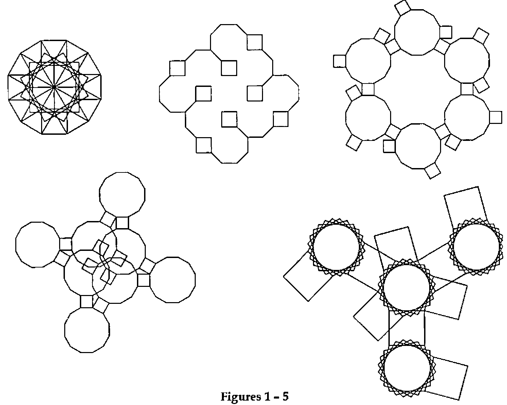
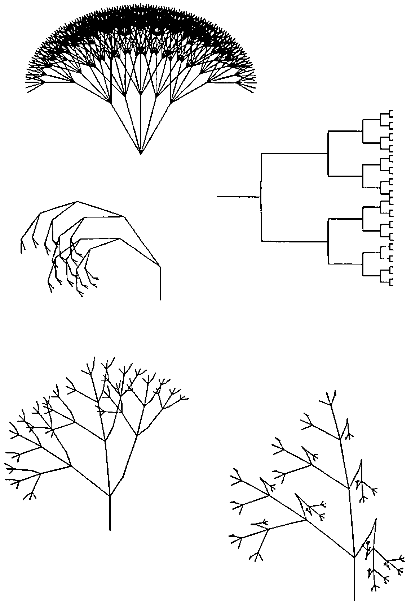
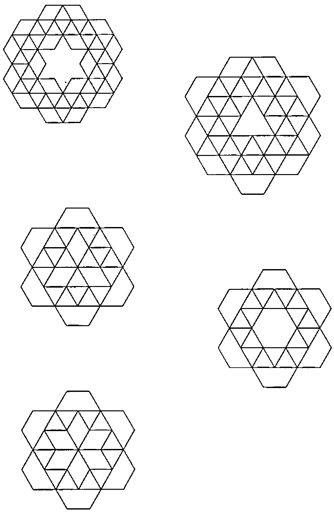

*by Hendrik Rama and Martin Barghoorn*
{ .byline }

Turtlegraphics are well known from the LOGO-System [1]. These graphics are also vector graphics not made by setting the absolute X-Y-coordinates but by relative increments of distances and angles. Perhaps with some new APL2-Idioms we have developed in a short time more than 1500 graphics from different classes.

## Derivation of the Formulas

We start with the APL2-Syntax (polar form of complex numbers), five points, angle 90 degrees.

```apl
      5⍴1D90
0J1 0J1 0J1 0J1 0J1
```

Rotation by multiplication and accumulation

```apl
      +\×\ 5⍴1D90
0J1 ¯1J1 ¯1 0 0J1
```

Splitting the real and the imaginary part

```apl
      9 11∘.○+\×\ 5⍴1D90
0 ¯1 ¯1 0 0
1  1  0 0 1
```

Transpose for drawing X-Y-graphics

```apl
      ⍉9 11∘.○+\×\ 5⍴1D90
 0 1
¯1 1
¯1 0
 0 0
 0 1
```

We get a quadrat (square) Q1 and then we take *TRANSLATE* and *MAGNIFY* from GRAPHPAK to find the right position on the centre of the screen (100 × 74 pixels).

```apl
      DRAW 60 30 TRANSLATE 25 MAGNIFY Q1← ⍉9 11∘.○+\×\5⍴1D90
```

Without the complex-numbers-syntax we take Cosine and Sine.

```apl
      Q2← ⍉ +\2 1 ∘.○ +\5⍴ ○ 90÷180   ⍝ COS, SIN
```

An alternative method is

```apl
      Q3← ⍉ +\2 1 ∘.○○ +\5⍴ .5        ⍝ COS,SIN,ALTERNATIVE
```

Proof

```apl
      (Q1≡Q2) (Q2≡Q3) (Q1≡Q3)
1 1 1
```

## Different shapes of polygons (different classes)

```apl
      +\×\ 4⍴1D120  ⍝ Triangle
      +\×\ 5⍴1D90   ⍝ Quadrat (square)
      +\×\ 6⍴1D72   ⍝ Pentagon
      +\×\ 7⍴1D60   ⍝ Hexagon
      +\×\ 9⍴1D45   ⍝ Octagon
```

## Rosettes

The application of the replicate-function generates multiple sets of data.

```apl
      ⍉9 11∘.○+\×\ 5 9/1D90 1D¯45
```

To get *closed* figures we need replications and further manipulations.

```apl
FIG 1: ⍉+\2 1∘.○○+\∊12/⊂(7+⍳7)/7⍴2 ¯2÷3 4
FIG 2: ⍉+\2 1∘.○○+\∊17⍴⊂(3+⍳4)/4⍴2 ¯2÷8 4
FIG 3: ⍉+\2 1∘.○○+\∊8⍴⊂(5+⍳9)/9⍴3 ¯1÷6
FIG 4: ⍉+\2 1∘.○○+\∊8⍴⊂(5+⍳7)/7⍴3 ¯1÷6
FIG 5: ⍉+\2 1∘.○○+\∊7⍴⊂(5+⍳8)/8⍴3 ¯2.5÷6
```

## Trees [2]

VIS: Visibility, first column of the matrix

```apl
FIG 6: AX←,⊃.7×∘.,/4⍴(⊂1 1D15 1D¯15 1D30 1D¯30)
       AXX←⍉9 11∘.○AX1←2.5D90×∊0,+\×\⊃AX
       VIS←~0=AX1 ⋄ ERASE ⋄ DRAW VIS,30+8×AXX

FIG 7: AX←,⊃∘.,/5⍴⊂.5×(.03+(1 2D90 2D¯90.01)(1 2D¯90.01 2D90))
       AXX←⍉9 11 ∘.○ AX1←2.5D.0010×∊0,+\×\⊃AX
       VIS←~0=AX1 ⋄ ERASE ⋄ DRAW VIS,30+8×AXX

FIG 8: AXX←⍉9 11 ∘.○1D90×∊0,+\×\⊃,/,/.8,[2.5](.8D55 1D36
1D¯65)[⍉1+(5⍴2)⊤¯1+⍳32]
       VIS←~(0=AXX[;1])∧(0=AXX[;2])
       ERASE ⋄ DRAW VIS,40 +10×AXX

FIG 9: AXX←⍉9 11 ∘.○1D90×∊0,+\×\⊃,/,/.8,[2.5](.8D52 (.7D¯33
1D14).9D5)[⍉1+(4⍴3)⊤¯1+⍳81]
       VIS←~(0=AXX[;1])∧(0=AXX[;2])
       ERASE ⋄ DRAW VIS,30+10×AXX

FIG 10: AXX←⍉9 11 ∘.○1D90×∊0,+\×\⊃,/,/.8,[2.5](.8D52 (.7D¯33
.5D14 ¯1.1D14).9D5)[⍉1+(4⍴3)⊤¯1+⍳81]
       VIS←~(0=AXX[;1])∧(0=AXX[;2])
       ERASE ⋄ DRAW VIS,30+10×AXX
```

## Patchworks

```apl
FIG 11: ⍉+\2 1∘.○○+\∊11⍴⊂(6+⍳10)/2÷(10⍴1 2 1)×.6
FIG 12: ⍉+\2 1∘.○○+\∊11⍴⊂(6+⍳16)/2÷(16⍴1 2 1)×.6
FIG 13: ⍉+\2 1∘.○○+\∊11⍴⊂(2+⍳12)/2÷(12⍴1 2 1)×.6
FIG 14: ⍉+\2 1∘.○○+\∊11⍴⊂(0+⍳7)/2÷(7⍴1 2 1)×.6
FIG 15: ⍉+\2 1∘.○○+\∊11⍴⊂(2+⍳6)/2÷(6⍴1 2 1)×.6
```



**Figures 1 – 5**
{ .caption }



**Figures 6 – 10**
{ .caption }



**Figures 11 – 15**
{ .caption }

## References

[1] Harold Abalson & Andrea diSessa: *Turtle Geometry*, MIT Press, 1986

[2] Manuel Alfonseca: *Representation of Fractal Curves by Means of L Systems*, APL96, Lancaster (see www.demon.co.uk/apl385/apl96)
