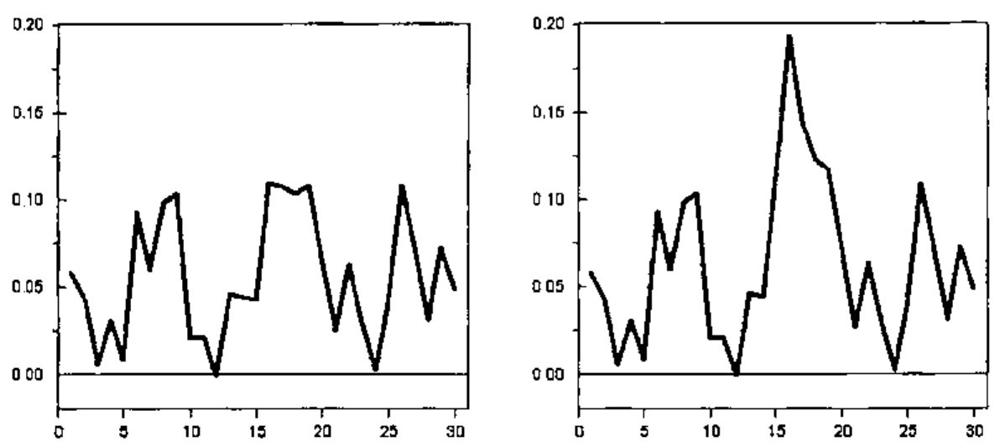
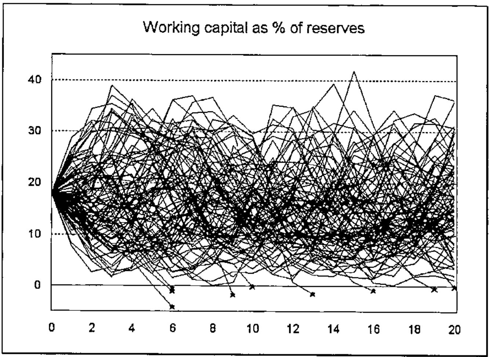

*by Antero Ranne*
{ .byline }

## The Investment Models

The Mutual Pension Insurance Company Ilmarinen is one of the companies managing the statutory employment pension in Finland. The investment models for actuarial use have been developed in Ilmarinen starting from the year 1993. The main parts are:

- financial time series data management
- time series analysis programs
- investment simulation models
- portfolio optimization models.

The models have been used e.g. for the following purposes:

- Developing the statutory solvency requirements for the Finnish pension companies and other insurance companies
- Developing new rules for determining the technical interest rate of Finnish pension companies
- Analysing the risks connected with the investment strategy of the company.

## Financial Timeseries Data

The models are based on financial time series from 12 countries. These include e.g. inflation, GNP growth rate, interest rates, share price indices, dividend yields etc. The longest of the series start from the year 1950. The data are saved in an three-dimensional APL array. There are programs for adding new data and for output as tables or figures.

## Timeseries Analysis Programs

Various time series equations are defined for the variables in the investment model. Programs exist in APL to estimate the parameters of these equations. Although commercial statistical programs can be used for more thorough analyses, it is convenient to be able to make calculations in the same environment where the data are.

As an example it is shown how the parameters of the inflation model are estimated. The inflation rate may be influenced by external shocks which in the model are represented by oil price movements. The inflation *i*(*t*) in year *t* may be modelled e.g. by the equation

> *i*(*t*) = *m* + *a*<sub>1</sub> [*i*(*t*−1)−*m*] + *a*<sub>2</sub> [*i*(*t*−2) − *m*] + *b*<sub>0</sub> *o*(*t*) + *b*<sub>1</sub> *o*(*t*−1) + *e*(*t*)

where *o*(*t*) is the oil price inflation and *e*(*t*) are the residuals or the stochastic part of the model. The parameter values are obtained by iteration. For the intermediate parameter values *m*, *a*<sub>1</sub>, *a*<sub>2</sub>, *b*<sub>1</sub> and *b*<sub>2</sub> we calculate the residuals *e*(*t*), as well as the partial derivatives

> ∂*e*(*t*)/∂*m* = −1 + *a*<sub>1</sub> + *a*<sub>2</sub>,  ∂*e*(*t*)/∂*a*<sub>1</sub> = −*x*(*t* − 1) + *m*,  etc.

By ordinary linear regression we find the coefficients *d*<sub>1</sub>, … *d*<sub>5</sub> in the equation

> *e*(*t*) = *d*<sub>1</sub> ∂*e*(*t*)/∂*m* + *d*<sub>2</sub> ∂*e*(*t*)/∂*a*<sub>1</sub> + *d*<sub>3</sub> ∂*e*(*t*)/∂*a*<sub>2</sub> + *d*<sub>4</sub> ∂*e*(*t*)/∂*b*<sub>0</sub> + *d*<sub>5</sub> ∂*e*(*t*)/∂*b*<sub>1</sub> .

The new parameter values are calculated by subtracting the *d*-coefficients:

> *m*' = *m* − *d*<sub>1</sub> , … , *b*<sub>2</sub>' = *b*<sub>2</sub> − *d*<sub>5</sub> .

The solution is easy in APL because the linear regression part can be calculated directly using `⌹`, as is shown in the following programs. The variable *"inf"* is the inflation and *"oil"* the oil price inflation.

```apl
par←Infparam;p2;e;d;c
p2←1+par←5⍴0
:while 1E¯3<⌈/|par-p2
  ⎕←p2←par
  e←p2 Resid inf,[1.1]oil
  d←p2 Deriv inf,[1.1]oil
  c←e⌹d
  par←p2-c
:endwhile
```

```apl
e←par Resid vars;x;y;m;a1;a2;b0;b1;i
(x y)←⊂[1]vars
(m a1 a2 b0 b1)←par
x←0 0,x-m ⋄ y←0 0,y ⋄ e←(⍴x)⍴0
:for i :in 2↓⍳⍴e
  e[i]←x[i]+(-a1×x[i-1])+(-a2×x[i-2])+(-b0×y[i])+(-b1×y[i-1])
:endfor
e←2↓e

d←par Deriv vars;x;y;m;a1;a2;b0;b1
(x y)←⊂[1]vars
(m a1 a2 b0 b1)←par
d←((⍴x),1)⍴¯1+a1+a2
d←d,-¯1↓0,x-m
d←d,-¯2↓0 0,x-m
d←d,-y
d←d,-¯1↓0,y
```

The calculation takes only a few steps. The same principles can be used for other quite complicated equations.

## Investment Simulation Models

When the parameter values have been established, the time series equations can be used to simulate the variables. The residuals are then generated as random numbers using the Wilson-Hilferty algorithm (see e.g. Daykin *et al.*, 1994). The numbers are calculated using the following program:

```apl
 Z←V Random N;M;S;A;B;C
⍝ N random numbers from distribution with
⍝ mean = 0, std deviation = 1 and skewness = V
⍝ first numbers from normal distribution
 S←(÷1+M)×?(N,2)⍴M←2147483646
 Z←(2○○2×S[;2])×(¯2×⍟S[;1])*0.5
 →(0=V)/0
⍝ skewness is added by Wilson-Hilferty-algorithm
 (A B C)←((V*2)÷108),((V÷6)-6÷V),2÷V
 Z←(A×(Z-B)*3)-C
```

Figure 1 shows an example of simulated inflation numbers using the parameters obtained by the programs shown above. The second version contains in year 15 an inflation shock generated by the oil price variable.



The structure of the whole investment model is shown in Figure 2. A detailed description can be found in Ranne (1998).


The purpose of the model is to generate investment yields that have realistic means, standard deviations and correlations in the long term. These are used to estimate the investment risks of a company.

The investment variables are combined with a forecast describing the development of the whole pension insurance company and various output variables are calculated (e.g. premiums, pension expenditure, reserves, bonuses, profits or losses). The most important output variable is the working capital, which is the difference between the total assets and the liabilities of the company and which acts as a buffer against variations in the investment results. The following picture shows an example of simulated working capital as per cent of the reserves.



A thousand simulations for 20 years takes about 2 minutes 40 seconds on the present computer (300 MHz Pentium, 128MB memory).

## Optimization Models

In the optimization problem there are different investment categories (e.g. bonds, shares, property, cash). The investment returns have means μ<sub>*i*</sub> , standard deviations σ<sub>*i*</sub> and correlation coefficients ρ<sub>*ij*</sub> . Standard deviation is used to measure the risk level of the investments.

The proportion invested in category *i* is *x*<sub>*i*</sub> (Σ<sub>*i*</sub> *x*<sub>*i*</sub> = 1). The mean μ and standard deviation σ of the whole portfolio is

> μ = Σ<sub>*i*</sub> μ<sub>*i*</sub> *x*<sub>*i*</sub><br>
> σ = √(Σ<sub>*i,j*</sub> *c*<sub>*ij*</sub>*x*<sub>*i*</sub>*x*<sub>*j*</sub>)

where *c*<sub>*ij*</sub> is the covariance *c*<sub>*ij*</sub> = σ<sub>*i*</sub> σ<sub>*j*</sub> ρ<sub>*ij*</sub> .

The problem is to find the portfolio with the lowest risk σ corresponding to a given mean return μ. (Alternatively one could find the maximum return corresponding to a given risk.) In practice there are often also minimum and maximum proportions for different investment categories.

Mathematically the problem is therefore formulated as

> minimize the function  Σ<sub>*i,j*</sub> *c*<sub>*ij*</sub> *x*<sub>*i*</sub> *x*<sub>*j*</sub>
>
> using conditions  Σ<sub>*i*</sub> *x*<sub>*i*</sub> = 1<br>
> Σ<sub>*i*</sub> μ<sub>*i*</sub> *x*<sub>*i*</sub> = μ<br>
> *m*<sub>*k*</sub> ≤ *x*<sub>*k*</sub> ≤ *M*<sub>*k*</sub>, *k* = 1,…,*n* .

By standard mathematical methods it can be shown that the solution may be found by solving the following group of equations:

> 2 Σ<sub>*i*</sub> *c*<sub>*ik*</sub> *x*<sub>*i*</sub> + α + β μ<sub>*k*</sub> = λ<sub>*k*</sub>, *k* = 1,…,*n*<br>
> Σ<sub>*i*</sub> *x*<sub>*i*</sub> − 1 = 0<br>
> Σ<sub>*i*</sub> μ<sub>*i*</sub> *x*<sub>*i*</sub> − μ = 0

where in each investment category i one of the following conditions is true:

> a) *x*<sub>*i*</sub> = *m*<sub>*k*</sub><br>
> b) *x*<sub>*i*</sub> = *M*<sub>*i*</sub><br>
> c) λ<sub>*i*</sub> = 0.

For each combination of these conditions the resulting system of equations is linear, and so it can be solved in APL using the function `⌹`.

One has to solve the equations for different combinations of the conditions a–c. The solution that fulfils all the conditions and has the smallest variance is finally chosen as the answer to the optimization problem.

The part of the program solving the linear equations is shown in the following. The program uses the global variables:

| | | |
|---|---|---|
| *Mu* | vector | mean values for investment returns |
| *Cov* | matrix | covariances |
| *Min* | vector | minimum values |
| *Max* | vector | maximum values. |

Since it is possible that a given system of equations has no solutions, there is a matrix division function that returns the empty vector instead of stopping in domain error:

```apl
Z←X MatDiv Y;⎕elx
⍝ Matrix division
⍝ Result is empty, if no solution
⎕elx←'Z←⍬ ⋄ →0'
Z←X⌹Y
```

The second function finds the distribution for a given mean return *"mean"* and conditions that are based on the argument *"list"*:

```apl
 z←list Optimal mean;n;N;MAT;C;k;i
⍝ Finds the optimal distribution for given mean return "mean"
⍝ Investment return means in "Mu", covariances in "Cov",
⍝ maximum and minimum proportions in "Max" and "Min"
⍝ list[k]=0: no restriction in investment category k
⍝ list[k]=1: use minimum for category k
⍝ list[k]=2: use maximum for category k
 N←2+2×n←⍴Mu
 MAT←(2⍴N)⍴0
 MAT[⍳n;⍳n]←2×Cov
 MAT[⍳n;n+1]←MAT[n+1;⍳n]←1
 MAT[⍳n;n+2]←MAT[n+2;⍳n]←Mu
 MAT[⍳n;n+2+⍳n]←-(⍳n)∘.=⍳n
 C←(n⍴0),1,mean,n⍴0
 :for k :in ⍳n
  i←n+2+k
  :select list[k]
  :case 0
    MAT[i;]←i=⍳N
    C[i]←0
  :case 1
    MAT[i;]←k=⍳N
    C[i]←Min[k]
  :case 2
    MAT[i;]←k=⍳N
    C[i]←Max[k]
  :endselect
 :endfor
 z←n↑C MatDiv MAT
```

One has to execute the program for different values of the variable *"list"* and find the solution that fulfils all the conditions and has the smallest variation. The part of the program doing this selection is not shown here.

## References

Daykin, Pentikäinen, Pesonen: *Practical Risk theory for Actuaries*, Chapman and Hall, London, 1994

Ranne, A.: *The Finnish Stochastic Investment Model*, Transactions of the 26th International Congress of Actuaries, Vol. 7, Birmingham, 1998.
