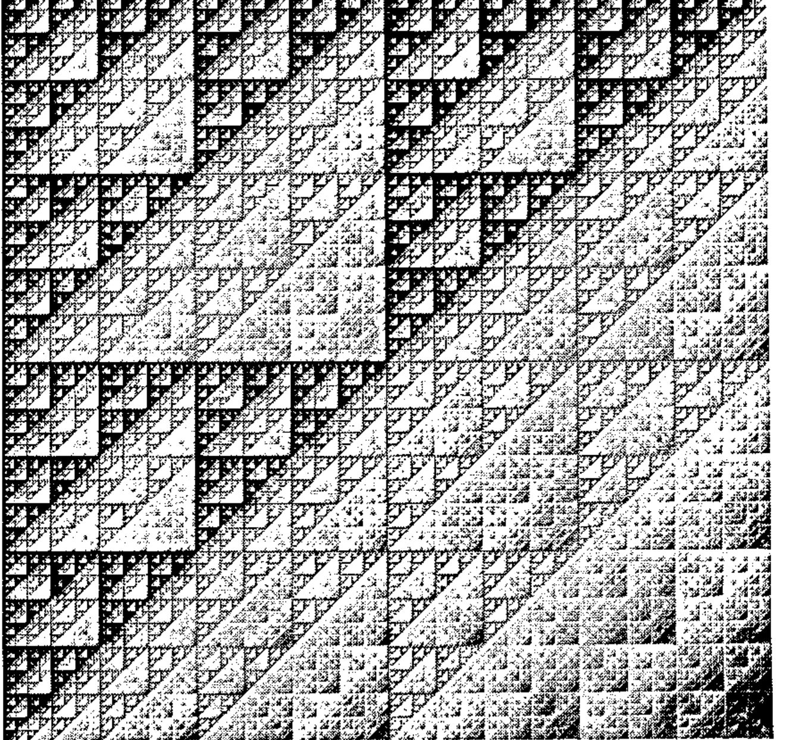
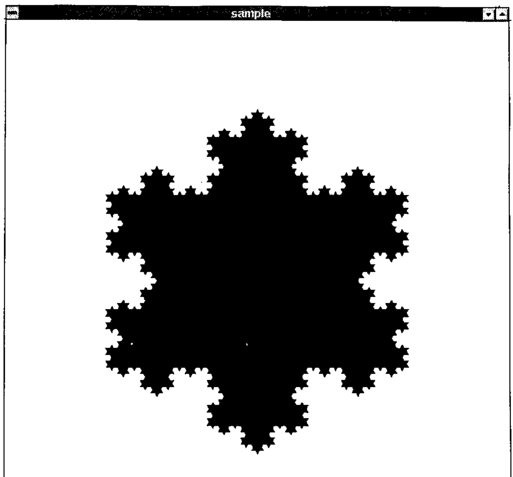
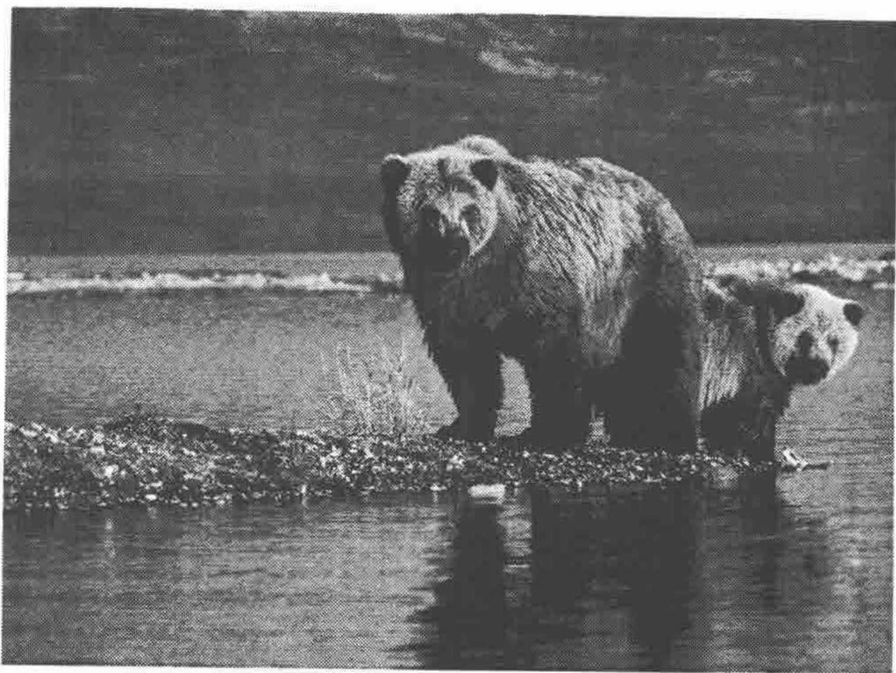
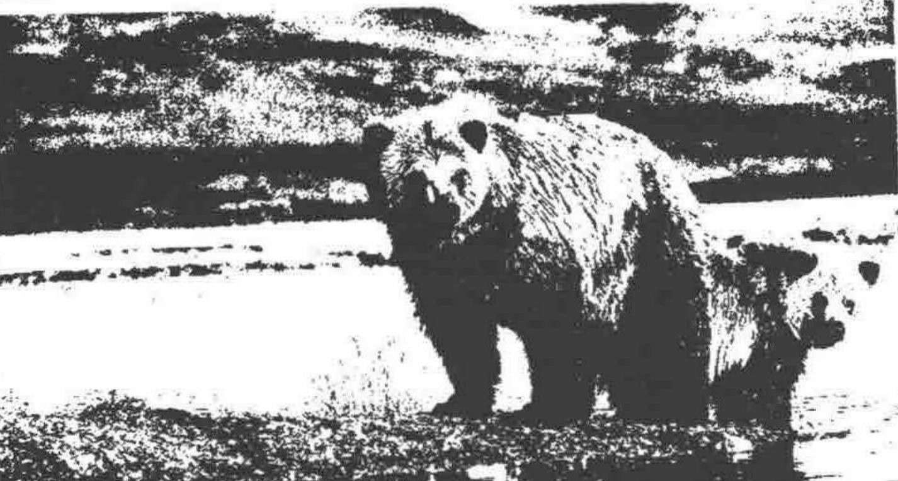
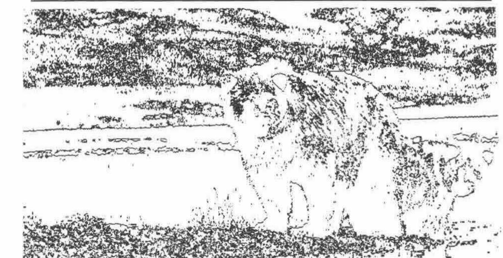
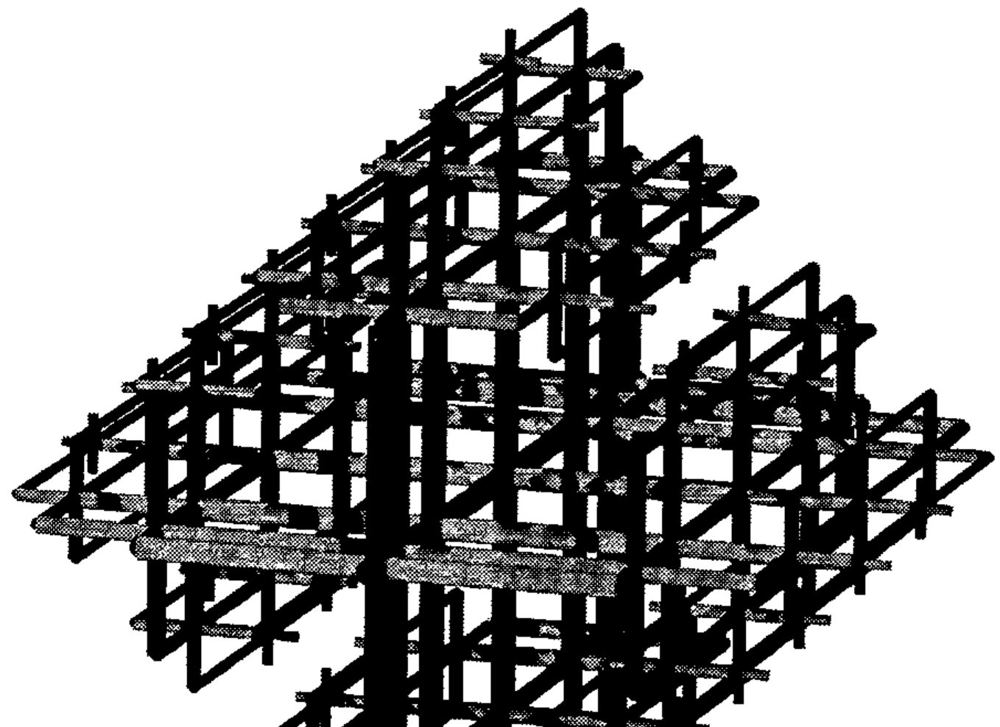

*by Clifford A. Reiter*
{ .byline }

Fractals are often visually attractive and thus can provide an interesting topic for discussions with mathematics students. They also provide a wonderful sense of satisfaction to students learning to program and provide a rich source of examples in computer graphics courses in addition to providing connections to the study of dynamics. Some of the most popular fractal images, Julia sets and the Mandelbrot set, see [10] or [12], are generated with escape time algorithms that are highly iterative and creating them requires a great deal of time. Great efforts have been made to create incredibly fast fractal image code. For example, FRACTINT is often hundreds of times faster than straightforward compiled Pascal or C code [17]. While APL is a wonderful language, implementations tend to be very slow at running such highly iterative experiments. Nevertheless, some fractals admit simpler constructions and APL can well be graceful at handling such fractals.

I have used APL for teaching from time to time. The uses range from assigning isolated experiments in a given course to teaching entire courses roughly following [16]. I also often find myself using APL for research because it pervades my thinking. Another teaching favourite is a course on computer graphics and mathematical visualization. It seems important for students to be skilled at visually representing information so I have taught such a course using Pascal a couple of times. These are exciting times for APL. Major innovations have been made providing excellent GUI interfaces and bringing graphics to the PC level. Control structures are being added to major vendors’ products and J offers ASCII spelling and rich methods for defining pure functions. This has provided a fabulous opportunity for me: I was able to combine my enthusiasm for APL and visually representing information by teaching a course on mathematical visualization using J. Several topics in that course were described in a talk at the Toronto SIGAPL [9].

This note describes some of the visual things that I have had success doing in APL related visual research projects or that course. While any APL ought to facilitate the projects I will use as examples, I was hooked by J and will use J for most of my examples. Of course, an introduction to mathematical visualization could easily be book length, but here we will consider a few divergent examples to sample some of the depth and breadth.

## J beginnings: Raster Fractals

At APL ’91 [0] there were a few talks utilizing J, the new version of APL developed by K. Iverson [5,6]. While I avoided J talks to some extent, I did hear a couple of lectures on J and I remember some facts about J and my reactions: it was ASCII based (how sad to lose those APL glyphs), it allowed simple definition of pure functions (interesting but confusing) and inner products could use left-function arguments which were not reductions (that could come in handy someday). During January 1993 I taught an APL course using APL2 [1] that was a wonderful experience. We ended the course at the New York SIGAPL Tool of Thought VIII conference. At that conference Iverson spoke about J and Langlet [8] described various Boolean array constructions in APL2. A colleague asked if I could create a transparency showing Sierpinski’s Triangle for a talk describing some of Langlet’s ideas. The request was so simple that I sought an APL construction that was direct and could be generalized to give colours. After a bit of thought and experimenting I realized that if the indices of the rows and columns are given in binary in the columns of a matrix X, then the Sierpinski triangle can be produced with an "and" dot "nand" inner product:

```apl
      ⎕IO←0

      ⎕←X← 2 2 2 2 ⊤ ⍳16
0 0 0 0 0 0 0 0 1 1 1 1 1 1 1 1
0 0 0 0 1 1 1 1 0 0 0 0 1 1 1 1
0 0 1 1 0 0 1 1 0 0 1 1 0 0 1 1
0 1 0 1 0 1 0 1 0 1 0 1 0 1 0 1

      (⍉X) ∧.⍲ X
1 1 1 1 1 1 1 1 1 1 1 1 1 1 1 1
1 0 1 0 1 0 1 0 1 0 1 0 1 0 1 0
1 1 0 0 1 1 0 0 1 1 0 0 1 1 0 0
1 0 0 0 1 0 0 0 1 0 0 0 1 0 0 0
1 1 1 1 0 0 0 0 1 1 1 1 0 0 0 0
1 0 1 0 0 0 0 0 1 0 1 0 0 0 0 0
1 1 0 0 0 0 0 0 1 1 0 0 0 0 0 0
1 0 0 0 0 0 0 0 1 0 0 0 0 0 0 0
1 1 1 1 1 1 1 1 0 0 0 0 0 0 0 0
1 0 1 0 1 0 1 0 0 0 0 0 0 0 0 0
1 1 0 0 1 1 0 0 0 0 0 0 0 0 0 0
1 0 0 0 1 0 0 0 0 0 0 0 0 0 0 0
1 1 1 1 0 0 0 0 0 0 0 0 0 0 0 0
1 0 1 0 0 0 0 0 0 0 0 0 0 0 0 0
1 1 0 0 0 0 0 0 0 0 0 0 0 0 0 0
1 0 0 0 0 0 0 0 0 0 0 0 0 0 0 0
```

If one thinks of `(⍉X) ∧.⍲ X` as giving the "and" reduction of pairwise "nand"s of the binary addresses of the rows and columns, then all sorts of generalizations suggest themselves. One could take sums of pairwise "nands". In fact, the ordinary matrix product `+.×` is a complement to those Boolean inner products giving a multivalued result that measures how far one is from being on the Sierpinski triangle (try it!).



Figure 1: Generalised Sierpinski triangle from a matrix product
{ .caption }

Figure 1 shows a grayscale image produced using the ordinary matrix product that way. Another generalization to colour (multivalues): find the position of the first 1 in the pairwise "nand" of the row and column addresses; notice this is sort of an inner product, but the left function is not a reduction, so this is not a classic inner product. Nonetheless, it is easy to implement this in modern APLs. APLers can easily imagine the rich possibilities for experimenting with different primitive functions and changing the addresses from base two to other bases.

After making several dozen images using those variations, I decided to try to describe these ideas in a journal that publishes fractals. While others have previously considered fractals constructed from bit operations, I thought the APL inner product point of view was worth sharing. I wanted to include the APL, but the audience wouldn’t know APL, so I also wanted to keep the presentation dead simple. I wanted to use WordPerfect for the writing since the word processor that I use to do APL is ancient. Trying to get the APL symbols in WordPerfect was an aggravation (I know an APL font is available, but I have never managed to get it). I only wanted to use a dozen APL symbols but how was I going to make a transpose symbol? Well, I could have switched to the ancient word processor, it would have worked fine, but I happened to remember that one of my images was a reductionless inner product. J would solve the font nuisance and give me a uniform way of doing the reductionless inner products without going to nested arrays. This would simplify the presentation for a general audience.

I grabbed J electronically from the APL archive at Waterloo, and installed it under MS Windows. Readers interested in getting J may consult Appendix 0. I found J quite frustrating for a couple of days, but it was soon clear that J could do the matrix constructions mentioned above and the file I/O required to save large bitmaps for printing. The paper was finished about a week after I first obtained a copy of J and it has since appeared [13]. I pushed J a bit and noticed I could create individual arrays with millions of entries (requiring dozens of megabytes) on my PC. I was hooked — on my PC, I had an APL, that with 32M of memory plus virtual memory effectively gave me 100M workspaces. I ordered the reference materials [6,7] which, of course, made learning more J far easier.

Functions that allow for reading and writing Windows 256-colour bitmaps, which automated the process used for the fractal images mentioned above, are given in Appendix 1. There are also a couple of functions useful for creating 8-bit graphics images. APL for doing some of these tasks has been described [2,3].

Now a few comments about duplicating Figure 1. The J function `#:` creates binary representations and the addresses are put into rows.

```text
   ]x=.#:i.8
0 0 0
0 0 1
0 1 0
0 1 1
1 0 0
1 0 1
1 1 0
1 1 1
   x +/ . * |: x
0 0 0 0 0 0 0 0
0 1 0 1 0 1 0 1
0 0 1 1 0 0 1 1
0 1 1 2 0 1 1 2
0 0 0 0 1 1 1 1
0 1 0 1 1 2 1 2
0 0 1 1 1 1 2 2
0 1 1 2 1 2 2 3
```

The function `hue`, given in Appendix 1, takes a number between 0 and 1 and results in an RGB triple giving a pure hue. For example,

```text
   hue 0                  NB. red
255 0 0
   hue 1r3                NB. green
0 255 0
   p=.hue"0]2r3*(i.%<:)9
   p                      NB. 9 hues between red and blue
255   0   0
255 127   0
255 255   0
127 255   0
0   255   0
0   255 127
0   255 255
0   127 255
0     0 255
```

A 256 by 256 bitmap giving Figure 1 can be created and saved as a file. Graphics image formats vary, but a common format, often called an 8-bit graphics image, is essentially two arrays. One array is a palette which is an `m` by `3` array of numbers giving RGB triples (`m` is bounded by 256 for 8-bit graphics). The other array, the bitmap, is an array of numbers from `i.m` where each entry is an index into the palette that gives the colour of the pixel corresponding to the entry. Below, `(p;b)` describes a boxed array giving the palette and bitmap.

```text
   x=.#:i.256             NB. 256 row and column
   b=.x +/ . * |: x       NB. the bitmap array
   (p;b) writebmp8 'figure1.bmp'
```

The file figure1.bmp can now be viewed, edited or printed with applications that can handle Windows bitmaps.

## Object Graphics: Koch Snowflake

In the visualization course mentioned in the introduction we considered both raster graphics (pixel arrays) and object based graphics. Several utilities were defined to let students create windows and show polygons and other objects on the screen without directly using very much of the J/Windows graphics interface. Some of these are given in Appendix 2; this includes `sogwin`, a function that starts an object based graphics window. For example, to open a window and plot a red triangle we can do the following. Note that the coordinates of the window run from 0 to 1000.

```text
   ''[ sogwin 'sample'             NB. opens a window
   ]p=.200 300,500 820,:800 300   NB. a 3-gon
200 300
500 820
800 300
   255 0 0 spoly p                NB. plots the 3-gon p in red
```

One of the students in the class asked about constructing the Koch Snowflake [12]. This is a triangle with `1r3` scale bulges on each edge, each edge then has a bulge on it and so on. The basic step in the iterative process is take each edge and replace it with four edges introducing a bulge. If the given edge is trisected, then the two end thirds are used and the centre third is replaced by the other two edges of an equilateral triangle placed on the centre third. So the edge from `0 0` to `1 0` is given by two vertices:

```text
0 0
1 0
```

and this should be replaced by the vertex sequence (polygon):

```text
0 0
1r3 0
1r2 y
2r3 0
1 0
```

where y is `%12^0.5`. In order to implement this subdivision it is convenient to define functions that find the midpoint and the points dividing the segment in thirds.

```text
   tri1=.2r3&*@[ + 1r3&*@]      NB. one third point
   tri2=.1r3&*@[ + 2r3&*@]      NB. two thirds point
   mid=. -:@+                   NB. midpoint
   nor=.1 _1&*@|.               NB. right normal vector
   0 0 tri1 1 0
0.333333 0
   0 0 tri2 1 0
0.666667 0
   0 0 mid 1 0
0.5 0
   nor 1 2
2 _1
   bulge=. mid + (%:%12)&*@nor@:-   NB. bulge point
   0 0 bulge 1 0
0.5 0.288675
```

So notice that `bulge` is just the midpoint with a displacement in the opposite of the right normal direction added. Below, `segdiv` divides up the given segment into pieces. Notice the last point is not included in the result since it will be included as the first point in the next segment to be divided. The function `step` applies the division to neighbouring pairs of vertices.

```text
   segdiv=.[ , tri1 , bulge ,: tri2
   0 0 segdiv 1 0
       0        0
0.333333        0
     0.5 0.288675
0.666667        0

   step=.,/@([ segdiv"1 (1&|.))

   p              NB. a 3-gon
200 300
500 820
800 300

   <.step p       NB. a 12-gon (floored to integers)
200 300
300 473
199 646
400 646
500 820
600 646
800 646
700 473
800 300
600 300
500 126
400 300

   #step^:4 p                  NB. iterate subdivision 4 times
768
   0 0 0 spoly step^:4 p       NB. plot the 768-gon
```

That image is shown in Figure 2. Can you decide what the following would look like?

```text
255   0   0 spoly step^:4 p
255 255   0 spoly step^:3 p
  0 255   0 spoly step^:2 p
  0 255 255 spoly step^:1 p
  0   0 255 spoly step^:0 p
```

Try it! What would happen if the order of the statements was reversed? How about if the bulges were in instead of out? Inward bulges on a 5 pointed star create a nice variation. Can you make that?



Figure 2 — the Koch Snowflake
{ .caption }

## Image Processing

One of the class exercises that was a lot of fun was to do some elementary image processing. The students were asked a sequence of questions and worked toward some primitive edge detection. The first step is to read in a digital image of a photograph. The example here was a colour image of two bears by a lake. The result of `readbmp8` is a two element boxed vector. It is convenient to immediately assign its elements names.

```text
   ('p';'b')=.readbmp8 'bears.bmp'
   $p
256 3
   $b
480 640
   5{.15}.p        NB. some palette entries
167 138 105
122 118 117
138 129 109
207 161 112
222 186 127
```

Here `p` is a palette of 256 colours and `b` is a 480 by 640 array corresponding to the pixels. The first question was to find a way to turn this colour image into a grayscale image. The simplest answer is to replace each palette entry by a grayscale — the average of its red, green, and blue components is an obvious choice.

```text
   avg=.+/ % #
   avg 1 3 4
2.66667
   p1=.<.@(3&#)@avg"1 p
   5{.15}. p1     NB. some averaged palette entries
136 136 136
119 119 119
125 125 125
160 160 160
178 178 178
   (p1;b) writebmp8 'temp1.bmp'
```

This image is indeed a gray scale version of the original. See Figure 3.



Figure 3 — Grayscale Bears
{ .caption }

The next question is how to turn this into a black and white image. The simplest answer is to select a threshold for the gray scale. If the gray level is higher than half, consider the palette entry white and otherwise consider it black.

```text
   p2=.255*p>128
   5{.15}.p2      NB. Some black & white palette entries
255 255 255
  0   0   0
  0   0   0
255 255 255
255 255 255
   (p2;b) writebmp8 'temp2.bmp'
```

The result of temp2.bmp is shown in Figure 4. It is a black and white image, but it is "cheating" in that there are still 256 palette entries and the bitmap entries are from `i.256`. We really want a black and white two colour palette and a Boolean bitmap. Below `pbw` is a black and white palette and `b3` remaps the bitmap as a Boolean by indexing the entries from `i.256` into a Boolean array with appropriate entries. Thus, temp3.bmp is a true Boolean image, though its appearance is identical to that in Figure 4.



Figure 4 — Black and White Bears
{ .caption }

```text
   ]pbw=.0 0 0,:255 255 255
  0   0   0
255 255 255
   5{.15}.pbw i. p2   NB. test if palette entries are white
1 0 0 1 1
   b3=.b{pbw i. p2
   (pbw;b3) writebmp8 'temp3.bmp'
```

Lastly, we consider a primitive edge detector. A simple idea is to check whether neighbouring entries are the same. The fork `}.=}:` drops the first item, the last item and then tests equality of the resulting arrays. Thus some edge detecting:

```text
   ed=.}.=}:
   ed 0 0 0 1 1 1 1 1 1 0 0   NB. detect on a vector
1 1 0 1 1 1 1 1 0 1
   (pbw;ed b3) writebmp8 'temp4.bmp'
```

The result is shown in Figure 5. Certainly the image is primitive, but `}.=}:` is a short program. Moreover, students can quickly run through an exercise like this and get a feeling for algorithms for edge detection. In the class I taught, the students actually implemented (without being asked) better ideas for picking the threshold as well as creating row, column and 45° edge detection. They also suggested general ideas for better strategies for getting clearer definition of the edges of the bears as well as contrast enhancement.



Figure 5 — Primitive Edge Detection
{ .caption }

## Words in J

One of the ways in which APL can be useful is for organizing data for use by independent application packages. The construction of 3-dimensional objects directly in J was a topic in the visualization course, but it was also useful to use J to organize the description of 3-dimensional fractals for further processing by POVRAY. POVRAY is a ray-tracer that can be used to render "realistic" 3-dimensional images. I have used J this way on several projects including [11,14,15]. This note describes the J construction of a 3-dimensional Cayley graph from [11].

Consider all the words that can be written in the letters from the alphabet `'aAbBcC'` with the understanding that upper and lower case letters are inverses and `c` commutes with everything. That is, `aA`, `Aa`, `bB`, `Bb`, `cC`, `Cc` are the same as the empty word and `ac` is `ca` and `bc` is `cb`. Thus, for example, `abcBca` is the same as `aacc` but `abab` is not `aabb` since `a` and `b` do not commute. It is convenient to write the words in the form `vcnl` where `v` is a word in `a`, `b` and their inverses, some power of `c` (possibly negative) appears, and `l` is a letter from the alphabet. Constructing all such words of a given length is straightforward in J. The relationship between group elements (really classes of equivalent words) can be represented graphically by putting an edge between two words if you can get from one to another by multiplying by a single letter. Thus, if `vcnl` is a word of the form described, we draw an edge between `vcn` and `vcnl`.

We turn for a bit to the construction of words of the given form. First, we will represent each word by a boxed character string. If we have two lists of words and want the concatenation of all possible pairs, this is an outer product:

```text
   ]L1=.'';'a';'b'
┌┬─┬─┐
││a│b│
└┴─┴─┘
   ]L2=.'';'A';'B';'AB'
┌┬─┬─┬──┐
││A│B│AB│
└┴─┴─┴──┘
   L1 ,&.>/ L2
┌─┬──┬──┬───┐
│ │A │B │AB │
├─┼──┼──┼───┤
│a│aA│aB│aAB│
├─┼──┼──┼───┤
│b│bA│bB│bAB│
└─┴──┴──┴───┘
   adjw=. ,&.>/
```

Here we have given the name `adjw` to the outer product. The next step is to create all words in given letters up to some specified length. This is just iterating `adjw` on a list of letters. This can be accomplished by taking the `adjw` reduction of the replication of the list of letters.

```text
   ]s=.'';;/'aAbB'
┌┬─┬─┬─┬─┐
││a│A│b│B│
└┴─┴─┴─┴─┘
   2(#,:) s
┌┬─┬─┬─┬─┐
││a│A│b│B│
├┼─┼─┼─┼─┤
││a│A│b│B│
└┴─┴─┴─┴─┘
   mkallw=.adjw/@(#,:)
   2 mkallw s
┌─┬──┬──┬──┬──┐
│ │a │A │b │B │
├─┼──┼──┼──┼──┤
│a│aa│aA│ab│aB│
├─┼──┼──┼──┼──┤
│A│Aa│AA│Ab│AB│
├─┼──┼──┼──┼──┤
│b│ba│bA│bb│bB│
├─┼──┼──┼──┼──┤
│B│Ba│BA│Bb│BB│
└─┴──┴──┴──┴──┘
   ~.,2 mkallw s
┌┬─┬─┬─┬─┬──┬──┬──┬──┬──┬──┬──┬──┬──┬──┬──┬──┬──┬──┬──┬──┐
││a│A│b│B│aa│aA│ab│aB│Aa│AA│Ab│AB│ba│bA│bb│bB│Ba│BA│Bb│BB│
└┴─┴─┴─┴─┴──┴──┴──┴──┴──┴──┴──┴──┴──┴──┴──┴──┴──┴──┴──┴──┘
```

Notice `~.,` removes duplicates from the ravelled list. Without commenting on each detail, we can construct all the words of the form vc<sup>n</sup>l using some additional functions defined in Appendix 3. The steps required are: excluding words with letters next to their inverses, then padding with some powers of `c` or `C`, followed by adjoining a single letter at the end.

```text
maxl=.4
abw=.('aA';'Aa';'bB';'Bb') exclw ~.,(maxl-1) mkallw '';;/'aAbB'
abcw=.padc abw               NB. pad with c and C
normw=.,abcw adjw ;/'aAbBcC'
```

One of the important steps is to describe the edges. These are formatted as cylinders in three-space with given endpoints, radius and colour in a syntax that is used by POVRAY. Here are some simple examples of the use of the function that formats vectors in a notation used by POVRAY and an example of creating a cylinder description for the word `abc`. Here, the colour of the cylinder is determined by the last letter of the word.

```text
   fmtvec 1 _2 3
<1,-2,3>
   pos 'ab'
0.5 0.25 0
   pos 'abc'
0.5 0.25 0.5
   radius 'abc'
0.0140625
   fmtcyl 'abc'
object{cylinder{<0.5,0.25,0>,<0.5,0.25,0.5>,0.0140625}
   pigment{rgb<0,0,1>}}
```

The result of graphing these cylinders is shown in Figure 6. Easy variations on this construction allow for finite order elements and different number of generators and commuting generators. Appendix 3 gives a complete script for generating the required POVRAY file including light sources and position of the camera. Running:

```text
povray -iffz.pov -offz.tga +ft -h200 -w200
```

would create a viewable targa file.



Figure 6: Cayley graph of a group with three generators with one that commutes with the other two
{ .caption }

## Windup

We have seen that it is possible to use J to experiment effectively with ideas from mathematical visualization. Examples of bit-based fractals, object fractals, image processing, and 3-dimensional fractals were described here. Other topics from mathematical visualization and fractals, such as iterated function systems, transformations of the plane, projection from 3-space to 2-dimensions, estimating fractal dimension, contour plots, colour models, and escape time algorithms can all be readily implemented. Classic highly iterative escape time algorithms, like the Mandelbrot and Julia sets, run quite slowly, but students were even able to make a few 512x512 Mandelbrot images in J. It is wonderful that APL in general, and J in particular, has progressed to the point that mathematical visualization is simple and practical.

Clifford A. Reiter<br>
Department of Mathematics, Lafayette College,<br>
Easton, PA 18042 USA

## References

[0] *APL 91 Conference Proceedings*, APL Quote Quad, 21 4, (1991).

[1] *Instructor uses APL\*Plus Innovatively to Teach Math*, APL\*PLUS News, C. Piersma, Editor, 5 1 (1993) 11.

[2] J. Barman, *Dyalog APL Version 6.3, review*, Vector, 10 1 (1993) 59-69.

[3] R. Cannon, *Windows BMP files and APL*, Vector, 10 1 (1993) 80-96.

[4] D. Holt, *How to become an APL/J Sysop…and Why*, APL Quote Quad, 24 3 (1993) 11-12.

[5] K. Iverson, *The Dictionary of J*, Vector, 7 2 (1990).

[6] K. Iverson, *J Introduction & Dictionary*, Iverson Software Inc., (1993).

[7] K. Iverson, *Programming in J*, Iverson Software Inc., (1993).

[8] G. Langlet, *New Mathematics for the Computer*, APL as a Tool of Thought VIII, Conference Proceedings, E. Shaw, Editor, Y/SIGAPL, (1993) 1-17.

[9] C. Linton, *From Pentagons and Plasma Clouds to Cliff Dwellers (Part 1)* Gimme Arrays! 1 6 (March 1994) 1,7-10.

[10] B. Mandelbrot, *The Fractal Geometry of Nature*, W.H. Freeman and Co., (1982).

[11] J. Meier and C. Reiter, *Fractal Representations of Cayley Graphs*, manuscript.

[12] H-O. Peitgen, H. Jürgens, and D. Saupe, *Chaos and Fractals*, Springer-Verlag, (1992).

[13] C. Reiter, Fractals and Generalized Inner Products, Chaos Solitons & Fractals, 3 6 (1993) 695-713.

[14] C. Reiter, *Sierpinski Fractals and GCDs*, Computers & Graphics, to appear.

[15] C. Reiter, *Synthetic Coloring of Fractal Terrains and Triangular Automata*, manuscript.

[16] C. Reiter and W. Jones, *APL with a Mathematical Accent*, Brooks/Cole Publishing Co. (1990).

[17] T. Wegner and M. Peterson, *Fractal Creations*, Waite Group Press (1991).

[18] T. Wegner, *Image Lab*, Waite Group Press (1992).

## Appendix 0: Getting J

See Product Guide for details. J is also available by ftp from archive.uwaterloo.ca in languages/apl/j and from Dick Holt’s bulletin board [4] at 703-528-7617. The hardcopy documentation from Iverson Software is recommended.

Most of the functions mentioned in this note can be found in reiter.zip at Waterloo, on the bulletin board, or from the author. The functions in Appendix 1 are in bmp8.js and those in Appendix 2 are in gwin.js.

## Appendix 1: Bitmap Utilities

These functions allow writing and reading uncompressed 8-bit Windows bitmaps. The function `pwlin` is a piecewise linear function that is used to construct the function `hue` that generates pure hues.

```text
readbmp8=. 0 : 0
head=.256#.|."1 a.i. 13 4$2}.54{.x=. 1!:1 <y.
pal=. |."(1) 3{."1 (m,4)$ a.i. 54}.(54+4*m=.11{head){.x
sbmp=.5 4{head xsbmp=.sbmp+(i.2)*4|-sbmp
bmp=. a.i.|.sbmp{.xsbmp$(2{head)}.x
pal;bmp
)

writebmp8=. 0 : 0
:
('spal';'sbmp')=.$@>"0 x.
h=.524289 0,(*/sbmp),0 0,2#spal=.0{spal
h=.(54+(4*spal)+*/sbmp),0,(54+4*spal),40,(|.sbmp),h
head=. 'BM',,a.{~,|."1 (4#256)#:h pal=. ,(0,"1~|."1 >{.x.){a.
xsbmp=.sbmp+(i.2)*4|-sbmp
bmp=. ,|.(xsbmp{.>{:x.){a.
(head,pal,bmp) 1!:2 <y.
)

pwlin=: 0 : 0
:
p=.>{.x.
i=.i.&0 p<y.
((1-r),r=.(y.-~i{p)%-/(i-0 1){p)+/ .* (i- 0 1){c=.>{:x.
)
hue=:<.@((((i.7)%6);255*|."1#:7|3^i.7)&pwlin)
```

## Appendix 2: Some Windows Object Graphics Functions

These functions allow for opening a graphics window and plotting polygons of a given colour. The graphics window may be closed by exiting J or with `wd 'reset;'` and it may be cleared with `wd 'gclear;'`.

```text
wd=.11!:0                 NB. Windows driver
sogwin=. 0 : 0            NB. Start Object Graphics Window
3 3 500 500 sogwin y.
:
z=.'pc ',y.,';xywh ',(": x),';cc g isigraph;pas
',":2{.x=.<.x.%2.5
wd z,';pcenter;pscale;pcloseok;pshow sw_showna;'
)

sfill=. 0 : 0             NB. Set Fill Color
wd ((_1 e.y.){('grgb ',(":y.),';gbrush'),:'gbrushnull'),';gshow;'
)

spoly=.0 : 0              NB. Show polygon
wd 'gpolygon ',(,' ',.":y.),';gshow;' : sfill x. spoly y. )
```

## Appendix 3: Script for Creating Figure 6.

```text
outfile=.'ffz.pov'
'' write outfile              NB. Create empty output file
output=.append&outfile@,@(,&eol"1)

NB. ***** Create Povray header *****
povheader=.0 : 4
camera{
  location <15.0,12.0,-50.0>
  direction <0.0 0.0 24.0>
  up <0.0,1.0,0.0>
  right <1,0,0>
  look_at <0.0, 0.0, 0.0>}
object{light_source{<150.0,125.0,-200.0> color rgb<1,1,1>}}
object{light_source{<-150.0,125.0,-200.0>color rgb<1,1,1>}}
object{light_source{<150.0,-125.0,-200.0>color rgb<1,1,1>}}
background {color rgb<1,1,1>}
)

NB. ***** end of povray header *****
output povheader
alf=. 'aAbBcC'                NB. alphabet of letters
fml=.,/(],:-)"1=i.3           NB. direction of full motion of letters
rml=. 'aAbB'                  NB. reduced motion letters
r=.0.5                        NB. reduced length ratio
rr=.0.75                      NB. reduced radius ratio

NB. pos gives the position in 3D of word with scaling

pos=. {&fml@(alf &i.)+/@:*(((*&r)@ -.)+(* r&^@(+/\)))@(e.&rml)
standr=.1r40                  NB. standard radius with no reduction
radius=.standr&*@(rr&^)@(+/)@(e.&rml)@}:   NB. radius of word
c=.|fml                       NB. color table
color=.{&c@(alf&i.)@{:        NB. select color by last letter
adjw=. ,&.>/                  NB. adjoin words
mkallw=. adjw/@(#,:)          NB. make all words of given length
chsw=.'' : '(a.i.y.){((:x.) (a.i. {.x.)}a.' NB. character switch
fmtvec=.,&'>'@('<'&,)@((2 2$' _,-')&chsw)@": NB. vector format

NB. Format a cylinder for POVRAY corresponding to word
fmtcyl=.0 : 0
z=.'object{cylinder{',(fmtvec pos }:y.),',',(fmtvec pos y.)
z=.z,',',(":radius y.),'}pigment{rgb',(fmtvec color y.),'}}'
)

exclw=. */@:(-.@(+./"1)@ E.&>"0 _)#]  NB. exclude words
maxl=.4                               NB. maximum word length
vc=.}.@,@(<@#"0/&'cC')@i.             NB. small words in c and C
padc=.;@](<,&.>vc@(maxl&-@#))&.>      NB. pad with c and C

NB. ***** Construct the words and format for POVRAY *****

abw=.('aA';'Aa';'bB';'Bb') exclw ~.,(maxl-1) mkallw '';;/'aAbB'
abcw=.padc abw
#normw=.,abcw adjw ;/alf
#output fmtcyl&> normw
```
