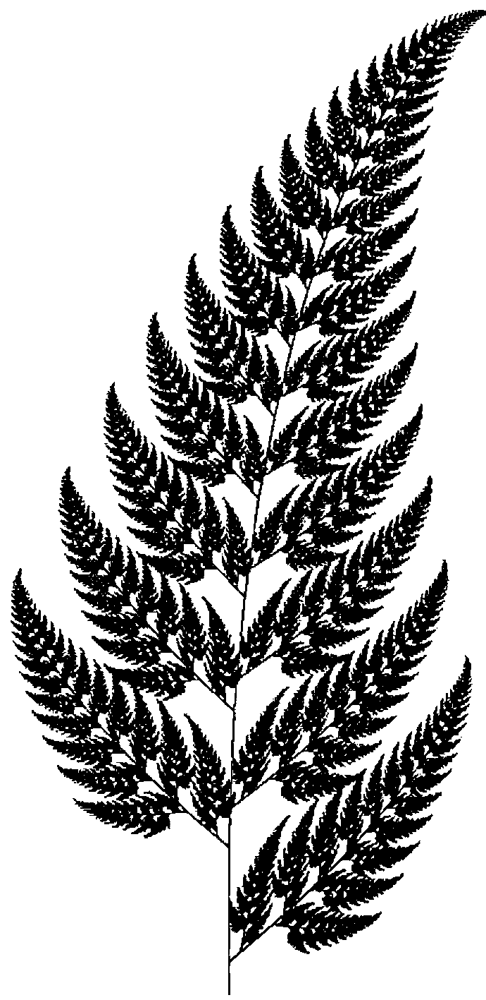
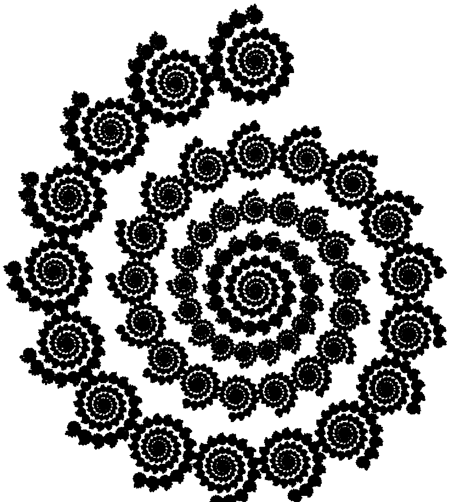
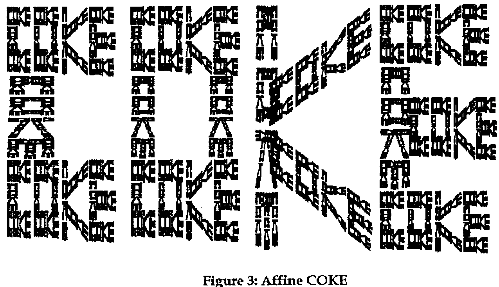
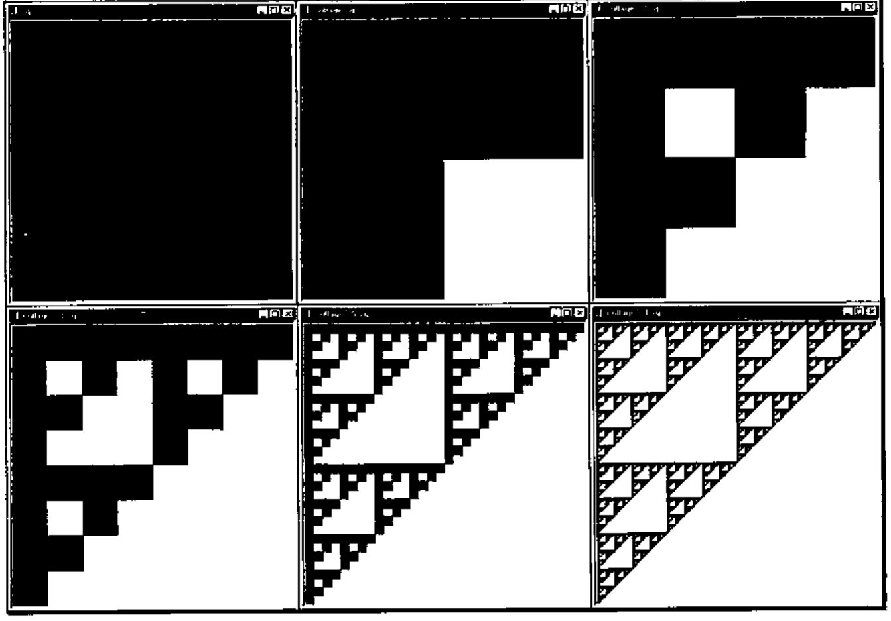
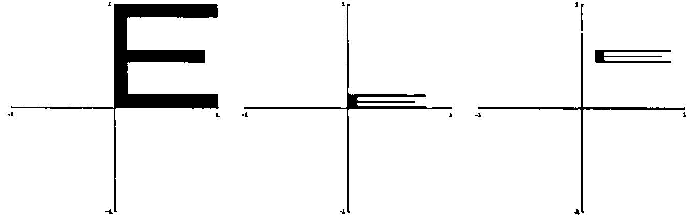
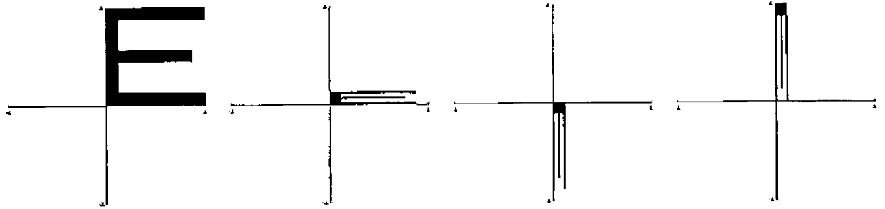
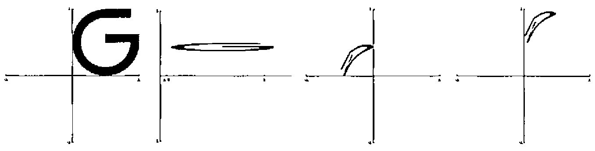
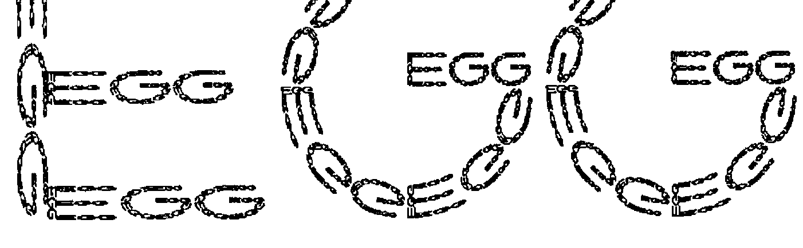
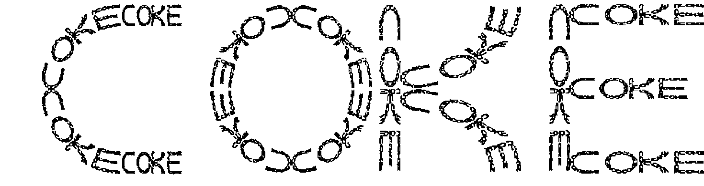

*by Benjamin J. Reiter, Clifford A. Reiter, Zachary X. Reiter*
{ .byline }



## Introduction

Barnsley [1] and others including [9,10,12] have described techniques for constructing wonderful and amazing images from simple formulas known as *iterated function systems*. The purpose of this note is to give an experimental introduction to these ideas based on Cliff’s experience in teaching this topic in his linear algebra and visualization classes. The most dramatic illustration we give is of a mini J application that two of Cliff’s sons, Ben and Zach, wrote as their final project in a version of his visualization class that they attended.

Before we get to the good stuff (the J and making the pictures), we need to say a bit about the mathematics and the history. The images we will create are created using "iterated function systems" which are simply collections of functions. Here we think of a function as taking points in the plane as argument and resulting in another point in the plane; hence we also call these functions transformations or maps. Usually we want these functions to be "nice" in the sense that they move points closer together. Namely, they are contractions – we will make this precise in the next section.

Figure 1 shows a slight variation on the Barnsley fern which is a classic, beautiful example of an object that can be created using four especially simple functions. While [1] is highly recommended for study by advanced undergraduate mathematics students, the mathematics there could be daunting for the less seasoned; yet iterated function systems provide many opportunities for motivating familiarity with the behaviour of transformations of the plane and hence encourage creativity – all the while giving valuable experience with fundamental ideas of computer graphics: geometrically useful transformations of the plane.



The basic ideas are delightfully simple and trying to create an image with a certain pattern using iterated function systems can be addictive. For example, the spiral in Figure 2 is produced with just two simple transformations. Can you guess what they are? Barnsley’s text also contains a classic "COKE" of "COKE"s created with 14 transformations similar to Figure 3. This has some resemblance to the "Reductionism/Holism" sketch on p.310 in Hofstadter’s *Gödel, Escher, Bach* [7]. The letters of the "Coke" are somewhat crude; we will see that we can use functions that transform the plane with bending (really just conversion to polar coordinates) to improve the fractal font; but in any case, the patterns are fascinating.



Figure 3: Affine COKE
{ .caption }

Readers can have fun trying to duplicate these pictures, or better yet, creating a fractal version of their name. You can also think about how to automate the process of creating iterated function systems that have specified words as their result. Alternately, you may view this paper as provoking ideas for your own explorations in another language or simply as an introduction to a playful application available over the web that creates fractal "words of words" with curved letters.

## Iterated Function Systems

Iterated function systems are collections of functions. There is a beautiful mathematical theory that explains when iteration of these systems converges to a "nice" set. Roughly speaking, one wants the functions to be contractions. A function f defined on a subset of the plane is a *contraction* if there is a constant 0 ≤ *c* < 1 so that |f(*y*)−f(*x*)| ≤ *c* |*y* − *x*| for all *x* and *y* in the domain of f. All this means is that points move, under the application of f, toward each other by at least a factor of *c*. We will illustrate what we mean by iteration of such a system in a moment.

Our examples will use J which is available from http://www.jsoftware.com. First consider a function that halves each of its coordinates. We define `f` in J using a functional programming style. The symbol `&` bonds (or curries) the multiplicative factor `0.5` to the times function yielding the function that is multiplication by half. Then this is composed with other arithmetic operations using `@` to denote composition.

```text
   f=:0.5&*            NB. Function that multiplies by half
   f 3 4               NB. Evaluate f at 3 4
1.5 2

   g=:0.5&+@f          NB. Function that adds half after multiplying by half
   g 3 4
2 2.5

   h=:0 0.5&+@f"1      NB. This function adds 0.5 only to the second coordinate
   h 3 4
1.5 2.5
```

At the end of the definition of `h` the use of `"1` designates the rank of application of `h` to be one. That is, `h` operates on the rows of its input (1-dimensional cells), not the individual entries. These three functions can be made into a formal collection by tying them together as a composite object. In J this is done using tie, `` ` ``, and the result is called a gerund since it is made up of functions (verbs) acting as objects (nouns). There are two ways in which iterated function systems are typically iterated. The first way is to apply all the functions to all the points creating a collage of results. The other way we "iterate" is to apply a randomly selected transformation; then each point in the input corresponds to a single point in the output.

```text
   ]sq=:4 2 $ 0 0  1 0  1 1  0 1   NB. The vertices of the standard unit square;
0 0                                NB. $ reshapes data into a matrix;
1 0                                NB. the identity function ] displays the
1 1                                NB. result
0 1

   collage=:f`g`h`:0               NB. Function giving the collage of the
                                   NB. transformations
   collage sq                      NB. The collage of the square results
  0   0                            NB. in three transformed squares
0.5   0
0.5 0.5                            NB. f on sq
  0 0.5

0.5 0.5
  1 0.5
  1   1                            NB. g on sq
0.5   1

  0 0.5
0.5 0.5
0.5   1                            NB. h on sq
  0   1
```

The top left of Figure 4 shows the square and the top middle shows the three images of the square under the collage of the three given transformations. We can look at the collage of the collage of the squares that result from another application of the collage function. These squares are given by `collage^:2 sq` where `^:` designates iteration.



Figure 4: Iteration of collages
{ .caption }

Figure 4 shows that second iterate in the upper right and also shows some further iterates of this process of creating collages. Notice that if the original square was replaced by another polygon, or even a single point, after several iterations of collage the image would be indistinguishable from our last image. Indeed, if the iterated function system is made up of contractions there is a unique image resulting from the iteration of collages and that image forms a pattern such that taking the collage of the pattern results in the same pattern; precise statements and proofs appear in [1].

We now consider iteration of our function systems in the second way. Here we want to select one of the transformations at random and apply it. We use agenda, denoted `@.` (the dot distinguishes this from composition which we saw was denoted `@` ). Agenda selects which function among ``f`g`h`` to apply according to the function on its right. In the definition of `rt` below the selection is determined according to the function `?@3:` . That function randomly selects among the first three indices: 0, 1 or 2.

```text
   ?@3:  1 1                       NB. Random index
2
   ?@3:  1 1                       NB. Another random index
0

   rt=:f`g`h@.(?@3:)               NB. Random Transformation
   rt 1 1                          NB. Randomly apply one transformation
0.5 0.5
   rt 1 1
0.5 1
   rt 1 1
1 1
   rt 1 1
0.5 0.5
```

We can apply random transformations one after another by listing more than one iteration number. It is convenient to list successive indices for the desired powers.

```text
   i.8                             NB. Several successive indices
0 1 2 3 4 5 6 7
   rt^:(i.8) 1 1                   NB. Several successive random transformations
       1        1
     0.5      0.5
    0.75     0.75
   0.375    0.875
  0.6875   0.9375
 0.84375  0.96875
0.421875 0.484375
0.210938 0.242188
```

Of course, if we randomly iterate enough times we will end up near the attractor for the iterated function system. We are using non-zero probabilities for each transformation; thus, if we randomly iterate enough we will visit near every point on the attractor. Images of the points visited can be created by marking the entries in a matrix corresponding to pixels. In procedural languages this is often done a pixel at a time via interaction with the operating system. In J this can be accomplished by working on a matrix representing an array of pixels and saving the result to a graphics file which can then be viewed. The J script wwifs.ijs contains utility functions that accomplish this in a way that displays intermediate stages. You can obtain the script from a link to "Word of Words" from the fractal page http://math.pardee.lafayette.edu/Cliff/J. Once you have J running, you can run the script wwifs.ijs from the "run" menu in J. Here are the steps you should take to create a raster image of the iterated function system demonstrated above once you have run the script and have defined `f`, `g`, `h` and `rt` as above.

```text
makevra 'Fractal'      NB. Create a graphics window with given title;
                       NB.  vra stands for virtual raster array.
10 rtiter 1 1          NB. This computes and displays 10 thousand
                       NB. iterations of rt with 1 1 as a starting point; but
                       NB. the first hundred pixels are discarded.
```

You can make the image more complete by running more iterations. Before working with more complicated examples, we will consider homogeneous coordinates as a way to organize our transformations.

## Homogeneous Coordinates

Homogeneous coordinates for points in the plane can be thought of as the usual two coordinates with a third coordinate that is always 1 attached. Thus 0.75 0.5 in ordinary Cartesian coordinates is 0.75 0.5 1 in homogeneous coordinates. At first glance this seems silly and wasteful, but it turns out that it allows us to think of the usual linear transformations of the plane along with translations of the plane in a uniform manner. Namely, using matrix multiplication. In most mathematics texts, matrices are used to transform points by left multiplication. In computer science the convention is reversed, and since this keeps the J experiments slightly simpler, we will use the computer science convention.

It is convenient to think about three simple geometric transformations of the plane: scaling, rotation and translation. We can accomplish the scaling by putting the scale factors on the diagonal, rotations about the origin involve multiplication by a matrix of sines and cosines of the angle (which is a standard application of linear algebra [4]), and translations can be accomplished by putting the amount to be translated in the last row.

In particular, the form of these matrices is as follows.

| scaling | rotation | translation |
|---|---|---|
| *r* 0 0 | cos(*t*) −sin(*t*) 0 | 1 0 0 |
| 0 *s* 0 | sin(*t*) cos(*t*) 0 | 0 1 0 |
| 0 0 1 | 0 0 1 | *u* *v* 1 |

Now we multiply out the scaling transformation in homogeneous coordinates; we see

> (*x*<sub>new</sub>, *y*<sub>new</sub>, 1) = (*x*, *y*, 1) [*r* 0 0; 0 *s* 0; 0 0 1] = (*rx*, *sy*, 1).

Thus, the *x*-coordinate is multiplied by *r* and the *y*-coordinate is multiplied by *s*. The rotation matrix applies a clockwise rotation through an angle of *t* and the translation adds *u* to the *x*-coordinate and *v* to the *y*-coordinate. Some examples are as follows.

```text
   ]A=:3 3$0.1 0 0  0 0.5 0  0 0 1            NB. Scaling
0.1   0 0
  0 0.5 0
  0   0 1
```

Recall that `$` denotes "reshape" so the definition of `A` above can be read "A is assigned the 3 by 3 reshape of the data".

```text
   2 3 1 +/ . * A                  NB. Matrix multiplication is +/ . *
0.2 1.5 1

   ]C=:3 3$1 0 0  0 1 0  0.4 0.6 1           NB. Translation by 0.4 0.6
  1   0 0
  0   1 0
0.4 0.6 1

   2 3 1 +/ . * C
2.4 3.6 1

   t=: +/ . * & C                  NB. Translation as a function
   t 2 3 1
2.4 3.6 1
```

We bonded the matrix to matrix multiplication in order to obtain a function that applies directly to the homogeneous coordinate points. Notice that when doing matrix arithmetic directly, the input point appears on the left while when applying the transformation `t`, the input point appears on the right (as is usual for functions).

A function that builds rotation matrices is given below. This uses the trigonometric functions which can be loaded with the trig.ijs script that comes with J or we can use the built in circular functions denoted `o.` along with the constant functions `0:` and `1:` and the juxtaposition functions denoted with comma and comma-colon.

```text
   sin=: 1&o.                      NB. sine is the first circular function
   cos=: 2&o.                      NB. cosine is the second

   rotm=: (cos , -@sin , 0:),(sin , cos , 0:),: 0: , 0: , 1:

   ]pi=:1p1                        NB. 1p1 designates 1 times pi to the first power
3.14159

   rotm pi % 4                     NB. 45° clockwise rotation matrix;
0.707107 _0.707107 0               NB. % denotes division
0.707107  0.707107 0
       0         0 1
```

As an illustration we will think about the two transformations that are required to produce the spiral of spirals in Figure 2. First, there is a transformation that scales the entire image by a factor of 0.2 and translates the image by 0.4 0.8 producing the top spiral. We can produce that transformation by multiplying suitable matrices together.

```text
   ]a=:3 3$0.2 0 0 0 0.2 0 0 0 1
0.2   0 0
  0 0.2 0
  0   0 1

   ]b=:3 3$1 0 0 0 1 0 0.4 0.8 1
  1   0 0
  0   1 0
0.4 0.8 1

   x =: +/ . *                     NB. Name matrix multiplication x for brevity

   a x b
0.2   0 0
  0 0.2 0
0.4 0.8 1

   s=: x&(a x b)                   NB. The transformation applying a and b

   s 1 1 1
0.6 1 1
```

The second transformation we want maps the image to the entire remainder of the image after the one subspiral is removed. This is a composite of rescaling the image by a factor 0.97 in both coordinates, rotating by a 19th of a turn, and translating slightly to centre the image.

```text
   ]d=:3 3$0.97 0 0 0 0.97 0 0 0 1
0.97    0 0
   0 0.97 0
   0    0 1

   ]e=:rotm _2r19 * pi             NB. Note _2r19 denotes the rational number -2/19
 0.945817 0.324699 0
_0.324699 0.945817 0
        0        0 1

   ]f=.3 3$1 0 0 0 1 0  0.189 _0.14 1
    1     0 0
    0     1 0
0.189 _0.14 1

   t=:x&(d x e x f)

   rt=:s`t@.(?@2:)                 NB. Random transformation
```

Again, if you have run the wwifs.ijs script you can create a graphics window and iterate `rt` using `makevra` and `rtiter` as described in the previous section. ***However, be sure to remember to make your initial guess a point in homogeneous coordinates since that is what these transformations act upon.*** Your image will not be as balanced as Figure 2 unless you run an extremely large number of iterations. The reason for this is because we really should select the transformation that is to produce greater area with greater likelihood. This can be done relatively easily by replicating `t` several times. Here is a way to replicate `t` several times without much typing. The function `#` copies its right argument the specified number of times.

```text
   2 4 # 5.4 7                     NB. Copies of numbers
5.4 5.4 7 7 7 7

   1 3 # s`t                       NB. Copies of functions
┌─┬─┬─┬─┐
│s│t│t│t│
└─┴─┴─┴─┘
```

In a similar way we can create `rt` with `s` appearing once and `t` appearing 20 times. To complete that we also need the constant function 21 which is written `21"_` in the definition.

```text
   rt=:(1 20#s`t)@.(?@(21"_))
```

Iterating this `rt` ought to allow you to replicate Figure 2 with a modest number of iterations.

A nice first exercise is to implement the transformations associated with the fern in Figure 1. The parameters are given in the Appendix. Which transformations should be repeated and how much in order to get a balanced image? Then trying to duplicate other interesting fractals can be fun, valuable experience with transformations. Can you create variants of the spiral? Can you duplicate the Coke of Cokes? Can you create a fractal version of your name?

All of our examples so far could be written in terms of matrix multiplication in homogeneous coordinates. These are known as *affine transformations*. In the next section we take a deeper look at fractal words that includes nonaffine transformations based on conversion to polar coordinates.

## Word of Words

The letter E can be thought of as being formed by 4 straight strokes; that is, we want to find four affine transformations that when applied to the standard unit square (its coordinates take values between 0 and 1) gives rise to those strokes. Then, the attractor of those affine transformations ought to be an E made up of Es. The three horizontal strokes can be thought of as being created by a scaling followed by a translation. The vertical stroke can be thought of in the same way. However, we have in mind extending these transformations in a way that leads to words, hence the horizonal strokes will fill nicely with words while the vertical stroke would be crunched horizontally. While crunching can be interesting, we can avoid crunching with a rotation. Notice that we already saw a transformation of the type: scale, rotate, and then translate in the previous section when we created `t`. Since transformations of these types are quite convenient for building letters, we introduce some utilities for constructing the transformations.

If you have run wwifs.ijs, these utilities are already defined and you can immediately experiment with them but we list them below since they are concise. Unlike our previous J functions, these are defined explicitly in terms of left and right arguments; the left argument is denoted `x.` while `y.` designates the right argument. Several new J primitive functions appear without further comment there, but they can be looked up in the online help in a J session if desired.

Before looking at the utilities themselves, we return to our first example, the middle stroke of the E. It can be formed by taking the standard unit square and contracting by a factor of three quarters (`3r4`) in the *x*-coordinate and by one eighth in the *y*-coordinate. Translating by `1r8 7r16` centres it vertically and moves it to the right so it will abut the vertical stroke which will have width one eighth. See Figure 5 for an illustration of these steps applied to an E.



Figure 5: Middle Stroke of an E. Scale and Translate
{ .caption }

```text
   satm=: 3 : '3 3$1j3 1j1 1 1 1#y.,1'      NB. Scale and translate matrix

   satm 3r4 1r8 1r8 7r16                     NB. 3r4 is 0.75
 0.75      0 0
    0  0.125 0
0.125 0.4375 1

   sat=: 1 : 'x & (satm x.)'                 NB. Gives the function resulting
                                             NB. from satm
   e0=:3r4 1r8 1r8 7r16 sat
```

```text
   e0
┌─┬─┬───────────┐
│x│&│3r4    0 0 │
│ │ │  0  1r8 0 │
│ │ │1r8 7r16 1 │
└─┴─┴───────────┘
   e0 0 1 1
1r8 9r16 1
```

The vertical stroke can be thought of as being formed by scaling vertically by one eighth and not scaling horizontally (this transformation isn’t technically a contraction, but since it is "on the edge", we get away with it!). Rotating this π/2 clockwise results in transforming the standard unit square to a vertical strip below the *x*-axis. Translating 0 1 moves it to the left edge of the unit square as desired. See Figure 6. The function `ratm` creates a matrix that does this scaling, rotation and translation. The mnemonic for this ought to be `sratm` but `ratm` seemed more winsome. The right argument gives the angle for the rotation and the left gives scaling and translation. The result of `rat` with the same arguments is the function that applies the transformation given by that matrix.



Figure 6: Vertical Stroke of an E. Scale, Rotate and Translate
{ .caption }

```text
   ratm=: 4 : '(satm (2{.x.),0 0)x (rotm y.)x satm 1 1,_2{.x.'

   rat=: 2 : 'x & (x. ratm y.)'            NB. Transformation that applies the
                                           NB. ratm matrix

   e1=:1 1r8 0 1 rat (1r2 * pi)
   e1                                      NB. Some roundoff error appears
┌─┬─┬─────────────────────────┐
│x│&│6.12303e_17          _1 0│
│ │ │      0.125 7.65379e_18 0│
│ │ │          0           1 1│
└─┴─┴─────────────────────────┘
   e1 1 1 1
0.125 0 1
```

Similar transformations can be applied to other strokes, `e2` and `e3` of E and so we can combine these to get a list of transformations associated with the letter E.

```text
   e2=:7r8 1r8 1r8 0 sat
   e3=:7r8 1r8 1r8 7r8 sat
   E=:e0`e1`e2`e3
```

We are ready to discuss curved strokes. A simple way to deal with these strokes is to map the standard unit square to the intersection of a sector with an annulus. That is, the Cartesian coordinates are scaled, translated and interpreted as polar coordinates. The function created by `(a,b) pol (c,d)` maps the unit square to the polar region *a* ≤ *r* ≤ *b*, *c* ≤ θ ≤ *d*. The letter G can be thought of as being formed by 3 quarter circle curved strokes along with two short straight horizonal strokes, one at the top and the other in the middle. If we map the standard unit square to 3/8 ≤ *r* ≤ 1/2, π/2 ≤ θ ≤ π we get a quarter circular stroke of the size and orientation appropriate for the upper left stroke of the G. We can translate by 0.5 0.5 in order to position the stroke. See Figure 7. We use the utility `pol` to map to the region described. The definition below gives the details and, as before, if you have run wwifs.ijs, this utility is already defined. While the utility does a good bit of arithmetic, the main function is `r.` which converts from polar to Cartesian coordinates.



Figure 7: The upper-left curve of a G. Scaled and translated, interpreted as polar co-ordinates and translated.
{ .caption }

Note, here we combine J notation for rational and pi related constants for the first time: `1r2p1` designates one half pi to the first power.

```text
   pol=: 2 : '(({.x.)&-@((-/x.)&*)@(1&{) ,&1@+.@r.
                              ({.y.)&-@((-/y.)&*)@(0&{))"1'

   g0=:1 1 1r2 1r2 sat@(3r8 1r2 pol 1r2p1 1p1)

   g0 1 1 1
0 0.5 1

   g0 0 0 1
0.5 0.875 1
```

Below we create the other four transformations for the letter G.

```text
   g1=:1 1 1r2 1r2 sat@(3r8 1r2 pol _1p1 _1r2p1)
   g2=:1 1 1r2 1r2 sat@(3r8 1r2 pol _1r2p1 0)
   g3=:3r8 1r8 1r2 7r8 sat
   g4=:1r2 1r8 1r2 4r8 sat
```

If we want to combine the letters E and G into a word this can be done by composing the transformations given for each letter with a simple affine transformation in the *x*-coordinate in order to squeeze all the letters into the interval from 0 to 1. Then plotting the result on a virtual raster array suitably expanded in the horizontal direction gives a balanced image. For example, if we wanted to spell the word EGG, we can create three transformations scaled by one third in the *x*-coordinate and shifted according to letter position.

```text
   s0=:1r3 1 0   0 sat
   s1=:1r3 1 1r3 0 sat
   s2=:1r3 1 2r3 0 sat
```

Now we can create a random transformation composing the strokes for each letter with the appropriate shift.

```text
   rt=:s0@e0`(s0@e1)`(s0@e2)`(s0@e3)
      `(s1@g0)`(s1@g1)`(s1@g2)`(s1@g3)`(s1@g4)
      `(s2@g0)`(s2@g1)`(s2@g2)`(s2@g3)`(s2@g4)@.(?@(14"_))

   150 450 makevra 'egg'           NB. Make a long window
```

Figure 8 shows the result of running `rtiter 1 1 1` for that `rt` (at higher resolution). Can you figure out how to make the curved words in the G change orientation so they are directly readable?



Figure 8: Egg of Eggs
{ .caption }

The above idea allows you in principle to create a fractal word of words based on any word given the strokes required for the letter. It is quite inconvenient to do the final *x*-coordinate scaling by hand as above, but that process can be easily automated. The script wwifs.ijs contains a program for automatically creating the random transformation based simply on the input word. You can run the program in Windows versions of J by running the following.

```text
   wwifs ''
```

You can type in any word, an iteration count and the number of pixels to use for each letter. The program will produce a word of words based on the appropriate iterated function system and display the result. Figure 9 shows an example of a fractal "COKE" produced that way. While this version is much more readable than the version in Figure 3 it is doubtful it will win any font design prizes. How many levels of COKE within COKE can you see?



## Further Reading

Other sources of ideas for fun projects with iterated function systems include Gröller [6] who looks at nonlinear iterated function systems on two and three dimensional grid arrays. Frame and Angers [5] look at nonlinear iterated function systems including functions such as *az*<sup>*n*</sup> + *b* in the complex plane. Sprott [13] automatically finds affine iterated function systems that have visual appeal. These fractals are abstract but quite interesting. Reiter [12] contains several playful images such as a fractal smile and spiral of smiles of spiral of smiles that his students enjoy trying to replicate. While we identified our transformations by eye, automating the process of finding transformations that result in digitized photographic images has important implications for image compression [2] so these topics are more than merely playful.

Cliff Reiter<br>
Department of Mathematics, Lafayette College, Easton PA 18042 USA<br>
Web: http://math.pardee.lafayette.edu/Cliff/J

## Appendix: Parameters for the Fern

The matrices in normalized homogeneous coordinate form that were used to construct the fern in Figure 1 are as follows.

```text
   0    0 0       0.85 _0.04 0       0.2    0.23 0     _0.15   0.26 0
   0 0.16 0       0.04  0.85 0     _0.26    0.22 0      0.28   0.24 0
0.25    0 1     0.0375  0.17 1       0.2  0.1025 1    0.2875 _0.021 1
```

## References

1. M. F. Barnsley, *Fractals Everywhere*, 2nd edition, Academic Press, Cambridge MA, 1993.
2. M. F. Barnsley and L. P. Hurd, *Fractal Image Compression*, AK Peters, Wellesley, MA, 1993.
3. O. M. Carducci, Four elementary linear algebra projects, *PRIMUS*, 3 4 (1993) 337-344.
4. J. B. Fraleigh and R. A. Beauregard, *Linear Algebra*, Third edition, Addison-Wesley Publishing, Reading, MA, 1995.
5. M. Frame and M. Angers, Some nonlinear iterated function systems, *Computers & Graphics*, 18 1 (1994) 119-125.
6. E. Gröller, Modeling and rendering of nonlinear iterated function systems, *Computers & Graphics*, 18 5 (1994) 739-748.
7. D. Hofstadter, *Gödel, Escher, Bach*, Vintage Books, New York, 1980.
8. J. Hutchinson, Fractals and self-similarity, *Indiana University Journal of Mathematics*, 30 (1981) 713-747.
9. H-O Peitgen, H. Jürgens and D. Saupe, *Chaos and Fractals*, Springer-Verlag, New York, 1992.
10. H-O Peitgen and D. Saupe, *The Science of Fractal Images*, Springer-Verlag, New York, 1988.
11. C. A. Reiter, Linear Algebra and Laboratories, *Mathematica in Education*, 2 2 (1993) 7-9.
12. C. A. Reiter, Fractals, Visualization and J, Iverson Software Inc., Toronto, 1995.
13. J. C. Sprott, Automatic generation of iterated function systems, *Computers & Graphics*, 18 3 (1994) 417-425.
