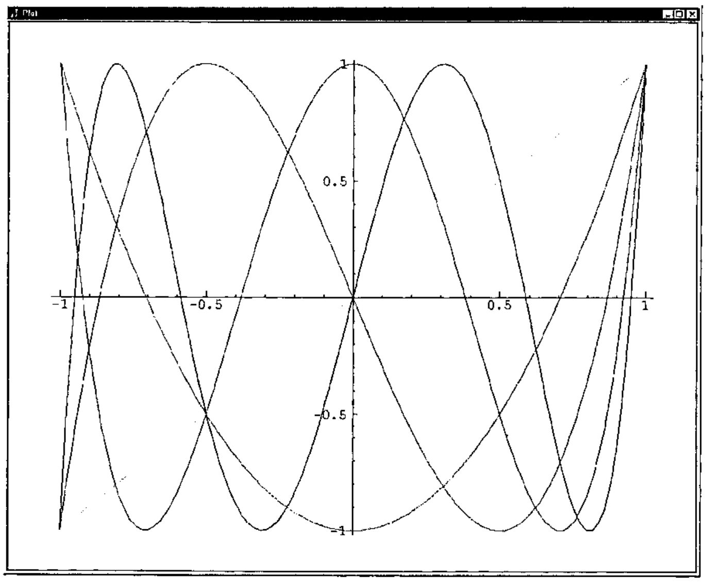

*by Clifford A. Reiter*
{ .byline }

A recent paper by Joseph De Kerf illustrated the use of Binet type formulas for computing Horadam numbers [1]. This was an effective demonstration of the power of those formulas and the grace of APL for implementation. That article spurred my interest in the Horadam numbers - a long neglected interest. One of my earlier related interests was in computing very large Fibonacci numbers [6]. That work takes advantage of identities involving Fibonacci numbers but does not directly use the Binet formula. Since the Binet formulas are most naturally implemented with floating point computations, the computations are rapid, but of finite precision, on most systems. Thus, my goal in this note is to describe a very different way of computing Horadam numbers and to implement those ideas in J where exact rational computations are available. Moreover, we will see several additional examples of the pervasive nature of the Horadam numbers including a glance at Chebyshev polynomials. The recursive algorithm that we will use also illustrates a powerful J programming style. While matrix constructions of the Fibonacci numbers are well known [2], the corresponding matrix constructions for Horadam numbers are not nearly as well known, but they do appear [9].

## Matrix View of Horadam Numbers.

Following the notation in [1], we will define the Horadam sequence by

> *H*<sub>1</sub> = *p*, *H*<sub>2</sub> = *q*,  *H*<sub>*n*+1</sub> = *sH*<sub>*n*</sub> + *rH*<sub>*n*−1</sub>.

However, the notation for these numbers varies greatly. For example, Horadam [3] and Rabinowitz [5] use a notation where the recursion contains a minus sign and in many contexts it would be more convenient to begin the sequences with *H*<sub>0</sub>. Notice that *H*<sub>*n*</sub> as defined above depends upon *p*, *q*, *r*, and *s* in addition to *n*. When we need to emphasize some or all of that dependency, we can write <sub>*pq*</sub><sup>*rs*</sup>*H*<sub>*n*</sub> or <sub>*pq*</sub>*H*<sub>*n*</sub> for *H*<sub>*n*</sub>.

We rewrite the above recursion in matrix form as

```text
( H[n]   )   ( 0  1 ) ( H[n-1] )
( H[n+1] ) = ( r  s ) ( H[n]   )
```

Iterating this *n*-1 times, we see

```text
( H[n]   )   ( 0  1 )^(n-1) ( H[1] )
( H[n+1] ) = ( r  s )       ( H[2] )
```

Considering the initial condition, *H*<sub>1</sub> = *p* = 1, *H*<sub>2</sub> = *q* = 0, we see

```text
( 10H[n]   )   ( 0  1 )^(n-1) ( 1 )
( 10H[n+1] ) = ( r  s )       ( 0 )
```

Likewise, when *H*<sub>1</sub> = *p* = 0, *H*<sub>2</sub> = *q* = 1, we see

```text
( 01H[n]   )   ( 0  1 )^(n-1) ( 0 )
( 01H[n+1] ) = ( r  s )       ( 1 )
```

Putting these together, we have

```text
( 10H[n]    01H[n]   )   ( 0  1 )^(n-1)
( 10H[n+1]  01H[n+1] ) = ( r  s )
```

Since <sub>*pq*</sub>*H*<sub>*n*</sub> = *p*(<sub>10</sub>*H*<sub>*n*</sub>) + *q*(<sub>01</sub>*H*<sub>*n*</sub>), we can compute general Horadam numbers by computing powers of the matrix *W* = (0 1; *r s*). In particular, <sub>*pq*</sub>*H*<sub>*n*</sub> is the dot product of the vector <*p*, *q*> with the first row of *W*<sup>*n*−1</sup>.

Moreover, the matrix identities *W*<sup>*mn*</sup> = (*W*<sup>*n*</sup>)<sup>*m*</sup> and *W*<sup>*m*+*n*</sup> = *W*<sup>*m*</sup>*W*<sup>*n*</sup> give rise to powerful identities that allow one to skip many intermediate steps in computing Horadam numbers. Indeed, in the Fibonacci case, identities arising from those matrix relations give methods for rapid computation of very large Fibonacci numbers [6]. The identities for the Horadam numbers may be written explicitly and implemented (a worthwhile diversion - see Appendix B). However, we will use the graceful array capabilities of J to utilize the matrix relations directly. In particular, we will recursively compute even powers of *W* by *W*<sup>2*n*</sup> = (*W*<sup>*n*</sup>)<sup>2</sup> and compute the odd powers of *W* using *W*<sup>2*n*+1</sup> = *W W*<sup>2*n*</sup>. In the next section we will implement these ideas.

## Horadam Numbers in J

We first define functions that give the 0<sup>th</sup> and 1<sup>st</sup> powers of *W*. In all the functions we define for giving powers of *W*, we will let the left argument be the list *r*,*s* and the right argument be the ultimately desired power - even though some of that information is unused for these low powers.

```j
   w0=:(=i.2)"_
   2 3 w0 50                     NB. 0th power of W
1 0
0 1
   w1=:0 1&,:@x:@[
   ]W=.2 3 w1 50                 NB. 1th power of W
0 1
2 3
   x=:+/ . *                     NB. Matrix product

   W x W                         NB. W2
2  3
6 11
```

Next we consider the general cases for computing non-negative powers of *W*. There are 4 cases according to whether the power is 0, 1, a general even power, or a general odd power. The function `case` distinguishes between these cases by adding the power mod 2 to twice the result of the Boolean test: “is the power greater than 1?”.

```j
   case=: 2&| + +:@(1&<)
   (,:case)i.8                   NB. We see how the four cases depend on the power
0 1 2 3 4 5 6 7
0 1 2 3 2 3 2 3

   we=:[ x~@:w -:@]              NB. Even powers of W: the square of the half power

   wo=:w1 x [ w <:@]             NB. Odd powers of W: W times the previous power

   w=: w0`w1`we`wo@.(case@])     NB. Agenda on the four cases gives general powers

   2 3 w 2                       NB. W2
2  3
6 11
   2 3 w 50                      NB. W50
 520158358287556133051137142  926285732032534439103474303
1852571464065068878206948606 3299015554385159450361560051
```

Recall that the Horadam numbers are the dot product of the list *p*,*q* with the first row of *W*<sup>*n*−1</sup>. We will follow [1] and take the left argument of our Horadam function to be the list *p*,*q*,*r*,*s*. Thus `2&{.@[` gives *p*,*q* and `_2&{.@[` gives *r*,*s*. The definition of `horadam` may be read as *p*,*q* dot product with the first row of *W*<sup>*n*−1</sup>. We apply rank 1 0 since we expect the left argument to be a vector and the right argument to be the number of the desired term in the sequence.

```j
   horadam=:(2&{.@[ x _2&{.@[ {.@w <:@])"1 0

   1 0 2 3 horadam 51
520158358287556133051137142
```

The following exact integers are consistent with the correct entries in the table in the appendix of [1].

```j
   ,.2 3 _3 3 horadam 249 250 251
_145557834293068928043467566190278008218249525830565939618481
                                                            0
 436673502879206784130402698570834024654748577491697818855443

   sxfmt 2 3 _3 3 horadam 249 250 251    NB. Short exact format
_145557834...(60)...5939618481
0         ...(1)...         0
4366735028...(60)...7818855443
```

The function `sxfmt` is a utility for displaying the beginning and end of exact integers. It is convenient to use it when the number of digits is very large. These “short exact format” expressions also include the number of decimal digits of the exact integer in parentheses. The definitions of `sxfmt` (short exact format) and a related function, `sxmfmt`, (short exact matrix format) are given in Appendix A and are available on-line [7].

We can also use the `horadam` function for non-integer *p*,*q*,*r*,*s* and maintain exact computations since exact rational arithmetic is built-into J. The experiments below are again consistent with the correct entries in the appropriate table in [1].

```j
   x: _0.6 0.98 _2.7225 _8.3            NB. Change decimal to exact rational
_3r5 49r50 _1089r400 _33r10
   float=: x:^:_1
   float x: _0.6 0.98 _2.7225 _3.3      NB. Change back to decimal
_0.6 0.98 _2.7225 _3.3
   float (x: _0.6 0.98 _2.7225 _3.30) horadam 100 101 102
0 3.39555e19 _1.12053e20
```

## Some Special Horadam Sequences

De Kerf [1] noted some special cases of Horadam numbers and other special cases are noted in [3,4]. We consider these to demonstrate the pervasiveness of the Horadam numbers.

```j
   1 3 _1 2 horadam >:i.10      NB. Arthimetic progression starting 1 3
1 3 5 7 9 11 13 15 17 19

   3 8 _1 2 horadam >:i.10      NB. Arthimetic progression starting 3 8
3 8 13 18 23 28 33 38 43 48

   1 3 0 3 horadam >:i.10       NB. Geometric progression
1 3 9 27 81 243 729 2187 6561 19683

   1 1 1 1 horadam >:i.10       NB. Fibonacci numbers
1 1 2 3 5 8 13 21 34 55

   1 3 1 1 horadam >:i.10       NB. Lucas numbers
1 3 4 7 11 18 29 47 76 123

   1 2 1 2 horadam >:i.10       NB. Pell numbers
1 2 5 12 29 70 169 408 985 2378

   1 3 1 2 horadam >:i.10       NB. Pell-Lucas numbers
1 3 7 17 41 99 239 577 1393 3363

   1 1 2 1 horadam >:i.10       NB. Jacobsthal numbers
1 1 3 5 11 21 43 85 171 341

   1 5 2 1 horadam >:i.10       NB. Jacobsthal-Lucas numbers
1 5 7 17 31 65 127 257 511 1025
```

In fact, because of the two-step recursive definition of the Horadam sequence, many other classical sequences and functions may be obtained from the Horadam numbers. For example, the Chebyshev Polynomials [8] are recursively defined by

> T<sub>*n*</sub>(*x*) = 2*x*T<sub>*n*−1</sub>(*x*) − T<sub>*n*−2</sub>(*x*) where T<sub>0</sub>(*x*) = 1, T<sub>1</sub>(*x*) = *x*, T<sub>2</sub>(*x*) = 2*x*<sup>2</sup> − 1.

Thus, the value of T<sub>*n*</sub>(*x*) is the *n*<sup>th</sup> Horadam number with *p*,*q*,*r*,*s* equal to *x*, 2*x*<sup>2</sup> − 1, −1, 2*x*.

```j
   chebyshev=: (, <:@+:@*: , _1: , +:)@]"0 horadam [

   2 chebyshev 0.9              NB. T2(0.9)
0.62
```

```j
load 'plot'
   $Y=:1 2 3 4 5 chebyshev"0 1 X=:_1++:(i.%<:)100
5 100
   plot X;Y
```

Figure 1 shows the resulting plot of five Chebyshev polynomials. As one descends just to the left of *x*=1, the 1<sup>st</sup> through the 5<sup>th</sup> Chebyshev polynomials are crossed in order. Do you notice properties of these polynomials? Several can be observed.



**Figure 1. Five Chebyshev Polynomials**

## Timing and Efficiency

The efficiency of this matrix approach to computing Horadam numbers is of interest. First, we can temporarily modify our function `w` so that we can see which powers were recursively called. In particular, we change `w` as follows.

```j
   wrsc=:(1!:2)&2                       NB. Write to screen function

   w=: w0`w1`we`wo@.(case@wrsc@])       NB. Modified w

   1 1 1 1 horadam 100
99
98
49
48
24
12
6
3
2
1
354224848179261915075
```

Since there can never be two or more odd powers in a row, no more than 2log<sub>2</sub>(*n*) recursive steps are required. Our approach could be improved in a number of ways. We only used the top row of the highest power of *W* that we compute; so we ought to be able to speed things up by not computing the bottom row. Some improvement can also be expected if we use *W*<sup>2*n*+1</sup> = (*W W*<sup>*n*</sup>)*W*<sup>*n*</sup> in order to compute the odd powers of *W*. However, more dramatic improvements (between a factor of 2 and 4) can be obtained by implementing vector/scalar formulas instead of using matrices. See Appendix B for a brief description and implementation.

Table 1 shows the required computer time to compute various size Fibonacci numbers using `horadam` on a 400MHz Pentium based computer. The 5 milliseconds needed to compute exactly the 209 digit Fibonacci number *F*<sub>1000</sub> is not as fast as the floating point computations done in [1], but even accounting for the differences in processor speed, is remarkably close and very respectable. We see that computations in J with thousands or tens of thousands of digits are routine while calculations producing a couple of million digits take significant amounts of time. We did not directly measure the space required for these computations, but the J session as a whole required less than 80M of memory.

| *n* | *F*<sub>10<sup>*n*</sup></sub> | time (sec) |
|---|---|---|
| 1 | `55` | 0.001125 |
| 2 | `354224848179261915075` | 0.002374 |
| 3 | `4346655768...(209)...6849228875` | 0.005 |
| 4 | `3364476487...(2090)...9947366875` | 0.0438 |
| 5 | `2597406934...(20899)...3428746875` | 3.86 |
| 6 | `1953282128...(208988)...8242546875` | 398.172 |
| 7 | `1129834378...(2089877)...6380546875` | 62125.9 |

**Table 1. Time required to compute some Fibonacci Numbers.**

## Appendix A. Definition Summary

We give here a summary of our J functions. Readers may obtain the script horadam.ijs from http://www.lafayette.edu/~reiterc/j/index.html [7].

```j
x=:+/ . *
case=: 2&| + +:@(1&<)
w0=:(=i.2)"_
w1=:0 1&,:@x:@[
we=:[ x~@:w -:@]
wo=:w1 x [ w <:@]
w=: w0`w1`we`wo@.(case@])
horadam=:(2&{.@[ x _2&{.@[ {.@w <:@])"1 0
chebyshev=: (, <:@+:@*: , _1: , +:)@]"0 horadam [

wrsc=:(1!:2)&2
sxfmt=:(10&{.,'...('"_,":@(#-'_'&=@{.),')...'"_ , _10&{.)@":"0
sxmfmt=: ([,'     '"_ ,])/"2 @:sxfmt
```

## Appendix B. Direct Implementation Using Identities

In squaring a 2 by 2 matrix we ordinarily compute 8 products. We will see the special nature of the Horadam numbers is such that we can do this with 3 products. In practice, this leads to almost a `8r3` fold improvement in efficiency. We will not give detailed derivations of the requisite identities, but will explain briefly how they may be obtained.

For convenience, we define

> *K*<sub>0</sub> = 0, *K*<sub>1</sub> = 1,  *K*<sub>*n*+1</sub> = *sK*<sub>*n*</sub> + *rK*<sub>*n*−1</sub>.

Thus, *K*<sub>−1</sub> = 1/*r* is a reasonable extension and in general *K*<sub>*n*−1</sub> = <sub>01</sub>*H*<sub>*n*</sub> and it isn’t too hard to show by induction on n that *rK*<sub>*n*−2</sub> = <sub>10</sub>*H*<sub>*n*</sub>. Therefore <sub>*pq*</sub>*H*<sub>*n*</sub> = *prK*<sub>*n*−2</sub> + *qK*<sub>*n*−1</sub>

We can verify that

```text
       ( rK[n-1]   K[n]             )
W^n =  ( rK[n]     sK[n] + rK[n-1]  )
```

using the matrix power expansion of *W* in terms of the *H*’s that we saw and then translating its entries into *K*’s using the above relations.

Squaring the right side of *W*<sup>2*n*</sup> = (*W*<sup>*n*</sup>)<sup>2</sup> and equating the entries in the first rows yields:

> *rK*<sub>2*n*−1</sub> = *r*<sup>2</sup>*K*<sup>2</sup><sub>*n*−1</sub> + *rK*<sup>2</sup><sub>*n*</sub> and *K*<sub>2*n*</sub> = 2*rK*<sub>*n*−1</sub>*K*<sub>*n*</sub> + *sK*<sup>2</sup><sub>*n*</sub>

and hence

> *K*<sub>2*n*−1</sub> = *rK*<sup>2</sup><sub>*n*−1</sub> + *K*<sup>2</sup><sub>*n*</sub> and *K*<sub>2*n*</sub> = *K*<sub>*n*</sub>(2*rK*<sub>*n*−1</sub> + *sK*<sub>*n*</sub>)

which goes from the pair (*K*<sub>2*n*−1</sub>, *K*<sub>2*n*</sub>) to (*K*<sub>*n*−1</sub>, *K*<sub>*n*</sub>) using just three “big” multiplications. We implement this as follows.

```j
horadamb=:4 : 0"1 0
'p q r s'=.x: x.
k0=.((%r),0)"_
k1=.0 1x"_
ke=.((r,1)&x@:*: , {: * ((+:r),s)&x)@:k@-:
ko=.(0 1,:r,s)&x@k@<:
k=.k0`k1`ke`ko@.case
((p*r),q) x k <:y.
)
```

Lastly, we remark that det(*W*) = −*r*, and hence

> (−*r*)<sup>*n*</sup> = det(*W*<sup>*n*</sup>) = *rK*<sub>*n*−1</sub>(*sK*<sub>*n*</sub> + *rK*<sub>*n*−1</sub>) − *rK*<sup>2</sup><sub>*n*</sub>.

That identity can be used to modify the formula for *K*<sub>2*n*−1</sub> into a formula using just one “big” multiplication if one assumes that (−*r*)<sup>*n*−1</sup> is not a “big” computation relative to *K*<sub>*n*</sub>. Then (*K*<sub>2*n*−1</sub>, *K*<sub>2*n*</sub>) may be computed from (*K*<sub>*n*−1</sub>, *K*<sub>*n*</sub>) using just two “big” multiplications. We leave the implementation of this approach as an exercise.

## References

1. Joseph De Kerf, From Fibonacci to Horadam, *Vector* **15** 3 (1999) 122-130.
2. Verner E. Hoggart, Jr., *Fibonacci and Lucas Numbers*, The Fibonacci Association, Santa Clara, 1969.
3. A. F. Horadam, Special Properties of the Sequence *W*<sub>*n*</sub>(*a*,*b*;*p*,*q*), *The Fibonacci Quarterly*, **5** 5 (1967) 424-434.
4. A. F. Horadam, Jacobsthal Representation Numbers, *The Fibonacci Quarterly*, **34** 1 (1996) 40-54.
5. Stanley Rabinowitz, Algorithmic Manipulation of Second Order Linear Recurrences, *The Fibonacci Quarterly*, **37** 2 (1999) 162-177.
6. Clifford A. Reiter, Fast Fibonacci Numbers, *The Mathematica Journal*, **2** 3 (1992) 58-60.
7. Clifford A. Reiter, Horadam Numbers, http://www.lafayette.edu/~reiterc/j/index.html, 1999.
8. Theodore J. Rivlin, *The Chebyshev Polynomials*, John Wiley & Sons, New York, 1974.
9. Marcellus E. Waddill, Matrices and Generalized Fibonacci Sequences, *The Fibonacci Quarterly*, **12** 4 (1974) 381-386.
