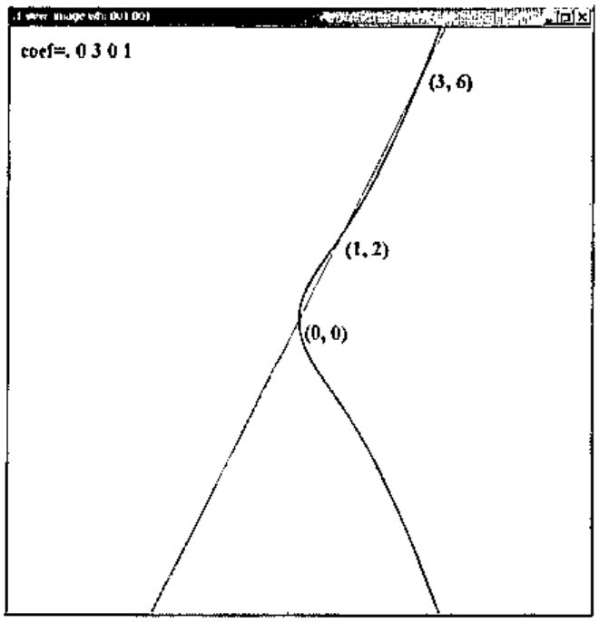
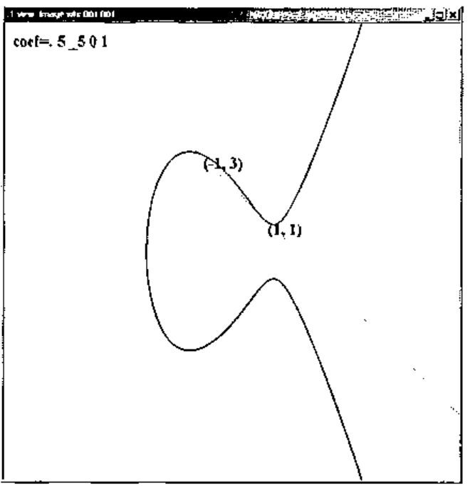
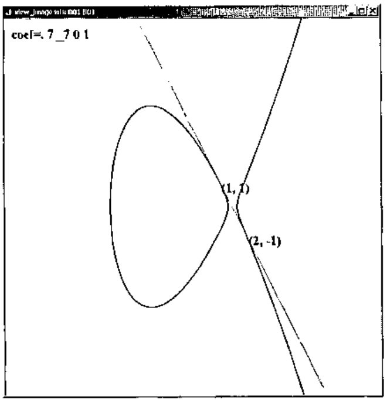

*by Cliff Reiter*
{ .byline }

Factoring integers has become a topic of intense interest because several modern security schemes are based upon the unproven, but highly tested assumption that factoring the product of two sufficiently large primes is implausible. For example, RSA encryption [1,3,5] depends upon that assumption.

J has a factorization primitive, `q:`, that is effective on integers of limited size. Consider the following examples from J501b [2].

```j
   q: 10001x
73 137

   q: 20104311482x
|nonce error
|       q:20104311482
```

In this note we will consider J implementations of several factoring schemes. While our main goal is to implement elliptic curve factorization, we will first implement other techniques for comparisons and for their auxiliary facilities.

## Trial Division

A simple approach to finding a nontrivial factor of a positive integer *n* is to try dividing *n* by all the primes up to and including √*n*. This guarantees that either a prime factor will be found or that *n* is a prime. However, this is impractical for *n* with many more than a dozen digits. Remarkably, there usually are faster ways to find nontrivial factors of an integer. Nonetheless, factoring remains a difficult problem.

It is often convenient to assume that small prime factors have already been removed from a number that we are trying to factor. Thus, we first give a method, essentially a limited form of trial division, for finding and removing small prime factors.

```j
   fac_smpr=: 3 : 0
24 fac_smpr y.
:
p=.p:i.x.
z=.0
whilst. 0<+/peg do.
  peg=.p=p +. y.
  z=.z+peg
  y.=.y.%*/peg#p
end.
(z#p);y.
)

   smpr=:>@{.@fac_smpr

   rmsmpr=: >@{:@fac_smpr
```

The function `fac_smpr` finds/removes small prime factors. The left argument specifies the number of primes to consider as factors. The right argument is the integer to be factored. The function computes the gcd’s of the primes with the right argument. Any prime factors are divided into the right argument and the process is repeated until no additional prime factors are found. The number of occurrences of the small primes is maintained in `peg`. The default left argument is 24 and since there are 24 primes below 100, the default is to find and/or remove all the primes below 100. The result of `fac_smpr` is a boxed list: the first entry gives the small primes and the second gives the remaining factor. The function `smpr` (small primes) gives just the small prime list and `rmsmpr` (remove small primes) gives the remaining factor.

```j
   fac_smpr 10001x
+--+---+
|73|137|
+--+---+

   fac_smpr 10001x^3
+--------+-------+
|73 73 73|2571353|
+--------+-------+

   smpr 10001x^3
73 73 73

   rmsmpr 10001x^3
2571353
```

This function runs quickly. We see the average time to remove the small primes from random 25 digit integers is around 0.005 seconds on a 750MHz PC.

```j
   randi=: (#.?)@:(#&10x)"0

   randi 25
2008895148955473153890348

   time=: 6!:2

  time 'x=:rmsmpr@randi 10#25'
0.0487565

   ,.x
    671234250102220323199
   2474549129588435104129
  48970091249028260523683
2297220239702535644527649
        88419525950493421
   4305779878041636190577
2248097504771690235770021
  64541498213536825761779
   8370870055924244454337
 209137630199356533034823
```

The list x above gives the result of computing 10 random 25 digit integers and removing the small primes from those integers. Notice the range of sizes. We will use this same list throughout this note.

## Pollard *p*-1 Method

The Pollard *p*-1 method is based upon the idea that if *p* is an odd prime that divides *n*, then by Fermat’s Little Theorem, 2<sup>*p*-1</sup> ≡ 1 mod *p*, and hence *p* divides gcd(*n*, 2<sup>*p*-1</sup> – 1). Of course, bases other than 2 may be used and perhaps a smaller power will suffice. The Pollard *p*-1 method looks for factors of *n* of the form gcd(*n*, 2<sup>*M*</sup> – 1) where *M* may be chosen in various ways; however, it is based upon the hope that *p*-1 has only small prime factors and hence divides *M*.

In particular, we follow the suggestion of [1] and select a bound *B* and then compute *M* as the product of prime powers *p<sup>e</sup>* where *e* is the largest power so that *p<sup>e</sup>* ≤ *B*. All primes less then *B* are used in the product. One can compute the gcd at various stages. Standard advice is to compute the gcd’s at the end. However, we will use this technique for relatively small factors and will compute the gcd after each prime power.

There is a natural “second stage” that extends this algorithm when *p* – 1 divides *qM* for a single, slightly larger, prime *q*. However, we will use this technique only to find fairly small primes, so we will be content to implement only the first stage.

```j
   fac_p_1=: 3 : 0"0
(d_p_1_B y.) fac_p_1 y.
:
c=.2x
exp=.y.&|@^
for_k. i. p:^:_1 x. do.
  p=.p: k
  c=.c exp (p^<.p ^. x.)
  g=.y. +. c-1
  if. -. g e. 1,y. do. g,1 return. end.
end.
g,_1
)

   d_p_1_B=: 10000"_ <. >.@:(^&0.5 )
```

The left argument of `fac_p_1` is *B* and the right argument is the number to be factored. The default left argument is taken to be around √*n* but not larger than 10,000. The bound is relatively ad hoc but seems to work well enough for the small primes we seek and keeps the run time of this function short. Of course, that is at the expense of having the algorithm fail when more time might have led to success.

The result of `fac_p_1` is a list of two integers. The first gives the factor if one was found. A 1 in the second position indicates that a nontrivial factor was found (in stage one) while a `_1` indicates no nontrivial factors were found.

Next, we apply `fac_p_1` to the ten integers, x, that were created in the previous section.

```j
   fac_p_1 x
       1 _1
     397  1
       1 _1
     433  1
  367823  1
       1 _1
  978149  1
     839  1
    1087  1
80621729  1
```

It took an average of 0.5 seconds to run `fac_p_1` on a 750 MHz PC. We observe that it failed three times but it usually succeeded. When it was successful, it found factors of a variety of sizes, but these sizes are relatively small compared to 25 digits.

## Pollard rho Method

The Pollard rho method is based upon the idea that if one computes iterates of a function mod *n*, then at some point a duplicate value must be reached. Of course, the duplicate would usually occur much earlier modulo a prime divisor of *n*, hence we can look for factors of the form gcd(*n*, *x<sub>i</sub>* – *x<sub>j</sub>*). As a practical matter, it is traditional to test gcd(*n*, *x<sub>j</sub>* – *x<sub>2j</sub>*) where the sequence *x<sub>j</sub>* is generated by

> *x*<sub>0</sub> = 2<br>
> *x*<sub>*j*+1</sub> = *x<sub>j</sub>*<sup>2</sup> + 1 mod *n*.

The starting value and the function to be iterated can be varied, but we are again primarily interested in the case when it is effective at finding relatively small factors.

```j
   fac_rho=: 3 : 0"0
(d_rho_maxj y.) fac_rho y.
:
n=.y.
f=.1x&+@*:
x1=.f 2x
x2=.f f 2x
g=.n +. n|x2-x1
j=.1
while. (g e. 1,n)*. j<x. do.
  x1=.n|f x1
  x2=.n|f f x2
  g=.n +. n|x2-x1
  j=.j+1
end.
g,j
)

   d_rho_maxj=: 10000&<.@<.@(^&(%3))
```

The left argument gives the maximal number of iterations and the right argument is the number to be factored. The result is a list: the first entry is the most recently computed gcd and the second entry is the number of iterations that were used. When the maximum iterations was reached, the gcd is most likely trivial, but otherwise it is a nontrivial factor. As for the *p*-1 method, we show below the result of running `fac_rho` on the same 10 random integers created in the first section. Running `fac_rho` on all ten integers requires about 17 seconds.

```j
   fac_rho x
  4234213  2330
      277    25
161603867  4748
      269    15
   367823   512
        1 10000
   978149  1800
      839    18
     1087    40
        1 10000
```

We see that `fac_rho` usually succeeded at finding a nontivial factor. It failed twice. A careful comparison with the results for `fac_p_1` shows that each successfully factored some integers that the other did not. Typical random examples show the techniques more usually find the same small factors somewhat more often than our illustration suggests, but the point that they each may succeed when the other fails remains a valid one.

## Elliptic Curves and Arithmetic

Elliptic curves are often viewed as algebraic equations of the form *y*<sup>2</sup> = *x*<sup>3</sup> + *ax* + *b*. We usually restrict to nonsingular curves which are those where *x*<sup>3</sup> + *ax* + *b* has no repeated roots. A somewhat surprising arithmetic can be introduced on the points on nonsingular elliptic curves. Many books have appeared on elliptic curves in recent years so there are many sources for further reading about elliptic curves. Our implementations are primarily motivated by Crandall and Pomerance [1]. That book has a succinct but sophisticated treatment appropriate for implementers of elliptic curve factorization methods. Silverman and Tate [6] give considerable detail regarding the mathematics of elliptic curves as well as providing historical context and different perspectives regarding elliptic curves. Elliptic curve factorization resources and records may also be found on the web; for example, see [7].

The curves appearing in Figures 1-3 show some of the variety of forms that appear in nonsingular elliptic curves. A “typical” line intersects the curve at three points. The arithmetic on elliptic curves is taken so that those three points sum to zero. Vertical lines are also taken to include a point at infinity that is the additive identity. Thus, (*x*<sub>1</sub>, *y*<sub>1</sub>) and (*x*<sub>1</sub>, –*y*<sub>1</sub>) are considered opposites. Tangency is counted as a repeated point. It is straightforward, but requires some algebra, to check that the sum of two distinct, non-opposite points (*x*<sub>1</sub>, *y*<sub>1</sub>), (*x*<sub>2</sub>, *y*<sub>2</sub>) is given by (*x*<sub>3</sub>, *y*<sub>3</sub>) where

> *m* = (*y*<sub>2</sub> – *y*<sub>1</sub>) / (*x*<sub>2</sub> – *x*<sub>1</sub>)<br>
> *x*<sub>3</sub> = *m*<sup>2</sup> – *x*<sub>1</sub> – *x*<sub>2</sub><br>
> *y*<sub>3</sub> = –(*m*(*x*<sub>3</sub> – *x*<sub>1</sub>) + *y*<sub>1</sub>).

When the points are equal, the only change required is that *m* = (3*x*<sub>1</sub><sup>2</sup> + *a*) / 2*y*<sub>1</sub>.

Remarkably, these rules for addition give rise to an “abelian group” structure. In particular, the addition is associative and commutative. Figures 1-3 show some examples of intersections that make addition of certain points clear. For example, Figure 1 corresponds to the elliptic curve *y*<sup>2</sup> = *x*<sup>3</sup> + 3*x* and we see that (0,0) + (1,2) = (3,–6) on that curve. In a similar manner, Figure 2 shows (1,1) + (1,1) = (–1,–3) on *y*<sup>2</sup> = *x*<sup>3</sup> – 5*x* + 5.

We will apply the addition rules on integer points modulo *n*. The quotient required in computing *m* corresponds to finding an inverse modulo *n*. When *n* is composite it may not be possible to find the inverse, and this failure is what gives the nontrivial factor. By carrying along a formal denominator, it is possible to avoid the inversion (which is expensive compared to the other arithmetic operations). This can be done in more than one way. We follow what is called modified projective coordinates in [1].

Modified projective coordinates carries three coordinates (*x*, *y*, *z*). A point (*x*, *y*, *z*) in modified projective coordinates corresponds to a point (*x*/*z*<sup>2</sup>, *y*/*z*<sup>3</sup>) in ordinary coordinates. In particular, a point (*x*, *y*) on the elliptic curve corresponds to (*x*, *y*, 1). Moreover, we can take (0,1,0) to be the point at infinity.



**Figure 1. An elliptic curve that has a bulge shape and three intersection points.**



**Figure 2. An elliptic curve that has an extended bulge and a tangent intersection.**



**Figure 3. An elliptic curve that has two components.**

The addition of two equal points (doubling) in these coordinates can be implemented by the following conjunction `ecdj`. The left conjunction argument gives the coefficients *a*, *b* of the elliptic curve and the right argument gives the modulus. The right function argument specifies the point that should be doubled.

```j
NB. Elliptic curve double point,
NB. modified projective coordinates
NB. ab ecdj n Q
ecdj=: 2 : 0
'a b'=.m.
'x y z'=.3{.y.,1
if. 0 e. y,z do. 'x2 y2 z2'=.0 1 0x else.
  m=.(3**:x)+a**:*:z
  s=.4*x*yy=.*:y
  x2=.(*:m)+_2*s
  y2=.(m*s-x2)+_8**:yy
  z2=.2*y*z
  end.
n.|x2,y2,z2
)
```

Unequal points can be added using the conjunction `ecaj`. While this is more complicated than the formula for addition we gave earlier, keep in mind that we are carrying three coordinates, avoiding division entirely, and keeping the number of multiplications to a minimum.

```j
NB. Ellitpic curve add
NB. P ab ecaj n Q
ecaj=: 2 : 0
:
'a b'=.m.
'x1 y1 z1'=.3{.x.,1
'x2 y2 z2'=.3{.y.,1
if. z1=0 do. 'x3 y3 z3'=.x2,y2,z2
 else.
  if. z2=0 do. 'x3 y3 z3'=.x1,y1,z1
else.
u1=.x2*z12=.*:z1
  u2=.x1*z22=.*:z2
  s1=.y2*z1*z12
  s2=.y1*z2*z22
  w=.u1-u2
  r=.s1-s2
  if. w=0 do.
    'x3 y3 z3'=.m. ecdj n. x1,y1,z1
    else.
    t=.u1+u2
    m=.s1+s2
    x3=.(*:r)-t*w2=.*:w
    y3=.-:(r*(_2*x3)+t*w2)-m*w*w2
    z3=.z1*z2*w
    end. end. end.
n.|x3,y3,z3
)
```

It is useful to have an efficient utility to compute *mP* where this denotes adding *P* to itself *m* times. Some sort of efficient approach should be used to avoid a linear time in *m*. One can use a variant of successive squaring. We continue following the algorithms in [1] and use a slightly different “ladder”. It is implemented as the conjunction `ecmj` which is defined in the script [4], but not displayed here.

## Elliptic Curve Factoring

The basic algorithm for elliptic curve factorization is straightforward and similar to the Pollard *p*-1 algorithm. Below is a summary of the algorithm. We assume that *n* is a composite integer and that neither 2 nor 3 divide *n*. The algorithm uses two bounds *B*<sub>1</sub> and *B*<sub>2</sub> which will be discussed below.

### Elliptic Curve Factoring Algorithm

> (Stage 0) Generate a random elliptic curve and a point *P* on it. Compute the discriminant, 4*a*<sup>3</sup> + 27*b*<sup>2</sup>, of the curve and compute the gcd with *n*. If it is *n*, select another curve. If it has a nontrival factor in common with *n*, return the factor as success at Stage 0.
>
> (Stage 1) For each prime *p* less than *B*<sub>1</sub>, update *P* by replacing it by an appropriate multiple: *P* = *p<sup>e</sup>P*, where *e* is the largest power so that *p<sup>e</sup>* ≤ *B*<sub>1</sub>. Check whether the gcd of the *z* coordinate is a nontrivial factor of *n*. If it is, return that factor as success at Stage 1.
>
> (Stage 2) Now consider the primes *q*<sub>1</sub>, *q*<sub>2</sub>, …, *q<sub>t</sub>* that lie between *B*<sub>1</sub> and *B*<sub>2</sub>. Let *Q* = *q*<sub>1</sub>*P* where *P* was the point resulting from the end of Stage 1. We pre-compute some multiples of *P*, say 2*P*, 4*P*, …, 200*P*. Then we update *Q* = *Q* + (*q<sub>j</sub>* – *q*<sub>*j*-1</sub>)*P* where the addition is an elliptic curve addition modulo *n*. Repeat this for *j* = 2,3,…,*t*. Check whether the gcd of the *z* coordinate of *Q* is a nontrivial factor of *n*. If it is, return that factor as success at Stage 2.
>
> If all stages fail to find a nontrivial factor, then repeat the stages again, perhaps with larger *B*<sub>1</sub> and *B*<sub>2</sub>.

The idea of Stage 1 is quite similar to what we saw in the Pollard *p*-1 algorithm. The hope is that for a prime *r* dividing *n*, the order of the elliptic curve modulo *r* may be relatively small. The order of the elliptic curve modulo *r* is the number of distinct points on the curve modulo *r*. Any point on the curve multiplied by the order of the curve gives the identity modulo *r*, but most likely not modulo *n*. Hence we can most likely find a factor of *n* if the order of the elliptic curve factors with the prime powers considered in Stage 1. Thus, we try to find a nontrivial factor of *n* by taking the gcd of the z-coordinate with *n*. If the order of the elliptic curve modulo *r* doesn’t factor with the primes chosen, we can pick another random curve and try again. However, we can also go on to Stage 2, which is what we do.

Notice that in our algorithm for adding points in modified projective coordinates, the z-coordinate of each argument is a factor of the result (whether the points are equal or not). Thus, if a nontrivial factor appears in the z-coordinate, it will be carried along. There is some possibility that it will become a trivial factor, but that is unlikely compared to getting the nontrivial factor in the first place. Thus, we need not compute gcd’s at every step, we can take them at our convenience. We check the gcd once at the end of Stage 1.

Stage 2 is similar to Stage 1 except the hope is that the order of the elliptic curve modulo *r* is of the form *q<sub>j</sub>*∏*p<sub>i</sub><sup>e<sub>i</sub></sup>* for a single prime *q<sub>j</sub>* between *B*<sub>1</sub> and *B*<sub>2</sub>. Since almost all the (*q<sub>j</sub>* – *q*<sub>*j*-1</sub>)*P* will be in the precomputed list of the multiples of *P*, the cost of trying each *q<sub>j</sub>* is a single elliptic curve addition. As we noted before, we do not need to try the gcd at each point, we merely need to “visit” the point and eventually compute the gcd.

This algorithm is implemented in J in the script [4] and the main function is `fac_ecmj`. Its left argument is a list of *B*<sub>1</sub> and *B*<sub>2</sub> pairs, while the right argument is the number to be factored. In our implementation, the left argument controls the number of elliptic curves that can be tried. The default is to compute 20 *B*<sub>1</sub> and *B*<sub>2</sub> pairs where *B*<sub>1</sub> ranges geometrically from near ln(*n*) to near exp(1/√2 + √(ln(√*n*) ln(ln(√*n*)))) and *B*<sub>2</sub> ≈ *B*<sub>1</sub> ln(*B*<sub>1</sub>). Different authors give variations upon the upper bounds, mostly varying the constants somewhat. Of course unless one knows a great deal about the expected size of the factors, in practice it seems prudent to try many *B*<sub>1</sub> and *B*<sub>2</sub> pairs increasing toward a large choice of the bound.

The result of `fac_ecmj` is a list of three numbers. The first is the factor found (or a trivial factor). The second is the level it was found, 0, 1, or 2, or `_1` if no nontrivial factor was found. The third is the index in the list of *B*<sub>1</sub> and *B*<sub>2</sub> pairs that succeeded (if it did).

Also, running `fac_ecmj` sets a global variable, `Last_random_ec`, that records the elliptic curve and point on it that was used for the factorization. When a “hard” number has been factored, experts are often interested in how it was accomplished. In particular, knowing the elliptic curve and point on it allows the verification of the technique used to produce the factorization.

The results for the trial points *x* computed in the earlier section are shown below.

```j
   fac_ecmj x
      4234213 2 4
          277 1 0
    161603867 2 3
       401617 1 0
       367823 2 5
   1969145333 1 7
1628419520753 1 4
          839 1 0
         1087 1 0
     80621729 2 0

   Last_random_ec
1 1377804045 90635809069775079133736 1119324186 524846382
```

Notice that all of the numbers were factored. It took 22 seconds to do the ten factorizations. Notice successes at both levels 1 and 2 appeared. Also notice the larger factors tended to require more steps which corresponds to larger choices for *B*<sub>1</sub> and *B*<sub>2</sub>.

As our last example, we consider the factorization of the following 27 digit integer that is the product of two primes: one with 13 digits, the other with 15 digits.

```text
152415787533657061564561727
```

Since `fac_ecmj` is probabilistic in the sense that random elliptic curves are used, timing a single factorization may be misleading. Here we record the result of `fac_ecmj` on the above 27 digit integer ten times. We append the seconds used in the last column.

```text
  1234567890133  2 13  136.30
  1234567890133  1 10   39.85
              1 _1 20 1180.41
  1234567890133  1 18  696.14
123456789012419  1 19  989.31
123456789012419  1 18  687.79
123456789012419  1 14  165.10
  1234567890133  2  9   33.32
  1234567890133  2 16  397.80
123456789012419  2 19 1184.69
```

Notice that the function failed to find the factorization once. It took between around 30 seconds and 20 minutes to complete the task in any case. This gives a sense of the range of effectiveness we may see in our implementation.

## Postscript

We have seen that the factorization techniques that we have considered are effective at factoring random 25 digit numbers. Hard factorizations of this size (those that involve just two primes) can usually be successfully done with our elliptic curve implementation. However, this is around where our implementation begins to struggle. The Quadratic Sieve and Number Field Sieve are more sophisticated techniques that are better suited for that situation [1], especially when larger numbers are to be factored. Those algorithms are beyond the scope of this note. Such factorization problems are not typical for randomly chosen integers. However, such products are used in RSA coding, so these are important applications.

In this note we have not organized our functions to completely factor an integer. We plan to discuss such a function in Part II. One serious impediment to completing that is the need to know when a number is prime.

It appears implausible to factor the product of two primes with scores or hundreds of digits with these algorithms, although records continue to be broken [7]. Nonetheless, we see that the surprising arithmetic defined on elliptic curves can be effective at finding factors of integers that are implausible by trial division and other simple techniques.

## References

1. R. Crandall and C. Pomerance, *Prime Numbers: A Computational Perspective*, Springer, New York, 2000.
2. Jsoftware, J501b, *http://www.jsoftware.com*.
3. C. Reiter, With J: Public Key Crytography, *APL Quote Quad*, 32 2 (2001) 21-24.
4. C. A. Reiter, Elliptic curve factoring script, *factor_ecj.ijs*, *http://www.lafayette.edu/j/vector/index.html*.
5. R. L. Rivest, A. Shamir, and L. Adlemen, A method for obtaining digital signatures and public-key cryptosystems, *Communications of the ACM*, 21 2 (1978) 120-126.
6. J. H. Silverman and J. Tate, *Rational Points on Elliptic Curves*, Springer-Verlag, New York, 1992.
7. P. Zimmermann, The ECMNET Project, *http://www.loria.fr/~zimmerma/records/ecmnet.html*.
