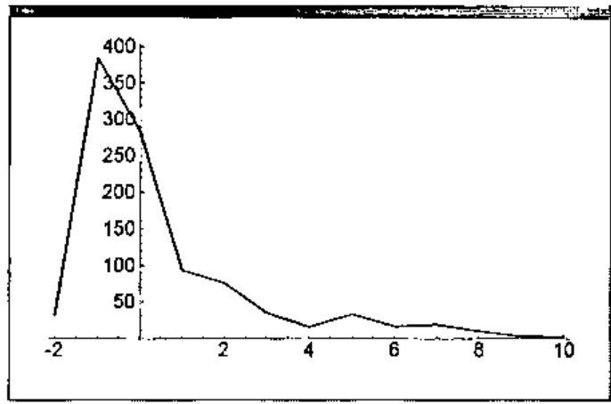
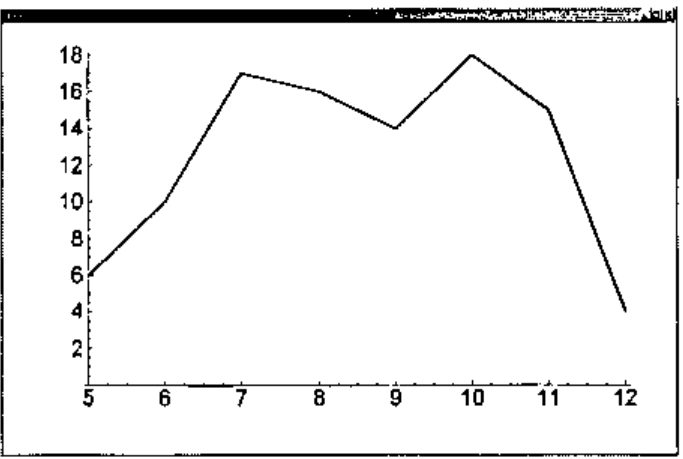

*by Cliff Reiter*
{ .byline }

We previously noted [5] that factoring integers has become a topic of intense interest because some modern security schemes depend upon the assumption that factoring the product of two sufficiently large primes is implausible [1,3,6].

In that note we developed some J facilities for finding factors. The most sophisticated technique utilized elliptic curves for factorization. We did not combine those techniques into a single function that factored integers since the problem of how to identify primes as such was not resolved in that note. We will consider a fast probabilistic method for identifying primes in this note then combine those with the facilities from the previous note to create a function that routinely gives the prime factorization for 25 digit numbers.

## Pseudoprimes and Carmichael Numbers

A classic theorem called Fermat’s Little Theorem (FLT) states that for a prime number, *p*, and a base *a* not divisible by *p*, we get *a*<sup>*p*–1</sup> ≡ 1 mod *p*. For example, since 101 is prime, the following residues must be 1.

```j
   101 | 2^100x
1

   101 | 3^100x
1
```

Since J can compute these modulo powers very efficiently if it recognizes them, we will take care to use tacit composition of the residue with the exponential.

```j
   3 (101&|@^) 101x-1
1

   fltq=: 4 : '1 = x. y.&|@^ y.-1'

   2 3 4 fltq 101
1 1 1
```

FLT only holds when the base is relatively prime to the number being tested. Thus, the following does not show that 101 is composite (it is prime).

```j
   101 fltq 101
0
```

Thus, before applying FLT one should check that the base is relatively prime to the number (if the gcd is a nontrivial factor of the number, then the number is, of course, composite).

The function `fltq` tests whether the conclusion of FLT holds for the bases given as left argument for the number given as the right argument. Many composites can be recognized by the fact that FLT fails for some base. For example, the following makes it clear (3 times) that 143 is composite, even though no factors are given.

```j
   2 3 4 fltq 143
0 0 0
```

However, 341 is also composite, but it looks prime when bases 2 and 4 are used but is shown to be composite by base 3.

```j
   2 3 4 fltq 341
1 0 1
```

When *n* is composite such that *b*<sup>*n*–1</sup> ≡ 1 mod *n* we say that *n* is a pseudoprime to the base *b*.

It is possible that *n* is a pseudoprime to the base *b* for every base that is relatively prime to *n*. Such numbers are called Carmichael numbers. There is no hope that FLT can be used to recognize *n* as composite unless a base with a common factor is chosen. Thus, FLT is no better than actually having found a factor by trial division or whatever mechanism chose the trial bases.

One Carmichael number is 6601.

```j
   2 3 4 5 fltq 6601
1 1 1 1
```

While Carmichael numbers are rare, there are infinitely many of them and 105,212 of them below 10<sup>12</sup> [1].

## MSR Test

While the FLT test fails to identify 6601 as composite unless a lucky base is chosen, there is a stronger version of the test that shows 6601 to be composite. It is known that for a prime *p*, the quadratic equation *x*<sup>2</sup> ≡ 1 mod *p* has only *x* ≡ 1 and *x* ≡ –1 as solutions. Thus, for a proposed base *a*, we compute *a*<sup>(*n*–1)/2</sup> and expect to get either 1 or -1 if *n* is prime. If *n* is prime we must. If not, we know *n* was composite. If we obtained a 1, and (*n*–1)/2 is even, we can consider *a*<sup>(*n*–1)/4</sup>. If *n* is prime, we must get ±1. We see that 6601 fails this test with base 2.

```j
   2 (6601&|@^) 6600x
1

   2 (6601&|@^) 6600x%2
1

   2 (6601&|@^) 6600x%2^2x
4509
```

In general, this process can be repeated until either a -1 is encountered, or there are no further factors of 2 to be removed from *n*-1. Re-organizing the arithmetic slightly, we get the following test.

### MSR Probabilistic Primality Test

> Suppose we factor *n* = 2<sup>*k*</sup> *m* where *m* is odd, then we compute the following:
>
> *x* ≡ *b*<sup>*m*</sup> mod *n*
>
> If *x* is not congruent to ±1 mod *n* then use squaring to compute
>
> *x* ≡ *b*<sup>2<sup>*j*</sup>*m*</sup> mod *n* for *j* = 1,2,…,*k* – 1 or until *x* ≡ –1 mod *n*.
>
> If any *x* computed is congruent to ±1 mod *n*, then we say that *n* passes Miller’s test to the base *b*. Otherwise, it fails the test to the base *b*.

Below we implement the MSR method and see that even though 6601 is a Carmichael number, it fails the MSR test bases 2, 3, and 4.

```j
   pwr2in=:3 : 0
j=.1
while. 0=(2x ^j)|y. do.
  j=.j+1
end.
j-1
)

   msr=: 4 : 0"0"1 0
b=.x.
n=.x: y.
k=.pwr2in n-1
m=.(n-1)%2x^k
x=.n&|@(b&^)m
if. 1 = x do. 1 else.
j=.0
while. (x~:n-1)*.j<k do.
  x=.n|x^2
  j=.j+1
end.
if. x = n-1 do. 1 else. 0 end.
end.
)

   2 3 4 msr 6601x
0 0 0
```

Primes pass the MSR test to every base not divisible by the prime. It is known [1] that the likelihood that a composite number passes the MSR test base *b* is less than ¼. Thus, if it passes the MSR test to *s* bases, we consider it prime with the high level of confidence. The likelihood of an error is less than (¼)<sup>*s*</sup>. It is conjectured that all odd composite integers have a base *b* < 2ln<sup>2</sup>(*n*) for which the Miller test fails. We will consider an integer prime if it passes Miller’s test for bases consisting of the first 100 primes. If higher reliability is desired, it is easy to raise the number of bases to 2ln<sup>2</sup>(*n*) or higher.

Moreover, there are other probabilistic tests for primality that are of complexity comparable to Miller’s test and that give further reassurance of the primality of *n*. See the discussion of Fibonacci and Lucas pseudoprimes in [1].

The following gives and illustrates our probablistic primality test.

```j
   primeq=: 3 : 0"0
100 primeq y.
:
b=.p:i.x.>.3
if. y. e. b do. 1 return. end.
if. -.*/(2{.b) msr y. do. 0 return. end.
*/(2}.b) msr y.
)

   primeq 2 4 101 6601
1 0 1 0
```

Now we turn to the function that puts together the factorization techniques from [5].

## Factoring

We have seen factorization techniques that are effective at finding factors of numbers with up to around 25 digits reasonably quickly. The techniques discussed in that note included the following.

- Trial division, which we used to find small prime factors; typically including primes up to 100.
- Pollard *p*-1, often good for quickly finding small factors; we used it to find easy factors with a few digits.
- Pollard rho, also often good for finding small factors; takes somewhat longer and may find somewhat larger factors.
- Elliptic curve factorization; good for larger factorizations but may take minutes as opposed to seconds for factors with a dozen digits.

Here we factor integers by first removing small factors, using trial division. The result is organized into two lists: one of prime factors and the other of unfactored terms. We use `primeq` to identify factors that are prime and which should be moved to the list of prime factors. While the list of unfactored composite terms is non-empty, we try to factor its first element. We apply Pollard *p*-1, then Pollard rho and then the elliptic curve method.

```j
   factor=: 3 : 0"0
'ps fs'=.fac_smpr y.
if. fs=1 do. fs=.i.0 end.
q=.primeq fs
ps=.ps,q#fs
fs=.(-.q)#fs
while. 0<#fs do.
  f0=.{.fs
  'g v'=.fac_p_1 f0
  if. g e. 1,f0 do.
    'g v'=.fac_rho f0
    while. g e. 1,f0 do.
      'g v'=.2{.>{.fac_ecmj f0
    end.
  end.
  fs=.(}.fs),g,f0%g
  q=.primeq fs
  ps=.ps,q#fs
  fs=.(-.q)#fs
  end.
/:~ps
)
```

We illustrate this function by factoring a random integer.

```j
   ]x=:randi 25
9213861633415859519415244

   factor x
2 2 307 26821 17977907 15560703359
```

A script containing the definitions of all these functions is available at [4].

The function `factor` is reasonably efficient. When we factored a thousand random 25 digit integers we found the median time was around 0.5 seconds while the average was near 8 seconds. Only a few factorizations were “hard”; the hardest factorization took 540 seconds. Timings were done on a 750 MHz PC using J5.01b [2].

If we take the ceiling of base 2 logarithm of the time in seconds to factor, we get the following distribution.

```j
   $x=:randi 1000#25

   fac_time=:3 : 0"0
t=.time 'z=:factor y.'
t;z
)

   $zz=:fac_time x
1000 2

   |:({.,#)/.~>.2^./:~>{."1 zz
_2 _1   0  1  2  3  4  5  6  7  8 9 10
31 384 283 94 76 35 15 33 16 18 10 3  2
```



**Figure 1. Number of times log<sub>2</sub>(t) seconds were used to factor 25-digit random integers among 1000 trials.**

We see that a majority of the factorizations required less than one second. We now look at a “hard”, 27-digit, factorization problem and run it 100 times. We get the following distribution, again taking the ceiling of the base 2 logarithm of the time in seconds.

```j
   mm=:152415787533657061564561727x

   factor mm
1234567890133 123456789012419

   $ww=:fac_time 100#mm
100 2

   |:({.,#)/.~>.2^./:~>{."1 ww
5  6  7  8  9 10 11 12
6 10 17 16 14 18 15  4
```

Figure 2 shows that distribution. It turns out that the fastest factorization time was 20 seconds and the longest was 3000 seconds. The median was 286 seconds and the average was 540 seconds.



**Figure 2. Number of times log<sub>2</sub>(t) seconds were taken to factor a “hard” 27-digit integer from 100 trials.**

## Conclusions

We see that we can efficiently decide the primality of large integers with high reliability. Techniques for finding nontrivial factors include Pollard *p*-1, Pollard rho, and elliptic curve factorization. Implementing and combining those techniques in J leads to a factorization function that is quite effective on 25 digit numbers and is often effective for larger numbers.

## References

1. R. Crandall and C. Pomerance, *Prime Numbers: A Computational Perspective*, Springer, New York, 2000.
2. Jsoftware, J501b, *http://www.jsoftware.com*.
3. C. Reiter, With J: Public Key Crytography, *APL Quote Quad*, 32 2 (2001) 21-24.
4. C. A. Reiter, Elliptic curve factoring script, *factor_ecj.ijs*, *http://www.lafayette.edu/j/vector/index.html*.
5. C. Reiter, With J: Elliptic Curves and Factoring I, *APL Quote Quad*, submitted.
6. R. L. Rivest, A. Shamir, and L. Adlemen, A method for obtaining digital signatures and public-key cryptosystems, *Communications of the ACM*, 21 2 (1978) 120-126.
