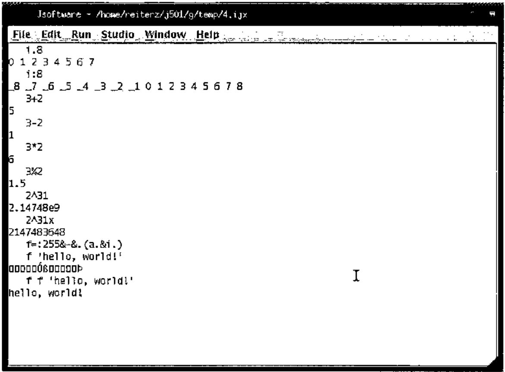
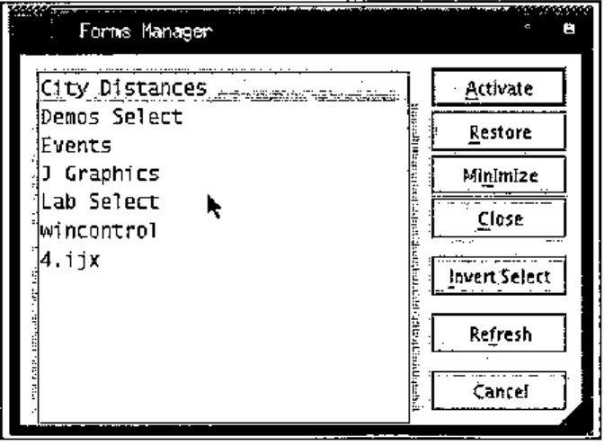
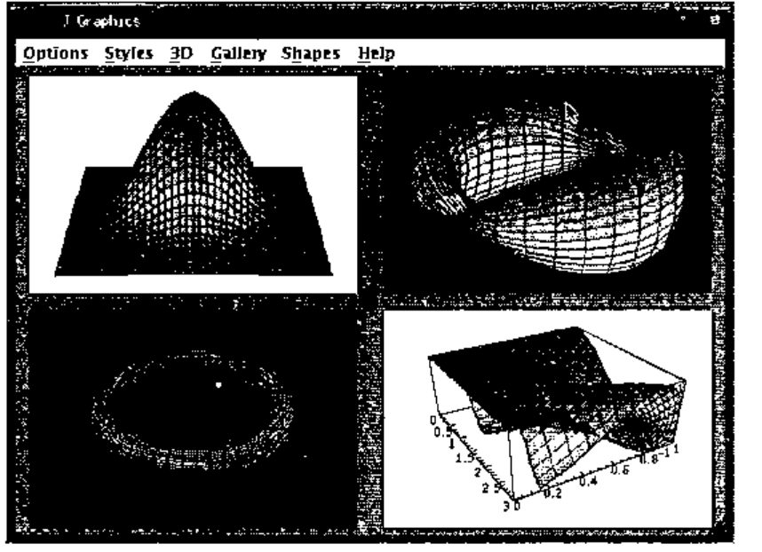
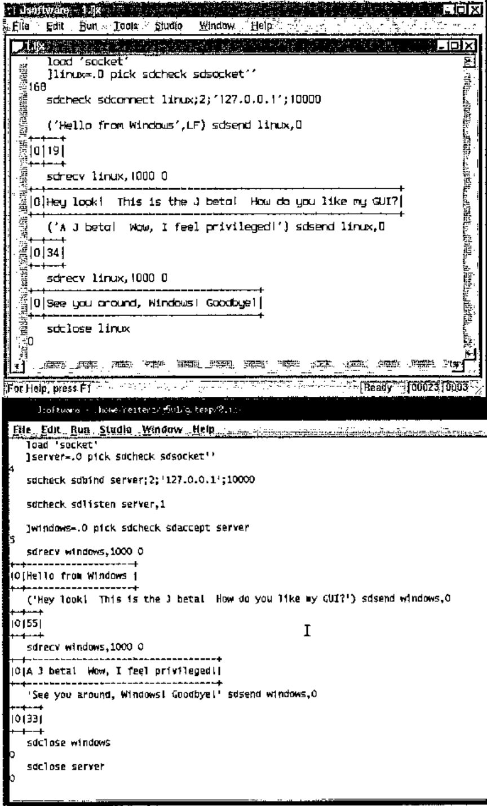
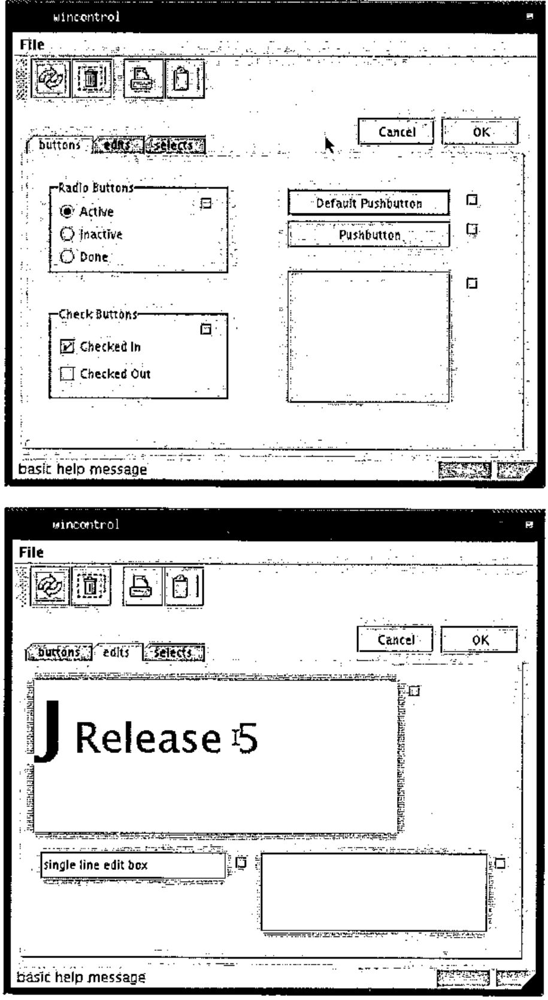
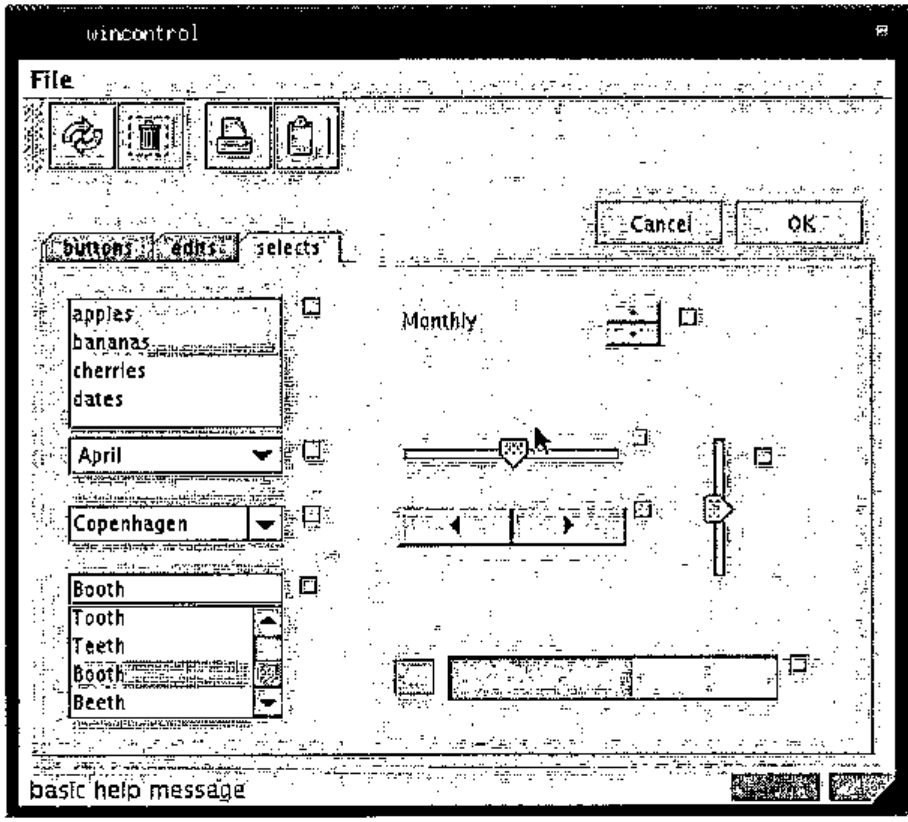
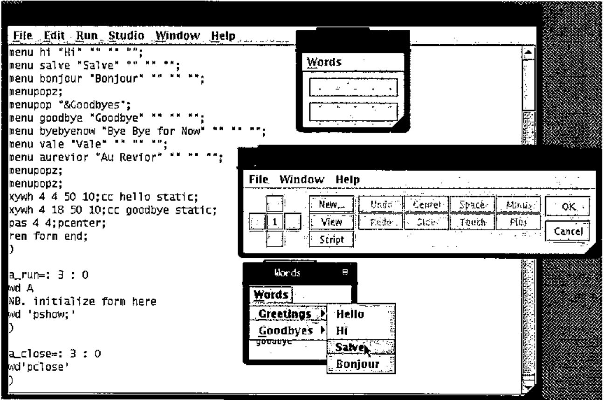

*reviewed by Zach Reiter*
{ .byline }

For those who have not seen the announcements on the J Forum, J for Linux finally has a GUI (Graphical User Interface). The new J 5.01 Beta h [1] available for Linux has a Java GUI. Of course, this is a beta and many details are likely to change before you read this. However, it still seems worthwhile to look ahead to the dramatic changes coming. Because J 5.01 Beta h will be outdated by the time you read this, please watch the J Forum and/or JSoftware website for updates. This new Java GUI, while currently only available for Linux, will eventually be available on all J platforms, extending J’s cross-platform commitment to the GUI and to GUI programming.

The J interface is quite different from the interface J for Windows users are accustomed to. The most noticeable change is the change from the MDI to SDI (Multiple/Single Document Interface), as can be seen below. This change allows for more complicated window arrangements.



Basic J commands listed here as executed in the session manager of the new beta.

```j
   i.8
0 1 2 3 4 5 6 7
   i:8
_8 _7 _6 _5 _4 _3 _2 _1 0 1 2 3 4 5 6 7 8
   3+2
5
   3-2
1
   3*2
6
   3%2
1.5
   2^31
2.14748e9
   2^31x
2147483648
   f=:255&-&.(a.&i.)
   f 'hello, world!'
   f f 'hello, world!'
hello, world!
```

The menus generally resemble those of the Windows, with most of the changes due to the unavailability of features. Most strikingly, there are no Cut/Copy/Paste options under Edit. These are nowhere to be found in the menubar, although Ctrl+X/C/V work as expected. Traditional X-style copying and pasting is fully present; when selecting, the selection is not copied until it is unselected, rather than the expected continual re-copying. This can then be pasted using the middle mouse button, either into J or into another X-compatible application. The Window menu does not list the windows as is common under MDI applications, but instead there is a Forms Manager, which is a quite effective replacement.



Not only does the Forms Manager list the edit windows that are open (as the Window menu did), it also lists all of the user created windows. From here windows can be minimized, restored, or closed. The Studio menu still lists the labs and demos options. The Lab Author is currently missing, as of beta h.

J still presents much of its full set of features. Many features have been rolled over from both J 4.05 for Linux and J 4.06 for Windows. OpenGL is not yet supported, but plot functions quite smoothly.



Printing was recently added to beta’s list of features, it runs as expected (I now have a copy of the ‘Surface of Revolution’ from plot sitting on my desk). Memory mapped files continue to function as implemented under J 4.05 Linux. Sockets continue to function, and through the use of WINE [2], it is possible to have J 4.06 for Windows and J 5.01 beta h communicate on the same machine (see below).



J offers a large set of its GUI controls; these can be seen in the controls demo, as shown below.





This beta includes the form editor and console. The form editor closely resembles that of Windows; unfortunately, it is painfully slower at the moment. The menu editor functions as expected, toolbars are not supported, but status bars are. Dragging controls is virtually impossible, because the screen is redrawn so infrequently. Resizing controls does not appear to function at the moment. Nonetheless, it provides a tool for composing the basics of a form; the details are easily worked out in the script window. The console remains familiar; J 4.05 Linux users will feel at home. The profile.ijs for beta h reveals much greater planned and implemented cross-platform support; it is reasonable to expect that shortly these details will no longer be left to the programmer.

However, as can be both expected and tolerated with a beta level product, there are some areas which need to be smoothed out. Scripts written for Linux will require some modifications to run smoothly under the beta; scripts written for Windows will require some slightly more significant modifications to run smoothly. In transferring from Windows to Linux, there many other issues, many of which are independent of J. There is no isipicture control under the beta, as there is under the J 4.06 Windows GUI. There are a number of minor GUI nuisances which persist: a freshly opened file always appears in the upper-left corner of the screen and is always scrolled all the way to the bottom; selecting run->window on the IJX window, runs it (which is probably NOT what you meant to do…).



J 5.01 Beta h is just that, a beta. There are many features which do not function at 100%; there are many features which do. I think it is important to recall that many of the features currently missing were added a few at a time, over the course of the 4.0x series. Iverson Software is continuing their tradition of excellence; the release of J 5.01 stable is definitely an event to look forward to.

## References:

[1] JSoftware, http://www.jsoftware.com

[2] WINE, http://www.winehq.org/
