*by Johann Riebenbauer and Joachim Hoffmann*
{ .byline }

## Abstract

In this paper we present a program for the design and analysis of planar member frame structures. The intuitive graphic user interface covers all steps necessary for designing a load bearing structure, from geometry design to system optimisation.

This project is the first step in converting from a pool of APL\*PLUS II programs towards interactive Windows applications written in *DyalogAPL/W*, and was carried out by Dipl.-Ing. Johann Riebenbauer, Institute of Structural Design (Institut für Tragwerkslehre) at the Technical University of Graz, Austria, and the Group of Civil Engineering (IG für Bauwesen) Zenkner&Handel.

The computational section of the described application is composed of proven space frame algorithms, which where developed by Prof. Peter Klement over the last three decades in APL, and which represent the backbone of the new graphic user interface (GUI) in *DyalogAPL/W.*

(In the Appendix the reader can find a small vocabulary, which can be used to translate the German words in the illustrations.)

## Interactive Design of Structures

### Introduction

This software for the design and analysis of planar member frame structures was the central part of Johann Riebenbauer’s MSc thesis, awarded by the Institute of Wooden Constructions (Institut für Holzbau) of the TU Graz. The main emphasis was not on the determination of the internal forces of members or deformations, but on the organisation and handling of data before and after the calculation (pre- and post-processing of the system). Restriction to planar structures was only imposed by the GUI, all the computational functions in the background are designed to work with 3D-frameworks. Future versions of the GUI will also work with space frame structures and area covering structures.

During program design, priority was given to the development of a single interactive and intuitive application-GUI and not a conventional program, which usually consists of three parts, namely preprocessor, calculation processor and finally postprocessor.

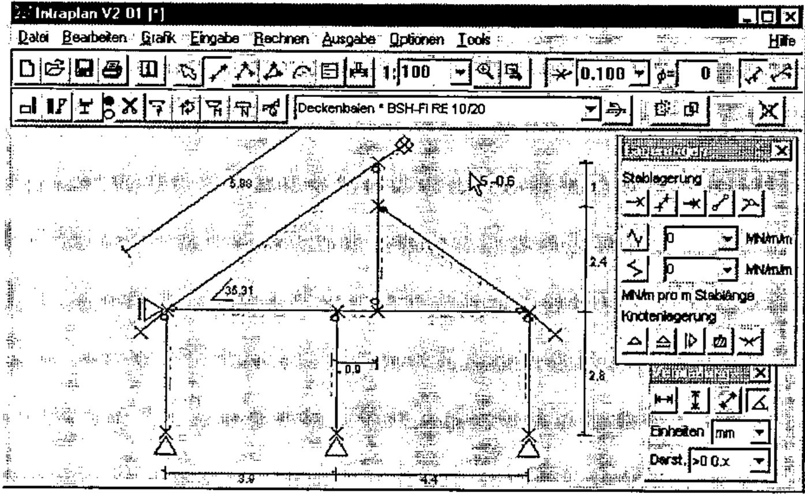

Figure 1: Display of a system (a house) with supports and measurements
{ .caption }

Each action of the user is displayed immediately on the screen in a clear fashion - following the Windows philosophy "What You See Is What You Get". Input errors are verified immediately, and not only after computations or in the form of a system crash. Special errors are documented with informative error messages. Help and guidance is also provided by a standard Windows help file.

### Motivation

The various processes when dealing with structural problems, e.g. system geometry design, assumed load design, dimensioning, calculation of system forces, interpretation of results, design of individual frame elements, presentation of significant results for further processing, etc. are more or less automated in the everyday life of a civil engineer. With the development of new European Standards (Euro-Codes) continuous automation of all processes will be increasingly important.

This program will only be used in practice by constructing engineers (e.g. for small problems like a single-span beam), if it is simple and user-friendly.

The GUI takes into account various habits of engineers, but it does not impose a fixed way of working on them. Automation must not restrict, but has to support the working process at maximum. Therefore this GUI is designed similarly to the manual calculation on paper and follows the concepts of modern text-processors or spreadsheet programs.

### System Design

The input of a system with all its definitions of hinges, supports is the most important, but also a highly time consuming part of the analysis of structures. Here, personal experience plays a major role. Also, checking the correctness of data input is of significant importance.

A CAD application could be considered a solution, but there is a significant difference between engineering a load bearing structure and drawing a sketch.

This GUI is developed specially for the input and handling of structural systems. The possibility of drawing a system by hand (with the mouse) makes it very easy for a non-CAD designer to design his member frame quickly. Structures can be designed without entering any numbers. With only a few, but effective operations, frameworks can be designed in a fashion similar to drawing on a sheet of paper by hand. Traditional preparations, e.g. system sketch and co-ordinate tables, are superfluous.

The structure on the screen can be changed in any way, e.g. translated, copied, scaled, deleted, etc., whereupon all relevant properties of nodes and members are changed automatically. Individual members and nodes can be marked with the mouse and can be assigned properties, which are again immediately displayed in graphical form. This makes it simple to detect input errors when they occur.

For the construction of circular arcs, parabolic curves, trussed girders, or simply for partitioning a member into equal parts, node-generation-aids are provided. These facilities can be extended to more complex structure-generators by the user.

### Specification of Cross-Sections

For a realistic design of structures, which normally consists of different materials and member cross-sections, a separate dialogue box is provided. In this dialogue, all the relevant materials and cross-sections can be specified and given names similarly to the format-style concept in popular text processors. These specifications can then be assigned to individual members or groups of members by simply selecting them with the mouse and choosing a "member-style-name" from the member specifications dialogue. To distinguish different cross-sections, upper surfaces, lower surface and different materials can be displayed in different colours. The cross-section itself is also displayed in correct scale in the member specification dialogue (please see the form labelled with "Stabangaben"). In addition, predefined cross-sections (HEA, HEB, etc.) can be used.

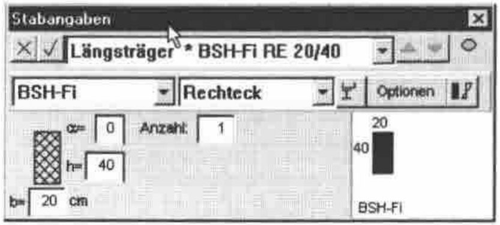

Figure 2: Member specifications with outlined cross-sections
{ .caption }

The cross-section values are converted internally to a single reference material. There is no need to calculate moments of inertia or areas by hand.

The integration of QS-WIN is planned for a later version. QS-WIN is a separate (DyalogAPL/W) program for the calculation of the properties of cross-sections with general outline and dimensions.

### Loading the system

The process of loading the structure has been carefully analysed and automated. Due to the new and complex CEN standards effective automation has become necessary.

Each load case is given a name, which will be used in further processing. Recurrent and composed load cases can be produced automatically, e.g. the min-max-superpostion of different traffic load cases (where the single load case is not of interest) is defined under a single name, and the calculation and superposition of the subordinate load cases is done automatically by the program.

This also applies to snow and wind stresses. In the case of snow, even asymmetric position of loads are taken into account.

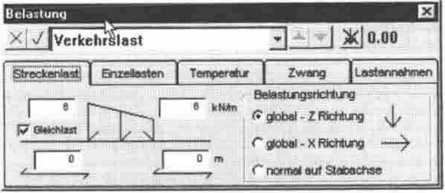

Figure 3: Definition of different load cases
{ .caption }

Special algorithms for crane loads and traffic loads have been developed. The algorithms solve these problems by defining load groups or load bands. This simplifies everyday work significantly. The definition and assignment of stresses to individual members or nodes works similarly to the member specification dialogue. The user marks several members or nodes and puts the load onto them by selecting a load name from the load case dialogue.

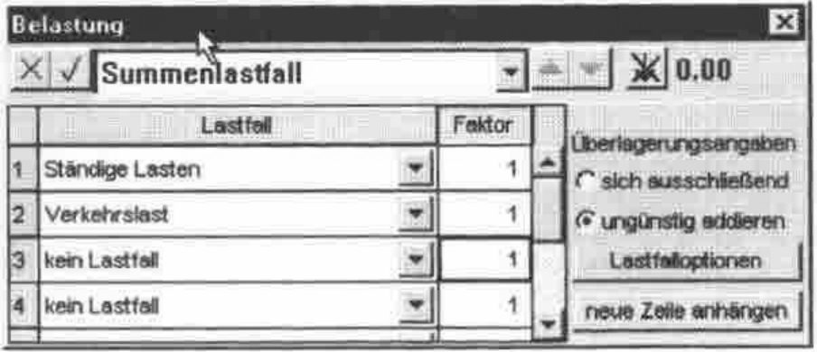

Figure 4: Definition of load case superposition
{ .caption }

Of course, superimposing individual load cases is possible. Also, the prerequisites to perform calculations following the European structural standards (Euro-Codes), which requires the superpositions of a variety of load cases, are provided. These automated options are of special interest, because they make the many load cases required in the Euro-Codes easy to manage.

### Display of Results

Internally the separate load-cases and corresponding internal forces are superimposed, however on the screen only significant min-max-values of different types of internal forces are displayed. This is necessary for a clear display of results. In most cases such an overview, displaying the quality of results is sufficient in practice.

If more exact quantities of a result are needed (e.g. absolute values of a deformation curve), a scissors function is provided. The user simply cuts an arbitrary element of the structure with a scissors cursor and the values are displayed on the screen. Furthermore, a similar function exists to determine the stresses and internal forces of a selected cross-section, which serves to check the former cross-section dimensioning.

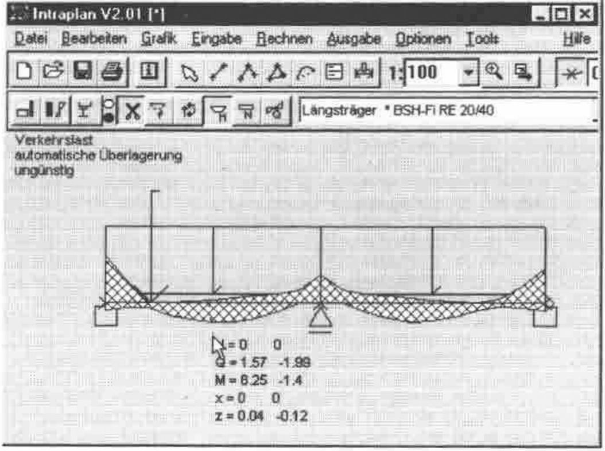

Figure 5: Min-max superimposed moment curve
{ .caption }

Internal forces can be displayed not only for selected members, but also for predefined member groups. With a standard zoom function special areas can be viewed in detail. The values of support reactions and elastic support forces can be displayed and measured with the mouse (see Fig. 5).

### Design of Individual Structure Elements

Of course, it is possible to design and optimise individual cross-sections in detail, according to various standards. Using the "Extended Member Specification Dialogue" (See Fig. 6), the following properties of cross-sections can be defined: load factor, planar and 3D-buckling length (at the moment following only the equivalent beam method), variable girder depth, special superposition specifications, bent girder axis, etc.

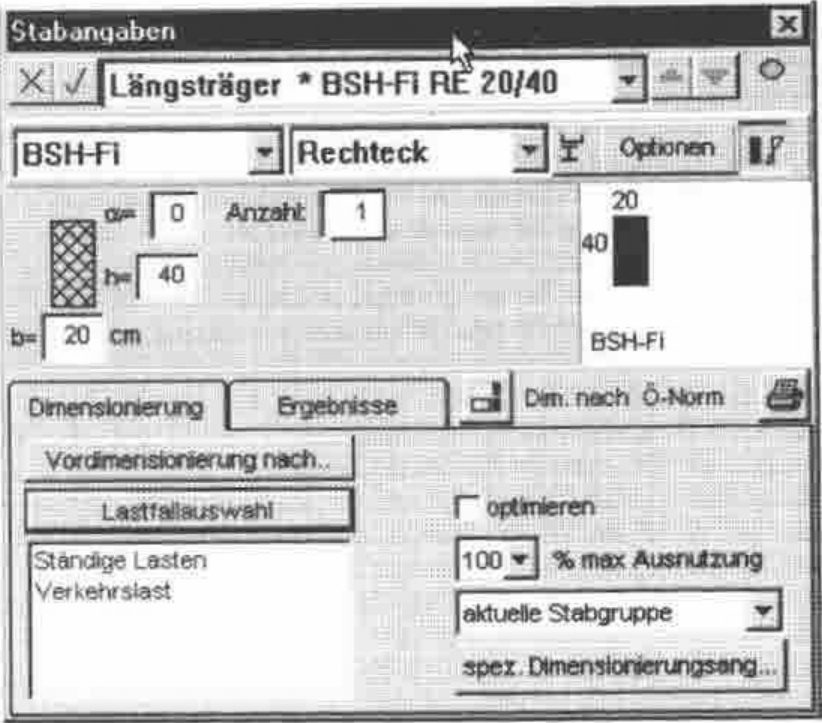

Figure 6: Dimensioning specifications
{ .caption }

The next important step is the interpretation of results and the possibility to alter design specifications in a very simple way, in order to optimise the structure. This applies to system geometry, cross-sections, supports and subdivisions of members. The design results are visualised by showing the load factors of all member groups (see Fig. 7) and the curves of load factors over the members themselves (see Fig. 8).

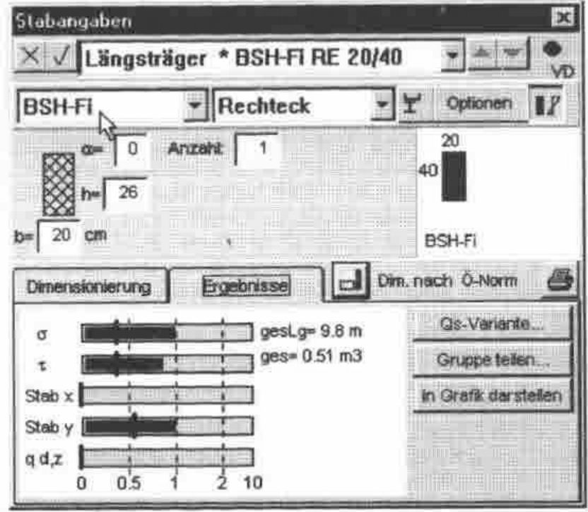

Figure 7: Load-factors of the selected members
{ .caption }

Furthermore the average load factors weighted over the length of the members is displayed, so that it is convenient to judge load factors of whole member groups.

As mentioned above, it is also possible to dimension cross-sections by specifying internal forces, buckling lengths and member lengths.

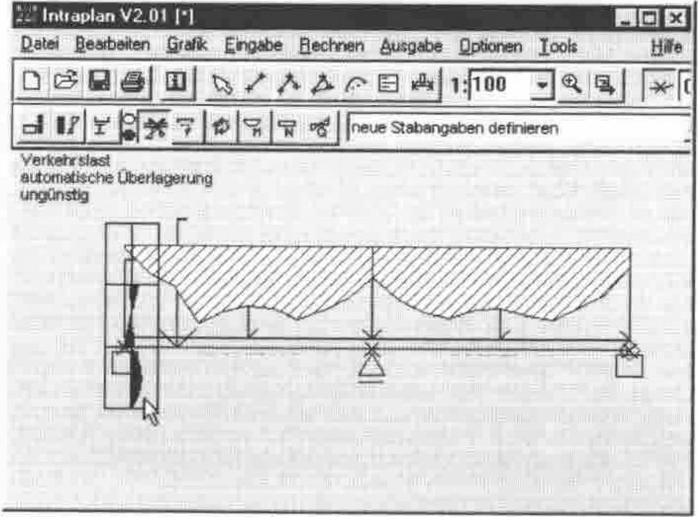

Figure 8: Load-factors of the max-loaded section
{ .caption }

In the system graphic, the distribution of load factors is displayed over the member lengths. A large crosshatched area over a member indicates that this member is not stressed to its capacity (Fig. 8). Ineffectively used members are therefore detected immediately. The program automatically suggests optimised cross-section specifications, displayed in the relevant edit windows, in order that the user can accept them directly with one keystroke, but can also change them as required.

Finally all the results can be printed in graphical and numerical form.

### Final Remarks

The aim of this program is to provide an intuitive graphic user interface for the complete treatment of load bearing structures, starting from defining the geometry and loads leading to a clear presentation of results on the screen and on the printer. In the near future, a Structure Viewer will be released, which will only display and print existing data from file, so that structures can be interchanged electronically.

## Acknowledgments

**Peter Klement**, Prof. Emeritus at the Institute of Structural Analysis (Institut für Baustatik) at the Technical University of Graz, Austria, is a well known structural engineer in Europe and APL pioneer in Austria.

**IG Zenkner&Handel** is a specialist civil engineering company, which specialises in structural calculations, e.g. dynamic analysis, huge roof constructions with large deflections, etc.

Dr. Günther Zenkner and Dr. Erich Handel are constantly developing and marketing several structural analysis software packages written in APL\*PLUS II and DyalogAPL/W, whose theoretical foundations were laid during ten years of research work as research assistants at the Institute of Structural Analysis under Prof. Klement. *Intraplan* is under copyright of IG Zenkner&Handel.

## The Authors

Dipl.-Ing. Johann Riebenbauer is a research assistant in the department of Structural Design at the TU Graz, Austria. He is working on the research and development of constructive timber components of wooden frame structures and he is implementing his research results as DyalogAPL programs, which are ready for use in practice.

Joachim Hoffmann is a student of Physics at the TU Graz, Austria, who is increasingly working as an independent consultant and distributor for DyalogAPL, Causeway and J.

## Appendix A: A short comic strip describing a typical structural design of a wooden house

Input of the system with measurements and support definitions:

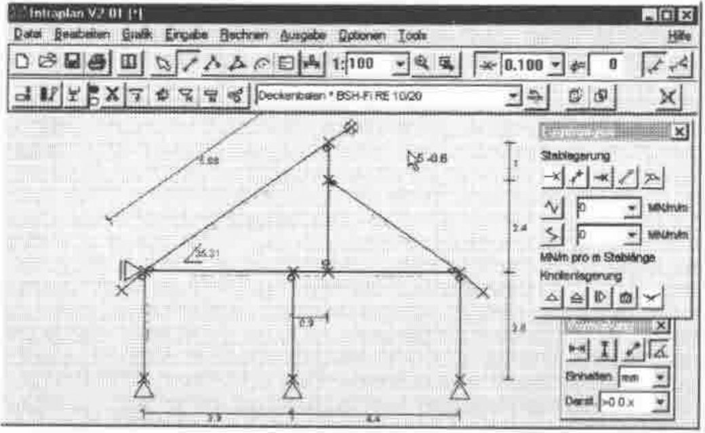

The assignment of member specifications: To each member a cross-section is assigned.

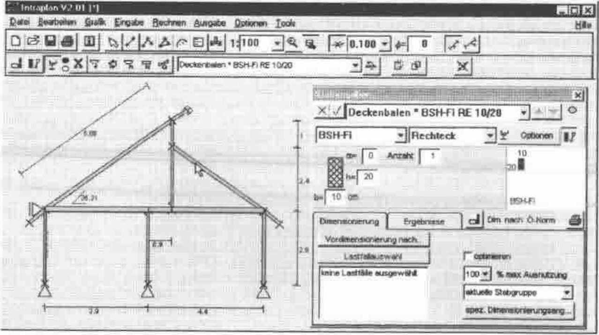

The definition of loads: Traffic loads (e.g. the people in the building), snow loads, and wind loads:

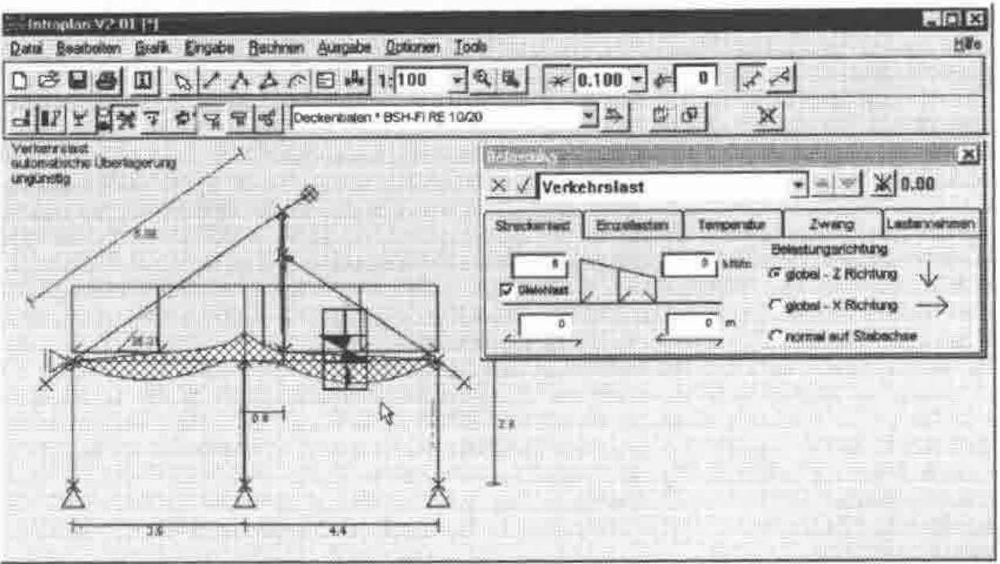

The optimised load bearing structure:

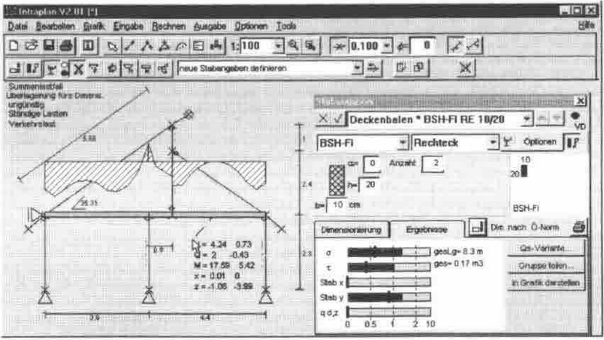

## Appendix B: German-English Vocabulary

| German | English |
|---|---|
| Ablauf | process, mechanical operation or action |
| Abschnitt | section, portion, part |
| Abteilung für Holzbau | department for wooden construction |
| allgemein berandeter Querschnitt | general outlined cross-section |
| Annahme | assumption |
| Anzahl | number |
| Auflagerreaktion | support force or reaction |
| Auflagerverschiebung | buckling settlement |
| Auflagerwiderstand, -reaktion | reaction |
| aufskizzieren | sketch out |
| aufwendig | costly, expensive in labour |
| aus Gewohnheit | from (sheer) habit |
| Ausgangssituation | starting position, motivation |
| Ausnutzungsgrad | load factor |
| Ausschrift | display, presentation |
| Automatisierung | automation |
| Bauteil | component, device, construction element |
| Bauwesen | building trade |
| Beanspruchung | load, stress, strain |
| Beanspruchung auf Biegung | work done on bending |
| Belastung | loading, load application, stress |
| bemessen | dimension |
| Bemessung | dimensioning |
| Berechnung | computation, calculation |
| Berechnungsablauf | calculation method or operation |
| Berechnungsergebnisse | calculation results |
| besondere Aufmerksamkeit schenken | to pay attention to |
| Dimensionierung | design, dimensioning |
| Dipl.-Ing. | chartered engineer (GB), professional engineer |
| Dissertation | PhD thesis, MSc thesis (Master of Science) |
| ebener Rahmen | (flat) frame |
| ebener Verformungszustand | plane strain |
| ebenes Rahmentragwerk | plane frame structure |
| ebenes Tragwerk | plane structure |
| einbinden | integrate, include |
| Einzellastfall, Einzellast | point load |
| Ergebnisausschrift | results table |
| ermitteln, bestimmen (nachweisen) | determine (detect) |
| Ermittlung | determination |
| Ersatzstab | transformation member |
| Ersatzstabverfahren | equivalent beam method |
| etw. immer wieder tun | to keep on doing something |
| Fachwerkträger | truss (-ed girder), framework truss |
| Federkraft | elastic support, elastic force |
| Fichte | spruce, whitewood |
| freihandkonstruieren | freehand constructing |
| gekrümmt | bent |
| Gelenk | hinge |
| Gelenkknoten | hinged point, hinged connection |
| Generierhilfen | generating aids |
| Gewohnheiten | habit, to have a habit of doing something |
| halbvoll | half-filled |
| Holzbau | wooden construction |
| Holzbauteil | timber (structural) elements |
| immer wieder | again and again |
| immer wiederkehrend | recurrent |
| Ingenieursalltag | the everyday life of an engineer |
| Interessensgemeinschaft | interest group, syndicate |
| Knicklängen | buckling length |
| Koordinatenlisten | co-ordinate tables |
| Kranlast | crane load |
| Kreisbogen | circular arc |
| Lager, Auflager | support |
| Lagerbedingung, Auf~ | support condition |
| Lagerung | support |
| Längeneinheit | unit of length |
| Längsträger | longitudinal girder |
| Lastananhmen | (assumed) design load |
| Lastaufbringung | load application, application of load |
| Lastband | field of load, load band |
| Lastfall | load(ing) case |
| Lastfallüberlagerung | load case superposition |
| Lastlinie | load line |
| Lastverteilung | distribution of load |
| LKW-Lasten | truck load |
| min-max Überlageung | min-max superposition |
| Oberkante (eines Trägers) | top surface |
| Parabelbogen | parabolic arc or curve |
| praktisch | practical, useful, in practice |
| Querschnitt = QS | cross-section, cross-section profile |
| Querschnittsangaben | cross-section properties, specifications |
| Querschnittsannahme | cross-section estimation (assumption) |
| Querschnittsfaktor | form or shape factor, cross-section factor |
| Querschnittsfläche | cross-sectional area |
| Querschnittskonturen | contours (outlines) of cross-section |
| Querschnittswert | cross-section value |
| Querspannung | transverse stress |
| Quersteifigkeit | transverse rigidity |
| Rahmenprogramm | frame program |
| räumliches Tragwerk | space frame structure, three dimensional frame |
| Referenzmaterial | reference material |
| Schätzung | estimation |
| Schere | scissors |
| Schneidefunktion | intersection function |
| Schnittkraft | internal force |
| Schnittkraftbilder | internal force diagram |
| Spannung | stress, tension |
| Stab | member, bar, element |
| Stabangaben | member specifications |
| ständige Lasten | permanent loads |
| Statiker | engineer engaged in structural calculations |
| Statikverarbeitungsprogramm | structure processing program |
| statische Problemstellung | structural way of looking at a problem |
| Streckenlast, Linienlast | linear load |
| Summenlastfall | cumulative load case |
| Systemfindung | developing a system design |
| Systemskizze | sketching |
| Träger | beam, girder |
| Trägerhöhen, veränderliche | variable girder depth |
| Trägersystem | girder construction, structural system |
| Traglast | limit load |
| Tragstruktur | supporting structure |
| Tragwerk | load bearing structure, supporting framework |
| Tragwerksplanung | design of frameworks or structures |
| Überlagerung | superposition, (awkward and) involved |
| Überlagerungsangaben | superposition details (specifications) |
| umständlich | laborious |
| ungünstige Überlagerung | worst case superposition |
| Unterkante | lower surface |
| Verarbeitung (DV) | processing |
| Verformung | deformation, deflection |
| Verkehrslastfall | traffic load |
| Vermaßung | measurements |
| verwalten | manage, conduct, maintain |
| Verwaltung | administration, organisation |
| Vordimensionierung | preliminary dimensioning |
| Vorgang, Prozess | process, action |
| Vorspannung | preload |
| Weiterverwendung | further processing or manipulation, subsequent treatment |
| Windbeanspruchung | wind stress |
| Windbelastung | wind load |
