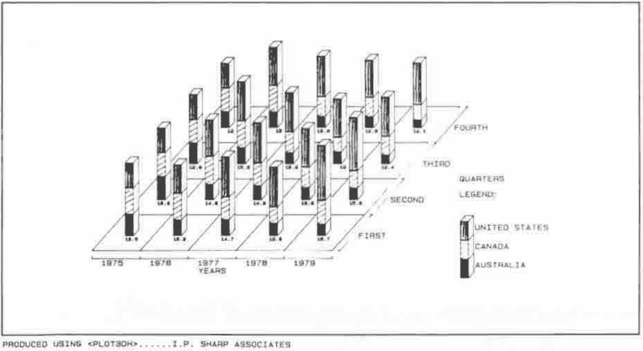
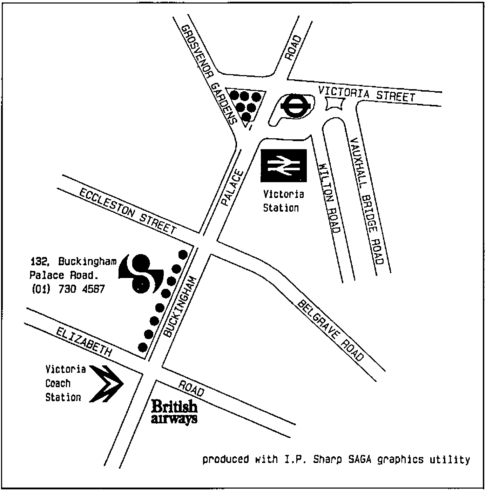
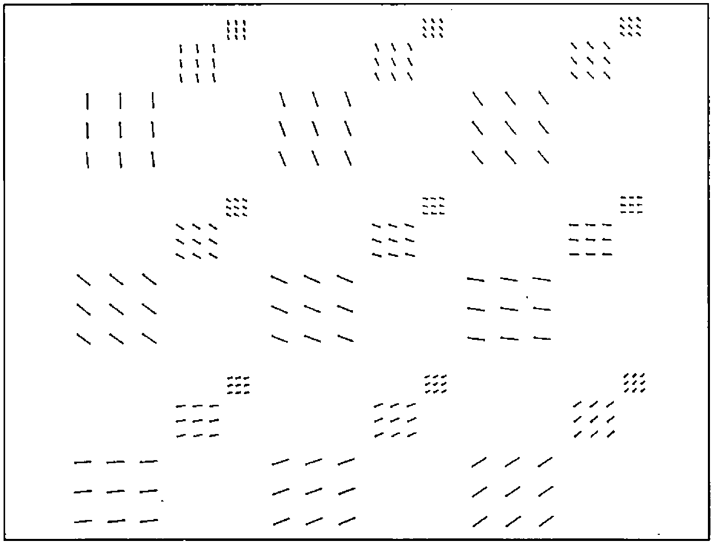

by Graeme Robertson
{ .byline }

Many graphics packages written in APL have appeared on the I.P. Sharp Associates system over the last seven years. Their capabilities are indicated in some forty slides prepared on a flatbed plotter using software packages SUPERPLOT, SAGA, DRAWMAPS, ROUTEMAPS, STARMAP, DRAWNET, PLOT3DH, PRISMPLOT, PICTURES and GRAPHICS.

A close analogy exists between the vector algebraic approach of APL notation and that of GRAPHICS, the inspiration behind these other packages.

GRAPHICS is used to represent APL arrays of different ranks. Lines are generated which represent real and complex numeric vectors. Surfaces are generated which represent real numeric matrices. Solid wireframe lattices are used in the representation of three and four dimensional arrays. Finally, all these attempts are abandoned in favour of a recursive definition which can in principle yield a visual representation of a real or complex numeric APL array of any rank whatever.

These results were exhibited in the seminar using twenty colourful slides. Arrays which are generated as the results of APL functions give very pleasing images which, it was argued, can be used to help students to understand the nature of complicated mathematical functions.

## Structure of the Seminar

1. An Overview of Computer Graphics
    - 1.1 A definition of Graphics
    - 1.2 A cursory history of computer graphics
    - 1.3 Application areas
2. From Business Graphics to Art
    - 2.1 Towards Graphical Representations
    - 2.2 Business Graphics
    - 2.3 Into 3-D
    - 2.4 Art
3. APL and Graphics
    - 3.1 Graphic Variables
    - 3.2 Graphic Primitive Functions
    - 3.3 A Graphic Operator
    - 3.4 Graphic APL-like Utility Functions
4. Representations of Numeric Data and Functions
    - 4.1 Result Rank 1
    - 4.2 Result Rank 2
    - 4.3 Result Rank 3
    - 4.4 Result Rank 4
    - 4.5 Arbitrary Rank

*Fig.1 — Greek Domestic Light Transport Flights for May 1983*

*Fig.2 — Total Reserves minus Gold (Billions of U.S. Dollars)*

*Fig.3 — I.P. Sharp Associates London Office Location*

*Fig.4 — Computer Aided Instructions Using Graphics*

*Fig.5 — Set of Typefaces*

*Fig.6 — Rank Five Complex Array*

