by G. D. Robertson
{ .byline }

**Socrates:** Salutations Meno! What brings you here today?

**Meno:** O Socrates [1], hello master. Can you pacify my troubled mind please. I have been talking to Protagoras about Rationalized APL[2] and neither of us can see how this notation could help us to understand why the gods have placed us here.

**S:** Does Greek help you in this respect Meno?

**M:** We agree that it does sir.

**S:** Then is it not proper that A Programming Language, sharpened by mathematical thinking, and resting firmly upon precision in interpersonal communication, likewise should contribute to that noble goal: and that in no small or shallow degree?

**M:** It is proper sir: but how?

**S:** If APL is to help in the explication of nature, we must begin with physical facts. Tell me an interesting fact Meno.

**M:** I have heard a very strange report. It isn’t an article of faith required by the temple and the oracle at Delphi hasn’t said it either.

**S:** What is it Meno?

**M:** Well, Achilles [3], as you know, can run very very fast. He claims that if he measures how fast a light beam from a fire moves by him when he is at rest, and then again measures another beam from that fire when he is running at full speed towards it, he gets exactly the same result, C, where

```
C←871126392 ⍝ MILES PER HOUR
```

He says that the speed of light is always the same, no matter how fast he runs either towards the light or away from it. His tortoise friend also gets the same result when Achilles moves at different speeds holding a candle. In one hour a light beam always travels a length equal to 871,126,392 miles in any frame of reference at rest or uniformly moving with respect to the Earth.

```
'FACT'⊢C=871126392 ⍝ C IS THE RESULT OF A MEASUREMENT
```

**S:** Crikey! That is indeed remarkable Meno. We should more readily give credence to immediate experience of nature and its natural interpretation than to the most cogent a priori deductions. Therefore, trusting Achilles, let us accept this observation as fact.

**M:** If you say so master.

**S:** Not because I say so Meno, but because the fact has been verified by Achilles’ experience and we can’t run fast enough to corroborate it. How do you define length Meno?

**M:** Well: Pythagoras [4] said that the length of the hypotenuse of a right angled triangle squared is equal to the sum of the squares of the other two sides.

**S:** Express that in APL please and draw a diagram.

**M:** OK. In two dimensions, a Democritean [5] atom at point P has a position described exactly in APL by the two element vector

```
P←X1P,X2P
```

and the length of the line from the origin to P is

```
(+/P*2)*÷2
```

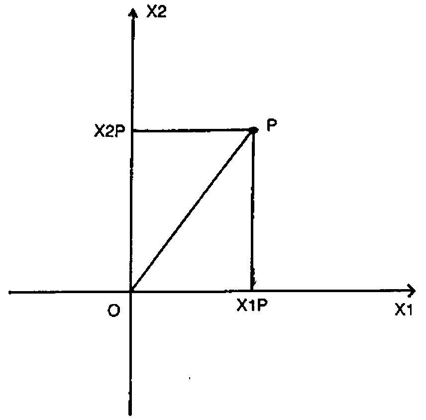

**S:** I see. So for any atom in this two dimensional space, given your stationary system of reference, you can define a function which determines the length of the line joining the origin of the reference frame and the point occupied by the atom.

**M:** Yes. Using the new symbol

```
▶
```

which I call Line.

```
▶←'(+/⍵*2)*÷2' ∇ ''
```

**S:** What about two atoms, one at point P and the other at point Q? What is the distance between them?

**M:** OK.

```
P←X1P,X2P
Q←X1Q,X2Q
```

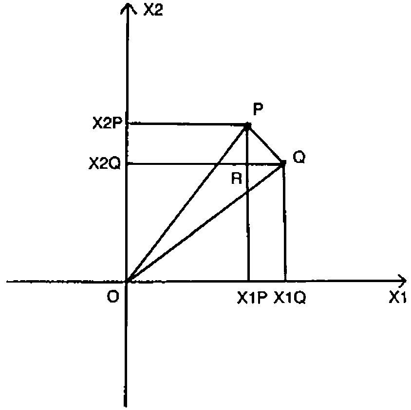

The distance PQ is equal to the square root of RQ squared plus RP squared. The distance RQ is the difference between the X1 coordinates of P and Q while RP is the difference in their X2 coordinates. So the distance between P and Q is

```
(+/(P-Q)*2)*÷2
```

We can generalize the function Line so that monadically it gives the length of the line joining a point to the origin of the reference frame, while dyadically it gives the distance between two points.

```
▶←'(+/⍵*2)*÷2' ∇ '(+/(⍺-⍵)*2)*÷2'
```

If you don’t like parentheses the ambivalent function can be written

```
▶←'.5*⊂+/⍵*2' ∇ '.5*⊂2*⊂+/⍺-⍵'
```

**S:** That’s very interesting Meno. Your function applies to three dimensions as well. And if you have lots of atoms, the positions of each being described in a row of a matrix, your function will give meaningful results here too.

**M:** Oh!

**S:** The laws of vector algebra are satisfied in APL. Given scalars M and N, and vectors P, Q and R.

Addition of vectors is commutative.

```
'TRUE'⊢(P+Q)≡(Q+P)
```

Addition of vectors is associative.

```
'TRUE'⊢(P+(Q+R))≡((P+Q)+R)
```

Multiplication of a vector by a scalar is commutative.

```
'TRUE'⊢(M×P)≡(P×M)
```

Multiplication of a vector by scalars is associative.

```
'TRUE'⊢(M×(N×P))≡((M×N)×P)
```

Multiplication of a vector by scalars distributes over addition.

```
'TRUE'⊢((M+N)×P)≡((M×P)+(N×P))
```

Multiplication of a scalar by vectors also distributes over addition.

```
'TRUE'⊢(M×(P+Q))≡((M×P)+(M×Q))
```

Can you write functions for the products of vectors?

**M:** If the symbol

```
●
```

represents the dot product of two vectors P and Q then

```
●←'+/⍵*2' ∇ '+/⍺×⍵'
```

The monadic form is the dot product of a vector with itself.

The dot product is commutative.

```
'TRUE'⊢(P●Q)≡(Q●P)
```

Dot distributes over addition.

```
'TRUE'⊢(P●(Q+R))≡((P●Q)+(P●R))
```

Multiplication of a dot product by a scalar is associative.

```
'TRUE'⊢(M×(P●Q))≡((M×P)●Q)
```

Further, if the symbol

```
⨯
```

represents the cross product of two three-element vectors, then

```
⨯←'' ∇ '((1⌽⍺)ׯ1⌽⍵)-(¯1⌽⍺)×1⌽⍵'
```

The cross product is anticommutative.

```
'TRUE'⊢(P⨯Q)±(Q⨯P)
```

Cross distributes over addition.

```
'TRUE'⊢(P⨯(Q+R))≡((P⨯Q)+(P⨯R))
```

Multiplication of a cross product by a scalar is associative.

```
'TRUE'⊢(M×(P⨯Q))≡((M×P)⨯Q)
```

Dot product and cross product both apply to three dimensions and to arrays whose rank is greater than or equal to one.

**S:** What about the angle of the vector P with regard to the axes?

**M:** If the symbol

```
∡
```

called corner, represents a monadic function giving the direction in radians of a vector with respect to the axes, and a dyadic function giving the angle between two vectors.

```
∡←'¯2○⍵÷▶⍵' ∇ '¯2○(⍺●⍵)÷(▶⍺)×▶⍵'
```

The angle between vectors P and Q is given by

```
P∡Q
```

and the direction of P by

```
∡P
```

**S:** It is useful to note that

```
P▶Q
```

will give the same result in all stationary frames of reference.

**M:** Ah! We have a scientific law here. Given any two frames of reference A̲ and B̲ and any two points P and Q

```
A̲P←A̲X1P,A̲X2P,A̲X3P
A̲Q←A̲X1Q,A̲X2Q,A̲X3Q
B̲P←B̲X1P,B̲X2P,B̲X3P
B̲Q←B̲X1Q,B̲X2Q,B̲X3Q
```

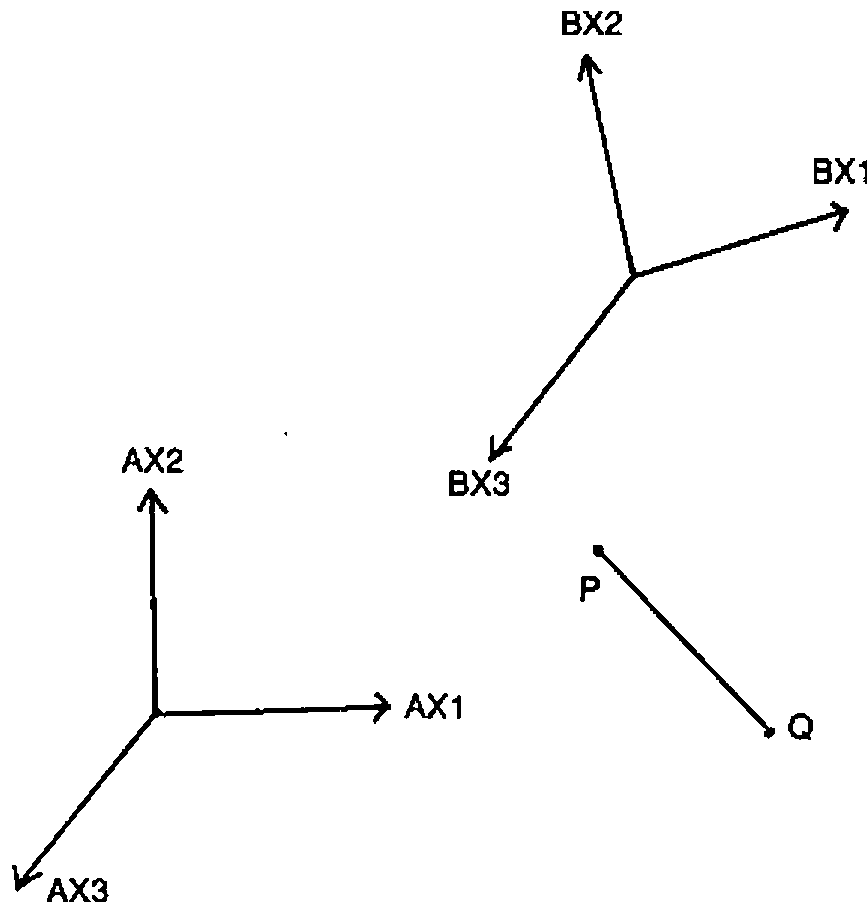

```
'LAW'⊢(A̲P▶A̲Q)≡(B̲P▶B̲Q)
```

**S:** Humm. Before a general statement about nature is raised to the status of a law, it should be subjected to rigorous experimental verification under a variety of circumstances. Given two frames of reference A̲ and B̲ if A̲ were in motion relative to B̲ I am not certain that measurements of the distance PQ in each frame of reference would agree.

**M:** Don’t be a Cretan Socrates! It’s obvious they would.

**S:** Things which seem obvious are not necessarily true, neither is what is true necessarily obvious. Let us think carefully about this. By allowing A̲ to be in motion relative to B̲ we have implicitly introduced the concept of time, for speed is distance moved divided by time taken.

**M:** Granted.

**S:** Our judgements of the moment of time (as opposed to chronological order) are actually judgements of simultaneous events. For example, you arrived simultaneously with the shadow on my sun dial here falling at 12 o’clock. While this definition of time is satisfactory for events in the vicinity of my dial, it isn’t when we wish to evaluate times of remote events.

**M:** Why not Socrates?

**S:** Because it takes time for information regarding these remote events to get here. No signal in nature travels infinitely fast.

You say Achilles found the speed of light to be 871,126,392 mph in all reference frames even if they are moving with respect to one another.

**M:** Yes he did.

**S:** Let us use this fact to synchronise a set of clocks in reference frame A̲ using huge measuring rods each of length C miles. If I place identical clockwork mechanisms at each end of a rod I can synchronise them in the following manner. Arrange for a light beam to leave the first clock at 12 o’clock. When the tip of the beam arrives at the second clock, that clock is to be set to 1 o’clock since it takes one hour for light to travel the length of the rod. Let this be done for a grid of clocks separated by such rods.

We then have a synchronised space-time reference frame wherein everyone will agree about spacial and temporal assignments. Any event in this reference frame can be given a coordinate position by means of the measuring rods, and a time by associating the moment of the event with the time on the nearest clock. This is the time of the event in that reference frame. Of course, to be accurate, we should have a much finer grid.

At 12 o’clock on our local clock, we believe all other clocks in this synchronised frame will, at that instant, also read 12 o’clock, although, of course, we can’t see what they are actually reading at that instant because of the time delay associated with the distance involved.

The stars which we see in the heavens are their younger appearances of even aeons ago!

**M:** What you say makes syllogistic sense. I can’t fault the logic. But do we really need to bother with all these clocks and rods?

In your synchronised space-time reference frame, these are the times at which observers at each clock see the origin clock reading 12.

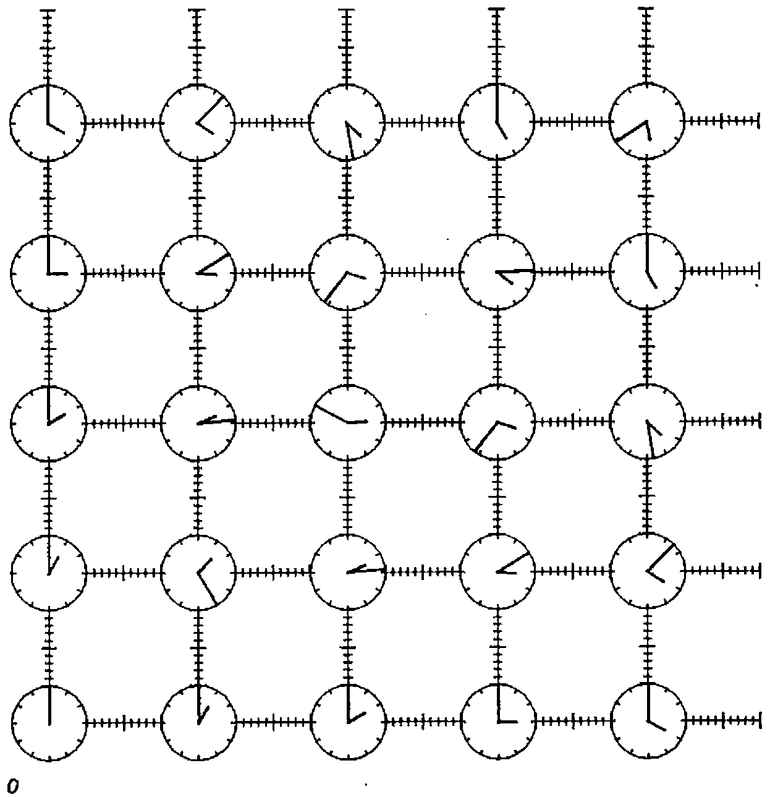

**S:** We are trying to find a law of distance which is not affected whether we use one or other of two systems of coordinates in uniform translatory relative motion.

**M:** Go on then master.

**S:** Imagine there are two similarly oriented synchronised space-time reference frames A̲ and B̲ and that B̲ is moving at velocity A̲B̲X1V in the X1 direction relative to A̲.

Suppose also that at the moment when their origins meet, both A̲’s and B̲’s origin clocks read 12. At this instant a candle is uncovered at the common origin. Two observers, one at the origin of frame A̲ and the other at the origin of frame B̲ agree that the light departed at 12 o’clock. A second observer in frame B̲ is naturally stationary with respect to the first in B̲ but is situated vertically above him. The distance in miles between them is given by C times the decimal hour on his clock, B̲T, when the light arrives.

While the light is travelling along axis B̲X2, the whole reference frame B̲ is moving relative to A̲. If, when the second observer in B̲ receives the light signal, there happens to be a second observer in A̲ at that position, the question is: what is the reading on his clock?

**M:** There are four observers altogether. Two in A̲ and two in B̲. One in A̲ and one in B̲ are coincident when the light departs, and one in A̲ and one in B̲ are coincident when the light arrives.

Let’s assume decimal clocks at the common origin which both read zero when the light departs. The second clock in A̲ reads A̲T and the second clock in B̲ reads B̲T at a place and time the light arrives. According to A̲ the B̲ clock has moved a horizontal distance

```
A̲B̲X1V×A̲T
```

and the light has travelled a diagonal distance

```
C×A̲T
```

while for B̲ the light has travelled a vertical distance

```
C×B̲T
```

The situation can be summarised in a right angled triangle.

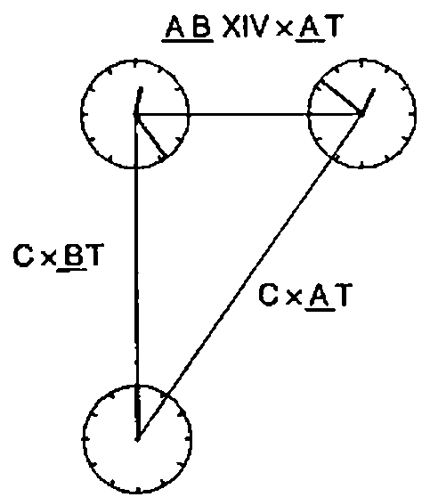

Applying Pythagoras to this triangle gives the relation between the readings on the clocks in A̲ and B̲ as

```
Γ←'÷0○(▶⍵)÷C' ∇ ''

'FACT'⊢A̲T=B̲T×Γ(A̲B̲X1V,0,0)
```

I admit I am surprised that clocks at the same place read differently. Surely it is just an illusion that time can go at different rates in different frames of reference. If Castor were to move away from Pollux, they would no longer be twins. If Castor were to turn and come back, since

```
'TRUE'⊢(Γ⍵)=(Γ-⍵)
```

their clocks would be different when they next met!

Achilles did say his clock kept going slow with respect to Athens mean-time; and he does maintain a youthful appearance!

**S:** Although from our frame of reference it takes 28 years for light to arrive from Vega (and so we see Vega as it was 28 years ago), a nymph can fly there and only age a few hours without travelling faster than light.

A twin is not absolutely twinned, neither is a journey conclusively small or great!

**M:** Eh?

**S:** Considering distances rather than times:

```
A̲L←C×A̲T
B̲L←C×B̲T
'FACT'⊢A̲L=B̲L×Γ(A̲B̲X1V,0,0)
```

So distances too are measurably different in the two frames of reference.

**M:** Oh I see!

**S:** Take another example. Again we have the two frames A̲ and B̲ moving at velocity A̲B̲X1V relative to one another in the X1 direction. Again the candle is uncovered when the space-time origins coincide. Since the speed of light is the same when measured in both frames of reference, observers situated at some distance round their own origins will report that the light from their origin forms an expanding sphere centred on their own origin.

**M:** That seems paradoxical. Surely there is only one sphere. It must be centred either on A̲’s origin or on B̲’s. At any rate, it can’t be centred on both because they only coincide at the instant when the light first departs and not thereafter.

**S:** Consider the situation either from A̲’s point of view or from B̲’s. There is no third absolute perspective.

**M:** Right. Taking the situation from A̲’s point of view; after time A̲TP the wavefront at some arbitrary point P will have reached a distance C times A̲TP from the origin. In other words, the wavefront will form an expanding sphere radius C times A̲TP at time A̲TP.

```
A̲P←A̲X1P,A̲X2P,A̲X3P
```

A̲P is a point on the wavefront at time A̲TP.

```
'FACT'⊢(C×A̲TP)=▶A̲P
```

**S:** If you write

```
A̲X4P←0J1×C×A̲TP
A̲P←A̲X1P,A̲X2P,A̲X3P,A̲X4P
```

Then the expression becomes

```
'FACT'⊢0=▶A̲P
```

**M:** Nice one master. Exactly the same holds for B̲.

```
B̲X4P←0J1×C×B̲TP
B̲P←B̲X1P,B̲X2P,B̲X3P,B̲X4P
'FACT'⊢0=▶B̲P
```

Squaring the 0J1, as is done inside the function Line, gives a factor minus 1; One is then taking the square root of something which is zero giving the length of the four element vector B̲P to be zero for all space-time points on the wavefront.

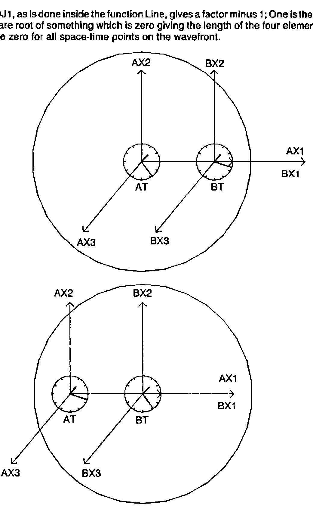

**S:** Since the clocks in A̲ and B̲ were synchronized in a manner exactly similar to the arrangement just described, we can now state the law which we originally sought. The four dimensional generalization of Pythagoras’ theorem yields; the space-time length from the common origin to *any* point P is the same for all reference frames in uniform relative motion.

```
'LAW'⊢(▶A̲P)=(▶B̲P)
```

Also, for two points P and Q, the four dimensional distance between them is the same for all such frames.

```
'LAW'⊢(A̲P▶A̲Q)=(B̲P▶B̲Q)
```

**M:** Amazing!

**S:** Both coordinate systems are describing the same light wave, so there must be a transformation which would take us from A̲ coordinates to B̲ coordinates and back again at will.

**M:** This transformation must be a function of A̲B̲X1V. That is the only variable there seems to be here.

**S:** Carry on Meno.

**M:** Well, we need a matrix function of a vector, call it 4 Frame, using the symbol ⌺ which takes an argument of the relative vector velocity V (in our case A̲B̲X1V,0,0) and returns a matrix of four rows and four columns such that

```
'FACT'⊢B̲P≡(⌺V)+.×A̲P
'FACT'⊢A̲P≡(⌺-V)+.×B̲P
```

This is the case whatever the relative velocity, V. Combining the transformation with its inverse leads to

```
'TRUE'⊢(4 4⍴1 0 0 0 0)≡(⌹⌺V)+.×⌺V
'TRUE'⊢(4 4⍴1 0 0 0 0)≡(⌺V)+.×⌹⌺V
```

for all V, by definition. These relations lead to the conclusion that

```
'FACT'⊢(⌺-V)≡⌹⌺V
```

**S:** Another way of picturing the relationship between A̲ and B̲ ignoring the X2 and X3 axes because they are not involved, is obtained by regarding the velocity difference between them as a rotation ⍺ of the space-time coordinates so that

```
'FACT'⊢⍺=A̲X1∡B̲X1
```

and then, naturally,

```
'FACT'⊢⍺=A̲X4∡B̲X4
```

because we are dealing with orthogonal axes.

**M:** Ah!

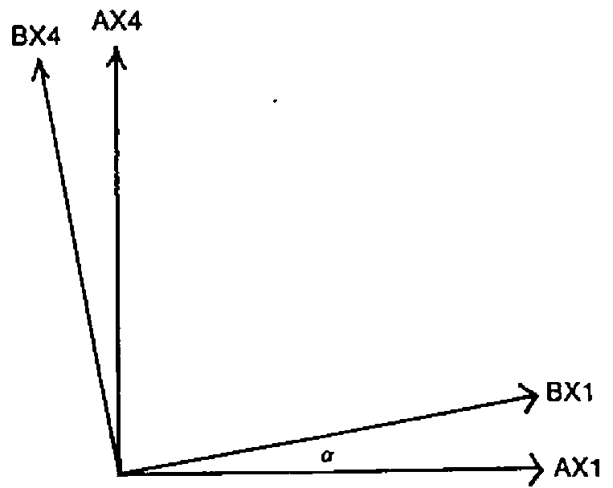

Now I can use Euclid[6] to find out what the transformation is. Take an arbitrary point P in the plane and drop perpendiculars from P to both sets of axes.

For a right angled triangle, one of whose adjacent sides is ⍺.

```
1○⍺
```

is equal to the length of the side opposite to ⍺ divided by the length of the hypotenuse, while

```
2○⍺
```

is the adjacent side over the hypotenuse. Length OU is

```
(2○⍺)×A̲X1P
```

since length OK is

```
A̲X1P
```

Length OR is

```
(1○⍺)×A̲X4P
```

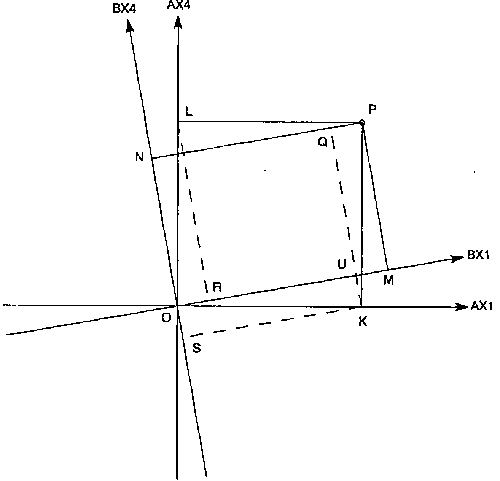

since length OL is

```
A̲X4P
```

Triangle ORL is congruent to triangle KQP since OL is the same length as KP and all the angles are equal. So length OR is the same as QP which is itself the same as UM. Now, OM is length OU plus UM, and OM is length

```
B̲X1P
```

Therefore:

```
'TRUE'⊢B̲X1P=((2○⍺)×A̲X1P)+((1○⍺)×A̲X4P)
```

A similar argument gives the expression for

```
B̲X4P
```

Considering that ON is SN minus OS, OS is KU which is

```
(1○⍺)×A̲X1P
```

SN is the same distance as QK which is the same as RL by congruence. And RL is

```
(2○⍺)×A̲X4P
```

Thus the matrix given by 4 Frame V is formally

```
 2○⍺   0   0   1○⍺
  0    1   0    0
  0    0   1    0
-1○⍺   0   0   2○⍺
```

Any point A̲P is related to the same point B̲P by

```
'TRUE'⊢B̲X1P=((2○⍺)×A̲X1P)+((1○⍺)×A̲X4P)
'TRUE'⊢B̲X2P=A̲X2P
'TRUE'⊢B̲X3P=A̲X3P
'TRUE'⊢B̲X4P=((-1○⍺)×A̲X1P)+((2○⍺)×A̲X4P)
```

from the geometry.

**S:** You are well versed in Euclidean geometry Meno. But how are you drawing all these nice pictures?

**M:** I’m using my new HPQ722123ABC⍺⍵ jotter which I got from the stoneware factory at Sparta. Look!

**S:** Golly! That is a super machine. What’s that beside it?

**M:** That’s my

> ζβμ

impersonal abacus.

**S:** I say: have you got Blunt APL on that tiny?

**M:** O Jupiter! Socrates! You mean Sharp APL on this micro.

**S:** Er, um …. yes. Do you have Sharp APL on that micro Meno?

**M:** Of course I do. If you doubt my reasoning proving that OR is the same as UM, or that SN is the same as RL then I can easily write an APL function which takes a left argument of the angle ⍺ and a right argument of the vector coordinates of P. I can then draw lots of diagrams on this slate with various angles between the axes, and for different points P. You can then see that the lengths of OR and UM as well as SN and RL are always the same.

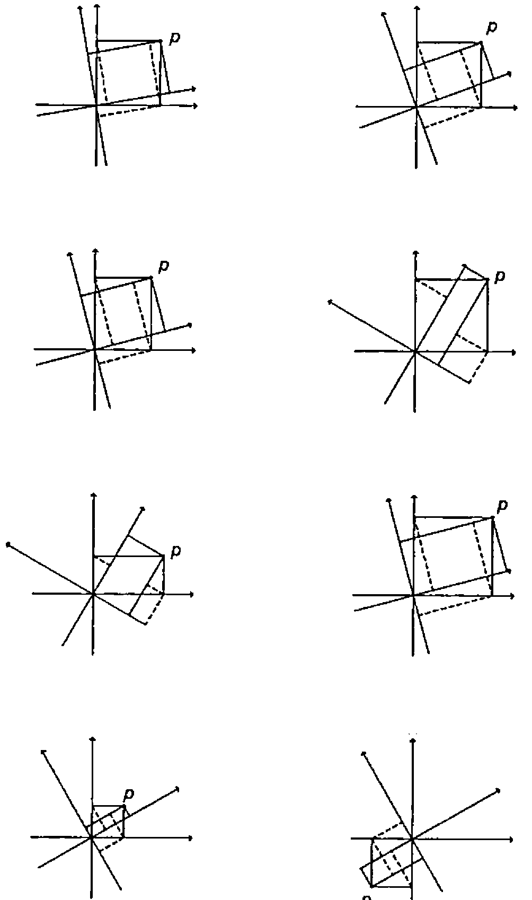

**S:** What is ⍺ then? What is its relation to reality?

**M:** No slave has a clue master.

**S:** Can you find it perhaps from

```
'TRUE'⊢B̲X1P=((2○⍺)×A̲X1P)+((1○⍺)×A̲X4P)
```

considering that the origin of B̲ is at

```
B̲B̲0←0
```

in frame B̲ and at

```
A̲B̲0←A̲B̲X1V×A̲T
```

in frame A̲.

**M:** That’s crafty Socrates. A̲’s view and B̲’s view of B̲’s spatial origin yield:

```
'FACT'⊢0=((2○⍺)×A̲B̲X1V×A̲T)+((1○⍺)×0J1×C×A̲T)
```

which gives

```
'FACT'⊢(3○⍺)=0J1×A̲B̲X1V÷C
```

Where do we go from here?

**S:** Draw a right angled triangle with one angle equal to ⍺ and the adjacent side of unit length.

**M:** Easy.

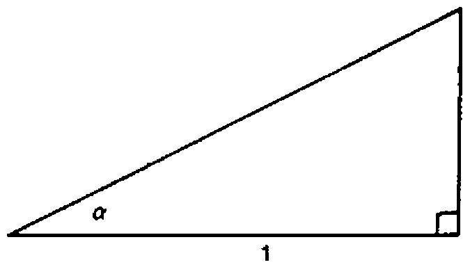

**S:** In a right angled triangle, such as you have there, the tangent of ⍺ is equal to the opposite side divided by the adjacent side. By construction, the adjacent side has length 1.

**M:** Ah. I see. We know tan ⍺ and the length of the adjacent side, so we can deduce that the opposite side must have length

```
0J1×A̲B̲X1V÷C
```

and therefore the hypotenuse has length

```
▶1,0J1×A̲B̲X1V÷C
```

which is actually the same as

```
÷ΓA̲B̲X1V
```

Knowing the lengths of the sides of the triangle, expressions for sin and cos of ⍺ follow immediately.

```
'FACT'⊢(1○⍺)=(ΓA̲B̲X1V)×0J1×A̲B̲X1V÷C
'FACT'⊢(2○⍺)=ΓA̲B̲X1V
```

Replacing these expressions in the transformation and ignoring the X2 and X3 axes which are not involved, gives a matrix function of a scalar,

```
⧄
```

which transforms coordinates

```
A̲P←A̲X1P,A̲X4P
```

to coordinates

```
B̲P←B̲X1P,B̲X4P
```

for any point P when B is applied to velocity A̲B̲X1V.

```
⧄←'2 2⍴(Γ⍵)×1,0J1 0J¯1×⍵÷C' ∇ '' ⍤0
```

**S:** Try it on your abacus. See what happens to B̲’s clocks and rods when viewed from A̲. Verify that the distance between any two points in space-time is the same in A̲ as in B̲ and hence that

```
'LAW'⊢(▶A̲P)=(▶B̲P)
'LAW'⊢(A̲P▶A̲Q)=(B̲P▶B̲Q)
```

**M:**

```
      ⍝ TAKE FIRST CLOCK AXIS A̲X1 AT 1 O'CLOCK
      ⎕←A̲1←C×1 0J1
6.7113E8 0J6.7113E8

      ⍝ A̲B̲X1V IS HALF THE SPEED OF LIGHT
      ⎕←A̲B̲X1V←C÷2
335563196

      ⍝ TRANSFORMATION FROM A̲ TO B̲ IS TA̲B̲
      ⎕←TA̲B̲←⧄A̲B̲X1V
      1.1547  0J0.57735
0J¯0.57735     1.1547

      ⍝ APPLY TRANSFORMATION TO GET B̲'S VIEW OF A̲1
      ⎕←B̲1←TA̲B̲+.×A̲1
3.8748E8 0J3.8748E8

      ⍝ B̲ SEES THIS CLOCK ALMOST HALF AS FAR FROM THE ORIGIN
      ⍝ AS A̲ SEES IT, AND AT ALMOST HALF THE TIME
      ▶A̲1
0

      ⍝ A̲1 IS A SPACE-TIME POINT ON THE SYNCHRONISING WAVEFRONT
      ▶B̲1
0

      ⍝ B̲1 IS ALSO ON THE SYNCHRONISING WAVEFRONT
      'LAW'⊢(▶A̲1)=(▶B̲1)
1

      ⍝ TAKE TWO RANDOM POINTS IN SPACE-TIME
      ⎕←A̲P←A̲1×2?1000
3.4784E11 0J4.4294E10
      ▶A̲P
3.4481E11
      ⎕←A̲Q←A̲1×2?1000
1.4429E11 0J2.5838E11
      ▶A̲Q
0J2.1434E11

      ⍝ THE SPACE-TIME DISTANCE BETWEEN THEM IS:
      A̲P▶A̲Q
0J6.6951E10
      ⎕←B̲P←TA̲B̲+.×A̲P
3.7585E11 0J¯1.4957E11
      ▶B̲P
3.4481E11
      ⎕←B̲Q←TA̲B̲+.×A̲Q
1.7436E10 0J2.1505E11
      ▶B̲Q
0J2.1434E11
      'LAW'⊢(▶A̲P)=(▶B̲P)
1
      'LAW'⊢(A̲P▶A̲Q)=(B̲P▶B̲Q)

   ⍝ FOUR DIMENSIONAL DISTANCES ARE THE SAME IN BOTH FRAMES
   ⍝ TAKE A NUMBER OF POINTS
   ⎕←A̲S←C×(⍳3)∘.×1 0J1
       0            0
6.7113E8 0J6.7113E8
1.3423E9 0J1.3423E9

      ⍝ AND A NUMBER OF RELATIVE VELOCITIES
      ⎕←A̲B̲X1VS←C×.3 .5 .9 .99
2.0134E8 3.3556E8 6.0401E8 6.6442E8
      ⎕←TA̲B̲S←⧄A̲B̲X1VS
      1.0483  0J0.31449
0J¯0.31449     1.0483

      1.1547  0J0.57735
0J¯0.57735     1.1547

      2.2942   0J2.0647
 0J¯2.0647     2.2942

      7.0888   0J7.0179
 0J¯7.0179     7.0888

      ⎕←B̲S←⍉TA̲B̲S+.×⍉A̲S
         0          0          0          0
         0          0          0          0
  4.9247E8   3.8748E8   1.5397E8   4.7575E7
0J4.9247E8 0J3.8748E8 0J1.5397E8 0J4.7575E7

  9.8494E8   7.7495E8   3.0793E8    9.515E7
0J9.8494E8 0J7.7495E8 0J3.0793E8  0J9.515E7
```

**S:** Can I borrow your impersonal abacus for a minute please Meno?

**M:** Here you are then.

**S:** Thanks a lot. ‘BANG BANG BASH BASH BANG ……’

**M:** Go easy Socrates, you’ll break the keyboard!!

**S:** Ah yes! I think the four dimensional transformation for a general three dimensional relative velocity motion is given by

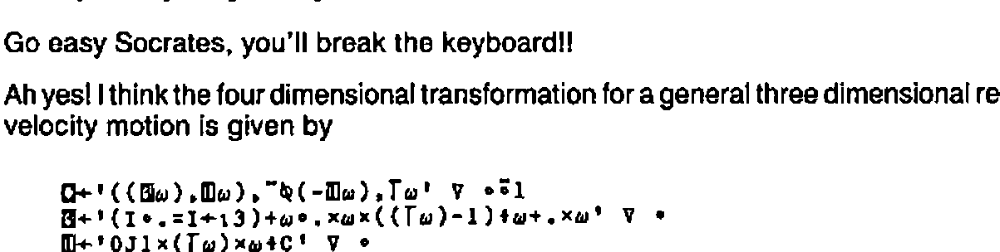

If there is a third reference frame C̲ moving at velocity B̲C̲X1V in the X1 direction with respect to B̲ ….

**M:** Oh please stop master. Perhaps, after all, the gods from their Olympian frame have an entirely different view from us of why we are in our here and now …..

**S:** …… the picture would be this:

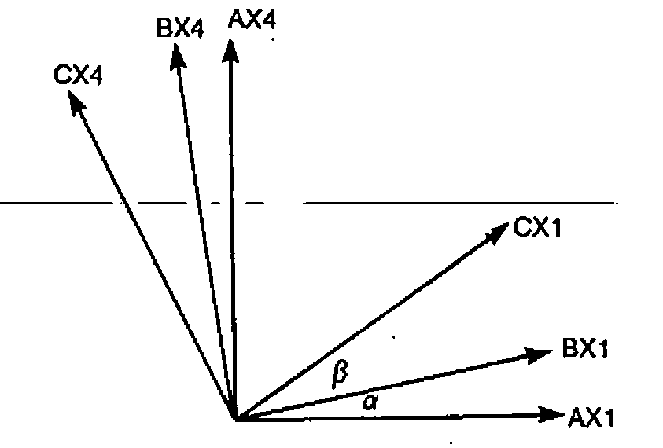

The velocity A̲C̲X1V of C̲ relative to A̲ is

```
'FACT'⊢A̲C̲X1V=0J¯1×C×3○⍺+β
```

Since the tangent of the sum of two angles is equal to the sum of the tangents of each angle divided by 1 minus the product of the tangents of each:

```
'FACT'⊢A̲C̲X1V=(A̲B̲X1V+B̲C̲X1V)÷1+(A̲B̲X1V×B̲C̲X1V)÷C*2
```

which implies that one cannot reach the velocity C by compounding a finite number of relative velocities less than C.

**M:** SOCRATES!!

**S:** In summary:

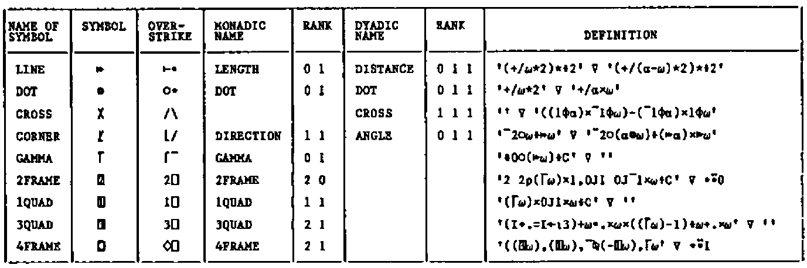

**M:** O Socrates, now that I know all this I must be wise.

**S:** O Meno, now that I know all this I know I must be ignorant.

## References

[1] Socrates (470-399 BC) was condemned to death for misleading the youth of Athens. He taught that it is preferable to suffer wrong than commit it.

[2] Rationalized APL (1983). I.P. Sharp Associates Research Report Number 1 by K. E. Iverson.

[3] Achilles was cited in a paradox by Zeno (490-430 BC) suggesting Achilles could never beat a tortoise in a race if the latter gets a start because always by the time he arrived at the point the tortoise was it has moved on half again, say. It is solved by

```
'TRUE'⊢2=+/÷2*(⍳¯)-⎕IO
```

[4] Pythagoras (570-490 BC) attempted to formulate a mathematical explanation of all reality. He preached the doctrine of the transmigration of souls.

[5] Democritus (480-370 BC) argued that since nothing can come from nothing, and motion, which requires a void, really occurs, reality must consist of atoms moving in a void.

[6] Euclid (323-283 BC), is the famous Greek geometrician.

*G. D. Robertson, IPSA Ltd, 10 Dean Farrar St, London SW1, 01-222-7033*
