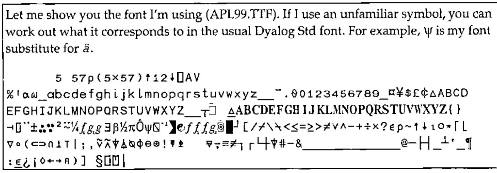
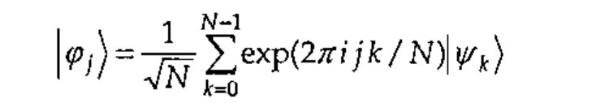
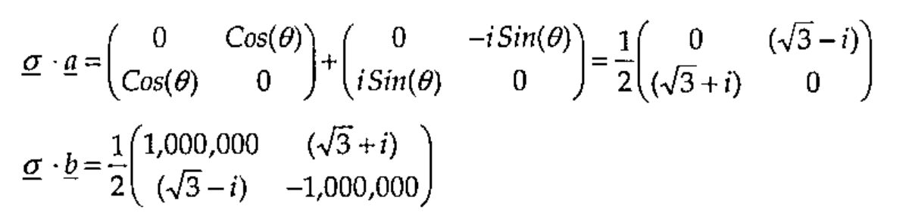

*by Graeme D. Robertson*
{ .byline }

> An argument between Bohr and Einstein on the meaning of quantum mechanical reality is given a significant twist in Bohr’s favour by Bell’s inequality and its experimental refutation. I attempt to employ APL in the elucidation of quantum mechanical description of physical reality.

Two articles in Vector by Sylvia Camacho [1, 2] prompted me, eventually, to respond. After a few recent personal letters, books and emails between Sylvia and myself, I decided to write an article for Vector which, although it might raise more questions than it answers, at least demonstrates that I too am *very* interested in the whole business of reality.

## Bell’s Theorem

> *No theory can give (a) contingent general predictions of the individual results of measurements, (b) be compatible with the statistical predictions of quantum mechanics (even to within say 5%) and (c) satisfy local causality.*

This means that you can’t rationally believe, as Einstein did, in both determinism (that every effect is uniquely caused) and locality (that things are separable) while at the same time accepting the predictions of quantum theory. Einstein believed that quantum theory is like statistical mechanics and that *hidden variables* would eventually be discovered which reveal an underlying *local deterministic structure*.

A mathematical inequality, based on some very general assumptions about the nature of reality, was derived by John Bell [3] in 1964. Yet, as Bell pointed out, this innocent-looking inequality is violated by the predictions of quantum mechanics regarding, for example, two-component spinors. As such, the inequality violation should be visible in many departments of optical, atomic, nuclear and sub-nuclear physics. A number of experiments with electrons, photons and protons have been performed to test the validity of the inequality. The first experiments were performed in 1969 by Clauser in Berkeley and Holt at Harvard using photons. The experimental and theoretical conclusions clearly favour quantum theory over all classical (*local deterministic*) versions of reality.

Bell showed that whatever hidden variables one might care to introduce, if they are constrained to be local to the environment of the object to which they refer then such a hidden variable theory will never be able to reproduce all the predictions of quantum mechanics. In particular, if two two-state (quantum binary) systems interacted for a time and ‘separated’, the correlations which are predicted by quantum mechanics, and which have been observed in experiments, are stronger than can be accounted for by theories which are realistic in the sense proposed by Einstein, Podolski and Rosen [4] (who were immediately, in 1935, rebuffed by Bohr [5]).

### Bell’s Inequality

A simple account of Bell’s inequality is given by David Harrison of Toronto University in his web page [6]. According to Harrison the essence of Bell’s inequality can be summarized as follows.

> *The number of objects which have property A but not property B plus the number of objects which have property B but not property C is greater than or equal to the number of objects which have property A but not property C.*

If this appears trivially obvious then that’s good because now you can see the paradox, namely: this common sense does not necessarily hold sway in quantum mechanics. (Neither does an uncritical application of Boolean algebra!) The crux of the problem revolves around the assumption that *objects have properties* independent of their observation.

If one tries to describe two systems, which have interacted in the past and have then separated, by *disjoint probability distributions* involving arbitrary *local hidden variables*, then this leads to predictions different from those of quantum mechanics. According to quantum mechanics, two (or more) systems can retain observable properties which are indefinitely outrageously strongly correlated even after the two systems have completely ‘separated’ in the usual sense of the word (including all requirements of relativity theory). There are correlations between observables that are stronger than can be imagined in classical physics. Such (classically independent) systems are said to be *entangled*.

Another way of expressing Bell’s inequality in words may be as follows.

> *If the joint probability distributions of correlated observables are assumed to become disjoint distributions by the addition of arbitrary local hidden variables, some correlations predicted by quantum theory are greater than can be achieved by any such local hidden variable theory.*

Consider the implications of a conservation law, such as conservation of energy or momentum (or angular momentum in the case described by Bell). If an object with zero initial momentum spontaneously splits in two parts, then measurement of the momentum of one part will imply exactly an equal and opposite momentum of the other part – by conservation of momentum. This necessitates a strong deterministic relationship between functions describing the states of the two supposedly-separate parts. In the case of the intrinsic spin angular momentum of an electron, or the polarization vector of a photon, there are only two possible outcomes, up (measures +1) or down (measures -1) which makes the product of the two results necessarily ±1.

> Note that we are here, and in what follows, using units in which Planck’s constant divided by 4π is equal to one unit of spin angular momentum (action).
>
> 1 Bell unit = 0.527295…10<sup>-27</sup> erg sec

Consider two identical quantum systems labelled I and II that interacted and separated. Measure some two-component quantum observable of system I by some experimental arrangement described by *instrument vector <u>a</u>* (for example, the orientation of a polarizer). This measurement will be represented mathematically in a deterministic theory by some unspecified function *A(<u>a</u>)*, or a function *A(<u>a</u>, λ)* where λ represents any local hidden variables or functions, but **not** by a function *A(<u>a</u>, <u>b</u>)* nor a function *A(<u>a</u>, <u>b</u>, λ)*, by the locality postulate. Measure the same property of system II with instrument vector *<u>b</u>*. A deterministic theory should be able to predict the result from some unspecified function *B(<u>b</u>)*, or a function *B(<u>b</u>, λ)* where λ represents any local hidden variables or functions, but **not** by a function *B(<u>a</u>, <u>b</u>)* nor a function *B(<u>a</u>, <u>b</u>, λ)*, by the locality postulate.

The expectation value of the product of the two results, written *P(<u>a</u>, <u>b</u>)*, should be given in terms of a separable product of two *disjoint distributions* (*A(<u>a</u>, λ)* for system I and *B(<u>b</u>, λ)* for system II) as opposed to a single joint distribution describing I and II together (as a superposition of states in quantum theory). Any arbitrary distribution, ρ(λ), of local hidden variable(s), λ, can be added without changing the following conclusion.

The most general local deterministic formula for the product of the results of measurements of I at *<u>a</u>* and II at *<u>b</u>* is

> *P(<u>a</u>,<u>b</u>) = ∫ρ(λ)A(<u>a</u>,λ)B(<u>b</u>,λ)dλ*

Introducing a third orientation, *<u>c</u>*, Bell showed that this disjoint integral expression, plus the assumption that *P(<u>a</u>, <u>a</u>)* = -1, mathematically implies that

> 1 + *P(<u>b</u>,<u>c</u>)* ≥ | *P(<u>a</u>,<u>b</u>)* – *P(<u>a</u>,<u>c</u>)* |

He then proceeded to show that the quantum mechanical prediction for the product of polarizations measured at orientation *<u>a</u>* for I and *<u>b</u>* for photon II when the pair are in the singlet state, | Ψ<sub>I,II</sub> ⟩, is given by the joint distribution

> *P(<u>a</u>, <u>b</u>)* = ⟨ Ψ<sub>I,II</sub> | <u>σ</u>.*<u>a</u>* ⊗ <u>σ</u>.*<u>b</u>* | Ψ<sub>I,II</sub> ⟩ = - *<u>a</u>* . *<u>b</u>*

This does **not** always satisfy the inequality, even to within 5%. Try, for example, *<u>a</u>* and *<u>b</u>* at 30° and *<u>b</u>* and *<u>c</u>* at right angles which would imply 1 ≥ √3.

Bell’s inequality is important because it highlights the philosophically shocking nature of quantum mechanics [7, 8]. Bell’s result – sometimes called *passion at a distance* – is, however, not of huge significance to most working physicists because physicists have accepted for over 50 years that quantum mechanics works perfectly well and they have already discovered that modern physics has many amazing consequences.

Bell’s theorem necessitates a view of reality, or *world view*, in which the dramatic and astonishing revelations of quantum theory become intelligible, or at least acceptable. So let’s try to do some simple quantum mechanics and see if we can derive any sense from it.

## Matrix Mechanics

Just to keep alive those worldly readers who would turn off at the mention of reality, I offer the tantalizing hypothesis *that at least some of the correlations found empirically in stock market series [9] might be quantum correlations*. Quantum correlations involve joint distributions that produce correlations between observables which are *stronger that can be imagined in terms of any local deterministic model*.

There are at least three distinct formulations of quantum mechanics. There is the original 1925 discrete *matrix mechanics* of Heisenberg, then there is the Schrödinger continuous differential *wave mechanics* of 1926. There is also the rationalized notation of Dirac in 1930 which formulates *quantum theory* in abstract Hilbert space. All three theories are equivalent and give the same predictions. Matrix mechanics is closest in spirit to APL. You can think of wave mechanics as involving differential operators or *infinite matrices* which are not conducive for APL. Dirac notation is more symbolic and accommodates all mathematical representations. Hilbert space is a ‘complete inner product space’ which can be *infinite dimensional*. And each point in a Hilbert space can correspond to a *function*. We shall use some Dirac notation to annotate our simple APL model of matrix mechanics. Forgive me – some symbols used *in the comments* are not in `⎕AV`.

### Qubits

A two-state (Boolean) system can be represented by one bit which can be either 0 or 1 in value – you’re with me so far? Quantum mechanically a two-state system is represented by one quantum bit, or *qubit*. A qubit can be `|0>` or `|1>` or *any linear combination* of these two states, often written as `|ψ> = α|0> + β|1>` in Dirac notation. A good working account of this formalism is given by Nielsen and Chuang [10]. (I am excited to see from comp.lang.apl that Paul Chapman is studying quantum computation – I hope he will help me over some of my own conceptual difficulties with quantum information one day.)

In APL terms, a qubit, `|ψ>`, can be written as a two element vector `(α,β)` with vector space basis elements `|0>≡1 0` and `|1>≡0 1`. Consider the stationary state of a one qubit system represented by APL vector ψ:

```apl
      ψ ← 1  2 ⍝ |ψ> = 1|0> + 2|1>
```

> Let me show you the font I’m using (APL99.TTF). If I use an unfamiliar symbol, you can work out what it corresponds to in the usual Dyalog Std font. For example, ψ is my font substitute for *ä*.
>
> 

Note that ψ above is not a unit vector – its length is not one. Quantum mechanical states can always be normalized to unit vectors without loss of generality because all vectors can be multiplied by an *arbitrary phase factor* without changing any predictions. All calculations of observable values involve multiplying the state by its complex conjugate which cancels the arbitrary phase. (The arbitrary phase is however fundamental to the introduction of electromagnetism through Yang-Mills gauge theory via this exact rotation symmetry.)

Using orthonormal basis vectors – unit vectors which are orthogonal to each other – considerably simplifies quantum mechanical calculations. In APL notation, with a comment in Dirac notation, the orthonormality is clear from

```apl
      1 0 +.× 1 0 ⍝ <0|0> = 1
      1 0 +.× 0 1 ⍝ <0|1> = 0
      0 1 +.× 1 0 ⍝ <1|0> = 0
      0 1 +.× 0 1 ⍝ <1|1> = 1
```

or, in a single expression which returns the required 2 × 2 unit matrix,

```apl
      (⍉2 2⍴1 0 0 1)+.×(2 2⍴1 0 0 1)  ⍝ <i|j> ≡ δᵢⱼ
```

We normalize a vector by dividing by its norm (length).

```apl
      ⎕←ψ←ψ÷(ψ+.×ψ)*0.5⍝ |ψ>=|ψ>/<ψ|ψ>½ = (1|0>+2|1>)/5½
0.447 0.894
```

Alternatively, we could return this normalized state from a normalization function applied to the relative weights of the superposition:

```apl
      ψ ←{⍵÷0.5*⍨+.×⍨⍵}1 2
```

Note the new monadic monistic Dyalog implementation of commute (`⍨`). Check that ψ is now a unit vector, *i.e.* that `ψ+.×ψ` is unity.

In matrix mechanics a measurable (*observable*) quantity is represented mathematically by an n × n *matrix*. This matrix acts on an n-component state vector (via inner products) to yield the possible values of the measurement and the relative weights of these possible outcomes. Normalized states which do not change when multiplied by the observable’s matrix ‘operator’ are called *eigenvectors* and correspond to states of definite (deterministic) measured value. The value measured for an eigenvector state (the *eigenvalue*) is the scaling factor of the eigenvector after inner product with the matrix. (In wave mechanics matrix ‘operators’ become differential operators, and in abstract quantum theory they become abstract operators acting on vectors in Hilbert space – but the concept of eigenvectors (now eigenfunctions) and eigenvalues remains fundamental.)

In the case of measurement of two-component spin states (spinors), the matrix used to represent measurement of the z component of spin is the Pauli matrix

```apl
      Ô ← 2 2 ⍴ 1 0 0 ¯1 ⍝ σz Pauli z matrix
```

Clearly, this matrix, acting on the basis states leaves them unchanged, apart from a scaling factor. The scaling factor is interpreted as the result of the measurement.

```apl
      Ô+.×1 0 ⍝ σz|0>=1|0>
1 0

      Ô+.×0 1 ⍝ σz|1>=¯1|1>
0 ¯1
```

There is a function called Eigen, based on LAPACK and to be found in the Dyalog distributed workspace …\ws\math.dws, that calculates the eigenvalues and eigenvectors for any given square positive-definite matrix. We define

```apl
      ⍂←{Eigen ⍵} ⍝ Eigen function from MATH workspace
```

Then applying this to Ô (σ<sub>z</sub>) yields the expected row of eigenvalues above the corresponding columns of eigenvectors.

```apl
      ⍂ Ô  ⍝ Eigenvalues⍪Eigenvectors of Ô(σz)
1 ¯1
1  0
0  1
```

We can form a matrix from our state ψ above using outer product. This will produce a matrix whose action will definitely leave ψ unchanged (through normalization). So the matrix

```apl
      ψ∘.×ψ  ⍝ |ψ><ψ| Outer Product of col & row vectors
0.2 0.4
0.4 0.8
```

represents an observable that will definitely yield value 1 and leave the state unchanged.

```apl
      ⍂ ψ∘.×ψ
1       0
0.447 ¯0.894
0.894  0.447
```

What is the significance of the other eigenvector of this observable? Check that `(¯0.894 0.447)` is normal and orthogonal to ψ, with eigenvalue 0.

### Entangled Qubits

When a state is described by two qubits, the four basis states correspond to the normalized outer product of two single qubit basis states, `|Ψ>=|ψ>⊗|φ>`. The combined system now has 2<sup>2</sup> component state vectors.

For example a two qubit state, Q, in which each qubit is in state ψ is

```apl
      Q ← ,ψ∘.×ψ  ⍝ |ψ>⊗|ψ>
```

Generally, therefore, an n-qubit state will have 2<sup>n</sup> components (a real APLer would want to keep these dimensions distinct rather than ravel them).

The Fourier transform of a quantum state is also a quantum state in a complementary basis. The discrete Fourier transform transforms the elements of a vector of N numbers `|ψ>` into another vector of N numbers `|φ>` via



There is a transform function called Fourier, based on FFTW and to be found in the Dyalog distributed workspace …\ws\math.dws, that calculates the discrete Fourier transform of any vector. We define

```apl
      f   ←{1 Fourier ⍵} ⍝ Fourier transform from MATH.DWS
      f⁻¹ ←{¯1 Fourier ⍵}  ⍝ Inverse Fourier transform
```

Applying *f* to Q we get

```apl
      P ← f(Q)
```

where we note that P has become complex in a notation where `0J1` is now `⊂0 1`

```apl
      P ≡ (0.9 0)(¯0.1 0.2)(¯0.3 0)(¯0.1 ¯0.2)
1
```

P is now a *complex vector*. Check that `f⁻¹(P)` is Q.

We must define a multiplication function for complex numbers to use in the inner product (in Hilbert space **C**<sup>4</sup>).

```apl
      x ←{+/(2 2⍴1 ¯1 1)×0 1⊖(2↑⍺)∘.×2↑⍵} ⍝ Multiply
```

Test that **P** is still a unit vector **using x in place of ×.**

```text
   Õ+.x Õ © <Õ|Õ>?
0.84 0
```

The length is real but not unity! The reason for the erroneous result is that the definition of inner product <P|P> involves complex conjugation – the dual vector <P| is the complex transpose of |P>. This ensures that length <P|P> is always a real number. We define a conjugation function,

```apl
      c ←{⍵×⊂1 ¯1}  ⍝ Complex Conjugate
```

and check that the correct definition of inner product gives unity.

```apl
      (c P)+.x P ⍝ <P|P>=1
1 0
```

Since all measurements yield real numbers, eigenvalues must be real numbers. This implies mathematically that matrix ‘operators’ corresponding to measurements must be *Hermitian*, *i.e.* equal to their complex transpose.

Returning to the quantum mechanical derivation for *P(<u>a</u>, <u>b</u>)*, here is a vector of Hermitian matrices with an algebra suitable for representing angular momentum measurements.

![σ ≡ (σx, σy, σz) = [(0 1; 1 0), (0 −i; i 0), (1 0; 0 −1)]](art10007390/sigma.jpg)

Here is a normalized circularly polarized singlet state in terms of which the combined system I + II is described:

```text
|ΨI,II> = (|01>-|10>)/√2
        = (|0>⊗|1>-|1>⊗|0>)/√2
```

This ‘Bell state’ is written in APL as

```apl
      B←,(1 0∘.×0 1)-(0 1∘.×1 0))
      ⎕←B←2↑¨B÷2*.5 ⍝ normalizing & complexifying
0 0  0.707 0  ¯0.707 0  0 0
```

We can now begin to see the meaning of the expression ⟨Ψ<sub>I,II</sub>| <u>σ</u>.*<u>a</u>* ⊗ <u>σ</u>.*<u>b</u>* |Ψ<sub>I,II</sub>⟩ for calculating the quantum mechanical values in Bell’s inequality. The orientation of polarizer I is at angle *θ* to the x axis in the x-y plane. Therefore *<u>a</u>* = (*Cos(θ)*, *Sin(θ)*, 0). Similarly, *<u>b</u>* = (*Cos(φ)*, *Sin(φ)*, Z). The matrix operators representing the measurement of spin angular momentum (in Bells) with instruments at orientations *<u>a</u>* and *<u>b</u>* involves generalized inner products <u>σ</u>.*<u>a</u>* and <u>σ</u>.*<u>b</u>*.



when *θ* = 30°, *φ* = -30° and the distance between the two instruments, Z, is 1 million units, say. The final correlation matrix for the joint observation of *<u>a</u>* for I at angle 30° and *<u>b</u>* for II at -30° is the outer product of <u>σ</u>.*<u>a</u>* and <u>σ</u>.*<u>b</u>*. In APL

```apl
      Ôa←2 2⍴0.5×0((3*0.5)¯1)((3*0.5)1)0 ⍝ = σ.a
      Ôb←2 2⍴0.5×2E6((3*0.5)1)((3*0.5)¯1)¯2E6 ⍝ = σ.b
      AB←4 4⍴1 3 2 4⍉Ôa∘.x Ôb  ⍝ = σ.a⊗σ.b
```

The expectation value for this observable in state |Ψ<sub>I,II</sub>⟩ should be - *<u>a</u>* . *<u>b</u>* which is equal to - *Cos(θ-φ)* or, in this case, - *Cos*(60°) = -½.

```apl
      (c B)+.x AB+.x B  ⍝ ⟨ΨI,II|σ.a⊗σ.b|ΨI,II⟩
¯0.5 0
```

There is, of course, another inequality – that could be called *Heisenberg’s inequality*, but is actually known as *the uncertainty principle* – which we should be able to demonstrate from two complementary matrix ‘operators’ such as

```apl
      Ôp ← P∘.x c P  ⋄  Ôq ← Q∘.x Q
```

which are Hermitian, `Ôp≡c⍉Ôp ⋄ Ôq≡c⍉Ôq`, and don’t commute.

The uncertainties (or standard deviations) can be calculated for any given state. In particular, a linear combination of eigenvectors, from `⍂ Ôq` or `⍂ Ôp`, should yield a state for which the product of uncertainties is not insignificant.

## References

1. Sylvia Camacho, *Bell’s Inequality*, Vector **4.1** 73-77 (1987)
2. Sylvia Camacho, *Can Anyone Tell Me Where I’m Wrong?*, Vector **18.2** 86-94 (2001)
3. J. S. Bell, *On the Einstein Podolski Rosen Paradox*, Physics **1.3** 195-200 (1964)
4. A. Einstein, B. Podolski and N. Rosen, *Can Quantum Mechanical Description of Physical Reality Be Considered Complete?*, Phys. Rev. **47** 777-780 (1935)
5. N. Bohr, *Can Quantum Mechanical Description of Physical Reality Be Considered Complete?*, Phys Rev 48 696-702 (1935)
6. http://www.upscale.utoronto.ca/PVB/Harrison/BellsTheorem/BellsTheorem.html (2003)
7. Graeme Robertson, *Philosophical Problems of Quantum Ontology*, M.Litt. Thesis, Cambridge University (1977)
8. Graeme Robertson, *Unity Consciousness and the Perfect Observer: Quantum Understanding Beyond Reason and Reality*, Robertson (Publishing) ISBN 0 9524167 0 0 (1995)
9. X. Gabaix et al, *A Theory of Power-Law Distributions in Financial Market Fluctuations*, Nature 423 267-270 (2003)
10. M. A. Nielsen and I. L. Chuang, *Quantum Computation and Quantum Information*, Cambridge University Press ISBN 0 521 63503 9 (2000)

*[Received 12 Sept 2003; revised version 24 Sept]*
