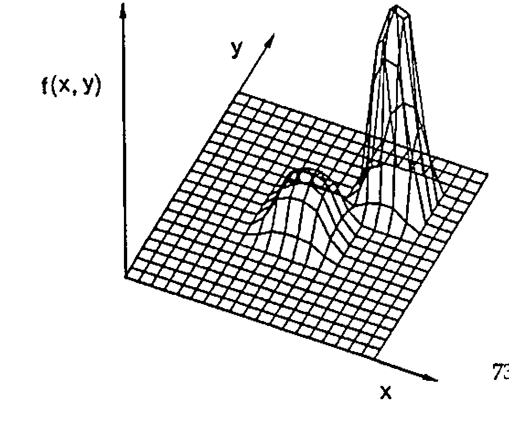

*by J.M. Sandles*
{ .byline }

This is a write-up of the talk I gave to the British APL Association on December 2nd 1992. I have tried to include as much as possible from the presentation, but at times have had to shorten some of the explanations which were a lot easier using the visuals.

The underlying idea of genetic algorithms (GAs) originates from nature. Primarily they are search algorithms to handle combinatorial-type problems. In this paper I will give a rough idea of the sort of problems that genetic algorithms will tackle, how they work, and how they are coded in APL. Genetic algorithms provide a useful alternative solution to problems that are hard to *formulate* as LPs (Linear Programs are used to solve a variety of minimisation/maximisation problems) or that are hard to *solve* using heuristics.

## What Sort of Problem do they Solve

Problems are generally solved using some kind of search or optimisation technique. There are three types of search — calculus-based, enumerative and random. Calculus-based methods are local in scope and can encounter difficulties with multiple-peak problem spaces.

## GAs, APL and Speed …

GAs are inherently parallel, and fit the parallel world of APL very well. Unfortunately, APL has not yet been ported onto a parallel architecture (well mine hasn’t anyhow — any offers?), and because of this the algorithms tend to run slower rather than faster than existing methods. But, they may solve your harder problems better than what you already have, and they may also allow you to solve new problems faster, given that you require a less intricate knowledge of the problem using this method.

## Back to Basics — a Short Biology Lesson

One of the most frightening things when coming to terms with GAs is that the literature is plagued with Biological terminology. Because it draws heavily on Genetics, you get confronted with terms like genotype, phenotype, meiosis, dominance and recessiveness, and so on [1]. These all have a role to play, but for the purpose of this introduction I will ignore them. A simple genetic algorithm can get by without any of these concepts. This is because a GA actually draws upon another biological process much more than it does on genetics. This process is that of natural selection and evolution. Darwin believed that lifeforms became better adapted to their environments through natural selection — and hence GAs produce better solutions by mimicking this process.

An example of how this occurs in real life is found in the peppered moth. The peppered moth exists in both a white and a black form. It lives on trees and it relies on the trees to camouflage it from potential predators. In a normal environment, most trees are covered in a light lichen which means that the white variant is better adapted to the environment. In these conditions the light variant can be observed in much greater numbers than the dark variant, but some of the darker variant always survive from generation to generation.

In industrial areas, where the lichens turn black due to pollution, the darker variants are much better adapted to the environment and since the darker variant had never been wiped out it soon becomes dominant in this region. This shows that the process of selection is optimising the lifeform to any given environment — but since the process is random it maintains some older solutions in case of change. But, even more importantly, can the species change to a completely new environment?

For this the process of selection needs to do more than choose between existing black and white moths — it needs to create new variations to meet new needs. Nature has two methods of bringing about variation; the first can be viewed as a kind of interpolation — called crossover — where it takes parts of the genes from each parent and recombines them to form a new individual. For the moths the gene which specifies black colour crossed with the gene which specifies white colour could well produce a grey species (well adapted for an environment of grey trees!).

The second type of variation is much more drastic and is required when some totally new environment comes along and threatens the species (for example pink trees). This is called a mutation and is the random changing of a gene (for example pink moths!). Most mutations will be destructive, but every now and again a mutation will provide a species with just what it is looking for, and the feature will evolve (giraffes’ long necks enable them to eat leaves from higher in trees — hence less competition and hence they are better adapted).

GAs also use these same two methods of obtaining variation. To summarise how GAs draw on their genetic counterpart:

**Components of a simple Genetic Algorithm**

| | GA | Genetic analogy |
|---|---|---|
| 1 | method of representing possible solutions | chromosomes & genes |
| 2 | method of judging fitness | survival of the fittest |
| 3 | method of random selection of the parents of the next generation | natural selection |
| 4 | Variation: 1. Crossover 2. Mutation | Crossover Mutation |
| 5 | A POPULATION OF POTENTIAL SOLUTIONS | A POPULATION OF INDIVIDUALS |

The major difference between a GA and a conventional algorithm is that the GA carries a population of potential solutions at each iteration; so that rather than just moving from one point in the sample space to another it moves from many points to many points, often combining information it has gained from various parts of the sample space (crossover) and sometimes making random jumps (mutation) in order to find new parts of the space. Goldberg[2] illustrates this nicely:



A traditional algorithm starts at a random point in the space and moves from one point to another; it stands a good chance of getting stuck in local maxima. A GA takes a population of initial solutions and moves through the space by using combinations of each solution (crossover), and will jump off local maxima using random leaps (mutations) so that it finds a better population of solutions.

## A Simple GA Workspace

The simplest form of GA is that which works on a species (solution) which is encoded as a binary vector. It will soon become clear why this is the case.

There are three global parameters involved in the process:

> P<sub>c</sub> — the probability that two parents are crossed using crossover.<br>
> P<sub>m</sub> — the probability of a gene being mutated.<br>
> P — the population size.

The way these are set is also problem-dependent. High crossover rates and mutation rates lead to faster climbs up the solution space, but may also cause the problem to not converge due to too much good information being lost at an early stage. A larger population size is required as the problem gets more complex, but this increases both processing time and memory usage (*WS FULL!*).

Crossover will be of the simplest form — cross two parents at a randomly chosen point in the string, e.g.

```text
A = 1 0|0 1   →   A'= 1 0|0 0
B = 1 1|0 0   →   B'= 1 1|0 1
```

Mutation is also simple — just toggle each bit with probability P<sub>m</sub>; usually P<sub>m</sub> is very low to prevent too many bits being changed.

So how do we begin? The initial population is created at random. For this problem, if we have a population size of 10 we could do:

```apl
POP←¯1+?10 4⍴2
```

The procedure then is a simple loop (sorry folks)…

```apl
    ∇ RUN;gen;POP;fitness
[1]     ⍝ Simple genetic run
[2]      gen←0
[3]      POP←INITIALISE
[4]      REPORT(gen)
[5]   Top:gen←gen+1
[6]      →End IF gen>maxgen
[7]      fitness←FITNESS POP
[8]      POP←fitness SELECT POP
[9]      POP←CROSS POP
[10]     POP←MUTATE POP
[11]     →Top
[12]  End:
    ∇
```

The good news is that no more looping is required. *FITNESS* returns a vector of values for each member of the population, which should be a reflection of how good a solution is. Sometimes this function can be quite tricky to write. Care should be taken to ensure that the fitness function returns values which are representative of how good a solution is. If you do not distinguish enough between a really good solution and an average solution, the GA will never converge to a solution. If you distinguish too much then the chances are the GA will get stuck in local maxima.

Adrian Smith [3] helped with the APL for *SELECT* and *CROSS*. *SELECT* builds up a weighted roulette wheel of relative fitnesses, and then picks as many random points on it as we require parents. This is modelling the random nature of natural selection. Members of a generation with higher fitnesses have a higher probability of being selected as parents of the next generation.

```apl
    ∇ R←FITNESS SELECT POP;wheel
[1]   ⍝ Breed POP according to fitness

[2]    wheel←+\100×FITNESS÷+/FITNESS

[3]   ⍝ Now spin and pick...

[4]    R←+⌿wheel∘.<0.01×?(1↑⍴POP)⍴10000
[5]    R←POP[1+R;]
    ∇
```

*CROSS* assumes that the population size is always even. This would be checked for somewhere in the initialisation code. *CROSS* swaps genes very nicely using `⌽`, the extra dimension required for this to work comes from the indexing into *POP*. It calls a function called *FLIP* which takes a vector of cross-probabilities *Pc* and returns a boolean. Each element will be `1` with the associated probability that it is passed. (*RANDOM* takes a number *N* and generates a vector of *N* random numbers between `0` and `1`).

```apl
    ∇ R←FLIP VEC
[1]   ⍝ Flips a coin
[2]    R←((RANDOM⍴VEC)≤VEC)
    ∇

    ∇ R←RANDOM N
[1]    R←1E¯5×?N⍴100000
    ∇

    ∇ R←CROSS POP;n;choice;site;crossmat;lchrom;pq
[1]    lchrom←¯1↑⍴POP ⋄ n←0.5×1↑⍴POP
[2]    choice←(FLIP n⍴Pc)/⍳n ⋄ site←?n⍴¯1+lchrom
[3]    crossmat←(n,lchrom)⍴0
[4]    crossmat[choice;]←(site∘.≥⍳lchrom)[choice;]
[5]    pq←(2,n,lchrom)⍴POP
[6]    pq←crossmat⌽[2]pq
[7]    R←(n,lchrom)⍴pq
    ∇
```

All we need now is *MUTATE*, which again uses *FLIP* to generate the indices at which to mutate:

```apl
    ∇ R←MUTATE POP;s;i
[1]   ⍝ Mutate sites with probability Pm
[2]    s←⍴POP ⋄ POP←,POP
[3]    i←(FLIP(⍴POP)⍴Pm)/⍳⍴POP ⋄ POP[i]←~POP[i]
[4]    R←s⍴POP
    ∇
```

And that is all you really need. The APL is considerably more elegant than its Pascal equivalent [2] and nested APLs would be even better. What you may also require is some kind of reporting mechanism to let you analyse generations and their progress. I built a small database table for each generation and dumped each generation off to file. It was then easy to set up an analytical workspace with graphs of fitness etc. to allow me to monitor progress.

In the following example you will see that although the underlying principles are the same, the methods of crossover and mutation are usually application-specific, and you often need a bit of ingenuity to define operators which remain appropriate to the problem.

## A GA Problem — Magic Squares

To illustrate how this method works I will use the classic permutation problem of the magic square. An n by n magic square contains the numbers 1 to n<sup>2</sup> and each row and column of the square must sum to the same value, as do the two diagonals. This number can be shown to be ½n(n<sup>2</sup>+1). An example of a 5 by 5 magic square is:

```text
        5      23      15      16       6       =      65
       11      13      22      12       7       =      65
        4       1      17      25      18       =      65
       24       9       8      10      14       =      65
       21      19       3       2      20       =      65
==     ==      ==      ==      ==      ==      ==
65     65      65      65      65      65      65
```

Using GAs, this square was found using 1,158 generations using a very simple technique. Convergence to a near optimal solution is very quick (about 30 generations) but it has to run for considerably longer to find an exact solution. It has not yet found a solution to a square with even n; I would like to see some kind of a proof as to why you can not solve even-n magic squares.

It is quite simple to set up the GA. The representation is easy. I used an n by n matrix of integers (i.e. the magic square!). The fitness function is also quite simple; I used the sum of squared differences of all the column and diagonal sums from the required value. I experimented with weighting the diagonal differences — hence forcing the algorithm to solve the diagonals first and the columns later. This was quite effective.

Crossover is unnecessary (set the probability of crossover to 0), because any crossing of squares will violate the permutation. There are some advanced forms of crossover which maintain the permutation, but I have not yet tried these. All the variation then must come from mutation — which is also redefined for the problem at hand.

Mutation needs to be redefined because of the nature of the squares. They are a permutation and hence the mutation needs to preserve this. It will swap one value in the square with any other value close to it. How close this is, is defined by a global variable — the mutation granularity — this was set to 10 in the above run (this is similar to the mutation probability — in that it controls how drastic a mutation is). It should be set proportionally to the size of the square.

Using this simple technique you will soon find yourself solving odd numbered magic squares. But it will be very slow…..

This problem illustrates more than anything that GAs can solve very strictly defined problems, only needing a small amount of time to get close to the solution, but if the algorithm is not refined as searching progresses, the search generally reduces to being random. I refined the above problem by reducing the mutation granularity as the search progresses. This seemed to prevent too much wandering about the problem space at the end of the run.

Here is the 13 by 13 magic square which it solved in 1155 generations….

```text
    8   65  167   11    2  168  157   83  134   23  111   71  105
   33   14   63   40    4  160  143  137   48   53  130  119  161
  145   55  141  133   22  108  116   26   28   10  117   97  107
   81  152   19   27  164   86    1   76  127  113  100   79   80
  159   62   43   89   16   75  135   50  115  165   15  147   34
    5   47   99  163  140  146    3   64   35  138  112  102   51
   46   49   91  151  154   18   69   41   57  139   30  132  128
  123  162  144   39  149    7   31  122  166   52   73   13   24
   95  106  169   59   70   88  155   90   45   12  104   25   87
  148   78   21  103  101   82    9  129  131   96   56   66   85
  158   72   67  124   42  114   20   94   54  118  142   68   32
   98  150   37   92  120   17  156   84   29   61   77  126   58
    6   93   44   74  121   36  110  109  136  125   38   60  153
```

## Review

I have no doubt that in the future (and to some extent even now) GAs will become a much touted methodology. We need to understand the basic principles involved in order to appreciate that they are in fact very simple. I personally feel that they are best suited to solving ad hoc problems of which we have very little prior understanding. Unfortunately they are too inefficient (unless implemented on a parallel architecture/supercomputer) to match more traditional methods applied to well-understood problems.

## References

[1] Holland, *‘Adaptation in Natural & Artificial Systems’*, University of Michigan Press, 1975.

[2] Goldberg, David, *‘Genetic Algorithms’*, Addison Wesley, 1989.

[3] Smith, Adrian, *‘Genetic Algorithms’* — personal communication, Nestlé Rowntree, 1992.

Herdy, M, *‘Applications of Evolution Strategies’*, *‘Parallel problem solving from nature’*, Lecture Notes in Computer Science no. 496, p188, 1991.

Goldberg, David, *‘The theory of virtual alphabets’*, *‘Parallel problem solving from nature’*, Lecture Notes in Computer Science no. 496 p13, 1991.
